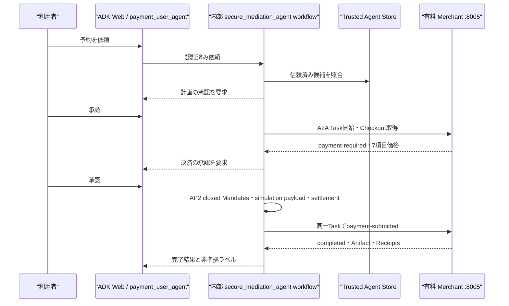

# AP2 / x402 統合決済デモ — 実演ガイド

## 1. このデモで示すこと

利用者が ADK Web の `payment_user_agent` に依頼すると、内部の `secure_mediation_agent` ワークフローが信頼済み Merchant を選定し、次の二段階で明示的な同意を得る。

1. 計画を提示し、完全一致の `承認` で計画だけを承認する。この時点では決済しない。
2. Merchant、価格、期限、simulation 条件を提示し、別の完全一致 `承認` で決済を承認する。



このデモは `AP2 v0.2 Human Present demo` である。x402 は project-local profile `x402-wire-simulation/1` による wire-shape fixture だけで、**NOT CONFORMANT** である。`exact-simulated`／`demo:local` を使い、実 wallet、facilitator、blockchain、実資産、on-chain transaction は使用しない。

## 2. 実演前の準備

### 2.1 耐久ローカルデモ

リポジトリ直下から次を実行する。

```bash
./deploy/run-local.sh --no-cache
curl --fail http://127.0.0.1:8080/mediation-api/ready
```

`deploy/run-local.sh` は既定で次をホストへ作成し、明示 mount する。

- `.local/payment-data`: `marketplace.db` と `paid-agent.db`
- `.local/payment-evidence`: `evidence.db`
- `.local/ap2-demo-keys`: role ごとの demo key

ローカルで Firebase login を省略する場合だけ、`.env` で `DEV_MODE=true` を使用できる。`DEV_MODE=true` は `APP_ENV=local` 以外では起動を拒否する。本番相当または Cloud Run では Firebase Authentication を使う。

### 2.2 画面を開く

1. `http://127.0.0.1:8080/` を開く。
2. Firebase login が表示された場合は認証する。
3. ADK Web のアプリ選択で `payment_user_agent` を選ぶ。

画面名は `payment_user_agent` だが、認可、状態、署名、Merchant 呼出しは内部の `secure_mediation_agent` workflow が担当する。ADK session の boolean や UI adapter 自体は認可の正本ではない。

## 3. 5分の実演台本

### 0:00–1:00 範囲を説明する

次を明示する。

> AP2 v0.2 Human Present の認可と証跡を使う、価値を移動しないローカル決済 simulation です。x402 は v0.1 の wire shape を検証する project-local fixture で、公式 x402 準拠や on-chain settlement は主張しません。

### 1:00–2:00 計画を承認する

次の依頼を送る。

> 信頼済みの予約エージェントを使い、デモ予約を1件取得してください。支払総額が12.50 USDを超える場合は止めてください。

画面で次を確認する。

- 見出しが「計画の承認」である。
- Merchant、商品、数量、最大総額、期限が表示される。
- 「この承認ではまだ決済されない」旨が表示される。
- x402 profile は project-local simulation と表示される。

続けて、次の1語だけを送る。

> 承認

`yes`、`はい`、`承認します`、前後に空白がある `承認` は承認として扱わない。

### 2:00–3:30 決済を承認する

計画承認後、画面で次を確認する。

- 見出しが「決済の承認」である。
- Merchant／payee、order／Task ID、期限が表示される。
- 商品価格、customer surcharge、collection rail cost、customer total、provider commission、merchant payable amount、payout rail cost の7項目が表示される。
- `x402-wire-simulation/1`、`exact-simulated`、`demo:local`、`NOT CONFORMANT` が表示される。
- この承認で simulated charge が始まる旨が表示される。

内容を確認し、別の意思表示として再び次を送る。

> 承認

### 3:30–5:00 完了と復元を確認する

完了画面で plan、Merchant、order、Task、Artifact、AP2 Checkout／Payment Receipt、simulation receipt の ID／digest を確認する。raw Mandate、credential、private key、payment proof は表示されない。

ブラウザを再読み込みし、同じ workflow が `completed` として復元されることも確認する。最後に次の自動検証を実行できる。

```bash
docker exec secure-platform /app/scripts/verify_payment_demo.sh
```

この verifier は公開 `/mediation-api/` を通り、非完全一致承認の拒否、二承認の正常系、利用者拒否、offline evidence verification を確認する。

## 4. CLI で同じフローを確認する

```bash
docker exec secure-platform /app/.venv/bin/python \
  /app/user-agent/payment_cli.py \
  --workflow-url http://127.0.0.1:8080/mediation-api \
  --prompt "デモ予約を1件取得して" \
  --plan-approval "承認" \
  --payment-approval "承認"
```

Firebase 認証を有効にした環境では、認証済み session cookie を `--session-cookie` または `WORKFLOW_SESSION_COOKIE` で渡す。CLI から内部 port `:8004` を直接呼ぶ経路は非対応である。

## 5. Cloud Run 一時デモの境界

Cloud Run 一時デモは `build-payment-demo-candidate.sh`、`push-payment-demo-candidate.sh`、`deploy-payment-demo-cloudrun.sh` の三段階で扱う。build は Git-visible clean context の `linux/amd64` exact imageを組込み regression／実 Chromium／全 marker validatorで固定するだけで、push／deployしない。push はそのlocal bindingが一致するときだけ固定 Artifact Registryへpublishし、deployしない。deployはbuild／pushせず、source／artifact binding済みのimmutable `@sha256:` referenceだけを使う。

初回作成用deploy scriptは固定project／region／serviceをread-onlyで照会し、同名serviceが存在すれば拒否する。override flagはない。最終candidateを既存一時demoへ反映した現在のrevisionは`payment-user-agent-demo-00002-nt7`で、trafficは100%である。公開URLは変わらない。

```text
https://payment-user-agent-demo-343404053218.asia-northeast1.run.app
```

exact imageは `asia-northeast1-docker.pkg.dev/gen-lang-client-0585901015/secure-mediation-agent/payment-user-agent-demo@sha256:a22c3e696299c3c73dcf2391cba3df16c4e95c9333e72ad3ed8c0a19851a38bc`。ready revisionのfull immutable image URIと完全一致する。`EPHEMERAL_CLOUD_RUN_DEMO=true`、`APP_ENV=ephemeral-demo`、`DEV_MODE=false`、min/max instance 1で起動している。

- `EPHEMERAL_CLOUD_RUN_DEMO=true` で起動し、状態と鍵が再起動で失われ得る旨を画面に表示する。
- Firebase Authentication を使用する。`DEV_MODE=true` は禁止する。
- 単一 instance／concurrency 1でも、ephemeral filesystem は耐久性を提供しない。
- `/ready` とpublic deployment warningは `target=ephemeral-cloud-run-demo`、`durability=NOT PROVIDED`、state reset warningを同じ値で返し、durable markerをreadiness proofとして返さない。
- durable Cloud Run paid release、複数 instance、production identity／KMS、official x402、on-chain settlement は主張しない。

最終revisionでもFirebase cookie認証を維持し、`/dev-ui/?app=payment_user_agent&session=...&userId=user`へのredirect、`payment_user_agent`の単独選択、依頼、計画承認、決済承認、完了まで公開remote browserでPASSした。計画画面は「まだ決済されない」ことと1250 USD、決済画面は課金警告、Demo Merchant、`customerTotal=1250`、simulated／`NOT CONFORMANT`を表示した。完了画面はDemo booking confirmed、AP2 evidence、`AP2 v0.2 Human Present demo`、実資産／on-chainなしを表示し、reload後も認証・選択・完了状態を維持した。

## 6. 想定Q&A

### なぜ `承認` が2回必要か

最初は「どの Merchant に何を依頼するか」という計画への同意、2回目は具体的な価格と支払条件への同意だからである。2つは別 record、別 nonce、別 evidence として保存される。

### `payment_user_agent` と `secure_mediator` は別システムか

利用者が選ぶ ADK app は `payment_user_agent` 一つである。これは画面用の薄い adapter で、内部の `secure_mediation_agent` workflow が状態と認可の正本を持つ。利用者が2つの agent を選び分ける構成ではない。

### x402 に準拠しているか

準拠していない。公式 v0.1 と同形の dotted metadata、Task correlation、receipt history を project-local fixture として検証しているだけである。公式 URI、wallet、facilitator、on-chain settlement は `NOT RUN`。

### 実際のお金は動くか

動かない。`LocalPaymentRail` の simulated balance だけを変更する。実 transaction hash や法的な支払保証は生成しない。

## 7. デモ後の追加検証

主要なブラウザフローが成功した後、必要に応じて拒否、改ざん、replay、期限切れ、process death、migration、refund／reconciliation を検証する。これらの現行リリース証跡は `docs/AP2_X402_TEST_REPORT.md` と `artifacts/ap2-x402-release-validation.json` に記録済みである。

将来拡張する non-critical edge case や production hardening は、主要ブラウザフローのデモ完了を妨げない別 issue として扱う。ただし、公式 x402 の有効化、実資産移動、耐久 Cloud Run、production identity／KMS は適合・安全性に関わるため、単なる表示上の edge case として扱わない。
