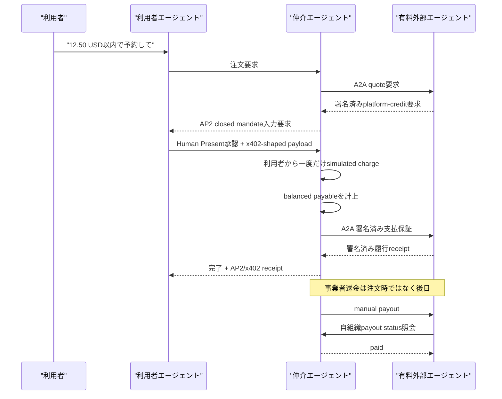

# AP2 / x402 Marketplace 決済仲介デモ 実演ガイド

## 1. このデモで伝えること

このデモは、利用者エージェントが外部の有料エージェントを直接決済するのではなく、仲介エージェントへ一度だけ支払い、仲介者が事業者への債務と支払保証を発行して後日精算する marketplace 型フローを示す。

実資産、実blockchain、実wallet、実Stripe、法的なpayment guaranteeは使用しない。`exact-simulated` / `demo:local` の固定残高と、`platform-credit` / `demo:mediation-ledger` の内部債務を使う再現可能なデモである。



## 2. 実演前の準備

推奨所要時間は10分。デモ前に新しいイメージと新しいcontainerを用意する。

```bash
docker build -t secure-a2a-payment-demo .
docker run -d --name secure-a2a-payment-demo -p 18080:8080 secure-a2a-payment-demo
curl --fail http://127.0.0.1:18080/payment/ready
curl --fail http://127.0.0.1:18080/paid-agent/ready
```

同名containerが既にある場合は、そのcontainerが削除可能なデモ用であることを確認してから作り直す。既存のDBを消してよいか不明な場合は別名を使う。

次の画面を開いておくと説明しやすい。

- ADK Web: `http://127.0.0.1:18080/`（ログイン後、`payment_user_agent`を選択）
- 仲介Agent Card: `http://127.0.0.1:18080/payment/.well-known/agent-card.json`
- 有料外部Agent Card: `http://127.0.0.1:18080/paid-agent/.well-known/agent-card.json`

## 3. 10分の実演台本

### 0:00–1:00 導入

話す内容:

> 有料エージェントへその場で二重に送金するデモではありません。App Storeと同様に、利用者から仲介者へ一度だけ回収し、事業者分は未払金として計上します。外部エージェントは、仲介者の署名済み支払保証を受けて履行し、実際の事業者精算は後から別処理で行います。

Agent Cardでは次を見せる。

- profile URIが両者で一致する。
- SDK package version `0.3.19` と wire `protocolVersion=0.3.0` が区別される。
- 仲介側は`exact-simulated`、外部agent側は`platform-credit`を宣言する。
- すべて`simulated=true`である。

### 1:00–4:00 正常購入

画面に出すプロンプト:

> 信頼済みの予約エージェントを使い、デモ予約を1件取得してください。支払総額が12.50 USDを超える場合は、承認前に止めてください。

ADK Webで`payment_user_agent`を選び、上のプロンプトを送る。利用者エージェントは仲介のA2A endpointへ接続し、受取人と7項目の価格内訳をチャットへ表示する。表示内容を確認して、次の1語だけを送る。

> 承認

`yes`は承認として扱わない。`承認`の完全一致時だけ、決定論的Trusted Surfaceがclosed mandateを作り、元のtask/contextへ決済を送信する。LLMは価格判定、署名、決済実行に関与しない。

CLIで同じ2ターンを自動実演する場合は次を実行する。

```bash
docker exec secure-a2a-payment-demo /app/.venv/bin/python \
  /app/user-agent/payment_cli.py \
  --mediator-url http://127.0.0.1:8004 \
  --prompt "デモ予約を1件取得して" \
  --approval "承認"
```

正常系、後日精算、失敗返金、timeout再照会をまとめて確認する場合は次を実行する。

```bash
docker exec secure-a2a-payment-demo /app/scripts/verify_payment_demo.sh
```

正常系で説明する観点:

1. 外部agentが仲介へ署名済みquoteをA2Aで返す。
2. 仲介は利用者agentへAP2 closed Checkout/Payment Mandateの承認材料を返す。
3. `payTo=mediation-platform`へ12.50 USD相当を一度だけchargeする。
4. 仲介の台帳で`Dr simulated_cash / Cr merchant_payable`を同額計上する。
5. 外部agentへ現金やcustomer proofを渡さず、`platform-credit`保証だけを渡す。
6. 外部agentの署名済みreceiptを検証して注文を`completed`にする。

### 4:00–5:30 後日精算

画面に出すプロンプト:

> 完了済み予約について、対象事業者の支払可能残高を確認し、運用者の明示操作として精算してください。

話す内容:

> 注文時の利用者課金と、事業者へのpayoutは別ライフサイクルです。初期手数料は0ですが、価格内訳にはcustomer surchargeとprovider commissionの独立項目があり、将来のversioned policyで非ゼロにできます。

確認する出力:

- `payoutState`が`paid`。
- 事業者はmerchant署名済みrequestで自組織のpayout状態を確認する。
- payout journalは`Dr merchant_payable / Cr simulated_cash`で均衡する。

### 5:30–7:00 履行失敗と全額返金

画面に出すプロンプト:

> 予約の履行が失敗した場合、成功扱いにせず、事業者への未払金を止めて利用者へ全額返金してください。

確認する出力:

- `failedState`が`refund_required`。
- `refundState`が`settled`。
- fee/costが0なので返金額は商品代金12.50 USDの全額。
- 元仕訳は変更せず、別の返金仕訳とreceiptが追加される。

### 7:00–8:30 タイムアウトと再照会

画面に出すプロンプト:

> 外部エージェントの応答がタイムアウトした場合、再課金や新しい保証を作らず、元の注文IDと保証IDで状態を照会して確定してください。

話す内容:

> タイムアウトは失敗とも成功とも推測しません。仲介は`reconciliation_required`に止まり、同じorder IDとguarantee IDで外部agentの正本状態を照会します。今回のfixtureでは外部agent側の履行commit後に応答だけが失われています。

確認する出力:

- `reconciledState`が`completed`。
- charge件数、rail operation、保証IDは増えない。
- merchant署名済みstatus/receiptだけで状態を進める。

### 8:30–10:00 再起動と境界

```bash
docker restart secure-a2a-payment-demo
curl --fail http://127.0.0.1:18080/payment/ready
curl --fail http://127.0.0.1:18080/paid-agent/ready
curl -i -X POST http://127.0.0.1:18080/payment/internal/v1/payouts
```

最後のrouteが`404`になること、再起動後も既存DBが残りreadinessが`200`になることを見せる。外部公開はnginxの8080だけで、operator route、merchantの署名生成route、fulfillment reconciliation routeは公開しない。

## 4. 出力の読み方

`verify_payment_demo.sh`の最終JSONは次の意味を持つ。

| Field | 見せる意味 |
|---|---|
| `happyState=completed` | 利用者課金、未払金、保証、履行が完了 |
| `payoutState=paid` | 注文とは別の事業者精算が完了 |
| `failedState=refund_required` | 履行失敗を成功扱いしていない |
| `refundState=settled` | 全額返金が完了 |
| `reconciledState=completed` | timeout後に再課金せずstatus照会で確定 |

台本とwire actionの機械判読版は`/app/scripts/payment_demo_scenarios.json`に同梱される。

## 5. 想定Q&A

### なぜ二段階の即時決済にしないのか

marketplaceの利用者に対する販売/回収主体を仲介者とし、事業者には内部債務を計上して後日精算できるため。注文時に利用者→仲介、仲介→事業者の二つの外部決済を同期実行する必要はない。

### x402はblockchain必須か

概念上のHTTP payment protocolとAP2は特定railに限定されない。一方、現時点で公開されているx402の相互運用実装はstablecoin/on-chain settlementを中心にしている。本デモはchainを使わず、将来`PaymentRail` adapterをStripe/card/bank/chainへ差し替える境界だけを示す。

### Stripeを使えるか

将来のcollection railとして追加できる。ただしStripe PaymentIntentやカード決済が、そのまま公開x402 ecosystemの`exact` settlementになるわけではない。実Stripeを追加する際はPCI/SCA、refund/chargeback、custody、KYC/AML、規制と会計を再要件化する。

### 手数料は取れるか

初期値は0。`merchandiseAmount`、`customerSurcharge`、`collectionRailCost`、`customerTotal`、`providerCommission`、`merchantPayableAmount`、`payoutRailCost`を分離しているため、負担主体、丸め、税務・会計を決めた新しいpricing policyを追加できる。

## 6. 現在のデモ範囲

- 単一customer、単一merchant、USD minor unit、固定商品。
- Human Present closed mandateのみ。
- local SQLite、固定の公開test HMAC vector、手動payout。
- 自然言語promptは実演上の意図表示であり、現行の保証対象は決定論的scriptからHTTP/A2A wireへの変換。
- Copilot/Gemini固有API、A2A 1.0、実Stripe、実chain、実wallet、実資産、dispute/chargebackは対象外。

この境界を説明せず、AP2/x402適合、本番決済、法的保証、blockchain不要の一般相互運用が完成したと表現してはならない。
