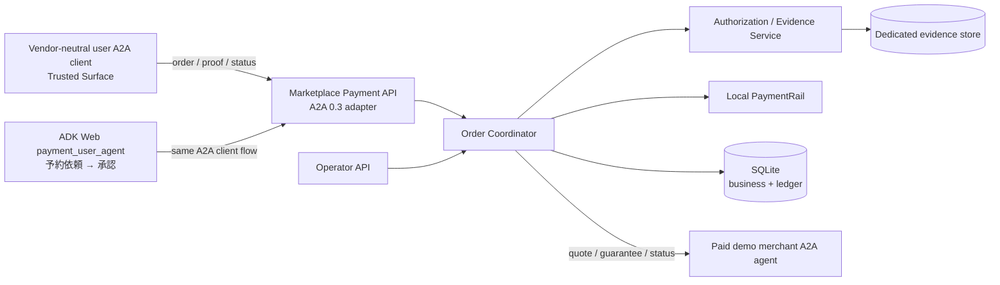
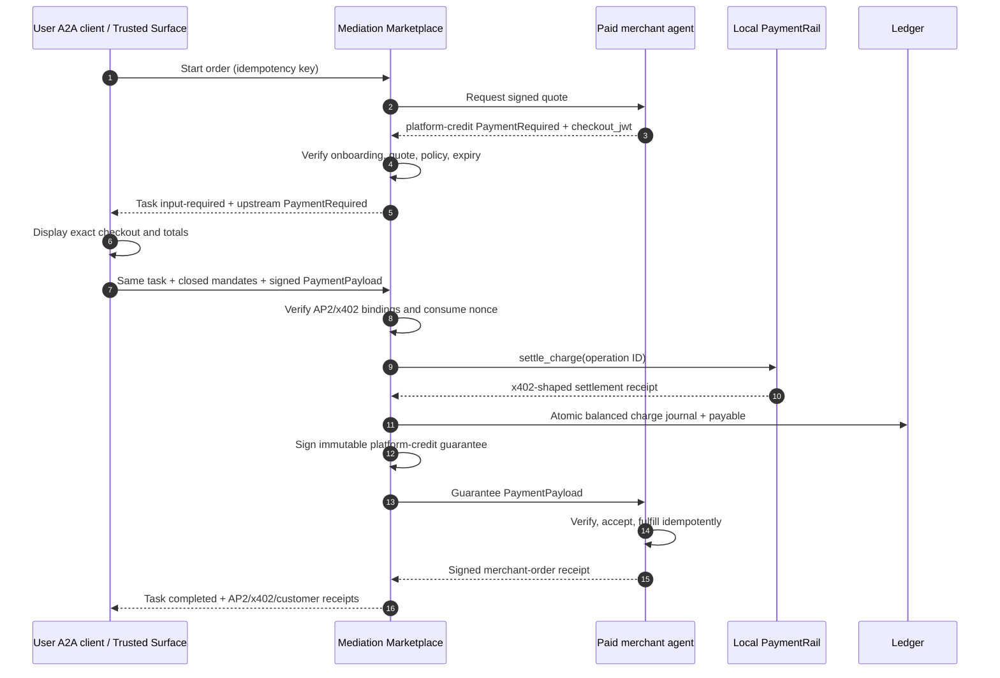
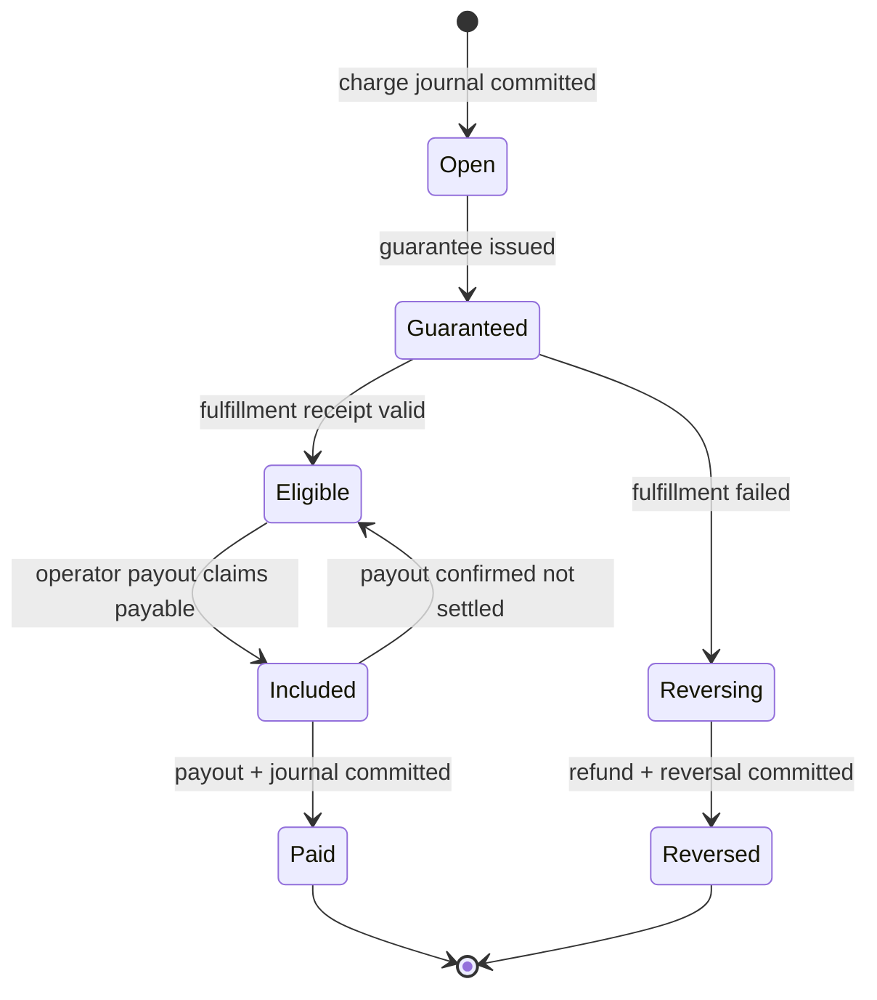
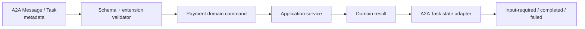

# AP2 / x402 Marketplace 決済仲介 設計書

> **文書状態:** 旧 marketplace-credit／manual payout 案の履歴設計であり、現行 `payment_user_agent`／内部 `secure_mediation_agent` 構成の設計ではない。現行設計は `AP2_X402_INTEGRATED_DESIGN.md` を参照する。

- 文書版: 1.2-implemented
- 作成日: 2026-08-15
- 対象要件: `docs/AP2_X402_REQUIREMENTS.md` v2.1
- 採用方式: App Store / marketplace 型の単一 upstream charge と deferred merchant payout

## 1. 設計判断

本デモは、ユーザー側 agent から仲介への一回だけのリアルタイム決済と、仲介が外部 merchant agent に負う payable を分離する。外部 agent へ二度目の即時決済を行わず、仲介署名の `platform-credit` guarantee を履行許可として渡す。後日の manual payout が payable を消し込む。

AP2 v0.2 と x402 v2 の概念を採用するが、両者の A2A binding、`exact-simulated`、`platform-credit`、HMAC 署名は `urn:secure-a2a:extensions:ap2-x402-marketplace:v1` 固有である。実資産、標準 x402 `exact` settlement、AP2 適合、法的な支払保証を表さない。

初期版は Human Present の closed Checkout/Payment Mandate だけを扱う。署名、価格、残高、状態遷移、ledger、冪等性は LLM から分離した決定論的サービスが処理する。

## 2. 全体構成



### 2.1 プロセスと port

| Process | Port | 責務 |
|---|---:|---|
| ADK web | 8000 | 既存仲介UIと`payment_user_agent`のチャットUI。payment domainの正本にはしない |
| Trusted Agent Store | 8001 | 既存 discovery/trust UI。MVP の固定 onboarding を参照可能にする |
| 既存 external agents | 8002 | 従来の非決済 agent。互換性を維持 |
| Firebase auth | 8003 | 既存 UI 認証 |
| Marketplace Payment API | 8004 | 仲介 Agent Card、注文、proof、status、refund、payout |
| Paid demo merchant | 8005 | payment-aware external agent、quote、guarantee、fulfillment、payout status |

nginx は customer/A2A 用 `/payment/` を 8004、`/paid-agent/` を 8005 に proxy する。operator route は nginx の外部公開対象から除外し、container 内部からだけ到達可能な8004番で、固定 `demo-operator` の署名済みrequestを検証する。customer と merchant も固定 test identity / onboarding key の署名から role/tenant を導出し、自己申告 actor header やAPIが新規発行するbearer credentialを認証に使用しない。

## 3. コンポーネント

### 3.1 Marketplace Payment API

- Agent Card と project-local extension negotiation
- A2A wire `protocolVersion=0.3.0` の request/task metadata と domain model の変換
- actor/tenant の認可、入力 schema、stable error envelope
- `input-required` challenge と同一 task の再開
- operator の manual refund/payout

`a2a-sdk==0.3.19` は adapter 層だけで利用する。domain/service/store は SDK の Pydantic model を参照しない。8004/8005は既存の `task_store=None` wrapperを流用せず、SQLite-backed TaskStore、`TaskStatusUpdateEvent(input-required)`、同一task/context resume、Task metadata永続化を持つ専用adapterとする。payment routeを既存orchestratorから物理的に分離し、proofが会話log/artifactへ入らないようにする。HTTP の簡易 demo endpoint と A2A endpoint は同じ application service を呼ぶ。

### 3.2 Order Coordinator

- merchant onboarding と quote を検証
- zero-fee pricing policy v1 を計算
- upstream challenge を発行
- proof verify → rail settle → balanced journal → guarantee → fulfillment を順序制御
- timeout を成功扱いせず reconciliation state へ移す
- terminal response に x402/AP2/customer receipt の参照を含める

### 3.3 Authorization / Evidence Service

- sorted compact UTF-8 JSON、SHA-256、HMAC-SHA256
- `kid`、issuer、audience、iat/exp、nonce、order/task/quote、amount/payTo/asset/network binding の検証
- exact `checkout_jwt` bytes と `checkout_hash` の照合
- raw mandate/proof/receipt/guarantee bytes を専用 table に保存
- business table へは evidence ID と digest だけを返す

AP2 object本体は公式v0.2 schemaに合わせる。Checkout Mandateは `vct`、base64url compact `checkout_jwt`、base64url SHA-256 `checkout_hash`、Payment Mandateは `vct`、同じhashを使う`transaction_id`、structured payee、integer amount/currency、instrument id/typeを持つ。project-local signer/audience/nonce/x402/order bindingは外側の `ap2.payment.authorization` に置き、AP2本体へ混在させない。

公開test vectorのHMAC key はデモ fixture であり本番secretではないが、API/log/Agent Card/LLM artifact に出さない。本番化では signer/verifier interface の実装を KMS と非対称鍵へ交換する。

### 3.4 Local PaymentRail

```python
class PaymentRail(Protocol):
    def capabilities(self) -> RailCapabilities: ...
    def verify(self, request: VerifyRequest) -> VerifyResult: ...
    def settle_charge(self, request: ChargeRequest) -> RailResult: ...
    def refund(self, request: RefundRequest) -> RailResult: ...
    def payout(self, request: PayoutRequest) -> RailResult: ...
    def get_operation(self, operation_id: str) -> RailResult: ...
```

初期実装は `demo-customer` の残高 100000、`mediation-platform` の残高0を DB row として保持する。nonce/idempotency を原子的に取得し、chargeはcustomerからplatform、refundはplatformからcustomer、payoutはplatformからmerchantへ両建て移動する。platform残高は負にしない。各rail operationにsource eventを持たせ、`platform rail balance = simulated_cash ledger balance` をreconcileする。`success`、`failed`、`unknown` を返せる fault injection を備え、常時成功 stub にしない。

### 3.5 Paid demo merchant

- Agent Card に `paid_booking`、`fulfillment_status`、`payout_status` を宣言
- 固定価格の署名済み checkout/quote requirement を返す
- `platform-credit` guarantee の mediator 署名、quote、order、merchant、payable、amount、expiry を検証
- `(order_id, guarantee_id)` を一意制約とし、副作用を一度だけ実行
- 署名済み merchant order receipt を返す
- failure/timeout fault fixture と状態照会を提供

merchant は customer proof や customer credential を受け取らない。仲介 guarantee と必要な order data だけを受け取る。

## 4. 注文シーケンス



### 4.1 失敗順序

- proof 不正・残高不足: charge を `failed`、order を `failed`。ledger/guarantee/fulfillment は作らない。
- rail 結果不明: charge/order を reconciliation required。settle を新規 ID で再送しない。
- settle 成功・journal 未commit: `charge-settled-unposted`。reconciler だけが同一 source event で posting する。
- guarantee 配信不明: 同じ guarantee ID と exact signed bytes を再送し、再署名しない。
- fulfillment failure/expiry: payable を hold し、payout 前の全額 refund workflow を開始する。
- payable計上後のmerchant停止/key失効、保証署名不能、未accept期限切れ、配信不能確定: orderを`refund_required`、payableを`reversing`へ進め、同じchargeへの全額補償を行う。

## 5. Payout と refund



Manual payout は内部route、固定`demo-operator` keyのrequest署名、操作理由、idempotency key を必須にし、eligible payable を同一 transaction で claim する。actor/reason/timeを監査する。timeout は `unknown` に固定し、rail operation query 後にのみ遷移する。merchant の署名済み payout query は自 merchant ID の record だけを返す。

MVP refund は payout 前・merchant 責任・全額・fee 0 のみ。customer rail refund と ledger reversal の結果を別 field で持つ。片側不明は `REFUND_UNKNOWN` とし、成功を推測しない。

## 6. 会計設計

全金額は USD minor-unit integer。`journal_transactions` 単位で同一 currency の debit 合計と credit 合計を commit 前に検証する。entry は更新・削除せず reversal を追記する。

| Event | Debit | Credit | Amount |
|---|---|---|---:|
| Charge（MVP） | `simulated_cash` | `merchant_payable:demo-merchant` | merchandise |
| Payout（MVP） | `merchant_payable:demo-merchant` | `simulated_cash` | payable |
| Refund before payout（MVP） | `merchant_payable:demo-merchant` | `simulated_cash` | merchandise |

非ゼロ provider commission は将来の charge journal で `simulated_cash` debit に対し payable と commission revenue を個別 credit する。customer surcharge、collection rail cost、payout rail cost も別 account とし、同じ cost を charge と payout の両方で認識しない。

## 7. 永続化

SQLite は WAL、foreign keys、busy timeout を有効にする。migration version は `schema_migrations` で管理する。

| Table | 主な column / 制約 |
|---|---|
| `orders` | id, customer_id, merchant_id, task_id, context_id, quote_id, state, version, timestamps; unique task/idempotency |
| `pricing` | order_id, policy_version, merchandise, surcharge, collection_cost, total, commission, payable, payout_cost, asset, decimals |
| `charges` | order_id, challenge_id, nonce, state, operation_id, proof_digest, receipt IDs; unique nonce/operation |
| `payables` | order_id, merchant_id, amount, state, guarantee_id, available_at, payout_id; unique order |
| `guarantees` | id, order_id, state, evidence_id, digest, exp; unique order |
| `fulfillments` | id, order_id, guarantee_id, state, merchant_receipt_id; unique order+guarantee |
| `refunds` | id, order_id, state, amount, operation_id, journal_id, idempotency hash |
| `payouts` | id, merchant_id, state, gross, cost, net, operation_id, receipt_id, idempotency hash |
| `payout_items` | payout_id, payable_id; unique payable_id |
| `journal_transactions` | id, event_type, source_id, currency, idempotency hash, committed_at; unique event+source |
| `journal_entries` | id, journal_id, account, side, amount, related_entry_id |
| `rail_accounts` | account_id, asset, balance, version |
| `rail_operations` | id, kind, state, amount, source_id, result/ref digest, attempt |
| `idempotency_records` | scope, actor, key, request_hash, response_json; unique scope+actor+key |
| `used_nonces` | issuer, nonce, digest, consumed_at; unique issuer+nonce |
| `evidence` | id, tenant_type/id, kind, exact_bytes BLOB, digest, kid, created_at |
| `state_events` | aggregate_type/id, from/to, actor, reason, sequence, timestamp |
| `merchant_onboarding` | merchant_id, status, key_id, endpoint, agreement/policy version, valid_from/to |

business/API response は evidence の exact bytes を返さず、ID/digest のみ返す。専用 operator debug endpoint も通常は digest までとする。

`evidence` はbusiness DBとは別のSQLite file、別Repository interface、別接続で管理し、application serviceからはwriteとdigest照会だけを許可する。exact bytes readは通常routeへ公開しない。デモではfile permissionを分離し、改変検知digestと削除/参照auditを記録する。本番は暗号化DBまたはenvelope encryptionへ交換する。

`orders` と各operationには `recovery_kind`、`resume_from_state`、`authoritative_operation_id`、`expected_success_state`、`expected_failure_state`、`lease_until`、`attempt` を保持する。reconcilerはこの情報で一つの正本だけを照会し、別種operationへ取り違えない。

## 8. Wire contract

### 8.1 Agent Card

仲介と merchant は `protocolVersion: "0.3.0"`、`capabilities.extensions[].uri` に profile URI、`required: true`、要件 Appendix A の params を返す。payment request は `X-A2A-Extensions` header の完全一致を必須とする。非決済 skill は header なしでも従来動作する。

### 8.2 A2A/domain adapter



metadata の top-level key は `x402.payment`、`ap2.payment`、`marketplace.payment` のみを正本とする。`payment-required` は `input-required`、proof は同 task ID の message、成功は `completed`、失敗は `failed` に写像する。domain error は Appendix A の stable code に正規化する。

retryable errorはterminal `failed`へ写像せず同じtaskの `input-required` または非終端 `working` を維持し、同一idempotency/operationでの再提示だけを許す。署名不正、replay、amount/payee不一致等のterminal拒否だけを `failed` とする。

### 8.3 HTTP demo API

| Method/path | Actor | 動作 |
|---|---|---|
| `GET /health` | public | liveness |
| `GET /ready` | public | DB/profile/onboarding/key/rail readiness |
| `GET /.well-known/agent-card.json` | public | 仲介 Agent Card |
| `POST /v1/orders` | signed fixed customer request | order 開始、quote 取得、challenge返却 |
| `POST /v1/orders/{id}/payment` | signed owning customer proof | closed mandates/proof、settle、履行 |
| `GET /v1/orders/{id}` | signed owning customer / operator | status と digest/receipt references |
| `POST /internal/v1/orders/{id}/refunds` | signed internal operator + reason | MVP full refund |
| `POST /internal/v1/payouts` | signed internal operator + reason | eligible payable の manual payout |
| `GET /v1/payouts/{id}` | signed owning merchant request | authoritative payout status |
| `POST /internal/v1/reconcile/{kind}/{id}` | signed internal operator + reason | 同一 operation の照会・再開 |

全mutationは`Idempotency-Key`を使用する。request署名はmethod、path、body digest、actor、nonce、timestampを拘束し、customer/merchant/operatorごとの固定test `kid` を検証する。nginxは`/internal/`をproxyしない。これはデモ認証であり、本番認証とは表示しない。既存Firebase/OIDCへ統合する場合も、検証済みclaimからrole/tenantを導出し、client指定headerを信頼しない。

## 9. セキュリティ

- JSON schema は未知 field の扱いを object ごとに固定し、payment signed object は fail closed。
- canonicalizer は duplicate key、float、NaN/Infinity、未知型を拒否。
- 時刻は注入可能な UTC clock、ID/nonce は production code では random、test では固定 generator。
- 外部 endpoint は onboarding allowlist と HTTPS を既定必須。DNS 解決後の loopback/private/link-local/metadata IP、redirect を拒否。`PAYMENT_DEMO_ALLOW_LOOPBACK=1` のとき固定 localhost merchant だけ許可。
- log は ID、state、amount、digest prefix のみ。authorization、HMAC key、raw proof、exact evidence を出さない。
- customer/merchant/operator の query、retry、error、evidence reference に同一 tenant policy を適用。
- state update は version compare-and-swap、nonce/idempotency/journal/payout claim は DB transaction と unique constraint で競合を拒否。

## 10. 回復と観測性

起動時 reconciler は非終端 state を列挙するが、自動で外部副作用を再実行しない。`unknown` は rail/merchant の authoritative operation/status query だけで解消する。charge settled・journalなしは同じ source ID の balanced journal を冪等 posting する。guarantee は保存済み exact bytes だけを再送する。

structured log/metric は `correlation_id`、order/task、merchant、operation、state transition、idempotency outcome、latency、error code を含む。秘密値は含めない。readiness は migration、fixture key metadata、profile config、active onboarding、rail account を検査する。

### 10.1 AP2 role mapping

| AP2 role | デモ実装 | Issuer / trust |
|---|---|---|
| Shopping Agent | user A2A test client | customer authorization署名を提示 |
| Trusted Surface | deterministic `trusted_surface.py` | checkout/priceを表示しcustomer test keyで外側authorizationを署名 |
| Merchant of record / payee | mediation marketplace | Payment Mandateのpayee、upstream chargeを受領 |
| Seller / service provider | paid demo merchant agent | checkout/quoteとorder receiptをmerchant keyで署名 |
| Credential Provider | Authorization Service | customer test key/instrumentとclosed mandateを検証 |
| Merchant Payment Processor | Local PaymentRail | settle後、mediator keyでAP2 Payment Receiptを発行 |

issuer、audience、kid、agreement versionはonboarding/key registryで固定し、merchant sellerとmarketplace payeeを混同しない。

## 11. 実装ファイル

```text
secure_mediation_agent/payment_marketplace/
  __init__.py
  api.py                 # FastAPI routes, exception mapping
  a2a_adapter.py         # SDK/wire 0.3 boundary and Agent Card
  config.py              # profile, actor, fixed demo policy
  models.py              # domain commands/results/envelopes
  canonical.py           # canonical JSON, digest, test signer
  store.py               # SQLite migrations/repositories/UoW
  rail.py                # PaymentRail + LocalSimulationRail
  ledger.py              # balanced journals and payable claims
  service.py             # order/refund/payout/reconcile use cases
  merchant_client.py     # allowlisted paid-agent client
  trusted_surface.py     # deterministic closed mandate builder

external-agents/paid-booking-agent/
  app.py                 # Agent Card, quote, guarantee, status
  models.py
  service.py

user-agent/
  agent.py               # ADK Web 2-turn chat（予約依頼 → 「承認」）
  payment_client.py      # vendor-neutral A2A client / Trusted Surface
  payment_cli.py         # deterministic terminal demo

tests/payment_marketplace/
  test_canonical.py
  test_service_api.py
  test_security_restart.py
  test_store_ledger_rail.py
  test_paid_agent.py
  test_user_agent.py

scripts/run_payment_demo.py
scripts/verify_payment_demo.sh
```

変更対象は加えて `pyproject.toml`（SDK pin）、`deploy/supervisord.conf`、`deploy/nginx.conf`、`Dockerfile`、README/運用文書。既存 payment 非対応 agent の実装・Agent Card は変更しない。

## 12. テスト設計

- unit: canonicalization、digest/sign/verify、price integer、state guard、ledger balance、rail balance、receipt cross-reference。
- service: happy path、insufficient funds、quote expiry、tamper、replay、idempotency conflict、fulfillment failure/refund、manual payout、unknown/reconcile。
- API/A2A: extension header、Agent Card、`input-required`→同 task resume、stable error、customer/merchant/operator isolation。
- security: unknown kid、expired signature、amount/payTo/audience mismatch、raw evidence/log absence、SSRF allow/deny。
- restart: file-backed SQLite を再 open し、order/status、nonce、idempotency、payable、payout を維持。
- regression: 既存 test suite、既存 non-payment Agent Card/route。
- container smoke: build/run、readiness、ADK agent discovery、`承認` client が order→payment→fulfillmentを実行し、scriptがpayout、別注文でfailure→refund、timeout→reconcileを確認。実chain/wallet/Stripe/Google API keyは不要。

## 13. 要件トレーサビリティ

| 設計領域 | 主な要件 |
|---|---|
| A2A/profile/API | FR-001〜007, FR-018〜025, COMP-001〜012, PROFILE-001〜017 |
| 認可/evidence | FR-021〜023, FR-062〜064, DATA-011〜018, SEC-001〜005, PROFILE-018〜025 |
| Pricing/ledger | FR-011〜017, FR-026〜030, FR-066, DATA-003〜006, DATA-015〜020 |
| Fulfillment | FR-028〜034, FR-065, STO/STP/STG/STF |
| Refund/payout | FR-035〜046, FR-067, STR/STY |
| Recovery/idempotency | FR-051〜056, NFR-001〜005, OPS-001〜005 |
| Security/tenancy | SEC-004〜014, ACC-023〜034 |

## 14. 未実装の拡張境界

Stripe/card/bank/on-chain x402 は `PaymentRail` の別実装として追加するが、実資産化前に custody、KYC/AML、PCI/SCA、consumer protection、refund/chargeback、reconciliation、法的 merchant agreement を再要件化する。HNP/open mandate、A2A 1.0、非ゼロ fee、scheduled payout、dispute/reserve/negative balance/write-off も同様に profile/policy/version と受入条件を更新してから実装する。
