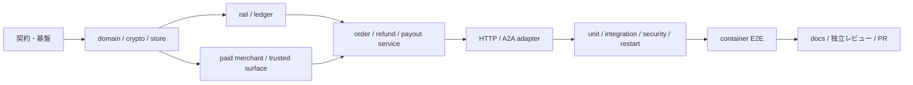

# AP2 / x402 Marketplace 決済仲介 実装計画

- 基準文書: `docs/AP2_X402_REQUIREMENTS.md` v2.2、`docs/AP2_X402_DESIGN.md` 1.1-reviewed
- 前提: 要件・設計レビューの P0 指摘は反映済み。以後の仕様差分は先に基準文書と traceability を更新する。
- MVP 固定値: `a2a-sdk==0.3.19`、wire `protocolVersion=0.3.0`、profile `urn:secure-a2a:extensions:ap2-x402-marketplace:v1`、USD/2 decimals、全 fee/cost 0、Human Present closed mandate、local simulation、manual payout。
- 完了の記録: 各項目は実装、対応テスト、レビュー証跡がそろった時だけ `[x]` にする。成果物欄にない既存非決済 agent / Agent Card は変更しない。

## 0. デモリリース実績（2026-08-15）

- 実装済み: 仲介決済service、paid external agent、zero-fee payable/guarantee/manual payout、refund/reconcile、A2A client、ADK Web `payment_user_agent`。
- 検証済み: payment suite `65 passed`、clean image build、Agent discovery、`承認`による実決済smoke、happy/payout・failure/refund・timeout/reconcile、公開internal routeの404遮断。
- リリース境界: 実資産を動かさないlocal simulation。下表のproduction hardeningを含む厳格なG4全項目は、デモ優先の判断により後続課題として残す。

## 1. 実装順とゲート

| Gate | 通過条件 |
|---|---|
| G0 契約固定 | profile、schema、状態、stable error、金額式、actor/tenant 境界が機械判読可能に定義される。 |
| G1 domain ready | canonicalization、永続化、state guard、rail、ledger の unit test が通る。 |
| G2 service ready | happy/failure/refund/payout/reconcile の integration test が通り、副作用が高々一回。 |
| G3 API ready | HTTP/A2A contract、認証・isolation、restart test が通る。 |
| G4 release ready | 既存回帰、container E2E、文書、独立レビュー、PR evidence がそろう。 |

## 2. MVP 実装チェックリスト

### Phase A — 契約と基盤（G0）

| Done | ID | 成果物 / 対象ファイル | 依存 | 完了条件 | 対応要件 / テスト |
|---|---|---|---|---|---|
| [ ] | MVP-001 | PR traceability matrix、`docs/AP2_X402_IMPLEMENTATION_PLAN.md` | なし | MVP/extended、要件→実装→テストの対応を固定し、未決事項を MVP default から逸脱させない。 | SCOPE-001〜004, ASM-001〜009 / 全 ACC |
| [ ] | MVP-002 | `pyproject.toml` | MVP-001 | `a2a-sdk==0.3.19` を厳密 pin し、pytest/HTTP/SQLite 実装に必要な依存を再現可能に install できる。 | COMP-001〜004 / ACC-025 |
| [ ] | MVP-003 | `secure_mediation_agent/payment_marketplace/{__init__,config,models}.py` | MVP-001 | profile/wire/SDK、zero-fee policy、USD minor unit、actor、全 state/error/receipt/envelope schema を version 付きで定義し、float・未知 version/state/code を拒否する。 | FR-011〜017, FR-060, DATA-001〜016, NFR-006/009, PROFILE-001〜017/022〜027 / schema unit |
| [ ] | MVP-004 | `secure_mediation_agent/payment_marketplace/canonical.py` | MVP-003 | sorted compact UTF-8 JSON、SHA-256、HS256、署名 field 除外、base64url、exact checkout hash を決定論的に実装し、duplicate key/float/NaN/Infinity/未知 kid を fail closed にする。 | FR-021〜023/062〜065, SEC-001〜004, PROFILE-015〜021 / ACC-026/027/034 |
| [ ] | MVP-005 | `secure_mediation_agent/payment_marketplace/store.py`、business/evidence SQLite migrations | MVP-003 | WAL/FK/busy-timeout、schema version、全設計 table/unique/CAS、UoW、別 evidence DB/接続/権限、監査を実装。business側 evidence intent/outbox→evidence idempotent durable write→business durable marker の順を採り、片側commit/orphanを回復でき、通常再起動で消去しない。 | ASM-002, DATA-001〜018, OPS-005/006/008/009 / migration・crash-point・persistence unit |
| [ ] | MVP-006 | `store.py` の state/idempotency/recovery repository | MVP-005 | Section 6 のみを許可する guard、scope+actor+key+request hash、nonce、lease/recovery/source-of-truth、append-only event を transaction と unique 制約で原子的に処理する。 | FR-051〜056, STO-001〜STY-005, SEC-005, NFR-001〜004 / ACC-010/011/017〜019/029 |

### Phase B — 決済 domain（G1）

| Done | ID | 成果物 / 対象ファイル | 依存 | 完了条件 | 対応要件 / テスト |
|---|---|---|---|---|---|
| [ ] | MVP-010 | `secure_mediation_agent/payment_marketplace/ledger.py` | MVP-003/005/006 | 追記型 balanced journal と payable claim を実装。charge、payout、refund の所定 Dr/Cr が同一 USD 金額で balance し、unbalanced/mixed currency/二重計上を拒否する。 | FR-011〜016/026/027/038/044/066, DATA-003〜006/015〜020 / ACC-003/004/009/013/015 |
| [ ] | MVP-011 | `secure_mediation_agent/payment_marketplace/rail.py` | MVP-003/005/006/010 | `PaymentRail` と local rail を実装。customer 100000/platform 0、原子的な charge/refund/payout、残高非負、operation query、test-only success/failed/unknown fault injection、rail↔cash reconciliation を備える。fault controlは外部routeへ出さずreadinessでtest modeを表示する。 | FR-057〜061/063/064, SEC-012, NFR-002/003/008 / ACC-008/022/027/028 |
| [ ] | MVP-012 | `store.py` onboarding seed、`merchant_client.py` | MVP-003〜006 | demo merchant の versioned onboarding/key/agreement/policy/endpoint を固定し、毎回 gate を再評価。HTTPS/DNS/redirect/host/port/IP を検査し、loopback は明示 demo allowlist の固定先だけ許可する。 | FR-004〜006/009/017, SEC-006/007/010, OPS-001 / ACC-005、SSRF test |
| [ ] | MVP-013 | `external-agents/paid-booking-agent/{app,models,service}.py` | MVP-004/012 | payment-aware Agent Card、署名 quote、guarantee 検証、`(order_id, guarantee_id)` 一意 fulfillment、署名 receipt、status/failure/timeout fixture、自己 tenant の payout poll を実装する。customer proof は受け取らない。 | FR-003/008/028〜032/067, COMP-011/012, PROFILE-012〜014/025 / ACC-002/010/011/030 |
| [ ] | MVP-014 | `secure_mediation_agent/payment_marketplace/trusted_surface.py` | MVP-003/004 | exact checkout と7金額を表示し、固定 identity/instrument/key/clock から closed Checkout/Payment Mandate と外側 authorization を生成する vendor-neutral fixture を実装する。 | ASM-009, FR-019/021/022/062, COMP-007/009, PROFILE-010/011/015〜017/021 / ACC-020/021/026 |

### Phase C — Use case と wire（G2/G3）

| Done | ID | 成果物 / 対象ファイル | 依存 | 完了条件 | 対応要件 / テスト |
|---|---|---|---|---|---|
| [ ] | MVP-020 | `secure_mediation_agent/payment_marketplace/service.py` order coordinator | MVP-004〜014 | quote検証→challenge→closed proof→settle→balanced payable→immutable guarantee→fulfillment→別 receipt の順を永続化。settle 前副作用なし、timeout は unknown/reconciliation、保存済み guarantee bytes だけ再送する。 | FR-008〜034/051〜065, STO/STC/STP/STG/STF, OBS-007 / ACC-001〜012/017〜019/027〜029 |
| [ ] | MVP-021 | `service.py` refund use case | MVP-020 | payout 前・merchant責任・merchandise全額・fee 0 のみ、rail result と reversal result を別管理し、同じ refund ID/key で reconcile する。 | SCOPE-002, FR-034/043〜046, STR-001〜005 / ACC-012/015/029 |
| [ ] | MVP-022 | `service.py` payout/reconcile use cases | MVP-010/011/013/020 | internal operator の明示操作だけで eligible payable を原子的 claim。timeout は同一 payout/operation/key を照会し、成功時だけ journal/receipt、merchant poll は正本 state を返す。 | FR-035〜042/051〜056/066/067, STY-001〜005, OPS-003/004 / ACC-013/014/018/029/030 |
| [ ] | MVP-023 | `secure_mediation_agent/payment_marketplace/a2a_adapter.py` | MVP-003/005/020〜022 | SDK型を domain から隔離し、SQLite-backed TaskStore、同一 task/context resume、Agent Card/header/metadata exact validation、required/submitted/completed mapping、retryable state、stable error mapping を実装する。 | FR-001〜003/018〜020, COMP-001〜007/009〜012/014, PROFILE-001〜011/026〜028 / ACC-020〜022/025/032/033 |
| [ ] | MVP-024 | `secure_mediation_agent/payment_marketplace/api.py` | MVP-005/020/021/022/023 | 設計 Section 8.3 の全 route、全 mutation の `Idempotency-Key`、method/path/body/actor/nonce/timeを拘束するcustomer/merchant/operator request署名、repository-level role/tenant filter、operator reason/audit、safe error を実装する。 | SEC-004/009〜014, OPS-001/002, PROFILE-026/027 / ACC-016/023/030 |
| [ ] | MVP-025 | `trusted_agent_store/app/{models.py,services/agent_registry.py,routers/agents.py}`、`secure_mediation_agent/{models.py,agent_registry.py}`、`secure_mediation_agent/subagents/{matching,planning,orchestration}_agent.py` | MVP-023 | payment extension/profile/version を Store→Matcher→Planner→Orchestrator で欠落させず typed data として保持し、proof/evidence は既存会話、sanitizer、Judge、artifact へ流さない。非決済 route の挙動は維持する。 | FR-002/007, SEC-008, COMP-008/013 / ACC-023/024/025/033 |
| [ ] | MVP-026 | `api.py`、`store.py`、logging/metrics hooks | MVP-005/006/020〜024 | `/health` と `/ready` を分離し、migration/key/profile/onboarding/railを検査。秘密なしの state/audit/correlation event と alert event を生成し、起動時は非終端列挙のみで盲目的副作用を行わない。 | OPS-001〜009, OBS-001〜008, NFR-004〜006 / readiness・recovery test |

## 3. MVP 検証チェックリスト

| Done | ID | 成果物 / 対象ファイル | 依存 | 完了条件 | 対応要件 / テスト |
|---|---|---|---|---|---|
| [ ] | TST-001 | `tests/payment_marketplace/test_canonical.py` | MVP-003/004 | key順/空白差、Unicode、digest/sign/verify、exact checkout bytes、receipt cross-reference、duplicate/float/unknown kid/tamper を網羅する。 | PROFILE-015〜025 / ACC-006/026/027/034 |
| [ ] | TST-002 | `tests/payment_marketplace/test_service.py` | MVP-006/010〜022 | pricing/state/ledger/rail の unit と、happy、残高不足、期限、失敗refund、manual payout、timeout/reconcile、並行/idempotency/replay を deterministic clock/ID/fault で検証する。 | FR-008〜067, Section 6 / ACC-001〜015/017〜019/028/029 |
| [ ] | TST-003 | `tests/payment_marketplace/test_paid_agent.py` | MVP-013/020 | quote/receipt signature、guarantee binding、fulfillment一回、failure/timeout/status、他merchant payout拒否を検証する。 | FR-003/008/031/032/067 / ACC-002/010/011/030 |
| [ ] | TST-004 | `tests/payment_marketplace/test_api.py` | MVP-023/024 | Agent Card exact params、activation header、metadata top-level shape、input-required→same task resume、receipt append-only、stable error、全 route/idempotencyに加え、merchant署名A2A request→仲介`payout_status`→自tenant正本state/他tenant`FORBIDDEN`を検証する。 | COMP-001〜012/014, PROFILE-001〜014/022〜028 / ACC-020〜022/025/027/030/032/033 |
| [ ] | TST-005 | `tests/payment_marketplace/test_security.py` | MVP-004/006/012/024〜026 | tamper/replay/unknown kid/expiry/audience/amount/payTo/asset、SSRF、operator token、tenant IDOR、並行競合、raw proof/secret の log/response/artifact 非存在を検証する。 | SEC-001〜014, DATA-013/017/018, OBS-006 / ACC-005〜008/016〜018/023/031/034 |
| [ ] | TST-006 | `tests/payment_marketplace/test_restart.py` | MVP-005/006/020/021/022/026 | 各非終端 stateとbusiness/evidence片側commitでDBをclose/reopenし、task/context、nonce、idempotency、rail、journal、guarantee bytes、payable/refund/payoutを保持して許可遷移だけ再開する。旧schema→現schema、migration途中失敗、backup/rollback、未知schema readiness拒否も検証する。 | FR-027/040/045/056/065, NFR-004, OPS-003/005 / ACC-009/010/014/019/029 |
| [ ] | TST-007 | 既存 test suite と regression fixture | MVP-001（baseline）、MVP-025（final） | G0時に既存suite baselineを記録し、最終時にStore/evaluationと非決済 matching/planning/orchestration/agent route が payment challenge なしで通り、既存 Agent Card を変更していない。 | FR-007, COMP-013 / ACC-024 |

## 4. Container E2E・文書・リリース（G4）

| Done | ID | 成果物 / 対象ファイル | 依存 | 完了条件 | 対応要件 / テスト |
|---|---|---|---|---|---|
| [ ] | REL-001 | `deploy/supervisord.conf`、`deploy/nginx.conf`、`deploy/start-nginx.sh`、`Dockerfile`、環境変数 sample | MVP-013/023/024/026 | 8004/8005を監視起動し、nginxは `/payment/` と `/paid-agent/` のみ公開、`/internal/` は非proxy。DB/evidence volume、file permission、必須 operator token、loopback demo allowlist を設定する。 | SEC-004/007/011〜014, OPS-001/006, NFR-008 |
| [ ] | REL-002 | `scripts/run_payment_demo.py` | TST-001〜006, REL-001 | vendor-neutral fixture が order→input-required→proof→fulfillment→status、operator payout/poll、別注文の failure→refund、unknown→reconcile を外部 network/LLM/API key なしで実行する。 | SCOPE-001/002, COMP-009, NFR-003/008 / ACC-001〜034 のE2E対象 |
| [ ] | REL-003 | `scripts/verify_payment_demo.sh`、`tests/payment_marketplace/test_e2e.py` | REL-002 | clean image build/run→ready→happy+payout→failure+refund→container restart→status/retry→journal/rail balance/secret scan→既存route smoke を一コマンドで pass し、結果を保存する。 | NFR-001〜008, OPS-001〜007, OBS-001〜008 / container E2E, ACC-001/013〜025/027〜031 |
| [ ] | REL-004 | `README.md`、payment demo/runbook 文書 | REL-003 | local起動、port/route、profile matrix、test-only disclaimer、操作例、reset、migration rollback、charge-settled-unposted/unknown/guarantee retry/refund/payout runbook、extendedとの境界を記載する。 | COMP-010/014, OPS-003〜009, PROFILE-028 |
| [ ] | REL-005 | 独立コードレビュー記録（PR review/checklist） | REL-003/004 | 実装担当者以外が要件trace、会計balance/一度だけ認識、state/source-of-truth、crypto exact bytes、secret/SSRF/IDOR、A2A wire、restart、container境界をレビューし、P0/P1を解消して再テストする。 | 全 MVP 要件 / TST-001〜007, REL-003 |
| [ ] | REL-006 | Git branch/commit と draft→ready PR | REL-005 | scope外変更と秘密がなく、PRに要件対応表、migration/rollback、実行コマンド、unit/integration/security/restart/regression/container E2E結果、既知のextended項目を添付し、必須check成功後readyにする。 | SCOPE-001/002, 全 MVP ACC / G0〜G4 |

## 5. Extended（MVP runtime・受入判定から除外）

以下は MVP の schema/state/interface を壊さない fixture または次版の再要件化タスクである。MVP の API/UI は未実装機能を完了済みと表示しない。

| Done | ID | 成果物 / 対象ファイル | 依存 | 完了条件 | 対応要件 / テスト |
|---|---|---|---|---|---|
| [ ] | EXT-001 | versioned state/data fixture | REL-006 | dispute、reserve、payout後refund、negative balance、recovery、write-off の record/state/関連entry境界だけを定義し、runtime mutation は `UNSUPPORTED` 相当で拒否する。 | SCOPE-003, FR-046, NG-009/014, OQ-005/006 / schema fixture test |
| [ ] | EXT-002 | scheduled payout policy fixture | EXT-001 | timezone/cutoff/minimum/hold/schedule の versioned policy と manual payout との境界を定義し、自動実行はしない。 | SCOPE-003, FR-035, OPS-004, OQ-003 / policy fixture test |
| [ ] | EXT-003 | non-zero pricing/ledger fixture | REL-006 | surcharge/commission/collection/payout cost の負担主体・rounding・accounting proposal と balanced journal fixture を作り、MVP zero policy は変更しない。 | ASM-008, DATA-019/020, NG-010, OQ-001/002 / future journal vectors |
| [ ] | EXT-004 | HNP/open/budget/rejection receipt proposal | REL-006 | 新profile、認可責任、budget/replay/rejection chain と受入条件を再要件化してから実装計画を作る。 | SCOPE-004, NG-013 |
| [ ] | EXT-005 | A2A 1.0 adapter proposal | REL-006 | 0.3 adapterを維持した別version境界、Agent Card/task mapping、互換性matrix、受入条件を定義する。 | COMP-003/004, NG-006 |
| [ ] | EXT-006 | production rail/key design | REL-006 | real rail/KMS追加前に custody、KYC/AML、PCI/SCA、規制、reconciliation、refund/chargeback、DRを再要件化し、simulation表示と物理分離する。 | NG-002〜005/012, Section 16 |

## 6. MVP 完了判定

- [ ] G0〜G4 がすべて通過し、ACC-001〜034 のうち MVP 対象が自動テストまたは明示的な検査証跡へ一対一以上で対応している。
- [ ] charge、payable、guarantee、fulfillment、refund、payout の順序と各 journal の debit=credit を保存済み audit/event から再構成できる。
- [ ] timeout/restart/parallel retry で追加の charge、ledger entry、guarantee bytes、fulfillment、refund、payout が生成されない。
- [ ] raw proof、exact evidence、test key、operator token、authorization header が source、Agent Card、LLM、artifact、通常 log/API response に存在しない。
- [ ] container 内の local simulation だけで happy/manual payout、failure/full refund、unknown/reconcile、restart、tenant isolation、既存非決済回帰が再現できる。
- [ ] Extended 項目は fixture/文書境界に留まり、MVP runtime または conformance/実決済の主張に混入していない。
