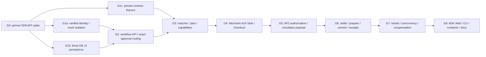

# AP2 v0.2 / A2A x402 v0.1 統合仲介 — 実装計画

- 文書版: 1.1-plan-reviewed
- 作成日: 2026-08-15 (Asia/Tokyo)
- 実装計画レビュー反映日: 2026-08-15 (Asia/Tokyo)
- 対象工程: Section 12 Step 6〜Step 7（実装計画とそのレビュー反映のみ。コード、DB、route、dependency は変更しない）
- 対象ブランチ: `codex/ap2-x402-integration`
- 規範入力:
  - `docs/AP2_X402_INTEGRATED_REQUIREMENTS.md` 1.1-reviewed
  - `docs/AP2_X402_REQUIREMENTS_REVIEW.md`
  - `docs/AP2_X402_INTEGRATED_DESIGN.md` 1.1-design-reviewed
  - `docs/AP2_X402_DESIGN_REVIEW.md`
- release target: explicit durable POSIX volume を使う single-host / single-container の simulation-only build

> **実装時の命名:** ADK Webで利用者が選ぶrootは`payment_user_agent`、認可と状態の正本は内部`secure_mediation_agent` workflowである。過去の要件・設計にある`secure_mediator` rootは論理的な仲介主体を指す。

## 1. 実装する範囲としない範囲

### 1.1 このリリースで実装するもの

利用者向け root を専用 `payment_user_agent` package の `payment_user_agent` 一つにし、ADK Web と CLI の双方を同じ `:8004` durable workflow API へ接続する。`secure_mediation_agent` はdiscoverable rootではなく内部workflow dependencyとして扱う。paid happy path は次の一つだけとする。

```text
request
  -> deterministic match / immutable plan
  -> 計画の承認（exact「承認」）
  -> Merchant A2A Task + signed Checkout + PaymentRequired
  -> 決済の承認（別の exact「承認」）
  -> AP2 v0.2 signed Human Present closed Mandates
  -> project-local scoped credential + synthetic simulation payload
  -> verify -> reversible prepare -> simulated settle -> commit
  -> signed Checkout Receipt + signed Payment Receipt
  -> project-local ordered settlement receipt history + Artifact
```

release fixture は一利用者、一 tenant、一 Merchant (`demo-merchant`)、一商品 (`demo-paid-booking`)、quantity 1、USD/2 decimals、`zero-fee-v1` に固定する。拒否、改ざん、replay、timeout、restart、並行実行、settle 後 commit failure、refund、reconciliation も release scope に含める。payment 非対応の既存 free workflow は同じ plan approval 後に既存 executor へ分岐し、payment approval を要求しない。

表示と runtime identity は次に固定する。

| 項目 | release の値 |
| --- | --- |
| AP2 | `AP2 v0.2 Human Present demo` |
| selected payment profile | `x402-wire-simulation/1` |
| selected extension URI | `urn:secure-a2a:extensions:x402-wire-simulation:v1` |
| wire fixture | `x402Version=1`, dotted sibling metadata, original Task correlation, ordered receipt history |
| rail | `exact-simulated` / `demo:local` / `USD`; synthetic proof/reference only |
| conformance label | `x402 v0.1 wire-shape test fixture (NOT CONFORMANT)` |
| official x402 | `DISABLED / NOT READY / NOT RUN` |

### 1.2 明示的に実装しないもの

- canonical x402 URI の runtime declaration/activation、official `exact` wallet payload、blockchain/token、facilitator、実 transaction hash、ACC-030 実行。
- current Cloud Run での integrated paid workflow。`deploy/deploy-cloudrun.sh` は durable backend がない限り paid enable を拒否する。
- production KMS/HSM、real identity enrollment、KYC/AML、PCI/SCA、mainnet、本番 TLS 適合認証。
- HNP/open Mandate、budget、split tender、FX、multi-merchant checkout、non-zero fee。
- marketplace-of-record、platform payee、guarantee、deferred payout、manual payout の新 flow への持込み。
- integrated image 内での `payment_demo_user_agent` または legacy `/payment/` path の flag 再有効化。

official profile についてこの release が実装するのは、定数、interface、readiness の fail-closed guard、simulation との相互拒否、conformance report の `NOT RUN` 行だけである。wallet/facilitator adapter の実装は別の要件承認後に行う。

## 2. リポジトリの基準点と置換箇所

2026-08-15 の inspection で確認した実装 baseline は次のとおり。これは pass 実績ではなく、計画作成時の静的 inventory である。

| 領域 | 現行 | この計画での扱い |
| --- | --- | --- |
| root / plan gate | `secure_mediation_agent/agent.py` の LLM tool が ADK session の `plan_approved=True` を設定し、`承認します`/`OK`/`はい` も instruction 上許可 | `SecureMediatorAdapter` と server-side exact dispatcher に置換。session boolean は authorization に使用しない |
| paid entry | `user-agent/agent.py` の `payment_demo_user_agent` が `:8004` を直接呼ぶ | ADK discovery と integrated image から除外。CLI は workflow API client に置換 |
| payment API | `payment_marketplace/api.py` の public `/v1/orders` と custom `/a2a data.action` | supervised/public runtime から除外。`:8004` は workflow API のみ |
| profile | combined URN、nested `x402.payment`、`x402Version: 2` | legacy read-only。新 A2A は project-local simulation URI と v1 dotted shape |
| AP2 | plain Mandate Content + outer HS256、custom receipt | pinned official SDK の signed presentations と canonical Receipt JWT に置換 |
| Merchant | HMAC Checkout、custom quote/fulfill、`merchant_quotes`/`merchant_fulfillments` | ES256 Checkout/Receipt、persistent A2A TaskStore v2、prepare/commit に置換 |
| payee / rail | customer -> platform charge、guarantee/payout | customer -> paid Merchant direct simulated transfer。guarantee/payout を新 flow で呼ばない |
| storage | `marketplace.db`、`evidence.db` schema v1、`paid-agent.db` 独自2表 | 同じ三 path を additive v2 migration。旧 row は `legacy-project-simulation` read-only |
| auth | `deploy/auth/verify.py` は 200/401 のみ、nginx は verified subject を渡さない | signed verified identity assertion、ADK body/path binding、CLI owner bindingを追加 |
| deployment | Docker が payment-only root を ADK scan directoryへ copy。Cloud Run/local とも DB volume なし | root 一つ、worker追加、明示volume/key mount必須。ephemeral paid readiness拒否 |
| tests | `tests/payment_marketplace` に 57 個の top-level `test_*`。旧 URN/v2/guarantee/payoutを期待 | 再利用可能な atomicity/rail/SSRF assertions を移植し、全 acceptance を新 suite へ割当てる。旧 pass 数を証拠にしない |

dependency baseline は `google-adk[a2a]==1.19.0`、`a2a-sdk==0.3.19`、lock 上 `pydantic==2.12.4`、`cryptography==46.0.3`、`python-jose==3.5.0` である。host は Python 3.9.6 で repository 要求の Python 3.12 と不一致、`uv`/`pytest` executable もないため、baseline と以降の再現試験は clean Python 3.12 container 内で行う。

## 3. 依存順序とリリースgate



| Gate | exit condition |
| --- | --- |
| G0 compatibility | AP2 SDK, A2A 0.3.19, ADK 1.19.0 executable spikes passし、resolved dependency diff、baseline regression manifest がreview済み。失敗時は domain 実装へ進まない |
| G1 foundation | forged identity tests、public route isolation skeleton、三DB empty/current/failure/reapply migration testsがpass |
| G1c contract freeze | G0で実行済みのAP2/A2A exact outputをfixture/manifest化し、source commit/hash、public keys、exact bytes/digests、A2A alias/Task behaviorがreview済み |
| G2 workflow skeleton | one authoritative workflow、CAS/event/outbox、exact dispatcherの分類、ADK/CLI共通viewが`planning`までpayment side effectなしで動く。実planとsigned approvalはまだ作らない |
| G3 plan gate | immutable JCS plan、ES256 plan authorization、primary nonce consume、operation/audience別 capability、free regressionがpass |
| G4 Merchant contract | simulation Card/activation echo、A2A `input-required` Task、ES256 Checkout、original requirements、persistent TaskStoreがpass |
| G5 AP2 authorization | two signed closed presentations、CP credential、synthetic payloadのexact evidence graphが完成するまで `payment_approved` が開かない |
| G6 paid vertical slice | payment-submitted、role verification、prepare/settle/commit、両AP2 Receipt、ordered simulation history、Artifactが同一Taskでpass |
| G7 resilience/security | bypass、rejection、tamper、replay、all-state restart、parallel duplicate、refund/reconcile、secret scanがpass |
| G8 release | 実ChromiumのADK Web、CLI、clean/migrated durable-volume container、route/readiness、baselineと同一の全regression manifest、machine-readable ACC matrix、docs、independent reviewがpass |

## 4. file単位の変更一覧

### 4.1 追加するproduction file

| path | responsibility |
| --- | --- |
| `secure_mediation_agent/web_app.py` | ADK FastAPI wrapper。verified identityとbody/path `user_id`をagent/session処理前に照合し、`/internal/execution/*`をloopback service-auth限定で提供 |
| `secure_mediation_agent/identity.py` | `VerifiedIdentity`、signed assertion verifier、one-tenant demo mapping、request context。raw tokenをstate/promptへ返さない |
| `secure_mediation_agent/execution_gateway.py` | strict `PlanProposal` と free execution port。payment object/evidence referenceをschemaで拒否 |
| `secure_mediation_agent/workflow/__init__.py` | public workflow package exportsのみ |
| `secure_mediation_agent/workflow/models.py` | frozen strict plan/workflow/approval/capability/public view/API DTO、state enum、seven-price model |
| `secure_mediation_agent/workflow/canonical.py` | RFC 8785 (`rfc8785==0.1.4`) plan/request canonicalization、float/duplicate-key拒否、SHA-256 helper |
| `secure_mediation_agent/workflow/errors.py` | requirements §9 の stable code catalog、safe envelope、HTTP/JSON-RPC deterministic mapping |
| `secure_mediation_agent/workflow/service_auth.py` | method/path/body digest/audience/operation/tenant/nonce/timeを拘束するES256 service JWSとevidence-read grant |
| `secure_mediation_agent/workflow/approval.py` | exact one-part dispatcher、plan authorization、primary nonce consume、downstream capability issue/verify |
| `secure_mediation_agent/workflow/matcher.py` | Store/onboarding/live Card/profile/trust/endpoint/SSRF eligibility と deterministic ordering |
| `secure_mediation_agent/workflow/planner.py` | `PlanProposal` port、trusted-field `PlanAssembler`、immutable snapshot/view生成 |
| `secure_mediation_agent/workflow/repository.py` | workflow v2 repository、CAS、nonce/idempotency、events/outbox/evidence intents、correlation graph |
| `secure_mediation_agent/workflow/migrations.py` | 三DB version 2 plan/apply/verify、backup manifest、legacy views、pre-cutover restore guard |
| `secure_mediation_agent/workflow/worker.py` | leased transactional outbox dispatcher、same-operation recovery、heartbeat |
| `secure_mediation_agent/workflow/controller.py` | transition table、paid/free branch、全gate、refund/reconcile coordination。state UPDATE の唯一のowner |
| `secure_mediation_agent/workflow/api.py` | `:8004` public workflow API、internal evidence/operator API、health/readiness、安全なerror handler |
| `secure_mediation_agent/workflow/views.py` | plan/payment/terminalの決定論的日本語display。raw evidenceを型として受けない |
| `secure_mediation_agent/workflow/client.py` | ADK/CLI共通workflow client。public nginx route、identity、idempotency、safe responseのみ |
| `secure_mediation_agent/workflow/observability.py` | allowlisted structured audit/log/metric/trace fields、redaction、alert events |
| `secure_mediation_agent/ap2/__init__.py` | AP2 role wrapper exportsのみ |
| `secure_mediation_agent/ap2/keys.py` | file-backed role別P-256 key provider、public JWKS/trust snapshot、rotation/revocation policy |
| `secure_mediation_agent/ap2/trusted_surface.py` | official SDKでCheckout/Payment closed presentationsを生成するnon-agentic typed boundary |
| `secure_mediation_agent/ap2/credential_provider.py` | Payment Mandate verification、project-local credential authorization/finalize、Error Payment Receipt |
| `secure_mediation_agent/ap2/receipts.py` | generated discriminated model + `create_jwt` によるCheckout/Payment Success/Error Receipt factory |
| `secure_mediation_agent/ap2/verification.py` | issuer/kid/aud/nonce/delegation/closed-leaf reference/trust snapshot/offline chain verifier |
| `secure_mediation_agent/ap2/mpp.py` | Mandate/credential/payload/attempt再検証、simulation settle、MPP Payment Receipt、refund/reconcile port |
| `secure_mediation_agent/payment_profiles/__init__.py` | selected profile exportsのみ |
| `secure_mediation_agent/payment_profiles/base.py` | `PaymentProfile`, `ProfileSigningService`, `RailAdapter`, readiness protocol |
| `secure_mediation_agent/payment_profiles/registry.py` | processごとに一profileだけload。fallback/URI混在をstartup errorにする |
| `secure_mediation_agent/payment_profiles/a2a.py` | A2A SDK modelを使うdotted metadata parser/builder、activation/echo、Task-state mapping |
| `secure_mediation_agent/payment_profiles/simulation_v1.py` | project-local URI、synthetic ES256 proof、customer→Merchant direct `LocalPaymentRail` adapter、simulation receipt |
| `secure_mediation_agent/payment_profiles/x402_v01.py` | canonical URI定数とrequired readiness項目だけを持つdisabled stub。adapter/wallet/facilitatorは実装しない |
| `external-agents/paid-booking-agent/task_store.py` | `a2a-sdk==0.3.19` persistent TaskStore、Task CAS、message/capability/idempotency、ordered history |
| `scripts/provision_ap2_demo_keys.py` | 一回限りのrole別P-256 key/manifest生成。既存keyをstartupで上書きしない |
| `scripts/migrate_ap2_x402_v2.py` | offline `plan|apply|verify|restore-pre-cutover` CLI。explicit三path以外を拒否 |
| `scripts/report_ap2_x402_conformance.py` | AP2、simulation wire、official enablement/wallet/facilitator/on-chainを別行で集計 |
| `scripts/run_regression_manifest.py` | G0 baselineとG8 finalで同一のsuite/command/environmentを実行し、unexpected skip/xfail/collection減少と差分をfailする |
| `scripts/validate_ap2_x402_release.py` | ACC-001〜035、test artifact、image/lock/spec/fixture/schema/migration digestを照合し、simulation releaseの必須statusを機械判定 |

### 4.2 追加するfixture／test file

| path | coverage |
| --- | --- |
| `tests/spikes/test_ap2_sdk_compat.py` | pinned SDK install/import、closed Mandate、Success/Error Receipt、exact reference |
| `tests/spikes/test_a2a_sdk_compat.py` | A2A models/aliases、custom context builder、extension echo、persistent TaskStore |
| `tests/spikes/test_adk_identity_compat.py` | ADK 1.19.0 body/path user interception、BaseAgent parts preservation、reconnect hook |
| `tests/fixtures/ap2_v02/manifest.json` | source commit/hash、SDK versions、fixture digests |
| `tests/fixtures/ap2_v02/public_jwks.json` | fixture verification public keys only |
| `tests/fixtures/ap2_v02/checkout_mandate_presentation.jwt` | signed closed Checkout fixture |
| `tests/fixtures/ap2_v02/payment_mandate_presentation.jwt` | signed closed Payment fixture |
| `tests/fixtures/ap2_v02/checkout_receipt_success.jwt` / `checkout_receipt_error.jwt` | canonical Checkout Receipt fixtures |
| `tests/fixtures/ap2_v02/payment_receipt_success.jwt` / `payment_receipt_error.jwt` | canonical Payment Receipt fixtures |
| `tests/fixtures/x402_v01/manifest.json` | pinned spec commit/hash と fixture digests |
| `tests/fixtures/x402_v01/agent_card_simulation.json` | project-local URIのみのCard |
| `tests/fixtures/x402_v01/payment_required_task.json` | v1 dotted PaymentRequired |
| `tests/fixtures/x402_v01/payment_submitted_message.json` | original Task submission |
| `tests/fixtures/x402_v01/payment_rejected_message.json` | original Task rejection |
| `tests/fixtures/x402_v01/payment_completed_task.json` / `payment_failed_task.json` | ordered full receipt history |
| `tests/workflow/test_models_and_canonical.py` | strict schema、JCS、digest、amount、immutability |
| `tests/workflow/test_state_and_approval.py` | transition table、two exact approvals、CAS、expiry |
| `tests/workflow/test_repository.py` | domain rows、nonce/idempotency/events/outbox/evidence intent |
| `tests/workflow/test_migrations.py` | empty/current/legacy-nonterminal/failure/reapply/backup/rollback |
| `tests/workflow/test_identity_and_api.py` | verified user/session/tenant、public API parity、safe errors |
| `tests/workflow/test_matcher_and_capabilities.py` | Store/Card/SSRF/profile、primary consume、scoped capabilities |
| `tests/workflow/test_worker_restart.py` | lease/outbox/evidence crash matrix と all-state restore |
| `tests/workflow/test_concurrency.py` | parallel approvals/messages/settle/commit/receipts |
| `tests/ap2/test_mandates.py` | official closed schemas、SD-JWT/delegation、tamper/expiry/revocation |
| `tests/ap2/test_role_verification_and_receipts.py` | Merchant/CP/MPP role checks とSuccess/Error Receipt issuer/reference |
| `tests/ap2/test_offline_evidence_chain.py` | plan→Checkout→Mandates→credential→attempt→Receipts offline再検証 |
| `tests/payment_profiles/test_simulation_v1_contract.py` | URI、activation、dotted v1 shape、rejection、errors、history |
| `tests/payment_profiles/test_profile_isolation.py` | simulation/official/legacy相互拒否、official NOT READY/NOT RUN |
| `tests/merchant/test_a2a_task_store.py` | initial reserved ID adapter、duplicate、context isolation、restart |
| `tests/merchant/test_prepare_commit.py` | reversible hold、settle前commit禁止、Receipt/Artifact exactly-once |
| `tests/integration/test_paid_workflow.py` | requestから二承認・completedまでのsingle-workflow E2E |
| `tests/integration/test_failure_rejection_compensation.py` | reject/fail/timeout/refund/reconcile branches |
| `tests/integration/test_free_workflow_regression.py` | payment非対応matching/planning/orchestration regression |
| `tests/security/test_bypass_matrix.py` | every start/submit/verify/settle/fulfill/internal/legacy entrypoint |
| `tests/security/test_output_redaction.py` | log/trace/error/prompt/A2A/Artifact secret scan、architecture imports |
| `tests/security/test_ssrf_and_tenant_isolation.py` | DNS/redirect/IP allowlist、IDOR、evidence grants |
| `tests/container/test_single_host_simulation.py` | clean/migrated volume、process restart、container recreation、route/readiness |
| `tests/container/test_cutover_recovery.py` | migration/apply/restore/cutover phaseごとのprocess/host-kill、三DB混在検出、journal resume、post-write restore拒否 |
| `tests/browser/test_adk_web_workflow.py` | public ingressから実Chromiumでroot選択、二承認、7価格、refresh/reconnect、terminal/error表示 |
| `tests/regression/suite_manifest.json` | G0/G8で同一に実行するroot payment/free、Trusted Agent Store、evaluation/agentのsuite、意図的skip、command、environment |
| `tests/fixtures/migrations/v1/manifest.json` とsanitized三DB fixture | 現行schema/checksum、legacy nonterminal、false approval、cross-store evidence referenceの再現 |
| `tests/traceability/test_release_manifest.py` | ACCの欠落/重複、status、test node ID、artifact digest、required suiteのskip/xfailをfail |

fixture private key はsourceへcommitしない。signed fixtureはpublic JWKSで検証可能なtest vectorとしてcommitし、runtime demo private keyは`/run/secrets`のoperator-generated fileだけを使う。

### 4.3 変更する既存file

| path | change |
| --- | --- |
| `pyproject.toml`, `uv.lock` | spike通過後だけ pinned AP2 Git source、`rfc8785==0.1.4`、直接importする`jwcrypto/cryptography`、pytest markersを反映。browser driverはproduction dependencyに入れず、digest固定のtest image/groupのPlaywright/Chromiumとして分離する。AP2 transitive pinとのlock差分を固定 |
| `payment_user_agent/{__init__.py,agent.py,agent.json}` | ADK discoveryに置く唯一の`payment_user_agent` root。内部`PaymentWorkflowAdapter`を公開し、承認分類・署名・状態の正本は持たない |
| `secure_mediation_agent/__init__.py` | 内部workflow packageとして維持し、通常のADK discoveryでは2個目のrootとして公開しない |
| `secure_mediation_agent/agent.py` | LLM root/toolから`PaymentWorkflowAdapter(BaseAgent)`へ置換。exact partsをworkflow APIへ転送し`PublicWorkflowView`だけ表示 |
| `secure_mediation_agent/agent.json` | 内部agent metadataとして、AP2 version／x402 extension version／A2A wire+SDK／simulation labelを別fieldで宣言。canonical x402 URIは入れない |
| `secure_mediation_agent/models.py` | legacy free modelsを保持し、payment authorityとして使わないことを明示。新plan型は`workflow/models.py`だけに置く |
| `secure_mediation_agent/subagents/planning_agent.py` | free-form Markdownをauthorizationから外し、safe `PlanProposal` generation adapterへ縮小 |
| `secure_mediation_agent/subagents/matching_agent.py` | LLM側はsafe候補説明だけ。paid eligibilityは`workflow/matcher.py`の結果のみを受ける |
| `secure_mediation_agent/subagents/orchestration_agent.py` | HTTP/A2A free pathを`FreeA2AExecutor`へ抽出し、boolean gateをworkflow capability gateへ置換。paid proofを受けるsignatureを持たせない |
| `secure_mediation_agent/payment_marketplace/store.py` | v1 legacy readerと共用SQLite primitivesを分離し、v2 DBをv1として再初期化しない。integrated authorityは`workflow/repository.py` |
| `secure_mediation_agent/payment_marketplace/rail.py` | storage protocolへ依存させ、explicit payer/payeeでdirect Merchant simulationを可能にする。legacy defaultは新profileから使用しない |
| `external-agents/paid-booking-agent/app.py` | SDK-based `/.well-known/agent-card.json`、`/a2a`、health/readyだけに縮小。activation/service identity/capabilityをTask作成前に検証しecho |
| `external-agents/paid-booking-agent/models.py` | legacy guarantee modelsをselected-profile A2A/AP2 project metadata/prepare-commit DTOへ置換 |
| `external-agents/paid-booking-agent/service.py` | ES256 Checkout/Checkout Receipt、Mandate+credential+payload verification、prepare/commit、Task serviceへ置換 |
| `trusted_agent_store/app/services/agent_registry.py` | Merchant/payee、Card/endpoint、product/skill、profile URI、scheme/network/asset、trust key set、CP/MPP relation、validity/versionをstrict record化 |
| `trusted_agent_store/app/routers/agents.py` | authorization用onboarding viewをtyped responseで返し、secret/private keyを受付・返却しない |
| `trusted_agent_store/data/agents/registered-agents.json` | `paid_booking_agent`をsimulation profile一件だけのonboardingへ更新。old URN/platform-credit/payout skillを除去 |
| `user-agent/payment_cli.py` | `workflow.client`を使うrequest/status/message/cancel CLIへ置換。public authenticated `/mediation-api/`だけを使用 |
| `user-agent/payment_client.py` | deprecated import shim。direct `:8004/a2a`、Trusted Surface construction、`strip()` approvalを削除 |
| `user-agent/agent.py` | legacy-only注記を追加し、integrated image/ADK discoveryから除外。新workflowの入口にはしない |
| `deploy/auth/verify.py` | fixed DEV identityまたはverified Firebase subjectから短命signed identity assertionを返す。email/tokenをlogしない |
| `deploy/nginx.conf` | caller identity headerを消去後auth resultを注入。`/mediation-api/`を認証公開し、internal/legacy/CP/MPP/signer/operator routeを404。Merchant A2Aはgate付きで限定公開 |
| `deploy/supervisord.conf` | custom ADK ASGI、workflow API、worker、Merchantを起動。legacy marketplace API/rootを起動しない。role別key/pathを最小mount |
| `deploy/start.sh` | writer起動前にexplicit三path/mount/key/migration verificationを実行。失敗時supervisorを起動しない |
| `deploy/start-nginx.sh` | workflow API、Merchant、worker heartbeat/readinessを待ち、port openだけでreadyとしない |
| `deploy/run-local.sh` | hostの明示data/evidence/secret directoryを`--mount`し、volumeなし起動を拒否。再作成testで同じmountを再利用 |
| `deploy/deploy-cloudrun.sh` | durable backend未設定の現状ではintegrated paid enableを明示的に拒否し、free-only deploymentだけを許可 |
| `Dockerfile` | payment-only root copyを削除、custom app/worker/scriptsをcopy、data/evidence directoryを分離。imageへprivate keyをcopyしない |
| `.env_sample` | selected profile、explicit DB/mount、fixed demo identity、key path、legacy-disabled、official-disabled fieldsと警告を追加 |
| `scripts/run_payment_demo.py` | legacy order/payout demoからsingle workflowのhappy/failure/reject/refund/reconcile fixtureへ置換 |
| `scripts/verify_payment_demo.sh` | durable mounts、migration、two approvals、restart/recreate、route isolation、secret/conformance scanのone-command gateへ置換 |
| `README.md`, `docs/AP2_X402_DEMO_GUIDE.md`, `docs/AP2_X402_RUNBOOK.md`, `docs/LOCAL_DEVELOPMENT.md` | single-root操作、二承認、simulation labels、volume/key provision、migration/rollback、official/Cloud Run blockersを記載 |

### 4.4 廃止／runtimeから除外するfileとcontract

次はsourceまたはread-only dataを当面保持してよいが、integrated imageのroute、supervisor、ADK discovery、documented CLI、release testの成功pathから除外する。

| deprecated target | disposition |
| --- | --- |
| `secure_mediation_agent/payment_marketplace/api.py` | legacy `/v1/orders`, `/payment`, custom `/a2a` server。supervisor/nginxから除外し、新workflowからimportしない |
| `secure_mediation_agent/payment_marketplace/service.py` | platform-payee/guarantee/payable/payout coordinator。legacy rowsのread/export/reconcile referenceのみ |
| `payment_marketplace/{a2a_adapter.py,auth.py,config.py,models.py,trusted_surface.py,ledger.py,merchant_client.py}` | old combined URN、HS256、custom wire、marketplace ledgerをlegacy namespaceとして隔離。新object生成には使用しない |
| `user-agent/agent.py` | `payment_demo_user_agent`。DockerのADK scan copyを削除し、same-image flagで復活させない |
| Merchant `/v1/quotes`, `/v1/fulfillments`, `/v1/payout-status-requests`, custom `data.action` | `app.py`から削除し、nginx 404。新A2A Messageへ暗黙変換しない |
| `urn:secure-a2a:extensions:ap2-x402-marketplace:v1`, nested `x402.payment`, `x402Version:2`, platform-credit guarantee/payout | v1 DB read-only label `legacy-project-simulation`。new endpointでは`UNSUPPORTED_LEGACY_PROFILE` |
| current `tests/payment_marketplace/test_{canonical,paid_agent,security_restart,service_api,store_ledger_rail,user_agent}.py` | reusable assertionsを新suiteへ移植後に`tests/legacy_payment_marketplace/`へ移動するか削除。旧expectationをintegrated release gateに数えない |

legacy operator testを残す場合だけ、別test image/process、三DBのv1 copy、loopback-only route、統合rail/keyなしで`legacy_payment` markerに置く。integrated imageにはlegacy enable flagを設けない。

## 5. 作業パッケージとvertical slice

### WP-00 — 実行可能な互換性spike（G0、最初の必須作業）

依存: なし。見積: compatibility spike 3–5 person-days + fixture/manifest freeze 4–6 person-days（合計7–11 person-days）。G0 compatibility exit後、fixture/manifest freezeはWP-01/WP-02と並行可。

1. clean Python 3.12 builderで現行lockからbaseline imageをbuildする。`tests/payment_marketplace` の現行57 test functionだけでなく、rootから収集可能な非決済agent/Storeと、現行各subprojectが独自に実行するunit/integration suiteを`tests/regression/suite_manifest.json`にcommandとともに固定して実行する。pass/fail/skip/xfail/collected count、command、environment、image digestをbaseline artifactへ保存し、live API/key依存の意図的skipだけをID付きallowlistにする。過去の`65 passed`を流用しない。
2. AP2 commit `e1ea56db72a6385bce3e5c1112b3a56ce60acb43` のPython SDKをPEP 508 Git sourceとして一時lockし、spec hash `32c3...f1e6aa3` を検査する。root/subdirectory install位置は実際にimportできた形をlockとmanifestへ記録する。
3. P-256/ES256でdemo User Credential/holder delegationを作り、official generated modelsと`MandateClient`で別audience/nonceのclosed Checkout/Payment presentationsをcreate/present/verifyする。`checkout_jwt` exact UTF-8 hash、closed leaf reference、tamper/expiry/wrong audienceも実行する。
4. generated Checkout/Payment ReceiptのSuccess/Error全variantをrole別issuer/kidで構築し、`create_jwt`とindependent verifierで検証する。`ReceiptClient` convenience defaultをissuer authorityにしないことをtestで固定する。
5. `a2a-sdk==0.3.19`で`AgentCard`, `Message`, `Task`, `TaskStatus`, `Artifact`のcamelCase wire round-trip、`ServerCallContext.requested_extensions`、`RequestContext.add_activated_extension()` echoを実行する。
6. 初回Messageの標準`taskId`を省略し、signed start capability内の予約IDをcustom `AuthorizedRequestContextBuilder`が検証後に`RequestContext.task_id`へ設定できることを確認する。unknown ID、duplicate initial Message、restart後`tasks/get`も確認する。
7. ADK 1.19.0 custom ASGI wrapperがbody/pathの`user_id`をsession/runner処理前に拒否でき、`BaseAgent`へsingle/multi-partを変更せず渡せることを確認する。
8. `uv.lock`候補の差分を確認する。設計で予測した`pydantic 2.12.5`、`cryptography 46.0.5`、`jwcrypto 1.5.6`、`sd-jwt 0.10.4`と実解決が異なる場合、理由とregression影響を記録する。

G0 compatibility exit: 三つのspike testがpassし、baseline regression manifestの全command/resultと現行dependency差分が説明できること。必須suiteのcollection error、unexpected skip/xfail、未説明failureがある場合はG0を開けない。spike失敗時はwire/schemaを独自実装して回避せず、reviewed designへ戻し blocker として再レビューする。

G1c fixture exit: G0で実行したexact outputのみをpinned source/hash/public key付きfixtureへ固定し、全fixture digest、schema validation、public keyによるverification commandがpassする。fixture private keyは保存/commitせず、regenerationが必要な場合は新しいephemeral test key/output/digestをG1c reviewへ再提出する。WP-04/WP-05/WP-06はこのexit前にfixture/APIを推測して実装しない。

### WP-01 — identity とroute isolation（G1a）

依存: WP-00 G0 compatibility exit。見積: 4–6 person-days。

- auth serviceは`sub`, mapped `tenant/customer`, `iat/exp`, `aud`, nonceだけを持つsigned assertionを返す。DEVは固定`demo-customer`だけで、request header/bodyからsubjectを選ばない。
- nginxはincoming `X-Verified-*` / service headerを必ず空にしてauth subrequestの値だけを設定する。
- ADK wrapperはpath/body/sessionのuserをassertionへ完全照合し、不一致をLLM/ADK session service前に403にする。
- CLIはnginxのauthenticated `/mediation-api/`だけを呼び、localhost `:8004`をdocumentしない。
- agent processへAP2/CP/MPP/Merchant/simulation private keyをmountしない。必要ならadapter service-auth keyだけを別authorityで与える。
- forged header/body user、expired assertion、session crossover、DEV spoof、public internal routeを副作用0件でtestする。

exit: identity negative testsとroute 404 skeletonがpassするまでplan/payment signing implementationを開始しない。

### WP-02 — 三DB v2 migration とdurable primitives（G1b）

依存: WP-00 G0 compatibility exit。WP-01とWP-00 fixture/manifest freezeに並行可。見積: 8–12 person-days。

- §6のmigration/cutover手順を先にtest化する。
- `marketplace.db`へworkflow/approval/capability/task mirror/requirements/artifacts/attempts/receipts/fulfillment/refund/reconcile/idempotency/events/outbox/evidence-intent/trust tablesをadditive作成する。
- `evidence.db.evidence`へ`media_type`, `profile_id`, `retention_class`をguarded追加し、existing exact BLOB/immutable triggerを維持する。
- `paid-agent.db`へschema migration tableとpersistent A2A Task/Message/requirements/operation/receipt/capability tablesをadditive作成する。
- `BEGIN IMMEDIATE`, WAL, `synchronous=FULL`, FK, busy timeout, version CAS、partial unique、append-only triggerを実装する。
- evidence intentの二DB commit/reconcileと、外部handoff不明時の`reconciliation_required`をfault injectionする。
- 三DBのbackup/apply/verify/restoreの各phaseをdurable cutover journalとmanifestにfsyncし、host/process kill後は新旧schema混在のままtrafficを開けず同じmigration IDのresume/restoreを完了させる。
- v2のaccepted write前にrelease image digest、lock/spec/fixture/schema checksum、migration IDをcutover manifestへ固定し、post-write rollback先は同じv2 schema range/checksumを読めるimageに限る。

exit: empty DB、sanitized現行三DB fixture、全legacy nonterminal、apply/verify/restore全phaseの途丬kill、再適用、pre-cutover restore resume、post-write rollback/schema-compatibility guardがpassする。

### WP-03 — workflowの骨格と共通adapter（G2）

依存: WP-01, WP-02。見積: 6–9 person-days。

- `WorkflowController.transition(workflow_id, expected_version, event)`だけがstateを更新し、eventと次outboxを同一transactionに入れる。
- reviewed stateにinternal `payment_authorizing`を加え、public viewの型に`決済承認済み・認可証跡生成中`を定義する。G2では未だ実際のpayment approvalからそのstateへ進めない。
- public APIは`POST /v1/workflows`、`POST /v1/workflows/{id}/messages`、`GET /v1/workflows/{id}`、`GET /v1/sessions/{sessionId}/active-workflow`、`POST /v1/workflows/{id}/cancel`に限定する。
- operator APIは`POST /internal/v1/workflows/{id}/refund`と`POST /internal/v1/workflows/{id}/reconcile`、evidence APIは`GET /internal/v1/evidence/{evidenceId}`に限定し、nginxへ公開しない。
- dispatcherはdecoded Python `str`の一partが完全一致`承認`/`拒否`かだけを見る。trim、normalization、join、LLM intentを使わない。
- ADK adapterとCLI clientは同じmessage endpoint、workflow version、error catalog、view DTOを使う。実ブラウザdisplayのrelease gateはWP-09で行う。

vertical slice A: 有料／無料共通のrequestをdurable `request_received` → `planning`まで進め、restart後に同じrequest／workflowを復元する。dispatcherはfixture stateでexact／non-exactの分類だけをtestし、実plan、approval record／signature、Merchant side effectは0件とする。

### WP-04 — 決定論的なmatch、plan、authorization（G3）

依存: WP-03、WP-00 G1c fixture exit。見積: 7–10 person-days。

- LLM `PlanProposal`はgoal summary、step description、candidate agent/skill IDだけ。amount/payee/profile/endpoint/keyは`PlanAssembler`がtyped requestとverified onboardingから設定する。
- Appendix Aをfrozen Pydantic strict modelで構築し、RFC 8785 bytes/digestをevidenceに保存する。Markdownは同snapshotのviewだけにする。
- paid matcherはactive/trust/validity/product/skill/profile/URI/scheme/network/asset/payTo policy/endpoint DNS-IP/Card digestを順にfail closedで検査する。
- plan exact approvalでprimary nonceを一度だけconsumeし、ES256 Plan Authorizationを保存する。そのtoken自体を下流へ渡さない。
- start/Trusted Surface/CP/sign/credential-finalize/submit/settle/prepare/commit/refund/reconcileごとに別`jti/nonce/aud/operation/exp/request hash`のcapabilityの型とissuer/verifierを実装する。発行は§7.4の前提が成立した段階だけでjust-in-timeに行い、plan approval時に後段capabilityを一括pre-issueしない。
- free branchは同じsigned plan approval後、keyless free capabilityで既存executor/anomaly/final validationへ進む。

vertical slice B: matcher／assemblerが実planを`plan_approval_required`へ進め、完全一致の有料plan approval後だけstart capability／outboxを1件作る。無料requestはpayment objectなしで既存resultまで完了する。restart後は同じplan snapshot／approval targetを表示する。

### WP-05 — 選択profileのMerchant A2A TaskとCheckout（G4）

依存: WP-04、WP-00 G1cのA2A fixture exit。見積: 6–9 person-days。

- Store seed/Card/processはsimulation profile一件だけを持つ。canonical official URI、old URN、両URI併記を拒否する。
- Merchantはactivationとstart capabilityをTask transaction前に検証し、成功responseだけ同じURIをechoする。
- initial Messageは標準`taskId`なし、reserved IDはcapability/project metadata内。custom context builderが検証後にTask IDへ採用する。
- Merchantはfresh 256-bit entropy/jtiを含むES256 Checkout JWTとv1-shaped requirementsを同一Taskに保存する。
- controllerはecho、Card、Checkout signature、agent/Merchant/skill/product/quantity、7価格、ceiling、currency、fee、network/asset/payTo、expiryをplanへ完全照合する。
- drift時はpayment UIを出さずplan approvalをappend-only revokeし`replan_required`へ進める。

vertical slice C1: 完全一致のplan approvalから一つのpersistent Merchant Taskとpayment approval viewまで進み、restart後にexact Checkout／requirementsを再表示する。settlementは0件とする。

### WP-06 — AP2 Human Present認可（G5）

依存: WP-05、WP-00 G1cのAP2 fixture exit、WP-02 evidence。見積: 8–12 person-days。

- operatorがrole別P-256 keyを一回生成し、issuer/kid/public thumbprint/permissions manifestを固定する。startupは自動再生成しない。
- payment displayにCheckout/task/order、Merchant/payee、line item、7価格、instrument、profile/scheme/network/asset/payTo、expiry、simulation labelを全て表示し、display digestを保存する。
- second exact approvalは別record/intent/nonce/eventを保存して`payment_authorizing`へ進めるだけで、まだsubmit gateを開かない。
- Trusted Surfaceはverified demo identity、display、Checkout/requirements、Merchant/CP challenge、typed capabilityを検証して別audienceのclosed Checkout/Payment presentationsを生成する。
- CPはPayment presentationを検証しimmutable authorization IDを予約する。simulation signerが一回だけsynthetic ES256 payloadを生成し、CPがそのpayload digestを含むproject credentialをfinalizeする。
- Mandates/credential/payload exact evidenceと相関が全てcommittedのCASだけが`payment_approved`へ進める。
- role rejectionはMandate受領後ならcanonical signed Error Receiptを保存し、transport auth failureにはAP2 Receiptを付けない。

vertical slice C2: 2回目の承認後、settlementを行わずにAP2／credential／payloadのoffline-verifiable graphを完成させる。途中終了／crash時は`payment_authorizing`から同じbytesを復元する。

### WP-07 — submit、verify、prepare、settle、commit、Receipts（G6）

依存: WP-06。見積: 8–12 person-days。

- original Taskの新Messageにdotted `payment-submitted` とv1 payload、project namespaceのAP2 evidence refs、submit capabilityを置く。
- evidence refごとに別short-lived read grantを発行し、Merchantはservice identity/audience/workflow/task/digestを検証してexact bytesを取得する。
- MerchantはCheckout Mandate/latest Checkout/credential/payload/task/requirements/replay/capabilityを再検証する。
- `prepare`は期限付きholdとdeterministic Artifact draftだけを作り、不可逆commitをしない。
- MPPは全bindingを再検証し、同じattempt/external IDでcustomerからMerchantへdirect simulated settleする。settlement resultと同じattemptのwire-shaped receipt、canonical MPP Payment Success/Error Receiptのexact bytesをcommitしてからresultをMerchantへ返す。
- settle successとMPP Payment Success Receiptのcommit後だけMerchantがcommit、Artifact、Merchant-signed Checkout Success Receiptを作る。Merchant commit失敗では既存Payment success evidenceを不変にし、Checkout Error Receiptを発行して`refund_required`へ進める。
- Shopping Agentが両AP2 Receipt、attempt、ordered history、Artifactを検証して初めてworkflowを`completed`にする。

vertical slice C3: request→二承認→同じTaskで`completed`となる正常系E2E。表示は常にproject-local simulation／NOT CONFORMANTとし、canonical URI／実transactionを含めない。

### WP-08 — 拒否、失敗、再起動、並行実行、補償（G7）

依存: WP-07。見積: 8–12 person-days。

- payment取消はoriginal Taskへ一つの`payment-rejected` Messageを送り、payload/settlement/success Receipt/commitを0件にする。
- submission後のverification/settlement failureは`payment-failed`、safe common error mapping、全receipt history、role-appropriate Error Receiptを残す。
- settlement timeoutはsame external IDの`reconciliation_required`とし、新attempt/nonce/chargeを作らない。
- settle success後commit failureはPayment success evidenceを不変のまま`refund_required`へ進め、project-local append-only refund recordでMerchant→customerを補償する。
- refund unknownもsame provider referenceのqueryだけを行う。evidenceなしに`refunded`へ進めない。
- process killを全nonterminal state、outbox/evidence phases、credential、settle request/response、prepare/commit/Receipt境界に注入する。
- threads/processによるparallel二承認、duplicate Message、settle、commit、receipt issuanceでbusiness effect各一回以下を検証する。

vertical slice D: failure／reject／unknown／refund／reconcileの全terminal／nonterminal branchをrestart可能にし、追加chargeが0件であることをDB／auditから証明する。

### WP-09 — deployment、UI／CLI、リリース証跡（G8）

依存: WP-08。見積: 7–10 person-days。

- `run-local.sh`はdata/evidence/keyの三つのexplicit host pathを検査し、permission設定後にmountする。anonymous container filesystemをaccepted targetにしない。
- clean volumeとmigrated fixture volumeの双方でmigration→ready→E2E→process restart→container rm/recreate→resumeを実行する。
- nginxで`/payment/`、`/mediation-api/internal/`、legacy order/submit、CP/MPP/signer/operator、Merchant `/v1/*`が404/一般化403であることを外側から検査する。
- readinessは三DB version/checksum、mount durability、keys/trust、spec hashes、Store/Card/profile exclusivity、Merchant TaskStore、worker heartbeat、evidence intents、route self-checkを集約する。
- conformance reportはAP2、simulation declaration/activation、wire metadata、task correlation、historyを個別集計し、official enablement/wallet/facilitator/on-chainを`NOT RUN`にする。
- ADK Web実操作とCLIの同一fixtureで、二つのラベル/注意書き、7価格、refresh/reconnect、terminal表示、receipt IDs/digestsを比較する。
- ADK Webは固定digestのbrowser test imageに含む実Chromium/Playwrightからpublic nginxだけを通って操作する。DOM/API直接捨造でなくroot selector、実message input、二回のexact `承認`、refresh/reconnectを操作し、screenshot/trace/video、workflow ID、image digestをrelease artifactに残す。browser unavailable/skipはG8 failureとする。
- G0で固定した全regression manifestを同じfinal lock/imageで再実行し、collection減少、unexpected skip/xfail、Store/非決済agent/evaluationの想定外差分をrelease blockerにする。
- release evidence manifestにimage digest、`uv.lock` digest、spec/fixture digest、三DB schema/migration ID、browser/container/regression commandとartifact digestを固定し、全G8 checkを同じRCに対して行う。

vertical slice E: 明示的な耐久single-host containerだけをpaid readyとし、実browser、CLI、container再作成、全regression、ACC manifestが同じimage digestでpassするrelease candidateを作る。

## 6. DB移行、切替え、rollback

### 6.1 物理pathとv2 table

pathは変更しない。

```text
/app/payment-data/marketplace.db
/app/payment-data/paid-agent.db
/app/payment-evidence/evidence.db
/app/payment-data/ap2-x402-migrations/
```

最後のdirectoryはDBではなく、backup manifest/cutover journal用のexplicit durable directoryである。`/app/payment-data` とは別mountにしてもよいが、containerのanonymous layerや`/tmp`へは置かない。

`marketplace.db` v2 tables:

```text
workflows, plan_snapshots, plan_approvals, payment_approvals,
downstream_capabilities, used_nonces_v2, merchant_task_mirrors,
payment_requirements, payment_artifacts, settlement_attempts,
settlement_attempt_events, profile_receipts, fulfillment_operations,
refunds_v2, reconciliation_actions, idempotency_records_v2,
workflow_events, outbox, evidence_intents_v2, trust_snapshots
```

`paid-agent.db` v2 tables:

```text
schema_migrations, merchant_tasks_v2, merchant_messages_v2,
merchant_requirements_v2, merchant_operations_v2,
merchant_receipt_history_v2, merchant_capability_consumptions_v2
```

`evidence.db`は既存`evidence`/`evidence_access_events`を保持し、`evidence`へnullable-safeに三列を追加する。新writeは全列必須、旧rowはlegacy profileとして読む。

DB-levelで最低限、plan digest uniqueness、plan/payment intent separation、one active payment approval、Task/workflow correlation、nonce uniqueness、capability business effect、attempt/receipt ordering、idempotency actor+operation+key、active workflow partial uniqueness、immutable plan/artifact/receipt/eventを強制する。別DB間はSQLite FKを張れないため、各側ID+digest、migration manifest、readiness cross-store verifierで整合を強制する。

### 6.2 事前確認／backup／適用

1. API、worker、Merchant writerを停止し、migration leaderだけを起動する。
2. 三pathをrealpath解決し、上記exact filename、regular fileまたは新規explicit target、許可parent、free space、owner/mode、durable mount markerを検査する。`business.db`、`/tmp`、未解決env、broad directoryを拒否する。
3. WAL checkpointと`integrity_check`を行う。source checksumとschema inventoryからstable migration IDを作る。
4. DBと別のexplicit durable migration directoryへ、`migration_id`、source path/inode/size/checksum/schema、target schema checksum、RC image/lock/spec/fixture digest、`phase=preflight` を持つappend-only cutover journal/manifestをwrite+fsyncする。同じsource/migration ID以外の既存unfinished journalがあれば自動続行しない。
5. SQLite backup APIで存在するv1の三fileを`<name>.pre-v2-<migration-id>`へ一度だけbackupし、source/backup SHA-256、size、schema version、timestampをmanifestへ追記しdirectoryもfsyncする。新規empty targetは`source=absent` と記録し、存在しないsourceの偽backupを作らない。同じsource/migration IDの再実行でbackup/eventを増やさない。
6. 各DBを個別`BEGIN IMMEDIATE`でadditive migrateする。`schema_migrations`にguarded `checksum`列を追加し、v1 checksumをbackfill後、v2 rowをinsertする。DBごとのapply/verify完了phaseをjournalへfsyncし、failureは当該transactionをrollbackしtrafficを開けない。
7. v1 rowをupdate/backfillしない。read-only `legacy_project_simulation_*` viewsとoperator review queryだけを追加する。`plan_approved=true`をsigned approvalへ昇格しない。
8. 三DBのFK/integrity、schema checksum、cross-store references、legacy row counts、backup checksumsを検証し、三者が同じmigration ID/target schemaにそろったときだけ`phase=verified` をfsyncする。起動時にunfinished phaseまたは三DB version混在を見つけた場合はnon-readyとし、同じjournalからapply完了またはpre-cutover restore完了までresumeする。

### 6.3 切替え

- v2 RCを`PRE_CUTOVER`で起動し、paid public requestをgeneralized 503にしたままkeys/trust/spec/profile/Store/route/worker/readiness self-checkを行う。このmodeでuser/business writeを受理しない。
- readiness証跡、migration manifest、RC image/lock/spec/fixture/schema digestを保存し、journalを`cutover_armed`へfsyncする。PRE_CUTOVER processを停止し、同じimage digestとmanifest IDを持つimmutable `SIMULATION_PAID_ENABLED` configで再起動する。live process内feature-flag toggle、profile fallback、別imageへのすり替えは行わない。
- enabled startupも全digest/phaseを再検証し、その後にのみsingle-host simulation paid trafficを受理する。
- legacy nonterminal order/taskは新workflowへresumeしない。operator reviewでlegacy profile内の照会/取消/既存手順へ送る。
- cutover後の最初のnew user/business write ID/digestとそのworkflow/event transactionのcommit確認をjournalへ追記/fsyncし、以後を`post_write`とする。first-write recordingが途中でcrashした場合は三DBのいずれかにv2 user/business rowがあればそちらをauthoritativeにし、pre-v2 restoreを拒否する。

### 6.4 rollback

| point | permitted rollback |
| --- | --- |
| migration前 | old imageをそのまま再起動。DB変更なし |
| migration後・v2 user/business write前 | 全process停止、backupをstaging名へrestore、checksum/integrity確認、journalにrestore target/checksumをfsyncして三fileを個別atomic rename。host killで一部renameになっても起動は拒否し、journalの未完renameをresumeして三checksumがそろってからv1 imageを起動 |
| v2 write受理後 | pre-v2 backupへ戻さない。paid trafficを停止し、v2 DB/evidence/key/auditを保全する。事前にmanifest化した`min_schema <= 2 <= max_schema`とexact schema checksum/migration compatibility testをpassするv2-compatible previous imageまたはforward fixだけを使用 |
| external result unknown | DB/image rollbackで推測しない。same external IDをreconcilerが照会し、新chargeを作らない |

restore試験はcopy上だけで行い、production-like source fileを直接上書きしない。三DBの一部だけをrestoreした状態でtrafficを開くこと、v1/v2 merge、legacy approvalのpromotionは禁止する。三fileをfilesystem上で一度にatomic swapできるとは仮定せず、cutover journalとstartup fail-closedをrecovery authorityにする。

## 7. API／A2A／セキュリティの実装gate

### 7.1 routeとgateの対応表

| entrypoint | required gate before side effect |
| --- | --- |
| `POST /v1/workflows` | verified tenant/customer/session/context、typed request、idempotency |
| `POST /v1/workflows/{id}/messages` | owner binding、current state/version、exact parts、operation idempotency |
| controller paid start | valid immutable plan、signed approval、primary consume event、selected agent/skill、start capability |
| Merchant initial `message/send` | service identity、simulation activation、start capability、reserved task/order/workflow、request hash |
| Trusted Surface issue | `payment_authorizing`、verified user、payment approval/display/Checkout/requirements/challenges、TS capability |
| CP issue/sign/finalize | Payment Mandate exact evidence、task/requirements、role capability/nonces、trust/expiry |
| Merchant payment-submitted | original task/context、`payment_approved`、both Mandates、credential/payload、selected profile、submit capability |
| evidence fetch | one evidence ID/digest/workflow/task/Merchant audience/read grant。content addressだけでは不可 |
| MPP settle | task/context、approval、Mandates、credential↔payload、requirements、attempt/external ID、settle capability |
| Merchant prepare/commit | verified submission、phase capability、commit時settle success |
| refund/reconcile | original attempt/external ID、operator/compensation capability、reason、idempotency |
| every legacy start/submit route | integrated runtimeでは404。到達したnew API legacy profileは`UNSUPPORTED_LEGACY_PROFILE` |

各negative testはTask/Checkout/Mandate/credential/payload/settlement/fulfillment/Receiptのrow countをbefore/after比較し、「errorを返した」だけでなく副作用0件を証明する。

### 7.2 key／secret／LLM境界

- role別issuer、private file、kid、trust policy、verifier、audit eventを分離する。Merchant Checkout/Receipt keyとMPP Payment Receipt keyを共有しない。
- `/run/secrets/<role>-<kid>.jwk`はread-only、parent `0700`、file `0600`相当。path/kidだけをconfigへ置き、key bytesをenv/source/reprへ置かない。
- new signing codeは`jwcrypto`/official AP2 SDKを使い、`python-jose`はauth/legacy以外に使用しない。
- LLM-facing moduleは`ap2.keys`、exact evidence repository、profile signerをimportしない。architecture testで禁止する。
- FastAPI/Pydantic/httpx/A2A debug loggingでbodyを出さず、`authorization|credential|mandate|payload|signature|private|secret`をrecursive redactする。trace/metricはopaque ID/digest/profile/rail modeだけを使う。
- endpoint matcherはscheme/authority/port/redirectごとに検査し、全DNS result IPをallowlistへ照合する。loopback例外はsimulation environmentの`127.0.0.1:8005`等のexact allowlistだけ。

### 7.3 再起動／並行実行の不変条件

- state+event+outboxは一transaction、external I/Oはlease transaction外、response exact bytes保存後のCASで次stateへ進める。
- retryは同じoperation ID/message ID/idempotency key/request digest/external IDを使う。same key/different hashは`IDEMPOTENCY_CONFLICT`。
- settle timeout後にnew attemptを発行しない。credential/payload/requirements/Checkoutが変わればnew payment approvalへ戻す。
- unique constraintsとCASでplan approval、payment approval、Task、credential、payload、attempt、prepare、commit、両Receiptを各一件以下にする。
- Merchant Task authorityは`paid-agent.db`、mediation側はauthenticated A2A response mirrorだけ。workerはMerchant DBを直接読まない。

### 7.4 capabilityの発行時期

capabilityは実行関数を先に実装しても、次のprerequisiteを同じworkflow transaction/CASで検証した時にのみjust-in-timeに発行する。後段capabilityの一括pre-issue、前段capability/primary approval tokenの使い回し、state変更後の新audience/operationへの再利用は禁止する。

| capability | earliest issuance prerequisite | consume / invalidation boundary |
| --- | --- | --- |
| Merchant Task start | `plan_approved`、primary consume event、plan/trust/profile再検証 | Merchant Task作成transactionでconsume。replan/cancel/expiryでinvalidate |
| Trusted Surface issue | `payment_authorizing`、別payment approval、display/Checkout/requirements/challenges固定 | exact Mandate presentationsのevidence commitでconsume |
| CP issue | Payment Mandate exact evidence commit、CP challenge/trust有効 | credential authorization ID予約でconsume |
| profile sign | CP verification済みauthorization、original requirements digest、simulation profile固定 | payload exact bytes/digest commitでconsume |
| credential finalize | same authorization IDのpayload digest commit | credential exact bytes commitでconsume |
| Merchant submit / evidence-read grants | Mandates/credential/payload全commit、CAS済み`payment_approved` | original Task Messageとreferenceごとのreadで個別consume |
| Merchant prepare | submission全binding/replay verification済み | hold/draft operation commitでconsume |
| MPP settle | prepare success、attempt/external ID固定、MPP再検証済み | settle request handoffでconsume。timeout後は新規発行せず同ID照会 |
| Merchant commit | settle success receiptとMPP Payment Success Receiptのevidence commit | Artifact/Checkout Receipt operation commitでconsume |
| refund | `refund_required`、original success attempt、authorized compensation/operator context | same provider refund IDでconsume/retry |
| reconcile | `reconciliation_required`またはrefund unknown、authorized operator、original external ID | authoritative query eventごとにconsume。charge/settle capabilityは発行しない |

## 8. 受入条件ごとのtest対応

initial releaseの必須はACC-001〜029、031〜035。ACC-030はtest実装ではなくseparate reportの`NOT RUN`とruntime guardで判定する。

| ACC | primary automated evidence | 追加inspection |
| --- | --- | --- |
| ACC-001 | `tests/integration/test_paid_workflow.py::test_first_request_stops_at_plan_approval` | Merchant DB/task/rail row count 0 |
| ACC-002 | `tests/workflow/test_state_and_approval.py::test_plan_approval_only` | signed plan approval 1、payment artifacts 0 |
| ACC-003 | 同fileのparameterized non-exact inputs | code point/parts tableをreport添付 |
| ACC-004 | 同fileのall-nonpending-state exact approval | state/event/outbox不変 |
| ACC-005 | `tests/security/test_bypass_matrix.py` | every route/typed operationのbefore/after counts |
| ACC-006 | `tests/integration/test_paid_workflow.py::test_approved_plan_starts_one_task` | activation/capability/task correlation |
| ACC-007 | `tests/payment_profiles/test_simulation_v1_contract.py::test_activation_mismatch_has_zero_effect` | response echo lossはsame-ID reconciliationも検査 |
| ACC-008 | simulation contract + `tests/integration/test_paid_workflow.py::test_payment_required_view` | signed Checkout、dotted keys、label snapshot |
| ACC-009 | `tests/workflow/test_matcher_and_capabilities.py::test_constraint_drift_revokes_and_replans` | 各constraint parameterized |
| ACC-010 | `tests/ap2/test_mandates.py` + paid workflow second approval | separate approval、Mandates/credential/synthetic payload、effect<=1 |
| ACC-011 | payment-pending non-exact parameterized test | Mandate/credential/outbox/rail 0 |
| ACC-012 | simulation contract original-task submission test | task/context swap negative |
| ACC-013 | `tests/ap2/test_role_verification_and_receipts.py::test_cross_role_binding` | verifier audit sequence |
| ACC-014 | `tests/integration/test_paid_workflow.py::test_simulation_success_e2e` | no canonical URI/transaction hash、NOT CONFORMANT |
| ACC-015 | `tests/integration/test_failure_rejection_compensation.py::test_failed_settlement_history` | all attempts ordered、no completed display |
| ACC-016 | AP2 role rejection parameterized test | issuer別signed Error Receipt、downstream 0 |
| ACC-017 | `tests/ap2/test_offline_evidence_chain.py` | fresh process/public JWKSだけで再検証 |
| ACC-018 | `tests/workflow/test_repository.py::test_idempotency_same_and_conflict` | external counts不変 |
| ACC-019 | repository replay + tenant/task/workflow crossover tests | `REPLAY_DETECTED` audit event |
| ACC-020 | `tests/workflow/test_worker_restart.py` all-state/crash matrix | exact bytes/history comparison |
| ACC-021 | failure suite settlement timeout/reconcile test | same external ID、new attempt 0 |
| ACC-022 | `tests/workflow/test_concurrency.py` | business effect/Receipt counts<=1 |
| ACC-023 | `tests/browser/test_adk_web_workflow.py::test_two_approval_workflow_survives_refresh` | 実Chromium、public ingress、one root/session、二label/注意書き/receipt display、trace/screenshot |
| ACC-024 | `tests/browser/test_adk_web_workflow.py` とCLI parity scenario | same RC image/fixture、workflow IDs/states/errors/digests |
| ACC-025 | `tests/security/test_bypass_matrix.py` + outer-container curl matrix | 404/generalized error、tenant existence非漏洩 |
| ACC-026 | `tests/workflow/test_migrations.py::test_legacy_rows_never_authorize_v2` | old boolean/URN/action/rows unchanged |
| ACC-027 | `tests/integration/test_free_workflow_regression.py` | no payment approval/artifact |
| ACC-028 | spike/AP2/x402 contract suites | pinned commit/hash/version profile別report |
| ACC-029 | `tests/payment_profiles/test_profile_isolation.py` | Card/header/UI/docs/report全scan |
| ACC-030 | `scripts/report_ap2_x402_conformance.py` returns `NOT RUN`; official selection readiness 503 | canonical URI absent from runtime output。release blockerではない |
| ACC-031 | `tests/security/test_output_redaction.py` | success/fail/timeout/restart fixture output全scan |
| ACC-032 | `tests/container/test_single_host_simulation.py` | clean+migrated explicit volume、recreate、ephemeral拒否 |
| ACC-033 | failure suite payment rejection test | original Task Message exactly 1、payload/settle/commit 0 |
| ACC-034 | failure suite settle-success/commit-failure/refund test | original evidence digest不変、refund append-only |
| ACC-035 | failure suite settlement/refund unknown reconciliation tests | authorized operator、same ID query、new transfer 0 |

requirement family coverageもCIで次のmarker/reportに分ける。

| marker/report | covers | release rule |
| --- | --- | --- |
| `spike` | pinned dependency/API compatibility | must pass first |
| `unit` | strict models/JCS/state/approval/signature/trust/idempotency/errors | required |
| `contract_ap2` | official schema/SDK fixtures/Receipts/reference | required |
| `contract_x402_simulation` | project-local declaration/activation、v1 wire/task/history | required、official PASSとは表示しない |
| `integration` | free and paid vertical slices | required |
| `security` | bypass/identity/tenant/SSRF/redaction/import boundary | required |
| `restart` / `migration` / `concurrency` | durability/at-most-once/cutover | required |
| `container` | explicit durable single-host image/volume | required |
| `legacy_payment` | optional isolated regression | integrated PASSへ合算しない |
| `x402_onchain` | future official suite | initial release `NOT RUN`; empty skipをPASSに変換しない |

`scripts/report_ap2_x402_conformance.py` と`validate_ap2_x402_release.py`は同じrelease evidence directoryに`acc-results.json`を作る。schemaはACC-001〜035のexact一行ずつ、`status=PASS|FAIL|NOT_RUN`、requirement version、RC image/lock digest、test node ID/command、result artifact digest、inspection evidence、reviewerを必須とする。simulation releaseはACC-001〜029/031〜035が`PASS`、ACC-030だけがreason付き`NOT_RUN`でなければfailする。欠落、重複、test未収集、required test/suiteのskip/xfail、異なるRC digestの結果混在を受け入れない。

## 9. 検証コマンドとリリース確認

実装PRではclean Python 3.12 container内で少なくとも次を実行する。exact container image digestとcommand outputをPR artifactに残す。

```bash
uv lock --check
uv sync --frozen --all-groups
uv run pytest -m spike
uv run pytest -m 'unit or contract_ap2 or contract_x402_simulation'
uv run pytest -m 'integration or security or restart or migration or concurrency'
uv run pytest tests/integration/test_free_workflow_regression.py
docker build --no-cache -t secure-mediation-ap2-sim:test .
uv run pytest -m container
uv run pytest -m browser --browser chromium
uv run python scripts/run_regression_manifest.py --manifest tests/regression/suite_manifest.json --phase final --compare-artifact "$BASELINE_REGRESSION_ARTIFACT"
./scripts/verify_payment_demo.sh --require-browser --require-container-recreate
uv run python scripts/report_ap2_x402_conformance.py --require-simulation-release
uv run python scripts/validate_ap2_x402_release.py --require-simulation-release --acc-results "$RELEASE_EVIDENCE_DIR/acc-results.json"
```

`BASELINE_REGRESSION_ARTIFACT`と`RELEASE_EVIDENCE_DIR`はCIが明示的に作成したworkspace-local pathとし、未解決/空値、すり替え、異なるimage digestのartifactをvalidatorが拒否する。browser/container testは同じRC image digestを参照し、required markerが0 collectedまたはskip/xfailならcommand自体をfailureにする。

追加の自動検査:

- `rg`でcanonical x402 URIが`x402_v01.py`、pinned docs/fixtures/negative tests、report以外のruntime Card/header/UIへ現れないこと。
- old combined URN、`x402Version: 2`、nested `x402.payment`、`data.action`、platform-credit guarantee/payoutがnew workflow/Merchant outputにないこと。
- `payment_demo_user_agent`がDocker/ADK root selectorにないこと。
- every ACC-001〜035が本書matrixとCI reportにexact一行あり、ACC-030だけ`NOT RUN`であること。
- baseline/final regression manifestのsuite/command/collected countが一致し、allowlist外のskip/xfailが0であること。
- browser trace/screenshotとcontainer recreation logが同じworkflow ID/RC image digestへ相関し、HTTP fixtureだけでACC-023をPASSにしていないこと。
- `git diff --check`、secret scanner、generated fixture digest、migration manifest schema validation。

## 10. 並行化、file ownership、見積り

### 10.1 file ownership／freeze／merge規則

並行streamの最小単位は下記ownership boundaryとする。一つのfileに同時に複数streamが実装を重ねず、owner変更時は直前gateのcontract/schema/test artifactをhandoffしてから次ownerが引き取る。緊急のsecurity/migration fix以外の他stream変更はowner reviewと関連gate再実行を必須とする。

| ownership boundary | exclusive owner / period | frozen handoff | collision rule |
| --- | --- | --- | --- |
| dependency/contracts | compatibility owner, G0〜G8: `pyproject.toml`, `uv.lock`, pinned manifests, shared DTO/error/service-auth contracts | G0 resolved lock + API/fixture manifest | 他streamはdependencyを直接変更しない。必要時はG0 spike/regressionを再実行 |
| identity/public edge | identity owner, WP-01〜G3: `web_app.py`, `identity.py`, `deploy/auth/verify.py`, identity部分の`nginx.conf` | signed assertion/header/body-path/session contract + forgery tests | WP-03はwrapperのpublic portだけを利用。G8でdeploy ownerへ明示handoff |
| persistence/migration | persistence owner, WP-02〜G7: `repository.py`, `migrations.py`, migration CLI/fixtures, v1 store primitive extraction | v2 schema/checksum/migration journal/repository protocol | controller/AP2/Merchant streamはSQLを追加しない。schema変更はWP-02 ownerとmigration/restart gateが必須 |
| workflow/controller | workflow owner, WP-03〜G7: `controller.py`, `api.py`, `approval.py`, `planner.py`, `matcher.py`, `views.py`, `client.py`, root adapter | state/event、plan/capability、PublicWorkflowView/API contract | WP-04以降も同一owner。AP2/Merchant streamはport adapterだけを提出 |
| Merchant/Store | Merchant owner, WP-05〜G7: paid-agent `app.py/service.py/task_store.py/models.py`、Store onboarding data/typed view | Task/Message/Card/Checkout/challenge/idempotency contract | controllerはMerchant DBを変更/直読しない。Store共通fileは非決済regression ownerとco-review |
| AP2/profile/rail | AP2/profile owner, WP-06〜G7: `ap2/*`, `payment_profiles/*`, reused `rail.py` adapter | exact evidence/digest graph、role issuer/key、profile port | Merchant/workerはexact bytesを再serializeしない。receipt/order変更はAP2 contractとoffline verifier再実行 |
| deploy/release evidence | release integrator, G8: `deploy/*`, `Dockerfile`, `.env_sample`, demo/verify/report/validation scripts, user docs | G7 passing image candidate + all owner handoff manifests | `nginx.conf`/`supervisord.conf`/`Dockerfile`/shared scriptsは一integratorがmerge。identity/migration ownerのco-review必須 |
| tests | 各production boundary ownerがprimary testを所有、release validator ownerがACC/reportだけを所有 | stable node IDs, markers, artifacts | 別streamがtest expectationを緑化のため単独変更しない。production owner reviewとnegative testが必須 |

schema、state enum、error code、service-auth/capability claim、A2A project metadata、AP2 evidence referenceはcross-stream contractである。freeze後の変更は変更理由と影響するACCを記録し、依存streamを止めてcontract、migration、integrationを再実行する。

### 10.2 並行化と見積り

見積は既存code再利用の可否をspikeで確定する前のengineering estimateで、calendar commitmentではない。

| group | packages | dependency | estimate | parallelization |
| --- | --- | --- | --- | --- |
| P0 compatibility | WP-00 G0 phase | none | 3–5 pd | 最初は単独。spike/baseline結果を全groupが共有 |
| P1 identity/security edge | WP-01 | WP-00 G0 exit | 4–6 pd | P2/P3と並行可。approval signing開始のhard gate |
| P2 persistence/migration | WP-02 | WP-00 G0 exit | 8–12 pd | P1/P3と並行可。schema/repository contractを先にfreeze |
| P3 fixture/contracts | WP-00 G1c phase、AP2/x402 fixture/test harness | WP-00 G0 exit | 4–6 pd | P1/P2と並行可。P4/P5/P6の前にhard gate |
| P4 workflow/plan | WP-03, WP-04 | P1+P2+P3 | 13–19 pd | workflow ownerはcontroller/API/approval/planを直列に統合。repositoryはP2 freeze済みprotocol経由、views/free regressionだけ別stream可 |
| P5 Merchant A2A | WP-05 | P2+P3+WP-04 capability contract | 6–9 pd | controller実装後半と並行、Task/capability schemaはfreeze済み必須 |
| P6 AP2 roles | WP-06 | P2+P3+WP-05 Checkout/challenges | 8–12 pd | TS、CP/credential、Receipt verifierを別stream可。exact graph integrationは直列 |
| P7 paid flow/resilience | WP-07, WP-08 | P4+P5+P6 | 16–24 pd | happy flow確立後、fault/test fixtureは分担可。controller/repository/Merchant Task/MPPのproduction fileは§10.1 ownerが直列merge |
| P8 release | WP-09 | P7 | 7–10 pd | UI/CLI test、container harness、docs/reportは並行可。deploy共通fileは一integratorがmergeし同一RC digestへ収束 |

上記groupの総工数は69–103 person-daysである。一人ではほぼそのまま69–103 engineering daysを見込む。3つの実装streamを使っても、G0後のP1/P2/P3以外はWP-03→04→05→06→07→08→09のproduction integrationがおおむね直列である。§10.1の独占ownerを守りtest/docsを並行化する場合の最短elapsed目安は50–75 engineering daysとし、G0とG1 schema/contract freeze後に実績速度でre-estimateする。official x402/on-chainはこの見積に含めない。

## 11. 文書、レビュー、PRの作業

1. spike PR/checkpoint: dependency source/lock diff、API executable tests、pinned fixture manifest、baseline resultsだけをreviewする。ここでdomain semanticsを変更しない。
2. foundation PR/checkpoint: identity、migration、repository、route-isolation skeleton。migration manifestとpre/post-write rollback demoを添付する。
3. workflow PR/checkpoint: root/ADK/CLI、plan/capabilities、free regression、Merchant Task through payment view。payment side effectがまだ0であることを示す。
4. AP2/simulation PR/checkpoint: signed Mandates/roles/Receipts、selected-profile submission、settlement/compensation。exact evidence graphとnegative testsを添付する。
5. release PR/checkpoint: container、restart/recreate、UI操作、docs、conformance report、full ACC matrixを添付する。

各checkpointは§10.1のowner/handoffをPRに明記し、未凍結のcross-stream contractを次streamが推測で実装しない。foundationはidentity contractとv2 repository protocol、workflowはstate/plan/capability/API、AP2/simulationはTask/evidence/Receipt contractをversioned artifactとしてhandoffする。

各PR descriptionに以下を必須とする。

- selected scope と明示的non-goals。official x402 / Cloud Run paid は`NOT READY`。
- changed file list、DB schema/checksum、migration/cutover/rollback command。
- requirement→component→test→result のtraceability。ACC-030は`NOT RUN`。
- baseline/final regression manifest、required testのskip/xfail/collection count、RC image/lock/spec/fixture/schema digest。
- unit/contract/integration/security/restart/concurrency/migration/container/browser/full-regressionのcommandと結果。
- secret/route/tenant review、raw signed bytesのlogging review、dependency/license review。
- independent reviewer: identity/authorization、SQLite migration/durability、AP2/A2A contractの最低三観点。P0/P1 finding解消後にready化。

docsは「AP2 v0.2 Human Present demo」と「x402 v0.1 wire-shape test fixture (NOT CONFORMANT)」を常に併記し、`compatible`, `conformant`, `on-chain settled`, `完全準拠`をsimulationへ使わない。旧demo guide/runbookは新workflowへ更新し、legacy手順を通常利用者向け導線から削除する。

## 12. 完了、リリース、rollback条件

### 12.1 実装完了

- G0〜G8が順にpassし、ACC-001〜029、031〜035が全てgreen。ACC-030はofficial runtime無効かつreport `NOT RUN`。
- `acc-results.json`がACC-001〜035を欠落/重複なく一行ずつ持ち、required testのunexpected skip/xfail/0 collectionが0。全PASS artifactは同じRC image/lock digestに属する。
- ADK WebとCLIが同じworkflow ID/state/error/receipt correlationを返し、root selectorは`payment_user_agent`一つ。
- ADK WebのACC-023/024はpublic ingress越しの実Chromiumでpassし、refresh/reconnectと二回のexact approvalを含むtrace/screenshotがある。
- plan/payment approvalが別ID/intent/nonce/signature/event/tableで、exact input以外の副作用が0。
- offline verifierがplan authorization/capability→Checkout exact hash→closed Mandates→credential/payload→attempt→両AP2 Receipt→simulation receiptを再検証できる。
- all-state restart、container recreation、parallel duplicate、timeout/refund/reconcileでbusiness effectが各一回以下。
- public ingressからinternal/legacy/signing/operator routeが到達不能で、secret/raw proofがsource/log/error/prompt/A2A Artifactへ出ない。
- clean volumeとmigrated volumeが同じexplicit single-host container gateをpassし、ephemeral/Cloud Run paidはreadyにならない。
- current free matching/planning/orchestration regressionがgreenで、payment非対応requestにpayment approvalがない。
- G0のbaselineと同一のsuite manifestがG8のfinal lock/imageでgreenで、Trusted Agent Store、非決済agent、subproject regressionの未説明差分がない。
- v1 legacy rowはread-onlyで件数/digest不変、false approval/backfill/resumeがない。

### 12.2 リリース停止／rollbackの契機

次の一つでも発生したらpaid releaseを停止する。

- pinned spec/hash/API spike不一致、AP2/x402 profile混在、canonical URIのsimulation runtime漏出。
- verified identityをADK body/path/headerで上書き可能、またはinternal routeがpublic ingressから到達可能。
- migration/backup checksum不一致、三DB version不一致、evidence digest mismatch、ephemeral mount。
- unfinished/torn cutover journal、RC image/lock/spec/fixture/schema digest不一致、post-write DBに対するpre-v2 restoreまたは未検証v2 image起動。
- approval/settlement/fulfillment/Receiptの二重business effect、unknown resultからのnew charge。
- role key共有、raw secret/proof leak、LLMからpayment key/evidenceへ到達可能。
- required ACC/regression/container/browser test failure、unexpected skip/xfail/0 collection、またはsimulation結果をofficial PASSと集計。

停止時は`paid workflow disabled`でfree workflowだけを維持し、三DB/evidence/key/auditを保全する。pre-cutoverなら§6.4のverified backup restore、post-writeならv2-compatible rollback/forward fixだけを用いる。unknown external resultをDB rollbackでsuccess/failureへ変えず、same external ID reconciliationを継続する。

## 13. クリティカルパス

クリティカルパスは次のとおり。

```text
AP2/A2A/ADK executable spike
  -> verified identity gate + three-DB schema freeze
  -> authoritative workflow / exact dispatcher
  -> immutable plan / primary consume / scoped capabilities
  -> persistent Merchant A2A Task / ES256 Checkout / PaymentRequired
  -> signed AP2 Mandates / CP credential / synthetic payload evidence commit
  -> original-Task submission / prepare / settle / commit / signed Receipts
  -> all-state restart + concurrency + refund/reconcile
  -> 実Chromium ADK/CLI parity + durable-volume container/recreate + full regression + acceptance/conformance report
  -> independent review and release PR
```

official x402 network/asset/wallet/facilitator/ACC-030、current Cloud Run durability、production identity/KMSはこのcritical pathの外であり、initial simulation-only release完了後も`NOT READY`のまま残す。
