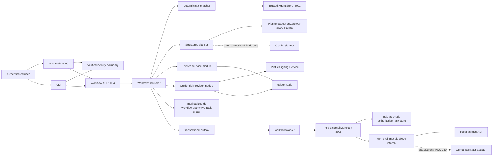
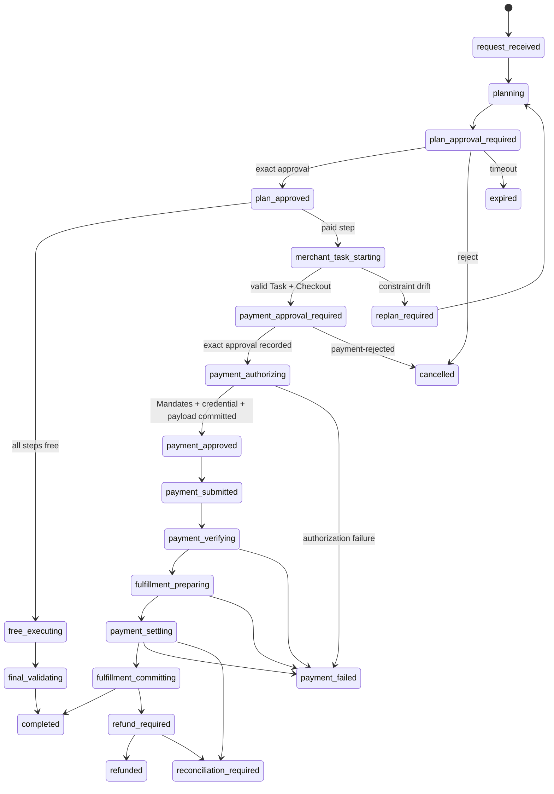
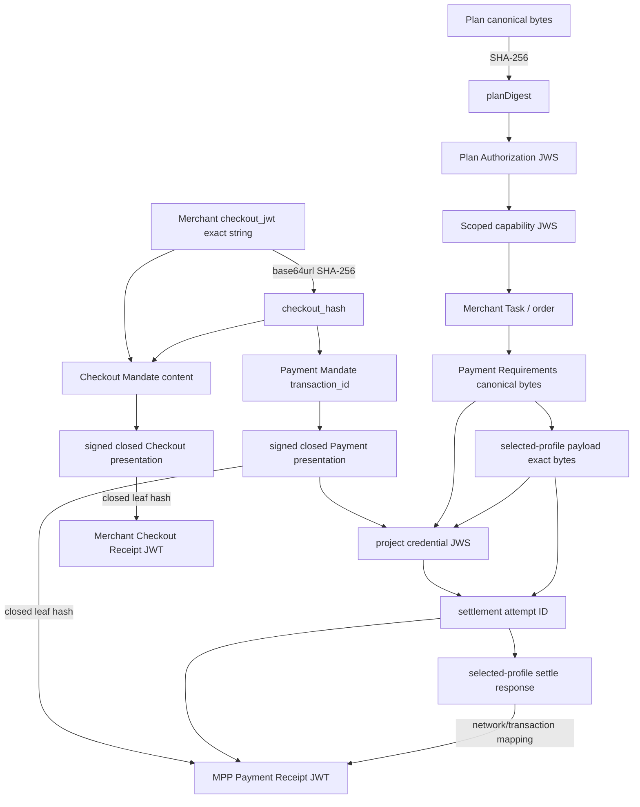
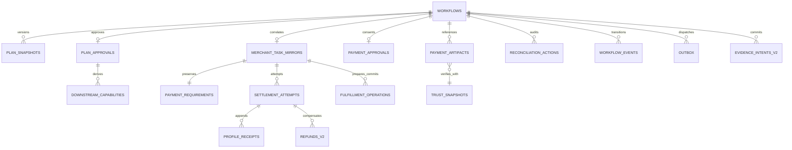

# AP2 v0.2 / A2A x402 v0.1 統合仲介 — 実装設計

- 文書版: 1.1-design-reviewed
- 作成日: 2026-08-15 (Asia/Tokyo)
- 設計レビュー反映日: 2026-08-15 (Asia/Tokyo)
- 対象工程: Section 12 Step 4（設計のみ。コード実装・migration 適用・route 変更は行わない）
- 入力: `AP2_X402_CURRENT_STATE_RESEARCH.md`、`AP2_X402_INTEGRATED_REQUIREMENTS.md` 1.1-reviewed、`AP2_X402_REQUIREMENTS_REVIEW.md`
- 固定 AP2: `google-agentic-commerce/AP2@e1ea56db72a6385bce3e5c1112b3a56ce60acb43`
- 固定 x402: `google-agentic-commerce/a2a-x402@125db5526a965d2325459d1a9df2e274a7e42396` の `spec/v0.1/spec.md`

## 1. 結論

既存の `:8004` payment service を、`secure_mediation_agent` package が所有する一つの **durable workflow API** へ発展させる。ADK Web で選ぶ `payment_user_agent` と CLI はこの API の薄い adapter とし、どちらも同じ SQLite aggregate、同じ状態機械、同じ exact approval dispatcher、同じ error contract を使う。旧 `payment_demo_user_agent` は通常の ADK discovery から除外する。

新しい paid path は一つだけとする。

```text
request -> match -> immutable plan -> plan approval
        -> Merchant A2A Task / signed Checkout / PaymentRequired
        -> payment approval / signed closed Mandates / scoped credential
        -> payment-submitted -> verify -> reversible prepare -> settle -> commit
        -> Checkout Receipt + Payment Receipt + selected-profile receipt history
```

無料 step は同じ `request -> plan -> plan approval` までを通り、その後だけ既存の free A2A executor へ分岐する。LLM は候補説明、計画案、無料 task text、結果要約には使えるが、承認 routing、agent eligibility、金額、署名、Mandate、credential、payment payload、状態遷移を決めない。

最初の release は次の表示に固定する。

| 項目 | リリース表示 | runtime |
| --- | --- | --- |
| AP2 | `AP2 v0.2 Human Present demo` | pinned SDK/schema fixture を使う signed closed-Mandate flow。認証済み本番利用者、適合認証とは表示しない |
| x402 | `x402 v0.1 wire-shape test fixture (NOT CONFORMANT)` | project-local URI、synthetic proof、local rail |
| rail | `simulated; no real asset or on-chain transaction` | `exact-simulated` / `demo:local` |
| official x402 | `DISABLED / NOT RUN` | network、asset、wallet、facilitator、TLS E2E と ACC-030 が揃うまでロードも広告もしない |

この release の durable/restart acceptance 対象は、明示的な POSIX persistent volume を mount した single-host / single-container simulation deployment とする。現行 `deploy/deploy-cloudrun.sh` は ephemeral filesystem のままであり、container recreation 後の durable workflow を満たさないため、統合 paid workflow の accepted deployment には含めない。Cloud Run で paid workflow を enable にするには、SQLite locking/durability を検証済みの永続 filesystem または transactional shared database/queue への移行と ACC-020/ACC-032 の再実行を必須とする。

## 2. 設計判断とトレードオフ

| 論点 | 採用設計 | 理由 / trade-off |
| --- | --- | --- |
| workflow owner | `secure_mediation_agent.workflow.WorkflowController` | session boolean と payment aggregate の二重管理をなくす |
| process | ADK `:8000`、workflow API `:8004`、Merchant `:8005` を維持し、outbox worker を一プロセス追加 | 現行 container を大きく変えず、外部 I/O を request thread から分離できる |
| role separation | Trusted Surface、CP、Signing Service、MPP は `:8004` 内の別 typed module、別 issuer/key/policy/audit | demo では process 増加を避ける。LLM は別 process `:8000` であり、key file を mount しない |
| identity boundary | nginx/auth service が verified identity を client input から分離し、custom ADK ASGI wrapper が ADK `user_id` を同 identity に拘束 | 現行 auth は 200/401 しか返さず、ADK Web の client-supplied `user_id` を認可主体にできない |
| planner/free execution | keyless `:8000` の internal `PlannerExecutionGateway` を `:8004` から service-auth で呼ぶ | CLI と ADK Web が同じ workflow API を使いながら、LLM/free-agent executor を signing/evidence process から分離する |
| workflow storage | 現行 `/app/payment-data/marketplace.db` と `/app/payment-evidence/evidence.db` を v2 へ forward migrateし、WAL、`BEGIN IMMEDIATE`、version CAS、evidence intent を継続 | 存在しない `business.db` への rename/cutoverで二つの source of truth を作らない。単一-host demo に限定する |
| Merchant storage | `/app/payment-data/paid-agent.db` を Merchant Task の独立 authoritative store として v2 migrate | mediation DB は Task mirror/correlation だけを持ち、`:8005` の role ownership と restart/idempotency を維持する |
| durable handoff | business DB の transactional outbox + lease worker | crash 後の再開と副作用の at-most-once business effect を明示できる |
| plan JSON | frozen Pydantic v2 model + `rfc8785==0.1.4` + SHA-256 | 現行 `sort_keys=True` は限定 canonicalizer。JCS fixture と直接照合できる実装を選ぶ |
| AP2 runtime | official `ap2` package を pinned Git commit から install | SD-JWT/delegation/receipt model の独自再実装を避ける。transitive pins は `uv.lock` 更新時に検証する |
| asymmetric crypto | P-256 / ES256、`jwcrypto` と official AP2 SDK | SDK の既定と一致。既存 HS256 helper は legacy のみに隔離 |
| plan/capability | project-local ES256 compact JWS、JCS payload、one-time `jti`/nonce | AP2 object を拡張せず service 間で検証可能。JWT bytes は evidence store に保存 |
| paid A2A | 専用 deterministic `MerchantA2AClient` | 一般 `RemoteA2aAgent` の自然言語 path に proof/credential を渡さない |
| free A2A | 現行 executor から HTTP/A2A 部分を `FreeA2AExecutor` として抽出 | payment 非対応 regression と anomaly checks を残す。開始 gate は controller capability に置換 |
| profile selection | 一 workflow / Agent Card / process につき simulation または official の一つ | URI、rail、label の accidental mixing を構成時に不可能にする |
| official rail | adapter interface まで設計し default-off | network/asset/wallet/facilitator が未決定。推測で canonical URI を広告しない |

official AP2 SDK の root `pyproject.toml` は `ap2==0.1` として `cryptography==46.0.5`、`jwcrypto==1.5.6`、`sd-jwt==0.10.4`、`pydantic==2.12.5` を固定している。現行 lock の `cryptography 46.0.3` / `pydantic 2.12.4` を更新するため、実装時は全 regression を再実行する。新規 signing code は `python-jose` を使わず、既存 `python-jose` は auth/legacy 互換のみに残す。

## 3. コンポーネントの責任分担



| コンポーネント | 担当 | 保持／公開してはならないもの |
| --- | --- | --- |
| `VerifiedIdentityMiddleware` / `IdentityBroker` | Firebase/demo credential verification、one-tenant demo mapping、ADK/CLI subject binding、short-lived service assertion | client-supplied ADK `user_id` as authority、identity token in agent state/prompt |
| ADK `SecureMediatorAdapter` | raw A2A/ADK content forwarding、verified invocation identity handle、deterministic display | approval classification、workflow truth、keys、proof |
| CLI `WorkflowClient` | authenticated nginx transport と terminal rendering | direct `:8004` access、local approval state、Mandate construction |
| `PlannerExecutionGateway` | strict `PlanProposal` generation と既存 free executor/anomaly/final validation adapter | signing keys、evidence access、payment field authority、public route |
| `WorkflowController` | state machine、CAS、gates、plan/order/task correlation、outbox | private key bytes、LLM-generated state transition |
| `ApprovalDispatcher` | one-part exact text comparison、state-based routing | trim/normalization/intent inference |
| `EligibilityMatcher` | Store/Card/profile/skill/trust/endpoint policy | LLM ranking as authorization |
| `StructuredPlanner` | `PlanProposal` を作る | selected Card/trust/payment values の authoritative copy |
| `PlanAssembler` | trusted valuesで Appendix A snapshotを完成し JCS digest | floats、mutable status、localized display text in digest |
| `PlanAuthorizationService` | plan approval と downstream capability の ES256 JWS | AP2 Mandate naming/schema |
| `TrustedSurface` | payment display digest、demo user credential、closed Mandate presentations | tool registration、raw key/token response to agent |
| `CredentialProvider` | Payment Mandate verification、project-local scoped credential | AP2 official credential schema claim |
| `ProfileSigningService` | simulation proof または official wallet payload | profile fallback / profile mixing |
| `MPP` | credential/payload re-verification、settle/refund/reconcile、Payment Receipt | Merchant Checkout Receipt |
| paid external Merchant | signed Checkout、Task、requirements、prepare/commit、Checkout Receipt | platform guarantee、mediation platform payee |
| mediation evidence repository | exact immutable signed bytes / trust snapshot | general conversation / LLM access |
| Merchant Task repository | A2A Task、requirements、Checkout、Merchant operations/receipts/idempotency | mediation workflow authorization truth、MPP/private user evidence |

`payment_marketplace` の再利用対象は SQLite transaction helper、idempotency、nonce、evidence intent、local rail、refund/reconciliation の核である。marketplace payee、guarantee、payable/payout、custom action adapter、HS256 AP2-shaped objects は新 flow へ持ち込まない。

## 4. package／file 対応

実装時の最小 file mapping を次とする。既存 file を一度に移動せず、new path へ抽出してから legacy import を shim にする。

| path | 変更内容／責任 |
| --- | --- |
| `payment_user_agent/agent.py` | ADK discovery に置く唯一の `payment_user_agent` root。内部 `PaymentWorkflowAdapter` を公開し、認可判断は持たない |
| `secure_mediation_agent/agent.py` | `Agent` root を `SecureMediatorAdapter(BaseAgent)` に置換。workflow API の response view だけを返す |
| `secure_mediation_agent/web_app.py` | ADK FastAPI を wrapし verified identity middleware と非公開 planner/free execution gateway を組み込む |
| `secure_mediation_agent/identity.py` | request-scoped verified identity context。raw identity assertion を ADK session/agent stateへ保存しない |
| `secure_mediation_agent/execution_gateway.py` | keyless structured planner と free executor/anomaly/final-validation port |
| `secure_mediation_agent/workflow/models.py` | frozen plan、workflow view、approval/capability、strict domain request |
| `secure_mediation_agent/workflow/controller.py` | transition table、paid/free branch、全 gate、CAS |
| `secure_mediation_agent/workflow/approval.py` | exact dispatcher、plan authorization/capability issuance/verification |
| `secure_mediation_agent/workflow/planner.py` | existing planner を structured-output proposal port に縮小、`PlanAssembler` |
| `secure_mediation_agent/workflow/matcher.py` | Store/Card eligibility algorithm と snapshot |
| `secure_mediation_agent/workflow/repository.py` | SQLite v2 repository、idempotency、nonce、outbox |
| `secure_mediation_agent/workflow/migrations.py` | versioned backup/forward migration/readiness |
| `secure_mediation_agent/workflow/worker.py` | leased outbox dispatcher と restart recovery |
| `secure_mediation_agent/workflow/api.py` | `:8004` user/internal REST、health/readiness、safe errors |
| `secure_mediation_agent/workflow/views.py` | ADK/CLI 共通の Japanese display DTO/text |
| `secure_mediation_agent/ap2/trusted_surface.py` | official SDK Mandate generation、no agent tool |
| `secure_mediation_agent/ap2/credential_provider.py` | signed Payment Mandate verification、scoped credential |
| `secure_mediation_agent/ap2/mpp.py` | credential/receipt/reference verification と Payment Receipt |
| `secure_mediation_agent/ap2/keys.py` | file-backed `KeyProvider`、public JWKS/trust snapshot、rotation |
| `secure_mediation_agent/payment_profiles/base.py` | `PaymentProfile` / `RailAdapter` protocols |
| `secure_mediation_agent/payment_profiles/simulation_v1.py` | project-local URI、synthetic proof、LocalPaymentRail mapping |
| `secure_mediation_agent/payment_profiles/x402_v01.py` | official URI/activation/metadata と configured adapter。default-off |
| `secure_mediation_agent/payment_profiles/a2a.py` | dotted metadata parser/builder、activation echo check |
| `secure_mediation_agent/subagents/orchestration_agent.py` | free-only executor を抽出。boolean callback は legacy-only |
| `external-agents/paid-booking-agent/app.py` | selected-profile A2A adapter、activation+capability gate、Task response |
| `external-agents/paid-booking-agent/service.py` | Checkout ES256、Task store、AP2 verification、prepare/commit、Checkout Receipt |
| `external-agents/paid-booking-agent/task_store.py` | `a2a-sdk==0.3.19` persistent `TaskStore`、Task CAS/history/idempotency、Merchant DB v2 migration |
| `trusted_agent_store/.../agent_registry.py` | strict onboarding/payment profile fields を返す |
| `user-agent/payment_client.py` | deprecated shim。新 CLI は `workflow.client` を import |
| `user-agent/agent.py` | ADK discovery から除外。operator-only legacy flag 時だけ利用 |
| `deploy/auth/verify.py` | verified subject/tenant を safe response headerとして返し、DEV mode は固定 demo identity だけを返す |
| `deploy/nginx.conf` | client identity headersを消去し auth subrequest結果を注入、`/mediation-api/` 認証、internal/legacy route 404 |
| `deploy/supervisord.conf`, `Dockerfile` | custom ADK ASGI app、worker、三 DB path、role別 read-only key mount、legacy root非搭載 |
| `deploy/deploy-cloudrun.sh` | durable backend未設定時は integrated paid profileを deployしない guard。ephemeral filesystemをacceptedとしない |

## 5. 単一の耐久ワークフロー

### 5.1 aggregate と有料／無料の分岐



`WorkflowController.transition(workflow_id, expected_version, event)` だけが `workflows.state` を更新する。transition と `workflow_events` と次の outbox row は一つの `BEGIN IMMEDIATE` transaction で commit する。worker、API、reconciler はこの method 以外から state を UPDATE しない。

`payment_authorizing` は durability のために追加する内部状態である。exact `承認` の transaction は payment approval record/nonce consume/event と Trusted Surface job だけを確定し、まだ `payment_approved` にはしない。Trusted Surface presentation、CP credential、selected-profile payload の exact evidence と相関がすべて committed になった一つの CAS だけが `payment_approved` を作る。従って要件 §4 の `payment_approved` 不変条件（signed closed Mandates と scoped credential が既に存在）を破らない。restart/reconnect 中の public view は `決済承認済み・認可証跡生成中` と表示し、二回目の `承認` は既保存結果を返す。

無料 branch でも plan approval は必要であるが、`payment_approval_required`、Mandate、credential、settlement は作らない。paid step が一つでもあれば initial release の single-merchant/single-product 制約に従い、その一 step だけを payment subflow とする。mixed multi-step paid/free plan は後続 free step を payment completion 後に実行できるが、release acceptance fixture は一 paid step に固定する。

### 5.2 ADK Web と CLI

両 adapter は以下だけを行う。

1. `VerifiedIdentityMiddleware` が client-supplied user/tenant header と ADK body/path の `user_id` を権限根拠にせず、auth subrequest の signed identity assertionへ拘束した `tenantId/customerId` を request-scoped context から得る。`sessionId/contextId` も同 identity の ADK session binding と照合する。
2. user content の parts を変更せず `POST /v1/workflows/{id}/messages` へ送る。`strip()`、join、Unicode normalization をしない。
3. `PublicWorkflowView.renderedText` を表示する。
4. process restart / session state loss 時は同じ verified identity で `GET /v1/sessions/{sessionId}/active-workflow` から再結合する。

ADK session state に保存する `workflowId` は cache hint だけで、API は必ず authenticated session binding を再検証する。raw Firebase token、auth assertion、service JWT は ADK session/state/Eventへ保存しない。現行 ADK Web 1.19.0 の API が body/path の `user_id` を受け取るため、custom ASGI wrapper は verified subject との不一致を request body が agent/session serviceへ届く前に 403 とする。ADK Web の reconnect hook と CLI の `status` command は同じ active-workflow endpoint を呼ぶため、pending approval target は DB から復元される。

### 5.3 二承認を完全一致で振り分けるdispatcher

dispatcher は LLM/model callback より前、workflow API 内で実行する。

```python
def dispatch(parts, state):
    exact = (
        len(parts) == 1
        and parts[0].kind == "text"
        and parts[0].text == "承認"
    )
    if exact and state == "plan_approval_required":
        return APPROVE_PLAN
    if exact and state == "payment_approval_required":
        return APPROVE_PAYMENT
    if exact:
        raise DomainError("APPROVAL_NOT_PENDING")
    if state in {"plan_approval_required", "payment_approval_required"}:
        if len(parts) == 1 and parts[0].kind == "text" and parts[0].text == "拒否":
            return REJECT_CURRENT
        raise DomainError("APPROVAL_EXACT_TOKEN_REQUIRED")
    return HANDLE_NON_APPROVAL_MESSAGE
```

JSON escape decode 後の Python `str` の code point 列を比較する。`承認\n`、前後空白、NFC/NFD 差、複数 text part、text+data part、`承認します` はすべて不一致である。同じ `messageId` / idempotency key の retry だけ既保存結果を返す。parallel `承認` は workflow version と unique approval nonce の一方だけが勝つ。

| 性質 | 計画承認 | 決済承認 |
| --- | --- | --- |
| intent | `approve-plan` | `approve-payment` |
| pending state | `plan_approval_required` | `payment_approval_required` |
| object | project-local Plan Authorization JWS | AP2 signed Checkout + Payment Mandate presentations |
| nonce | `planApprovalNonce` | `paymentApprovalNonce` と role challenge nonce |
| effect | quote/Task start capability を発行可能 | credential/payload/submit を発行可能 |
| forbidden effect | Mandate/charge/fulfillment | new/updated plan approval |

## 6. 変更不能な計画と範囲限定認可

### 6.1 計画の組み立て

`PlanProposal` は LLM が返す `goalSummary`、step description、候補 `agentId/skillId` だけを含む。`PlanAssembler` は selected candidate を matcher の verified snapshot から再取得し、product/quantity/amount ceiling/currency/fee/profile/endpoint/key version を typed request と onboarding policy から埋める。LLM 出力に同名 field があっても無視し、未知 field は Pydantic `extra="forbid"` で拒否する。

`PlannerPort` の initial implementation は `:8004` から keyless `:8000/internal/execution/plan` への service-auth call である。この internal route は nginx へ公開せず、normalized goal、候補の safe public fields、opaque workflow correlation だけを受け、strict `PlanProposal` だけを返す。Gemini unavailable/timeout 時は `planning` の同じ outbox/idempotency scope を再実行し、Merchant side effect を作らない。free branch も `:8000/internal/execution/free` の capability-gated adapterを通して既存 orchestrator/anomaly/final-validation behaviorを保ち、結果/evidence digestだけを workflowへ返す。これにより ADK Web と CLI の入口に関係なく同じ server-side planning/execution pathになる。

initial paid demo request は次の typed default を ADK/CLI 共通 server policy が供給するため、自然言語から金額を抽出しない。

```json
{
  "schemaVersion": "secure-mediation-request/1",
  "goal": "信頼済みの予約エージェントでデモ予約を1件取得する",
  "productId": "demo-paid-booking",
  "quantity": 1,
  "maximumCustomerTotal": 1250,
  "currency": "USD",
  "decimals": 2,
  "feePolicyVersion": "zero-fee-v1",
  "requestedProfile": "x402-wire-simulation/1"
}
```

snapshot は要件 Appendix A の field をそのまま使う。`ConfigDict(frozen=True, strict=True, extra="forbid")`、float rejection の後 `rfc8785.dumps()` した UTF-8 bytes を evidence に保存し、`planDigest = "sha256:" + sha256(bytes).hexdigest()` とする。`planDigest`、localized Markdown、status は digest input に入れない。Markdown は snapshot から `views.py` が毎回生成する。

### 6.2 matcher の判定手順

paid candidate は次を順番に fail closed で判定する。

1. Store row が active、trust threshold 以上、validity 内、requested `skillId/productId` を持つ。
2. onboarding profile は selected profile 一件だけを持ち、Merchant ID、payee ID、endpoint、Card URL、key-set version、scheme/network/asset/payTo policy が完全にある。
3. endpoint policy が scheme/host/port/redirect を検証し、DNS 解決後の全 IP を allowlist と照合する。
4. live Agent Card を取得し、duplicate key / float を拒否して JCS digest を計算する。
5. Card agent ID/endpoint/skill と onboarding が一致し、simulation なら project URI だけ、official なら canonical URI だけが宣言される。old combined URN、typo、両 URI 併記を拒否する。
6. official の場合だけ `officialEnabled=true`、TLS、configured wallet/facilitator/network/asset self-test と ACC-030 report digest を要求する。
7. eligible candidates を `(trust_score DESC, agent_id ASC)` で決定論的に並べ、planner の候補集合にする。

Agent Card は計画承認後に再 fetch して意味を変えない。承認済み plan は保存済み exact digest/onboarding snapshot を使い、key/endpoint が revoke された場合は開始を拒否して `replan_required` にする。

### 6.3 計画認可と capability の順序

Plan Authorization と capability は AP2/x402 object の外側に置く compact ES256 JWS である。

```json
{
  "typ": "secure-plan-authorization+jwt",
  "jti": "approval-...",
  "iss": "secure-mediation-plan-authority",
  "aud": "secure-mediation-workflow",
  "intent": "approve-plan",
  "tenantId": "tenant-...",
  "customerId": "customer-...",
  "sessionId": "session-...",
  "contextId": "context-...",
  "workflowId": "workflow-...",
  "planId": "plan-...",
  "planVersion": 1,
  "planDigest": "sha256:...",
  "nonce": "nonce-...",
  "iat": 1786742400,
  "exp": 1786743300
}
```

```json
{
  "typ": "secure-downstream-capability+jwt",
  "jti": "cap-...",
  "iss": "secure-mediation-plan-authority",
  "aud": "merchant:demo-merchant",
  "operation": "merchant-task:start",
  "approvalId": "approval-...",
  "workflowId": "workflow-...",
  "planId": "plan-...",
  "planDigest": "sha256:...",
  "orderId": "order-...",
  "taskId": "task-...",
  "idempotencyScope": "merchant-task:start/order-...",
  "nonce": "cap-nonce-...",
  "iat": 1786742401,
  "exp": 1786742701
}
```

Task ID は controller が random 128-bit opaque ID として先に割り当て、Merchant は start capability と initial project metadata の同じ値を Task ID として採用する。これにより最初の downstream capability から task binding を持てる。

| 順序 | 原子的に消費するもの | 出力／次のcapability | 再試行規則 |
| --- | --- | --- | --- |
| plan `承認` | primary `planApprovalNonce`、workflow version | Plan Authorization evidence、`plan_approved`、start outbox | same message/hash returns same approval; token itself is never forwarded |
| merchant Task start | `cap:start` nonce | Task/Checkout/requirements、task-bound evidence | Merchant stores cap jti + request hash and returns same Task |
| payment `承認` | `paymentApprovalNonce`、workflow version | approval record、`payment_authorizing`、Trusted Surface outbox | same message/hash returns same approval; no payload/settlement yet |
| Trusted Surface issue | `cap:trusted-surface-issue` + Merchant/CP challenge nonce | exact signed Checkout/Payment presentations | same approval/display/Checkout digest returns exact evidence refs |
| CP issue | `cap:cp-issue` nonce | verified credential authorization record | same mandate digest returns same credential ID |
| profile sign | `cap:profile-sign` nonce | exact x402 payload + digest | single payload per credential/task/requirements |
| credential finalize | `cap:credential-finalize` nonce | credential JWS binding payload digest | no second payload may be attached |
| authorization commit | workflow CAS | `payment_approved` after Mandates/credential/payload evidence commit | incomplete artifacts can never open submit gate |
| payment submit | `cap:merchant-submit` nonce | original Task correlated A2A Message | duplicate Message returns current same Task |
| MPP settle | `cap:mpp-settle` nonce + attempt ID | append-only settle response + AP2 receipt | timeout is queried by same external ID, never charged under a new ID |
| fulfillment commit | `cap:merchant-commit` nonce | Artifact + Checkout Receipt | same operation ID returns saved result |
| refund/reconcile | separate operator/compensation cap | append-only local record | same provider external ID only |

capabilityは、消費済みapproval recordからserver側で導出して発行する。approval tokenを転送する方式ではない。各rowは個別の`jti`、nonce、audience、operation、expiry、consume eventを持つ。

## 7. AP2 Human Present の設計

### 7.1 role、key、algorithm

| role | issuer | key／algorithm | verifier |
| --- | --- | --- | --- |
| demo identity / trusted Agent Provider | `demo-user-credential-issuer` | P-256 ES256 root SD-JWT key | Merchant、CP via trust snapshot |
| Trusted Surface holder | `demo-trusted-surface` | P-256 ES256 holder key delegated by root `cnf` | Merchant for Checkout Mandate、CP for Payment Mandate |
| Merchant | onboarding Merchant ID | P-256 ES256 Checkout JWT / Checkout Receipt key, separate `kid` | Shopping Agent / Trusted Surface |
| CP | `demo-credential-provider` | P-256 ES256 project credential key | Merchant / MPP |
| simulation signing service | `demo-simulation-signer` | P-256 ES256 synthetic proof key | Merchant / MPP; never labeled wallet |
| MPP | `demo-mpp` | P-256 ES256 Payment Receipt key | Shopping Agent / Merchant |

private JWK/PEM は `/run/secrets/<role>-<kid>.jwk` または同等の read-only secret mount から `KeyProvider` が読む。ファイル path と public `kid` だけを process config に置き、key bytes を environment、Agent Card、source、repr に置かない。demo key も persistent secret volume に明示生成し、restart ごとに再生成しない。public JWKS、issuer、valid-from/to、revocation status の exact snapshot を各 signed evidence と結ぶ。

key provisioning は通常 startup から分離した一回限りの operator step とし、roleごとの file、owner/mode、issuer/kid、public thumbprint manifestを原子的に作る。通常 startup は missing/mismatched/revoked key を自動生成・置換せず non-ready になる。test用 deterministic key/ID/clock injection は `APP_ENV=test` かつ test-only constructor に限定し、runtime configurationでは有効化できない。

Merchant Checkout JWT は ES256 compact JWS とし、最低でも `iss`、`aud`、`kid`、`jti`、random 256-bit `checkoutNonce`、order/task/quote/merchant/product/quantity、minor-unit total/currency、fee policy、`iat/exp` を拘束する。毎回 `secrets.token_urlsafe(32)` の fresh entropy と fresh `jti` を payload に入れ、低エントロピー payload への deterministic HS256 は廃止する。

### 7.2 決済承認とrole呼出し

```mermaid
sequenceDiagram
    autonumber
    participant U as "User"
    participant C as "WorkflowController / Shopping Agent"
    participant M as "Paid Merchant"
    participant TS as "Trusted Surface"
    participant CP as "Credential Provider"
    participant SS as "Profile Signing Service"
    participant P as "MPP / rail"

    C->>M: start Task + profile activation + start capability
    M->>M: consume capability; create Task and ES256 Checkout
    M-->>C: input-required + PaymentRequired + signed Checkout + role challenges
    C->>C: verify Card, echo, Checkout, plan constraints; persist exact bytes
    C-->>U: payment display (7 prices, payee, profile, expiry)
    U->>C: exact approval
    C->>C: persist payment approval; enter payment_authorizing
    C->>TS: verified identity + approval record + typed display digest + exact Checkout + TS capability
    TS->>TS: verify workflow/state/approval/identity/challenges; create two closed SD-JWT presentations
    TS-->>C: evidence IDs/digests only
    C->>CP: Payment Mandate evidence ref + CP capability
    CP->>CP: verify chain/aud/nonce/payee/amount/checkout/expiry/replay
    CP->>SS: verified authorization + exact requirements digest
    SS-->>CP: one-time profile payload + exact digest
    CP->>CP: issue project credential binding payload digest
    CP-->>C: credential/payload evidence refs and safe IDs
    C->>C: verify all committed evidence; enter payment_approved
    C->>M: original taskId + payment-submitted + refs + submit capability
    M->>M: verify activation/task/Checkout Mandate/credential/payload
    M->>M: reversible fulfillment prepare
    M->>P: credential + payload + settle capability
    P->>P: re-verify all bindings; settle; append receipt; sign Payment Receipt
    P-->>M: settle response + Payment Receipt
    M->>M: commit fulfillment; sign Checkout Receipt
    M-->>C: completed Task + all receipts + Artifact
    C->>C: offline-style verification; completed
```

Trusted Surface が作る二つの Mandate Content は canonical schema の exact `vct=mandate.checkout.1` と `vct=mandate.payment.1` を使う。Checkout `checkout_hash` は received `checkout_jwt` string の UTF-8 bytes の base64url SHA-256、Payment `transaction_id` は同じ値である。Payment `payee` は Store/onboarding の paid Merchant であり、mediation platform ではない。Trusted Surface は chat textだけを user authentication とせず、`VerifiedIdentityMiddleware` が作った固定 demo identity binding、current payment approval record、display digest、Checkout/requirements challenge、TS audience capabilityをすべて検証する。

official SDK の `MandateClient.create/present/verify` と generated models を wrapper 越しに使用し、Merchant audience/nonce の Checkout presentation と CP audience/nonce の Payment presentationを別 exact bytes として保存する。Receipt `reference` は official SDK の `get_closed_mandate_jwt()` が返す closed leaf JWT の base64url SHA-256 とし、presentation 全体の project digest や Checkout JWT hash と混同しない。

### 7.3 project-local credential と payload の結び付け

AP2 は CP credential wire schema を規定しないため、次の compact ES256 JWS は明示的に project-local とする。

```json
{
  "typ": "secure-payment-credential+jwt",
  "profile": "secure-mediation-credential/1",
  "jti": "credential-...",
  "iss": "demo-credential-provider",
  "aud": ["merchant:demo-merchant", "demo-mpp"],
  "workflowId": "workflow-...",
  "planDigest": "sha256:...",
  "taskId": "task-...",
  "checkoutHash": "base64url...",
  "paymentMandateDigest": "sha256:...",
  "requirementsDigest": "sha256:...",
  "payloadDigest": "sha256:...",
  "payeeId": "demo-merchant",
  "amount": 1250,
  "currency": "USD",
  "instrumentId": "demo-instrument-1",
  "settlementTarget": "demo-merchant",
  "nonce": "credential-nonce-...",
  "iat": 1786742402,
  "exp": 1786742702
}
```

循環 hash を避けるため、CP はまず Mandate を検証して immutable `credential_authorization_id` を予約し、Signing Service が一回だけ payload を生成する。その exact payload digest を含めて credential JWS を finalize する。payload は credential bytes を含めず、credential が payload を一方向に拘束する。Merchant と MPP は credential の `payloadDigest` を受信 payload exact bytes から再計算する。

### 7.4 exact bytes／digest の関係



各矢印は domain table の foreign key と digest field の両方で表現する。official profile では `settlement_attempts.external_transaction` / `network` と Payment Receipt の `network_confirmation_id` を `x402-ap2-receipt-map/1` policy で完全照合する。simulation reference は `sim:<operation-id>` とし、この mapping の blockchain transaction には入れない。

### 7.5 Receipt と拒否

- Merchant は Checkout Mandate accept/reject ごとに canonical Checkout Receipt JWT を ES256 署名する。common fields は `status/iss/iat/reference`、Success は `order_id`、Error は `error/error_description`。
- CP/Network は Payment Mandate verification を reject した場合だけ、それぞれの role issuer/keyで canonical Error Payment Receipt を返す。verification success は scoped credential/tokenを返す段階であり、CP/Network の Success Payment Receipt を追加発行しない。final payment accept/reject は MPP が MPP-signed Success/Error Payment Receiptを一件発行する。common fields は `status/iss/iat/reference/payment_id`、Success は `psp_confirmation_id/network_confirmation_id`、Error は `error/error_description`。
- transport/service authentication が Mandate exact bytes 受領前に失敗した場合は safe domain error のみで、AP2 Receipt を発行しない。
- malformed Mandate でも exact received bytes から safe reference を計算できる場合は verifier-signed Error Receipt を保存する。
- Checkout Receipt と Payment Receipt は別 `kid`、別 evidence ID、別 exact bytes。片方の issuer key を他方に使うと verification failure とする。

`Ap2ReceiptFactory` は pinned generated `CheckoutReceipt` / `PaymentReceipt` discriminated modelsを直接構築して canonical schema validation 後に `ap2.sdk.jwt_helper.create_jwt` で署名する。pinned `ReceiptClient.create_payment_receipt()` は Success 専用で `iss` を Payment Mandate の `pisp.domain_name`（なければ空文字）から選ぶため、configured CP/Network/MPP issuerが必要な本設計ではその convenience defaultを authorityにしない。Error Receipt も generated Error variantで作り、`payment_id` は verification開始前に予約して retryで同じ値を使う。`ReceiptClient.verify_receipt()` と independent schema/reference checks は検証側で使う。

settlement success 後に fulfillment commit が失敗した場合、Payment Receipt と selected-profile success receipt は成功のまま不変とし、Merchant は `status=Error` の Checkout Receipt、A2A Task `failed`、project metadata `refund-required` を返す。workflow は `refund_required` へ進み、refund完了後も元AP2/x402 evidenceを成功/失敗へ書き換えない。

## 8. 選択する決済profile

### 8.1 profile registry

```python
class PaymentProfile(Protocol):
    profile_id: str
    extension_uri: str
    rail_mode: Literal["simulated", "on-chain"]
    conformance_label: str
    def validate_start_activation(headers, agent_card) -> None: ...
    def build_required(requirement) -> dict: ...
    def build_payload(verified_authorization) -> ExactBytes: ...
    def verify_and_settle(attempt) -> SettleResult: ...
    def readiness() -> ProfileReadiness: ...
```

`ProfileRegistry.load()` は environment の single `PAYMENT_PROFILE` を読む。`simulation-v1` と `x402-v0.1-official` の同時 load は startup error とする。Agent Card、matcher、activation header、plan snapshot、Task、UI、conformance report はすべてこの一 instance から生成し、別の feature flag を読まない。

| 項目 | simulation profile | official x402 profile |
| --- | --- | --- |
| `profile_id` | `x402-wire-simulation/1` | `a2a-x402/v0.1` |
| extension URI | `urn:secure-a2a:extensions:x402-wire-simulation:v1` | `https://github.com/google-a2a/a2a-x402/v0.1` |
| scheme | `exact-simulated` | configured official `exact` |
| network | `demo:local` | configured supported blockchain network |
| asset | `USD` fixture | configured token contract/address |
| `payTo` | `merchant:demo-merchant` simulation identifier | onboarding verified Merchant wallet |
| proof | synthetic ES256 project JWS | wallet-signed scheme payload |
| settlement | `LocalPaymentRail` | facilitator verify/settle and real transaction hash |
| label | `NOT CONFORMANT` | only `PASS` after ACC-030 |

Official profileのreadinessには、exact canonical URI、HTTPS endpoint、demo loopback例外なし、設定済みnetwork／asset／payTo、wallet signer実装、facilitatorの`verify`と`settle`、正本transaction照会、amount mapping policy、receipt mapping policy、同一configに対する最新ACC-030 report digestのすべてを要求する。officialを選択した状態で一項目でも欠ければstartupをnon-readyにし、simulationへのfallbackを禁止する。

initial official policy は FX を行わず、ISO currency と同価値に固定された onboarding 済み tokenだけを許す `iso-token-exact/1` とする。policy recordは `currency=USD`、`currencyDecimals=2`、token contract、`assetDecimals`、networkを拘束し、`assetAmount = customerTotal * 10^(assetDecimals-currencyDecimals)` を integer arithmeticで求める。指数が負または除算余りがある場合は拒否する。例えば 1250 USD minor units と6-decimal tokenなら `maxAmountRequired="12500000"` である。plan、payment display、requirements、credential、wallet payloadは policy IDと両方の integer amountを拘束し、AP2 `payment_amount=1250 USD` と token unitsを同じ数値だと仮定しない。tokenの価格乖離や FX/oracle が必要な asset は今回の official scope外である。

### 8.2 activation と Agent Card

Merchant Agent Card は、選択したprofileだけから生成する。Simulation Cardはproject-local URIと`params={profile, simulated:true, conformance:"NOT_CONFORMANT", scheme/network/asset}`だけを持つ。Official Cardはcanonical URIと、機械可読な有料skill／product／on-chain capabilityだけを持つ。Store onboardingも`(merchant_id, profile_id, version)`ごとに1 rowとし、二つのURIを同じrowへ入れない。

有料requestは`X-A2A-Extensions`を必ず一つだけ送る。Merchantはcapabilityを消費したりTask／Checkoutを作成したりする前に、この値を検査する。成功時はresponseへ同じ値をechoする。Shopping AgentはTask mirrorを受け入れたりpayment capabilityを発行したりする前にechoを検証する。request側のactivation欠落／不一致は、Merchant transaction開始前に副作用0件で拒否する。server／proxyの不具合でresponse echoだけが欠落・改変された場合、client観測後に既作成Taskを物理的に0件へ戻すことは分散境界上できない。この場合は新Taskを作らず、同じstart operation IDで`tasks/get`／statusを照会する。echoを確認できなければworkflowを`reconciliation_required`にして、payment approvalへ進めない。controlled containerのACC-007では、applicationが成功Task responseと正しいechoを同じresponse builderから必ず生成すること、およびrequest不一致時に0件であることを検証する。

### 8.3 A2A Task とMessageの例

simulationのPaymentRequired responseは、canonical extensionを主張せずに公式v0.1のdotted shapeを保つ。

```json
{
  "id": "task-...",
  "kind": "task",
  "contextId": "context-...",
  "status": {
    "state": "input-required",
    "message": {
      "messageId": "message-payment-required-...",
      "kind": "message",
      "role": "agent",
      "parts": [{"kind": "text", "text": "Payment approval is required."}],
      "metadata": {
        "x402.payment.status": "payment-required",
        "x402.payment.required": {
          "x402Version": 1,
          "accepts": [{
            "scheme": "exact-simulated",
            "network": "demo:local",
            "asset": "USD",
            "payTo": "merchant:demo-merchant",
            "maxAmountRequired": "1250"
          }]
        },
        "io.github.taichihiromatsu.secure-mediation.v1": {
          "profile": "x402-wire-simulation/1",
          "simulated": true,
          "conformance": "NOT_CONFORMANT",
          "workflowId": "workflow-...",
          "planDigest": "sha256:...",
          "orderId": "order-...",
          "checkoutJwtRef": {"uri": "urn:sha256:...", "digest": "sha256:..."},
          "checkoutMandateChallenge": {"aud": "merchant:demo-merchant", "nonce": "..."},
          "paymentMandateChallenge": {"aud": "demo-credential-provider", "nonce": "..."}
        }
      }
    }
  }
}
```

payment submissionは元のTaskに対する新しいMessageである。AP2／project dataは、公式x402 keyの外側にあるsiblingとする。

```json
{
  "messageId": "message-payment-submitted-...",
  "kind": "message",
  "taskId": "task-...",
  "contextId": "context-...",
  "role": "user",
  "parts": [{"kind": "text", "text": "Payment authorization submitted."}],
  "metadata": {
    "x402.payment.status": "payment-submitted",
    "x402.payment.payload": {
      "x402Version": 1,
      "network": "demo:local",
      "scheme": "exact-simulated",
      "payload": {"simulationAuthorization": "<synthetic-compact-JWS>"}
    },
    "io.github.taichihiromatsu.secure-mediation.v1": {
      "profile": "x402-wire-simulation/1",
      "simulated": true,
      "submitCapability": {"uri": "urn:sha256:...", "digest": "sha256:..."},
      "checkoutMandate": {"uri": "urn:sha256:...", "digest": "sha256:..."},
      "paymentMandate": {"uri": "urn:sha256:...", "digest": "sha256:..."},
      "credential": {"uri": "urn:sha256:...", "digest": "sha256:..."}
    }
  }
}
```

`urn:sha256` reference は Merchant service identity と reference audience を検証する internal evidence fetch で解決する。Nginx からは公開しない。wire body と resolved evidence bytes は debug/access log に出さない。official profile では `x402.payment.payload` のみ scheme-defined wallet payload に変わり、project namespace の AP2 refs は同じ場所に残る。

Final success metadata は `x402.payment.status=payment-completed` と Task lifetime の ordered `x402.payment.receipts` 全件を持つ。failure は `payment-failed`、safe `x402.payment.error` とそれまでの全 receipts を持つ。user rejection は original Task の新 Message に `payment-rejected` だけを置き、payload/settlement/success receipt/commit を作らない。

### 8.4 Merchant Task のライフサイクル

| workflow状態 | Merchant Task状態 | 必須payment metadata | 許可する副作用 |
| --- | --- | --- | --- |
| `merchant_task_starting` | `submitted` → `working` | project start correlation | Task、Checkout、requirements only |
| `payment_approval_required` | `input-required` | `payment-required` + `required` | none |
| `payment_submitted` | `working` | received `payment-submitted` | verification only |
| `payment_verifying` | `working` | safe project status | signature/binding checks |
| `fulfillment_preparing` | `working` | safe project status | reversible hold/artifact draft |
| `payment_settling` | `working` | receipt history so far | one settlement attempt |
| `fulfillment_committing` | `working` | successful settle response | one commit |
| `completed` | `completed` | `payment-completed` + all receipts | Artifact + two AP2 receipts |
| `payment_failed` | `failed` | `payment-failed` + error + all receipts | no success commit |
| `cancelled` | `canceled` | `payment-rejected` | no payload/settle/commit |
| `reconciliation_required` | `working` | project `reconciliation-required` | authoritative query only |

paid booking の prepare は unique `(task_id, prepare_operation_id)` の期限付き reservation hold と deterministic Artifact draft を作るだけで、在庫確定/外部通知をしない。settle success 後の commit が初めて確定する。これが x402 work-before-settle の reversible prepare/commit boundary である。

### 8.5 A2A SDK 0.3.19 adapter の契約

repository の `a2a-sdk==0.3.19` / wire `0.3.0` を明示的な transport baseline とし、AP2 v0.2 / x402 extension v0.1 の versionと混同しない。Merchant server は SDK の `Message`、`Task`、`TaskStatus`、`Artifact`、`AgentCard` modelで inbound/outboundを validationし、camelCase aliasで serializeする。`kind=message|task`、`messageId`、`contextId`、Artifactの `artifactId/parts` を省略しない。Cardの default modesは実際の text part + metadataに合わせ `text/plain` と `application/json` を宣言する。

SDK `DefaultRequestHandler` は未知の `message.taskId` を持つ初回 Messageを `TaskNotFound` で拒否する。このため controller が予約した `taskId` は初回 Messageの標準 `taskId` fieldへ入れず、project metadata内の signed start capabilityへ拘束する。Merchantの custom `AuthorizedRequestContextBuilder` が、HTTP extension activation、service identity、capability signature/body digest/audience/operation、start idempotencyを検証した後にだけ、その予約IDを SDK `RequestContext.task_id` として採用する。executorが同じIDの Taskを persistent `TaskStore`へ作り、以後の payment-submitted / payment-rejected Messageだけが標準 `message.taskId` で既存Taskを参照する。stock handlerを使えない場合でも custom builder/handler は upstream SDK contract testを通し、手書き dictだけを適合根拠にしない。

activation は SDK `ServerCallContext.requested_extensions` から選択URIを検証し、成功時に `RequestContext.add_activated_extension(uri)` で response header echoを生成する。Task save前後 crash、duplicate initial Message、unknown preallocated ID、別context/tenant Task resumeを persistent TaskStore contract testに含める。

## 9. 永続化設計

### 9.1 物理DBとschema v2

現行の三 file、mediation authority `/app/payment-data/marketplace.db`、Merchant authority `/app/payment-data/paid-agent.db`、permission `0700` の別 directoryにある `/app/payment-evidence/evidence.db` を同じpathのまま v2へ進める。`business.db` への暗黙 rename/new-file作成は禁止する。mediation table と Merchant table は raw signed bytes を持たず evidence ID/digest だけを持つ。SQLite connection は `foreign_keys=ON`、`journal_mode=WAL`、`synchronous=FULL`、`busy_timeout=5000`。timestamp は UTC `...Z`、amount は INTEGER、opaque ID は UUID4、boolean は `INTEGER CHECK(value IN (0,1))` とする。



| table | 主要column | 制約／変更不能性 |
| --- | --- | --- |
| `workflows` | `workflow_id PK, tenant_id, customer_id, session_id, context_id, state, version, active_plan_id, plan_digest, selected_profile, merchant_task_id, order_id, payment_approval_id, created_at, updated_at` | allowed-state CHECK, version CAS。terminalを除く partial unique `(tenant_id,session_id,context_id)` でactive一件だけを強制し、同じsession/contextの後続workflowを妨げない |
| `plan_snapshots` | `plan_id, plan_version, workflow_id, schema_version, canonicalization, request_digest, plan_digest, evidence_id, created_at, expires_at` | PK `(plan_id,plan_version)`, `UNIQUE(plan_digest)`, UPDATE/DELETE reject trigger |
| `plan_approvals` | `approval_id PK, workflow_id, plan_id/version/digest, intent, nonce, issuer, audience, status, authorization_evidence_id/digest, approved_at, expires_at` | `CHECK(intent='approve-plan')`, `UNIQUE(nonce)`, immutable; revoke is separate event |
| `payment_approvals` | `payment_approval_id PK, workflow_id, task_id, checkout_hash, intent, nonce, display_digest, status, approved_at, expires_at` | `CHECK(intent='approve-payment')`, `UNIQUE(nonce)`, separate table from plan approval |
| `downstream_capabilities` | `capability_id PK, approval_id, workflow_id, plan_digest, order_id, task_id, audience, operation, nonce, status, request_hash, evidence_id/digest, iat, exp, consumed_at` | `UNIQUE(audience,operation,nonce)`, consume CAS |
| `used_nonces_v2` | `issuer, scope, nonce, workflow_id, task_id, request_hash, consumed_at` | PK `(issuer,scope,nonce)` |
| `merchant_task_mirrors` | `task_id PK, workflow_id UNIQUE, context_id, merchant_id, order_id UNIQUE, profile_id, observed_state, observed_version, task_evidence_id/digest, agent_card_digest, onboarding_version, created_at, updated_at` | mediation側のauthenticated A2A observation/correlation。Task authorityではなく、remote stateを直接UPDATEしない |
| `payment_requirements` | `requirements_id PK, task_id UNIQUE, profile_id, evidence_id/digest, checkout_hash, capability_id, expires_at, used_at` | immutable; one original requirement per Task |
| `payment_artifacts` | `artifact_id PK, workflow_id, task_id, kind, evidence_id/digest, issuer, kid, trust_snapshot_id, reference_digest, created_at` | kind CHECK for Checkout/Mandates/credential/payload/AP2 receipts; UPDATE/DELETE reject |
| `settlement_attempts` | `attempt_id PK, task_id, ordinal, profile_id, idempotency_key, request_digest, external_id, state, network, transaction_ref, receipt_evidence_id/digest, created_at, resolved_at` | `UNIQUE(task_id,ordinal)`, `UNIQUE(profile_id,external_id)`, append-only outcome events |
| `settlement_attempt_events` | `event_id PK, attempt_id, seq, observed_state, network, transaction_ref, error_code, evidence_id/digest, created_at` | `UNIQUE(attempt_id,seq)`、append-only。attempt identityを結果不明/成功へ上書きしない |
| `profile_receipts` | `receipt_id PK, task_id, attempt_id, ordinal, success, network, transaction_ref, error_code, evidence_id/digest, created_at` | `UNIQUE(task_id,ordinal)`; UPDATE/DELETE reject |
| `fulfillment_operations` | `operation_id PK, task_id, phase, state, request_digest, external_id, artifact_evidence_id/digest, created_at, updated_at` | `UNIQUE(task_id,phase)`, phase `prepare|commit` |
| `refunds_v2` | `refund_id PK, workflow_id, attempt_id, original_payment_id, amount, currency, reason, provider_ref, state, idempotency_key, created_at, updated_at` | original evidence unchanged; `UNIQUE(idempotency_key)` |
| `reconciliation_actions` | `action_id PK, workflow_id, target_type/id, actor_id/role, reason, external_id, observed_state, evidence_digest, idempotency_key, created_at` | append-only, authenticated operator |
| `idempotency_records_v2` | `tenant_id, actor_id, operation, idem_key, request_hash, status, result_type/id, response_evidence_id, created_at, expires_at` | PK `(tenant_id,actor_id,operation,idem_key)` |
| `workflow_events` | `event_id PK, workflow_id, seq, actor_id/role, operation, from_state, to_state, approval_intent, idempotency_result, error_code, related_digest, created_at` | `UNIQUE(workflow_id,seq)`, append-only trigger |
| `outbox` | `outbox_id PK, workflow_id, event_type, operation_id, payload_json, payload_digest, status, attempts, available_at, lease_owner/until, last_error_code, created_at, completed_at` | `UNIQUE(event_type,operation_id)`, payload contains references, not proof |
| `evidence_intents_v2` | `intent_id PK, workflow_id, evidence_id UNIQUE, expected_digest, kind, state, created_at, committed_at` | `pending|committed|failed`; transition before aggregate advancement |
| `trust_snapshots` | `snapshot_id PK, issuer, kid, jwks_evidence_id/digest, onboarding_version, valid_at, created_at` | immutable and linked from signed artifact |

`evidence.db.evidence` v1 は exact BLOB store として再利用し、v2 migration で `media_type`、`profile_id`、`retention_class` を nullable-safe `ALTER TABLE ADD COLUMN` する。既存 immutable trigger は維持する。new writes は全 field を埋める。evidence access event は actor/role/tenant/allowed を従来どおり append する。

`paid-agent.db` v2 は authoritative `merchant_tasks_v2`、`merchant_messages_v2`、`merchant_requirements_v2`、`merchant_operations_v2`、`merchant_receipt_history_v2`、`merchant_capability_consumptions_v2` を持つ。Task/version CAS、Message ID uniqueness、one original requirements per Task、ordered receipt history、operation request-hash idempotencyをMerchant DB自身が強制する。mediation workerはこのDBを直接読まず、service-authenticated A2A `message/send` / `tasks/get` のexact responseをevidenceへ保存してmirrorを更新する。`:8005` restart後も同じ Taskとresponseを返せなければ readiness/ACC-020 failureである。

代表的な DB-level invariants は次である。

```sql
CREATE UNIQUE INDEX ux_one_active_payment_approval
ON payment_approvals(workflow_id)
WHERE status = 'approved';

CREATE UNIQUE INDEX ux_capability_business_effect
ON downstream_capabilities(workflow_id, task_id, audience, operation)
WHERE status IN ('issued', 'consumed');

CREATE TRIGGER plan_snapshot_immutable_update
BEFORE UPDATE ON plan_snapshots
BEGIN SELECT RAISE(ABORT, 'plan snapshot is immutable'); END;

CREATE TRIGGER profile_receipt_immutable_delete
BEFORE DELETE ON profile_receipts
BEGIN SELECT RAISE(ABORT, 'receipt history is append-only'); END;
```

### 9.2 evidence のcommit

SQLite の二 file にまたがる critical write は既存 `evidence_intent` pattern を formalize する。

1. business transaction で expected digest 付き `pending` intent を insert。
2. evidence DB transaction で exact bytes を immutable insert。既存 ID は digest equal の場合だけ idempotent hit。
3. business transaction で digest を再照合し intent を `committed`、domain row/event/outbox を同時 commit。
4. aggregate は step 3 前に次 state へ進まない。

startup reconciler は pending intent を evidence DB と照合し、exact digest があれば step 3 を完了する。evidence がなく、かつ外部 handoff 前であることを確認できる場合だけ旧 intent を append-only failure event で閉じ、同じ business operation/idempotency scope を新 artifact ID で再実行する。外部 handoff の可能性がある場合は再署名せず `reconciliation_required` にする。digest mismatch は readiness failure と operator alert である。

### 9.3 outbox、冪等性、再起動

worker は `BEGIN IMMEDIATE` で一件を `leased` にし、短い DB transaction を閉じてから外部 I/O を行う。success response を evidence に保存した後、workflow CAS、event append、次 outbox、current outbox `done` を一 transaction で commit する。lease expiry 後は同じ `operation_id/messageId/idempotency_key` で再送する。

| 操作 | crash後の再試行 |
| --- | --- |
| plan/matcher | same request hash; no Merchant side effect |
| Task start / payment submission | resend exact message ID/body digest; Merchant returns saved Task |
| credential/sign payload | return saved evidence by unique authorization/credential ID |
| settle before request sent | same attempt/external ID may be sent |
| settle response missing/timeout | never create new attempt; `reconciliation_required`, query same external ID |
| fulfillment prepare/commit | same operation ID; Merchant returns saved hold/Artifact/Receipt |
| receipt issuance | unique `(issuer,reference,status,attempt)` returns exact saved JWT |
| refund/reconcile | same provider refund/external ID; no second charge/refund |

At-most-once は network delivery ではなく business effect に対する保証である。outbound endpoint も同じ idempotency contract を実装しなければ成立しない。

## 10. APIとgate

### 10.1 利用者向けworkflow API

| method／path | request | response | 認証／冪等性 |
| --- | --- | --- | --- |
| `POST /v1/workflows` | typed `WorkflowRequest`, session/context | `PublicWorkflowView` (`planning` or pending plan) | authenticated tenant/customer; `Idempotency-Key` |
| `POST /v1/workflows/{id}/messages` | exact A2A-style `parts[]`, `messageId`, `expectedVersion?` | updated public view or safe error | owner binding; `Idempotency-Key` |
| `GET /v1/workflows/{id}` | none | current public view | owner binding |
| `GET /v1/sessions/{sessionId}/active-workflow` | context query | current public view / 404 | session owner binding |
| `POST /v1/workflows/{id}/cancel` | reason enum | cancelled view; sends payment-rejected if needed | owner; idempotent |

`PublicWorkflowView` is allowlisted: state/version、pending approval kind、plan/order/task IDs、safe plan display、7 prices、expiry、Artifact summary、receipt IDs/digests、profile labels、safe error only. Exact signed tokens、credential/payload、capability、nonce are never returned.

public callは認証済みnginxからだけ受け付け、nginxがcaller値を除去・置換したverified identity assertionを使用する。ADK adapterのloopback callは、別の`secure-mediator-adapter` service JWSとrequest-scoped verified identity bindingを使う。CLIは認証済みpublic `/mediation-api/` routeを使い、`127.0.0.1:8004`を直接呼ばない。`messageId`からadapter再試行用のidempotency keyを決定論的に作り、独立生成したoperation keyによってendpoint間の再利用を防ぐ。

### 10.2 内部／A2A route とgateの割当て

| route／操作 | gate | 副作用前の必須検査 |
| --- | --- | --- |
| controller `paid-step:start` | GATE-002 | workflow `plan_approved`, plan exact digest, approval signature/status/expiry, primary consume event, selected agent/skill |
| Merchant `message/send` Task start | GATE-003 + GATE-004 | service identity, start capability, tenant/workflow/order/task, selected activation, idempotency |
| legacy `/v1/orders` if retained | GATE-003 | same start capability; internal only |
| Merchant `message/send` payment-submitted | GATE-010 | original task/context, `payment_approved`, both Mandates, credential, selected profile, submit capability, idempotency |
| internal Trusted Surface issue | payment-authorization gate | `payment_authorizing`、verified user identity、payment approval/display/Checkout/requirements digests、Merchant/CP challenge、TS audience capability、idempotency |
| internal evidence reference fetch | GATE-010 | Merchant identity/audience, exact workflow/task/reference, reference-specific read grant; read audit。same grant/key retryは同じbytes、別referenceは拒否 |
| internal `CP issue/sign/finalize` | GATE-010 | state, signed Payment Mandate, requirements, CP/sign capabilities, nonces |
| internal `MPP verify/settle` | GATE-010 | task/context, payment approval, Mandates, credential↔payload, attempt, settle capability |
| Merchant `prepare/commit` | GATE-010 | verified submission; phase-specific capability; settle success required only for commit |
| internal `refund/reconcile` | GATE-010 + operator gate | original external ID, authorized actor/capability, idempotency |
| legacy custom `/a2a action=start_order|submit_payment` | no new-flow route | default 404; operator legacy profile only |
| internal planner/free execution gateway | plan/free execution gate | workflow/plan capability、safe request digest、service identity、idempotency。payment proof/evidence referenceは受理しない |

内部endpointはES256 service JWTをmethod／path／body digest／audience／operation／tenant／nonce／timestampへ拘束する。Nginxは`/internal/`をroutingせず、publicからの直接accessにはtenantや存在有無の情報を含めず404を返す。

Merchant submission用に Checkout Mandate、Payment Mandate、credentialそれぞれ別の short-lived `evidence:read` grantを発行する。grantは evidence ID/digest、workflow/task、Merchant audienceを一件だけ拘束し、business effectを持たない同一read retryだけを許す。submit capability一個を複数fetchで再利用したり、content-addressだけでevidenceを読ませたりしない。

### 10.3 エラー契約

domain codeを正本とし、adapterはtransport statusのmappingだけを行う。

| 分類／例 | HTTP | JSON-RPC | x402／AP2の挙動 |
| --- | --- | --- | --- |
| exact approval | `APPROVAL_EXACT_TOKEN_REQUIRED`, `APPROVAL_NOT_PENDING` → 409 | `-32009` | no Task/payment mutation |
| plan gate/binding | `PLAN_APPROVAL_REQUIRED/INVALID/EXPIRED`, `PLAN_BINDING_MISMATCH`, `PLAN_CONSTRAINT_VIOLATION` → 403/409/410/422 | `-32001` | no Task or replan as specified |
| AP2 verifier | `AP2_CHECKOUT_INVALID`, `AP2_MANDATE_INVALID`, `AP2_CREDENTIAL_INVALID`, `AP2_CONSTRAINT_UNRESOLVED` → 422 | `-32001` | after action authorization begins, signed role Error Receipt |
| x402 activation/correlation | `X402_EXTENSION_REQUIRED`, `X402_ACTIVATION_MISMATCH`, `X402_TASK_CORRELATION_MISMATCH`, `X402_REQUIREMENTS_MISMATCH`, `X402_PAYMENT_PAYLOAD_INVALID` → 400/409/422 | `-32602/-32001` | no side effect before submit; after submit preserve failed Task/history |
| replay/concurrency | `REPLAY_DETECTED`, `IDEMPOTENCY_CONFLICT` → 409; `STATE_TRANSITION_CONFLICT` → 409 retryable | `-32009` | no additional business effect |
| unknown external result | `RECONCILIATION_REQUIRED` → 202/409 retryable | `-32010` | Task not completed; same external ID only |
| hidden auth/tenant | `TENANT_BINDING_MISMATCH` or forbidden → public 404/403 generalized | `-32003` | no AP2 rejection receipt before Mandate receipt |

safe envelopeは`{code,message,retryable,correlationId,currentState?,expectedAction?}`の形に限定する。raw input、signed bytes、nonce、stack、internal URL、tenantの存在有無を含めない。x402 common mappingはversion管理する: `INVALID_SIGNATURE→X402_PAYMENT_PAYLOAD_INVALID`、`EXPIRED_PAYMENT→PAYMENT_APPROVAL_EXPIRED`、`DUPLICATE_NONCE→REPLAY_DETECTED`、`NETWORK_MISMATCH/INVALID_AMOUNT→X402_REQUIREMENTS_MISMATCH`、`INSUFFICIENT_FUNDS/SETTLEMENT_FAILED→PAYMENT_FAILED`。unknown local failureには、公式common codeを捏造せず、namespaceとversionを持つ安全なextension codeを使う。

## 11. セキュリティ、証跡、可観測性

### 11.1 境界と不変条件

1. **認可の正本は一つ**: 認可状態は`workflows.state/version`だけとする。ADK booleanやlegacy orderはgateを開けない。
2. **二つの承認**: 計画承認と決済承認は、table、intent、nonce、signed bytes、event、許可遷移を分ける。
3. **承認前の有料副作用を禁止**: 計画承認前はStore／Cardの読取りだけ、決済承認前はsettlement／commit／success receiptを0件とする。
4. **厳密な結び付け**: workflow → plan digest → capability → task／order → Checkout hash → Mandates → credential／payload → attempt → receiptsをすべて追跡・検証できるようにする。
5. **Merchantがpayee**: Payment Mandateのpayee、Checkout issuer、Checkout Receipt issuer、official `payTo` ownerは、一つのonboarding済みMerchantに解決する。
6. **Profileの排他性**: 一つのworkflow、Card、processは、一つのprofile URIだけを使う。fallbackや再解釈をしない。
7. **追記専用の証跡**: signed objectの訂正、拒否、refund、reconciliationは以前のbytesを参照し、更新しない。
8. **Fail closed**: key／constraint／state／amount／payee／profile／taskが不明ならerrorとし、既定値やLLM補正を使わない。
9. **agentにsecretを渡さない**: ADK／LLM processはprivate-key mountを持たず、`PublicWorkflowView`と安全なplanning inputだけを受け取る。
10. **業務効果は高々一回**: 全external effectに、永続operation ID、request digest、idempotency row、正本statusの照会経路を持たせる。
11. **検証済みidentity**: Firebase／CLI credential、ADK `user_id`、workflow tenant／customer／sessionの対応はnon-agentic middlewareが決め、client header／body、LLM、session booleanは主体を変更できない。

`httpx` event logging、FastAPI request-body logging、A2A envelope debug logging は payment routes で disable する。structured log filter は keys matching `authorization|credential|mandate|payload|signature|private|secret` を値ごと `[REDACTED]` にし、allowlisted opaque ID/digestだけを出す。error handler は Pydantic validation input を反射しない。OpenTelemetry span attributes も同じ allowlist を使う。

Evidence read は `(actor role, tenant, evidence kind, audience, workflow/task binding)` policy を満たした deterministic module だけに許す。LLM-facing code は repository interface を import できない package boundary とし、architecture test で `secure_mediation_agent.agent/subagents` から `evidence.read_exact`、`ap2.keys` への import を禁止する。

### 11.2 監査とalert

state transition、approval attempt/result、capability issue/consume、gate rejection、AP2 role verify、activation/echo、Task change、settlement/refund/reconcile、idempotency hit/conflict、replay を structured event にする。alert conditions は bypass/replay、parallel approval/submit、receipt mismatch、settlement unknown、pending/lease/reconciliation age threshold 超過。profile and rail mode は全 metric label に入れるが tenant/customer ID は high-cardinality metric label に入れず trace-safe correlation ID に置く。

## 12. 移行、互換性、廃止

### 12.1 前方移行

mediation / Merchant / evidence schema version をそれぞれ `2` にする。migration leader以外の API/worker/Merchant writerを停止または non-ready waitにし、以下を順に行う。途中 failure ではtrafficを受けない。

1. DB path を現行の explicit三pathへ解決し、`marketplace.db`、`paid-agent.db`、`evidence.db` 以外や broad path、新規空 `business.db` を拒否する。free disk、file permission、WAL checkpoint、全writer停止を確認する。
2. schema version が1のときだけ SQLite backup API で三fileの `*.pre-v2-<migration-id>` を作り、source/backup checksum と manifestを別fileへ fsyncする。同じ migration ID/contentの再実行は新backup/eventを増やさない。
3. 各DBを `BEGIN IMMEDIATE` で v2 tables/index/triggersへ migrateする。既存 `schema_migrations(version, applied_at)` には `PRAGMA table_info` で guarded `checksum` columnを追加してv1 checksumをbackfillし、v2 rowをinsertする。失敗時は各transactionをrollbackする。
4. legacy rows は変更せず、read-only view `legacy_project_simulation_*` と profile label を与える。
5. 三DBの `PRAGMA foreign_key_check`、`integrity_check`、migration/backup checksum、cross-store evidence references、key/trust/profile readiness、public route isolation を確認して ready にする。

pre-cutover rollback は trafficを一度も許可していない場合だけ、全processを止め、三backupを別 staging nameへ復元してchecksum確認後に原子的renameし、v1 binaryを起動する。v2で一件でも user/business writeを受理した後は stale pre-v2 backupへ戻してはならず、v2 DBを保全したまま paid trafficを停止してv2-compatible previous imageまたはforward fixを使う。v1/v2 DBのmergeやv1 binaryからv2 integrated rowへのwriteはしない。migration は再適用しても schema/data/event/backupが増えない。

既存 `plan_approved=true` は表示のみで、新 `plan_approvals` へ backfill しない。旧非終端 order/task は `legacy-project-simulation` のまま operator review に置き、新 workflow へ resume/convert しない。既存 guarantee/payable/payout は legacy report/refund reconciliation のため read-only で保持する。

### 12.2 互換性のライフサイクル

| リリース | 挙動 |
| --- | --- |
| integrated release | free workflow preserved; payment-only root/default routes absent。legacy operator testsは別test image/processと隔離DBだけで実行 |
| next release | legacy UI/client removed from image; legacy DB read/export/reconcile remains |
| later migration | retention approval 後のみ legacy tables/archive を削除。自動 delete しない |

old combined URN、nested `x402.payment`、`x402Version:2`、custom `data.action` を new endpoints に送ると `UNSUPPORTED_LEGACY_PROFILE`。暗黙変換しない。integrated image は `ENABLE_LEGACY_PAYMENT_DEMO` で旧root/APIを再有効化しない。必要なlegacy operator testは別test image/process、別v1 DB copy、loopback-only routeで実行し、統合workflow/rail/key mountへ接続しない。

## 13. container、routing、readiness、UI

### 13.1 process とrouteの変更

| process | port | 公開route | 変更内容 |
| --- | --- | --- | --- |
| ADK Web / execution gateway | 8000 | `/` authenticated; `/internal/execution/*` not public | `payment_user_agent` rootだけを公開。内部 `secure_mediation_agent` のverified identity wrapper、keyless planner／free executorを利用 |
| Trusted Agent Store | 8001 | `/store`, `/api` authenticated | strict onboarding fields |
| legacy free agents | 8002 | `/a2a/` authenticated | free executor compatibility |
| auth | 8003 | nginx internal | unchanged |
| workflow API | 8004 | `/mediation-api/` authenticated | replaces public `/payment/`; no internal routes exposed |
| paid Merchant | 8005 | `/.well-known` and `/a2a` only under explicit route | `/v1/quotes`, `/v1/fulfillments`, payout controls no longer public |
| outbox worker | none | none | separate supervisor program, same mediation/evidence volumes; Merchant DBへ直接接続しない |

Dockerfile は旧 `user-agent` を ADK scan directory に置かず、専用 package の `payment_user_agent` だけを通常 selector に公開する。Nginx は旧 `/payment/` と、`/mediation-api/internal/`、`/paid-agent/v1/`、signer／CP／MPP／operator の各pathを404にする。Merchant `/a2a` は実行時に loopback-only とし、activation と capability の検証を Task 作成より先に行う。local loopback例外はsimulation設定だけで有効化し、readiness／UIへ表示する。

永続fileは`/app/payment-data/marketplace.db`、`/app/payment-data/paid-agent.db`、`/app/payment-evidence/evidence.db`とする。restart／container testの受入対象では、両parent directoryを明示的な耐久POSIX mountにしなければならない。read-onlyのrole keyは`/run/secrets`に置く。ADK processにはsigning／evidence secretをmountしない。`workflow_api`と`workflow_worker`にはtyped moduleが必要とするplan／Trusted Surface／CP／MPP／simulationのrole key pathだけを与え、MerchantにはMerchant private keyとverifier public trustだけを与える。

`/ready` は、三DBの migration／checksum、固定仕様の hash、key permission／公開 `kid`、検証済み identity mapping、trust snapshot、Agent Store allowlist、profile の排他性、rail capability、DB／evidence intent reconciliation、Merchant の persistent TaskStore、worker heartbeat、Nginx route-isolation self-check がすべて成功した場合にだけ ready を返す。書込み可能な一時 filesystem を検出した場合、または durable mount が未設定の場合は paid workflow を non-ready にし、Cloud Run の deploy script で simulation を durable と表示しない。simulation の readiness は、公式 enablement／wallet／facilitator／on-chain を `NOT RUN` と明示する。

### 13.2 決定論的な表示

計画画面は、見出し `計画の承認`、workflow／plan ID、Merchant／agent、skill／product／quantity、全手順、最大総額、currency／decimals、fee policy、期限、拒否方法、および `この「承認」ではまだ決済されません。見積・Checkout取得と実行開始だけを許可します。` を表示する。

決済画面は、見出し `決済の承認`、order／task、Merchant／payee、line item／quantity、0を含む7価格項目、total／currency／decimals、instrument、scheme／network／asset／payTo、期限、simulation／on-chain label、および `この「承認」で signed Payment Mandate が生成され、verify/settle が開始されます。` を表示する。

完了画面は、plan／Merchant／order／task、Artifact、Checkout／Payment Receipt の ID と digest、順序付き selected-profile receipt reference、profile／conformance label を表示する。raw token／proof は表示しない。`cancelled/expired/payment_failed/reconciliation_required/refunded` は別の title／color／text を持ち、結果不明を成功と表示しない。

## 14. テスト境界と検証計画

### 14.1 差替え可能な境界

| テスト境界 | fake／fault制御 | 検証対象 |
| --- | --- | --- |
| `Clock`, `IdFactory` | fixed UTC / deterministic IDs | expiry、ordering、stable fixtures |
| `PlannerPort` | typed proposal fake | LLM has no authoritative payment fields |
| `VerifiedIdentityPort` | forged header/body user、expired assertion、fixed DEV subject | authenticated subject/session binding and tenant isolation |
| `AgentStorePort`, `AgentCardFetcher` | Card/profile/key/redirect variants | matcher and SSRF fail closed |
| `KeyProvider`, `TrustResolver` | generated P-256 keys、rotation/revocation | issuer/kid/aud/delegation/reference |
| `EvidenceRepository` | crash between intent phases | exact bytes and recovery |
| `MerchantA2AClient` | duplicate、timeout、wrong echo/task | correlation/idempotency |
| SDK `RequestContextBuilder` / persistent `TaskStore` | unknown initial taskId、reserved capability ID、restart | A2A 0.3.19 first-message semantics and authoritative Merchant state |
| `PaymentProfile` | simulation fake / disabled official | no profile mixing |
| `RailAdapter` | success/failure/unknown/refund status | receipt history/reconciliation |
| `OutboxDispatcher` | crash before/after each boundary | restart and at-most-once effect |
| `FulfillmentPort` | prepare/commit failure/timeout | work-before-settle/refund |

testは`unit`、`contract_ap2`、`contract_x402_simulation`、`integration`、`security`、`restart`、`migration`、`container`、任意の`x402_onchain`に分ける。reportでsimulation PASSをofficial PASSへ統合してはならない。

### 14.2 受入条件の追跡可能性

| 要件群 | 担当コンポーネント | 検証suite |
| --- | --- | --- |
| BASE / SCOPE | dependency manifest、ProfileRegistry、conformance reporter | pinned hash/fixture and label tests |
| ROLE / TRUST | component boundaries、KeyProvider、TrustResolver、Merchant onboarding | architecture import、key separation、role verification tests |
| WF / PLAN / APPROVAL | WorkflowController、PlanAssembler、ApprovalDispatcher、capability service | state/canonicalization/approval/concurrency tests |
| AP2 | Trusted Surface、CP、MPP、Merchant receipt service | pinned AP2 contract/offline verification tests |
| X402 | payment profile adapter、Merchant A2A Task store | simulation contract and optional official on-chain tests |
| GATE / ERR | controller gates、service-auth middleware、adapter mappings | bypass matrix、signed rejection/error mapping tests |
| RES | repository、nonce/idempotency、outbox/reconciler | restart/crash/duplicate/concurrency tests |
| UI | common `PublicWorkflowView` / renderer、ADK/CLI adapters | browser/CLI parity and reconnect tests |
| SEC / DATA / OBS | evidence repository、redaction、audit/metrics | output scanning、tenant isolation、graph/audit tests |
| MIG / COMP | migration runner、legacy shim、free executor | empty/current/pending DB migration and regression tests |
| TEST / ACC | test report aggregator | explicit ACC rows below; official/simulation reports separated |

| 受入条件 | 実装担当 | 主テスト担当 |
| --- | --- | --- |
| ACC-001 | controller / PlanAssembler | no-preapproval-side-effect integration |
| ACC-002 | dispatcher / plan authorization | exact plan approval unit + integration |
| ACC-003 | dispatcher | non-exact approval parameterized unit |
| ACC-004 | dispatcher / controller | approval-not-pending state test |
| ACC-005 | every route in §10.2 | security bypass matrix |
| ACC-006 | capability service / Merchant Task start | paid-start integration |
| ACC-007 | profile activation verifier | request mismatch zero-effect + response echo/reconciliation contract |
| ACC-008 | Merchant Task / policy verifier / view | PaymentRequired contract + UI |
| ACC-009 | plan constraint verifier | mutation-to-replan integration |
| ACC-010 | Trusted Surface / CP / signer | payment approval + at-most-once test |
| ACC-011 | dispatcher | non-exact payment approval test |
| ACC-012 | A2A profile adapter / signer | original-task submission contract |
| ACC-013 | Merchant / CP / MPP verifiers | cross-role binding integration |
| ACC-014 | Merchant Task / receipt verifier | simulation successful E2E |
| ACC-015 | rail / Task receipt history | failed settlement E2E |
| ACC-016 | role receipt issuers | AP2 signed Error Receipt contract |
| ACC-017 | evidence graph / offline verifier | offline evidence verification test |
| ACC-018 | idempotency repository | same/different hash test |
| ACC-019 | nonce repository | cross-scope replay test |
| ACC-020 | mediation/Merchant/evidence repositories / outbox recovery | `payment_authorizing`を含むall-state・三DB restart matrix |
| ACC-021 | reconciler | unknown settlement query-only test |
| ACC-022 | CAS / idempotency / issuers | parallel duplicate concurrency test |
| ACC-023 | ADK adapter / common view | browser two-approval E2E |
| ACC-024 | CLI adapter / same API | CLI-browser parity test |
| ACC-025 | Nginx/service auth | container route-isolation test |
| ACC-026 | v2 migration / legacy shim | migrated DB false-approval test |
| ACC-027 | free executor | payment-free regression |
| ACC-028 | pinned fixture suites | AP2/x402 contract report |
| ACC-029 | simulation registry/Card/UI/report | profile separation test |
| ACC-030 | official adapter (conditional) | separate `x402_onchain` E2E; `NOT RUN` in initial release |
| ACC-031 | redaction and package boundary | security output/import architecture test |
| ACC-032 | readiness, three-DB migration, worker, explicit durable volumes | clean/migrated container E2E + ephemeral deployment rejection |
| ACC-033 | dispatcher rejection + Merchant Task | payment-rejected idempotency test |
| ACC-034 | refund coordinator | settle-success/commit-failure compensation test |
| ACC-035 | reconciler/operator gate | authoritative query/no-new-charge test |

review完了条件との対応は次のとおり。

- primary approval consume/downstream nonce sequence: §6.3 table.
- exact Mandate/credential/payload/Receipt graph: §7.4.
- all start/submit/verify/settle/fulfill gates: §10.2.
- simulation/official Card, URI, rail, report, UI separation: §8 and §13.
- all ACC-001–035 owner/primary suite: §14.2.

## 15. 実装順序

1. Run executable compatibility spikes for pinned AP2 SDK install/closed Mandate+Success/Error Receipt and `a2a-sdk==0.3.19` custom RequestContextBuilder/persistent TaskStore/extension echo; freeze passing fixtures before domain implementation.
2. Build verified identity wrapper/service assertions and route-isolation tests; no approval implementation starts until ADK body/path user and CLI are bound to the authenticated demo subject.
3. Add three-DB v2 migration/repositories/CAS/events/idempotency/outbox/evidence recovery and pre/post-cutover rollback tests.
4. Build workflow API, exact dispatcher including `payment_authorizing`, ADK/CLI adapters; disable payment-only root/routes.
5. Implement deterministic matcher, immutable plan assembly, ES256 plan approval/capabilities; restore free regression through the keyless execution gateway.
6. Convert paid Merchant to selected-profile A2A Task + activation/capability gate and ES256 Checkout.
7. Implement official SDK Trusted Surface, CP credential binding, simulation signer, MPP/AP2 Receipts.
8. Add reversible prepare/settle/commit, receipt history, refund/reconciliation and restart recovery.
9. Update Agent Cards/Store, Nginx/supervisor/Docker/readiness/UI labels; run full acceptance and container suites on explicit durable volumes.
10. Only after a separate approved network/asset/wallet/facilitator/amount-policy decision, implement and enable official adapter and ACC-030.

## 16. 未決事項とブロッカー

| 項目 | 状態／影響 |
| --- | --- |
| official x402 network、asset/token、Merchant wallet、wallet custody/signing、facilitator | **open blocker for official profile only**. Until selected and ACC-030 passes, canonical URI remains disabled and absent from Cards/activation |
| production key product / KMS-HSM and real user credential enrollment | out of release scope. Demo uses persistent file-mounted P-256 keys and explicit test identity; no production-auth claim |
| external AP2 role API interoperability | project-local refs/credential API is deliberately not an AP2 official transport. A partner profile must be separately specified before non-demo Merchant onboarding |
| Cloud Run multi-instance SQLite | unsupported by this design. Initial deployment must set max instances to 1; multi-instance requires transactional shared DB/queue redesign, not a SQLite flag |
| current Cloud Run ephemeral filesystem | **blocker for integrated paid deployment on Cloud Run**. `max-instances=1` does not make `/app` durable; current deploy script must keep paid profile disabled until a validated durable backend passes ACC-020/ACC-032 |
| official AP2 Git dependency transitive hard pins | implementation must resolve/update `uv.lock` and run regressions; if root Git install proves unsuitable, vendor the exact Apache-2.0 SDK tree with commit/hash manifest, without modifying semantics |

これらは、明示的なmountを持つsingle-host targetでのreview済みsimulation-only統合リリースを妨げない。現行Cloud Run deploymentは、durable storageを解決するまでintegrated paid workflowの対象外である。表の最初の項目は、official x402の有効化やcompatibility／conformance claimに対する明示的なブロッカーである。
