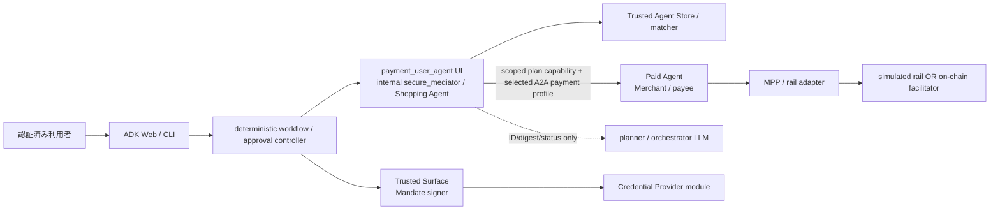
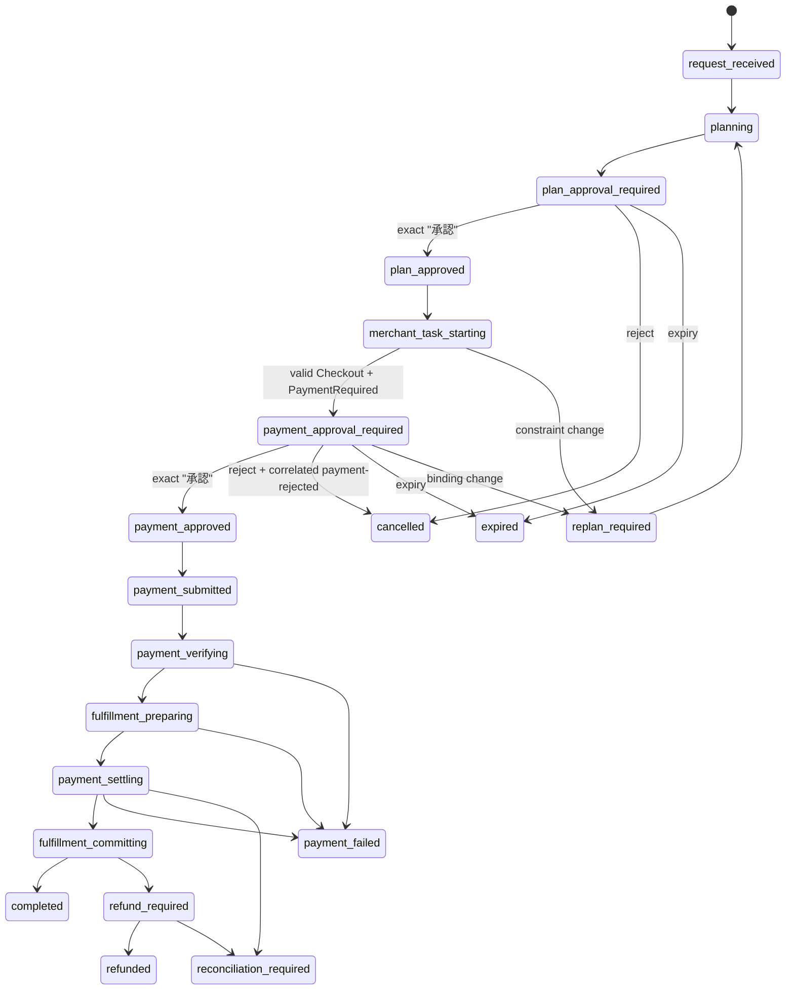

# AP2 v0.2 / A2A x402 v0.1 統合仲介 — 実装要件定義

- 文書版: 1.2-implementation-aligned
- 作成日: 2026-08-15 (Asia/Tokyo)
- 要件レビュー反映日: 2026-08-15 (Asia/Tokyo)
- 対象リポジトリ: `TaichiHiromatsu/secure-ai-agent-matching-platform`
- 対象ブランチ: `codex/ap2-x402-integration`
- 入力: `docs/AP2_X402_PLAN_APPROVAL_HANDOFF.md`、`docs/AP2_X402_CURRENT_STATE_RESEARCH.md`
- 対象工程: Section 12 Step 2（要件詳細化）および Step 3（要件レビュー）反映版。設計・実装は対象外。

## 1. 文書の目的と規範

本書は、有料外部エージェントの選定、計画、計画承認、AP2 Human Present 決済承認、A2A x402 支払、履行を、利用者から見て一つの `secure_mediator` workflow に統合するための正式な実装要件を定義する。

実装時の命名は、利用者が ADK Web で選ぶ UI app を `payment_user_agent`、内部の仲介ロジックと耐久 workflow を `secure_mediation_agent` とした。本書の `secure_mediator` は後者の論理的な仲介主体を表す。UI adapter は認可の正本を持たず、利用者向け root が一つという要件は変わらない。

表中の一意な ID を持つ文を規範的要求とする。「しなければならない」は必須、「してはならない」は禁止、「条件付き」は当該条件でのみ必須を表す。実装方式は、本書が相互運用性または安全性のために固定するものを除き、後続の設計工程で決定する。

### 1.1 優先順位

要求間に実装上の競合が生じた場合は、次の順序を適用する。

| 優先度 | 目標 |
| --- | --- |
| P0 | 分離した payment path を `secure_mediation_agent` へ統合し、利用者向け root actor と durable workflow を一つにする。計画承認を迂回する direct payment path を残さない。 |
| P1 | 固定した公式 AP2 v0.2 に従い、Human Present の closed Checkout/Payment Mandate、役割別決定論的検証、公式署名済み Receipt を実装する。 |
| P2 | 固定した公式 A2A x402 Payments Extension v0.1 に適合する on-chain profile と、公式 URI を名乗らない simulation profile を分離する。official runtime conformance と、simulation fixture による wire-shape coverage を別々に判定する。 |

### 1.2 固定する公式基準

| ID | 要求 |
| --- | --- |
| BASE-001 | AP2 の規範基準を `google-agentic-commerce/AP2` commit `e1ea56db72a6385bce3e5c1112b3a56ce60acb43` の `docs/ap2/specification.md`、関連 flow/mandate 文書、canonical schema としなければならない。AP2 spec の SHA-256 は `32c3be5011f481d2760e56e7b9935b0842c3da0d5f7d7b8a68402a599f1e6aa3` とする。 |
| BASE-002 | A2A x402 の規範基準を `google-agentic-commerce/a2a-x402` commit `125db5526a965d2325459d1a9df2e274a7e42396` の `spec/v0.1/spec.md` としなければならない。spec content SHA-256 は `5cdc35ed8c4d7a93bb120f1782fd06e2cc3ef19036684f772e27d0d644c66940` とする。 |
| BASE-003 | official x402 profile の canonical extension URI を完全一致の `https://github.com/google-a2a/a2a-x402/v0.1` としなければならない。simulation profile はこの URI を宣言・activation してはならない。 |
| BASE-004 | AP2 と A2A x402 は別仕様として version、schema、transport、適合結果を別々に管理し、一つの project-local profile を両仕様の代用として扱ってはならない。 |
| BASE-005 | mutable な `main`、x402 v2、A2A package version、A2A wire versionを、上記 AP2 v0.2 または x402 extension v0.1 と混同してはならない。固定 commit を変更する場合は差分、理由、移行影響を文書化して利用者の承認を得なければならない。 |

公式参照:

- [AP2 v0.2 specification](https://github.com/google-agentic-commerce/AP2/blob/e1ea56db72a6385bce3e5c1112b3a56ce60acb43/docs/ap2/specification.md)
- [AP2 Human Present flows](https://github.com/google-agentic-commerce/AP2/blob/e1ea56db72a6385bce3e5c1112b3a56ce60acb43/docs/ap2/flows.md)
- [AP2 canonical schemas](https://github.com/google-agentic-commerce/AP2/tree/e1ea56db72a6385bce3e5c1112b3a56ce60acb43/code/sdk/schemas/ap2)
- [A2A x402 v0.1 specification](https://github.com/google-agentic-commerce/a2a-x402/blob/125db5526a965d2325459d1a9df2e274a7e42396/spec/v0.1/spec.md)
- [A2A x402 Python reference package](https://github.com/google-agentic-commerce/a2a-x402/tree/125db5526a965d2325459d1a9df2e274a7e42396/python/x402_a2a)

## 2. リリーススコープと適合表現

| ID | 要求 |
| --- | --- |
| SCOPE-001 | 必須リリース対象を、一利用者、一 tenant、一 merchant、一商品、一 quantity、単一通貨、Human Present closed-Mandate の happy path と、その拒否、改ざん、replay、timeout、restart、refund/reconciliation 分岐としなければならない。 |
| SCOPE-002 | 利用者は ADK Web と CLI のどちらからでも同じ workflow service を利用し、同一セッションで「計画提示 → `承認` → 決済提示 → `承認` → 完了」を実行できなければならない。 |
| SCOPE-003 | AP2 Human Not Present、open Mandate、累積 budget、split tender、FX、複数 merchant の一括 checkout は対象外としなければならない。 |
| SCOPE-004 | production KMS/HSM、実本人確認、KYC/AML、PCI/SCA、本番 chain/mainnet、法的な支払保証、適合認証は対象外とし、実装済みと表示してはならない。 |
| SCOPE-005 | initial fee policy は `zero-fee-v1` とし、`customerSurcharge`、`collectionRailCost`、`providerCommission`、`payoutRailCost` は 0 でなければならない。非ゼロ fee または direct merchant 以外の marketplace-of-record model は将来スコープとする。 |
| SCOPE-006 | local simulated rail は実資産、wallet signature、facilitator verification、on-chain transaction を表さず、AP2 Human Present protocol test と x402 v0.1 の data-shape/Task-correlation fixture test にのみ使用しなければならない。simulation runtime は canonical x402 URI を宣言・activation せず、別の project-local simulation profile/URI を使用しなければならない。 |
| SCOPE-007 | simulation-only build は「AP2 v0.2 Human Present demo」および「x402 v0.1 wire-shape test fixture (NOT CONFORMANT)」とだけ表示できる。「A2A x402 v0.1 compatible/conformant」「x402 v0.1 settlement conformant」「on-chain settled」「完全準拠」と表示してはならない。 |
| SCOPE-008 | canonical x402 URI を宣言・activation する official profile では、on-chain rail adapter が公式 `exact` scheme、対応 blockchain network/token-contract asset/wallet `payTo`、wallet-signed payload、facilitator verify/settle、実 transaction hash、TLS を実装し、ACC-030 を含む受入試験を通過しなければならない。これらを満たさない構成で official profile を enable にしてはならない。 |

## 3. 役割、主体、信頼境界の決定

### 3.1 採用する役割対応

現行の「paid agent を Merchant と登録する一方で platform を payee にする」曖昧な marketplace-of-record model は、今回の Human Present demo では採用しない。最小かつ AP2 に忠実な構成として、サービスを販売する有料外部エージェントを Merchant かつ payee とする。

| 主体 / component | AP2 role | x402 / A2A role | 決定 |
| --- | --- | --- | --- |
| 利用者 | Human / credential subject | approval origin | pre-authenticated demo identity。二つの意思表示を行う。agent role ではない。 |
| `payment_user_agent` UI／内部 `secure_mediator` | Shopping Agent | A2A client | 利用者向け root は一つ。内部workflowがmatch、plan、表示、Merchant Task相関を行う。LLM は支払検証・署名をしない。official profile でのみ x402 Client Agent を名乗る。 |
| deterministic approval controller／Trusted Surface | Trusted Surface | なし | `payment_user_agent` UXの背後にある、内部`secure_mediator`のnon-agentic trust component。承認対象を表示し、認証済み利用者の同意を受け、公式signed Mandate presentationを生成する。 |
| `paid_booking_agent` 等の有料外部エージェント | Merchant | x402 Merchant / A2A server（official profile のみ） | signed Checkout を提示し、Checkout Mandate と scoped credential を検証し、サービスを履行し、Checkout Receipt を署名する。simulation profile では x402 Merchant 適合を主張しない。 |
| paid external Merchant | payee | `payTo` owner（official profile のみ） | `PaymentMandate.payee` と x402 `payTo` は同じ onboarding 済み Merchant identity/wallet に解決される。mediation platform は今回の payee ではない。simulation では wallet owner であると表示しない。 |
| payment service 内 CP module | Credential Provider | payment support / Signing Service boundary | signed Payment Mandate presentation を検証し transaction-scoped credential/token を発行する。official x402 profile では、選択した payment instrument の wallet/signing service を決定論的に呼び出して scheme-defined `PaymentPayload` を作る。 |
| payment service 内 MPP module | Merchant Payment Processor | facilitator/rail adapter boundary | scoped credential と Payment Mandate binding を検証し payment を処理し、Payment Receipt を署名する。simulation と on-chain facilitator adapter を分離する。 |
| Trusted Agent Store / matcher | discovery / policy boundary | Agent Card consumer | merchant identity、keys、endpoint、skill、selected-profile extension、許可 rail を検証して候補を制限する。 |

### 3.2 役割境界要件

| ID | 要求 |
| --- | --- |
| ROLE-001 | 利用者向け root agent は `payment_user_agent` 一つでなければならない。これは内部 `secure_mediation_agent` workflow の薄い UI adapter とし、旧 `payment_demo_user_agent` を新規統合 workflow の入口として公開してはならない。 |
| ROLE-002 | `secure_mediator` は AP2 Shopping Agent と selected-profile A2A client を担い、official profile でのみ x402 Client Agent を名乗らなければならない。AP2 Trusted Surface、CP、MPP、Merchant の検証責務を LLM reasoning で代行してはならない。 |
| ROLE-003 | Trusted Surface は non-agentic deterministic component でなければならず、利用者 credential、Mandate signing key、raw payment proof を LLM prompt、agent state、tool textへ渡してはならない。 |
| ROLE-004 | 有料外部エージェントを AP2 Merchant に固定し、official x402 profile では同じ主体を x402 Merchant に固定しなければならない。その onboarding identity を `PaymentMandate.payee.id`、signed Checkout issuer、Checkout Receipt issuer、official profile の x402 `payTo` owner の対応元にしなければならない。 |
| ROLE-005 | mediation platform を payee とする旧 upstream marketplace charge と、Merchant を payee とする新統合 flow を同じ profile、Task または Receipt chain で混在させてはならない。 |
| ROLE-006 | demo の単純化のため CP と MPP を同じ deployable payment service に同居させてよいが、論理 module、issuer ID、signing key/kid、trust policy、検証関数、監査 event を役割別に分離しなければならない。 |
| ROLE-007 | Trusted Surface を `secure_mediator` と同じ deployable に同居させる場合も、agent/LLM から直接呼べない typed interface、別 signing authority、秘密値を返さない応答を持たなければならない。 |
| ROLE-008 | AP2 role 間 API transport は AP2 の scope 外として project-local internal API を使用してよいが、その URI や envelope を AP2 公式 transport と称してはならない。 |
| ROLE-009 | Store の onboarding record は Merchant ID、signed Checkout/Receipt verification keys、A2A endpoint、skill/product、payment profile、profile ごとの extension URI、許可 scheme/network/asset、official profile の `payTo` wallet、CP/MPP trust relationship、validity/version を拘束しなければならない。canonical x402 URI と simulation URI を同じ profile record に併記してはならない。 |
| ROLE-010 | discovery と Agent Card 読み取りは計画承認前に許可してよいが、merchant quote/Checkout、payment Task、order、charge、guarantee、settlement、fulfillment を作る副作用は許可してはならない。 |
| ROLE-011 | x402 Signing Service/wallet は Agent/LLM から分離した deterministic boundary とし、payment approval、CP verification、original `taskId`、accepted requirements digest、scheme/network/asset/payTo/amount/expiry を検証してから一回限りの scheme-defined payload を生成しなければならない。simulation signer は wallet signature を生成したと称してはならない。 |

### 3.3 信頼境界



| ID | 要求 |
| --- | --- |
| TRUST-001 | workflow controller、Trusted Surface、Merchant、CP、MPP は、相手 role の issuer、audience、key ID、trust version、有効期間、tenant、対象 transaction を deterministic code で検証しなければならない。 |
| TRUST-002 | role co-location は検証省略を許可せず、同一 process 内の呼出しでも外部 role 間と同じ署名・binding・audit 要件を適用しなければならない。 |
| TRUST-003 | demo key は asymmetric trust chain と安定した issuer/kid を持ち、source control 内の production credential として扱ってはならない。HMAC test key で公式 Mandate または Receipt を代用してはならない。 |
| TRUST-004 | payment evidence store は一般 conversation/session/artifact store と分離し、agent/LLM は raw Mandate、credential、payment payload、private key を読み取れないようにしなければならない。 |

## 4. 単一ワークフローと状態モデル

### 4.1 正本

| ID | 要求 |
| --- | --- |
| WF-001 | durable mediation workflow aggregate を利用者依頼から完了までの唯一の authoritative state とし、ADK session boolean、CLI local state、payment demo session を認可の source of truth にしてはならない。 |
| WF-002 | workflow は `workflowId`、tenant/customer/session/context、current state、state version、active plan ID/digest、plan approval ID/consume event/downstream capability IDs、selected payment profile、merchant A2A task ID、order/checkout hash、payment approval ID、Mandate/credential/receipt digest、timestamps を相関保持しなければならない。 |
| WF-003 | Merchant 側 A2A Task は merchant payment subflow の authoritative record であり、mediation workflow は同一 `taskId` を不変に相関し、Task state と workflow state の許可された mapping だけを受理しなければならない。 |
| WF-004 | 状態遷移は optimistic version または同等の compare-and-set で原子的に行い、表外遷移、過去 state への更新、二重副作用を拒否しなければならない。 |
| WF-005 | 状態更新と後続外部呼出しの intent は transactional outbox または同等の durable handoff を用い、process crash により承認済み intent が失われたり副作用が無制御に重複したりしてはならない。 |

### 4.2 必須状態



| State | 許可する意味 / 不変条件 |
| --- | --- |
| `request_received`, `planning` | request normalization、discovery、matching、plan generation のみ。merchant quote/order/payment/fulfillment は 0 件。 |
| `plan_approval_required` | immutable plan snapshot が提示済み。plan approval 以外の有料副作用は禁止。 |
| `plan_approved` | plan approval record と検証・consume 済み signed platform plan authorization が存在する。payment approval、charge はまだ存在しない。 |
| `merchant_task_starting` | consume event と Merchant audience/operation-scoped capability を検証して初めて Merchant A2A Task/Checkout を要求できる。 |
| `payment_approval_required` | valid signed Checkout、plan 内 quote、selected-profile PaymentRequired を保存・表示済み。Task は `input-required`。 |
| `payment_approved` | 二つ目の承認、signed closed Mandates、必要な scoped credential が存在する。settlement は未実行。 |
| `payment_submitted` | original merchant `taskId` へ selected-profile の `payment-submitted` Message を durable 送信済みまたは送信待ち。 |
| `payment_verifying` | Merchant/MPP が AP2 と selected-profile payload を検証中。failure まで charge/commit を成功扱いしない。 |
| `fulfillment_preparing` | Merchant は x402 v0.1 の work-before-settle recommendation に従い、可能な範囲で可逆な準備または成果生成を行う。 |
| `payment_settling` | verified payload だけを一意な settlement attempt として処理する。 |
| `fulfillment_committing` | settlement success 後、予約確定等の最終 commit と Receipt 発行を行う。 |
| `completed` | Merchant Checkout Receipt、MPP Payment Receipt、selected-profile の最終 receipt history、業務 Artifact が全て検証・保存済み。 |
| `replan_required` | Merchant/agent/skill/product/quantity/total/currency/fee policy/rail/expiry の差分により旧 plan approval を失効済み。 |
| `payment_failed` | definitive failure。selected-profile の `payment-failed` と失敗 receipt/reason を保存し、成功副作用を表示しない。 |
| `reconciliation_required` | external outcome が不明。成功・失敗を推測せず operator/reconciler が authoritative provider を照会する。 |
| `refund_required`, `refunded` | settle 後の fulfillment failure を元 record の上書きでなく compensating records として処理する。 |
| `cancelled`, `expired` | terminal。charge/settlement/fulfillment を開始してはならない。 |

| ID | 要求 |
| --- | --- |
| WF-006 | plan approval 前に Merchant へ monetized skill request、quote、Checkout または payment requirement を要求してはならない。 |
| WF-007 | payment approval 前に wallet/rail charge、settlement、Merchant fulfillment commit、Receipt success を作ってはならない。 |
| WF-008 | plan approval と payment approval は互いを代用せず、片方の record、nonce、signature、event をもう片方として受理してはならない。 |
| WF-009 | quote/Checkout/requirements が plan constraint を外れた場合、payment approval を提示せず active plan approval を失効させ `replan_required` へ遷移しなければならない。 |
| WF-010 | definitive settlement success 後の fulfillment failure は success を返さず `refund_required`、結果不明は `reconciliation_required` にしなければならない。 |
| WF-011 | x402 の work-before-settle が対象 skill で安全に実行できない場合、Merchant は設計時に reversible prepare/commit 境界または例外理由を定義し、UI と conformance report に順序差を表示しなければならない。 |
| WF-012 | refund は AP2 v0.2 Receipt または x402 v0.1 `x402SettleResponse` を上書き・再分類せず、original payment/settlement/Receipt ID と refund reason/amount/currency、provider refund ID/status を拘束した project-local compensating record として idempotent に実行しなければならない。AP2/x402 が refund protocol を定義していると称してはならない。 |
| WF-013 | reconciler は `reconciliation_required` で新しい charge/settlement/fulfillment を開始せず、保存済み external ID を authoritative provider に照会し、evidence 付きの確定結果だけで `payment_failed`、`refund_required`、`refunded` または手動対応 terminal state へ遷移しなければならない。operator action は認証・認可・監査・冪等でなければならない。 |

## 5. 計画スナップショット、承認、結び付け

### 5.1 変更不能な計画スナップショット

| ID | 要求 |
| --- | --- |
| PLAN-001 | planner の free-form Markdown と `plan_approved: bool` を認可 artifact にせず、versioned structured plan snapshot を canonical JSON として保存しなければならない。Markdown は同 snapshot から生成する表示物とする。 |
| PLAN-002 | canonicalization は RFC 8785 JSON Canonicalization Scheme または固定仕様として同等性を contract test できる方式を一つ採用し、UTF-8 canonical bytes の SHA-256 を `planDigest` としなければならない。 |
| PLAN-003 | digest 対象から `planDigest` 自身、表示専用 localized text、mutable status を除外し、対象 field と canonicalization version を schema で固定しなければならない。 |
| PLAN-004 | snapshot は少なくとも下記 Appendix A の全 field を持ち、作成後に上書きしてはならない。変更は新しい `planId`/`planVersion`/digest を持つ snapshot として作らなければならない。 |
| PLAN-005 | selected Agent Card は fetch 時の canonical digest、agent ID、endpoint、skill、payment profile/extension、signing key/onboarding version を snapshot に拘束し、後の Store 更新で既承認 plan の意味を変えてはならない。 |
| PLAN-006 | amount は integer minor units と ISO-4217 currency/decimals で扱い、浮動小数点、LLM による換算または丸めを使用してはならない。 |
| PLAN-007 | plan expiry 後、Store trust/key/endpoint 失効後、customer/tenant/session 不一致時は merchant Task を開始してはならない。 |

### 5.2 計画承認

| ID | 要求 |
| --- | --- |
| PLAN-008 | plan approval は `approvalId`、`intent=approve-plan`、tenant/customer/session/context、plan ID/version/digest、approvedAt/expiresAt、single-use nonce、issuer、audience を持つ別 record として永続化しなければならない。 |
| PLAN-009 | workflow controller が plan gate を開くときは、PLAN-008 の内容を拘束した asymmetric signed platform plan authorization を検証しなければならない。service 間では、その検証済み approval から派生させた audience/operation/workflow/task/idempotency scope 付き capability または同等の検証可能な authorization を使用しなければならない。いずれも AP2 Mandate ではなく project-local authorization と明示しなければならない。 |
| PLAN-010 | platform plan authorization は AP2 Mandate schema または x402 official keys に未定義 field を挿入せず、project namespace metadata または internal typed field で運ばなければならない。 |
| PLAN-011 | approval nonce は `plan_approval_required` から `plan_approved` への最初の正当な workflow transition で原子的に consume し、別 workflow/tenant/customer への replay を拒否しなければならない。同一 transition の同一 idempotent retry は保存済み結果を返さなければならない。consume 済み approval object/nonce 自体を複数の downstream service authorization として転送してはならない。 |
| PLAN-012 | `selectedAgentId`、Merchant/payee、skill/product、quantity、maximum customer total、currency/decimals、fee policy、許可 network/asset、fulfillment constraint の一つでも変われば旧 approval を失効させなければならない。 |
| PLAN-013 | order、merchant Task、signed Checkout、selected-profile requirements、AP2 Mandates、credential、settlement、Receipt は workflow store の相関 graph を通じ `planId` と `planDigest` へ到達できなければならない。 |
| PLAN-014 | downstream capability は呼出し先ごとに別 ID/nonce/audience/operation/expiry を持ち、元 `approvalId`/`planId`/`planDigest` と対象 workflow/order/task を拘束しなければならない。各 capability の consume と retry は独立して原子的・冪等でなければならない。 |

### 5.3 二つの完全一致 `承認`

| ID | 要求 |
| --- | --- |
| APPROVAL-001 | transport framing を除く user message の text が Unicode code point 列として完全に `承認` と一致する場合だけ承認候補とし、trim、Unicode normalization、部分一致、LLM intent classification を行ってはならない。 |
| APPROVAL-002 | `yes`、`はい`、`OK`、`承認します`、前後空白付き `承認`、複数 part message を承認として扱ってはならない。 |
| APPROVAL-003 | current state が `plan_approval_required` のときだけ `承認` を plan approval として記録し、payment approval、Mandate、charge を生成してはならない。 |
| APPROVAL-004 | current state が `payment_approval_required` のときだけ `承認` を payment approval として記録し、同時に plan approval を新規作成または更新してはならない。 |
| APPROVAL-005 | approval pending でない state の `承認` は `APPROVAL_NOT_PENDING` とし、state、approval record、nonce、外部副作用を変更してはならない。 |
| APPROVAL-006 | 二つの approval は別 ID、別 intent、別 timestamp、別 nonce、別 signed object、別 audit event を持ち、同一 DB row または boolean へ折り畳んではならない。 |
| APPROVAL-007 | plan/Checkout/price/requirements が変わった場合、旧 approval input の再送や browser refresh を新内容への同意と解釈してはならない。 |

## 6. AP2 v0.2 Human Present closed-Mandate 要件

### 6.1 プロトコルオブジェクト

| ID | 要求 |
| --- | --- |
| AP2-001 | AP2 実装は固定 commit の canonical schema と公式 SDK runtime を直接利用するか、同 schema/fixture との byte/semantic contract test を通る型を使用しなければならない。 |
| AP2-002 | Merchant は fresh entropy、issuer、kid、audience、checkout/order identity、line item、quantity、amount/currency、expiry を拘束した signed `checkout_jwt` を発行しなければならない。列挙可能な低エントロピー payload に deterministic HS256 signature を施した現行方式を公式 Checkout の代用にしてはならない。 |
| AP2-003 | closed Checkout Mandate Content は exact `vct=mandate.checkout.1`、Merchant-signed serialized `checkout_jwt`、その exact string bytes を `_sd_alg` または既定 SHA-256 で hash した `checkout_hash` を持たなければならない。 |
| AP2-004 | closed Payment Mandate Content は exact `vct=mandate.payment.1`、`transaction_id=checkout_hash`、Merchant を示す `payee`、integer minor-unit `payment_amount` と ISO-4217 currency、transaction-scoped `payment_instrument` を持たなければならない。 |
| AP2-005 | optional `iat`、`exp`、`pisp`、`execution_date`、`risk_data` を使用する場合は公式 schema と role policy に従い、未知 constraint を無視してはならない。 |
| AP2-006 | Mandate Content の plain JSON または外側の project HMAC digest だけを AP2 Mandate と称してはならず、Human Present closed Mandates を User Credential または trusted Agent Provider に根ざす公式署名済み VDC/presentation として生成・検証しなければならない。 |
| AP2-007 | concrete crypto/profile は固定 AP2 SDK が採用する SD-JWT/delegated SD-JWT chain と互換でなければならず、issuer、holder、delegation、audience、nonce、iat/exp、key status を検証しなければならない。 |
| AP2-008 | demo Trusted Surface は事前登録された test user credential/trust anchor と明示的な test identity を使用してよいが、チャットの文字列だけで本人認証が完了した、または production user credential であると表示してはならない。 |
| AP2-009 | CP は signed Payment Mandate presentation を検証後にのみ transaction-scoped payment credential/token を発行しなければならない。AP2 v0.2 は credential/token の wire schema を定義しないため、project-local credential profile は checkout hash、payee、amount/currency、instrument、Merchant/MPP audience、expiry、single-use ID を拘束し、AP2 公式 schema と称してはならない。official x402 profile では accepted requirements digest と wallet-signed payload digest も同じ credential record に拘束しなければならない。 |
| AP2-010 | Merchant は signed Checkout Mandate と scoped credential/token を受け、Mandate signature/trust、`checkout_hash` と自己の最新 `checkout_jwt` exact bytes、order/amount/payee/expiry、Merchant audience/operation-scoped plan capability を deterministic に検証しなければならない。 |
| AP2-011 | MPP は scoped credential/token を受け、project profile がその中または参照先に拘束する signed Payment Mandate、`transaction_id`/checkout binding、payee、amount/currency、instrument、Merchant、settlement target、expiry、replay status を deterministic に検証してから payment を処理しなければならない。この credential 内包/参照方式は AP2 が示す許容例を採用する project decision であり、AP2 公式 token schema と称してはならない。 |
| AP2-012 | Shopping Agent は Merchant signed Checkout、最終 Checkout Receipt、Payment Receipt の issuer/signature/reference/status を deterministic に検証し、LLM の自然言語判断を検証結果に使用してはならない。 |

### 6.2 consent、価格、binding

| ID | 要求 |
| --- | --- |
| AP2-013 | Trusted Surface は payment approval 前に Merchant/payee、line item、quantity、Checkout ID、次の7価格項目、currency/decimals、instrument、expiry、selected payment profile と scheme/network/asset/payTo、simulation/on-chain 区分を表示しなければならない。 |
| AP2-014 | 7価格項目は `merchandiseAmount`、`customerSurcharge`、`collectionRailCost`、`customerTotal`、`providerCommission`、`merchantPayableAmount`、`payoutRailCost` とし、0 の項目も省略してはならない。 |
| AP2-015 | initial `zero-fee-v1` では `customerTotal == merchandiseAmount == merchantPayableAmount` かつ他4項目を0としなければならない。 |
| AP2-016 | displayed `customerTotal`、Payment Mandate `payment_amount`、signed Checkout total は同一 minor-unit amount/currency でなければならない。selected payment profile の asset unit との対応は versioned deterministic conversion policy で拘束し、暗黙の FX または丸めを行ってはならない。 |
| AP2-017 | plan snapshot、signed Checkout、Checkout Mandate、Payment Mandate、scoped credential、settlement request の各 exact bytes/digest と ID を immutable correlation record で結び、どの段階でも別 order/task/plan へ差し替えてはならない。 |

### 6.3 公式 Receipt と拒否

| ID | 要求 |
| --- | --- |
| AP2-018 | MPP は Payment Mandate/payment credential を処理した accept/reject の結果について canonical `payment_receipt` schema に従う MPP-signed Payment Receipt JWT を発行し、`status`、`iss`、`iat`、closed Payment Mandate hash の `reference`、`payment_id` を必須としなければならない。Success は `psp_confirmation_id` と `network_confirmation_id`、Error は `error` と `error_description` を持たなければならない。 |
| AP2-019 | Merchant は Checkout Mandate を処理した accept/reject の結果について canonical `checkout_receipt` schema に従う Merchant-signed Checkout Receipt JWT を発行し、`status`、`iss`、`iat`、closed Checkout Mandate hash の `reference` を必須としなければならない。Success は `order_id`、Error は `error` と `error_description` を持たなければならない。 |
| AP2-020 | Merchant が Checkout Mandate verification を拒否した場合は Checkout Receipt、CP/Network が Payment Mandate verification を拒否した場合はその verifier が署名する Payment Receipt、MPP が payment processing を拒否した場合は MPP-signed Payment Receipt を返さなければならない。`invalid_credential`、`invalid_mandate`、`unresolved_constraint`、`mandates_not_supported` を stable domain error と対応付け、単なる JSON-RPC exception で Receipt chain を失ってはならない。 |
| AP2-021 | Checkout Receipt と Payment Receipt は別 issuer、別 key/kid、別 signed bytes、別 digest とし、一方を他方として受理してはならない。 |
| AP2-022 | exact signed Mandates、credential/token、Receipt bytes、trust/key snapshot を evidence store に保存し、後から signature/reference chain を offline 再検証できなければならない。 |
| AP2-023 | Shopping Agent は signed Checkout Mandate と project-local scoped credential/token を Merchant へ同じ transaction context で渡さなければならない。official x402 profile では credential と `x402.payment.payload` の exact digest を一対一に相関し、Merchant から MPP/facilitator へ渡す payment authorization が CP の検証済み credential と別物へ差し替わらないことを deterministic に検証しなければならない。AP2 object は x402 official key の中へ追加してはならない。 |
| AP2-024 | final AP2 Payment Receipt と selected-profile settlement receipt は同じ settlement attempt ID に相関しなければならない。official x402 profile では Payment Receipt の `network_confirmation_id` と x402 success receipt の `transaction`/`network` の対応を versioned deterministic mapping で検証し、別 transaction/network の Receipt を同じ payment success として束ねてはならない。simulation reference はこの mapping の on-chain transaction として扱ってはならない。 |

## 7. A2A x402 Payments Extension v0.1 要件

### 7.1 declaration と activation

| ID | 要求 |
| --- | --- |
| X402-001 | official x402 profile を enable にする monetized Merchant の Agent Card は `capabilities.extensions` に canonical v0.1 URI を完全一致で宣言し、payment skill/product と必要性を machine-readable に示さなければならない。simulation profile は canonical URI を宣言してはならない。 |
| X402-002 | matcher は selected payment profile、Agent Card URI、skill、onboarding/trust、許可 rail を eligibility 条件として検証しなければならない。official profile では canonical URI と SCOPE-008 の on-chain capability、simulation profile では明示した project-local simulation URI を要求し、両者の欠落、typo、混在、旧 combined URN を拒否しなければならない。 |
| X402-003 | official profile の Shopping Agent は monetized request ごとに `X-A2A-Extensions` で canonical URI を activation しなければならない。Merchant は欠落または不一致を stable error で拒否し、payment Task/Checkout/fulfillment を作ってはならない。simulation profile はその project-local URI のみを activation し、canonical URI を送信してはならない。 |
| X402-004 | Merchant は activation 成功 response の `X-A2A-Extensions` に request で選択された同一 profile URI を echo しなければならず、Shopping Agent は echo の欠落または不一致を拒否しなければならない。simulation URI の echo を canonical URI の activation confirmation と解釈してはならない。 |

### 7.2 PaymentRequired、送信、Task相関

| ID | 要求 |
| --- | --- |
| X402-005 | Merchant は payment request を A2A Task state `input-required` として返し、`Task.status.message.metadata` に sibling dotted keys `x402.payment.status: payment-required` と `x402.payment.required` を置かなければならない。nested `x402.payment` object または `requirement` singular key で代用してはならない。 |
| X402-006 | `x402.payment.required` は `x402Version: 1` と非空 `accepts[]` を持ち、各 accepted requirement は少なくとも `scheme`、`network`、`asset`、`payTo`、decimal string `maxAmountRequired` を持たなければならない。 |
| X402-007 | Merchant は original Payment Requirements exact canonical bytes/digest、task ID、context ID、Checkout hash、expiry、Merchant-scoped plan capability と元 plan approval の reference を durable store に保存しなければならない。 |
| X402-008 | payment submission は original `taskId` を持つ新しい A2A Message とし、Message metadata に sibling dotted keys `x402.payment.status: payment-submitted` と `x402.payment.payload` を置かなければならない。custom `data.action=submit_payment` を公式 public contract の代用にしてはならない。 |
| X402-009 | `x402.payment.payload` は `x402Version: 1`、original accepted requirement と一致する top-level `network`/`scheme`、scheme-defined `payload` object を持たなければならない。 |
| X402-010 | Merchant は incoming `taskId` で original requirements を取得し、context、scheme、network、asset/payTo/max amount、payload signature、expiry、used status を照合しなければならない。client 提示の order ID だけを相関根拠にしてはならない。 |
| X402-011 | AP2 Mandate presentation、platform plan authorization/capability、価格内訳等の project field は x402 official keys を変更せず、別の collision-resistant project namespace A2A metadata に置かなければならない。Merchant が処理に必要な object を相手から参照不能な internal record だけに置いてはならず、exact bytes または authenticated content-addressed reference として渡さなければならない。guarantee は GATE-009 に従い新 flow で使用してはならない。 |

### 7.3 検証、settlement、receipt履歴

| ID | 要求 |
| --- | --- |
| X402-012 | official on-chain mode では Merchant/MPP または facilitator boundary が wallet-signed scheme payload を verify し、公式 scheme/network/asset の規則で on-chain settle しなければならない。 |
| X402-013 | settlement attempt ごとの `x402SettleResponse` を生成順の append-only `x402.payment.receipts` history に保存し、失敗/retry attempt を削除、上書き、成功一件へ集約してはならない。 |
| X402-014 | success receipt は少なくとも `success=true`、`network`、実 `transaction` を、failure receipt は少なくとも `success=false`、`network`、`errorReason` を持ち、任意 `payer` は検証済み値だけを使用しなければならない。 |
| X402-015 | success 時の最終 TaskStatus message は `x402.payment.status: payment-completed` と Task lifetime の全 `x402.payment.receipts` を含め、業務結果を A2A Artifact として同一 Task へ関連付けなければならない。 |
| X402-016 | payment failure は同一 TaskStatus message に `x402.payment.status: payment-failed`、safe reason/error metadata、その時点までの全 receipts を含めなければならない。 |
| X402-017 | x402 v0.1 の Merchant SHOULD work-before-settle を既定順序とし、Merchant は payload verify 後に安全な成果生成/可逆準備を行ってから settle し、settle success 後に外部副作用を commit しなければならない。例外は WF-011 に従う。 |
| X402-018 | final Task の receipt history と durable receipt store は同じ ordered entry/digest を持ち、restart/retry 後にも過去 attempt を欠落させてはならない。 |

### 7.4 simulation と on-chain の分離

| ID | 要求 |
| --- | --- |
| X402-019 | simulated rail の project-local profile は fixture coverage のため official dotted metadata と同形の keys、`x402Version=1`、Task correlation、receipt history を実装してよいが、canonical x402 URI を宣言・activation してはならない。scheme/network/transaction は `exact-simulated`、`demo:local`、`simulated=true` 等で明確に非 on-chain と識別し、official `exact` scheme、blockchain network、token contract、transaction hash として解釈してはならない。 |
| X402-020 | simulated rail の synthetic transaction reference または HMAC proof を official wallet signature、facilitator verification、on-chain transaction として検証または表示してはならない。 |
| X402-021 | contract test report は `official profile enablement`、`declaration/activation`、`wire metadata`、`task correlation`、`receipt history`、`wallet/facilitator verify`、`on-chain settle` を別項目で PASS/FAIL/NOT RUN としなければならない。simulation では official profile enablement と後二項目を PASS にしてはならず、declaration/activation は project-local simulation profile の結果として明記しなければならない。 |
| X402-022 | pinned Python reference package は有用な fixture として使用してよいが、reference executor の in-memory store や activation enforcement の欠落を normative spec より優先してはならない。 |
| X402-023 | 利用者が Payment Requirements を拒否または payment approval UI で取消した場合、client は original `taskId` を持つ新しい A2A Message の metadata に `x402.payment.status: payment-rejected` を設定して Merchant へ送り、Merchant は同じ Task を非成功状態で終了または取消可能にしなければならない。payment payload、settlement、success Receipt、fulfillment commit を生成してはならない。simulation profile でも同じ state-shape を fixture として検証しなければならない。 |
| X402-024 | official profile の `x402.payment.payload` は ROLE-011 の Signing Service/wallet が生成した exact payload でなければならず、CP credential record、signed Payment Mandate、accepted requirements digest、original task/context、plan capability と一対一に相関しなければならない。simulation payload は synthetic であることを別 project metadata と evidence record に拘束し、wallet-signed payload として受理してはならない。 |
| X402-025 | payment failure metadata の `x402.payment.error` は pinned spec の common error code（`INSUFFICIENT_FUNDS`、`INVALID_SIGNATURE`、`EXPIRED_PAYMENT`、`DUPLICATE_NONCE`、`NETWORK_MISMATCH`、`INVALID_AMOUNT`、`SETTLEMENT_FAILED`）または明示的に versioned した safe extension code を使用し、ERR-001 の domain error へ deterministic に対応付けなければならない。 |

## 8. 決定論的検証、bypass 防止、API 境界

| ID | 要求 |
| --- | --- |
| GATE-001 | `payment_demo_user_agent` から payment API へ直接 `start_order`/`submit_payment` する現行 root path を default discovery、ADK Web、documented CLI、public route から除外または hard-disable しなければならない。 |
| GATE-002 | orchestrator は payment step 開始時に workflow state、plan snapshot digest、plan approval signature/status/expiry/primary nonce の正当な consume event、selected agent/skill を deterministic code で再検証し、PLAN-014 の呼出し先別 capability を取得しなければならない。session boolean または consume 済み primary approval token の再送だけで通過してはならない。 |
| GATE-003 | payment service の REST、A2A、internal RPC、CLI の全 order/task creation entrypoint は PLAN-014 の audience/operation-scoped plan capability、tenant/customer/service identity、idempotency key を必須とし、欠落時は副作用0件で拒否しなければならない。 |
| GATE-004 | paid Merchant は monetized request に selected profile と一致する extension activation と Merchant audience の plan capability の両方を必須とし、どちらかがない direct invocation を拒否しなければならない。official profile では canonical x402 URI、simulation profile では project-local simulation URI だけを受理しなければならない。 |
| GATE-005 | public nginx/reverse proxy は internal CP/MPP/signer/operator/reconciliation route を公開してはならず、外部からの direct access は 404 または stable authorization error で拒否しなければならない。 |
| GATE-006 | LLM tool は typed plan request と safe status/digest のみを扱い、任意 payment payload、Mandate、credential、amount/payee、state transition を自然言語から構築または上書きできてはならない。 |
| GATE-007 | Merchant quote/Checkout を受けた mediation policy verifier は agent/merchant/skill/product/quantity、total ceiling、currency/decimals、fee policy、network/asset/payTo、expiry、signature/trust を plan と完全照合しなければならない。 |
| GATE-008 | amount、payee、checkout/task/plan binding、signature、nonce、state のいずれかが unknown または検証不能なら fail closed とし、推測、既定補完、LLM correction を行ってはならない。 |
| GATE-009 | integrated flow で platform-credit guarantee/deferred payout を発行してはならない。旧 marketplace guarantee/payout は legacy simulation profile に隔離し、新 flow の AP2/x402 Receipt として扱ってはならない。 |
| GATE-010 | REST、A2A、internal RPC、CLI の全 payment submission、verify、settle、fulfillment entrypoint は original merchant `taskId`/context、current workflow state、payment approval、signed Mandates、scoped credential、selected profile、operation-scoped capability、idempotency key を段階に応じて必須とし、order ID、plan authorization または x402 payload だけで後段を直接開始できてはならない。欠落・不一致時は副作用0件で拒否しなければならない。 |

## 9. 安定したエラー契約

### 9.1 エラーの外形

| ID | 要求 |
| --- | --- |
| ERR-001 | UI、CLI、A2A adapter、internal API は同じ stable domain error code を使用し、transport-specific status/JSON-RPC code は deterministic mapping としなければならない。 |
| ERR-002 | safe error envelope は `code`、一般化した `message`、`retryable`、`correlationId` を持ち、必要時だけ `currentState`、`expectedAction` を含めなければならない。 |
| ERR-003 | error は raw plan本文、credential、Mandate/payload/receipt bytes、signature、nonce、private key、他 tenant の存在、内部 stack trace を含んではならない。 |
| ERR-004 | payment submission 後の x402 failure は domain error に加え X402-016 の `payment-failed` Task status/receipt history を必ず残さなければならない。 |
| ERR-005 | authenticated caller から AP2 verifier が Mandate exact bytes を受領して Action Authorization を開始した後の rejection は、domain error に加え AP2-018〜AP2-020 の role-appropriate signed Error Receipt を残さなければならない。Mandate を受け取る前の transport/service-auth failure は AP2 rejection Receipt と称してはならない。malformed Mandate も exact received bytes から reference を安全に計算できる場合は verifier-signed Error Receipt を返さなければならない。 |

### 9.2 必須コード一覧

| Code | Retryable | 意味 |
| --- | --- | --- |
| `APPROVAL_EXACT_TOKEN_REQUIRED` | false | pending 中だが input が完全一致 `承認` ではない。 |
| `APPROVAL_NOT_PENDING` | false | current state に承認対象がない。 |
| `PLAN_APPROVAL_REQUIRED` | false | plan gate 前の direct execution。 |
| `PLAN_APPROVAL_INVALID` | false | signature、issuer、audience または status 不正。 |
| `PLAN_APPROVAL_EXPIRED` | false | plan/approval 期限切れ。 |
| `PLAN_BINDING_MISMATCH` | false | plan ID/digest/customer/session/task/order 不一致。 |
| `PLAN_CONSTRAINT_VIOLATION` | false | Merchant、skill、product、quantity、amount、currency、fee/rail policy の逸脱。 |
| `PAYMENT_APPROVAL_REQUIRED` | false | signed payment consent/Mandate なし。 |
| `PAYMENT_APPROVAL_EXPIRED` | false | Checkout/requirements/Mandate 期限切れ。 |
| `AP2_CHECKOUT_INVALID` | false | signed Checkout/hash/latest checkout 不正。 |
| `AP2_MANDATE_INVALID` | false | signed Mandate/schema/binding/trust 不正。 |
| `AP2_CREDENTIAL_INVALID` | false | CP token/presentation 不正。 |
| `AP2_CONSTRAINT_UNRESOLVED` | false | 未解決/未知 constraint。 |
| `X402_EXTENSION_REQUIRED` | false | canonical declaration/activation なし。 |
| `X402_ACTIVATION_MISMATCH` | false | activation echo 不一致。 |
| `X402_TASK_CORRELATION_MISMATCH` | false | original task/context と submission 不一致。 |
| `X402_REQUIREMENTS_MISMATCH` | false | scheme/network/asset/payTo/amount/version 不一致。 |
| `X402_PAYMENT_PAYLOAD_INVALID` | false | payload schema/signature 不正。 |
| `PAYMENT_FAILED` | 条件依存 | definitive verify/settle failure。 |
| `REPLAY_DETECTED` | false | 使用済み nonce/proof/credential の不正再利用。 |
| `IDEMPOTENCY_CONFLICT` | false | 同一 key で canonical request が異なる。 |
| `STATE_TRANSITION_CONFLICT` | true | concurrent/stale state update。 |
| `TENANT_BINDING_MISMATCH` | false | customer/session/tenant 越境。 |
| `RECONCILIATION_REQUIRED` | true | external result が不明。新規副作用は禁止。 |
| `UNSUPPORTED_LEGACY_PROFILE` | false | deprecated project-local payment profile を新 flow へ送信。 |

## 10. restart、冪等性、replay、並行性

| ID | 要求 |
| --- | --- |
| RES-001 | request→plan、plan approval、merchant Task creation、payment approval/Mandate issuance、CP credential issuance、x402 submission、verify、settle attempt、fulfillment prepare/commit、Receipt issuance、refund/reconcile はそれぞれ独立 idempotency scope を持たなければならない。 |
| RES-002 | idempotency record は actor/tenant、operation、key、canonical request hash、result ID/state、created/expiry time を保持し、同じ key/同じ hash は exact saved result、同じ key/異なる hash は `IDEMPOTENCY_CONFLICT` を返さなければならない。 |
| RES-003 | plan/payment approval、credential、x402 payload の nonce/unique ID は durable に原子消費し、別 scope への replay を拒否・監査しなければならない。 |
| RES-004 | process/container restart 後、`plan_approval_required` と `payment_approval_required` を含む全非終端 state、表示対象 exact snapshot、Merchant Task、requirements、Mandates、receipt history を復元しなければならない。 |
| RES-005 | restart または timeout 時に新しい plan/order/task/settlement を盲目的に作らず、保存済み idempotency key と external authoritative ID で再送または照会しなければならない。 |
| RES-006 | external settlement timeout は結果不明のまま `reconciliation_required` とし、新 nonce/key で再 charge してはならない。 |
| RES-007 | definitive failure 後の retry は同じ requirements/amount/payee/task と有効な Mandate の範囲で idempotent retry できる場合に限る。payload、requirements、Checkout または Mandate が変わる場合は新しい payment approval を要求しなければならない。 |
| RES-008 | parallel `承認`、parallel submit、duplicate delivery に対して plan approval、payment approval、settlement、fulfillment、Receipt の business effect は各一回以下でなければならない。 |

## 11. UI / CLI 要件

| ID | 要求 |
| --- | --- |
| UI-001 | ADK Web で選択可能な統合 root 名は `payment_user_agent` 一つとする。内部の認可正本は `secure_mediation_agent` workflow とし、旧 payment-only root を通常利用者へ提示してはならない。 |
| UI-002 | plan approval 画面は「計画の承認」と明記し、workflow/plan ID、selected agent/Merchant、skill/product/quantity、全 steps、最大総額、currency/decimals、fee policy、expiry、拒否方法を表示しなければならない。 |
| UI-003 | plan approval 画面は「この `承認` ではまだ決済されない。quote/Checkout 取得と実行開始だけを許可する」ことを明示しなければならない。 |
| UI-004 | payment approval 画面は「決済の承認」と明記し、order/merchant Task ID、Merchant/payee、line item/quantity、7価格項目、customer total、currency/decimals、instrument、scheme/network/asset/payTo、expiry、simulation/on-chain 区分を表示しなければならない。 |
| UI-005 | payment approval 画面は「この `承認` で signed Payment Mandate が生成され、customer payment の verify/settle が開始される」ことを明示しなければならない。 |
| UI-006 | pending state、承認対象、expiry、前回承認済みかを browser refresh/reconnect/restart 後も durable workflow から再表示しなければならない。 |
| UI-007 | CLI は ADK Web と同じ workflow endpoint/state machine/error catalog を使用し、CLI 内部だけで plan/payment approval または Mandate を捏造してはならない。 |
| UI-008 | `completed` 表示は plan ID、Merchant/order/task、業務結果、AP2 Checkout/Payment Receipt ID/digest、official profile の x402 receipt/transaction または project-local simulation reference、profile/conformance label を含み、秘密値を含んではならない。 |
| UI-009 | `cancelled`、`expired`、`payment_failed`、`reconciliation_required`、`refunded` を completed と異なる明確な文言で表示し、未知 outcome を成功と推測してはならない。 |

## 12. セキュリティ、データ、監査、可観測性

### 12.1 セキュリティ

| ID | 要求 |
| --- | --- |
| SEC-001 | canonicalization、hash、signature、trust resolution、amount/pricing、constraint、approval routing、state transition、replay/idempotency、Receipt verification は deterministic code で実行しなければならない。 |
| SEC-002 | private key、seed、raw credential、raw payment payload、authorization header、full signed presentation を source、Agent Card、prompt、tool text、一般 artifact、通常 log/error response に出力してはならない。 |
| SEC-003 | signer/CP/MPP/internal operator endpoint は service authentication、least privilege、audience restriction を持ち、public client または Merchant が許可外 role の operation を呼べてはならない。 |
| SEC-004 | customer/tenant/session、Merchant tenant、operator role の access boundary を status、retry、evidence、export、error、observability の全経路に適用し、推測可能な ID だけで他主体の record を返してはならない。 |
| SEC-005 | Merchant endpoint は scheme/host/port/redirect/DNS resolution 後 IP を allowlist と照合し、SSRF、metadata service、予期しない loopback/private network を既定拒否しなければならない。local demo 例外は環境別 allowlist に限定する。 |
| SEC-006 | production-like deployment は TLS を必須とし、loopback HTTP demo は conformance report と UI で transport limitation として表示しなければならない。 |
| SEC-007 | key rotation/revocation 後も過去 signed evidence を当時の trust snapshot/kid で検証でき、新規 issuance には revoked key を使用してはならない。 |
| SEC-008 | startup/readiness は schema migration、official pinned version/hash、keys/trust、Store allowlist、CP/MPP、rail mode、public route isolation を検査し、不整合時に ready を返してはならない。 |

### 12.2 耐久データと監査

| ID | 要求 |
| --- | --- |
| DATA-001 | 少なくとも workflow、immutable plan snapshot、plan approval/downstream capabilities、approval nonce、merchant task/requirements、signed Checkout、payment approval、signed Mandates、CP credential reference、settlement attempts、AP2 Receipts、selected-profile receipt history、idempotency、workflow events/outbox を durable storage に保持しなければならない。 |
| DATA-002 | signed object は exact bytes と cryptographic digest を evidence store に保存し、domain table は原則 ID/digest 参照を持たなければならない。署名対象 bytes を parse/re-serialize して置換してはならない。 |
| DATA-003 | immutable record の訂正、失効、refund、rejection は元 record を更新せず、元 ID/digest を参照する append-only event/record として保存しなければならない。 |
| DATA-004 | timestamp は UTC timezone-aware、amount は integer minor/unit value、ID は不透明で十分な entropy を持ち、schema/profile/canonicalization/policy version を各 record へ保存しなければならない。 |
| DATA-005 | audit event は actor/role/tenant、workflow/plan/order/task、operation、from/to state、approval intent、idempotency/replay result、safe error code、timestamp、関連 digest を持たなければならない。 |
| DATA-006 | secret/raw proof を除く correlation graph は operator が workflow ID から plan→Checkout→Mandates→credential→settlement attempts→fulfillment→Receipts を追跡できなければならない。 |
| DATA-007 | retention/delete/export は tenant authorization と監査を持ち、通常 process restart や container recreation で pending/payment evidence を自動消去してはならない。 |

### 12.3 可観測性

| ID | 要求 |
| --- | --- |
| OBS-001 | state transition、approval attempt、gate rejection、AP2 role verification、x402 activation/task/settlement、idempotent hit/conflict、replay、reconciliation を safe structured metrics/log/trace で観測できなければならない。 |
| OBS-002 | logs/traces は raw signed bytes でなく opaque ID/digest/correlation ID を使用し、simulation と on-chain mode を常に区別しなければならない。 |
| OBS-003 | plan gate bypass attempt、parallel approval/submit、unknown settlement、receipt mismatch、長時間 pending/reconciliation は alertable event を生成しなければならない。 |

## 13. スキーマ移行、互換性、廃止

| ID | 要求 |
| --- | --- |
| MIG-001 | migration は既存 SQLite を in-place で破壊せず、schema version を持つ forward migration とし、適用前 backup/rollback 手順と transaction failure recovery を定義しなければならない。 |
| MIG-002 | 新 schema は DATA-001 の record と unique/foreign-key/check constraint を表現し、少なくとも plan digest uniqueness、approval intent separation、task correlation、nonce uniqueness、settlement attempt ordering、idempotency uniqueness を DB level または同等に強制しなければならない。 |
| MIG-003 | 既存 `plan_approved` boolean は legacy read/display 用に残してよいが、新規 authorization、order、Merchant Task、payment では無視しなければならない。backfill で既存 true を signed plan approval に昇格してはならない。 |
| MIG-004 | 既存 order/task/receipt は `legacy-project-simulation` profile として read-only に識別し、公式 AP2 Mandate、official x402 Task または新 integrated workflow に自動変換・resume してはならない。 |
| MIG-005 | migration 中の未完了 legacy order は従来 profile 内で明示的に完了/取消/照会するか operator review に送り、新 profile と混ぜて継続してはならない。 |
| MIG-006 | migration test は空 DB、現行 fixture DB、各 legacy 非終端 state、途中失敗、再適用を検証し、二重 migration、data loss、false approval を起こしてはならない。 |
| COMP-001 | payment 非対応の既存 matching/planning/orchestration flow は従来どおり動作し、有料判定でない request に payment approval を要求してはならない。 |
| COMP-002 | `urn:secure-a2a:extensions:ap2-x402-marketplace:v1`、nested `x402.payment`、`x402Version: 2`、custom `data.action` は deprecated legacy profile とし、新 integrated Agent Card/Task/Message で発行してはならない。 |
| COMP-003 | legacy profile を新 endpoint で受けた場合は `UNSUPPORTED_LEGACY_PROFILE` と migration guidance を返し、暗黙に official v0.1 へ reinterpret してはならない。 |
| COMP-004 | `payment_demo_user_agent` と旧 payment CLI は default/off とし、保持する場合は operator-only legacy demo flag、別 storage/profile、非準拠ラベルを必須とし、新 production-like service/rail へ接続してはならない。 |
| COMP-005 | `/v1/orders`、custom `/a2a start_order|submit_payment` を保持する場合は public ingress から除外し、internal service auth を必須としなければならない。order/start は GATE-003、submit は GATE-010 の全 authorization/binding を満たさなければならず、既存 unauthenticated caller への互換性のため gate を緩和してはならない。 |
| COMP-006 | Agent Card、UI、CLI、docs、test report は AP2 version、x402 extension version、A2A wire/package version、rail mode を別 field で表示しなければならない。 |

## 14. 付録A — 必須の計画スナップショット

次は logical schema であり、物理 DB schema ではない。field 名を変更する場合も同じ意味と canonical digest coverage を維持しなければならない。

```json
{
  "schemaVersion": "secure-mediation-plan/1",
  "canonicalization": "RFC8785",
  "planId": "plan-...",
  "planVersion": 1,
  "tenantId": "tenant-...",
  "customerId": "customer-...",
  "sessionId": "session-...",
  "contextId": "context-...",
  "requestDigest": "sha256:...",
  "request": {
    "goal": "...",
    "constraints": {}
  },
  "selectedAgent": {
    "agentId": "paid-booking-agent",
    "agentCardDigest": "sha256:...",
    "endpoint": "https://merchant.example/a2a",
    "onboardingVersion": "...",
    "trustKeySetVersion": "..."
  },
  "merchant": {
    "id": "demo-merchant",
    "name": "Demo Merchant",
    "website": "https://merchant.example",
    "payeeId": "demo-merchant"
  },
  "skillId": "paid-booking",
  "productId": "demo-paid-booking",
  "quantity": 1,
  "steps": [
    {
      "stepId": "step-1",
      "agentId": "paid-booking-agent",
      "skillId": "paid-booking",
      "paymentRequired": true,
      "inputDigest": "sha256:..."
    }
  ],
  "maximumCustomerTotal": 1250,
  "currency": "USD",
  "decimals": 2,
  "feePolicyVersion": "zero-fee-v1",
  "allowedPayment": {
    "profile": "x402-wire-simulation/1",
    "extensionUri": "urn:secure-a2a:extensions:x402-wire-simulation:v1",
    "schemes": ["exact-simulated"],
    "networks": ["demo:local"],
    "assets": ["USD"],
    "railMode": "simulated"
  },
  "fulfillmentConstraints": {},
  "createdAt": "2026-08-15T00:00:00Z",
  "expiresAt": "2026-08-15T00:15:00Z"
}
```

`planDigest` は上記 canonical object の UTF-8 bytes から計算し、snapshot record の外側に保存する。official on-chain 構成では `allowedPayment.profile` を `a2a-x402/v0.1`、`extensionUri` を canonical URI、scheme/network/asset を実 `exact`/blockchain/token contract、`railMode=on-chain` に置き換え、新 plan と新 plan approval を必要とする。simulation の `exact-simulated`/`demo:local`/`USD` を official profile にコピーしてはならない。

## 15. テスト要件

| ID | 要求 |
| --- | --- |
| TEST-001 | unit test は plan canonicalization/digest、immutable mutation rejection、approval exact match、state transition、constraint/amount binding、signature/trust、nonce/idempotency、error mapping を正常/改ざん/境界値で検証しなければならない。 |
| TEST-002 | AP2 contract test は pinned canonical schema/SDK fixture に対し signed Checkout、closed Checkout/Payment Mandate presentation、Checkout/Payment Success/Error Receipt、exact hash/reference chain を検証しなければならない。CP credential は AP2 に canonical wire schema がないため、AP2 fixture への適合ではなく AP2-009 の project profile binding/security test として別に検証しなければならない。cross-profile test は AP2 Payment Receipt と selected-profile settlement receipt の attempt/network/transaction mapping を検証しなければならない。 |
| TEST-003 | x402 contract test は pinned normative spec と reference fixture に対し exact URI、Agent Card declaration、activation request/echo、dotted metadata、`x402Version=1`、original task correlation、payment-rejected を含む payment states、common error codes、ordered all-receipt history を検証しなければならない。official profile と simulation profile の Agent Card/activation を相互に受理しない negative test を含めなければならない。 |
| TEST-004 | simulation test と optional on-chain test suite を別 marker/report にし、simulation suite の成功で wallet/facilitator/on-chain tests を pass 扱いしてはならない。 |
| TEST-005 | integration test は `payment_user_agent` への初回依頼から二回の完全一致 `承認`、内部 `secure_mediation_agent` workflow、Merchant Task、AP2 verification、selected payment profile の verification、fulfillment、final receipts まで同一 workflow で検証しなければならない。simulation 実行を official x402 E2E pass と数えてはならない。 |
| TEST-006 | bypass/security test は direct orchestrator、全 order/start/submit/verify/settle/fulfill endpoint、payment-only root、Merchant direct call、missing/wrong-profile activation、forged/再利用 plan capability、missing payment approval/Mandate/credential、tenant/session crossover を副作用0件で拒否することを検証しなければならない。 |
| TEST-007 | negative test は `yes`/空白付き承認、agent/merchant/product/quantity/amount/currency/fee/network/payTo/task/checkout/nonce/signature 改ざん、expired/revoked key、legacy profile を検証しなければならない。 |
| TEST-008 | restart/crash-injection test は各非終端 state と state update/outbox、credential issuance、settlement request/response、fulfillment/Receipt 境界で再起動し、同じ state/bytes/history を復元し副作用が各一回以下であることを検証しなければならない。 |
| TEST-009 | concurrency test は二重 plan approval、二重 payment approval、duplicate A2A Message、parallel settle/fulfill、同一/異なる idempotency payload を検証しなければならない。 |
| TEST-010 | UI test は ADK Web の実操作で二つの承認ラベル、注意書き、7価格項目、状態復元、最終 conformance label を確認しなければならない。 |
| TEST-011 | CLI test は同じ fixture と workflow ID を用い、ADK Web と同じ遷移、error code、final correlation/Receipt を得ることを検証しなければならない。 |
| TEST-012 | migration/compatibility test は MIG-001〜MIG-006、legacy profile isolation、payment 非対応 agent regression を検証しなければならない。 |
| TEST-013 | security output test は success/error/timeout/restart の logs、traces、metrics、A2A messages、artifacts、LLM prompts に secret/raw credential/proof がないことを検証しなければならない。 |
| TEST-014 | clean container test は新規 image/volume と migrated fixture volume の双方で readiness、route isolation、E2E、restart を検証しなければならない。 |
| TEST-015 | 現行 payment/matching regression suite は期待値を新 profile/role model に更新した上で全件 green とし、過去の「65 tests passed」という記述だけを新実装の証跡にしてはならない。 |
| TEST-016 | rejection test は payment approval の利用者取消が original Task への `payment-rejected` Message を一回だけ生成し、payload/settlement/success Receipt/fulfillment を0件にすることを検証しなければならない。 |
| TEST-017 | compensation test は settle 後 fulfillment failure、refund success/failure/timeout、reconciliation result の各分岐で original evidence が不変、refund/reconcile record が append-only、追加 charge が0件、retry business effect が一回以下であることを検証しなければならない。 |

## 16. 受入条件

| ID | 前提／操作／期待結果 | 主な対応要件 |
| --- | --- | --- |
| ACC-001 | 前提: 新規有料依頼。操作: `payment_user_agent` へ最初の prompt を送る。期待結果: plan が表示され、Merchant quote／Task／order／charge／fulfillment は0件。 | ROLE-001, WF-006, UI-002 |
| ACC-002 | 前提: plan pending、操作: exact `承認`、期待結果: signed plan approval だけが1件保存され、payment approval/Mandate/charge は0件。 | APPROVAL-003, PLAN-008〜PLAN-011 |
| ACC-003 | 前提: plan pending、操作: `yes`、`はい`、`OK`、`承認します`、空白付き `承認`、期待結果: `APPROVAL_EXACT_TOKEN_REQUIRED` で副作用0件。 | APPROVAL-001, APPROVAL-002 |
| ACC-004 | 前提: approval pending でない state、操作: exact `承認`、期待結果: `APPROVAL_NOT_PENDING` で state/approval/外部副作用が不変。 | APPROVAL-005 |
| ACC-005 | 前提: plan 未承認または payment 未承認、操作: orchestrator/order/start/submit/verify/settle/fulfill API、old payment client、Merchant endpoint を段階外で直接呼ぶ、期待結果: stable gate error で新規 Task/Checkout/charge/settlement/fulfillment は0件。 | GATE-001〜GATE-005, GATE-010 |
| ACC-006 | 前提: valid plan approval、操作: paid step を開始、期待結果: selected Merchant に selected payment profile URI の activation と Merchant audience/operation-scoped plan capability を持つ一つの A2A Task が作られる。official profile のときだけ URI は canonical x402 URI である。 | PLAN-013〜PLAN-014, X402-003, GATE-004 |
| ACC-007 | 前提: selected profile の activation が欠落/不一致または official/simulation URI が混在、操作: monetized request、期待結果: stable error、extension echo/Task/Checkout/payment side effect は0件。 | X402-002〜X402-004 |
| ACC-008 | 前提: valid plan、操作: Merchant quote/Checkout が plan 内、期待結果: `input-required` Task に selected profile が定める exact dotted `payment-required` metadata、v1-shaped requirements、signed Checkout があり、payment approval UI が表示される。simulation では project-local profile と非準拠 label が付く。 | X402-005〜X402-007, X402-019, AP2-002, UI-004 |
| ACC-009 | 前提: valid plan、操作: Merchant/agent/skill/product/quantity/total/currency/fee/network/payTo の一つが計画外、期待結果: payment UI/requirement を利用者に承認させず旧 approval を失効して `replan_required`。 | WF-009, PLAN-012, GATE-007 |
| ACC-010 | 前提: payment pending、操作: exact `承認`、期待結果: plan approvalとは別の signed closed Checkout/Payment Mandates と scoped credential が生成され、official profile では accepted requirements に拘束された wallet-signed payload が生成され、customer payment effect は高々1回。simulation payload は synthetic と識別される。 | APPROVAL-004, ROLE-011, AP2-003〜AP2-011, X402-024, RES-008 |
| ACC-011 | 前提: payment pending、操作:非 exact input、期待結果: Mandate、credential、payment submission、charge は0件。 | APPROVAL-001, APPROVAL-002 |
| ACC-012 | 前提: valid payment approval、操作: payment Message を送信、期待結果: original `taskId`、dotted `payment-submitted` keys、v1-shaped scheme/network payload があり、別 taskへの差替えは拒否される。official profile の payload は wallet signature と CP credential に一対一に拘束される。 | X402-008〜X402-010, X402-024, AP2-023 |
| ACC-013 | 前提: valid AP2/selected-payment-profile submission、操作: Merchant/CP/MPP が処理、期待結果:各 role の signature/trust/checkout/payee/amount/task/replay/credential-payload binding 検証が deterministic に実行される。 | TRUST-001, AP2-009〜AP2-012, AP2-023, X402-024 |
| ACC-014 | 前提: successful simulated settlement、操作: final Task を取得、期待結果: `payment-completed`、ordered all-attempt wire-shaped simulation receipts、Merchant Checkout Receipt、MPP Payment Receipt、業務 Artifact があり、同じ simulation settlement attempt に相関し、project-local simulation/NOT CONFORMANT と表示され、canonical x402 URI または実 transaction hash はない。 | AP2-018〜AP2-024, X402-013〜X402-021 |
| ACC-015 | 前提: failed settlement attempt、操作: Task を取得、期待結果: `payment-failed`、error reason、failed receipt を含む全 history があり、completed/real transaction と表示されない。 | X402-014, X402-016, ERR-004 |
| ACC-016 | 前提: AP2 invalid credential/mandate/unresolved constraint、操作: Merchant/CP/Network/MPP verifier が拒否、期待結果: stable error と canonical schema の role-appropriate signed Error Receipt があり後続 settlement/fulfillment は0件。 | AP2-018〜AP2-020, ERR-005 |
| ACC-017 | 前提: signed evidence、操作: offline verification、期待結果: plan authorization/capability→Checkout exact hash→closed Mandates→CP credential→AP2 Receipts→selected-profile settlement receipt の issuer/reference/digest/settlement-attempt chain を再検証できる。 | PLAN-013, PLAN-014, AP2-017, AP2-022〜AP2-024, X402-018 |
| ACC-018 | 前提: same idempotency key、操作: same canonical input/changed input、期待結果:前者は exact prior result、後者は `IDEMPOTENCY_CONFLICT` で外部副作用は増えない。 | RES-001, RES-002 |
| ACC-019 | 前提: used approval/credential/payload nonce、操作:別 workflow/task/tenantで再利用、期待結果: `REPLAY_DETECTED`、監査 event、外部副作用0件。 | PLAN-011, RES-003 |
| ACC-020 | 前提:各 nonterminal state、操作: process/container restart、期待結果:同じ workflow/approval target/task/requirements/signed bytes/receipt history から再開し、approval/settlement/fulfillment は重複しない。 | RES-004〜RES-008 |
| ACC-021 | 前提: settlement timeout、操作: retry/restart、期待結果:新 chargeを作らず `reconciliation_required` と同じ external ID を照会する。 | RES-005, RES-006 |
| ACC-022 | 前提: parallel 二回目承認または duplicate Message、操作:競合実行、期待結果: approval、settlement、fulfillment、各 Receipt の business effect は各一回以下。 | WF-004, RES-008 |
| ACC-023 | 前提: ADK Web、操作:依頼→`承認`→価格→`承認`、期待結果:二つの承認対象/注意書きと completed evidence を一つの root/session で確認できる。 | UI-001〜UI-009 |
| ACC-024 | 前提: CLI、操作:同一シナリオ、期待結果: ADK Web と同じ workflow states、error codes、Receipt/correlation result。 | UI-007, TEST-011 |
| ACC-025 | 前提: public ingress、操作: internal signer/CP/MPP/operator/legacy start/submit route を呼ぶ、期待結果: 404 または authorization error で secret/tenant existence を漏らさない。 | GATE-005, SEC-003, SEC-004 |
| ACC-026 | 前提: migrated legacy DB、操作: new integrated request、期待結果: old boolean/order/URN/custom action は authorization に使われず、新 signed plan approval/capability と明示した selected-profile records だけで進む。 | MIG-003〜MIG-005, COMP-002〜COMP-005 |
| ACC-027 | 前提: payment 非対応 agent、操作:従来無料 workflow、期待結果: payment approval なしで既存 matching/planning/orchestration behavior が維持される。 | COMP-001 |
| ACC-028 | 前提: pinned official fixtures、操作: AP2/x402 contract suite、期待結果: AP2 signed object/schema/reference tests と x402 URI/activation/metadata/task/rejection/error/history tests が pass し、version/profile 混在は失敗する。simulation fixture pass は official runtime pass と別集計される。 | BASE-001〜BASE-005, TEST-002〜TEST-004 |
| ACC-029 | 前提: simulation mode、操作: Agent Card/conformance report/UI/docs を検査、期待結果: project-local simulation URI と NOT CONFORMANT label があり、canonical x402 URI は宣言/activation されず、official profile enablement、wallet/facilitator/on-chain items は NOT RUN/NOT CONFORMANT。 | SCOPE-006〜SCOPE-008, X402-019〜X402-021 |
| ACC-030 | 条件付き: 前提: official profile を enable にした configured on-chain adapter、操作: official x402 payment、期待結果: canonical URI/TLS、wallet-signed `exact` payload、対応 blockchain/token/wallet を facilitator verify/settleし、実 transaction hash を返し、同じ settlement attempt/network が AP2 Payment Receipt に拘束される。これが未実装なら simulation-only release の blocker ではないが official profile を enable または x402 compatible/conformant と表示できない。 | SCOPE-008, AP2-024, X402-001〜X402-004, X402-012, X402-014, SEC-006 |
| ACC-031 | 前提: raw secret/proof を含む success/failure fixture、操作:全 logs/traces/errors/prompts/artifacts を検査、期待結果: raw secret/proof/credential/signature key は出力されない。 | TRUST-004, SEC-002, TEST-013 |
| ACC-032 | 前提: clean image と migrated volume、操作: startup/E2E/restart、期待結果: readiness、route isolation、二承認 flow、schema preservation が全て pass。 | SEC-008, TEST-014 |
| ACC-033 | 前提: payment approval pending、操作:利用者が拒否/取消、期待結果: original Task へ一つの `payment-rejected` Message が相関され、workflow は cancelled、payload/settlement/success Receipt/fulfillment は0件。 | X402-023, TEST-016 |
| ACC-034 | 前提: definitive settlement success 後の fulfillment commit failure、操作: compensation、期待結果: workflow は `refund_required` となり、original AP2/x402 evidence を変更せず project-local refund record が作られ、成功時だけ `refunded` になる。 | WF-010, WF-012, TEST-017 |
| ACC-035 | 前提: settlement/refund outcome unknown、操作: retry/restart/reconcile、期待結果:新 chargeを作らず同じ external ID を authoritative provider に照会し、evidence なしに success/refunded とせず、operator action が認可・監査・冪等である。 | WF-013, RES-005, RES-006, TEST-017 |

## 17. 完了判定と設計へ持ち越す事項

### 17.1 完了判定

simulation-only release の受入は、ACC-001〜ACC-029、ACC-031〜ACC-035 が全て pass し、既存 regression が green になった時点とする。ACC-030 は official x402 profile を enable にする release では必須であり、simulation-only release では `NOT RUN` として明示する。ACC-030 未達の build は canonical x402 URI を runtime で宣言/activation せず、x402 compatibility/conformance を主張しない。

### 17.2 解決済みの重要判断

| 論点 | 決定 |
| --- | --- |
| 利用者向け主体 | ADK Web の `payment_user_agent` 一つ。内部 `secure_mediation_agent` workflow が正本。旧 payment-only root は廃止／既定無効。 |
| AP2 Shopping Agent | 内部の論理主体 `secure_mediator`。UI adapter 名は `payment_user_agent`。 |
| AP2 Merchant / x402 Merchant | paid external agent。x402 Merchant を名乗るのは official on-chain profile だけ。 |
| AP2 payee / x402 payTo owner | paid external Merchant。platform は今回の payee ではない。simulation では `payTo` を実 wallet と称しない。 |
| AP2 Trusted Surface | `secure_mediator` UX 内の non-agentic deterministic trust component。LLM とは key/proof boundary を分離。 |
| AP2 CP / MPP | payment service 内の論理分離 module。demo では同居可、issuer/key/verification/audit は別。AP2 credential wire schema は project-local。 |
| x402 Signing Service / wallet | CP/payment support 側の deterministic boundary。official profile は wallet-signed payload、simulation は synthetic proof を生成し混同しない。 |
| 計画承認 | AP2 Mandate 外の signed platform authorization。immutable plan digest に binding。 |
| 決済承認 | official signed AP2 closed Mandates。計画承認とは別 event/nonce/signature。 |
| x402 | canonical URI を使う official on-chain profile と、project-local URI の wire-shape simulation を分離。simulation は x402 compatible/conformant と称しない。 |
| 旧 marketplace guarantee/payout | legacy simulation に隔離。新統合 happy path では使用しない。 |

### 17.3 後続設計で選べるが要件を変更しない事項

- concrete asymmetric JOSE/SD-JWT algorithm と key storage product。固定 AP2 schema/SDK、fresh entropy、trust/rotation/isolation 要件を満たすこと。
- CP/MPP/Trusted Surface の process 分割数。role 別 issuer/key/policy/audit と LLM boundary を維持すること。
- SQLite 内の物理 table/index 名。DATA/MIG の logical records、uniqueness、atomicity、migration を満たすこと。
- x402 on-chain adapter の対象 network、asset、wallet/signing service、facilitator。未選定の間は project-local simulation-only と表示し、canonical URI を runtime で使用せず、ACC-030 を適合証拠に含めないこと。
