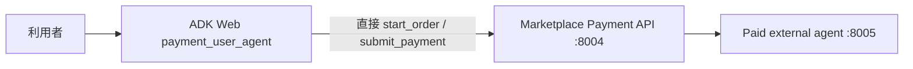
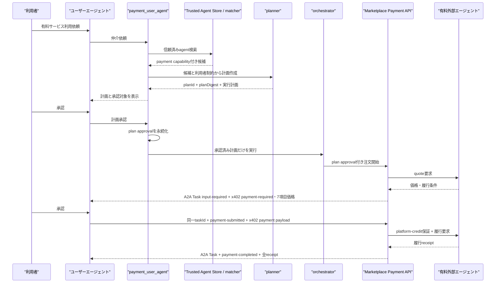
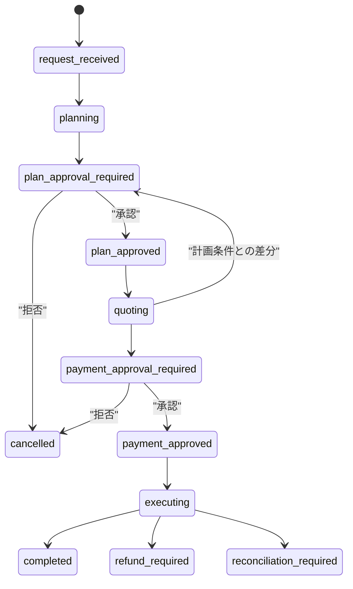

# Google A2A x402 Payments Extension v0.1 / 計画承認統合 — 新規チャット引継ぎ要件シード

> **文書状態:** 実装前に作成した履歴資料である。現在の実装範囲と最終判定は `AP2_X402_DOCUMENT_INDEX.md`、`AP2_X402_IMPLEMENTATION_EVIDENCE.md`、`AP2_X402_TEST_REPORT.md` の末尾にある最新再試験節を優先する。

## 0. この文書の位置づけ

この文書は、GoogleのAgent Payments Protocol（AP2）周辺で公開されている**公式 A2A x402 Payments Extension v0.1**を仲介エージェントへ取り込み、さらに「仲介エージェントによる計画提示と利用者承認」を組み込む次作業の引継ぎ資料である。現時点の確定要望、発見済みの欠落、要求される状態遷移、受入条件をまとめる。

これはレビュー済み最終要件定義ではない。新しいチャットでは、必ずSection 12の独立サブエージェント工程に従い、現状調査からやり直して要件・設計・実装計画を段階的に確定すること。

### 0.1 最重要の訂正と実装ターゲット

利用者が依頼した実装ターゲットは、Google公式repositoryの次の仕様である。

- repository: <https://github.com/google-agentic-commerce/a2a-x402>
- target specification: <https://github.com/google-agentic-commerce/a2a-x402/blob/main/spec/v0.1/spec.md>
- specification name: `A2A Protocol: x402 Payments Extension v0.1`
- canonical extension URI: `https://github.com/google-a2a/a2a-x402/v0.1`

一方、Draft PR #25の現在の実装は、`urn:secure-a2a:extensions:ap2-x402-marketplace:v1`、`exact-simulated`、`demo:local`、独自JSON action、HMAC test keyを使った**project-local simulation**である。AP2/x402の概念を取り入れているが、公式v0.1のwire protocolを実装したものでも、公式v0.1準拠を主張できるものでもない。

したがって次作業では、単に既存simulationへ計画承認を追加するのではなく、次を最上位要件とする。

1. 公式v0.1を再調査し、調査時点のcommit SHAへ仕様・参照実装をpinする。
2. 現行独自profileとの差分を一覧化する。
3. 仲介エージェントを公式v0.1のA2A client/server roleへ適切に位置づける。
4. 公式v0.1の宣言、activation、Task、Message metadata、`taskId`相関、receipt要件を実装する。
5. 計画承認は公式x402 payment lifecycleの手前に追加する仲介固有の認可境界とし、公式extension semanticsの代替にしない。
6. `v0.2`、x402 v2、または独自profileへ無断で置き換えない。version変更を推奨する場合はv0.1との差分・理由・移行影響を文書化し、利用者の承認を得る。
7. simulated railしか接続しない場合は「公式v0.1 wire-compatible demo」など範囲を正確に表示し、on-chain verification/settlementを含む完全準拠とは表記しない。

### 現在のGit状態

- repository: `TaichiHiromatsu/secure-ai-agent-matching-platform`
- branch: `codex/ap2-x402-integration`
- handoff作成前commit: `29c8302`
- Draft PR: <https://github.com/TaichiHiromatsu/secure-ai-agent-matching-platform/pull/25>
- 基準日: 2026-08-15

## 1. 利用者の追加要望

前提として、仲介エージェントへの決済組込みは公式 A2A x402 Payments Extension v0.1を対象とする。以下の計画承認要件は、その公式protocol flowへ追加する仲介側の要件である。

ユーザーエージェントが有料外部エージェントを利用するとき、いきなり注文・決済要求へ進んではならない。既存の仲介エージェントが外部エージェントを選定して実行計画を作り、利用者がその計画を承認した後にだけ、見積取得・決済要求・外部エージェント実行へ進まなければならない。

計画承認と決済承認は異なる意思表示として記録・検証する。ただし、チャット入力語はいずれも利用者指定どおり完全一致の `承認` を使用できる。システムは現在のpending stateから、どちらの承認かを一意に判定し、画面では「計画の承認」と「決済の承認」を明示する。

## 2. 現状と欠落

### 2.1 現在のブラウザデモ経路



`user-agent/agent.py`は最初の自然言語入力を受けると、計画作成・計画提示・計画承認を行わず、`PaymentMediatorClient.request_payment()`を呼ぶ。clientは決済API `/a2a` の`start_order` actionへ直結する。価格表示後の`承認`は決済承認としてのみ処理される。

したがって、現状のブラウザデモは次を満たしていない。

- `payment_user_agent`への仲介依頼
- Trusted Agent Store / matcherによる外部エージェント選定
- plannerによる計画作成
- 計画全文・要約・制約の利用者提示
- 計画承認後のみorchestratorを起動する強制境界
- 承認済み計画と注文・quote・Payment Mandateの暗号学的／永続的binding

### 2.2 既存計画承認機構

既存`secure_mediation_agent`には以下がある。

- plannerが計画生成時に`plan_approved=False`へ戻す。
- `approve_plan` toolが`plan_approved=True`を設定する。
- orchestratorのbefore callbackが未承認なら起動を拒否する。

ただし現在はsession上のbooleanであり、`planId`、計画内容digest、選定agent、金額上限、通貨、商品、手数料方針へ拘束されていない。このbooleanを決済認可として流用してはならない。

### 2.3 当時確認済みだった決済デモの基準点

- payment test suite: 65 tests passed
- Docker image build: success
- ADK Web agent discovery: `payment_user_agent`, `secure_mediation_agent`
- browser操作: 予約依頼 → 価格表示 → `承認` → `completed`
- happy + manual payout / failure + refund / timeout + reconcile: success
- 現在のrailは`exact-simulated` / `demo:local`であり、実資産を移動しない。

このbaselineは回帰テスト資産として維持できるが、これを公式v0.1実装の証拠にはしない。公式v0.1経路へ移行または追加したうえで、その先頭へ計画作成・計画承認を追加する。

### 2.4 現時点で判明している公式v0.1との差分

| 観点 | 公式v0.1 | Draft PR #25の現状 | 次作業 |
|---|---|---|---|
| extension URI | `https://github.com/google-a2a/a2a-x402/v0.1` | 独自URN | 公式URIでAgent Card宣言・request activation |
| protocol object | A2A Task / Message metadata | 独自action/data中心 | 公式metadataへmappingまたは置換 |
| payment request | `x402.payment.status=payment-required` + `x402.payment.required` | 独自payment-required object | v0.1 schemaへ準拠 |
| payment submission | `payment-submitted` + `x402.payment.payload` | 独自closed mandate/action | 公式payloadを同一`taskId`へ送信 |
| correlation | original A2A `taskId`必須 | 独自order/task binding | 同一Task lifecycleで強制 |
| completion | `payment-completed` + final TaskStatus.message内の全receipts | 独自receipt群 | 公式metadataと全receipt要件へ準拠 |
| x402 version / rail | v0.1例は`x402Version: 1`、`exact`、`base`、wallet/facilitator/on-chain settlement | `exact-simulated`、`demo:local` | 実railとdemo adapterの適合境界を調査・明記 |
| conformance claim | 公式v0.1 semantics | 非準拠をdocsで明記済み | official fixture/reference implementationで検証 |

## 3. 目標フロー



## 4. 必須状態モデル



### 状態上の不変条件

1. `plan_approved`より前にmerchant quote、payment order、charge、guarantee、fulfillmentを作成してはならない。
2. `payment_approved`より前にcustomer chargeを実行してはならない。
3. 計画承認は決済承認の代わりにならない。
4. 決済承認は計画承認の代わりにならない。
5. pending stateが存在しない状態で`承認`を受けても、計画承認・決済承認・外部副作用を作ってはならない。
6. 計画内容が変わったら旧plan approvalを無効化し、再提示・再承認する。
7. quoteが承認済み上限・merchant・商品・数量・通貨・許可skill・fee policyを外れたら決済要求を発行しない。

## 5. 計画承認データ要件

単純な`plan_approved: bool`ではなく、少なくとも次の不変snapshotを正規化して永続化する。

```json
{
  "planId": "plan-...",
  "planDigest": "sha256:...",
  "planVersion": 1,
  "customerId": "...",
  "sessionId": "...",
  "selectedAgentId": "paid-booking-agent",
  "merchantId": "demo-merchant",
  "skillId": "paid-booking",
  "productId": "demo-paid-booking",
  "quantity": 1,
  "maximumCustomerTotal": 1250,
  "currency": "USD",
  "decimals": 2,
  "feePolicyVersion": "zero-fee-v1",
  "approvedAt": "...",
  "expiresAt": "...",
  "approvalNonce": "...",
  "approvalStatus": "approved"
}
```

### 結び付けの要件

- plan approvalはcustomer、session、plan ID、exact plan digestへ拘束する。
- orderは`planId`と`planDigest`を必須で保持する。
- merchant quoteは承認済みagent/merchant/skill/product/quantity/最大額/通貨へ拘束する。
- Payment Mandateはorder、task、quote、customer total、payeeへ別途拘束する。
- plan approval recordとpayment approval recordは別ID・別timestamp・別nonce・別audit eventにする。
- 一度使用したapproval nonceの再利用を拒否する。
- plan expiry後はquote/orderを開始しない。

## 6. コンポーネント別要求

### 6.1 ユーザーエージェント

- 最初の依頼を決済APIへ直送せず、secure mediatorへ送る。
- `plan_approval_required`では計画、選定agent、実行step、最大総額、通貨、手数料方針、拒否方法を表示する。
- 計画pending中の完全一致`承認`はplan approvalだけを生成する。
- `payment_approval_required`ではpayeeと既存7項目の価格内訳を表示する。
- 決済pending中の完全一致`承認`はpayment approvalだけを生成する。
- 画面上で現在の承認対象を明確に表示する。
- CLIとADK Webで同じstate machineを使用する。

### 6.2 仲介エージェント／planner／matcher

- Trusted Agent Storeから公式v0.1 canonical extension URIとpayment skillを宣言した候補を選ぶ。
- planに選定agent、skill、商品、数量、金額上限、通貨、fee policy、各stepを含める。
- exact canonical plan digestを作る。
- 承認済みplan snapshotを永続化する。
- session booleanだけを認可根拠にしない。
- 計画変更時は旧承認を失効させる。

### 6.3 orchestrator（実行制御）

- 有効なplan approvalがない場合はコードレベルで実行を拒否する。
- 実行中の各stepをplan ID/digestへ関連付ける。
- 支払対象stepでMarketplace Payment APIを呼ぶ。
- paid external agentのA2A action/data contractと既存text型RemoteA2aAgentの非互換を解消する。
- 外部agentの返答により計画の主体・商品・金額上限・通貨・fee policyが変わる場合、勝手に続行せず再計画・再承認へ戻す。

### 6.4 Marketplace Payment API（決済API）

- `start_order`に検証可能なplan approval参照または署名済みplan authorizationを必須化する。
- direct REST/A2A/CLIのどの経路でも、plan approvalなしの注文開始を拒否する。
- orderへplan ID/digestを保存する。
- merchant quoteをplan制約と照合する。
- payment approvalは従来どおりclosed mandateとして別に検証する。
- plan approvalのみでsettleしてはならない。
- A2A client/merchant間の公式v0.1 Task/Message metadataを生成・検証し、独自actionだけを公開contractにしない。

### 6.5 有料外部エージェント

- Agent Cardの`capabilities.extensions`に公式v0.1 canonical URIを宣言し、planner/matcherが選択できるpayment skillと商品を公開する。
- quoteへagent/merchant/skill/product/quantity/金額/通貨/履行条件を署名して返す。
- 仲介が発行したplan ID/digest、order、quote、guaranteeのbindingを検証する。
- 公式v0.1 activationがないmonetized requestを拒否する。
- `input-required` Taskで`payment-required`を返し、同一`taskId`の`payment-submitted`を受け、最終TaskStatus.messageへ全receiptを含める。

### 6.6 公式v0.1プロトコル要件

- Agent Card declarationとrequest activationにはcanonical URIを完全一致で使う。
- payment requestはA2A Task state `input-required`とし、TaskStatus.message metadataに`x402.payment.status: payment-required`および`x402.payment.required`を含める。
- payment submissionは元の`taskId`を含む新しいA2A Messageで送信し、metadataに`x402.payment.status: payment-submitted`および`x402.payment.payload`を含める。
- merchantはoriginal Taskに保存したPayment Requirementsと提出payloadを照合する。
- 完了時は`x402.payment.status: payment-completed`とreceiptを返し、そのTask lifetimeに作成した全payment receiptを最終TaskStatus.messageに含める。
- 公式repositoryのv0.1 fixtureまたはreference implementationとのcontract testを作る。
- `planId`、`planDigest`、marketplace fee、guarantee、deferred payoutなど仲介固有fieldは、公式fieldを破壊せずA2A metadataのnamespaced extensionまたは内部recordとして設計する。

## 7. 承認語とUI要件

- 利用者が入力する承認語は完全一致の`承認`とする。
- `yes`、`はい`、`OK`、`承認します`を暗黙に承認扱いしてはならない。
- 同じ`承認`でもpending stateにより意味を限定する。
- 計画画面には「この承認ではまだ決済されない」と表示する。
- 決済画面には「この承認でcustomer chargeが実行される」と表示する。
- 各画面にplan IDまたはorder ID、承認対象、期限を表示する。

## 8. エラー・変更・再開要件

- 計画拒否は副作用なしでterminal/cancelledにする。
- 決済拒否はchargeなしでcancelledにする。
- 計画承認後に価格が上限を超えたら、新しい決済要求を作らず再計画へ戻す。
- merchant/agent/skill/product/quantity/currency/fee policyが変わったら再計画・再承認する。
- 同一入力・同一idempotency keyの再試行は同じplan/orderを返す。
- process/container restart後もpending approval state、plan snapshot、task/contextを維持する。
- stale session、他customer、他tenantからのapproval ID参照を拒否する。
- エラーresponseへplan本文、署名、customer proof、秘密鍵を漏らさない。

## 9. 受入条件

| ID | 前提 | 操作 | 期待結果 |
|---|---|---|---|
| PA-ACC-001 | 新規有料依頼 | 最初のpromptを送る | 計画が表示され、order/charge/guarantee/fulfillmentは0件 |
| PA-ACC-002 | 未承認計画 | orchestratorまたはstart_orderを直接呼ぶ | stable errorで拒否し外部副作用0件 |
| PA-ACC-003 | 計画pending | `承認`を送る | plan approvalだけが保存され、chargeは0件 |
| PA-ACC-004 | 計画pendingなし | `承認`を送る | 何も承認・実行されない |
| PA-ACC-005 | 承認済み計画 | quoteが計画内 | 決済要求と7項目価格が表示される |
| PA-ACC-006 | 承認済み計画 | quoteが最大額超過 | 決済要求を出さず再計画・再承認へ戻る |
| PA-ACC-007 | 承認済み計画 | merchant/product/currency/fee policyを改ざん | quote/orderを拒否しcharge 0件 |
| PA-ACC-008 | 決済pending | `承認`を送る | closed mandateが生成され、chargeが高々1回だけ実行される |
| PA-ACC-009 | 計画承認のみ | payment endpointを呼ぶ | payment approval不足で拒否される |
| PA-ACC-010 | 計画変更 | 新planを生成 | 旧approvalが失効し再承認まで実行されない |
| PA-ACC-011 | restart前に各pending state | container/process restart | 同じplan/task/context/stateで再開できる |
| PA-ACC-012 | ADK Web | 依頼→承認→価格→承認 | 計画承認と決済承認の2段階を画面で確認してcompleted |
| PA-ACC-013 | CLI | 同一シナリオ | ADK Webと同じstate machine・結果になる |
| PA-ACC-014 | 既存payment tests | 新機能追加後 | 既存65件を含む全payment testがgreen |
| PA-ACC-015 | public nginx | internal/operator/signer routeを呼ぶ | 引き続き404または認可拒否 |
| X402-ACC-001 | paid external Agent Card | discoveryする | canonical v0.1 URIが`capabilities.extensions`に宣言される |
| X402-ACC-002 | monetized skill request | canonical v0.1 URIをactivationしない | stable errorで拒否し決済副作用0件 |
| X402-ACC-003 | 承認済み計画 | quote/決済要求へ進む | `input-required` Taskのmessage metadataに公式`payment-required` fieldsがある |
| X402-ACC-004 | 決済pending | `承認`してpayloadを送る | original `taskId`と公式`payment-submitted` fieldsがある |
| X402-ACC-005 | 有効なpayment submission | merchantが完了する | 同一Taskの最終messageに`payment-completed`と全receiptsがある |
| X402-ACC-006 | 公式v0.1 fixture/reference | contract testを実行 | URI、schema、state、metadata、task correlationが互換 |
| X402-ACC-007 | simulated rail | demoを表示する | 実on-chain settlement済み／公式完全準拠と誤表示しない |

## 10. テスト・デモシナリオ

### 正常系チャット

1. 利用者: `信頼済みの予約エージェントを使い、12.50 USD以内でデモ予約を1件取得してください。`
2. 仲介: 選定agent、手順、最大総額、手数料方針を含む計画を表示。
3. 利用者: `承認`
4. 仲介: 「計画を承認した。まだ決済していない」と表示し、quote取得。
5. 仲介: payeeと7項目価格を表示。
6. 利用者: `承認`
7. 仲介: 決済・保証・履行を実行し、order/plan/receiptを表示。

### 必須の異常系シナリオ

- 計画承認前の直接注文
- 計画承認前の直接orchestrator起動
- 計画pending中の`yes`
- 決済pending中の`yes`
- agent差替え
- 金額上限超過
- 通貨・fee policy変更
- 計画変更後の旧承認再利用
- plan approvalをpayment approvalとして再利用
- restart後の二重実行

## 11. 非対象・境界

公式v0.1 wire protocolの実装と、実資産settlementの実装範囲を混同しない。次のproduction機能は原則として対象外とする。

- 実Stripe、実カード、本番wallet、本番chain、本番stablecoin
- AP2/x402適合認証
- production KMS、KYC/AML、PCI/SCA
- 非ゼロ手数料の本番会計
- Human Not Present/open mandate

ただし公式v0.1はon-chain cryptocurrency payment、wallet署名、facilitatorによるverification/settlementを前提として記述されている。新しいチャットの調査工程で、公式reference implementationを使ったtestnetまたはsandbox settlementを今回の適合確認へ含める必要があるかを判定する。simulationを残す場合はrail adapterとして明確に分離し、完全な公式v0.1 settlement準拠を主張しない。将来`PaymentRail`を実決済へ差し替えてもplan approvalとpayment approvalの分離が維持される設計にする。

## 12. 新しいチャットで必ず行う工程

各工程は、会話履歴を共有しない別サブエージェントへ割り当てる。同じサブエージェントに連続工程を担当させない。サブエージェントにはチャット全文を渡さず、repository path、branch、この文書、直前工程の成果物path、担当タスクだけを与える。

1. **現状調査**
   - この文書を仮説としてコードと既存docsを再調査する。
   - user agent、secure mediator、matcher、planner、orchestrator、payment API、paid agentの実際の接続点を報告する。
   - Google公式repositoryのv0.1 specとPython reference implementationをcommit SHAへpinし、canonical URI、Agent Card declaration、activation、A2A Task/Message metadata、state、`taskId`、receipt、wallet/facilitator/on-chain前提を報告する。
   - Draft PR #25と公式v0.1のfile/field/flow単位のconformance gap matrixを作る。
2. **要件詳細化**
   - 調査結果を基に、公式v0.1準拠と計画承認統合の要件・状態・error・受入条件を正式requirementsへ反映する。
3. **要件レビュー**
   - 別agentが公式v0.1からの逸脱、version混在、曖昧性、抜け、矛盾、直接API bypass、二つの承認混同をレビューする。
4. **設計**
   - component、公式v0.1 A2A message、schema、DB migration、state machine、approval binding、rail adapter、UI flowを設計する。
5. **設計レビュー**
   - 別agentが承認境界、state/source-of-truth、既存agent互換、restart/idempotencyをレビューする。
6. **実装計画**
   - file単位の依存付きtask list、test mapping、container/browser gateを作る。
7. **実装計画レビュー**
   - 別agentが順序、並列性、完了条件、rollback、既存回帰をレビューする。
8. **実装**
   - レビュー済み設計・task listだけを入力に実装する。
9. **テスト**
   - unit/integration/security/restart/API/A2A/ADK Webを実行する。
10. **独立コードレビュー**
    - 実装担当と別agentがレビューする。
11. **コンテナ＋ブラウザ実演**
    - clean image/containerを使い、ADK Webを実際に操作して2回の`承認`を確認する。
12. **文書・PR更新**
    - 最終仕様、デモ台本、検証結果を反映し、既存Draft PRを更新する。

## 13. 新しいチャットへ貼る開始指示

次の文章を新しいチャットへ貼り付ける。

> `/Users/taichihiromatsu/Documents/enterprise-a2a-pf/docs/AP2_X402_PLAN_APPROVAL_HANDOFF.md` を最初に全文読んでください。`codex/ap2-x402-integration`ブランチとDraft PR #25を引き継ぎ、Section 12の順序どおり進めてください。現状調査、要件詳細化、要件レビュー、設計、設計レビュー、実装計画、実装計画レビューは、それぞれ会話履歴を共有しない別サブエージェントへ割り当ててください。各工程の成果物をdocsへ保存し、レビュー指摘を反映してから次工程へ進んでください。その後、実装、テスト、独立コードレビュー、clean container、ADK Webのブラウザ操作で「計画提示→承認→価格提示→承認→completed」を確認し、Draft PR #25を更新してください。
>
> 最上位の実装ターゲットはGoogle公式 `A2A Protocol: x402 Payments Extension v0.1`です。現行の独自URN / `exact-simulated`実装を公式v0.1実装済みとみなさず、公式spec/reference implementationをcommit SHAへpinしてconformance gapを最初に調査してください。canonical URI、Agent Card declaration/activation、A2A Task/Message metadata、`payment-required`→`payment-submitted`→`payment-completed`、同一`taskId`、全receiptを実装・contract testしてください。計画承認はこの公式flowの手前に追加する仲介固有の認可境界です。v0.2または独自profileへ変更する場合は利用者の承認なしに進めないでください。

## 14. 完了の定義

次をすべて満たしたときだけ完了とする。

- user agentが決済APIへ直接注文を開始する現行bypassがなくなる。
- 仲介エージェントと有料外部エージェントが公式v0.1 canonical URIとA2A Task/Message semanticsで相互運用する。
- 公式v0.1 fixture/reference implementationとのcontract testがgreenになる。
- secure mediatorの計画提示・計画承認を経由する。
- plan approvalがbooleanではなくexact plan snapshot/digestへ拘束される。
- payment APIがplan approvalなしの全経路を拒否する。
- 計画承認と決済承認が別record・別auditとして検証される。
- ADK Webで利用者が`承認`を2回入力し、それぞれの意味が画面に明示される。
- 2回目の承認前にchargeが発生しない。
- 計画変更・金額超過・merchant差替えで再承認が必要になる。
- unit/integration/security/restart/container/browser確認がgreenになる。
- 最終docsとDraft PRに公式v0.1適合範囲、検証証跡、simulation/on-chain settlement境界が反映される。
