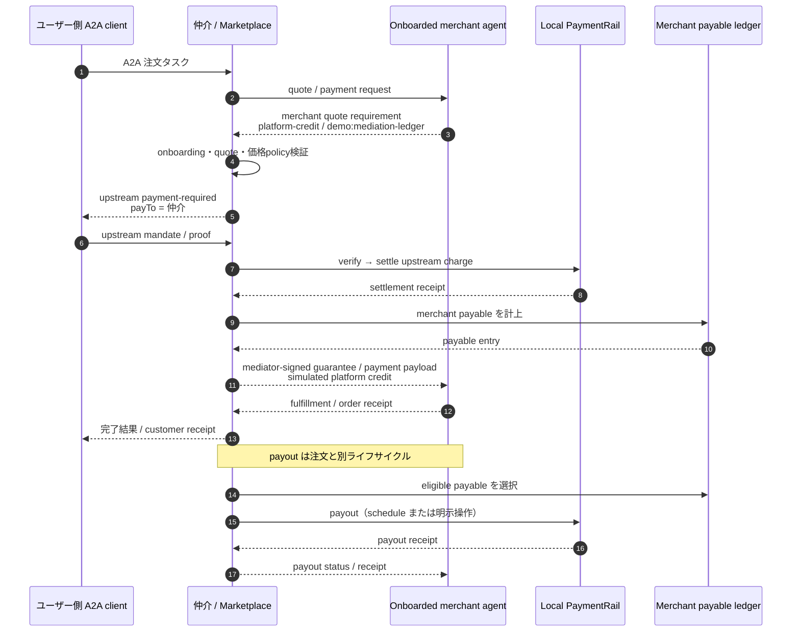

# AP2 / x402 決済仲介 要件定義書

- 文書版: 2.2
- 作成日: 2026-08-15
- 対象: Secure AI Agent Matching Platform
- 調査根拠: `docs/AP2_X402_RESEARCH.md`
- 採用モデル: App Store / marketplace 型の単一 upstream charge と deferred merchant payout
- 基準: AP2 v0.2 semantics、x402 v2-shaped project-local profile、A2A SDK package 0.3.19 / A2A wire `protocolVersion=0.3.0`

## 1. 目的と規範

本書は、外部エージェントが提示した有料サービスの merchant quote requirement を仲介エージェント（以下「仲介」）が受け、ユーザー側エージェントへ唯一のリアルタイム x402 支払要求を発行する marketplace 型決済を定義する。上流決済完了後、仲介は merchant payable を台帳計上し、外部エージェントへ仲介署名の payment guarantee/payment payload を返す。merchant はこれを検証して履行し、別途 order receipt を返す。merchant への payout は注文フローとは分離された別ライフサイクルとする。

本書の表にある一意な ID を持つ文だけを規範的要求とする。「しなければならない」は必須、「してはならない」は禁止を表す。クラス、ファイル、DB 製品、署名ライブラリ等の実装方式は、互換性制約として明示したものを除き、設計工程に委ねる。

### 1.1 用語

| 用語 | 定義 |
|---|---|
| upstream charge | ユーザー側 agent が仲介へ行う唯一の注文時リアルタイム settlement |
| merchant | 有料サービスを提供する、onboarding 済み外部 agent / provider |
| merchant quote requirement | 商品・サービス、価格、履行条件を拘束した merchant 発行の x402 v2-shaped `PaymentRequired`。`scheme=platform-credit`、`network=demo:mediation-ledger` を用いるが、即時支払要求ではない |
| payment guarantee | upstream charge 完了と payable 計上を根拠に、仲介が merchant へ発行する署名済み支払保証。payout 完了証明ではない |
| merchant payable | 仲介が merchant に将来支払う義務を表す複式・追記型 ledger entry |
| provider commission | merchant proceeds から仲介が控除する手数料 |
| customer surcharge | merchandise amount に加算して customer が負担する仲介手数料 |
| payout | eligible な merchant payable を日次・月次・明示操作等で merchant へ支払う別ライフサイクル |
| refund | customer charge の全部または一部を戻し、関連 payable/残高を調整する処理 |
| dispute | 注文、charge、guarantee、fulfillment、refund、payout に対する異議・調査ライフサイクル |
| negative balance | refund/dispute/adjustment が未払 payable と準備金を超えた結果、merchant が仲介へ負う残高 |
| idempotent retry | 同じ主体・操作・key・同一内容による安全な再試行 |
| replay | 使用済み proof/nonce/guarantee 等を別の task、order、操作または改変内容へ不正再利用すること |

## 2. 対象フロー

Copilot、Gemini、独自実装を想定した、project-local profile 対応の vendor-neutral A2A client が上流 client となる。特定ベンダー SDK を必須にしない。外部 agent は仲介との trust agreement に基づき、即時 payout の代わりに仲介署名保証を受け入れる。



## 3. リリーススコープ

| ID | スコープ |
|---|---|
| SCOPE-001 | MVP 実装・受入対象は、merchant quote requirement → Human Present closed mandate による upstream charge → balanced payable 計上 → guarantee → fulfillment → manual payout の happy path と、payout timeout/retry、fulfillment failure の全額 refund、tamper/replay、restart、security/isolation である。 |
| SCOPE-002 | MVP の refund は payout 前、merchant 責任、merchandise 全額、全 fee/rail cost 0 のケースに限定する。 |
| SCOPE-003 | dispute、reserve、negative balance、write-off、scheduled payout は extended design-only fixture とし、状態・データ・将来境界は定義するが、MVP runtime と受入判定には含めない。 |
| SCOPE-004 | Human Not Present、open Checkout/Payment Mandate、累積 budget、rejection receipt chain は MVP に含めない。 |

## 4. 前提

| ID | 前提 |
|---|---|
| ASM-001 | merchant は事前 onboarding 済みで、仲介の guarantee を受け入れる trust agreement を持つ。 |
| ASM-002 | 永続ストレージは再起動後も order、charge、payable、refund、dispute、payout、nonce、idempotency を参照できる。 |
| ASM-003 | client、仲介、merchant にはデモ専用署名鍵と検証可能な key ID が設定される。 |
| ASM-004 | 初期版は一注文・一 merchant、`asset=USD`、`decimals=2` で、FX と split tender はない。 |
| ASM-005 | local simulation の値は実資産、債権、on-chain transaction、銀行・カード決済を表さない。 |
| ASM-006 | Copilot と Gemini は想定 client の例であり、製品固有 API との接続認定を意味しない。 |
| ASM-007 | AP2 と x402 の未確定 binding は project-local profile で補い、標準の canonical binding とは称さない。 |
| ASM-008 | 初期 pricing policy の customer surcharge、provider commission、collection rail cost、payout rail cost はすべて 0 である。非ゼロ policy は将来の design fixture とする。 |
| ASM-009 | MVP の Human Present test client は固定 identity/key と決定論的 Trusted Surface を使用し、ユーザー本人確認済みという simulation 前提で closed mandate を生成する。 |

## 5. 機能要件

### 5.1 A2A 能力と merchant onboarding

| ID | 要求 |
|---|---|
| FR-001 | 仲介は `a2a-sdk` package 0.3.19 と互換な server として A2A wire `protocolVersion=0.3.0` の上流 task を受け、task ID/context ID を維持して中断・再開できなければならない。 |
| FR-002 | 仲介は Agent Card で project-local payment extension、profile version、marketplace charge 能力を宣言しなければならない。 |
| FR-003 | merchant agent は Agent Card で merchant quote requirement、mediator-signed guarantee/payment payload、order receipt、および payout status query skill を宣言しなければならない。 |
| FR-004 | 仲介は有料 quote を受け付ける前に merchant status、signing key、許可 endpoint、currency/asset/network、commission policy、payout terms、refund/dispute liability、negative-balance policy を onboarding record で検証しなければならない。 |
| FR-005 | onboarding 未完了、停止中、key 失効中、または trust agreement version 不一致の merchant について、仲介は upstream payment-required を発行してはならない。 |
| FR-006 | onboarding/trust agreement の変更は version と有効期間を持ち、既発行 order/guarantee/payout の当時条件を後から書き換えてはならない。 |
| FR-007 | payment extension 非対応の既存 agent の非決済タスクは従来フローで利用可能でなければならない。 |

### 5.2 Merchant quote と価格

| ID | 要求 |
|---|---|
| FR-008 | merchant は有料履行前に、x402 v2-shaped `PaymentRequired` である merchant quote requirement を返さなければならない。その `accepts` は `scheme=platform-credit`、`network=demo:mediation-ledger`、`payTo=onboarding 済み provider identity または merchant ledger account` とし、quote/order、商品・サービス、quantity、`merchandise_amount`、merchant が同意した pricing policy version、`asset=USD`、`decimals=2`、fulfillment 条件、iat/exp を拘束しなければならない。merchant は `merchant_payable_amount` を自己決定してはならない。 |
| FR-009 | 仲介は merchant quote requirement の署名、issuer、audience、merchant/onboarding version、scheme、network、payTo、merchandise amount、pricing policy version、期限、order/task binding を決定論的に検証しなければならない。 |
| FR-010 | quote の価格・内容・期限・merchant 条件が変わった場合、仲介は旧 quote、challenge、mandate、proof を流用せず再同意を要求しなければならない。 |
| FR-011 | platform は検証済み merchandise amount と pricing policy version から `customer_surcharge`、`collection_rail_cost`、`customer_total`、`provider_commission`、`merchant_payable_amount` を計算し、`payout_rail_cost` と合わせて各 field を別々に保持・提示し、0 でも省略してはならない。 |
| FR-012 | `customer_total = merchandise_amount + customer_surcharge + collection_rail_cost` を minor unit 整数で計算しなければならない。 |
| FR-013 | charge 時は `merchant_payable_amount = merchandise_amount - provider_commission` を minor unit 整数で計算し、payout rail cost を注文時 payable から控除してはならない。負値となる計算は拒否しなければならない。 |
| FR-014 | provider commission は merchant proceeds からのみ控除し、customer surcharge と混同してはならない。 |
| FR-015 | 初期版の customer surcharge、provider commission、collection rail cost、payout rail cost はすべて 0 とし、非ゼロ化には version 化された明示 policy と、影響を受ける当事者への内訳提示を必要としなければならない。 |
| FR-016 | 各価格決定は pricing policy version、rounding rule、currency/asset、network、decimals、計算時刻を保持しなければならない。 |
| FR-017 | merchant quote の pricing policy version が onboarding agreement または platform の有効 policy と一致しない場合、仲介は暗黙に差し替えず、merchant へ機械判読可能な再 quote 要求または拒否を返さなければならない。 |

### 5.3 唯一のリアルタイム upstream charge

| ID | 要求 |
|---|---|
| FR-018 | 基本フローでリアルタイム settlement を要求する x402 v2-shaped upstream `payment-required` を発行するのは仲介だけとし、payTo は onboarding 済み merchant ではなく仲介でなければならない。external の `platform-credit` request はこのリアルタイム charge に数えてはならない。 |
| FR-019 | 仲介は検証済み quote ごとに別 challenge ID、nonce、期限、audience を持ち、Appendix A の固定 upstream `accepts` を用いる `PaymentRequired` を発行し、quote digest と全価格内訳を拘束しなければならない。 |
| FR-020 | upstream `payment-required` は A2A Task `input-required` と payment metadata で表現し、通常 text error で代用してはならない。 |
| FR-021 | MVP は AP2 v0.2 Human Present の closed Checkout Mandate と closed Payment Mandate だけを受け付け、order、quote、challenge、payTo、customer total、asset/network、signer、payment instrument、期限へ拘束しなければならない。 |
| FR-022 | 仲介は proof の署名、issuer/signer、audience、nonce、iat/exp、accepted 条件、amount、payTo、asset/network、quote/mandate binding を verify してから settle しなければならない。 |
| FR-023 | 会話上の `plan_approved` 等は支払認可の代用にならず、有効な mandate/proof なしに settle してはならない。 |
| FR-024 | upstream settle 成功前に merchant payable、payment guarantee、注文確定または有料履行許可を生成してはならない。 |
| FR-025 | unknown constraint、未知 profile/scheme、未対応 asset/network、署名不正、期限不正、金額不一致は fail closed としなければならない。 |
| FR-062 | 決定論的 Trusted Surface/test client は checkout 内容と全価格内訳を表示し、固定 test identity/key を用いて、merchant 署名済み `checkout_jwt` の exact bytes に対する `checkout_hash` を含む closed Checkout Mandate と、payment signer/instrument/checkout binding を含む closed Payment Mandate を生成しなければならない。 |
| FR-063 | upstream settle 成功時は x402-shaped settlement receipt と AP2 Payment Receipt を別々に生成し、receipt ID/digest、Payment Mandate hash、settlement reference により相互参照できなければならない。 |
| FR-064 | simulation rail は Appendix A の固定 customer balance を原子的に確認・減算し、残高不足時は `INSUFFICIENT_FUNDS` で失敗して payable/guarantee/fulfillment を一切生成してはならない。 |

### 5.4 Payable、guarantee、fulfillment

| ID | 要求 |
|---|---|
| FR-026 | upstream settle 成功後、仲介は customer charge、commission、merchant payable を単一の balanced journal transaction として相関計上しなければならない。MVP は Dr `simulated_cash` / Cr `merchant_payable` を同額で計上しなければならない。 |
| FR-027 | charge 成功と payable 計上の間で障害が起きた場合は `charge-settled-unposted` として reconciliation を要求し、guarantee を発行してはならない。 |
| FR-028 | 仲介は payable 計上後にのみ、external `PaymentRequired` の accepted 条件を保持した x402 v2-shaped `PaymentPayload` として、仲介署名の payment guarantee/order authorization を merchant へ発行しなければならない。 |
| FR-029 | guarantee/payment payload は guarantee ID、merchant quote requirement digest、order/task/quote ID、merchant ID、upstream x402/AP2 receipt digests、payable journal transaction/entry IDとamount、commission、currency/asset、payout terms version、iat/exp、signer key ID を拘束し、`scheme=platform-credit`、`network=demo:mediation-ledger`、`simulated=true` を明示しなければならない。 |
| FR-030 | guarantee は「仲介が upstream settlement と payable を認識した simulated platform credit 証拠」であり、標準 x402 `exact` の即時 settlement、payout 完了、資金留保、取消不能または法的保証を意味するものとして表示してはならない。 |
| FR-031 | merchant は mediator signature と guarantee/payment payload の external requirement binding を検証した後にのみ booking 等の有料履行を確定し、同一 order/guarantee への再送で副作用を重複してはならない。 |
| FR-032 | merchant は fulfillment 結果を署名済み order receipt で返し、order、quote、guarantee、履行 ID、status、時刻を拘束しなければならない。 |
| FR-033 | 仲介は valid order receipt 受領後に customer へ業務結果、charge receipt、価格内訳、order/guarantee reference を返し、payment-completed としなければならない。 |
| FR-034 | charge/payable 成功後に merchant fulfillment が失敗または期限切れとなった場合、仲介は注文を成功扱いせず、refund/compensation workflow を開始し payable を hold または調整しなければならない。 |
| FR-065 | 発行済み guarantee の signed bytes と当時の policy/amount は immutable とし、後続 policy 変更で効力や金額を遡及変更してはならない。訂正・失効・refund は元 guarantee を参照する追記イベントで表現し、配信結果不明時は同じ guarantee ID/bytes を再送しなければならない。 |

### 5.5 Payout ライフサイクル

| ID | 要求 |
|---|---|
| FR-035 | MVP payout は customer 注文処理から分離し、権限ある operator の明示 API/操作でのみ開始しなければならない。日次/月次 schedule は extended scope とする。 |
| FR-036 | payout 対象は、onboarding 有効、履行確認済み、未払、hold/dispute 対象外、支払可能日到来済みの payable に限定しなければならない。 |
| FR-037 | 一つの payable principal は、split payout を明示採用しない初期版では一つの成功 payout にだけ含まれなければならない。 |
| FR-038 | payout batch は payout ID、merchant、対象期間、含有 payable/adjustment、gross proceeds、charge 時に一度だけ認識済みの commission、payout 時に一度だけ認識する rail cost、net payout を保持しなければならない。commission または payout rail cost を二重控除してはならない。MVP の両 cost は 0 とする。 |
| FR-039 | payout は操作固有 idempotency key を必須とし、同じ key/同じ入力の再試行は同じ結果を返し、同じ key/異なる入力は拒否しなければならない。 |
| FR-040 | payout timeout 等で結果不明の場合、盲目的に新規 payout を作らず `payout-reconciliation-required` とし、同じ payout ID/key で照会・再開しなければならない。 |
| FR-041 | payout 失敗または結果不明は customer order/charge の成功履歴を変更せず、merchant payable を未解決として維持しなければならない。 |
| FR-042 | payout 成功後、仲介は payout receipt を merchant へ提供し、payment guarantee と明確に区別しなければならない。 |
| FR-066 | MVP payout 成功時は単一 balanced journal transaction として Dr `merchant_payable` / Cr `simulated_cash` を同額で計上しなければならない。 |
| FR-067 | merchant は A2A `payout_status` skill で自組織の payout ID を poll でき、仲介は保存済み authoritative payout state と receipt reference を返さなければならない。 |

### 5.6 Refund、dispute、negative balance

| ID | 要求 |
|---|---|
| FR-043 | refund は original order/charge、理由、金額、責任主体、idempotency key を持つ別ライフサイクルとし、元 ledger entry を上書きせず adjustment を追記しなければならない。 |
| FR-044 | MVP の fulfillment failure refund は payout 前、merchant 責任、merchandise amount 全額、fees/costs 0 とし、単一 balanced journal transaction で Dr `merchant_payable` / Cr `simulated_cash` を同額計上しなければならない。 |
| FR-045 | customer refund settlement と merchant ledger adjustment は同じ refund ID で相関しつつ別結果として追跡し、一方の成功を他方の成功とみなしてはならない。 |
| FR-046 | payout 後 refund、dispute、reserve、negative balance、recovery、write-off は extended design-only state/data fixture とし、MVP runtime が完了したように表示してはならない。 |

### 5.7 冪等性、replay、状態回復

| ID | 要求 |
|---|---|
| FR-051 | quote、challenge、verify、settle、payable post、guarantee、fulfillment、refund、dispute adjustment、payout の各操作は独立した idempotency scope を持たなければならない。 |
| FR-052 | 同一 key・同一正規化入力の再試行は保存済み結果を返し、追加 charge、guarantee、履行、ledger entry、refund、payout を起こしてはならない。 |
| FR-053 | 同一 key・異なる正規化入力は conflict として拒否しなければならない。 |
| FR-054 | proof/nonce/quote/guarantee/receipt の別 order、task、merchant、operation、key への replay を拒否し、セキュリティイベントとして記録しなければならない。 |
| FR-055 | 同一操作への並行要求でも成功する外部副作用と会計 entry は高々一件でなければならない。 |
| FR-056 | process 再起動後は永続状態から許可された次遷移だけを再開し、完了操作を繰り返してはならない。 |

### 5.8 PaymentRail

| ID | 要求 |
|---|---|
| FR-057 | payment domain は `PaymentRail` 抽象を介して capability、proof verify、charge settle、payout、refund、状態照会を利用できなければならない。 |
| FR-058 | 初期版は x402 v2-shaped local cryptographic simulation を提供し、外部 facilitator、chain RPC、Stripe、銀行 API を必要としてはならない。 |
| FR-059 | simulation は署名、digest、nonce、audience、payTo、amount、asset/network、期限、idempotency を実際に検証し、常時成功 stub であってはならない。 |
| FR-060 | upstream、merchant quote requirement、guarantee/payment payload、refund、payout を含む全 payment envelope/receipt は `profile: urn:secure-a2a:extensions:ap2-x402-marketplace:v1` と `simulated: true` を常時明示しなければならない。merchant-credit leg は加えて `scheme=platform-credit`、`network=demo:mediation-ledger` を明示しなければならない。 |
| FR-061 | simulation は実在 transaction hash、実 settlement、実保証と誤認される表現を生成してはならない。 |

## 6. Authoritative state model

次の表は MVP の許可遷移を規定する。表にない遷移は `INVALID_STATE_TRANSITION` とする。各 object の状態は記載した source of truth からのみ導出し、LLM、表示 text、相手 agent の未検証申告を正本にしてはならない。

### 6.1 Order

| ID | State | 許可遷移と guard | Terminal | Recovery owner | Source of truth |
|---|---|---|---|---|---|
| STO-001 | `awaiting_quote` | →`payment_required`: onboarding と merchant quote requirement 検証成功 | No | 仲介 order coordinator | Order store + evidence digest |
| STO-002 | `payment_required` | →`charge_processing`: closed mandates と proof 検証成功、→`failed`: 拒否/失効/残高不足 | No | 仲介 charge coordinator | Order store + charge record |
| STO-003 | `charge_processing` | →`payable_posted`: charge settled かつ balanced journal commit、→`reconciliation_required`: settlement/commit の片側不明、→`failed`: charge 未settle確認 | No | 仲介 reconciler | Charge receipt + journal transaction |
| STO-004 | `payable_posted` | →`guarantee_issued`: payable と receipts に拘束した保証の署名成功、→`refund_required`: merchant 再認可失敗、保証署名失敗、または保証発行不能を確定 | No | 仲介 guarantee issuer | Journal + evidence store |
| STO-005 | `guarantee_issued` | →`fulfilling`: merchant が同一 guarantee を検証/accept、→`reconciliation_required`: 配信結果不明、→`refund_required`: 未acceptのまま期限切れ、merchant停止/key失効、または配信不能を確定 | No | 仲介 delivery worker | Evidence store + A2A task history |
| STO-006 | `fulfilling` | →`completed`: valid merchant order receipt、→`refund_required`: 明示 failure/expiry、→`reconciliation_required`: 結果不明 | No | Merchant、照会責任は仲介 | Merchant order receipt |
| STO-007 | `refund_required` | →`refunding`: full refund 操作受付 | No | Operator / 仲介 refund worker | Order store + refund record |
| STO-008 | `refunding` | →`refunded`: refund settle と balanced reversal journal 成功、→`reconciliation_required`: 片側不明 | No | 仲介 reconciler | Refund receipt + journal |
| STO-009 | `completed` / `refunded` / `failed` | 他状態へ直接遷移しない。訂正は別の関連 event/object | Yes | Operator は追記訂正のみ | Order store + terminal evidence |
| STO-010 | `reconciliation_required` | authoritative source の照会結果に応じ、直前の未確定 operation の成功先または安全な失敗先へだけ遷移 | No | 仲介 reconciler | Rail/journal/evidence/merchant の各正本 |

### 6.2 Upstream charge

| ID | State | 許可遷移と guard | Terminal | Recovery owner | Source of truth |
|---|---|---|---|---|---|
| STC-001 | `required` | →`verified`: closed mandate/proof/profile/残高の検証成功、→`failed`: 検証失敗 | No | 仲介 charge coordinator | Charge record + evidence store |
| STC-002 | `verified` | →`settling`: nonce/idempotency の原子的取得成功 | No | 仲介 charge coordinator | Charge record |
| STC-003 | `settling` | →`settled`: x402-shaped settlement receipt、→`failed`: 未settleを確定、→`unknown`: timeout/結果不明 | No | PaymentRail | PaymentRail operation record |
| STC-004 | `unknown` | 同じ operation ID/key の照会でのみ →`settled` または →`failed` | No | 仲介 rail reconciler | PaymentRail operation record |
| STC-005 | `settled` / `failed` | 再 settle しない | Yes | なし。訂正は別 refund | Immutable charge receipt/error |

### 6.3 Merchant payable

| ID | State | 許可遷移と guard | Terminal | Recovery owner | Source of truth |
|---|---|---|---|---|---|
| STP-001 | `open` | charge settled と balanced journal commit により生成、→`guaranteed`: signed guarantee 発行 | No | 仲介 ledger service | Journal transaction |
| STP-002 | `guaranteed` | →`eligible`: fulfillment receipt 成功、→`reversing`: fulfillment failure/full refund | No | 仲介 order coordinator | Journal + guarantee/order evidence |
| STP-003 | `eligible` | →`included`: manual payout が原子的に payable を claim、→`reversing`: payout 前 full refund | No | Operator / payout service | Journal + payout eligibility snapshot |
| STP-004 | `included` | →`paid`: payout settled と payout journal commit、→`eligible`: payout 未settleを確認、状態不明中は遷移禁止 | No | 仲介 payout reconciler | Payout operation + journal |
| STP-005 | `reversing` | →`reversed`: full refund journal commit | No | 仲介 refund service | Refund journal transaction |
| STP-006 | `paid` / `reversed` | principal を別 payout/refund に再利用しない | Yes | なし。extended adjustment は別 entry | Journal transaction |

### 6.4 Payment guarantee

| ID | State | 許可遷移と guard | Terminal | Recovery owner | Source of truth |
|---|---|---|---|---|---|
| STG-001 | `issued` | payable commit 後に一度だけ生成、→`delivered`: A2A delivery ack、→`delivery_unknown`: timeout | No | 仲介 guarantee issuer | Dedicated evidence store |
| STG-002 | `delivery_unknown` | 同一 signed bytes の再送で →`delivered`、merchant status query で →`accepted`、または merchant が未acceptと確認済みで exp 到来時に →`expired`。`expired` は order/payable を refund/compensation 対象にする | No | 仲介 delivery worker | Evidence store + merchant task state |
| STG-003 | `delivered` | →`accepted`: merchant が signature/binding を検証、→`expired`: 未acceptのまま exp 到来。`expired` は order/payable を refund/compensation 対象にする | No | Merchant、照会責任は仲介 | Merchant ack + evidence store |
| STG-004 | `accepted` | signed guarantee 自体は変更不可。fulfillment は別 object で追跡 | Yes | なし | Merchant ack + immutable bytes |
| STG-005 | `expired` | 再有効化しない。新保証には新 ID と新同意が必要 | Yes | 仲介 order coordinator | Trusted clock + immutable bytes |

### 6.5 Fulfillment

| ID | State | 許可遷移と guard | Terminal | Recovery owner | Source of truth |
|---|---|---|---|---|---|
| STF-001 | `authorized` | valid/accepted guarantee により →`processing` | No | Merchant | Merchant task store |
| STF-002 | `processing` | →`fulfilled`: signed order receipt、→`failed`: signed failure、→`unknown`: timeout | No | Merchant | Merchant task store |
| STF-003 | `unknown` | 同じ order/guarantee の status query でのみ →`fulfilled` または →`failed` | No | 仲介が照会、Merchant が回答 | Merchant task store/receipt |
| STF-004 | `fulfilled` | 同一 order の有料副作用を再実行しない | Yes | なし | Signed merchant order receipt |
| STF-005 | `failed` | order を `refund_required` にする | Yes | 仲介 refund coordinator | Signed merchant failure receipt |

### 6.6 Refund

| ID | State | 許可遷移と guard | Terminal | Recovery owner | Source of truth |
|---|---|---|---|---|---|
| STR-001 | `required` | payout 前・merchant 責任・full amount・fees zero の guard で →`settling` | No | Operator / 仲介 refund service | Refund record + payable journal |
| STR-002 | `settling` | →`settled`: rail refund と balanced journal、→`failed`: 未refund確認、→`unknown`: timeout/片側不明 | No | PaymentRail / ledger service | Rail operation + journal |
| STR-003 | `unknown` | 同一 refund ID/key の rail/journal 照会でのみ →`settled` または →`failed` | No | 仲介 reconciler | Rail operation + journal |
| STR-004 | `settled` | 同じ refundable principal を再refundしない | Yes | なし | Refund receipt + journal |
| STR-005 | `failed` | 元 payable を再利用可能にせず operator review。再試行は同一 refund ID/key | No | Operator | Refund record |

### 6.7 Manual payout

| ID | State | 許可遷移と guard | Terminal | Recovery owner | Source of truth |
|---|---|---|---|---|---|
| STY-001 | `created` | eligible payable の原子的 claim 成功で →`settling`、不適格なら →`failed` | No | Operator / payout service | Payout record + journal |
| STY-002 | `settling` | →`paid`: rail payout と balanced journal、→`failed`: 未payout確認、→`unknown`: timeout/片側不明 | No | PaymentRail / ledger service | Rail operation + journal |
| STY-003 | `unknown` | 同一 payout ID/key の照会でのみ →`paid` または →`failed` | No | 仲介 payout reconciler | Rail operation + journal |
| STY-004 | `paid` | 含有 payable を再 payout しない | Yes | なし | Payout receipt + journal |
| STY-005 | `failed` | payable claim を安全に解放後のみ同一 ID/key で再試行可能 | No | Operator / payout service | Payout record + journal |

## 7. データ要件

| ID | 要求 |
|---|---|
| DATA-001 | order record は mediation/order ID、upstream task/context ID、merchant ID、quote ID、state/version、作成・更新時刻を保持しなければならない。 |
| DATA-002 | charge record は challenge/mandate/proof digest、payer、payTo=仲介、amount breakdown、nonce、iat/exp、idempotency、settlement/receipt reference を保持しなければならない。 |
| DATA-003 | pricing record は FR-011 の全金額、currency/asset、network、decimals、rounding、policy version を保持しなければならない。 |
| DATA-004 | 金額は float ではなく minor/atomic unit 整数として保存・交換しなければならない。 |
| DATA-005 | payable ledger は charge、merchant、order、guarantee、commission、refund/dispute adjustment、payout を相関可能な追記型 entry で表現しなければならない。 |
| DATA-006 | ledger entry は journal transaction ID、一意 entry ID、account、debit/credit、amount、currency、effective time、source event、idempotency key、reversal/related entry を持たなければならない。 |
| DATA-007 | guarantee、order receipt、customer receipt、payout receipt は別 type/ID/digest とし、相互参照できなければならない。 |
| DATA-008 | payout record は eligibility snapshot、含有 entry、集計内訳、状態、attempt、idempotency、rail reference、receipt を保持しなければならない。 |
| DATA-009 | onboarding record は merchant identity、keys、endpoint、agreement/policy versions、payout destination、schedule、hold/reserve、negative limit、有効期間を保持しなければならない。 |
| DATA-010 | status、receipt、ledger、operator action は sequence/timestamp 付き append-only audit history とし、訂正は reversal/adjustment で表現しなければならない。 |
| DATA-011 | compact 署名表現の exact bytes、canonicalization/profile、algorithm/key ID を再検証可能に保持しなければならない。 |
| DATA-012 | 保存期間内は replay 判定に必要な nonce、proof/quote/guarantee digest と idempotency result を保持しなければならない。 |
| DATA-013 | raw proof、秘密鍵、credential は一般会話 artifact、LLM prompt、業務結果 record へ複製してはならない。 |
| DATA-014 | schema/profile version を全永続 record に持たせ、未知 version を黙って既知 version として扱ってはならない。 |
| DATA-015 | 一つの journal transaction 内では同一 currency の debit 合計と credit 合計が一致しなければ commit してはならず、複数 currency を同じ balancing group に混在させてはならない。 |
| DATA-016 | provider commission は charge journal で最大一度、payout rail cost は payout journal で最大一度だけ認識し、order payable と payout の双方で同じ cost を控除してはならない。 |
| DATA-017 | exact signed bytes、checkout_jwt、mandate/proof、guarantee、全 receipt、merchant evidence は access-controlled な dedicated evidence store に保存し、order store と journal は immutable evidence ID/digest だけを参照しなければならない。 |
| DATA-018 | evidence store は customer/merchant tenant と operator role による access boundary、改変検知、保存/削除監査を持ち、LLM と一般 artifact store から直接参照できてはならない。 |
| DATA-019 | 将来 provider commission を非ゼロ化する場合、charge journal で `merchant_payable` を一度だけ減額し、同額を別の commission account へ一度だけ credit しなければならない。customer surcharge/collection cost も非ゼロの場合は別 account に分離し、全体の debit=credit を維持しなければならない。 |
| DATA-020 | 将来 payout rail cost を merchant 負担にする場合、payout journal で gross payable を debit、net cash と rail-cost account を credit して一度だけ認識しなければならない。platform 負担の場合は payable を減額せず別 expense transaction としなければならない。 |

## 8. セキュリティ要件

| ID | 要求 |
|---|---|
| SEC-001 | 署名/hash/canonicalization、constraint、pricing、commission、ledger、eligibility、replay、状態遷移は LLM でなく決定論的コードで処理しなければならない。 |
| SEC-002 | payment/ledger metadata は schema と署名を検証し、自然言語または LLM による値の補完・修正を許してはならない。 |
| SEC-003 | quote、proof、guarantee、receipt の署名は issuer、audience、nonce、iat/exp、profile、order/task、merchant、amount、asset/network、相関 digest を検証しなければならない。 |
| SEC-004 | test key を含む秘密鍵、raw proof、credential、authorization header を source、Agent Card、prompt、tool text、artifact、通常 log、API 応答へ出力してはならない。 |
| SEC-005 | nonce 消費、idempotency、状態遷移、ledger entry、payout inclusion は競合に対して原子的でなければならない。 |
| SEC-006 | merchant key、endpoint、asset/network、payTo、payout destination、profile/scheme は onboarding/allowlist で制限しなければならない。 |
| SEC-007 | 外部 URL は scheme、host、port、redirect、DNS 解決後 IP を検査し、loopback/private/link-local/metadata service 等への SSRF を既定拒否しなければならない。開発 loopback は環境別 allowlist でのみ許可する。 |
| SEC-008 | cryptographic payload に URL/Base64 用の text sanitizer を適用せず、typed channel で構造検証後、自然言語の最小部分だけを LLM Judge へ渡さなければならない。 |
| SEC-009 | expired、署名不正、audience/amount/payTo/asset/network/quote 不一致を stable error code で fail closed とし、秘密情報をエラーへ含めてはならない。 |
| SEC-010 | onboarding 停止、key 失効、agreement 不一致、negative limit 超過を guarantee/payout の authorization gate で再評価しなければならない。 |
| SEC-011 | operator による refund、dispute 解決、hold 解除、payout、write-off は認可され、actor/reason/time を監査しなければならない。 |
| SEC-012 | local simulation 以外の rail 設定では初期版を fail closed しなければならない。 |
| SEC-013 | customer は自身の order/charge/refund receipt、merchant は自身の quote/guarantee/payable/payout、operator は明示認可された横断運用情報だけへ access でき、推測可能な ID だけで他 tenant の record/evidence を取得できてはならない。 |
| SEC-014 | role と tenant isolation は status query、retry、error、export、observability、evidence retrieval のすべてに同じ基準で適用しなければならない。 |

## 9. 互換性要件

| ID | 要求 |
|---|---|
| COMP-001 | Python `a2a-sdk` package は厳密に 0.3.19 へ固定し、曖昧な version range にしてはならない。 |
| COMP-002 | A2A wire の Agent Card `protocolVersion` は `0.3.0` とし、SDK package version `0.3.19` と同じ概念として比較または表示してはならない。 |
| COMP-003 | A2A 1.0 直接互換を表明せず、未対応 version を明示拒否しなければならない。 |
| COMP-004 | payment/marketplace domain は A2A 固有型から分離し、SDK 0.3.19 / wire 0.3.0 変換は明示 adapter 境界を通らなければならない。 |
| COMP-005 | A2A では `payment-required` を Task `input-required`、proof 提出を task ID 付き Message、成功を `payment-completed` metadata で表現し、履歴を text だけに埋め込んではならない。 |
| COMP-006 | x402 は v2 の `PaymentRequired.accepts[]`、`PaymentPayload.accepted`、`SettlementResponse` semantics を使用し、v1 の `maxAmountRequired` 等を canonical field にしてはならない。 |
| COMP-007 | AP2 は v0.2 closed Checkout Mandate、closed Payment Mandate、Payment Receipt semantics を使用し、旧 `CartMandate` を canonical model にしてはならない。 |
| COMP-008 | Agent Card extension は Store、Matcher、Planner、Orchestrator の経路で version と構造を欠落させてはならない。 |
| COMP-009 | 上流 client は ADK/Gemini/Copilot 固有 session/function call を要求されず、A2A wire 0.3.0 と Appendix A の project-local profile に対応する vendor-neutral client で完了できなければならない。 |
| COMP-010 | local binding/profile/version matrix を文書・応答で明示し、AP2、x402、A2A の標準 conformance または canonical interoperability と誤認させてはならない。 |
| COMP-011 | merchant→仲介は x402 v2-shaped `PaymentRequired` を交換できるが、`scheme=platform-credit`、`network=demo:mediation-ledger` の quote/ledger contract として扱い、標準 x402 `exact` の downstream settlement として verify/settle または表示してはならない。 |
| COMP-012 | 仲介→merchant の guarantee は x402 v2-shaped `PaymentPayload` として merchant quote requirement の `accepted` 条件を保持するが、`SettlementResponse` または payout receipt の代用にしてはならない。 |
| COMP-013 | payment 非対応の既存 matching/planning/orchestration/anomaly detection ユースケースを回帰テストで維持しなければならない。 |
| COMP-014 | 調査文書で用いた `demo.ap2-x402.simulation/v1` と `demo.ap2-x402.marketplace-sim/v1` は deprecated identifier とし、新規 envelope/Agent Card で発行せず、受信時は `UNSUPPORTED_PROFILE` と migration guidance を返さなければならない。 |

## 10. 非機能要件

| ID | 要求 |
|---|---|
| NFR-001 | 金銭・ledger 状態では可用性より整合性を優先し、不明状態を成功と推測してはならない。 |
| NFR-002 | 同じ初期状態、入力、制御時刻、key、policy、idempotency key への simulation 結果は再現可能でなければならない。 |
| NFR-003 | 時刻、ID、nonce、rail/merchant 障害をテスト制御でき、主要成功・失敗分岐を外部サービスなしに自動試験できなければならない。 |
| NFR-004 | 正常応答前に必要な order/charge/ledger/receipt 状態を永続化し、再起動後も参照可能にしなければならない。 |
| NFR-005 | rail と merchant 呼出しは設定可能 timeout 内に成功、失敗、または reconciliation-required を返さなければならない。 |
| NFR-006 | timestamp は UTC timezone-aware 表現で保存・交換しなければならない。 |
| NFR-007 | 新 pricing policy/PaymentRail の追加で、既存 ledger/receipt の意味を変えてはならない。 |
| NFR-008 | 実 wallet、faucet、RPC、Stripe account なしに単一ローカル環境で E2E と payout を再現できなければならない。 |
| NFR-009 | schema、profile、状態遷移、error code は version 管理された機械判読可能な定義を持たなければならない。 |

## 11. 運用要件

| ID | 要求 |
|---|---|
| OPS-001 | 起動時に A2A/profile、keys、allowlist、pricing/onboarding policy、simulation rail、ledger 接続を検証し、不整合時は readiness を成功にしてはならない。 |
| OPS-002 | operator は order/merchant/payout ID から、秘密値なしで charge、payable、guarantee、fulfillment、refund/dispute、payout を相関確認できなければならない。 |
| OPS-003 | MVP の `charge-settled-unposted`、不明 charge/refund/payout、失敗 guarantee 配信の runbook を提供し、extended の negative balance/dispute runbook と区別しなければならない。 |
| OPS-004 | MVP manual payout の認可、eligibility、retry、reconciliation policy を version 化しなければならない。schedule/timezone/cutoff/minimum/hold は extended policy とする。 |
| OPS-005 | schema migration は未完了 order/payout を解釈不能にせず rollback 方針を持たなければならない。 |
| OPS-006 | デモ data reset は対象・件数を明示する認可操作とし、通常再起動で自動消去してはならない。 |
| OPS-007 | 初期 pricing は customer surcharge、provider commission、collection rail cost、payout rail cost の全てを zero と明示し、設定欠落時に非ゼロ fee/cost を既定適用してはならない。 |
| OPS-008 | key rotation/失効後も過去署名を当時の key ID と trust record で監査できなければならない。 |
| OPS-009 | operator adjustment は元 entry を変更せず、承認者、理由、関連 entry を持つ追記操作でなければならない。 |

## 12. 観測性要件

| ID | 要求 |
|---|---|
| OBS-001 | 各状態遷移は order/merchant/task、operation、from/to、attempt、result/error、timestamp を持つ構造化イベントを生成しなければならない。 |
| OBS-002 | quote、proof、receipt、guarantee、ledger、payout は raw 値でなく安全な ID/digest で log/trace 相関できなければならない。 |
| OBS-003 | quote→charge→payable→guarantee→fulfillment と、後続 refund/dispute/payout を一つの trace/correlation graph でたどれなければならない。 |
| OBS-004 | charge/verify、payable、guarantee、fulfillment、refund、dispute、payout の成功/失敗/不明、replay、idempotent hit/conflict、滞留、negative balance を計測しなければならない。 |
| OBS-005 | `charge-settled-unposted`、長時間 reconciliation、未配信 guarantee、未解決 dispute、negative limit 超過、payout 長期滞留は alert event を生成しなければならない。 |
| OBS-006 | log/metric/trace/alert に秘密鍵、raw proof/credential、不要な個人情報を含めてはならない。 |
| OBS-007 | 監査イベントから charge settle が payable/guarantee より前、payable が guarantee より前であることを証明できなければならない。 |
| OBS-008 | simulation 処理は全観測データで実決済と区別可能でなければならない。 |

## 13. 受入条件

試験は fixed test key と制御時刻を使う local simulation で、A2A 応答、永続状態、ledger、監査イベントを検証する。

| ID | Given / When / Then | 対応要件 |
|---|---|---|
| ACC-001 | Given onboarding 済み merchant と project-local profile 対応 vendor-neutral A2A client、When valid merchant quote requirement/closed mandates/proof で注文、Thenリアルタイム x402 charge は payTo=仲介へ一回だけ行われ、balanced payable→mediator-signed guarantee/payment payload→booking/fulfillment→customer completion の順で完了する。 | SCOPE-001, FR-001, FR-018〜FR-033 |
| ACC-002 | Given 基本フロー、When merchant 側 traffic を検査、Then merchant は onboarding 済み provider identity/ledger account を payTo とする `platform-credit` / `demo:mediation-ledger` の v2-shaped `PaymentRequired` を返し、仲介は accepted 条件に拘束した signed `PaymentPayload` を返すが、downstream `exact` verify/settle と `SettlementResponse` は発生しない。 | FR-008, FR-028〜FR-031, COMP-011, COMP-012 |
| ACC-003 | Given 初期 policy、When 任意価格を処理、Then surcharge/commission/collection rail cost/payout rail cost=0 を含む全7項目が提示・保存され、customer total=merchant payable=merchandise amount となる。 | FR-011〜FR-016, OPS-007 |
| ACC-004 | Given MVP charge、When journal を検査、Then単一 transaction の Dr simulated_cash と Cr merchant_payable は同一 USD minor amount で debit=credit となる。 | FR-026, DATA-006, DATA-015 |
| ACC-005 | Given未 onboarding/停止/key失効/agreement不一致 merchant、When quote 提出、Then upstream challenge 前に拒否する。 | FR-004〜FR-006, SEC-010 |
| ACC-006 | Given有効署名データ、When quote/proof/guarantee の amount、payTo、merchant、asset、audience、digest の一つを改変、Then検証失敗し後続副作用はない。 | FR-009, FR-022, SEC-003, SEC-009 |
| ACC-007 | Given `plan_approved=true` だけの task、When有料処理、Then mandate/proof なしでは charge しない。 | FR-023 |
| ACC-008 | Given upstream settle 失敗、When注文処理、Then payable、guarantee、fulfillment は一件も生成されない。 | FR-024 |
| ACC-009 | Given charge 成功後に ledger 障害注入、When処理継続、Then `charge-settled-unposted` となり guarantee はなく、reconciliation 対象になる。 | FR-027, OPS-003 |
| ACC-010 | Given payable 計上済みで guarantee 応答 timeout、When同じ key で再送、Then同じ guarantee を返し payable と履行を重複しない。 | FR-028, FR-051〜FR-056 |
| ACC-011 | Given有効 guarantee、When merchant が同じ order を並行再処理、Then fulfillment 副作用と order receipt は一件だけである。 | FR-031, FR-055 |
| ACC-012 | Given charge/payable 成功、When fulfillment 失敗、Then customer 成功を返さず refund/compensation が開始され payable は hold/adjust される。 | FR-034 |
| ACC-013 | Given payout eligible/ineligible payable 混在、When operator が明示 payout、Then eligible だけを一度含む batch と payout receipt が生成され、Dr merchant_payable / Cr simulated_cash の balanced journal となり、guarantee と区別される。 | FR-035〜FR-042, FR-066 |
| ACC-014 | Given payout timeout、When再試行、Then新 payout を作らず同一 payout/key を照会し、customer order 状態を変更しない。 | FR-039〜FR-041 |
| ACC-015 | Given payout 前の fulfillment failure、When merchant 責任の全額 refund、Then fees/costs は0、元 entry を変更せず Dr merchant_payable / Cr simulated_cash の balanced journal と、別々で相互参照する refund receipt/ledger result が生成される。 | SCOPE-002, FR-043〜FR-045 |
| ACC-016 | Given customer、merchant A、merchant B、operator、When同じ/推測 ID で status/evidence を照会、Then customer は自身の注文、各merchantは自組織、operatorは明示認可範囲だけを取得でき、他 tenant は `FORBIDDEN` となる。 | SEC-013, SEC-014, DATA-018 |
| ACC-017 | Given使用済み proof/nonce/guarantee、When別 order/task/merchant/key で再利用、Then replay として拒否・記録する。 | FR-054, OBS-004 |
| ACC-018 | Given同一 key、When同一入力と異なる入力を再試行、Then前者は同じ結果、後者は conflict となり、会計・外部副作用は増えない。 | FR-051〜FR-055 |
| ACC-019 | Given各非終端状態、When process 再起動、Then保存済み状態から再開し完了操作を重複しない。 | FR-056, NFR-004 |
| ACC-020 | Given wire 0.3.0 の vendor-neutral test client、When happy path、Then ADK/Gemini/Copilot 固有表現なしに Appendix A metadata で required/submitted/completed を交換できる。 | COMP-001〜COMP-005, COMP-009 |
| ACC-021 | Given wire fixture、When validation、Then x402 v2-shaped/AP2 v0.2 closed profile は受理し、x402 v1 field、open mandate、A2A 1.0 は stable error code で拒否される。 | COMP-003, COMP-006, COMP-007, SCOPE-004 |
| ACC-022 | Given外部 network 遮断、When charge/refund/payout E2E、Then local 完了し、merchant quote requirement/payload を含む全 envelope/receipt/観測が normative URI と `simulated=true` で識別され、merchant-credit leg は `platform-credit` / `demo:mediation-ledger` であって `exact` ではない。 | FR-058〜FR-061, COMP-010〜COMP-012, NFR-008, OBS-008 |
| ACC-023 | Given raw proof/test secret を含む成功・失敗入力、When全出力を検査、Then log/trace/metric/artifact/prompt に raw 値がない。 | DATA-013, SEC-004, OBS-006 |
| ACC-024 | Given payment 非対応の既存 agent、When既存非決済 scenario、Then payment challenge なしで従来結果を得る。 | FR-007, COMP-013 |
| ACC-025 | Given依存関係と Agent Card、When runtime 起動、Then package は `a2a-sdk==0.3.19`、wire/Agent Card は `protocolVersion=0.3.0` と別々に報告される。 | COMP-001, COMP-002 |
| ACC-026 | Given deterministic Trusted Surface、When Human Present approval、Then fixed test identity/key により closed Checkout/Payment Mandate が生成され、checkout_jwt exact bytes/hash、signer、instrument、quote/challenge binding が検証できる。 | ASM-009, FR-021, FR-062 |
| ACC-027 | Given upstream settle 成功、When receipts を取得、Then x402 settlement receipt と AP2 Payment Receipt は別 type/ID で、Payment Mandate hash と settlement reference により双方向照合できる。 | FR-063, DATA-007 |
| ACC-028 | Given fixed customer balance 未満/超過の charge、When settle、Then前者だけが残高を正しく減算し、後者は `INSUFFICIENT_FUNDS` で ledger/guarantee/fulfillment を生成しない。 | FR-064 |
| ACC-029 | Given charge/ledger/guarantee/merchant/refund/payout の各 timeout と restart、When recovery、Then Section 6 の owner が記載 source of truth だけから許可遷移し、表外遷移は拒否される。 | STO-001〜STY-005, FR-056 |
| ACC-030 | Given merchant の `payout_status` A2A poll、When自組織/他組織 payout ID を指定、Then自組織には authoritative state/receipt reference、他組織には `FORBIDDEN` を返す。 | FR-067, SEC-013 |
| ACC-031 | Given signed evidence を保存、When order/journal/LLM artifact と evidence store を検査、Then exact bytes は専用storeだけにあり、他storeはID/digest参照だけで、未認可tenantとLLMは取得できない。 | DATA-017, DATA-018 |
| ACC-032 | Given deprecated profile ID の envelope、When受信、Then `UNSUPPORTED_PROFILE` と migration guidance を返し、新規発行物には旧IDが存在しない。 | COMP-014 |
| ACC-033 | Given Agent Card と payment request、When extension params/header/metadata を検証、Then Appendix A の URI、required/params、activation header、top-level metadata shape の完全一致だけを受理する。 | PROFILE-001〜PROFILE-009 |
| ACC-034 | Given同一objectのkey順/空白差と、一field改変/未知kid、When canonicalize/sign/verify、Then前者は同一digest、改変と未知kidはそれぞれ `INVALID_SIGNATURE` / `UNKNOWN_KID` で拒否される。 | PROFILE-018〜PROFILE-021 |

## 14. 非目標

| ID | 非目標 |
|---|---|
| NG-001 | 注文時に merchant へも即時 x402 settlement する direct-settlement。仲介 guarantee を信頼しない merchant 向け fallback は将来拡張 |
| NG-002 | mainnet/testnet、実 chain、実 wallet、実暗号資産・法定通貨の移動 |
| NG-003 | 実 Stripe、PaymentIntent、カード番号、銀行口座・銀行 API 接続 |
| NG-004 | production-grade SD-JWT/dSD-JWT、KMS/HSM、custodial key 管理 |
| NG-005 | AP2/x402/Google a2a-x402/FIDO への適合認証または canonical interoperability の主張 |
| NG-006 | A2A 1.0 adapter と直接相互運用 |
| NG-007 | UCP、在庫、税、配送、会計、請求書の完全実装 |
| NG-008 | 複数 merchant split、FX/cross-asset、subscription、分割払い |
| NG-009 | 実 chargeback network、法的 dispute arbitration、債権回収。simulation 上の状態・ledger・運用導線は対象 |
| NG-010 | customer surcharge/provider commission の初期実課金。ゼロ内訳、将来 policy、simulation fixture は対象 |
| NG-011 | Copilot/Gemini 製品固有 API への native integration/動作保証 |
| NG-012 | production 高可用性、災害復旧、資金移動業・marketplace 規制、税務・会計適合 |
| NG-013 | Human Not Present、open Checkout/Payment Mandate、累積 budget、rejection receipt chain |
| NG-014 | MVP runtime としての dispute、reserve、negative balance、recovery/write-off、scheduled payout。extended design-only fixture は対象 |

## 15. 未確定事項と初期デフォルト

次は product/法務/運用判断を要する。初期 simulation は表の default で動作させ、実資産化前に必ず再決定する。

| ID | 未確定事項 | 初期 simulation default |
|---|---|---|
| OQ-001 | Provider commission の率、税、丸め、対象基準 | 0、minor unit、端数なし |
| OQ-002 | Customer surcharge と collection rail cost の負担主体 | 両方 0、customer への加算なし |
| OQ-003 | Extended payout schedule、cutoff、最低額、hold 日数 | MVP は schedule 自動実行なし、権限ある明示操作、hold なし |
| OQ-004 | Guarantee の法的性質、取消条件、merchant SLA | デモ証跡のみ、実支払保証とは表示しない |
| OQ-005 | Extended refund/dispute の責任判定、期限、partial refund、commission 返戻 | MVP は fulfillment failure、merchant 責任、payout 前全額、fees 0 |
| OQ-006 | Extended reserve、negative balance limit、回収/write-off | MVP runtime では未対応、fixture のみ |
| OQ-007 | Merchant payout destination の検証、変更時 cooling period | onboarding 済み simulation account、変更は再 onboarding |
| OQ-008 | データ保存期間、証拠開示、個人情報 policy | デモ期間中保持、秘密/raw proof は分離・非表示 |
| OQ-009 | Charge 後 fulfillment 失敗時の customer refund SLA | 即時に refund-required、operator/明示 simulation 操作 |

## 16. 変更境界

実 rail、非ゼロ fee、direct-settlement fallback、A2A 1.0、複数 merchant、FX、実 chargeback を追加する場合は実装詳細変更として扱わない。settlement 原子性、merchant/customer への責任、ledger、guarantee、規制境界、受入条件を version 更新してから実装する。

## Appendix A. Normative project-local profile

本 Appendix は MVP の相互運用契約として規範的である。ただし、ここで定義する URI、scheme、network、JSON placement、canonicalization、HMAC 署名、receipt mapping はすべて本プロジェクト固有であり、AP2、x402、A2A、Google a2a-x402、FIDO の標準適合性、暗号学的 non-repudiation、または他実装との canonical interoperability を示さない。

### A.1 Profile identity と activation

| ID | 要求 |
|---|---|
| PROFILE-001 | extension URI と `profile` の値は `urn:secure-a2a:extensions:ap2-x402-marketplace:v1` でなければならない。 |
| PROFILE-002 | payment skill を呼ぶ A2A request は `X-A2A-Extensions: urn:secure-a2a:extensions:ap2-x402-marketplace:v1` header を送らなければならない。header 欠落または値不一致は `UNSUPPORTED_EXTENSION` とする。 |
| PROFILE-003 | Agent Card の `protocolVersion` は `0.3.0`、`capabilities.extensions[]` の該当 entry は `required: true` とし、少なくとも次の shape と値を持たなければならない。`required` は payment skill にだけ適用し、非決済 skill を無効化しない。 |

```json
{
  "protocolVersion": "0.3.0",
  "capabilities": {
    "extensions": [
      {
        "uri": "urn:secure-a2a:extensions:ap2-x402-marketplace:v1",
        "required": true,
        "params": {
          "profile": "urn:secure-a2a:extensions:ap2-x402-marketplace:v1",
          "simulated": true,
          "sdkPackage": "a2a-sdk",
          "sdkVersion": "0.3.19",
          "wireProtocolVersion": "0.3.0",
          "roles": ["customer", "merchant", "operator"],
          "upstream": {
            "schemes": ["exact-simulated"],
            "networks": ["demo:local"],
            "assets": [{"asset": "USD", "decimals": 2}],
            "payTo": ["mediation-platform"]
          },
          "merchantCredit": {
            "schemes": ["platform-credit"],
            "networks": ["demo:mediation-ledger"]
          }
        }
      }
    ]
  }
}
```

### A.2 A2A metadata

| ID | 要求 |
|---|---|
| PROFILE-004 | payment-aware Task/Message metadata は次の top-level keys を使用しなければならない: `x402.payment`、`ap2.payment`、`marketplace.payment`。AP2 object がない message では `ap2.payment` を省略できるが、別 key や text part へ代替してはならない。 |
| PROFILE-005 | `x402.payment` は常に `extension`、`profile`、`simulated=true`、`status`、`leg`、`receipts` を持ち、status に応じて `requirement`、`payload`、`settlement`、`error` の必要なものを一つ以上持たなければならない。 |
| PROFILE-006 | `marketplace.payment` は常に `orderId`、`merchantId`、`quoteId`、`correlationId` を持ち、存在する場合は `payableEntryId`、`guaranteeId`、`fulfillmentId`、`refundId`、`payoutId` を追加しなければならない。 |
| PROFILE-007 | `leg` は `upstream`、`merchant-credit`、`refund`、`payout` のいずれか、`status` は `payment-required`、`payment-submitted`、`payment-verified`、`payment-completed`、`payment-failed`、`guarantee-issued`、`fulfillment-completed`、`refund-required`、`refund-completed`、`payout-pending`、`payout-completed`、`payout-failed` のいずれかでなければならない。 |
| PROFILE-008 | `payment-required` は Task state `input-required` と `requirement`、proof の `payment-submitted` は同じ task ID の Message と `payload`、終端成功は Task state `completed` と `settlement`/`receipts`、retryableでない終端失敗は Task state `failed` と `error` を使用しなければならない。`retryable=true` の error は terminal `failed` にせず同じ task の `input-required` または非終端 `working` を維持し、同一 operation/idempotency でだけ再開しなければならない。 |
| PROFILE-009 | `receipts` は append-only array とし、各要素は A.7 の receipt envelope でなければならない。再試行で過去要素を置換してはならない。 |

規範 shape は次のとおりである。`requirement`、`payload`、`settlement`、各 ID は該当 status でのみ存在する。

```json
{
  "metadata": {
    "x402.payment": {
      "extension": "urn:secure-a2a:extensions:ap2-x402-marketplace:v1",
      "profile": "urn:secure-a2a:extensions:ap2-x402-marketplace:v1",
      "simulated": true,
      "status": "payment-required",
      "leg": "upstream",
      "requirement": {},
      "receipts": []
    },
    "ap2.payment": {
      "checkoutMandate": {},
      "paymentMandate": {},
      "authorization": {},
      "paymentReceipt": {}
    },
    "marketplace.payment": {
      "orderId": "order-...",
      "merchantId": "demo-merchant",
      "quoteId": "quote-...",
      "correlationId": "corr-..."
    }
  }
}
```

### A.3 Upstream accepts

| ID | 要求 |
|---|---|
| PROFILE-010 | upstream `PaymentRequired.accepts` は MVP では要素を一つだけ持ち、`scheme=exact-simulated`、`network=demo:local`、`asset=USD`、`decimals=2`、`payTo=mediation-platform` でなければならない。`amount` は `customer_total` の非負10進 minor-unit文字列とする。 |
| PROFILE-011 | `PaymentPayload.accepted` は選択した `accepts[0]` の全 field と完全一致しなければならず、merchant-credit 条件または旧 profile 条件へ置換してはならない。 |

```json
{
  "x402Version": 2,
  "resource": {
    "url": "a2a://mediation-platform/orders/order-...",
    "description": "simulated marketplace order",
    "mimeType": "application/json"
  },
  "accepts": [
    {
      "scheme": "exact-simulated",
      "network": "demo:local",
      "amount": "1250",
      "asset": "USD",
      "decimals": 2,
      "payTo": "mediation-platform",
      "maxTimeoutSeconds": 300,
      "extra": {
        "profile": "urn:secure-a2a:extensions:ap2-x402-marketplace:v1",
        "simulated": true,
        "quoteDigest": "sha256:..."
      }
    }
  ]
}
```

### A.4 Merchant quote requirement と guarantee payload

| ID | 要求 |
|---|---|
| PROFILE-012 | merchant quote requirement の `PaymentRequired.accepts` は一要素とし、`scheme=platform-credit`、`network=demo:mediation-ledger`、`asset=USD`、`decimals=2`、`payTo=<onboarded provider identity または ledger account>`、`amount=<merchandise_amount>` を持たなければならない。 |
| PROFILE-013 | merchant quote requirement の `extra` は `profile`、`simulated=true`、`quoteId`、`orderId`、`merchantId`、`pricingPolicyVersion`、`fulfillmentTermsDigest` を持たなければならない。 |
| PROFILE-014 | guarantee `PaymentPayload.accepted` は merchant quote requirement の `accepts[0]` と完全一致し、`payload` は `kind=payment-guarantee`、guarantee/payable/upstream receipt digests、expiry、mediator signature を持たなければならない。これは `SettlementResponse` ではなく、merchant はこれを受けて booking/fulfillment を進めなければならない。 |

### A.5 AP2 Human Present closed objects

| ID | 要求 |
|---|---|
| PROFILE-015 | merchant quote requirement の検証後、merchant 署名済み checkout claims を base64url-encoded compact `checkout_jwt` として exact bytes で保持し、AP2 v0.2 closed Checkout Mandate を `vct=mandate.checkout.1`、`checkout_jwt`、`checkout_hash=<base64url paddingなし SHA-256 digest of the exact checkout_jwt field value>`、`iat`、`exp` で表現しなければならない。 |
| PROFILE-016 | AP2 v0.2 closed Payment Mandate は `vct=mandate.payment.1`、`transaction_id=<Checkout Mandate と同じ checkout_hash>`、`payee={id:mediation-platform,name:Secure Mediation Marketplace}`、`payment_amount={amount:<minor-unit integer>,currency:USD}`、`payment_instrument={id:demo-customer,type:simulation,description:Demo customer balance}`、`iat`、`exp` を持たなければならない。project-local signer、audience、nonce、asset/network、quote/order binding は AP2 object 本体へ混在させず A.2 の外側 authorization/proof envelope に置かなければならない。 |
| PROFILE-017 | `ap2.payment.checkoutMandate` は upstream `payment-required` と proof message、`ap2.payment.paymentMandate` と `ap2.payment.authorization` は proof message、`ap2.payment.paymentReceipt` は upstream `payment-completed` message に配置しなければならない。`authorization` は subject、kid、audience、nonce、order/task/quote/challenge ID、両 mandate の PROFILE-018 digest、asset/network/decimals、iat/exp と両 digest を含む payload への project-local signature を持たなければならない。open mandate object は `UNSUPPORTED_MANDATE_TYPE` で拒否しなければならない。 |

### A.6 Canonicalization、署名、固定fixture

| ID | 要求 |
|---|---|
| PROFILE-018 | project-local canonical JSON は object key を Unicode code-point 順で再帰的に sortし、空白なしの separators `,` と `:`、UTF-8、Unicode文字をASCII escapeしない compact JSON とする。duplicate key、NaN、Infinity、float、未定義型を拒否し、金額は10進文字列または整数 field の規定どおりに扱わなければならない。 |
| PROFILE-019 | digest は canonical bytes に対する SHA-256 を `sha256:<lowercase hex>` で表し、署名は canonical bytes に対する HMAC-SHA256 を base64url paddingなしで表し、`signature={alg:HS256,kid:<kid>,value:<signature>}` としなければならない。署名対象自身の `signature` field は canonical bytes から除外する。 |
| PROFILE-020 | HMAC-SHA256 は test-only で、shared secret のため production identity、non-repudiation、AP2/x402標準署名準拠を提供しない。`alg`/`kid`不一致または未知 kid は fail closed としなければならない。 |
| PROFILE-021 | MVP fixture は次の固定値を使わなければならない。secret はテストコード/fixtureだけで使用し、通常logやAPIへ出してはならない。 |

| Subject | kid | Test-only HMAC key UTF-8 bytes | Initial simulated balance |
|---|---|---|---|
| `demo-customer` | `demo-customer-hmac-v1` | `test-only-demo-customer-key-v1` | `100000` USD minor units |
| `mediation-platform` | `demo-mediator-hmac-v1` | `test-only-demo-mediator-key-v1` | `0` USD minor units |
| `demo-merchant` | `demo-merchant-hmac-v1` | `test-only-demo-merchant-key-v1` | `0` USD minor units |
| `demo-operator` | `demo-operator-hmac-v1` | `test-only-demo-operator-key-v1` | N/A |

### A.7 Receipt types と相互参照

| ID | 要求 |
|---|---|
| PROFILE-022 | receipt envelope は `receiptType`、`receiptId`、`profile`、`simulated=true`、`status`、`issuedAt`、`issuer`、`subject`、`orderId`、`relatedDigests`、`signature` を持たなければならない。 |
| PROFILE-023 | 許可する `receiptType` は `x402-settlement`、`ap2-payment`、`marketplace-guarantee`、`merchant-order`、`refund`、`payout` であり、異なる type を同じ receipt ID で兼用してはならない。 |
| PROFILE-024 | `x402-settlement` は settlement reference、PaymentPayload digest、関連 AP2 receipt ID を持ち、`ap2-payment` は Payment Mandate hash、関連 x402 receipt ID、同じ settlement reference を持たなければならない。相互参照は署名前に割り当てた stable receipt ID を使い、相互の最終 signature bytes による循環 hash を作ってはならない。 |
| PROFILE-025 | `marketplace-guarantee` は payable journal transaction/entry と upstream両receipt、`merchant-order` は guarantee、`refund` は original charge/payable/reversal journal、`payout` は対象 payable/payout journal を参照しなければならない。 |

### A.8 Stable error contract

| ID | 要求 |
|---|---|
| PROFILE-026 | error は `code`、安全な `message`、`retryable`、`correlationId` を必須とし、任意 `details` は秘密値/raw proof/tenant 非公開情報を含めてはならない。未知の内部例外も `INTERNAL_ERROR` に正規化しなければならない。 |
| PROFILE-027 | MVP stable error code は次表の値に限定し、同じ意味を別 code で返してはならない。追加・意味変更には profile version 更新が必要である。 |

| Code | retryable | 意味 |
|---|---:|---|
| `UNSUPPORTED_EXTENSION` | false | activation header 欠落/不一致 |
| `UNSUPPORTED_PROFILE` | false | 未対応/deprecated profile |
| `UNSUPPORTED_A2A_VERSION` | false | wire protocol 非対応 |
| `UNSUPPORTED_MANDATE_TYPE` | false | open/HNP 等の非対応 mandate |
| `INVALID_SCHEMA` | false | JSON shape/type 不正 |
| `INVALID_SIGNATURE` | false | HMAC 不一致 |
| `UNKNOWN_KID` | false | key ID 不明/失効 |
| `EXPIRED` | false | exp 超過 |
| `NOT_YET_VALID` | true | iat/有効開始前 |
| `AUDIENCE_MISMATCH` | false | audience 不一致 |
| `REPLAY_DETECTED` | false | nonce/proof/保証再利用 |
| `IDEMPOTENCY_CONFLICT` | false | 同一key・異入力 |
| `QUOTE_MISMATCH` | false | quote/policy/binding 不一致 |
| `PAYEE_MISMATCH` | false | payTo 不一致 |
| `AMOUNT_MISMATCH` | false | 金額不一致 |
| `ASSET_MISMATCH` | false | asset/network/decimals 不一致 |
| `INSUFFICIENT_FUNDS` | false | fixed simulated balance 不足 |
| `MERCHANT_NOT_ONBOARDED` | false | onboarding なし/不一致 |
| `MERCHANT_SUSPENDED` | false | merchant 停止/key失効 |
| `GUARANTEE_INVALID` | false | guarantee/binding 不正 |
| `INVALID_STATE_TRANSITION` | false | Section 6 の表外遷移 |
| `SETTLEMENT_UNKNOWN` | true | charge/refund rail 結果不明 |
| `LEDGER_POST_FAILED` | true | balanced journal 未commit |
| `PAYOUT_NOT_ELIGIBLE` | false | payable eligibility 不成立 |
| `PAYOUT_UNKNOWN` | true | payout 結果不明 |
| `REFUND_UNKNOWN` | true | refund または reversal 結果不明 |
| `FORBIDDEN` | false | role/tenant scope 違反 |
| `SSRF_BLOCKED` | false | endpoint policy 違反 |
| `INTERNAL_ERROR` | false | 未分類内部エラー。成功推測は禁止 |

### A.9 Conformance disclaimer

| ID | 要求 |
|---|---|
| PROFILE-028 | Agent Card、README、UI、API、receipt、log、demo説明は、本 profile が「v2-shaped project-local simulation」であり、standard x402 exact settlement、AP2 conformance、実払い、実 payout、法的 payment guarantee ではないことを明示しなければならない。 |
