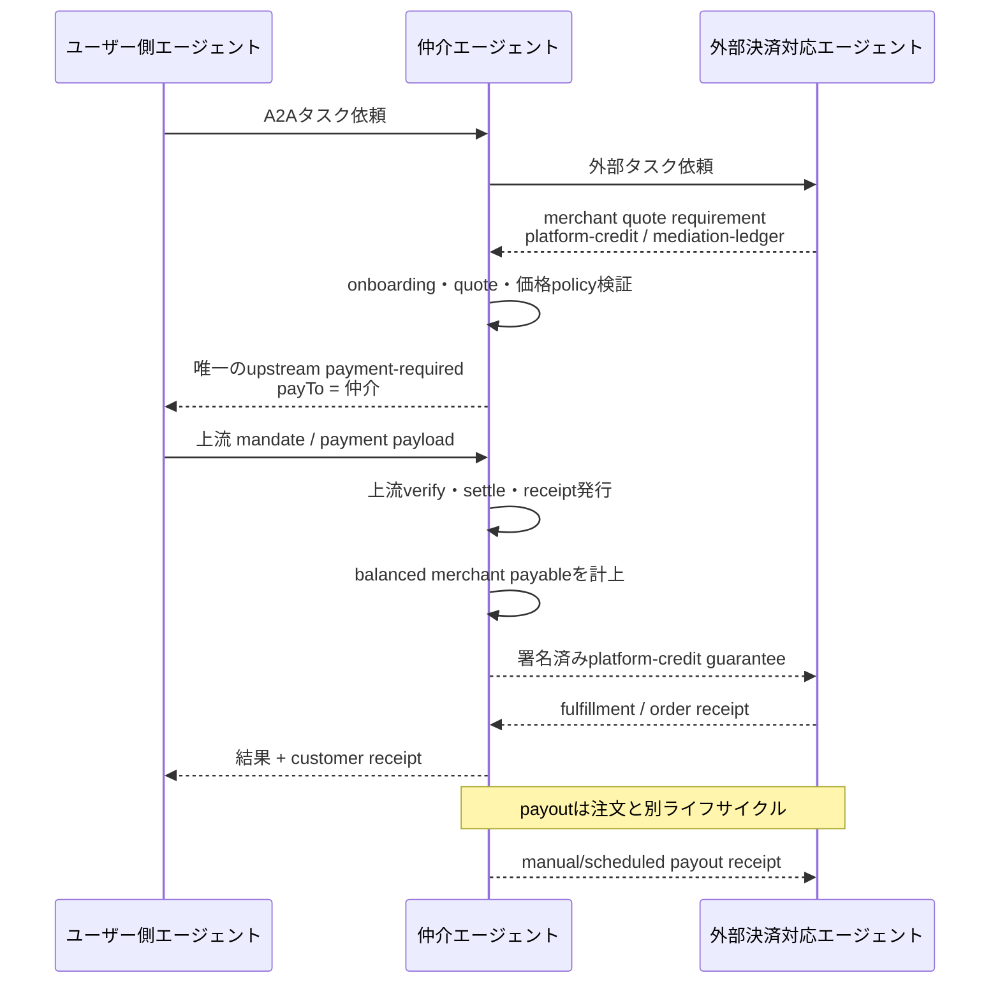
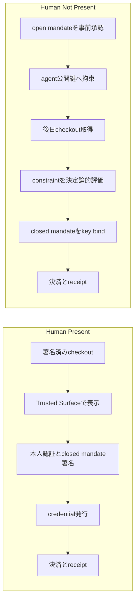
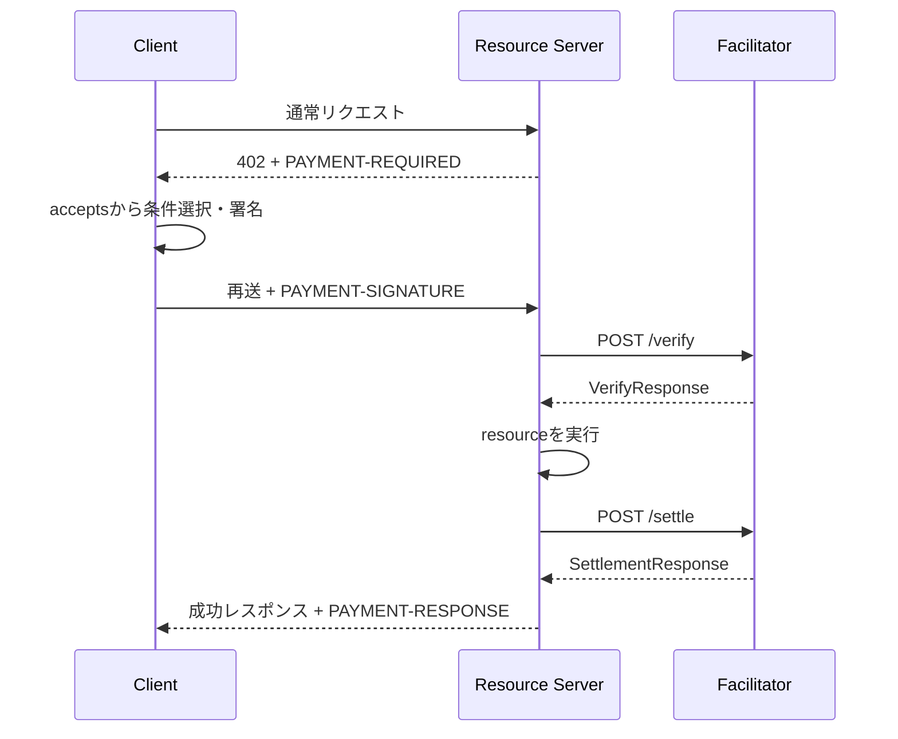
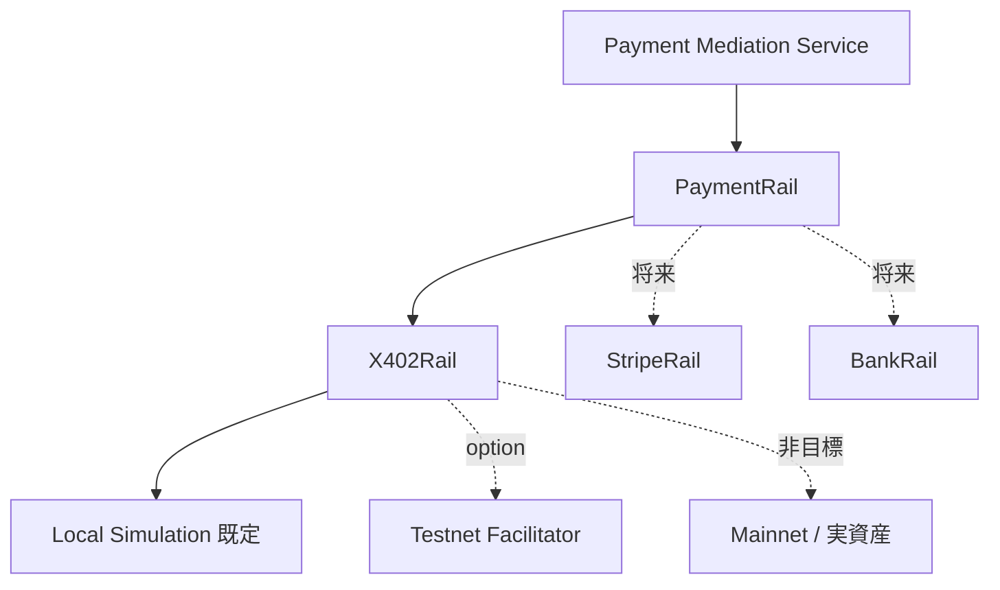
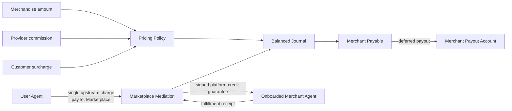

# AP2 / x402 / 現行デモ調査レポート

> **文書状態:** 2026-08-15 に作成した旧 marketplace 案の調査記録であり、現在の実装方式や適合範囲を示す文書ではない。現行状態は `AP2_X402_DOCUMENT_INDEX.md`、`AP2_X402_IMPLEMENTATION_EVIDENCE.md`、`AP2_X402_TEST_REPORT.md` の末尾にある最新再試験節を参照する。

- 調査基準日: 2026-08-15
- 対象: Secure AI Agent Matching Platform の仲介エージェントと外部デモエージェント
- 目的: Google AP2 の x402 extension を、ユーザー側エージェントまで含む決済仲介として実装するための事実整理
- 再現用revision: AP2 `b4587ac`（v0.2.0 tag）、x402 `167a828`、a2a-x402 `125db55`、本リポジトリ `cfef2ab`

## 1. エグゼクティブサマリー

AP2 は決済レールではなく、ユーザーが「誰に、何を、いくらで買うことを許可したか」を mandate と receipt で検証可能にする認可・証跡層である。x402 は支払いが必要であること、支払い条件、署名済み支払payload、検証・精算結果を HTTP、A2A、MCP などで運ぶプロトコルである。

2026-08-15時点の採用基準は AP2 v0.2 と x402 v2 とする。ただし、Google の `a2a-x402` v0.2仕様とPython参照実装、AP2 x402サンプルには x402 v1 や AP2 v0.1時代の語彙が残る。AP2 v0.2、x402 v2、A2Aを一貫して結ぶ完成済みの単一canonical実装は存在しない。このデモは次を明示した互換プロファイルとして実装する必要がある。

- AP2 v0.2のCheckout Mandate / Payment Mandate / Receiptを採用する。
- x402 v2の`PaymentRequired`、`PaymentPayload.accepted`、`SettlementResponse`を採用する。
- A2A metadataで`payment-required`、`payment-submitted`、`payment-completed`等を運ぶ。
- Googleサンプル由来の旧v1 fieldを内部domain modelへ持ち込まない。
- 規範仕様、公式サンプル上の慣例、このデモ独自のbindingを文書で区別する。

今回の追加要件では、仲介エージェント自身がmarketplaceとして決済を仲介する。外部エージェントからmerchant quote requirementを受け、任意手数料policyを適用した唯一のリアルタイムx402 chargeをユーザー側エージェントへ発行する。上流settlement後、仲介はmerchant payableを台帳計上し、外部エージェントへ署名済みplatform-credit guaranteeを返す。事業者へのpayoutは注文と分離した後続ライフサイクルとする。

この方式はApp Storeやmarketplaceのようにcustomer chargeとmerchant payoutを分離する。Appleはcustomer priceから税とcommissionを控除したdeveloper proceedsを月次でまとめて支払い、Stripe Connectもplatform chargeとconnected account transfer/payoutを分離できる。外部merchantは即時資金ではなく、onboarding/trust agreementに基づく仲介のguaranteeを受け入れる必要がある。保証を信頼しないmerchant向けのリアルタイムdirect settlementは将来拡張とする。

## 2. プロトコルの責務分離

| 層 | 責務 | このデモでの扱い |
|---|---|---|
| A2A | Agent Card、拡張negotiation、message/task transport | ユーザー側↔仲介、仲介↔外部の両方 |
| UCP等 | カタログ、checkout、注文状態 | 完全実装は非目標。固定quoteで最小モデル化 |
| AP2 | 権限、Checkout/Payment Mandate、Receipt、証拠 | 決定論的モデルとhash binding |
| x402 | payment-required、signed payload、verify/settle | v2-shaped dataを使うsimulation rail |
| 実決済レール | カード、銀行、stablecoin等の資金移動 | simulationを既定、testnetは将来option |

AP2もx402 coreも特定のAIモデルやADKを必須としない。署名、hash、constraint評価、budget更新、replay判定、決済可否はLLMではなく決定論的コードで行う。

## 3. AP2の現状

### 3.1 バージョンと成熟度

最新公式releaseはAP2 v0.2.0（2026-04-28）。GoogleはAP2をFIDO Allianceへ寄贈し、FIDO Payments TWGで標準化が進行中である。したがって、AP2 v0.2は現時点の公開実装基準ではあるが、完成したFIDO標準ではない。

v0.2の主眼はHuman Not Present（HNP）である。v0.1のIntent/Cart/Payment Mandateという説明から、規範モデルはCheckoutとPayment、それぞれopen/closedへ整理された。旧サンプルの`CartMandate`をそのまま新規domain modelに採用してはならない。

### 3.2 ロール

| ロール | 責務 |
|---|---|
| Shopping Agent | 探索、checkout形成、mandate取得・提示、実行 |
| Credential Provider | 利用可能な決済手段提示、mandate検証、checkout限定credential発行 |
| Merchant | checkout、価格・在庫、Checkout Mandate検証 |
| Merchant Payment Processor | Payment Mandateとcredentialを検証し、決済とPayment Receipt発行 |
| Trusted Surface | 決定論的UIで内容表示、本人認証、同意、署名・委任 |

Trusted Surfaceは非エージェントかつ決定論的である必要がある。LLMへTrusted Surface鍵、agent秘密鍵、決済credentialを渡してはならない。

### 3.3 MandateとReceipt

- closed Checkout Mandate: `mandate.checkout.1`
- open Checkout Mandate: `mandate.checkout.open.1`
- closed Payment Mandate: `mandate.payment.1`
- open Payment Mandate: `mandate.payment.open.1`

closed Checkout Mandateはmerchant署名済み`checkout_jwt`と、そのcompact表現に対する`checkout_hash`を持つ。closed Payment Mandateは`transaction_id`、`payee`、minor unit整数の`payment_amount`、`payment_instrument`を持ち、checkoutへ拘束される。

Receiptはx402のsettlement responseと別物である。AP2 Payment Receiptは、status、issuer、発行時刻、closed Payment Mandate hashへのreference、payment ID等を持つ監査証拠である。

### 3.4 Human Present / Human Not Present

HNPでは未知constraintをfail closedとし、`unresolved_constraint`でHuman Presentへ戻す。AP2規範上は、前回のrejection receiptなしにsubsequent open mandateを提示してはならない。加えて本デモ独自の防御要件として、Receipt取得前の重複closed mandate発行、budgetの二重消費、replayをDB transactionとidempotencyで防ぐ。

## 4. x402 v2の現状

### 4.1 HTTPフロー

x402 v2では`PaymentRequired.accepts[]`に支払い条件を列挙する。clientは1つを選び、選択した条件を`PaymentPayload.accepted`へそのまま入れ、scheme/network固有の`payload`を作る。成功/失敗の精算結果は`SettlementResponse`である。

v1とv2の代表的差分は次の通り。

| x402 v1 | x402 v2 |
|---|---|
| `network: "base"` | `network: "eip155:8453"`等のCAIP-2 |
| `maxAmountRequired` | `amount` |
| `X-PAYMENT`系header | `PAYMENT-SIGNATURE`等 |
| requirement内にresource | `PaymentRequired.resource`へ分離 |

### 4.2 A2A transport

A2AではHTTP status 402ではなくTask/Message metadataを使う。以下は2026-08-15時点のx402 A2A transport文書が例示する**A2A 0.3系の表現**であり、A2A 1.0のwire modelではない。

- 要求: Task `input-required` + `x402.payment.status: payment-required`
- 送信: task ID付きMessage + `x402.payment.status: payment-submitted`
- 成功: `payment-verified` → `payment-completed`
- 失敗: `payment-failed` + payment error
- settlement履歴: `x402.payment.receipts[]`へ追記し、置換しない

Agent Cardの`capabilities.extensions`で対応を宣言し、extension activation headerを使う。現行リポジトリのA2A SDKは0.3系である。

### 4.3 Version matrixと採用方針

| 対象 | 調査時点 | このデモ |
|---|---|---|
| AP2 | v0.2.0 | v0.2 domain model |
| x402 core | v2 | v2-shaped domain model |
| x402 A2A transport文書 | A2A 0.3形式を例示 | 意味論を参照 |
| 本リポジトリ`a2a-sdk` | 0.3.19 | wire adapterを0.3.19へ固定 |
| A2A current | 1.0.0 | 今回は非対応、将来adapter |

A2A 1.0ではtask state/roleのenum、Part、Agent Cardの`supportedInterfaces[]`、operation、version negotiationが破壊的に変わる。このデモは既存コードを保つため0.3.19へ固定し、transport-neutralなpayment domainと`A2A03PaymentAdapter`を分離する。A2A 1.0 clientから直接相互運用できるとは表明しない。

## 5. x402はブロックチェーン前提か

### 5.1 結論

x402は理念とcore data modelではnetwork、token、currency非依存で、fiat networkの拡張も許容する。一方、現行の標準scheme、公式SDK、facilitator、相互運用実績はEVM/Solana上のstablecoinを中心にしている。つまり「仕様上は必須ではないが、今すぐ相互運用できる実装はブロックチェーン中心」である。

このデモではブロックチェーンを仲介エージェントやAP2の前提にしない。`PaymentRail`抽象の一実装として`X402Rail`を置き、既定は価値を移動しないlocal simulationとする。

### 5.2 初心者向け用語

| 用語 | 意味 |
|---|---|
| network | 決済レールのnetwork識別子。chainではCAIP-2の`eip155:8453`等を使い、将来の非chain railも概念上含む |
| asset | USDC等。x402の値は表示名でなくcontract/mint addressの場合がある |
| atomic unit | tokenの最小単位。USDCは通常6桁で、1 USDCは1,000,000単位 |
| wallet / signer | 支払条件へ署名する機能。秘密鍵を直接保持するwalletだけでなくhardware、MPC、custodial signerも含む |
| nonce | 同じ署名を再利用できなくする一意値 |
| facilitator | resource serverに代わり署名検証とsettlementを行うサービス |
| gas | chainへtransactionを記録する手数料。schemeによりfacilitatorが負担可能 |
| finality | transactionが取り消されないと見なせる確認状態 |

### 5.3 EVMの`exact`

EVMの代表実装はEIP-3009の`transferWithAuthorization`を使う。payerは送付先、金額、有効期間、nonceへ署名する。facilitatorは署名、残高、network、asset、recipient、金額、期限をverifyし、settle時にtransactionを送信する。payerが秘密鍵をfacilitatorへ預ける必要はない。

### 5.4 Solanaの`exact`

SolanaではSPL Tokenの`TransferChecked`を中心にしたtransactionへ署名する。facilitatorはinstructionの並び、token account、authority、amount、destination、compute unit price等を厳密に検証する。EVMと同じJSON fieldでも署名payloadと検証規則は異なる。

### 5.5 Facilitatorの責務

標準interfaceは次の3つである。

- `POST /verify`: read-onlyの署名・条件検証
- `POST /settle`: 資金移動または精算状態の確定
- `GET /supported`: version/scheme/network/extensions/signerの能力取得

facilitatorは通常custodianではないが、gas sponsorship、RPC、署名検証、transaction送信を担う。起動時に`/supported`でversion/scheme/network/extensionを照合する。標準`/supported`はasset一覧を必須提供しないため、asset contract/mint、decimals、payToは別のallowlist、facilitator文書、scheme validatorで検証する。

### 5.6 Stripeとの関係

Stripeにはaccess approvalとpreview APIを要する公式x402 payments機能がある。ただし通常のカードPaymentIntentをx402署名に変換する機能ではない。クライアントがオンチェーンで支払い、Stripeがdeposit addressを扱う。settlement後は、chain transactionを`crypto/transaction_verification` modeの新しいPaymentIntentとして記録してconfirmする。未capture資金を後からcaptureするフローではない。

通常のStripe PaymentIntentはAP2の別payment railとして利用できる。Stripeの公式machine-paymentsではカードとstablecoinを併設する境界をMPPとしている。Stripeを背後にした独自x402 scheme/facilitatorも技術的には可能だが、client、仲介、外部agent、facilitatorが同じcustom schemeを実装する必要があり、一般x402 clientとの相互運用性は低下する。

## 6. Google AP2 x402 extensionの仕様ドリフト

Google `a2a-x402` のmainにはv0.2 specificationがあり、standalone flowとAP2 embedded flowを説明する。しかし、例とPython実装にはx402 v1の`network: base`、`maxAmountRequired`、旧extension URIが残る。AP2側サンプルも「AP2-compatible x402 extension is coming soon」と明記する箇所があり、v0.2の`CheckoutMandate` / `PaymentMandate`と完全には揃っていない。

Googleのembedded flowにある次の考え方は採用可能である。

- payment requirementをcheckout証跡へ拘束する。
- signed x402 payloadをPayment Mandateへ拘束する。
- Human Presentでは注文承認と支払承認を同一Trusted Surfaceでatomicに扱う。
- HNPでは事前委任されたagent keyでconstraint内の支払だけを許可する。

一方、JSON shape、extension URI、version negotiation、receipt mappingはこのデモのbinding profileとして明文化しなければならない。

## 7. 現行デモの仕様とギャップ

### 7.1 実行構成

単一コンテナ内をsupervisordで多プロセス起動し、nginxを入口とする。

| port | service |
|---|---|
| 8000 | Secure Mediation Agent (`adk web`) |
| 8001 | Trusted Agent Store |
| 8002 | 外部A2Aデモエージェント群 |
| 8003 | Firebase token verifier |
| 8080 | nginx |

現状はブラウザ/ADK UI→仲介→外部A2Aであり、仲介エージェント自身のA2A endpointは公開されていない。`user-agent`も仲介を呼ぶclientではなく単純サンプルである。Copilot、Gemini、独自agentから決済依頼を受けるには、仲介のA2A server面とAgent Cardを実装する必要がある。

### 7.2 仲介エージェント

- `plan_approved`はbooleanで、金額、payee、asset、network、期限に拘束されない。
- MatcherはStore record変換時にAgent Card extensionを保持しない。
- Plannerの正本はMarkdown中心で、構造化payment stateがない。
- Orchestratorは`RemoteA2aAgent`経由のtext/function resultを中心に収集し、payment metadataを保持しない。
- A2A呼び出しごとにin-memory sessionを作り、payment task再開や二重支払防止に必要な永続性がない。
- URL/Base64 sanitizeは正当なfacilitator URLやproofを破壊し得る。
- conversation artifactやINFO logへproof/credentialを出してはならない。

### 7.3 外部エージェント

- 現行Agent Cardの`capabilities`は空で、payment extensionを宣言しない。
- 予約toolは支払なしで即`confirmed`を返す。
- 検索価格と予約価格を別の乱数で作るため、提示額をmandateへ固定できない。
- `task_store=None`でchallenge/resume、replay防止、receipt保持がない。
- 例外を通常text messageへ変換し、payment-requiredとfailureを区別できない。

決済対応デモはsearch→quote固定→payment-required→proof検証→idempotent booking→receiptに分離する必要がある。

### 7.4 Storeとテスト

Store registryはAgent Card extension snapshotを保持しない。PreCheckでextension schema、network/asset、payee、facilitator、card digestを検証する余地がある。既存テストはStore評価系が中心で、仲介、外部A2A、payment、replay、idempotencyのテストはない。

## 8. Marketplace型決済仲介で必要な性質

### 8.1 Customer chargeとmerchant payoutを分離する

customerが注文時にsettleするのは仲介への一回だけである。external legの`platform-credit`は即時資金移動ではなく、merchant quoteと仲介署名保証のcontractである。標準x402 `exact` settlementやx402 `SettlementResponse`と表示してはならない。

最低限、`merchandise_amount`、`customer_surcharge`、`collection_rail_cost`、`customer_total`、`provider_commission`、`payout_rail_cost`、`merchant_payable_amount`を別fieldで保持する。初期デモでは全fee/costを0に固定する。将来のprovider commissionはmerchant proceedsから、customer surchargeはcustomer totalへ、rail costは定義した一箇所で一度だけ反映する。

次の値をorder、evidence、journal、payout間で相関する。

- order ID、A2A task/context ID、merchant/onboarding version
- quote ID、checkout hash、closed mandate hash
- payment requirement、payload、receipt、guaranteeのdigest
- journal transaction/entry ID、merchant payable ID
- idempotency key、nonce、iat/exp、actor
- payout/refund IDとreceipt reference
- pricing policy versionと全内訳

### 8.2 なぜ二段のリアルタイム決済ではないか

二段方式では、どちらか一方だけがsettleする非原子的失敗窓が生じる。marketplace型はcustomer settlement後にmerchant payableという負債を計上し、merchantには保証を返し、後日まとめてpayoutする。これにより注文時の支払いを一回にでき、手数料、返金、hold、payout batchを台帳で管理できる。

一方、仲介はmerchant payable、refund/dispute、negative balance、payout失敗の責任を負う。実資産化する場合はmerchant onboarding、契約、本人確認、資金保全、税務・会計・規制、chargeback等が別途必要である。このデモは価値を移動しないsimulationとする。

### 8.3 参照例

- Apple App Storeはdeveloper proceedsをcustomer priceから税とcommissionを差し引いた額として計上し、通常は月次でまとめて支払う。
- Stripe Connectのdestination chargesやseparate charges and transfersは、customer chargeとconnected accountへのtransfer/payoutを分離し、application feeを残せる。
- x402 core `exact`はこのmarketplace ledgerやdeferred payoutを標準化しないため、`platform-credit`はproject-local profileとして扱う。

## 9. デモの採用方針

### 9.1 採用

- AP2 v0.2のfield semanticsを持つ構造化Checkout/Payment MandateとReceipt
- x402 v2 wire modelとA2A payment metadata
- 仲介エージェントのA2A server面
- payment-awareな外部デモエージェント
- deterministicなmarketplace payment service、pricing policy、balanced journal、merchant payable
- local cryptographic simulation facilitator/rail
- single upstream charge、platform-credit guarantee、manual payout
- merchandise、surcharge、commission、rail cost、customer total、merchant payableの分離
- challenge/mandate/payload/receipt/guarantee/journal digestによるbinding
- replay、expiry、amount/payee/network/asset mismatchのfail-closed検証

### 9.2 非目標

- mainnet、実資産、実wallet秘密鍵
- 実Stripe連携、カード情報、銀行接続
- production-grade SD-JWT/dSD-JWT、KMS/HSM、key rotation
- UCP全体、refund/chargeback/争議処理の完全実装
- 注文時のmerchant向けリアルタイムdirect settlement
- FIDO最終標準への準拠表明
- Googleサンプルとx402 v2のcanonical互換性の主張
- AP2署名conformanceまたはA2A 1.0相互運用性の主張

### 9.3 simulationを選ぶ理由

- 秘密鍵・faucet・RPC・残高なしで再現可能。
- timeout、replay、改ざん、二重実行、手数料を決定論的にテストできる。
- 誤って実資産を移動しない。
- charge、payable、guarantee、fulfillment、payoutの片側失敗を安全に再現できる。
- 将来`PaymentRail`実装をtestnet/Stripeへ差し替えられる。

simulationでも署名検証を省略しない。test-only keyでcanonical JSON digestへ署名し、改ざん、期限、nonce、audienceを検証する。ただしproduction-grade SD-JWT/dSD-JWTではないため、envelopeへ`profile: urn:secure-a2a:extensions:ap2-x402-marketplace:v1`と`simulated: true`を常時付与し、「AP2署名準拠」「on-chain settlement済み」とは表示しない。公開chain名や実在しそうなtransaction hashは生成しない。旧`demo.ap2-x402.simulation/v1`は方針変更により廃止する。

## 10. セキュリティ要件の調査結果

- 署名、hash、constraint、pricing、budget、replay、receipt更新はLLM外で行う。
- secret、raw proof、credentialをprompt、tool text、artifact、通常logへ渡さない。
- compact JWT/SD-JWTのexact bytesを保持してhashする。
- `iss`、`aud`、`nonce`、`iat`、`exp`、`vct`、`cnf`、checkout hashを検証する。
- unknown constraint、unsupported scheme/network/assetはfail closed。
- SSRFを防ぐためAgent Card/facilitator URLのscheme、host、redirect、private IPを制限する。
- payment receiptを根拠にbudgetを原子的更新し、idempotency/replay storeを使う。
- Agent Card extensionをStore→Matcher→Planner→Orchestratorで欠落させない。
- payment envelopeを構造検証・redactした後、自然言語部分だけを既存LLM Judgeへ渡す。

## 11. 未確定事項

- AP2 v0.2 `PaymentInstrument`にx402 v2 payloadを埋めるcanonical JSON shape
- AP2 Payment Receiptとx402 SettlementResponseの標準的binding
- AP2/x402/A2Aに共通するcanonical extension URIとversion matrix
- AP2 mandate hashとx402 nonceの標準的暗号binding
- A2A v1.0へ移行する時期と現行0.3 SDKとの互換層
- refund/cancellation/chargeback、複数merchant、累積budgetの相互運用仕様
- 通常Stripe/card railをx402 custom schemeにするか、AP2の別railとして扱うか
- 仲介手数料の課金主体、税、丸め、返金時の扱い

## 12. 公式一次資料

### AP2

- [AP2 specification](https://ap2-protocol.org/ap2/specification/)
- [AP2 releases](https://github.com/google-agentic-commerce/AP2/releases)
- [AP2 Checkout Mandate](https://ap2-protocol.org/ap2/checkout_mandate/)
- [AP2 Payment Mandate and Receipt](https://ap2-protocol.org/ap2/payment_mandate/)
- [AP2 flows](https://ap2-protocol.org/ap2/flows/)
- [AP2 security and privacy](https://ap2-protocol.org/ap2/security_and_privacy_considerations/)
- [Google: AP2 contribution to FIDO Alliance](https://blog.google/products-and-platforms/platforms/google-pay/agent-payments-protocol-fido-alliance/)
- [FIDO Alliance announcement](https://fidoalliance.org/fido-alliance-to-develop-standards-for-trusted-ai-agent-interactions/)

### x402 / A2A

- [x402 v2 core specification at reviewed revision](https://github.com/x402-foundation/x402/blob/167a828e8319aa7b403f4f4312489e9cffadff10/specs/x402-specification-v2.md)
- [x402 HTTP transport v2 at reviewed revision](https://github.com/x402-foundation/x402/blob/167a828e8319aa7b403f4f4312489e9cffadff10/specs/transports-v2/http.md)
- [x402 A2A transport v2 at reviewed revision](https://github.com/x402-foundation/x402/blob/167a828e8319aa7b403f4f4312489e9cffadff10/specs/transports-v2/a2a.md)
- [x402 official repository and principles](https://github.com/x402-foundation/x402)
- [Google a2a-x402 v0.2 at reviewed revision](https://github.com/google-agentic-commerce/a2a-x402/blob/125db5526a965d2325459d1a9df2e274a7e42396/spec/v0.2/spec.md)
- [Google AP2 Human Present x402 sample](https://github.com/google-agentic-commerce/AP2/tree/main/code/samples/python/scenarios/a2a/human-present/x402)
- [Google AP2 Human Not Present x402 sample](https://github.com/google-agentic-commerce/AP2/tree/main/code/samples/python/scenarios/a2a/human-not-present/x402)
- [A2A extensions](https://a2a-protocol.org/latest/topics/extensions/)

### 実決済レール

- [Coinbase x402 network support](https://docs.cdp.coinbase.com/x402/network-support)
- [Coinbase facilitator](https://docs.cdp.coinbase.com/x402/core-concepts/facilitator)
- [Stripe x402 payments preview](https://docs.stripe.com/payments/machine/x402?locale=en-GB)
- [Stripe Connect charge types](https://docs.stripe.com/connect/charges?locale=en-GB)
- [Stripe Connect separate charges and transfers](https://docs.stripe.com/connect/marketplace/tasks/accept-payment/separate-charges-and-transfers?locale=en-GB)
- [Apple App Store payments and proceeds](https://developer.apple.com/help/app-store-connect/getting-paid/view-payments-and-proceeds/)
- [Apple App Store payment schedule](https://developer.apple.com/help/app-store-connect/getting-paid/overview-of-receiving-payments/)
