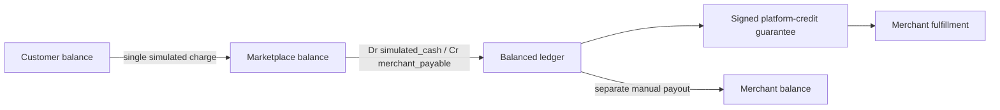

# AP2 / x402 Marketplace デモ運用手順

本機能は `urn:secure-a2a:extensions:ap2-x402-marketplace:v1` 固有の、実資産を移動しない simulation である。標準 x402 `exact` settlement、AP2適合認証、法的なpayment guarantee、実payoutではない。

## 起動と確認

```bash
docker build -t secure-a2a-payment-demo .
docker run --name secure-a2a-payment-demo -p 8080:8080 secure-a2a-payment-demo
docker exec secure-a2a-payment-demo /app/scripts/verify_payment_demo.sh
```

ADK Webでは`payment_user_agent`を選び、予約依頼後に表示される受取人・価格内訳を確認して`承認`と送る。`yes`や他の語では決済しない。CLIでは`/app/user-agent/payment_cli.py --approval "承認"`で同じフローを再現できる。

外部公開routeは次のとおり。

| Route | 内容 |
|---|---|
| `/payment/health`, `/payment/ready` | 仲介決済serviceのliveness/readiness |
| `/payment/.well-known/agent-card.json` | 仲介のA2A Agent Card |
| `/payment/a2a` | A2A wire 0.3.0 JSON-RPC payment endpoint |
| `/payment/v1/orders...` | project-local client向け注文・支払・status |
| `/paid-agent/.well-known/agent-card.json` | 決済対応外部agentのAgent Card |
| `/paid-agent/v1/...` | merchant quote/fulfillment/status |

`/payment/internal/` はnginxから公開しない。manual payout、refund、reconciliationはcontainer内部の8004番だけで、固定test operatorの署名済みrequest、理由、idempotency keyを必須とする。

## 正常な資金・台帳フロー



初期fee/costはすべて0。customer 100000 minor units、商品1250 minor unitsで開始する。注文時の唯一のリアルタイムcharge先は`mediation-platform`であり、外部agentへは即時settlementせずpayableと署名保証を発行する。

## 回復方針

| 状態 | 正本 | 操作 |
|---|---|---|
| charge結果不明 | `rail_operations.operation_id` | 新規chargeを作らず同じoperationを照会 |
| charge済み・journalなし | rail receipt + source charge ID | 同じsource IDのbalanced journalを冪等posting |
| guarantee配信不明 | evidence DBのexact bytes | 同じguarantee ID/bytesだけを再送 |
| fulfillment結果不明 | merchantのorder/guarantee status | 新規fulfillmentを作らずstatus照会 |
| refund/payout結果不明 | rail operation + journal | 同じID/keyで照会し、成功を推測しない |

保証を発行・受理できない、merchantが停止/失効、未acceptで期限切れ、またはfulfillmentが失敗した場合は、payableをpayout対象外にし、`refund_required`へ進める。MVP refundはpayout前・merchant責任・全額・fee 0だけを扱う。

## データとreset

- business DB: `/app/payment-data/marketplace.db`
- merchant DB: `/app/payment-data/paid-agent.db`
- exact signed evidence: `/app/payment-evidence/evidence.db`（mode 700の別directory）

通常再起動で消去しない。デモresetが必要な場合はcontainerを停止し、対象container/volumeと件数を確認した上で新しいcontainerを作る。稼働中DBを直接編集したり、journal/evidence rowを削除しない。

## 本番化してはいけない部分

- 公開test HMAC vectorと固定identity
- `exact-simulated` / `demo:local` / `platform-credit`
- local SQLiteと単一processの回復モデル
- test fault injection
- 税・FX・reserve・dispute・negative balance・chargebackを持たないzero-fee policy

実chain、Stripe/card/bank rail、非ゼロfee、Human Not Present、scheduled payout、A2A 1.0へ進む場合は、要件・profile・ledger・規制/責任分界・受入条件をversion更新してから実装する。
