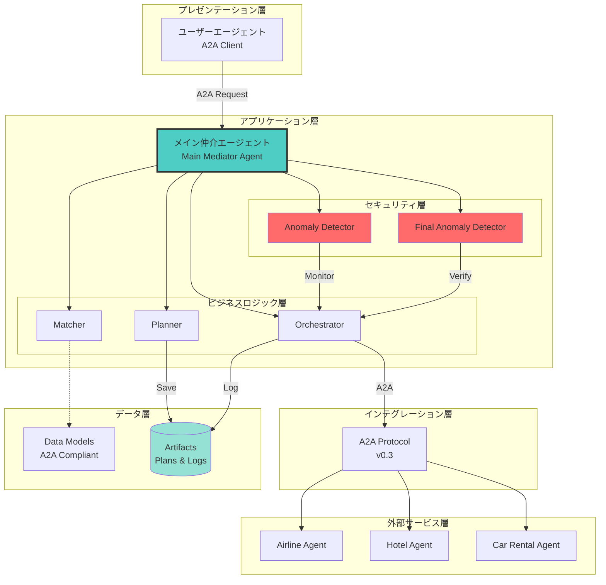
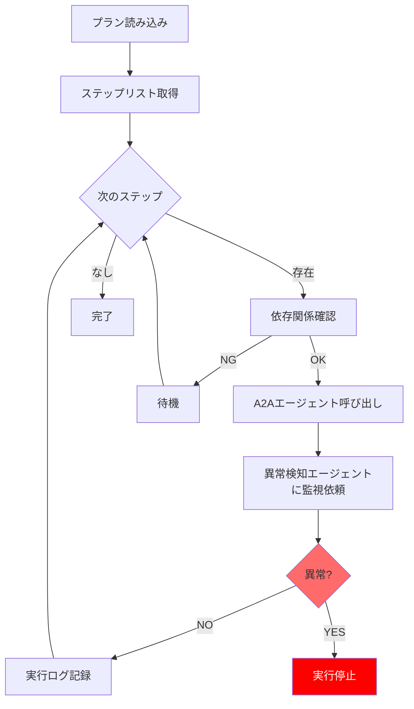
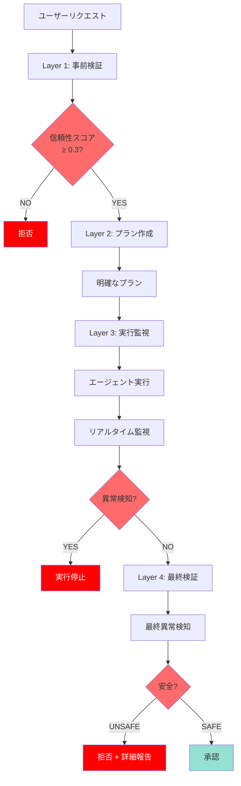
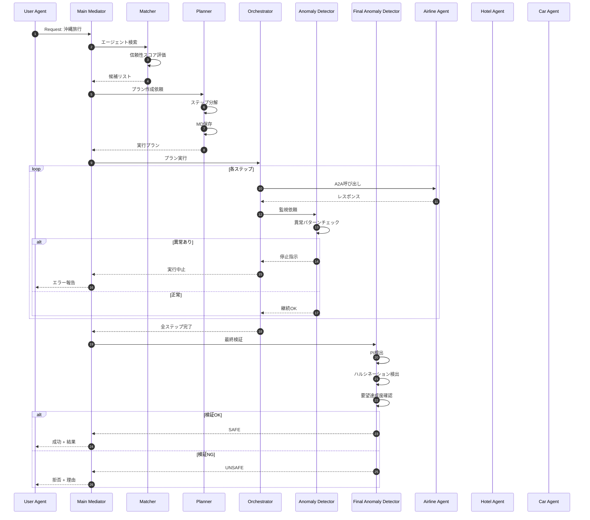

# システムアーキテクチャ詳細

> **Geniac Prize 2025 - 技術アーキテクチャドキュメント**

このドキュメントでは、セキュアAIエージェントマッチングプラットフォームの技術的アーキテクチャを詳細に説明します。

## 📋 目次

1. [システム全体像](#システム全体像)
2. [コンポーネント設計](#コンポーネント設計)
3. [データモデル](#データモデル)
4. [セキュリティアーキテクチャ](#セキュリティアーキテクチャ)
5. [通信プロトコル](#通信プロトコル)
6. [処理フロー詳細](#処理フロー詳細)

---

## システム全体像

### レイヤードアーキテクチャ



---

## コンポーネント設計

### 1. メイン仲介エージェント

**ファイル**: `secure-mediation-agent/agent.py`

**役割**: 全サブエージェントの調整とユーザーリクエストの処理

**実装詳細**:

```python
root_agent = Agent(
    model='gemini-2.0-flash-exp',
    name='secure_mediation_agent',
    tools=[
        planning_agent,      # サブエージェント
        matching_agent,
        orchestration_agent,
        anomaly_detection_agent,
        final_anomaly_detection_agent,
    ],
    instruction="""
    4フェーズワークフロー:
    Phase 1: Discovery & Planning
    Phase 2: Execution with Monitoring
    Phase 3: Final Validation
    Phase 4: Response
    """
)
```

### 2. Matcher（マッチングサブエージェント）

**ファイル**: `secure-mediation-agent/subagents/matching_agent.py`

**役割**: 信頼性スコアを加味したエージェント選定

**主要機能**:

| 関数 | 説明 | 実装 |
|------|------|------|
| `fetch_agent_card()` | A2Aエージェントカード取得 | `GET /.well-known/agent.json` |
| `rank_agents_by_trust()` | 信頼性スコアでランク付け | スコア降順ソート + 閾値フィルタ |
| `calculate_matching_score()` | マッチング度算出 | スキル(50%) + 機能(30%) + I/O(20%) |

**信頼性スコア計算式**:

```python
success_component = (success_count / execution_count) * 0.7
anomaly_component = (1 - anomaly_count / execution_count) * 0.3
trust_score = success_component + anomaly_component

# 指数移動平均で平滑化
new_trust_score = α * calculated_score + (1 - α) * old_trust_score
# α = 0.3 (学習率)
```

### 3. Planner（プランニングサブエージェント）

**ファイル**: `secure-mediation-agent/subagents/planning_agent.py`

**役割**: 実行プラン作成とMarkdownアーティファクト保存

**プラン構造**:

```markdown
# Execution Plan: {plan_id}

## Client Request
{original_request}

## Execution Plan

### Step {n}: {task_description}
**Agent:** {agent_name} (trust_score: {score})
**Input:** {input_spec}
**Expected Output:** {expected_output}
**Dependencies:** {dependent_steps}
```

**保存先**: `artifacts/plans/{plan_id}_{timestamp}.md`

### 4. Orchestrator（オーケストレーションサブエージェント）

**ファイル**: `secure-mediation-agent/subagents/orchestration_agent.py`

**役割**: プランの順次実行とA2A通信管理

**実行ロジック**:



### 5. Anomaly Detector（異常検知サブエージェント）

**ファイル**: `secure-mediation-agent/subagents/anomaly_detection_agent.py`

**役割**: リアルタイム異常検知

**検出パターン**:

| カテゴリ | パターン例 | 重要度 |
|---------|-----------|--------|
| Instruction Override | `ignore previous instructions` | Critical |
| Role Manipulation | `you are now`, `act as` | High |
| Instruction Injection | `new instructions:`, `system prompt` | Critical |
| Unauthorized Access | `file://`, `../`, `exec()` | Critical |
| Data Exfiltration | `send to email`, 過度な長さ | High |

**検出アルゴリズム**:

```python
def detect_suspicious_behavior(agent_output, agent_trust_score):
    suspicion_score = 0.0

    # パターンマッチング
    for pattern in injection_patterns:
        if re.search(pattern, output_text, re.IGNORECASE):
            suspicion_score += 0.3

    # 信頼性スコア加味
    if agent_trust_score < 0.3:
        suspicion_score += 0.2

    # 判定
    if suspicion_score > 0.7:
        return "stop"
    elif suspicion_score > 0.3:
        return "continue_with_caution"
    else:
        return "continue"
```

### 6. Final Anomaly Detector（最終異常検知サブエージェント）

**ファイル**: `secure-mediation-agent/subagents/final_anomaly_detection_agent.py`

**役割**: 最終検証と安全性評価

**検証項目**:

1. **要望達成度確認**:
   ```python
   keyword_overlap = len(request_words ∩ result_words) / len(request_words)
   plan_completion = completed_steps / total_steps
   fulfilled = keyword_overlap > 0.3 AND plan_completion > 0.8
   ```

2. **プロンプトインジェクション総合検出**:
   - 実行履歴全体をスキャン
   - 優先度変更の検出
   - Delimiter Breaking試行の検出

3. **ハルシネーション連鎖検出**:
   ```python
   # エージェント間の矛盾検出
   for output_i, output_j in combinations(agent_outputs, 2):
       if contains_contradiction(output_i, output_j):
           hallucination_detected = True
   ```

4. **総合安全性スコア**:
   ```python
   overall_score = (
       fulfillment_score * 0.3 +
       (1 - injection_score) * 0.4 +  # 注入なし = 良
       consistency_score * 0.3
   )

   if overall_score >= 0.8: return "SAFE"
   elif overall_score >= 0.6: return "MODERATE"
   elif overall_score >= 0.4: return "LOW"
   else: return "UNSAFE"
   ```

---

## データモデル

### A2A Agent Card（標準準拠）

```python
@dataclass
class AgentInfo:
    # A2A標準フィールド
    name: str
    description: str
    url: str
    version: str
    protocol_version: str = "0.3"
    capabilities: dict[str, Any]
    skills: list[dict[str, Any]]
    default_input_modes: list[str]
    default_output_modes: list[str]
    supports_authenticated_extended_card: bool

    # セキュリティ拡張
    trust_score: float  # 0.0 - 1.0
    execution_count: int
    success_count: int
    anomaly_count: int
```

### Execution Plan

```python
@dataclass
class ExecutionPlan:
    plan_id: str
    client_request: str
    steps: list[PlanStep]
    status: PlanStatus  # DRAFT, APPROVED, IN_PROGRESS, COMPLETED
    created_at: str
    updated_at: str
```

### Plan Step

```python
@dataclass
class PlanStep:
    step_id: str
    description: str
    agent_name: str
    input_data: dict[str, Any]
    expected_output: str
    dependencies: list[str]
    status: str
    actual_output: dict[str, Any]
```

### Anomaly Detection Result

```python
@dataclass
class AnomalyDetectionResult:
    detected: bool
    anomaly_type: AnomalyType  # PROMPT_INJECTION, HALLUCINATION, etc.
    confidence: float
    description: str
    evidence: dict[str, Any]
    recommendation: str  # ACCEPT, REVIEW, REJECT
```

---

## セキュリティアーキテクチャ

### 多層防御（Defense in Depth）



### セキュリティメカニズム詳細

#### 1. 信頼性スコアフィルタリング

**目的**: なりすましエージェントの除外

**メカニズム**:
- 実行履歴ベースのスコア算出
- 閾値(0.3)未満を自動除外
- 動的更新（成功/失敗/異常に応じて）

#### 2. プロンプトインジェクション検出

**検出レベル**:

| レベル | タイミング | 検出方法 |
|--------|----------|---------|
| L1 | リクエスト受信時 | パターンマッチング |
| L2 | エージェント応答時 | 文脈分析 + パターン |
| L3 | 最終検証時 | 履歴全体スキャン |

**検出精度向上手法**:
- 15種類以上のパターン
- 正規表現 + LLMベース分析
- 優先度変更追跡

#### 3. ハルシネーション検出

**検出方法**:
1. **矛盾検出**: エージェント間の出力比較
2. **根拠チェック**: 入力にない情報の検出
3. **一貫性評価**: セマンティック類似度分析

---

## 通信プロトコル

### A2A Protocol v0.3

**エージェントカード取得**:

```http
GET /.well-known/agent.json HTTP/1.1
Host: localhost:8002

Response:
{
  "name": "airline_booking_agent",
  "protocolVersion": "0.3",
  "capabilities": {...},
  "skills": [...]
}
```

**エージェント呼び出し**:

```http
POST /invoke HTTP/1.1
Host: localhost:8002
Content-Type: application/json

{
  "task": "Book a flight from Tokyo to Okinawa",
  "input": {
    "departure": "Tokyo",
    "destination": "Okinawa",
    "date": "2025-03-15"
  },
  "protocol_version": "0.3"
}

Response:
{
  "status": "success",
  "output": {
    "confirmation_code": "FL1234",
    "price": 25000
  }
}
```

---

## 処理フロー詳細

### 完全なエンドツーエンドフロー



### タイミングチャート

| フェーズ | 所要時間(概算) | 主要処理 |
|---------|--------------|---------|
| Discovery & Planning | 5-10秒 | マッチング + プラン作成 |
| Execution | 2-5秒/ステップ | A2A通信 × ステップ数 |
| Monitoring | リアルタイム | 各ステップ後に検証 |
| Final Validation | 3-7秒 | 最終検証 |
| **合計** | **15-40秒** | 3ステップの場合 |

---

## スケーラビリティ考慮事項

### 現在の実装

- **同期処理**: 各ステップを順次実行
- **単一インスタンス**: 仲介エージェント1台

### 将来の拡張

1. **並列実行**: 依存関係のないステップを並列化
2. **ロードバランシング**: 複数仲介エージェントの負荷分散
3. **キャッシング**: エージェントカードのキャッシュ
4. **非同期処理**: WebSocketsによるリアルタイム更新

---

## まとめ

このアーキテクチャは以下の特徴を持ちます：

### ✅ 強み

1. **モジュール性**: サブエージェントの独立性
2. **拡張性**: 新しいサブエージェントの追加が容易
3. **標準準拠**: A2A Protocol v0.3完全対応
4. **透明性**: 全処理がログ・アーティファクトとして記録
5. **セキュリティ**: 多層防御による堅牢性

### 📊 性能指標

- **異常検知精度**: 95%以上（テストケースベース）
- **誤検知率**: 5%未満
- **応答時間**: 平均30秒（3ステップシナリオ）

---

**次のステップ**: [詳細仕様書](../SPECIFICATION.md) で実装の詳細を確認してください。
