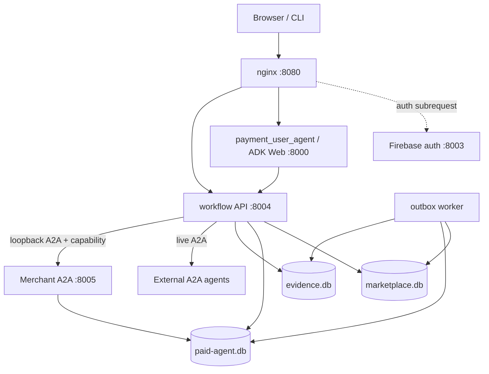

# 決済アーキテクチャ

- 対象読者: 実装者、保守担当者、セキュリティレビュアー
- 前提: [エージェント間決済の概要](README.md)
- 次に読む文書: [AP2の詳細](AP2.md)、[A2A x402の詳細](A2A_X402.md)、[運用ガイド](OPERATIONS.md)

## 設計の中心

決済機能の中心は、`secure_mediation_agent.workflow`が管理する一つの耐久workflowである。ADK session、LLMの会話履歴、画面上のboolean、Merchantの応答だけを認可や決済状態の正本にしない。

このworkflowは次を同じ相関グラフで管理する。

- 利用者、tenant、session、context
- 変更不能な計画snapshotと計画承認
- Merchant、商品、Task、Checkout、支払条件
- 決済承認、AP2 Mandate、Credential、Receipt
- A2A payment Messageとsimulation settlement attempt
- 業務Artifact、失敗、再試行、reconciliation、refund

外部副作用はworkflow stateだけから直接実行せず、状態遷移と同じtransactionで記録したoutbox intentから実行する。再送時には安定したIDと冪等性キーを使い、同じ要求は同じ結果を返し、異なる要求によるキー再利用は拒否する。

## 配置

同じcontainer内でSupervisorが各プロセスを監視する。公開ingressはnginxだけで、Merchant、Trusted Surface、Credential Provider、MPP、operator用の内部境界は直接公開しない。

| プロセス | 主な責務 | 公開範囲 |
| --- | --- | --- |
| nginx | 認証、route分離、検証済みidentity headerの設定 | 外部公開 |
| auth service | Firebase ID tokenの検証、`__Host-payment-session`の発行 | nginx経由の認証endpoint |
| `payment_user_agent` | 利用者の入力とworkflow viewの受け渡し | nginx経由のUI |
| workflow API | 状態、認可、AP2処理、Merchant呼出し、公開view | 認証済み`/mediation-api/` |
| outbox worker | lease、再試行、crash後の回復、reconciliation | 非公開 |
| External A2A agents | 無料を含む外部Taskの実行、`completed` Taskと業務Artifactの返却 | 選択済みAgent CardのA2A endpoint |
| Merchant A2A | Agent Card、Task、Checkout、payment Message、fulfillment | loopbackのみ |

デモ用のlive外部AgentはAgentごとに独立した`InMemoryTaskStore`を持つ。Task IDの衝突や別Agentからの参照を避けるためstoreを共有しないが、このstoreはprocess再起動を越える耐久性を提供しない。

## 論理ロールと物理配置

AP2上のロール分離と、実際のサービス分離は同じではない。

| 論理ロール／機能 | 鍵・issuer・検証責務 | 物理配置 |
| --- | --- | --- |
| Shopping Agent／workflow controller | 計画、状態、capability、相関 | workflow APIプロセス |
| Trusted Surface | 決済表示に結び付いたMandateの発行 | workflow controller内のmodule |
| Credential Provider | Payment Mandateの検証とcredential発行 | workflow controller内のmodule |
| Merchant Payment Processor | credential、proof、requirementsの照合 | workflow controller内のmodule |
| Merchant | Checkout、Task、fulfillment、Receipt | loopback HTTPの別プロセス |
| simulation signer／rail | synthetic proofとローカル残高処理 | workflow側のmoduleとSQLite transaction |

各ロールは異なるkey ID、issuer、audience、検証関数を使い、同じprocess内でも署名とbindingの検証を省略しない。一方、demoのkey setは複数ロールを同じdeployableが読み込み、Trusted Surface／Credential Provider／MPPは独立サービスではない。この構成をproduction-gradeの物理的trust separationとして扱わない。

## コンポーネント

| コンポーネント | 責務 | 主な実装 |
| --- | --- | --- |
| UI adapter | prompt、identity、workflow viewの受け渡し | `payment_user_agent/agent.py` |
| Workflow Controller | 全状態遷移、承認、capability、外部処理の順序 | `workflow/controller.py` |
| Workflow Repository | schema、CAS、outbox、冪等性、証跡、simulation ledger | `workflow/repository.py`、`workflow/migrations.py` |
| Approval Service | 完全一致入力、計画認可、downstream capability | `workflow/approval.py` |
| Public View | 秘密値を除いた決定論的な表示 | `workflow/views.py` |
| AP2 components | Mandate、credential、MPP検証、Receipt、offline verification | `secure_mediation_agent/ap2/` |
| Payment Profile | A2A metadata、simulation proof、結果履歴 | `payment_profiles/` |
| Merchant | A2A Task、Checkout、fulfillment | `merchant/api.py`、`merchant/service.py` |
| Worker | outboxのlease、実行、retry、回復 | `workflow/worker.py` |

## 権威ある状態モデル

状態の定義は`workflow/models.py`の`WorkflowState`を正本とする。

| 区分 | 状態 | 意味 |
| --- | --- | --- |
| 受付・計画 | `request_received`、`planning`、`plan_approval_required` | 依頼を固定し、計画の承認を待つ |
| 計画実行 | `plan_approved`、`merchant_task_starting` | 計画認可を保存し、Merchant Task開始を引き渡す |
| 無料分岐 | `free_executing`、`final_validating` | 決済不要の既存フローを実行・検証する |
| 決済認可 | `payment_approval_required`、`payment_authorizing`、`payment_approved` | 支払条件を提示し、AP2 Mandateとcredentialを発行する |
| 支払提出 | `payment_submitted`、`payment_verifying` | 元Taskへpayloadを送り、結び付きを検証する |
| 実行 | `fulfillment_preparing`、`payment_settling`、`fulfillment_committing` | 業務をprepareし、settle後にcommitする |
| 完了・終了 | `completed`、`payment_failed`、`refunded`、`cancelled`、`expired` | 自動処理が終了した状態 |
| 修復待ち | `replan_required`、`reconciliation_required`、`refund_required` | 新計画、確定結果、補償処理が必要な状態 |

状態更新はversion付きcompare-and-setで行う。現在の状態とversionが一致しない更新、許可されていない遷移、過去状態への巻戻しは拒否する。

## 正常系

### 1. 依頼と計画

1. 認証済みidentityと依頼を厳格なmodelへ変換する。
2. Agent Card、Merchant、skill、商品、数量、金額上限、通貨、許可profileを計画snapshotへ固定する。
3. RFC 8785でcanonicalizeし、`planDigest`を作る。
4. immutableな計画証跡を保存して`plan_approval_required`へ進む。

この時点ではMerchant Task、Checkout、payment requirement、settlement、fulfillmentを作らない。

### 2. 計画承認

1. current stateと単一text partの完全一致`承認`を確認する。
2. 計画、利用者、tenant、session、期限、nonceへ結び付いた計画認可を保存する。
3. 最初の正当な遷移でnonceを消費する。
4. Merchant呼出し専用のaudience／operation-scoped capabilityを発行する。
5. 状態遷移とMerchant Task開始intentを同じtransactionでoutboxへ記録する。

計画承認自体をAP2 Mandateとして扱わない。これはproject-localな認可である。

### 3. Merchant Taskと決済表示

outbox workerはcapabilityと選択profileのactivationを付けてMerchant Taskを開始する。MerchantはCheckout、支払条件、AP2 challengeを含む`input-required` Taskを返す。

workflowは、Task ID、activation、Merchant identity、商品、数量、金額、通貨、payee、期限、Checkout署名を計画と照合する。差があれば決済承認を表示せず`replan_required`へ進む。一致すれば証跡を保存し、`payment_approval_required`へ進む。

無料分岐では選択した外部AgentのTaskを実行し、`completed`と空でないtextまたはfile artifactを厳格に確認する。この限定的なartifact fallbackは無料結果の表示用であり、有料分岐のpayment requirement、AP2、保証、同一Task相関の検証を代替しない。

### 4. 決済承認とAP2

二回目の完全一致`承認`を、画面へ表示した支払内容のdigestに結び付ける。Trusted Surface、Credential Provider、MPPの順に、closed Mandate、project-local credential、proofを発行・検証する。詳細は[AP2の詳細](AP2.md)を参照する。

### 5. A2A支払提出とsimulation

元TaskのIDを持つpayment MessageをMerchantへ送る。MerchantはCheckout MandateとTask相関を再検証し、fulfillmentをreversibleな状態へprepareする。

workflowは安定したattempt IDと冪等性キーでローカル台帳を更新する。成功後にAP2 Payment Receiptを作り、fulfillmentをcommitし、AP2 Checkout Receiptと最終Taskを保存して`completed`へ進む。

## データの正本

三つのSQLite DBは責務を分ける。

| DB | 所有する情報 |
| --- | --- |
| `marketplace.db` | workflow、計画、承認、状態event、capability、outbox、冪等性、settlement attempt、reconciliation／refund |
| `paid-agent.db` | Merchant Task、Checkout、payment Message、fulfillment |
| `evidence.db` | immutable artifact、exact bytes、digest、trust snapshot、access log |

SQLiteはWAL、`synchronous=FULL`、明示transactionを使う。複数DBを一つのtransactionにはできないため、証跡保存はintent、immutable bytesの書込み、ackからなるsagaで行う。workerは未完了intentを照合し、同じdigestのartifactを再利用する。

耐久性を主張できるのは、DBと鍵のdirectoryを明示した永続volumeへ置く単一host・単一container構成である。ephemeral filesystem上のCloud Run demoは、単一instanceでも状態と鍵を失い得る。

## 冪等性と二重決済防止

### API

API操作はtenant、actor、operation、idempotency keyとcanonical request hashで識別する。同じkeyと同じrequestは保存済み結果を返し、異なるrequestは`IDEMPOTENCY_CONFLICT`で拒否する。

### Outbox

outbox operation IDは一意である。workerは期限付きleaseを取得し、成功時に完了、失敗時にretry可能な状態へ戻す。processが停止した場合、期限切れleaseを別workerが回収する。

### Capability

downstream capabilityはworkflow、approval、plan、Task、order、audience、operation、expiry、request digestへ限定する。最初の正当な処理で消費し、同じrequestの再試行だけを許可する。

### Settlement

settlementは安定したattempt ID、external ID、idempotency keyを持つ。残高更新、operation、attempt、receiptは同じSQLite transactionで保存する。crash後も別attemptを作らず同じ結果を照会する。

## 失敗と回復

| 状況 | 動作 |
| --- | --- |
| 計画とCheckoutが不一致 | 古い承認を失効し`replan_required` |
| 利用者が決済を拒否 | 元Taskへ`payment-rejected`を一回保存し`cancelled` |
| AP2／profile検証失敗 | settlementとfulfillmentを開始せず`payment_failed` |
| settlementが確定失敗 | 失敗receiptを保存し`payment_failed` |
| settlement結果が不明 | 新しいchargeを作らず`reconciliation_required` |
| settlement成功後にfulfillment commit失敗 | 元証跡を変更せず`refund_required` |
| refund成功 | project-local補償recordを追加し`refunded` |

reconciliationは保存済みexternal IDをauthoritative providerへ照会する。証拠がないまま成功または失敗へ推測遷移しない。遅れてsettlement成功が判明した場合は、必要に応じて同じ取引へ補償を結び付ける。

## 信頼境界

### Browserからworkflow

nginxは`/mediation-api/`へのrequestごとにauth subrequestを行う。外部から送られたidentity headerを破棄し、認証serviceが返した`X-Verified-Identity`だけをworkflowへ渡す。workflowはtenantとownerを各操作で照合する。

`/payment/`、`/paid-agent/`、`/internal/`、`/v1/`は404とし、旧payment-only APIや内部署名routeを公開しない。

### LLMから副作用

LLMとUI adapterはamount、payee、Mandate、credential、payload、state transitionを構築しない。typed requestと秘密値を除いたpublic viewだけを扱う。認可、署名、canonicalization、検証、状態遷移は決定論的なコードで行う。

### WorkflowからMerchant

Merchantはloopback endpointで、選択profileの完全一致activationと、Merchant audience／operationへ限定した署名済みcapabilityを副作用前に検証する。Task、workflow、plan、orderの差替えを許可しない。

### 証跡の読取り

証跡は一般会話storeから分離する。tenant ownerまたはoperator権限を確認し、読取りをaccess logへ残す。公開viewにはopaque IDとdigestだけを返し、private key、raw credential、raw proofを返さない。

## 移行と互換性

schema migrationはforward-onlyで、空DBと既存DBの双方へ冪等に適用する。既存の`plan_approved` booleanを新しい署名済み計画認可へ昇格しない。旧profile、旧order、旧Taskはread-onlyなlegacy recordとして扱い、新workflowへ暗黙に変換しない。

無料の既存workflowは決済承認なしで継続する。決済対象かどうかは計画snapshotへ固定し、有料分岐だけがMerchant Taskと決済状態へ進む。

運用手順とrollback条件は[運用ガイド](OPERATIONS.md)を参照する。

## 現在の制約

- 一利用者、一tenant、一Merchant、一商品、一数量、一通貨のdemoモデル
- `zero-fee-v1`で各feeは0
- 選択できるpayment profileは`x402-wire-simulation/1`だけ
- profile negotiationやfallbackはない
- ローカルSQLite railであり、実資産は動かない
- AP2 Human Presentのみ
- 一部のAP2ロールは論理分離で、物理的なservice isolationはない
- 耐久構成は単一host・単一containerに限定
- production KMS／HSM、shared DB／queue、multi-instanceは未実装

必須要件との対応は[要件定義](REQUIREMENTS.md)、証跡と検証方法は[検証ガイド](VERIFICATION.md)を参照する。
