# 従来の仲介エージェントへの決済統合：設計書構成案

> [!WARNING]
> この文書は作成時点の設計構成snapshotであり、現在仕様の正本ではない。現行責務は[アーキテクチャ](ARCHITECTURE.md#actorと責務の正本)と[Payment Bridge設計](mediator-payment-integration-design/04_PAYMENT_BRIDGE_AP2_X402.md)を参照する。本文は履歴証跡として変更しない。

- 文書種別: 設計書群の構造定義
- 対象工程: 設計着手前
- 対象: `secure_mediator` への AP2 Human Present 決済サブフロー統合
- 含むもの: ディレクトリ構造、文書責務、章立て、要件配置、文書間リンク、更新責任、coverage rule
- 含まないもの: 設計本文、設計判断の結論、実装、設定、試験結果、デプロイ結果

## 1. この構成案の目的と制約

本書は、設計内容を書く前に、設計書群の分割単位と責務境界を確定するための構成案である。各章名は将来の設計書に必要な論点を示すが、本書では状態、schema、API、判定規則、配置、運用手順などの設計内容を確定しない。

構成上の制約は次のとおりとする。

- 統合固有の詳細設計を、既存の `ARCHITECTURE.md` や `AP2.md` へ直接積み増して巨大化させない。
- 一つの設計事項には一つの正本だけを置き、他文書では要約を再掲せず節リンクで参照する。
- 論理domain／状態と、物理永続化／回復を別文書にする。
- 支払の意味論／証跡と、API／A2A wire contractを別文書にする。
- security policyと、公開route／deploy topologyを別文書にする。
- test設計と、127件の要件coverage／release closureを別文書にする。
- 未決事項を各設計書へ分散させず、一つのdecision logで状態と期限を管理する。
- 本構成案の段階では、保護対象の `README.md`、`MEDIATOR_PAYMENT_INTEGRATION_HANDOFF.md`、既存文書、コード、設定、artifactを変更しない。

## 2. 正本階層と文書種別

### 2.1 Scope・lifecycle別の正本matrix

正本は単一の総合順位で扱わず、適用scopeとlifecycleを先に選び、その行のownerを参照する。`current`、`target`、`implemented`、`verified` を同じ時点の事実として混同しない。

| Scope | Lifecycle | 正本／owner | 所有する内容 | 所有しない内容 |
| --- | --- | --- | --- | --- |
| 仲介決済統合 | target requirement | `MEDIATOR_PAYMENT_INTEGRATION_HANDOFF.md` | 統合の目的、必須要件、受入条件の規範上の正本 | 詳細設計、対象revisionの実装事実 |
| 仲介決済統合 | target requirement index | `MEDIATOR_PAYMENT_INTEGRATION_REQUIREMENTS.md` | HANDOFFを弱めない127件の規範ID、試験・受入・release trace | HANDOFFと競合する要件変更、詳細設計 |
| 既存paymentsの非変更領域 | current／target requirement | `REQUIREMENTS.md` | 既存payments機能全体の不変要件と受入基準 | 統合127 IDの再定義、統合固有の詳細設計 |
| AP2／A2A x402 protocol | approved target pin | 承認済み `OQ-009` decisionと、そのdecisionが指す公式一次資料 | 設計が対象とするprotocol version、必須field、互換性差分 | 対象revisionへ実装済みであるという事実 |
| AP2／A2A x402 protocol | implemented pin | `secure_mediation_agent/spec_manifest.json` | 対象revisionが固定したrepository、commit、spec path、content hashの機械値 | target decision、candidateの適合結果 |
| 仲介決済統合 | target design | `mediator-payment-integration-design/01`〜`12` | 承認済み要件を実現する詳細設計、decision、design traceability | 実装済み・検証済みという主張 |
| 対象revision | implemented | code、schema、configuration、test | 実際に存在する処理、保存形式、設定、試験実装 | 要件の正当性、candidateの実行結果 |
| 対象revisionのAP2／A2A説明 | current／implemented説明 | `AP2.md`、`A2A_X402.md` | 対象revisionのprotocol上の役割、実装範囲、profile、主張境界 | target詳細設計、candidateのPASS／FAIL |
| 対象revisionの全体説明・運用 | current／implemented説明 | `README.md`、`ARCHITECTURE.md`、`VERIFICATION.md`、`OPERATIONS.md`、`DEMO.md` | 読者別の現行構成、検証方法、運用、実演 | 統合固有の詳細設計正本、規範要件の変更 |
| Candidate | verified | `docs/ap2_x402_conformance_report.json` とcandidateに結合された検証artifact | 正確なcandidateのstatus、claim、suite、digest、deployment observation | target設計、別candidateや将来revisionの状態 |
| 設計前baseline | current at assessment time | `MEDIATOR_PAYMENT_INTEGRATION_CURRENT_STATE.md` | 調査時点の非規範な現状事実 | target要件、実装後のcurrent state |
| 要件quality | reviewed | `MEDIATOR_PAYMENT_INTEGRATION_REQUIREMENTS_REVIEW.md` | 対象版要件へのレビュー結果と解消履歴 | 設計レビュー、実装適合、将来版要件の自動承認 |

競合時の規則:

1. 統合scopeで `HANDOFF` と統合 `REQUIREMENTS` に解釈差があれば `HANDOFF` を優先し、requirements ownerへ修正を戻す。設計書だけで解消しない。
2. 統合要件と既存 `REQUIREMENTS.md` の非変更領域要件が衝突した場合、どちらも設計で上書きせず、両requirements ownerの変更承認と要件レビューを必須とする。
3. 公式一次資料とapproved target pinの差、またはapproved target pinと `spec_manifest.json` の差は、`OQ-009`／`REL-006` のversion reviewで解消する。実装前の差を「実装済み」と表現しない。
4. `04`／`06` はapproved target pinに対する目標設計、`spec_manifest.json` はimplemented pin、`AP2.md`／`A2A_X402.md` は対象revisionの説明、conformance reportはcandidateのverified結果だけを所有する。
5. 設計とcodeの差は実装または設計のchange reviewへ戻し、codeの存在だけで要件や設計を暗黙変更しない。
6. Markdownの現在値と機械可読artifactが競合する場合、対象candidateの実行結果はartifactを正本とし、Markdownの説明を修正する。ただしartifactで要件や目標設計を変更しない。

### 2.2 設計書群の内部ルール

- `README.md` は索引であり、設計内容の正本にしない。
- `01`〜`10` は各領域の設計正本とする。
- `11_TRACEABILITY_RELEASE.md` は、設計内容を複製せず、要件、設計節、実装、試験、証跡、release判定を結ぶ正本とする。
- `12_DECISIONS_OPEN_QUESTIONS.md` は設計判断と未決事項の状態の正本とし、決定済み内容の詳細は該当領域文書へ反映して相互リンクする。
- 各規範IDの詳細設計ownerは一つだけとする。別文書で同じIDに触れる場合は `参照` と明記し、owner節へリンクする。
- 要件ownerと設計artifact ownerを区別する。要件ownerは要件全体の充足を取りまとめ、各artifactのsemantic、invocation、wire、persistence、projection ownerは4.4のmatrixに従う。
- Mermaid図と表には設計書群全体で一意の識別子を付ける。例: `FIG-ARCH-01`、`TBL-DATA-02`。file内だけで一意な短縮IDは使わず、同じ図を複数文書へ複製しない。

## 3. 提案ディレクトリ構造

将来作成する設計書群は13ファイルとする。内訳は索引1ファイル、領域設計9ファイル、試験設計1ファイル、traceability／release 1ファイル、decision log 1ファイルである。

```text
docs/payments/
├── MEDIATOR_PAYMENT_INTEGRATION_DESIGN_STRUCTURE.md
└── mediator-payment-integration-design/
    ├── README.md
    ├── 01_OVERVIEW_ARCHITECTURE.md
    ├── 02_DOMAIN_DATA_STATE.md
    ├── 03_MEDIATION_FLOW.md
    ├── 04_PAYMENT_BRIDGE_AP2_X402.md
    ├── 05_SECURITY_TRUST_BOUNDARIES.md
    ├── 06_API_A2A_CONTRACTS.md
    ├── 07_UI_TRACE.md
    ├── 08_PERSISTENCE_RECOVERY.md
    ├── 09_DEPLOYMENT_PUBLIC_BOUNDARY.md
    ├── 10_TEST_STRATEGY.md
    ├── 11_TRACEABILITY_RELEASE.md
    └── 12_DECISIONS_OPEN_QUESTIONS.md
```

`testing-traceability` は単一ファイルにしない。試験方法とscenarioを `10_TEST_STRATEGY.md`、127件の集合管理とrelease closureを `11_TRACEABILITY_RELEASE.md` に分ける。これにより、試験本文と127行のtraceability matrixが互いを肥大化させない。

## 4. 見出しと記述の共通規約

### 4.1 見出しレベル

| Level | 用途 | 制約 |
| --- | --- | --- |
| H1 | ファイル名に対応する文書題名 | 1ファイルに一つだけ |
| H2 | 章 | 章番号を付ける。目的、設計領域、要件対応、参照を分離する |
| H3 | 個別contract、状態群、flow、scenario、OQ | stable anchorとして他文書から参照できる粒度にする |
| H4 | field群、variant、negative case | H3の補助に限定する。要件ownerにはしない |

H5とH6は使用しない。深くなる場合は節を分割するか、責務が別文書へ漏れていないかを見直す。

### 4.2 全領域文書の共通章

`01`〜`10` は、固有章に加えて次を必ず持つ。

1. `## 1. 文書の責務`
2. `## 2. 対象範囲と対象外`
3. 領域固有の設計章
4. `## N. 適用要件`
5. `## N+1. 関連文書と参照方向`
6. `## N+2. Decision参照`

`01`〜`10` と、同じ章を持つ `11` の `適用要件` には、`要件ID`、`要件へのリンク`、`primary design section`、`検証先` の列を持つowner tableを置く。このtableは6.2で固定するcoverage manifestから生成し、手編集しない。対象外は、隣接文書のowner節へのリンクだけを置く。

### 4.3 詳細設計の記載単位

- contract、state、flow、policyはstableなH3 anchorを持つ。
- field定義は表へ集約し、同じfield一覧をflow文書やUI文書へ転記しない。
- state名やerror codeは正本節を一つにし、他文書はリンク参照する。
- 図は関係または順序を示す場合だけ置き、図と同じ内容の長い表を併設しない。
- 要件本文は引用せず、IDリンクと設計上の実現責務だけを書く。
- 可変のtest件数、image digest、revision、URL、現在のPASS／FAILは設計文書へ転記しない。

### 4.4 Cross-cutting design artifact ownership

要件IDのprimary ownerとは別に、複数文書へ現れるartifactの面別ownerを次のように固定する。表のowner以外は、同じ規則、schema、decision table、field一覧を再定義せず、完全修飾linkだけを置く。

| Artifact ID | Artifact | Semantic owner | Invocation／state owner | Serialized／wire owner | Persistence／mapping owner | Projection owner | Test owner | 参照専用または制約owner |
| --- | --- | --- | --- | --- | --- | --- | --- | --- |
| `ART-AUTH-ROUTING-01` | 保留中承認の候補filterと排他的routing decision table | `03` | `03` | `06` は承認input／selection tokenのDTOだけ | `08` はpending indexとCAS mappingだけ | `07` は正本decisionからの表示・明示選択だけ | `10` | `04` は決済承認binding、`05` は主体分離制約だけ |
| `ART-PLAN-APPROVAL-01` | 計画承認artifact | `03` | `03` | `06` | `08` | `07` | `10` | `02` は参照IDのdomain型、`05` は認可制約だけ |
| `ART-PAYMENT-APPROVAL-01` | 決済承認artifactとAP2 binding | `04` | `03` がrouting／state、`04` が発行前提 | `06` | `08` | `07` | `10` | `05` は認可・fail-closed制約だけ |
| `ART-DOMAIN-CONTEXT-01` | Mediation／plan／step／continuation domain object | `02` | `03` | `06` | `08` | `07` | `10` | `04`／`05` は必要な参照条件だけ |
| `ART-DOMAIN-DIGEST-01` | Domain snapshotのcanonical bytes／digest | `02` | `03` は生成・検証時点だけ | `06` はtransport representationだけ | `08` は保存column／index mappingだけ | 直接表示せず `07` は短縮表現だけ | `10` | 他文書はalgorithmやfield集合を再定義しない |
| `ART-AP2-EVIDENCE-01` | AP2 evidence object、canonical bytes、signature／digest | `04` | `03`／`04` はflow上の発行・検証時点 | `06` はenvelope／transportだけ | `08` は保存mappingだけ | `07` は安全な参照だけ | `10` | `05` はkey／開示policy、公式schemaは2.1のprotocol正本 |
| `ART-A2A-WIRE-01` | A2A Agent Card／Task／Message／payment extension DTOとwire canonicalization | `06` | `03` | `06` | `08` は保存mirror mappingだけ | `07` は安全なprojectionだけ | `10` | `04` はpayment意味論、`05` はvalidation policyだけ |
| `ART-WIRE-MAPPING-01` | Domain-to-wire／evidence-to-wire変換mapping | `06` | `03`／`04` は変換呼出し点だけ | `06` | `08` は変換結果の保存先だけ | `07` は公開view変換を別途所有 | `10` | `02`／`04` はsource invariantを所有 |
| `ART-PERSISTENCE-MAPPING-01` | Domain／evidence／wire-to-persistence変換mapping | `08` がmapping意味を所有 | `03`／`04` はtransaction要求だけ | `06` はsource schemaだけ | `08` | なし | `10` | `02`／`04` はsource semanticsを所有 |
| `ART-GATE-SCHEDULE-01` | Stable anomaly gateの発火点、順序、回数、次の副作用許可点 | `03` | `03` | `06` はcross-process DTOが必要な場合だけ | `08` は結果保存mappingだけ | `07` は結果表示だけ | `10` | `05` のpolicyを参照する |
| `ART-GATE-POLICY-01` | Stable anomaly gateの入力意味、判定contract、timeout／parse failure、fail-closed policy、従来callbackとの差 | `05` | `03` が呼出す | `06` はserialized schemaだけ | `08` は監査保存だけ | `07` は安全な理由表示だけ | `10` | `03` はpolicyを再定義しない |
| `ART-AUDIT-EVENT-01` | Audit／trace eventのcanonical意味とcorrelation | `02` | `03`／`04`／`05` がevent発生点 | `06` はevent DTOだけ | `08` は順序・保存mapping | `07` はUI projection | `10` | `11` はevidence参照だけ |
| `ART-CAPABILITY-01` | Signed capabilityの認可意味とscope policy | `05` | `03`／`04` | `06` がserialized token／header contract | `08` はnonce／usage保存mapping | `07` は表示しない | `10` | `09` はtransport boundaryだけ |
| `ART-PAYMENT-BRIDGE-01` | Payment bridge attach／resume contract | `04` | `03` | `06` | `08` | `07` は状態表示だけ | `10` | `02` は参照ID、`05` は認可制約だけ |
| `ART-PUBLIC-ROUTES-01` | Public route allowlist／deny matrix | `09` | `09` | `09` | configuration mappingも`09` | `07` は認証後入口の期待だけ | `10` | `05` は境界policy、`06` は内部contractのみ |
| `ART-UI-PROJECTION-01` | UI view modelとtrace projection mapping | `07` | `03` のdomain stateを参照 | `06` はpublic response DTO | `08` は直接所有しない | `07` | `10` | `05` のredaction policyを参照する |
| `ART-COVERAGE-01` | 127件coverage manifestと生成view | `11` | `11` | `11` のYAML front matter schema | candidate ledgerはrelease artifact owner | 各文書owner tableは生成view | `11`／`TEST-015` | `01`〜`11` は生成viewを手編集しない |

Artifact ownershipの運用規則:

- Semantic ownerは用語、invariant、decision table、canonical意味を一つだけ持つ。
- Invocation／state ownerは発火点、順序、状態遷移、副作用許可点を持つが、semantic policyを再定義しない。
- Serialized／wire ownerはfield、type、encoding、version、wire canonicalizationを持つが、domain invariantを変更しない。
- Persistence ownerはtable／column／index／transactionとsource artifactからのmappingを持つが、source semanticsを変更しない。
- Projection ownerは安全なviewへの変換を持つが、backend routingや認可判定を行わない。
- 各artifactには `ART-*` のglobal IDを付け、6.2のcoverage manifestからsemantic owner節へlinkする。primary artifact ownerの欠落と重複を構造reviewで拒否する。

## 5. ファイル別責務と章立て

### 5.1 `README.md`

責務: 設計書群の入口、読み順、正本階層、文書owner、設計対象versionを示す。詳細設計と要件ownerを持たない。

章立て:

- `# 仲介エージェント決済統合：設計書索引`
- `## 1. 設計対象と文書status`
- `## 2. 規範入力と正本階層`
- `## 3. 推奨する読み順`
- `## 4. 文書責務一覧`
- `## 5. 要件coverage要約`
- `## 6. 文書間依存`
- `## 7. 変更・レビュー規則`
- `## 8. 実装後の反映先`

配置する可視化:

- `FIG-INDEX-01`: 要件正本、設計書群、実装、試験、証跡、派生文書の依存graph。
- `TBL-INDEX-01`: 各ファイルのprimary ownerとrequired reviewer。

### 5.2 `01_OVERVIEW_ARCHITECTURE.md`

責務: 統合対象のsystem context、論理component、責務境界、設計書間のseamを示す。状態、wire、security rule、deploy設定の詳細は所有しない。

章立て:

- `# 仲介エージェント決済統合：概要・アーキテクチャ`
- `## 1. 文書の責務`
- `## 2. 対象範囲と対象外`
- `## 3. Architecture driversと制約`
- `## 4. System contextとActor`
- `## 5. 論理component topology`
- `## 6. Component責務と所有境界`
- `## 7. 統合seamと依存方向`
- `## 8. Cross-document invariant索引`
- `## 9. 適用要件`
- `## 10. 関連文書と参照方向`
- `## 11. Decision参照`

配置する可視化:

- `FIG-ARCH-01`: system context図。
- `FIG-ARCH-02`: 論理componentと依存方向の図。
- `TBL-ARCH-01`: component／責務／所有data／公開可否／詳細設計ownerの対応表。

primary要件: `FR-001`。

### 5.3 `02_DOMAIN_DATA_STATE.md`

責務: 論理domain、aggregate、識別子、snapshot、相関、状態と遷移制約、およびdomain snapshotのcanonical bytes／digestの正本。DB table、serialized wire field、transaction、recovery手順は所有しない。

章立て:

- `# 仲介エージェント決済統合：Domain・Data・State設計`
- `## 1. 文書の責務`
- `## 2. 対象範囲と対象外`
- `## 3. Domain用語とnamespace`
- `## 4. Aggregateとownership境界`
- `## 5. Identity・correlation key体系`
- `## 6. Snapshotとimmutable reference`
- `## 7. Mediation sessionとplan／step model`
- `## 8. Continuationとpayment参照model`
- `## 9. 状態model`
- `## 10. 遷移guardと禁止遷移`
- `## 11. Domain error分類`
- `## 12. 適用要件`
- `## 13. 関連文書と参照方向`
- `## 14. Decision参照`

配置する可視化・表:

- `FIG-DOMAIN-01`: aggregate／entity／value object関係図。
- `FIG-STATE-01`: mediation全体のstate diagram。
- `FIG-STATE-02`: stepとpayment subflow参照のstate diagram。
- `TBL-DATA-01`: identifier、owner、生成点、immutable条件、参照先。
- `TBL-STATE-01`: from／event／guard／to／禁止副作用の遷移表。

primary要件: `NFR-002`、`DATA-001`〜`DATA-008`、`STATE-001`〜`STATE-010`。

### 5.4 `03_MEDIATION_FLOW.md`

責務: 公開依頼からmatcher、planner、計画承認、orchestrator、無料／有料分岐、step再開、final validationまでの制御順序の正本。保留中承認のbackend候補filterと排他的routing decision table、stable anomaly gateの発火点・順序・副作用許可点もここだけが所有する。データfield、payment artifact、anomaly判定policy、wire payloadは所有しない。

章立て:

- `# 仲介エージェント決済統合：Mediation Flow設計`
- `## 1. 文書の責務`
- `## 2. 対象範囲と対象外`
- `## 3. 入口から仲介開始まで`
- `## 4. Agent検索と計画作成`
- `## 5. 計画承認gate`
- `### 5.1 保留中承認の候補filterと排他的routing decision table`
- `## 6. Orchestratorと初回A2A実行`
- `## 7. 無料応答の取込み`
- `## 8. 支払要求での停止とbridge handoff`
- `## 9. 支払後の同一step再開`
- `## 10. Anomaly gateと従来callbackの実行点`
- `## 11. Final validation`
- `## 12. 複数step・再計画・停止`
- `## 13. 適用要件`
- `## 14. 関連文書と参照方向`
- `## 15. Decision参照`

配置する可視化・表:

- `FIG-FLOW-01`: 有料正常系sequence。
- `FIG-FLOW-02`: 無料正常系sequence。
- `FIG-FLOW-03`: gate順序と副作用許可点のtimeline。
- `TBL-FLOW-01`: stage、input、output、state参照、次ownerの対応表。

primary要件: `FR-003`〜`FR-006`、`FR-010`〜`FR-012`。

### 5.5 `04_PAYMENT_BRIDGE_AP2_X402.md`

責務: 仲介stepと決済workflowを結ぶ意味論、二段階承認の支払側境界、決済承認artifactとAP2 binding、AP2 evidence chain、profile選択、x402 simulation境界の正本。保留中承認のrouting decision、JSON field、HTTP headerの完全定義は所有せず、`03`／`06`のowner節を参照する。

章立て:

- `# 仲介エージェント決済統合：Payment Bridge・AP2・x402設計`
- `## 1. 文書の責務`
- `## 2. 対象範囲と対象外`
- `## 3. Bridgeの入力・出力責務`
- `## 4. 仲介計画へのattach`
- `## 5. 決済承認境界`
- `## 6. AP2 roleとevidence topology`
- `## 7. 仲介correlationのevidence binding`
- `## 8. Payment profile選択`
- `## 9. x402 wire simulationの意味境界`
- `## 10. 支払提出と結果取込みの意味論`
- `## 11. 適合・表示可能claimの境界`
- `## 12. 適用要件`
- `## 13. 関連文書と参照方向`
- `## 14. Decision参照`

配置する可視化・表:

- `FIG-PAY-01`: 仲介計画からAP2 artifact、支払結果までのevidence graph。
- `FIG-PAY-02`: bridge attach、approval、submit、resumeのsequence。
- `FIG-PAY-03`: profile選択のdecision flow。選択条件の値はOQ確定後に記載する。
- `TBL-PAY-01`: AP2／project-local／x402 artifactの分類とowner。
- `TBL-PAY-02`: correlation対象とbinding先の対応表。

primary要件: `FR-007`、`FR-008`、`SEC-004`、`SEC-005`、`SEC-012`〜`SEC-014`。

### 5.6 `05_SECURITY_TRUST_BOUNDARIES.md`

責務: threat model、trust boundary、主体binding、LLM権限分離、外部入力不信、callback／gateの判定contract、secret最小開示、fail-closed policyの正本。gateの発火順序・回数・次副作用は `03`、serialized schemaは `06` が所有し、本書では再定義しない。個別wire schemaとroute一覧も所有しない。

章立て:

- `# 仲介エージェント決済統合：Security・Trust Boundary設計`
- `## 1. 文書の責務`
- `## 2. 対象範囲と対象外`
- `## 3. 保護資産と脅威model`
- `## 4. Trust boundaryとdata flow`
- `## 5. 認証済み主体のend-to-end binding`
- `## 6. 認可とLLMの分離`
- `## 7. 従来security callbackとstable anomaly gate`
- `## 8. 外部A2A／model入力の取扱い`
- `## 9. Secret、credential、evidenceの最小開示`
- `## 10. Failure・timeout・review policy`
- `## 11. Threat-control mapping`
- `## 12. 適用要件`
- `## 13. 関連文書と参照方向`
- `## 14. Decision参照`

配置する可視化・表:

- `FIG-SEC-01`: trust boundary data-flow図。
- `FIG-SEC-02`: identityの発行、伝播、検証点のsequence。
- `TBL-SEC-01`: threat、asset、boundary、control owner、negative testの対応表。
- `TBL-SEC-02`: callback／gate／決定論的policyの責務差分表。

primary要件: `NFR-004`、`SEC-001`〜`SEC-003`、`SEC-008`〜`SEC-011`、`SEC-016`。

### 5.7 `06_API_A2A_CONTRACTS.md`

責務: 内部API、A2A Agent Card／Task／Message、payment-required、payment-submitted、signed capability、error、versioning、domain／evidenceからwireへの変換mappingのserialized contract正本。flow順序、domain／payment semantics、security policy、persistence mappingは所有しない。

章立て:

- `# 仲介エージェント決済統合：API・A2A Contract設計`
- `## 1. 文書の責務`
- `## 2. 対象範囲と対象外`
- `## 3. Contract共通規約とversioning`
- `## 4. UI／入口とmediation controllerのcontract`
- `## 5. Matcher／planner／orchestrator間contract`
- `## 6. Continuation／payment bridge contract`
- `## 7. Agent RegistryとAgent Card contract`
- `## 8. A2A Task／Message lifecycle contract`
- `## 9. Payment-required contract`
- `## 10. Payment-submitted contract`
- `## 11. Signed capabilityとprofile metadata contract`
- `## 12. Result、Artifact、error contract`
- `## 13. Compatibilityとschema evolution`
- `## 14. 適用要件`
- `## 15. 関連文書と参照方向`
- `## 16. Decision参照`

配置する可視化・表:

- `FIG-API-01`: contract間の参照関係図。
- `FIG-A2A-01`: 初回Taskと同一Taskへの後続messageのsequence。
- `TBL-API-01`: operation、caller、callee、authentication、idempotency、schema owner。
- `TBL-A2A-01`: Agent Card／Task／Message／extensionの必須fieldとvalidation owner。
- `TBL-ERR-01`: stable error code、発生境界、HTTP／A2A表現、UI参照。

primary要件: `FR-009`、`SEC-006`、`SEC-007`、`SEC-015`。

### 5.8 `07_UI_TRACE.md`

責務: 認証後の入口、画面状態、二つの承認表示、backendが返したrouting結果に基づく保留対象選択UI、実trace projection、安全なerrorとsimulation表示の正本。候補filter、承認対象の排他的決定、domain stateそのもの、公開proxy設定は所有しない。

章立て:

- `# 仲介エージェント決済統合：UI・Trace設計`
- `## 1. 文書の責務`
- `## 2. 対象範囲と対象外`
- `## 3. Information architectureと入口`
- `## 4. 自然文依頼と進捗表示`
- `## 5. 計画承認view`
- `## 6. 決済承認view`
- `## 7. Backend routing結果と明示選択view`
- `## 8. 実traceのprojection`
- `## 9. 完了・停止・再実行案内`
- `## 10. Error、redaction、simulation表記`
- `## 11. Screen-state-action matrix`
- `## 12. 適用要件`
- `## 13. 関連文書と参照方向`
- `## 14. Decision参照`

配置する可視化・表:

- `FIG-UI-01`: 画面／状態遷移図。
- `FIG-UI-TRACE-01`: domain eventから安全なUI traceへのprojection図。
- `TBL-UI-01`: state、表示、許可input、次action、errorの対応表。
- `TBL-UI-TRACE-01`: trace event、表示可field、redact field、順序規則。

primary要件: `FR-014`、`NFR-001`、`UI-001`〜`UI-008`。

### 5.9 `08_PERSISTENCE_RECOVERY.md`

責務: logical modelの物理保存とsource artifactからDB rowへの変換mapping、transaction境界、CAS、outbox、冪等性、checkpoint別回復、reconciliation、ephemeral state loss、migrationの正本。論理状態、wire schema、evidence semantics、Cloud Run更新手順は所有しない。

章立て:

- `# 仲介エージェント決済統合：Persistence・Recovery設計`
- `## 1. 文書の責務`
- `## 2. 対象範囲と対象外`
- `## 3. Durability scopeと前提`
- `## 4. Logical modelからphysical storeへのmapping`
- `## 5. Transaction boundaryとCAS`
- `## 6. Outbox、worker、lease`
- `## 7. Idempotency scopeとside-effect count`
- `## 8. Checkpoint別restart recovery`
- `## 9. Result unknownとreconciliation`
- `## 10. Ephemeral state lossの扱い`
- `## 11. Migrationと互換性`
- `## 12. Audit・recovery evidence`
- `## 13. 適用要件`
- `## 14. 関連文書と参照方向`
- `## 15. Decision参照`

配置する可視化・表:

- `FIG-REC-01`: state更新、outbox、副作用、ackのsequence。
- `FIG-REC-02`: reconciliation flow。
- `TBL-REC-01`: checkpoint、残存record、再起動対象、期待state、期待call count。
- `TBL-TX-01`: transaction boundary、consistency unit、compensation、owner。

primary要件: `FR-013`、`NFR-003`、`OPS-003`〜`OPS-005`。

### 5.10 `09_DEPLOYMENT_PUBLIC_BOUNDARY.md`

責務: process配置、listen boundary、公開route allowlist、認証proxy、readiness、model実行環境、build／push／update／rollback、固定Cloud Run対象の正本。アプリ間payloadとrecovery algorithmは所有しない。

章立て:

- `# 仲介エージェント決済統合：Deployment・Public Boundary設計`
- `## 1. 文書の責務`
- `## 2. 対象範囲と対象外`
- `## 3. Deployment targetと不変条件`
- `## 4. Process topologyとlisten boundary`
- `## 5. Public route allowlist`
- `## 6. Internal route deny matrix`
- `## 7. Authentication proxyとsame-origin境界`
- `## 8. Configuration、secret、model実行環境`
- `## 9. Readinessとhealth`
- `## 10. Build、push、update、rollback gate`
- `## 11. Immutable artifactとprovenance`
- `## 12. Ephemeral Cloud Run表示境界`
- `## 13. Black-box boundary判定表`
- `## 14. 適用要件`
- `## 15. 関連文書と参照方向`
- `## 16. Decision参照`

配置する可視化・表:

- `FIG-DEPLOY-01`: browser、ingress、proxy、loopback processの配置図。
- `FIG-DEPLOY-02`: candidateからupdate、検証、rollbackまでのgate flow。
- `TBL-ROUTE-01`: exact／prefix、認証前後、期待status、upstream非到達のmatrix。
- `TBL-PROC-01`: process、bind address、port、caller、外部公開可否。
- `TBL-DEPLOY-01`: precondition、guard、evidence、停止条件。

primary要件: `FR-002`、`FR-015`、`HTTP-001`〜`HTTP-006`、`OPS-001`、`OPS-002`、`OPS-006`〜`OPS-009`。

### 5.11 `10_TEST_STRATEGY.md`

責務: test level、fixture境界、実component要件、negative／failure injection、受入scenario、side-effect count、browser／black-box／restart／release artifact testの設計正本。現在の実行結果と127件のrelease ledgerは所有しない。

章立て:

- `# 仲介エージェント決済統合：Test Strategy`
- `## 1. 文書の責務`
- `## 2. 対象範囲と対象外`
- `## 3. Test原則と合否単位`
- `## 4. Fixture、test double、実componentの境界`
- `## 5. Unit test設計`
- `### 5.1 TEST-001 支払要求`
- `### 5.2 TEST-002 相関と識別子`
- `### 5.3 TEST-003 承認と状態`
- `### 5.4 TEST-004 支払policy`
- `### 5.5 TEST-005 Security`
- `## 6. Integration test設計`
- `### 6.1 TEST-006 実仲介chain`
- `### 6.2 TEST-007 有料と無料`
- `### 6.3 TEST-008 HTTP相関`
- `### 6.4 TEST-009 異常と障害`
- `## 7. Regression test設計`
- `### 7.1 TEST-010 Regression`
- `## 8. Browser test設計`
- `### 8.1 TEST-011 実browser`
- `## 9. Public boundary black-box設計`
- `### 9.1 TEST-012 公開境界black-box`
- `## 10. Restart／reconciliation test設計`
- `### 10.1 TEST-013 Restart`
- `## 11. Release artifact test設計`
- `### 11.1 TEST-014 Release artifact`
- `## 12. Cross-suite security・failure injection設計`
- `## 13. 受入scenario catalog`
- `### 13.1 AC-001 有料タスクの正常系`
- `### 13.2 AC-002 無料タスク`
- `### 13.3 AC-003 計画拒否`
- `### 13.4 AC-004 決済拒否`
- `### 13.5 AC-005 価格変更・期限切れ`
- `### 13.6 AC-006 Replay・並行承認`
- `### 13.7 AC-007 Merchant障害`
- `### 13.8 AC-008 悪意あるA2A応答`
- `### 13.9 AC-009 最終異常検知`
- `### 13.10 AC-010 UI階層と認証`
- `### 13.11 AC-011 再起動とephemeral境界`
- `### 13.12 AC-012 x402 profile分岐`
- `### 13.13 AC-013 公開HTTP境界`
- `## 14. Test dataとside-effect counter`
- `## 15. Evidence出力contract`
- `## 16. 適用要件`
- `## 17. 関連文書と参照方向`
- `## 18. Decision参照`

配置する可視化・表:

- `FIG-TEST-01`: 実仲介chainを含むtest harness topology。
- `TBL-TEST-01`: `TEST-001`〜`TEST-014`、level、対象境界、必須case、出力artifact。
- `TBL-AC-01`: `AC-001`〜`AC-013`、precondition、action、observable、禁止副作用。
- `TBL-FAIL-01`: failure injection点と期待state／side-effect count。

primary要件: `TEST-001`〜`TEST-014`、`AC-001`〜`AC-013`。

### 5.12 `11_TRACEABILITY_RELEASE.md`

責務: 127件の規範IDとprimary設計節、artifact owner、実装責務、test、AC、証跡、candidate、release判定を一対一で結ぶ。release工程とclaim管理もここで閉じる。各領域の設計本文やtest手順は複製しない。ファイル先頭のYAML front matterをdesign coverageの機械可読な唯一の正本とし、本文のmatrixと各領域文書のowner tableはそこから生成する。

章立て:

- `---` で囲む `design_coverage_schema` と `design_coverage_manifest` のYAML front matter
- `# 仲介エージェント決済統合：Traceability・Release設計`
- `## 1. 文書の責務`
- `## 2. Coverage manifest schemaと生成方向`
- `## 3. 127件coverage ruleとvalidator責務`
- `## 4. Requirement-to-design owner matrix`
- `## 5. Design-to-code／test／evidence matrix`
- `## 6. Coverage自動検査`
- `## 7. Delivery stage gate`
- `## 8. Release closure`
- `## 9. Claim管理`
- `## 10. Candidate ledger schema`
- `## 11. 実装後の文書反映gate`
- `## 12. 適用要件`
- `## 13. 関連文書と参照方向`
- `## 14. Decision参照`

配置する可視化・表:

- `FIG-REL-TRACE-01`: 要件、design owner、code、test、evidence、candidate、releaseのchain。
- `TBL-REL-REQ-01`: front matterから生成する127行のrequirement-to-design owner matrix。
- `TBL-REL-DESIGN-01`: front matterから生成する設計節から実装path、test ID、evidence kindへのmatrix。
- `TBL-RELEASE-GATE-01`: delivery／release gate、entry、exit、approver、evidence。
- `TBL-CLAIM-01`: claim、許可条件、禁止条件、根拠artifact。

primary要件: `TEST-015`、`PRC-001`〜`PRC-007`、`REL-001`〜`REL-013`、`CLAIM-001`〜`CLAIM-003`。

### 5.13 `12_DECISIONS_OPEN_QUESTIONS.md`

責務: OQ、設計判断、assumption、期限、決定者、影響文書、supersessionの正本。各領域の最終設計内容は所有しない。

章立て:

- `# 仲介エージェント決済統合：Decision Log・Open Questions`
- `## 1. 文書の責務`
- `## 2. Decision statusと変更規則`
- `## 3. Open Question index`
- `### 3.1 OQ-001 Continuation ownership`
- `### 3.2 OQ-002 Identifier normalization`
- `### 3.3 OQ-003 Subject migration`
- `### 3.4 OQ-004 A2A payment contract version`
- `### 3.5 OQ-005 Detector policy`
- `### 3.6 OQ-006 Model実行環境`
- `### 3.7 OQ-007 Public allowlist`
- `### 3.8 OQ-008 Evidence envelope`
- `### 3.9 OQ-009 仕様version再確認`
- `### 3.10 OQ-010 再計画・取消・明示選択UX`
- `## 4. Decision record template`
- `## 5. Assumption register`
- `## 6. Superseded decision index`
- `## 7. 期限到来済みblocker`
- `## 8. 関連文書と反映確認`

各OQのH3には、`status`、`due gate`、`owner`、`reviewer`、`options`、`decision`、`rationale`、`affected requirement IDs`、`affected design sections`、`verification impact`、`decided at` を同じ形式で置く。未決時は `decision` を空欄にし、仮の案を決定済みとして設計文書へ書かない。

配置する可視化・表:

- `FIG-DEC-01`: proposed、accepted、rejected、supersededのdecision lifecycle。
- `TBL-OQ-01`: OQ、期限、primary owner、依存文書、release blocking条件。

OQは127件の規範ID集合に含めない。期限到来済みOQがrelease closureを妨げる規則は `11_TRACEABILITY_RELEASE.md` が所有する。

## 6. 127件の要件ID配置

### 6.1 Primary owner割当て

| Primary owner | 規範ID | 件数 |
| --- | --- | ---: |
| `01_OVERVIEW_ARCHITECTURE.md` | `FR-001` | 1 |
| `02_DOMAIN_DATA_STATE.md` | `NFR-002`、`DATA-001`〜`DATA-008`、`STATE-001`〜`STATE-010` | 19 |
| `03_MEDIATION_FLOW.md` | `FR-003`〜`FR-006`、`FR-010`〜`FR-012` | 7 |
| `04_PAYMENT_BRIDGE_AP2_X402.md` | `FR-007`、`FR-008`、`SEC-004`、`SEC-005`、`SEC-012`〜`SEC-014` | 7 |
| `05_SECURITY_TRUST_BOUNDARIES.md` | `NFR-004`、`SEC-001`〜`SEC-003`、`SEC-008`〜`SEC-011`、`SEC-016` | 9 |
| `06_API_A2A_CONTRACTS.md` | `FR-009`、`SEC-006`、`SEC-007`、`SEC-015` | 4 |
| `07_UI_TRACE.md` | `FR-014`、`NFR-001`、`UI-001`〜`UI-008` | 10 |
| `08_PERSISTENCE_RECOVERY.md` | `FR-013`、`NFR-003`、`OPS-003`〜`OPS-005` | 5 |
| `09_DEPLOYMENT_PUBLIC_BOUNDARY.md` | `FR-002`、`FR-015`、`HTTP-001`〜`HTTP-006`、`OPS-001`、`OPS-002`、`OPS-006`〜`OPS-009` | 14 |
| `10_TEST_STRATEGY.md` | `TEST-001`〜`TEST-014`、`AC-001`〜`AC-013` | 27 |
| `11_TRACEABILITY_RELEASE.md` | `TEST-015`、`PRC-001`〜`PRC-007`、`REL-001`〜`REL-013`、`CLAIM-001`〜`CLAIM-003` | 24 |
| **合計** | **全規範ID** | **127** |

`README.md` と `12_DECISIONS_OPEN_QUESTIONS.md` は規範IDのprimary ownerを持たない。前者は索引、後者はOQと決定状態の管理に限定する。

### 6.2 Coverage rule

#### 6.2.1 Authoritative sourceと固定位置

Design coverageの唯一の機械可読な正本は、固定path `docs/payments/mediator-payment-integration-design/11_TRACEABILITY_RELEASE.md` のファイル先頭に置くYAML front matterとする。別CSV、別JSON、手編集のMarkdown表を並行正本にしない。これにより設計書群を13ファイルのまま維持する。

YAML front matterは次の二つのtop-level keyを持つ。

- `design_coverage_schema`: schema ID、schema version、必須field、許可値、cardinality ruleを定義する。
- `design_coverage_manifest`: source path、source matrix anchor、生成view、127件のrecordを持つ。

schema IDは `mediator-payment-integration-design-coverage/v1`、manifest IDは `mediator-payment-integration/requirements-design-map/v1` とする。schemaの破壊的変更はversionを上げ、`11`のrequired reviewer承認とcoverage validatorの同時更新を必要とする。

各recordの最小field:

| Field | 必須性 | 値と責務 |
| --- | --- | --- |
| `requirement_id` | 必須・非null | 127件集合の一意なID |
| `source_anchor` | 必須・非null | 統合 `REQUIREMENTS` のstable heading anchor |
| `primary_design_file` | 必須・非null | `01`〜`11` のallowlist内の一ファイル |
| `primary_design_anchor` | 必須・非null | 当該ファイルに一つだけ存在するH2またはH3 anchor |
| `artifact_owner_ids` | 必須配列 | 4.4の `ART-*` ID。該当なしは空配列を明示する |
| `test_rule_refs` | 必須配列 | `TEST-*` または明示的な判定規則への参照 |
| `acceptance_refs` | 必須配列 | `AC-*` または明示的な判定規則への参照 |
| `decision_refs` | 必須配列 | `OQ-*`／decision anchor。依存なしは空配列を明示する |
| `implementation_refs` | 必須配列 | 設計時は空を許す。実装closure時は正確なfile／symbol参照を必須にする |
| `evidence_kinds` | 必須配列 | 設計時は要求する証跡種別、release時はcandidate ledgerのartifact参照と一致させる |

`reference_only` はmanifest recordのownerを増やすfieldにはしない。参照専用リンクは各文書本文に置き、manifest上の `primary_design_file`／`primary_design_anchor` は常に一つだけとする。

#### 6.2.2 一方向の生成・検証関係

| 対象 | 役割 | 更新方向 | 手編集規則 |
| --- | --- | --- | --- |
| 統合 `REQUIREMENTS` の規範見出し | 要件集合 `R` の規範入力 | requirements ownerが更新 | 設計generatorは変更しない |
| 統合 `REQUIREMENTS` 19.3 | 要件-to-test／AC／evidenceの規範入力 | requirements ownerが更新 | 設計generatorは変更しない |
| `11` YAML front matter | Design coverageのauthoritative source | 規範入力と承認済み設計anchorから更新 | Release／QA ownerだけがreview付きで更新 |
| `01`〜`11` の `適用要件` owner table | Manifestのfile別generated view | YAML front matterから生成 | 手編集禁止 |
| `11` の `TBL-REL-REQ-01`／`TBL-REL-DESIGN-01` | Manifestの全体generated view | YAML front matterから生成 | 手編集禁止 |
| Candidate適合ledger | 対象candidateの判定結果 | Manifestをseedにrelease工程で生成 | 設計statusを逆流させない。手編集PASS禁止 |

規範見出しとrequirements 19.3は、design manifestの上流である。design manifestはそれらを生成しない。owner tableとMarkdown matrixはdesign manifestの下流であり、generated markerとcontent digestを持たせ、再生成結果との差を拒否する。candidate ledgerはmanifestのIDと参照を継承するが、status、candidate digest、判定者、判定時刻をdesign manifestへ書き戻さない。

#### 6.2.3 Validator contract

`TEST-015` のcoverage validatorはRelease／QA ownerが所有し、Requirements ownerとSecurity reviewerが検査規則をreviewする。validatorは少なくとも次をfail-closedで検査する。

1. 統合 `REQUIREMENTS` 見出し集合 `R` が127件、一意、未知prefixなしである。
2. requirements 19.3のID集合が `R` と完全一致する。
3. YAML front matterがschema ID／versionと必須fieldを満たす。
4. manifestのrecord集合 `D` が `R` と完全一致し、127件、一意、欠落0、未知0である。
5. `primary_design_file` がallowlist内で、`primary_design_anchor` がそのファイルに一回だけ存在する。
6. 4.4で登録する全 `ART-*` にsemantic ownerが一つだけあり、未知artifact、owner欠落、semantic owner重複がない。
7. `test_rule_refs`、`acceptance_refs`、`decision_refs` が実在し、requirements 19.3と矛盾しない。
8. `01`〜`11` のowner tableと `TBL-REL-REQ-01`／`TBL-REL-DESIGN-01` がmanifestからの再生成結果とbyte-equivalentである。
9. generated marker、generator version、manifest content digestが一致し、生成viewの手修正がない。
10. 設計closureでは空を許すfieldと、実装／release closureで非空必須になるfieldをgate別に検査する。
11. candidate ledgerでは全127 IDが一回ずつ存在し、証跡なしの `PASS`、期限到来済み未解決OQ、manifestと異なるdesign anchorを拒否する。
12. 図表IDと `ART-*` IDが設計書群全体で重複0である。

`PASS` には設計節、実装、試験、証跡がすべて必要であり、設計節だけで `PASS` にしない。requirements 19.3とmanifestが競合した場合は生成を止め、requirements ownerとdesign ownerのreviewへ戻す。

### 6.3 OQ配置と反映先

| OQ | Decision logのprimary owner | 決定後の主な反映先 |
| --- | --- | --- |
| `OQ-001` | `12` | `01`、`02`、`08` |
| `OQ-002` | `12` | `02`、`06` |
| `OQ-003` | `12` | `02`、`05`、`08` |
| `OQ-004` | `12` | `04`、`06` |
| `OQ-005` | `12` | `03`、`05`、`10` |
| `OQ-006` | `12` | `09`、`10` |
| `OQ-007` | `12` | `09`、`10` |
| `OQ-008` | `12` | `04`、`06`、`10` |
| `OQ-009` | `12` | `04`、`06`、`11` |
| `OQ-010` | `12` | `03`、`07`、`10` |

## 7. 文書間リンク規則

### 7.1 依存方向

```mermaid
flowchart TD
    H[HANDOFF] -->|normative input| R[Integration REQUIREMENTS / 127 IDs]
    ER[Existing payments REQUIREMENTS] -->|normative input / non-change scope| A[01 Overview]
    R -->|normative input| A
    R -->|normative input| D[02 Domain / Data / State]
    R -->|normative input| F[03 Mediation Flow]
    R -->|normative input| P[04 Payment Bridge / AP2 / x402]
    R -->|normative input| S[05 Security / Trust]
    R -->|normative input| X[06 API / A2A Contracts]
    R -->|normative input| U[07 UI / Trace]
    R -->|normative input| E[08 Persistence / Recovery]
    R -->|normative input| B[09 Deployment / Public Boundary]
    R -->|normative input| T[10 Test Strategy]
    R -->|normative input| L[11 Traceability / Release]

    A -->|design dependency| D
    A -->|design dependency| F
    A -->|design dependency| P
    A -->|design dependency| S
    A -->|design dependency| X
    A -->|design dependency| U
    A -->|design dependency| E
    A -->|design dependency| B
    D -->|design dependency| F
    D -->|design dependency| X
    D -->|design dependency| E
    F -->|design dependency| P
    F -->|design dependency| U
    P -->|design dependency| X
    S -->|design dependency| X
    S -->|design dependency| B
    E -->|design dependency| B

    A ==> |aggregate input| L
    D ==> |aggregate input| L
    F ==> |aggregate input| L
    P ==> |aggregate input| L
    S ==> |aggregate input| L
    X ==> |aggregate input| L
    U ==> |aggregate input| L
    E ==> |aggregate input| L
    B ==> |aggregate input| L
    T ==> |aggregate input| L

    O[12 Decisions / OQ] -->|accepted decision input| A
    O -->|accepted decision input| D
    O -->|accepted decision input| F
    O -->|accepted decision input| P
    O -->|accepted decision input| S
    O -->|accepted decision input| X
    O -->|accepted decision input| U
    O -->|accepted decision input| E
    O -->|accepted decision input| B
    O -->|accepted decision input| T
    O -->|accepted decision input| L

    A -.->|decision backlink| O
    D -.->|decision backlink| O
    F -.->|decision backlink| O
    P -.->|decision backlink| O
    S -.->|decision backlink| O
    X -.->|decision backlink| O
    U -.->|decision backlink| O
    E -.->|decision backlink| O
    B -.->|decision backlink| O
    T -.->|decision backlink| O
    L -.->|traceability backlink| A
    L -.->|traceability backlink| D
    L -.->|traceability backlink| F
    L -.->|traceability backlink| P
    L -.->|traceability backlink| S
    L -.->|traceability backlink| X
    L -.->|traceability backlink| U
    L -.->|traceability backlink| E
    L -.->|traceability backlink| B
    L -.->|traceability backlink| T

    C[CURRENT_STATE baseline] -.->|non-authoritative reference| I[Design index]
    V[Requirements review] -.->|non-authoritative reference| I
    M[spec_manifest implemented pin] -.->|implemented baseline| P
    M -.->|implemented baseline| X

    LS[solid arrow: normative / design / accepted decision input]
    LA[thick arrow: aggregate input]
    LB[dotted arrow: non-authoritative reference / backlink]
```



この図は文書依存だけを表し、system architectureの設計図ではない。solid arrowは正本または設計入力、thick arrowは `11` が直接収集するaggregate input、dotted arrowは正本方向を逆転させない参照またはbacklinkを表す。

### 7.2 Linkの書き方

- 上流リンクは、相対pathとstable heading anchorを使う。
- requirementへのリンクlabelには必ずIDを含める。
- 隣接文書へはファイルtopではなくowner節へリンクする。
- `関連文書と参照方向` に、`参照先`、`参照理由`、`参照する正本節`、`この文書で再掲しない内容` を表で置く。
- decision確定後は、decision節から反映先へ、反映先からdecision節へ双方向linkを置く。
- Decisionから領域文書へのlinkはaccepted decision input、領域文書からdecisionへの戻りlinkはnon-authoritative backlinkと明記する。
- `11` は `01`〜`10` のowner節を直接aggregate inputとして参照し、各owner節から `11` への戻りlinkはtraceability backlinkとする。
- 実装pathは、実装後に `11_TRACEABILITY_RELEASE.md` で正確なfile／symbolへ結ぶ。概要文書へpath一覧を重複掲載しない。
- GitHub PR、Cloud Run URL、revision、artifact digestなどの可変linkは、設計本文ではなくrelease evidenceから参照する。

## 8. 既存文書との重複解消方針

| 既存文書 | 維持する責務 | 新設計書へ移す／重複させない内容 | 実装後の扱い |
| --- | --- | --- | --- |
| `MEDIATOR_PAYMENT_INTEGRATION_HANDOFF.md` | 統合要件と受入条件の規範上の正本 | 詳細設計と実装事実 | requirements ownerの明示承認なしに変更しない |
| `MEDIATOR_PAYMENT_INTEGRATION_REQUIREMENTS.md` | 127件の規範IDと上流traceability | 詳細設計、implemented／verified status | 要件変更時だけHANDOFF整合と再レビューを伴って更新する |
| `README.md` | payments全体の短い入口と読み方 | 統合固有の詳細component、state、contract | 新design indexへの入口だけ追加し、詳細を転記しない |
| `REQUIREMENTS.md` | 既存payments非変更領域を含む機能全体の不変要件 | 統合127 IDの再定義 | 競合は設計で解かずrequirements変更reviewへ戻す |
| `ARCHITECTURE.md` | 対象revisionのpayments全体構成の説明 | 統合固有の全state、contract、decision履歴 | 実装後の実配置を要約し、`01`〜`09`へlinkする |
| `AP2.md` | 対象revisionにおけるAP2の役割、implemented pin、実装範囲、主張境界 | target bridge設計、仲介continuation、candidate判定値 | `04`のtargetがimplementedになり検証された後に対象revisionの説明へ反映する |
| `A2A_X402.md` | 対象revisionにおけるA2A x402の役割、implemented pin、profile／主張境界 | target wire設計、仲介全体flow、candidate判定値 | `04`／`06`のtargetがimplementedになり検証された後に対象revisionの説明へ反映する |
| `VERIFICATION.md` | artifactの読み方、現在のclaim、検証再実行方法 | test case設計、127件owner matrix | `10`／`11`が定めた成果物の利用方法を実装後に反映する |
| `OPERATIONS.md` | 起動、回復、更新、rollbackの運用手順 | deployment design rationale、route contract | `08`／`09`の確定設計を運用手順へ落とす |
| `DEMO.md` | 正式なデモpromptと実演手順 | UI state／trace modelの詳細 | `07`と実ブラウザ結果に合わせて更新する |
| `MEDIATOR_PAYMENT_INTEGRATION_CURRENT_STATE.md` | 設計前baseline | 目標設計と実装後の現況 | 履歴入力として保持し、実装後の正本に昇格させない |
| `MEDIATOR_PAYMENT_INTEGRATION_REQUIREMENTS_REVIEW.md` | 要件レビューと最終合格記録 | 設計レビュー、実装レビュー | 既存記録として保持する。設計レビューは別成果物で扱う |
| `secure_mediation_agent/spec_manifest.json` | 対象revisionのimplemented protocol pinとcontent hash | approved target pin、設計判断、candidate status | OQ-009／REL-006で承認したversionを実装するときだけ更新し、公式一次資料とhashを再検証する |
| `docs/ap2_x402_conformance_report.json` | profile／要件適合の機械可読な実行結果 | 設計意図、decision rationale | 実装・検証後に生成規則に従って更新する。Markdownへ値を複製しない |

設計書群は、既存文書を廃止するためではなく、統合固有のtarget詳細設計を一箇所へ集約するために追加する。同じscopeとlifecycleの事実を複数文書が保持し始めた場合だけ、2.1のownerへ集約して他方をlinkへ置き換える。target設計とcurrent／implemented説明、implemented pin、verified candidate結果は異なるlifecycleであり、互いを上書きしない。

## 9. 実装後反映先と更新順序

各成果物は次のlifecycle labelを持ち、状態を飛ばしてはならない。

| Lifecycle | 意味 | 主なowner |
| --- | --- | --- |
| `current` | 調査または対象revisionで観測された現在事実 | baseline／既存説明文書 |
| `target` | 承認済み要件とdecisionに基づく目標詳細設計 | `01`〜`12` |
| `implemented` | targetをcode／schema／configuration／testへ反映した状態 | 実装成果物と `spec_manifest.json` |
| `verified` | 正確なcandidateで試験・証跡・ledgerが閉じた状態 | conformance／release artifact |

許可する更新遷移は `current -> target -> implemented -> verified` とする。`current` はtargetの承認を証明せず、`target` は実装済みを証明せず、`implemented` は適合PASSを証明しない。差分修正では直前のownerへ戻り、後段成果物を先に書き換えない。

設計承認後に実装する場合、文書更新は次の順序で行う。これは作業順序の構造だけを示し、本書では更新を実施しない。

1. 変更された要件またはOQを、規範正本とdecision logで承認する。
2. 該当する領域設計のprimary owner節を更新する。
3. `11_TRACEABILITY_RELEASE.md` のYAML coverage manifestを更新し、owner tableとmatrixを再生成する。
4. code、schema、configuration、testを実装する。
5. 対象candidateのtest／browser／black-box／release artifactを生成する。
6. coverage validatorを通し、candidate ledgerで127件を判定して `verified` を確定する。
7. 実装事実に合わせて `ARCHITECTURE.md`、`REQUIREMENTS.md`、`AP2.md`、`A2A_X402.md` を更新する。
8. 検証方法と運用事実に合わせて `VERIFICATION.md`、`OPERATIONS.md`、`DEMO.md` を更新する。
9. `README.md` の読み順とclaim要約を最後に更新する。
10. conformance report、PR説明、完了報告の相互参照を確認する。

設計書だけを先に「実装済み」の表現へ変えない。派生文書は対象candidateの証跡が揃ってから更新する。

## 10. 更新責任とレビュー責任

個人名ではなくroleでownerを定義する。兼任は許容するが、authorとrequired reviewerの観点は分ける。

### 10.1 新設計書群

| ファイル | Primary update owner | Required reviewer | 主な更新trigger |
| --- | --- | --- | --- |
| `README.md` | 設計lead | 各領域owner | ファイル追加、正本変更、読み順変更 |
| `01_OVERVIEW_ARCHITECTURE.md` | Architecture owner | Security／Platform owner | component、責務、依存方向変更 |
| `02_DOMAIN_DATA_STATE.md` | Domain／data owner | Workflow／Persistence owner | schema意味、ID、状態、遷移変更 |
| `03_MEDIATION_FLOW.md` | Mediation workflow owner | Security／Payment owner | stage、gate、分岐、再開順序変更 |
| `04_PAYMENT_BRIDGE_AP2_X402.md` | Payment protocol owner | Security／Conformance reviewer | AP2、profile、evidence binding変更 |
| `05_SECURITY_TRUST_BOUNDARIES.md` | Security owner | Architecture／QA owner | trust boundary、policy、threat変更 |
| `06_API_A2A_CONTRACTS.md` | API／A2A contract owner | Security／Consumer owner | schema、wire、version、error変更 |
| `07_UI_TRACE.md` | UI owner | Security／Product／QA owner | 画面状態、承認、trace表示変更 |
| `08_PERSISTENCE_RECOVERY.md` | Persistence owner | Workflow／SRE／QA owner | store、transaction、retry、migration変更 |
| `09_DEPLOYMENT_PUBLIC_BOUNDARY.md` | Platform／SRE owner | Security／Release owner | route、process、readiness、deploy変更 |
| `10_TEST_STRATEGY.md` | QA owner | 各領域owner | 要件、contract、scenario、failure変更 |
| `11_TRACEABILITY_RELEASE.md` | Release／QA owner | Requirements／Security owner | ID、owner節、test、evidence、gate変更 |
| `12_DECISIONS_OPEN_QUESTIONS.md` | Design lead | OQごとのaffected owner | OQ追加、期限、decision、supersession |

### 10.2 規範入力・既存文書・release成果物

| 対象 | Primary update owner | Required reviewer | 更新trigger／不変方針 | Candidate binding／closure gate |
| --- | --- | --- | --- | --- |
| `MEDIATOR_PAYMENT_INTEGRATION_HANDOFF.md` | Requirements owner | Product／Security owner | 明示承認された統合要件変更時のみ。実装完了だけでは変更しない | 要件version／commit、`REL-001` |
| `MEDIATOR_PAYMENT_INTEGRATION_REQUIREMENTS.md` | Requirements owner | Architecture／Security／QA owner | HANDOFF変更または承認済み要件clarification | coverage manifest再生成、`TEST-015`、`REL-001`／`REL-013` |
| `REQUIREMENTS.md` | Payments requirements owner | Integration requirements／Security owner | 非変更領域の不変要件へ影響するとき | 対象commit、`REL-001`／`REL-011` |
| `CURRENT_STATE`／`REQUIREMENTS_REVIEW` | 原則更新なし | Requirements owner | 日付付き履歴として保持。実装後のcurrent説明に流用しない | 新candidateへのbindingなし |
| `spec_manifest.json` | Payment protocol owner | Security／Conformance reviewer | 承認済みOQ-009と一次資料再確認に基づくpin変更 | source digest、`REL-006`／`REL-007` |
| `ARCHITECTURE.md` | Architecture owner | Domain／Security／Platform owner | targetがimplementedになり全体構成が変わったとき | source commit／candidate、`REL-011` |
| `AP2.md`／`A2A_X402.md` | Payment protocol owner | Independent conformance／Security reviewer | implemented pin、実装範囲、claim境界が変わったとき | conformance report／candidate digest、`REL-006`／`REL-007`／`REL-011` |
| `VERIFICATION.md` | QA／Release owner | Security／Conformance reviewer | artifact contract、検証層、claim語彙が変わったとき | candidate artifact set、`REL-002`／`REL-007`／`REL-011` |
| `OPERATIONS.md` | Platform／SRE owner | Security／Release owner | 起動、回復、route、update、rollbackが変わったとき | candidate／revision、`REL-005`／`REL-010`／`REL-011` |
| `DEMO.md` | Product／UI owner | QA／Security reviewer | UI flow、prompt、表示claimが変わったとき | local／Cloud Run browser evidence、`REL-004`／`REL-011` |
| payments `README.md` | Documentation owner | Architecture／Payment／Release owner | reader mapとverified claim要約が変わったとき | verified artifactへのlink、`REL-011` |
| `docs/ap2_x402_conformance_report.json` とrelease artifact | Conformance／Release owner | QA／Security reviewer | 正確なcandidateの全検証完了時 | source／image digest、127行ledger、`REL-007`／`REL-012`／`REL-013` |
| PR説明／完了報告 | Release owner | Requirements／Security owner | verified candidateとdeployment closure時 | PR URL／SHA／image／revision、`PRC-007`／`REL-010`／`REL-011` |

更新時の必須確認:

- Primary ownerは、自文書だけでなく `11_TRACEABILITY_RELEASE.md` の対応行も更新する。
- Requirement IDの追加、削除、改名はrequirements ownerの承認なしに行わない。
- Contract変更はproducerとconsumer双方のreviewを必要とする。
- Security boundary、公開route、支払認可、claim変更はsecurity reviewerを必須とする。
- Decision確定時は、affected design sectionsへの反映完了をdecision recordへ記録する。
- 派生文書の更新者は、設計文書をコピーせず正本節へlinkする。

## 11. 構造レビューの完了条件

設計本文の作成を開始する前に、次を確認する。

- [ ] 13ファイルの分割と命名に合意している。
- [ ] 各設計事項のprimary ownerが一つに定まっている。
- [ ] 4.4の全 `ART-*` についてsemantic ownerが一つで、各面のownerと参照専用文書が一意である。
- [ ] 承認routing、anomaly gate、domain／wire／persistence mappingの正本節が4.4どおりである。
- [ ] 127件のprimary owner割当て合計が127で、欠落と重複がない。
- [ ] `11_TRACEABILITY_RELEASE.md` のYAML front matterが6.2のschema ID、manifest ID、最小field、生成方向を満たす。
- [ ] `TEST-015` validatorがrequirements見出し、19.3、manifest、generated view、candidate ledgerの集合一致とanchor実在を検査できる。
- [ ] OQ-001〜OQ-010のowner、期限、反映先が定まっている。
- [ ] Scope別正本matrixと `current -> target -> implemented -> verified` の更新遷移が合意されている。
- [ ] 既存payments文書との重複解消方針が合意されている。
- [ ] Mermaid図、表、`ART-*` のglobal IDが重複0である。
- [ ] 新設計書、既存文書、manifest、conformance artifact、PR／完了報告のowner、reviewer、trigger、closure gateが定まっている。
- [ ] `TEST-001`〜`TEST-014` と `AC-001`〜`AC-013` が個別のstable H3 anchorを持つ。
- [ ] 構造承認時点で設計本文、コード、設定、test、外部環境を変更していない。

## 12. この段階で残す未決点

本構成案は文書体系だけを確定するため、次は設計本文の開始前または各期限まで未決のまま保持する。

- `OQ-001`〜`OQ-010` の設計上の結論。
- 各設計ファイルの個人assign。
- 設計review artifactを同directoryへ置くか、PR review記録だけにするか。
- Coverage以外のAPI／A2A schema生成物を文書内へ埋めるか、code側のschemaから生成してlinkするか。Coverage manifestの方式は6.2で確定済みであり、この未決事項に含めない。

これらは文書分割、127件のcoverage rule、正本階層を変更しない範囲で決定する。
