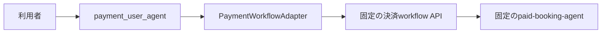
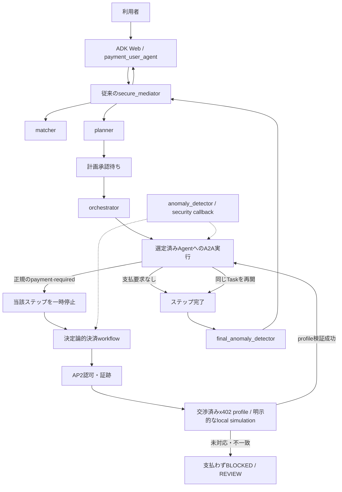
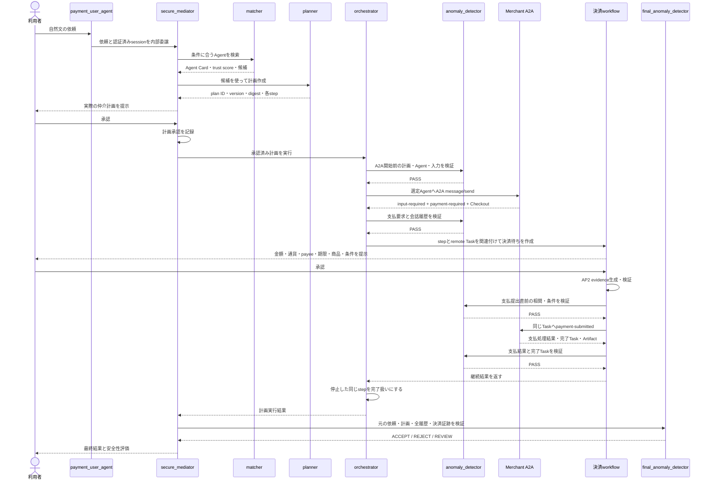
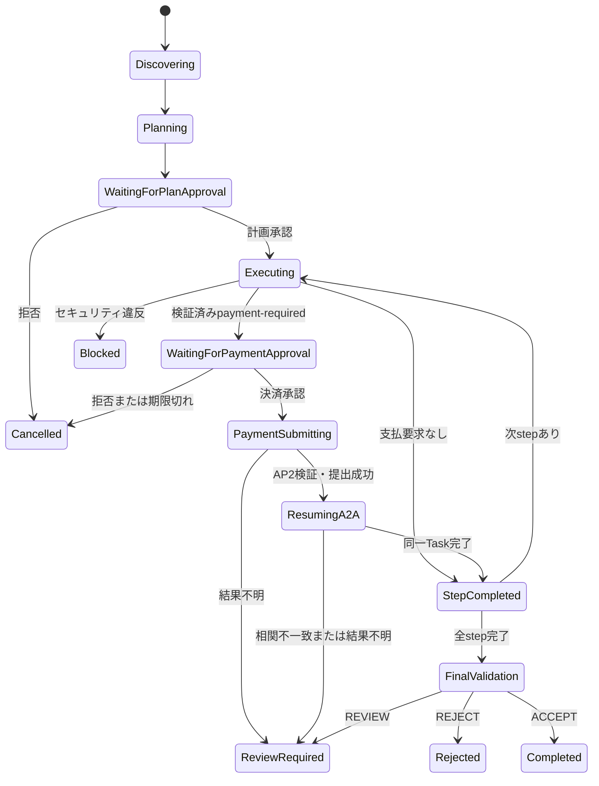

# 従来の仲介エージェントへの決済統合：修正要件・実装引継ぎ

- 文書の目的: 新しいCodexチャットへ、修正の背景、確定要件、実装方針、受入条件を漏れなく引き継ぐ
- 対象リポジトリ: `enterprise-a2a-pf`
- 対象ブランチ: `codex/ap2-x402-integration`
- 対象PR: `#25`
- 作成日: 2026-08-16（JST）
- 文書の位置づけ: 本修正における要件と受入条件の正本

## 0. 新しいチャットへの最初の指示

新しいチャットには、このファイルを添付またはリンクしたうえで、次のように指示する。

> `MEDIATOR_PAYMENT_INTEGRATION_HANDOFF.md`を正本として、現在の決済デモを「従来のsecure_mediatorを置き換える実装」から「従来のsecure_mediatorの通常のA2A実行中に、必要な場合だけ決済サブフローへ分岐し、同じ処理へ復帰する実装」へ修正してください。実装、テスト、実ブラウザ確認、独立レビュー、Cloud Run再デプロイ、通常PRの更新まで完了してください。文書の要件を自己判断で弱めず、相違があれば先に報告してください。

## 1. 最重要の訂正

現行実装を「従来の仲介エージェントへ決済を統合済み」と扱ってはいけない。

現行実装では、従来のLLMベースの`secure_mediator`ルートが、決済専用の決定論的`PaymentWorkflowAdapter`に置き換わっている。画面用の`payment_user_agent`も、そのadapterを直接呼んでいる。このため、従来の以下の処理は現在のデモ経路では実行されない。

- `matcher`によるエージェント検索と信頼度を考慮した選定
- `planner`による依頼ごとの実行計画作成
- `orchestrator`による通常のA2A実行
- 実行中の`anomaly_detector`
- 完了前の`final_anomaly_detector`

現在のレスポンスが不自然に速く見える主因も、これらの仲介処理を経由せず、固定内容の決済workflowを直接進めているためである。

したがって、現在のPRは決済基盤の実装成果を含むものの、ユーザーの中心要件である「従来の仲介エージェントへの統合」は未完了である。以下の修正と受入確認が終わるまで、統合完了・リリース完了とは判断しない。

## 2. ユーザーが求める最終状態

利用者は、従来どおり仲介エージェントへ自然文で依頼する。仲介エージェントは通常どおりエージェントを検索し、計画を作り、利用者の計画承認後にA2Aタスクを実行する。

そのA2A実行中にMerchant側から支払要求が返った場合だけ、当該ステップを一時停止して決済確認を表示する。利用者が決済を承認したら、AP2の認可・証跡を生成し、x402 extensionにできるだけ沿った形式で支払情報を同じA2Aタスクへ提出する。その後、停止した同じ仲介ステップを再開し、異常検知と最終検証を経て利用者へ結果を返す。

無料のエージェントや支払要求のないA2A処理は、決済サブフローを一切通さず、従来の仲介処理のまま完了する。

優先順位は次のとおりとする。

1. 従来の`secure_mediator`へ本当に統合されていること
2. AP2 Human Presentの認可モデルと証跡に準拠すること
3. A2A x402 extensionに、デモ環境で可能な範囲で準拠すること
4. 画面から迷わず短時間で実演できること

## 3. 用語と責務

| 用語 | この文書での意味 |
| --- | --- |
| `payment_user_agent` | ADK Webで利用者が選択する唯一の公開アプリ。表示名・入口であり、仲介判断や決済認可の正本ではない |
| `secure_mediator` | 従来の仲介ルート。`matcher`、`planner`、`orchestrator`、各異常検知を統括する |
| 決済workflow | 現在実装済みの決定論的な状態機械。承認、AP2証跡、Merchant通信、冪等性、再試行を担当する |
| Merchant A2A | 実際の業務タスクを処理し、必要なら`payment-required`を返す相手エージェント |
| 計画承認 | 仲介エージェントが作った実行計画を利用者が承認する第一の承認 |
| 決済承認 | Merchantから返った確定金額・通貨・payee・期限・条件を利用者が承認する第二の承認 |
| 継続情報 | 決済待ちで停止した仲介計画のステップと、同じA2Aタスクへ復帰するための相関情報 |

## 4. 現行実装の事実と不足

### 4.1 現行の呼出し経路

現在の経路は次のとおりである。



コード上の根拠:

- `payment_user_agent/agent.py`は`secure_mediation_agent.agent.PaymentWorkflowAdapter`を直接importして、`root_agent`として公開している。
- `secure_mediation_agent/agent.py`のルートは現在`PaymentWorkflowAdapter`であり、従来の`Agent(name="secure_mediator", ...)`ではない。
- `secure_mediation_agent/workflow/controller.py`は、初期計画で`paid-booking-agent`、`http://127.0.0.1:8005/a2a`、固定デモ商品を設定している。
- `secure_mediation_agent/agent.json`も、従来の仲介能力ではなく`secure_mediation_workflow`という決済workflowの説明へ置き換わっている。
- 従来のsubagentファイルは残っているが、現在の公開`root_agent`から接続されていない。

### 4.2 残すべき実装

現行の決済実装を廃棄してはならない。以下は仲介エージェント配下の決定論的決済エンジンとして再利用する。

- 計画承認と決済承認を分けた状態管理
- 完全一致`承認`を認可境界とする処理
- AP2 Intent／Checkout／Payment MandateとReceiptの生成・検証
- 署名対象、nonce、有効期限、金額、通貨、payeeの検証
- A2A Taskと支払メッセージの相関
- x402に似たwire shapeの検証
- 冪等性キー、compare-and-set、transactional outbox、再試行、reconciliation
- loopback Merchant A2Aサービスとローカルsimulation rail
- Firebase認証、公開経路制限、内部identity assertion

### 4.3 直すべき本質

決済workflowが仲介エージェント全体を置き換えている構造をやめる。決済workflowは、`orchestrator`がA2A実行中に支払要求を受けた場合だけ呼ぶ下位機能にする。

また、現行決済workflowが独自に固定計画を作って第一承認を要求する構造も変更する。第一承認は従来の`planner`が作った仲介計画に対する承認であり、決済workflowは承認済み仲介計画の識別子・digest・対象ステップを取り込んでAP2 Intent Mandateへ結び付ける。同じ内容の計画承認を二重に要求しない。

## 5. 目標アーキテクチャ



公開アプリの階層は次の不変条件を満たす。

- ADK Webのアプリ選択肢には`payment_user_agent`だけを表示する。
- `secure_mediator`は`payment_user_agent`から内部委譲される。
- `payment_user_agent`と`secure_mediator`を同じ公開階層の兄弟アプリにしない。
- デモURLを開き、Firebase認証を終えた時点で`payment_user_agent`が選択済みになっている。
- 利用者は画面でエージェントを選び直さず、プロンプト入力だけで開始できる。

実装方法は、`payment_user_agent`の配下に`secure_mediator`を内部subagentとして置く方法、または従来の仲介ルートをfactory化して`payment_user_agent`名の公開rootから同一構成を使う方法を許容する。ただし、単にファイルやパッケージを同じ場所に置くだけでは統合と認めない。実行traceで従来の各subagentを通ったことを証明できなければならない。

## 6. 正常系の詳細な挙動



重要な動作ルール:

- Merchantへ最初に連絡するのは、従来の計画承認後である。
- 支払要否は、固定フラグではなく、選定したAgentのA2A応答から実行時に判断する。
- `payment-required`は自由文ではなく、A2A Task stateと正規化済みmetadata／extensionを検証して判定する。
- 決済待ちになった`orchestrator`のstepは失敗でも完了でもなく、明示的な`waiting_for_payment_approval`相当になる。
- 決済承認後は、新しい無関係なTaskを作らず、保存した`taskId`、`contextId`、`orderId`を使って同じ処理へ戻る。
- 支払要求のない応答では決済workflowを作らない。
- 人為的な待ち時間を追加して遅く見せない。代わりに画面または監査表示で、各処理段階、呼出し先、時刻を確認できるようにする。
- `anomaly_detector`は外部A2A呼出しと決済境界の前後で実際に起動し、その判定をtraceへ残す。図に存在するだけでは受入としない。

## 7. 機能要件

### FR-001 従来の仲介ルートを復元する

- 置換前の`secure_mediation_agent/agent.py`に存在した`secure_mediator`の責務を復元する。
- `matcher`、`planner`、`orchestrator`、`anomaly_detector`、`final_anomaly_detector`を実際の実行グラフへ再接続する。
- 置換前コードは`git show dbd88af^:secure_mediation_agent/agent.py`で確認できる。
- ただし、古いファイルをそのままcheckoutして現在の決済実装を上書きしてはならない。差分を理解して統合する。

### FR-002 公開アプリを一つにする

- 公開されるADKアプリは`payment_user_agent`だけとする。
- `secure_mediator`および決済workflowは内部コンポーネントとして扱う。
- 認証後のURLに`app=payment_user_agent`を指定し、選択済み状態を維持する。
- Trusted Agent Storeの管理UIなど、別用途の画面をこの決済デモserviceから外部公開しない。内部matcherが必要とするstore APIはloopbackの内部通信で利用する。

### FR-003 エージェント選定と計画を固定値から外す

- 最初の計画は`matcher`と`planner`の結果から作る。
- `paid-booking-agent`や固定商品をcontroller内で無条件に選ぶ実装を、通常の仲介経路から外す。
- デモシナリオで最終的に`paid-booking-agent`が選ばれることはよいが、検索・選定結果として決まらなければならない。
- Agent Card、endpoint、skill、trust scoreを計画stepへ保存する。
- matcher出力のregistry Agent ID、Agent Card digest、RPC endpoint、skill、trust scoreをplannerの同一stepへ引き継ぎ、orchestratorがその値を実際のHTTP送信先とcapability制約に使う。
- traceへagent名を出すだけでは不十分とする。matcher出力、plan step、送信先HTTP requestを相関IDとdigestで機械的に突合できなければならない。

### FR-004 計画承認を強制する

- `orchestrator`開始前に、対象plan ID、version、digestに対する承認が存在することをコードで検証する。
- LLMの会話上の判断だけで承認済みにしない。
- 計画承認も単一text partの完全一致`承認`を認可境界とし、`はい`、`OK`、`承認します`などを自動承認として扱わない。
- 計画変更時は従来どおり再承認を要求する。
- 計画承認前にMerchant Task、Checkout、支払、外部副作用を開始しない。

### FR-005 A2A応答から支払要否を判定する

- `orchestrator`が選定Agentを通常どおり呼び出す。
- A2A Taskが`input-required`等の許容状態で、検証済みのpayment extensionが`payment-required`を示す場合のみ決済へ分岐する。
- 自由文に「支払いが必要」と含まれるだけでは決済分岐しない。
- Agent Cardが表明した決済能力と、実際の応答extensionの整合を検証する。
- 未知のprofile、壊れたmetadata、無効な金額、通貨不一致、payee不一致はfail closedとする。

### FR-006 仲介stepを停止・継続できるようにする

- `legacy_plan_id`、`legacy_step_id`、remote `taskId`、`contextId`、`orderId`、選定Agent、決済workflow IDを一つの継続レコードに保存する。
- 決済待ちのままADKの一回の実行を長時間ブロックしない。状態を保存して利用者へ返し、次のターンで再開する。
- 同一session内の別依頼や別stepの承認を誤って適用しない。
- 再開時は保存済みの同一stepと同一remote Taskを検証する。

### FR-007 決済承認を計画承認と分離する

- 計画承認を決済承認として流用しない。
- Merchantから得た確定商品、正確な金額、通貨、payee、期限、支払方式を提示する。
- 現行方針どおり、決済認可は単一text partの完全一致`承認`だけを受け付ける。
- 決済承認前にCredential発行、Payment Mandate発行、支払提出、settlementを行わない。
- 拒否、期限切れ、内容変更時は支払わず、仲介stepへ明確な中断理由を返す。

### FR-008 AP2証跡を仲介計画へ結び付ける

- 従来の計画承認をAP2 Intent Mandateの入力として取り込む。
- Intent／Checkout／Payment MandateとReceiptに、少なくとも次を相関できるようにする。
  - 認証済み利用者subject、tenant、session
  - 仲介plan ID、version、digest
  - 仲介step ID
  - 選定Agent ID、Agent Card digest、skill ID、endpoint
  - remote context ID、task ID、order ID、quote ID
  - 商品、金額、通貨、payee、期限
  - 計画承認ID、決済承認ID、nonce、発行時刻
- 計画承認をもう一度利用者へ提示する二重承認は行わない。
- 閉じたCheckout条件が変われば、決済承認を失効させて再承認する。

### FR-009 同じA2A Taskへ支払を提出する

- 支払提出は保存済みremote Taskに対する後続`message/send`として行う。
- 初回のTask開始は一回だけであることを保証し、支払後に新規Task開始requestを作らない。
- signed capabilityと必要なextension header／metadataを付ける。
- Merchantの結果が元の`contextId`、`taskId`、`orderId`、`quoteId`、`legacy_step_id`、payment workflowへ一致することを検証する。
- `legacy_step_id`の状態が、同一record上で実行中、決済承認待ち、再開中、完了へ遷移したことを記録する。
- 成功時のみ仲介stepを完了へ進める。

### FR-010 セキュリティ検証を迂回しない

- 従来のA2A前後のsecurity callbackと異常検知を維持する。
- `anomaly_detector`を、少なくとも外部A2A開始前、payment-required受領後、支払提出前、支払結果受領後に実際に呼び出し、plan逸脱・prompt injection・相関不一致を判定する。
- `anomaly_detector`が`BLOCK`を返した場合は、その後のA2Aまたは決済副作用を実行しない。`REVIEW`の場合も自動継続せず、人手確認可能な停止状態にする。
- 決済分岐前、支払提出前、結果受領後にも決定論的検証を行う。
- Agentから返ったプロンプト、URL、支払条件を無条件に信頼しない。
- 秘密鍵、Credentialの秘密情報、完全なPayment Mandate、署名原文をLLMのpromptや画面へ渡さない。
- LLMは「支払ってよい」という最終権限を持たない。権限判定はworkflow側で行う。

### FR-011 最終異常検知を必須にする

- 無料・有料のどちらでも、全step完了後に`final_anomaly_detector`を実行する。
- 元の利用者依頼、承認済み計画、全A2A履歴、決済の要約、仲介結果を入力にする。
- `ACCEPT`、`REJECT`、`REVIEW`の判断前に利用者へ最終成功を返さない。

### FR-012 無料処理を壊さない

- 支払要求がない場合、従来と同じ仲介フローで完了する。
- 無料経路で決済承認、AP2 Payment Mandate、payment workflow recordを作らない。
- 複数stepの一部だけが有料の場合、該当stepだけ決済待ちにする。

### FR-013 冪等性・再試行・競合を維持する

- 同じ承認の再送で二重支払を起こさない。
- 同じCloud Run instance内でworkflow API、worker、Merchant等の子processだけが再起動した場合は、instance内SQLiteとoutboxからreconciliationする。
- Cloud Run instance自体の置換、scale down、revision更新では書込みfilesystemが失われてよい。これは正式なephemeral仕様とする。
- 本デモのためにCloud SQLや外部DBを追加しない。
- 状態消失時は、成功したように推測せず「デモ状態が失われたため再実行が必要」と明示する。
- 同一stepへの並行承認は一つだけ成功させる。

### FR-014 画面で仲介経路を確認できるようにする

- 利用者が少なくとも次の段階を識別できる表示にする。
  - 依頼受付
  - Agent検索
  - 計画作成
  - 計画承認待ち
  - A2A実行
  - 支払要求受領
  - 決済承認待ち
  - AP2認可・支払提出
  - A2A再開・完了
  - 最終異常検知
- 各段階にagent名、plan／step／taskの短縮ID、時刻または順序番号を表示できるようにする。
- 見せかけの遅延は入れない。実際のtraceを表示する。
- 画面へ秘密情報やBearer tokenを表示しない。

### FR-015 デモの運用境界を守る

- デモは単一Cloud Runサービス内のloopback構成を維持してよい。
- 状態は一時的でよく、再起動で消えてよい。
- Cloud SQLを追加・変更しない。
- 更新してよい既存サービスは、専用の`payment-user-agent-demo`だけである。それ以外のCloud Runサービスを変更しない。
- 公開するのはFirebase認証後のUIと必要な同一origin APIだけに限定する。

## 8. 非機能・セキュリティ要件

### 8.1 認証と主体の結合

- Firebaseで認証した利用者subjectを、ADK session、仲介plan、決済workflow、AP2 evidenceへ一貫して結び付ける。
- query parameterの`userId`だけを認証根拠にしない。
- 内部APIは信頼されたidentity assertionを検証し、外部からの直接呼出しを拒否する。
- 別利用者・別sessionのworkflow IDを指定しても閲覧・承認・再開できない。

### 8.2 支払条件の検証

- 金額は正の整数最小単位で扱い、浮動小数点で比較しない。
- 通貨、network、asset、payee、scheme、期限をallowlistと契約条件で検証する。
- 計画上限を超える価格は支払わず、計画変更または拒否として扱う。
- quoteやCheckoutが変化したら以前の決済承認を無効にする。

### 8.3 A2A接続の防御

- Agent URLはmatcherで検証済みのものだけを使う。
- SSRF対策、redirect制限、timeout、response size制限、許可schemeを維持する。
- Agent Card digestと実行時endpointの差し替えを検出する。
- `agent_card_url`と`rpc_endpoint`を別フィールドとして扱う。RPCの`/a2a`へ`/.well-known/agent-card.json`を文字列連結するなど、片方から他方を誤って生成しない。
- signed capabilityはplan／step／agent／操作／期限へ限定する。

### 8.4 秘密情報の扱い

- 秘密鍵、署名用seed、Firebase service credentialをリポジトリへcommitしない。
- ログ、trace、UI、LLM入力ではtoken・credential・署名原文をredactする。
- `.env`はローカル実行に使用できるが、PRへ含めない。

### 8.5 障害時の原則

- 検証できない場合はfail closedとする。
- timeout後に「支払失敗」と即断せず、まず既存の冪等性キーとremote Taskを照合する。
- Merchant成功後に仲介側更新へ失敗した場合はreconciliationで同じTaskを回復する。
- 最終状態が不明な場合は二重支払を避け、利用者へ`REVIEW`を返す。

### 8.6 AP2とA2A x402の適合判定

- AP2を第一優先とし、Human PresentのIntent、closed Checkout、Payment Mandate、Credential、Receiptの発行者・署名・対象・有効期限・相関を検証する。
- AP2証跡は後からoffline verificationできる形式を維持する。
- A2A x402は、リポジトリが固定しているversionとprofileに対してfield名、Task state、要求・提出・結果の相関を可能な限り合わせる。
- 公式profile、wallet、facilitator、network、assetがない状態では「公式準拠」「settled on-chain」と表示しない。
- 支払transportの選択順序は、(1) Agent Cardと実行環境の双方が対応し、必要なwallet／facilitator等を検証できる公式profile、(2) このデモMerchantに限定した`x402-wire-simulation/1`の順とする。後者は必ず`simulation`かつ`NOT CONFORMANT`と表示する。
- x402 profileが未表明、未知、不一致、または検証失敗の場合、AP2承認だけを根拠に別形式で支払うsilent fallbackを禁止する。支払を行わず`BLOCKED`または`REVIEW`へ進める。
- x402形式の生成・提出に失敗した場合も、直接railを呼んで迂回しない。同じ冪等性キーで安全に再試行できない限り停止する。
- 実装後、`docs/payments/AP2.md`、`docs/payments/A2A_X402.md`、`docs/ap2_x402_conformance_report.json`を更新し、各要件を`PASS`、`PARTIAL`、`NOT RUN`、`NOT CONFORMANT`のいずれかで根拠付き評価する。
- 実装中に公式仕様のversionや必須fieldが更新されている可能性があるため、リリース前に一次資料で再確認する。versionを暗黙に変更せず、更新する場合は互換性差分を文書化する。

## 9. 推奨実装構成

実際のファイル名は既存構成との整合で調整してよいが、責務は分離する。

### 9.1 ルートとadapter

- `secure_mediation_agent/agent.py`
  - 従来の`secure_mediator`ルートとsubagent構成を復元する。
  - 決済専用adapterをこのファイルのルートにしない。
- `secure_mediation_agent/payment_adapter.py`または`payment_user_agent/adapter.py`
  - 現在の`PaymentWorkflowAdapter`相当を移動する。
  - 決済状態の表示・承認受付という限定責務にする。
- `payment_user_agent/agent.py`
  - 公開rootを定義する。
  - 通常時は内部`secure_mediator`へ委譲し、保留中の承認がある場合だけ該当する承認handlerへ決定論的にrouteする。

承認routeの優先順位は明示する。

1. sessionに`waiting_for_payment_approval`が一件だけある場合は決済承認として扱う。
2. sessionに`waiting_for_plan_approval`がある場合は計画承認として扱う。
3. それ以外は新しい通常依頼として`secure_mediator`へ渡す。
4. 複数の保留対象があり曖昧な場合は承認せず、対象を提示して選び直させる。

### 9.2 決済bridge

`secure_mediation_agent/payment_bridge.py`または`secure_mediation_agent/subagents/payment_tools.py`を追加し、少なくとも次の操作を決定論的に提供する。

- `detect_payment_requirement(a2a_task, agent_card, approved_step)`
- `attach_approved_plan(...)`
- `create_payment_continuation(...)`
- `render_payment_approval(...)`
- `approve_and_submit_payment(...)`
- `resume_paid_step(...)`
- `get_payment_status(...)`

LLM toolに生の秘密情報を返さない。戻り値は状態、相関ID、画面表示用の安全な要約に限定する。

### 9.3 `orchestrator`の拡張

`secure_mediation_agent/subagents/orchestration_agent.py`のA2A呼出しを拡張する。

- 現状の`invoke_a2a_agent`は応答textを集めて完了結果として返すため、構造化されたTask stateとmetadataを保持して返せるようにする。
- `payment-required`を検出した場合、`execute_plan_step`を`completed`にしない。
- `status=waiting_for_payment_approval`とcontinuation IDを返す。
- 次ターンの再開で、支払提出後のTask結果を同じstepのoutputとして取り込む。
- A2Aの全会話履歴を既存のsecurity callbackと最終異常検知へ渡す。

ADKの`RemoteA2aAgent`が必要なTask metadataを欠落させる場合は、A2A SDKまたは既存`merchant/client.py`のHTTP clientを用いた構造化経路へ切り替えてよい。ただし、通常の仲介stepが選定AgentへA2Aで到達したという性質を維持する。

### 9.4 決済workflowの入力変更

`secure_mediation_agent/workflow/controller.py`の新規workflow生成を、固定デモ計画から「承認済み仲介stepへattachする」APIへ拡張する。

必要な入力例:

```json
{
  "authenticatedSubject": "firebase-subject",
  "mediationSessionId": "...",
  "legacyPlan": {
    "planId": "...",
    "version": 1,
    "digest": "sha256:...",
    "approvalId": "..."
  },
  "step": {
    "stepId": "...",
    "agentId": "paid-booking-agent",
    "agentCardDigest": "sha256:...",
    "agentCardUrl": "http://127.0.0.1:8005/.well-known/agent-card.json",
    "rpcEndpoint": "http://127.0.0.1:8005/a2a",
    "skillId": "...",
    "maxAmount": {"currency": "JPY", "valueMinor": 5000}
  },
  "remoteTask": {
    "contextId": "...",
    "taskId": "...",
    "orderId": "...",
    "quoteId": "..."
  },
  "paymentRequirement": {}
}
```

固定デモ用の`create(goal, paymentRequired=true)`は、単体デモ・テストfixtureとして残してもよいが、公開`payment_user_agent`の通常経路からは呼ばない。

### 9.5 継続レコード

最低限、以下の値を保存する。

| 分類 | 必須項目 |
| --- | --- |
| 主体 | `subject`、`tenant_id`、`adk_session_id`、`mediation_session_id` |
| 仲介計画 | `legacy_plan_id`、`plan_version`、`plan_digest`、`plan_approval_id`、`legacy_step_id` |
| 選定Agent | `agent_id`、`agent_card_digest`、`agent_card_url`、`rpc_endpoint`、`skill_id`、`trust_score` |
| A2A | `context_id`、`task_id`、`order_id`、`quote_id`、直近Task state |
| 決済 | `payment_workflow_id`、`payment_approval_id`、支払状態、冪等性キー |
| 制御 | `continuation_id`、状態、version、作成／更新／期限時刻 |

デモではSQLite等の一時ストレージを使ってよい。外部永続DBは不要である。

### 9.6 Agent・skill識別子の正規化

現在は同じデモMerchantを指す識別子に揺れがある。実装前に、次のような型付きmappingを一箇所で定義し、文字列の暗黙変換を禁止する。

| 意味 | 現在確認できる値 |
| --- | --- |
| trusted registryのAgent ID | `agent-005` |
| trusted registry／Agent Card上の名前 | `paid_booking_agent` |
| service slug／ログ表示 | `paid-booking-agent` |
| trusted registryのskill ID | `paid_booking` |
| A2A Agent Card／workflowのskill ID | `paid-booking` |
| 商品ID | `demo-paid-booking` |

推奨する扱い:

- セキュリティ上の主体はtrusted registryの不変な`agent-005`をcanonical IDとする。
- A2A Taskには実際のAgent Cardが表明するnameとskill IDを使う。
- `agent_card_url`はAgent Card取得用の完全URL、`rpc_endpoint`はA2A `message/send`用の完全URLとして別々に保存する。現在の旧`orchestrator`のように、RPC URLへ`/.well-known/agent-card.json`を付加してはならない。
- registry recordとAgent Cardの対応を、endpoint、card digest、許可されたalias mappingで検証する。
- plan、continuation、AP2 evidenceにはcanonical IDと実際のA2A識別子を両方保存する。
- 未登録alias、skillの食い違い、endpoint差し替えを拒否する。
- 可能なら将来の混乱を防ぐため識別子を統一する。ただし既存互換性を壊す場合は、明示mappingとmigration testを優先する。

### 9.7 Agent Card

- `secure_mediation_agent/agent.json`を従来の仲介能力へ戻すか、従来能力に決済対応を追加する。
- `secure_mediation_workflow`へ全面置換した説明のままにしない。
- MerchantのAgent Cardは、支払対応profile、skill、endpointを機械判定できる形で表明する。
- デモ固有のx402 wire simulationは、公式準拠と誤認されない表記を維持する。

## 10. 状態遷移

仲介と決済を一つの巨大な状態機械に混ぜず、仲介stepが決済サブフローを参照する構造にする。



禁止する遷移:

- `WaitingForPlanApproval`から直接`PaymentSubmitting`
- `Executing`から利用者承認なしで`PaymentSubmitting`
- `WaitingForPaymentApproval`から新しい無関係なA2A Taskの作成
- `StepCompleted`から`FinalValidation`を飛ばして`Completed`
- free stepでのPayment Mandate生成

## 11. 受入シナリオ

### AC-001 有料タスクの正常系

1. 利用者がデモプロンプトを入力する。
2. traceに`secure_mediator`、`matcher`、`planner`が順番に現れる。
3. 固定文ではなく、plannerが作った計画が提示される。
4. matcherのAgent ID、Agent Card digest、endpoint、skill、trust scoreがplan stepと一致し、そのRPC endpointへ実際のHTTP requestが一回送られる。
5. 計画承認前はMerchantへのA2A呼出しがない。
6. 計画承認後、`orchestrator`が選定MerchantへA2A呼出しを行う。
7. 外部呼出し前後に`anomaly_detector`が実際に起動し、許可判定がtraceへ残る。
8. Merchantが`payment-required`を返す。
9. 同じstepが決済待ちとなり、正確な支払条件が表示される。
10. 決済承認前は支払副作用がない。
11. 決済承認後、支払提出前にも`anomaly_detector`と決定論的検証を通る。
12. AP2 evidenceと、交渉済みprofileに従うsimulation settlementを生成する。
13. 同じremote `contextId`、`taskId`、`orderId`、`quoteId`への後続`message/send`として支払を提出し、同じ`legacy_step_id`を再開する。Task開始requestは合計一回である。
14. 支払結果受領後にも`anomaly_detector`が実行される。
15. `final_anomaly_detector`が実行される。
16. 最終結果、短縮した相関ID、安全性評価が画面に出る。

### AC-002 無料タスク

- `matcher`、`planner`、計画承認、`orchestrator`、A2A前後の`anomaly_detector`、最終異常検知を通る。
- matcher出力とplan step、実HTTP送信先が一致する。
- Merchantが支払要求を返さなければ決済画面を出さない。
- Payment Mandate、payment workflow、settlement recordが作られない。

### AC-003 計画拒否

- MerchantへのA2A呼出し、Checkout、支払関連recordが一切作られない。

### AC-004 決済拒否

- 計画は承認済みでも、Payment Mandate、支払提出、settlementは行われない。
- 対象stepは中断またはキャンセルとして仲介結果へ反映される。

### AC-005 価格変更・期限切れ

- quote金額、通貨、payee、期限のいずれかが変われば以前の決済承認を使わない。
- 新条件を表示して再承認するか、安全に中断する。

### AC-006 replay・並行承認

- 同じ`承認`を連打または再送してもsettlementは一回だけである。
- 異なるsessionやsubjectから同じcontinuationを承認できない。

### AC-007 Merchant障害

- timeout時に二重Task・二重支払を作らない。
- 同じ冪等性キーとTaskを照合し、回復できなければ`REVIEW`を返す。

### AC-008 悪意あるA2A応答

- 自由文だけの支払指示、外部URLへの誘導、plan外Agent、上限超過、壊れたextensionを拒否する。
- 異常検知を迂回して決済へ進めない。

### AC-009 最終異常検知

- 有料・無料を問わず、`final_anomaly_detector`未実行なら最終成功を返さない。

### AC-010 UI階層と認証

- デモURLを未認証で開くとFirebase認証へ移る。
- 認証後、`payment_user_agent`選択済みのADK Webが開く。
- `secure_mediator`を利用者が選択する必要がない。
- 公開app一覧に内部決済workflowを出さない。

### AC-011 再起動

- 同じinstance内の子process再起動ではreconciliationを試みる。
- Cloud Run instance置換またはrevision更新ではデモ状態が消えてよい。
- 消失後に古いworkflowを成功扱いせず、再実行案内を返す。
- Cloud SQLを利用していないことを確認する。

### AC-012 x402 profileの分岐

- Agent Cardとruntimeが公式profileの必要条件を満たす場合だけ、その公式profileを選択する。
- デモMerchantでは明示された`x402-wire-simulation/1`を選び、UIと証跡が`simulation`、`NOT CONFORMANT`を示す。
- x402未表明または対応profileなしの場合は`PAYMENT_PROFILE_UNAVAILABLE`として、AP2 Payment Mandateや支払副作用を作らず安全に停止する。
- Agentが対応を表明したのにextensionが壊れている、または内容が不一致の場合は`PAYMENT_PROFILE_INVALID`としてセキュリティ上の`BLOCKED`にする。
- いずれの場合もAP2-onlyや直接railへsilent fallbackしない。

### AC-013 公開HTTP境界

- `/list-apps`または同等のADK app一覧は`payment_user_agent`だけを返す。
- 未認証のUI、WebSocket、同一origin APIアクセスはFirebase認証へ誘導または401／403で拒否する。
- Trusted Agent Storeの別UIである`/store/`と`/store/sse/`は、この決済デモserviceでは外部から404にする。
- Trusted Agent Storeの`/api/`、`/ws/`、`/store/health`は外部から404にし、matcherはcontainer内loopback endpointを使う。
- デモで外部公開を必要としない`/a2a/`も404にし、Merchant A2Aはcontainer内loopback endpointだけで利用する。
- 外部から送られた`X-Verified-Identity`等の内部identity headerは破棄し、認証proxyが検証後に生成した値だけを上流へ渡す。
- `/v1`、`/internal`、workflow API、Merchant API、identity brokerへ外部から直接到達できない。

## 12. テスト要件

### 12.1 unit test

- payment-requiredの構造化判定と偽陽性防止
- 仲介plan／step／Agent Card／remote Task／payment workflowの相関検証
- 計画承認と決済承認の分離
- 完全一致`承認`
- 金額上限、通貨、payee、期限、quote変更
- session／subjectの分離
- continuationの状態遷移とcompare-and-set
- replay、並行承認、冪等性
- secret redaction

### 12.2 integration test

- 本物の`secure_mediator`構成で`matcher`から最終異常検知まで実行する。
- loopback Merchantへ実際のA2A HTTP `message/send`を行う。
- 最初の応答で`payment-required`を受け、同一Taskへ支払を提出する。
- 有料経路と無料経路の両方を通す。
- test doubleだけで「仲介統合済み」としない。
- matcherの出力値がplannerのstepへ入り、その値が実際のHTTP request URL、Agent Card digest、capabilityへ使われたことをassertする。trace labelだけのテストを禁止する。
- 有料経路ではTask開始requestが一回だけであり、支払後は同じ`contextId`、`taskId`、`orderId`、`quoteId`への後続messageであることをassertする。
- traceまたはevent履歴で次の実行を機械的にassertする。
  - `matcher`
  - `planner`
  - 計画承認gate
  - `orchestrator`
  - Merchant A2A
  - 外部A2A・決済境界前後の`anomaly_detector`
  - 決済workflow（有料時のみ）
  - `final_anomaly_detector`

### 12.3 regression test

- 既存の決済、AP2、A2A、security、restart、outbox、reconciliationテストを維持する。
- 従来の仲介エージェントの主要テストを復活または追加する。
- `tests/security/test_release_boundaries.py`など、旧構造を前提に`root_agent`不在を要求するテストは、正しい新要件に合わせて更新する。単に削除しない。

### 12.4 実ブラウザ試験

ローカルcontainerとCloud Runの両方で、実際のブラウザから次を確認する。

1. Firebase認証
2. `payment_user_agent`自動選択
3. デモプロンプト投入
4. 仲介段階の表示
5. 第一の`承認`
6. Merchant A2A後の決済条件表示
7. 第二の`承認`
8. 同一Task再開、完了、最終異常検知
9. ページ再読込後の安全な表示
10. token、秘密鍵、内部credentialが画面やnetwork responseへ露出していないこと

### 12.5 公開境界のblack-box test

- 未認証のHTTPとWebSocketを拒否する。
- `/list-apps`に内部agentが出ない。
- 偽造した内部identity headerで認証を迂回できない。
- `/store/`、`/store/sse/`、`/store/health`、`/api/`、`/ws/`、`/a2a/`、`/v1`、`/internal`、Merchant、workflow、identity brokerが外部から404になる。
- 認証済みUIから必要なsame-origin routeだけが成功する。

## 13. デモプロンプト

現行の正式なデモ手順とプロンプトは`docs/payments/DEMO.md`を正本とする。

修正後のプロンプトは、固定決済workflowへ直接命令する文ではなく、通常の仲介依頼として解釈できる自然文にする。例:

> 東京で利用できる有料のデモ予約サービスを探して、条件を確認したうえで予約してください。合計5,000円を超える場合は進めないでください。

実際のAgent Cardやデモ商品に合わせて文言を調整し、`DEMO.md`を更新する。画面上では、計画承認と決済承認が別物であることを明記する。

## 14. 変更対象の目安

必ず確認するファイル:

- `payment_user_agent/agent.py`
- `secure_mediation_agent/agent.py`
- `secure_mediation_agent/agent.json`
- `secure_mediation_agent/subagents/matching_agent.py`
- `secure_mediation_agent/subagents/planning_agent.py`
- `secure_mediation_agent/subagents/orchestration_agent.py`
- `secure_mediation_agent/subagents/anomaly_detection_agent.py`
- `secure_mediation_agent/subagents/final_anomaly_detection_agent.py`
- `secure_mediation_agent/workflow/controller.py`
- `secure_mediation_agent/workflow/models.py`
- `secure_mediation_agent/workflow/repository.py`
- `secure_mediation_agent/workflow/client.py`
- `secure_mediation_agent/merchant/client.py`
- `secure_mediation_agent/merchant/service.py`
- `secure_mediation_agent/payment_profiles/`
- `trusted_agent_store/data/agents/registered-agents.json`
- `deploy/supervisord.conf`
- `deploy/nginx.conf`
- `deploy/build-payment-demo-candidate.sh`
- `deploy/push-payment-demo-candidate.sh`
- `deploy/deploy-payment-demo-cloudrun.sh`
- `tests/`
- `docs/payments/`

無関係な機能、`payment-user-agent-demo`以外の既存Cloud Runサービス、Cloud SQL、別プロジェクトのリソースは変更しない。

現行`deploy/deploy-payment-demo-cloudrun.sh`は「新規サービス作成専用」であり、`payment-user-agent-demo`が既に存在するとexit 3で停止する。このスクリプトをそのまま再デプロイに使う手順は実行不能である。実装時は次のいずれかを行う。

- 推奨: 既存の新規作成専用scriptは保ち、固定されたproject／region／serviceだけを新revisionへ更新できる`deploy/update-payment-demo-cloudrun.sh`を追加する。
- 代替: createとupdateを明示modeで分け、引数なしで曖昧な更新が起きないよう現行scriptを改修する。

更新scriptにも、immutable image digest、candidate artifact、registry digest、対象serviceの完全一致、更新後revision image、traffic、ephemeral envを検証するfail-closed guardを設ける。任意service名を外部引数で受け取らない。

## 15. 実装順序

1. 現行ブランチ、PR、worktreeの差分を確認し、ユーザー変更を保護する。
2. 置換前の`secure_mediator`と現行subagentの動作をテストで再現する。
3. 公開rootと内部仲介rootの構成を決め、`matcher`から最終異常検知までのtraceテストを先に作る。
4. 現行`PaymentWorkflowAdapter`をルートから分離する。
5. `orchestrator`が構造化A2A Taskを保持し、payment-requiredを返せるようにする。
6. 承認済み仲介planへ決済workflowをattachするAPIと継続レコードを実装する。
7. 第二承認後に同じA2A Taskへ支払提出し、同じstepを再開する。
8. 無料、拒否、期限切れ、replay、障害、悪意ある応答を実装・テストする。
9. 日本語ドキュメントを新しい実装事実に合わせて更新する。
10. 全自動テスト、独立コードレビュー、独立テストを実施する。
11. ローカルcontainerを起動して実ブラウザ試験を行う。
12. `linux/amd64` imageをbuildし、安全なupdate専用scriptで既存の専用Cloud Runサービスへ新revisionとしてdeployする。
13. Cloud Run URLでFirebase認証から最後まで実ブラウザ試験を行う。
14. PRをdraftではない通常PRとして更新し、証跡と既知課題を記載する。

## 16. リリース条件

次をすべて満たしたときだけリリース完了とする。

- [ ] 公開UIから実際に従来の`secure_mediator`を通る
- [ ] `matcher`、`planner`、計画承認、`orchestrator`がtraceで確認できる
- [ ] 外部A2A・決済境界前後の`anomaly_detector`実呼出しがtraceで確認できる
- [ ] 支払要否がA2A実行時に分岐する
- [ ] matcher出力、plan step、実HTTP送信先がID・digest・endpoint・skillで一致する
- [ ] 有料時だけ決済workflowへ入る
- [ ] 計画承認と決済承認が別の証跡である
- [ ] AP2証跡が仲介plan／step／remote Taskへ結合されている
- [ ] 同じA2A Taskへ支払を提出して同じstepへ戻る
- [ ] Task開始は一回だけで、`contextId`、`taskId`、`orderId`、`quoteId`が連続している
- [ ] `final_anomaly_detector`を通る
- [ ] 無料経路が回帰していない
- [ ] unit／integration／security／restartテストが成功する
- [ ] 独立コードレビューの重大指摘が解消済みである
- [ ] ローカルcontainerで実ブラウザ試験が成功する
- [ ] Cloud RunでFirebase認証を含む実ブラウザ試験が成功する
- [ ] `payment_user_agent`が認証後に選択済みである
- [ ] 公開app一覧、HTTP、WebSocket、identity headerのblack-box security testが成功する
- [ ] Cloud SQLを追加していない
- [ ] `payment-user-agent-demo`以外の既存Cloud Runサービスを変更していない
- [ ] 新規作成専用scriptを誤用せず、固定対象のupdate手順で新revisionを反映した
- [ ] 日本語ドキュメントとデモプロンプトが実装に一致する
- [ ] PRが通常PRであり、テスト証跡と既知課題が記載されている

## 17. デプロイ前後の扱い

現在のデモ環境:

- GCP project: `gen-lang-client-0585901015`
- region: `asia-northeast1`
- Cloud Run service: `payment-user-agent-demo`
- URL: `https://payment-user-agent-demo-343404053218.asia-northeast1.run.app`
- 現在確認済みrevision: `payment-user-agent-demo-00002-nt7`
- 現在確認済みimage digest: `sha256:a22c3e696299c3c73dcf2391cba3df16c4e95c9333e72ad3ed8c0a19851a38bc`

上記revisionは現行の「決済workflow直接実行版」であり、本修正の完成証跡ではない。修正後は新しいimmutable image digestとrevisionを記録する。

デプロイ時の原則:

- 同じ専用サービスを新revisionへ更新する。現行の新規作成専用`deploy-payment-demo-cloudrun.sh`は既存サービスを拒否するため、そのまま使わない。
- 固定対象だけを更新できるfail-closedなupdate専用scriptを追加・テストして使う。
- Firebase認証設定と認証後redirectを維持する。
- 一時ストレージ前提を維持し、Cloud SQLを追加しない。
- Merchant、workflow API、workerは必要に応じて同一container内loopback processとしてよい。
- `payment-user-agent-demo`以外のCloud Runサービスの設定、revision、trafficは変更しない。
- `secure_mediator`が必要とするGemini認証・設定を、既存envまたはSecret Managerから安全に渡す。
- credentialをcommand output、PR、ドキュメントへ記載しない。

## 18. 既知の範囲外事項

今回のリリースでは、以下を今後の課題としてよい。ただし、未実装であることを文書とPRに明記する。

- 公式A2A x402 profileとの完全な相互運用
- wallet／facilitator／実network／実asset／on-chain settlement
- production向けKMS／HSM、KYC／AML、PCI／SCA
- 複数Cloud Run instance間の永続状態共有
- 長期保管する監査DB
- Human Not Presentや自律購入
- すべてのMerchant・通貨・決済方式の一般化

ただし、これらを理由に、従来仲介ルートの実経由、二段階承認、同一A2A Taskの再開、AP2相関、最終異常検知を省略してはならない。

## 19. 現在主張してよいこと・いけないこと

現時点で主張してよいこと:

- 決定論的な二段階承認とAP2 Human Present demoの基盤がある。
- A2A Task上のpayment-required／payment-submittedに似たwire shapeをローカルsimulationで検証している。
- Firebase認証付きCloud Runデモが起動し、固定決済workflow単体はブラウザで動いた。

現時点で主張してはいけないこと:

- 従来の`secure_mediator`へ決済統合が完了した。
- `matcher`、`planner`、`orchestrator`、各異常検知を通っている。
- 公式A2A x402準拠または実資産決済である。
- 現在のCloud Run revisionが本書の受入条件を満たす。

## 20. 作業開始時の確認コマンド

新しいチャットでは、少なくとも次を確認してから編集する。

```bash
git status --short --branch
git log --oneline --decorate -20
git diff origin/main...HEAD -- secure_mediation_agent payment_user_agent tests docs deploy
git show dbd88af^:secure_mediation_agent/agent.py
rg -n "PaymentWorkflowAdapter|root_agent|secure_mediator|paid-booking-agent|payment-required|RemoteA2aAgent" secure_mediation_agent payment_user_agent tests docs
```

ローカルに未commit変更がある場合は、それがユーザーまたは別作業の変更かを確認し、無関係な変更を上書きしない。

## 21. 完了報告に必ず含める証跡

- 変更したアーキテクチャの短い説明
- 従来の仲介経路を通ったtraceまたはテスト名
- 外部A2A・決済境界前後で`anomaly_detector`が実行された証跡
- 有料と無料の両シナリオの結果
- 計画承認前・決済承認前に副作用がないことのテスト
- 同じremote Taskを再開したことを示すtask ID相関
- AP2 evidenceと仲介plan／stepの相関確認
- 最終異常検知の実行確認
- 全テスト結果
- 独立レビュー結果
- ローカル実ブラウザ結果
- Cloud Runのservice、revision、image digest、URL
- 固定対象のupdate scriptを使い、他サービスを変更していない確認
- Firebase認証後に`payment_user_agent`選択済みであること
- PR URLと、draftではないこと
- 残した既知課題

## 22. 判断に迷った場合の原則

1. 「決済デモを動かすこと」より「従来の仲介エージェントの通常実行を維持すること」を優先する。
2. 支払要求が発生する前から決済専用フローへ固定しない。
3. LLMの判断より、承認済み状態と構造化A2Aデータの決定論的検証を優先する。
4. AP2の認可・証跡をx402のtransport表現と混同しない。
5. 速さを演出するためのsleepも、遅さを隠すための説明も不要である。実際の経路をtraceで示す。
6. デモのためにCloud SQLや過剰なインフラを追加しない。
7. 細かいエッジケースは既知課題にできるが、中心経路と安全境界は先送りしない。
