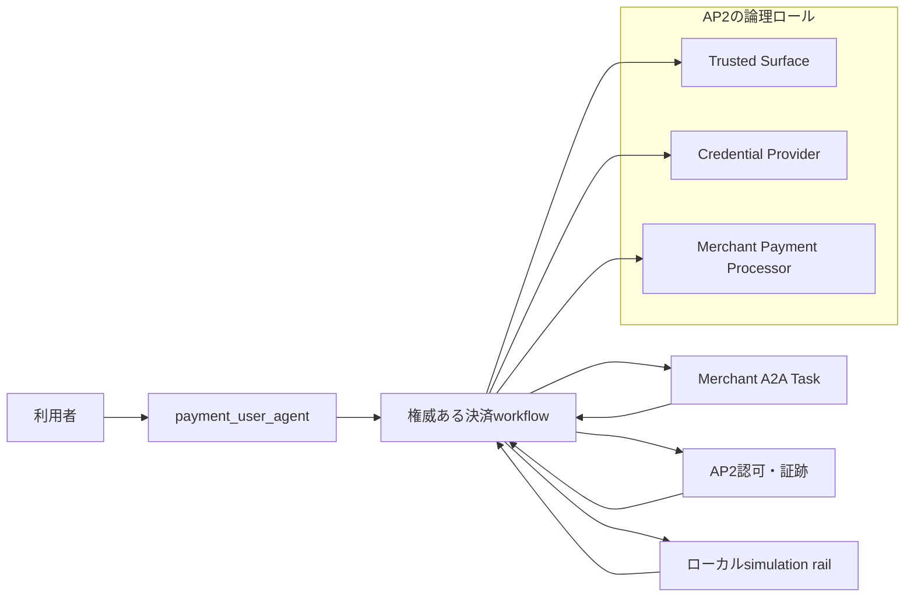
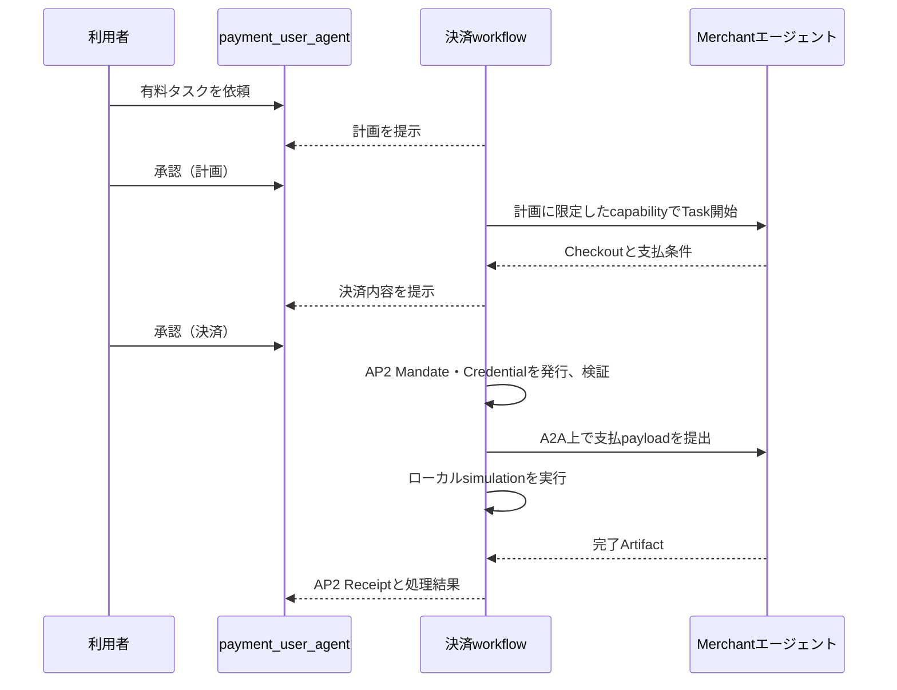

# エージェント間決済の概要

- 対象読者: この決済機能を初めて知る人、設計・実装・レビューに関わる人
- 前提: なし
- 次に読む文書: [AP2の詳細](AP2.md)、[A2A x402の詳細](A2A_X402.md)、[アーキテクチャ](ARCHITECTURE.md)

## 最初に押さえること

この実装では、エージェント間決済に関わる四つの役割を分けている。

| 要素 | 答える問い | このアーキテクチャでの役割 |
| --- | --- | --- |
| A2A | エージェント同士がタスクをどう交換するか | 仲介エージェントとMerchantエージェントのTask／Message通信 |
| AP2 | 誰が、何を、いくらで支払うことを承認したか | 利用者の同意、Mandate、Credential、署名済みReceiptによる認可と証跡 |
| A2A x402 | 支払条件、支払提出、処理結果をA2A Task上でどう交換するか | `payment-required`、`payment-submitted`、結果履歴の形式とTask相関 |
| 決済レール | 実際に残高をどう移動するか | 今回はローカルのsimulation。実資産は移動しない |

AP2とA2A x402は競合する仕様ではない。AP2は「その決済を実行してよい根拠」を扱い、A2A x402は「支払要求と支払結果をエージェント間で交換する方法」を扱う。AP2はA2Aの通信方式や決済レールを規定せず、A2A x402は利用者の購入意思や代理権の証拠を代替しない。

両方が常に必須というわけでもない。AP2は別の決済レールと組み合わせられ、A2A x402は別の認可方式と組み合わせられる。このプロジェクトでは、利用者が承認したエージェント間取引を将来標準的な決済交換へ接続できるよう、両者の責務を分離して組み合わせている。

> [!IMPORTANT]
> 現在の実装は **AP2 v0.2 Human Present demo** と **A2A x402 v0.1のwire-shape test fixture** の組み合わせである。A2A x402の公式profile、wallet、facilitator、実資産、on-chain settlementは実行しておらず、公式A2A x402には **NOT CONFORMANT** である。

## 今回の全体像

利用者が操作する入口は`payment_user_agent`だけである。これは画面と内部APIをつなぐ薄いadapterであり、決済判断や秘密鍵を持たない。状態、認可、Merchant呼出し、証跡、再試行の正本は`secure_mediation_agent`内の決定論的なworkflowである。

AP2のロールは、鍵、issuer、検証関数、監査記録を分けている。ただし、すべてが別サービスや別プロセスに物理分離されているわけではない。Merchantはloopback HTTPの別プロセスだが、Trusted Surface、Credential Provider、Merchant Payment Processorは現在のdemoでは同じdeployable内の論理コンポーネントである。実際の配置と信頼境界は[アーキテクチャ](ARCHITECTURE.md)を参照する。

## 二段階の承認が必要な理由

利用者は同じ`承認`という入力を二回送るが、承認対象は異なる。

1. 計画承認
   - どのエージェントに、何を、どの上限金額で依頼するかを固定する。
   - この時点ではMerchant Task、Checkout、決済は開始しない。
2. 決済承認
   - Merchantが返した商品、金額、通貨、payee、期限、支払条件を確認する。
   - この承認を根拠にAP2のclosed Checkout MandateとPayment Mandateを発行し、決済処理へ進む。

二つの承認は別のID、nonce、署名対象、監査イベントを持つ。計画が変われば計画承認を取り直し、価格やCheckoutが変われば決済承認を取り直す。一方を他方の代わりには使わない。

承認メッセージは単一text partの完全一致`承認`だけを受け付ける。`はい`、`yes`、`承認します`、前後に空白がある`承認`は、認可境界では承認として扱わない。

無料タスクでは計画承認だけを行い、決済承認、AP2 Mandate、仲介保証、settlementを作らない。仲介エージェントは選択した外部エージェントのA2A Taskが`completed`となり、空でないtextまたはfile artifactを返したことを検証して完了する。有料タスクではこの無料向け判定へfallbackせず、二回目の決済承認、AP2認可、仲介保証、同一Taskへの支払提出と相関検証を必須とする。

## 実装している範囲

| 領域 | 現在の範囲 |
| --- | --- |
| AP2 | Human Presentのclosed Checkout／Payment Mandate、ロール別検証、署名済みCheckout／Payment Receipt、offline evidence verification |
| A2A | 外部エージェントTaskの開始・完了、Merchantでは同じ`taskId`に相関した支払Message、最終Taskと業務Artifact |
| A2A x402 | v0.1に似たdotted metadataと状態遷移をproject-local profileで検証するfixture |
| 決済レール | `exact-simulated`／`demo:local`のローカル台帳 |
| 耐久性 | 明示した永続volumeを使う単一host・単一container構成 |
| 回復 | compare-and-set、冪等性キー、transactional outbox、reconciliation、補償処理 |
| 公開境界 | Firebase認証後のUIと`/mediation-api/`。Merchantや署名ロールの内部routeは公開しない |

## 実装していない範囲

以下は、このデモの成功から主張できない。

- 公式A2A x402 profileのactivationまたは相互運用性
- wallet署名、facilitatorによるverify／settle、実network／asset、on-chain transaction
- 実資産の移転、法的な支払保証、production決済
- AP2 Human Not Present、open Mandate、自律購入
- KMS／HSM、production identity enrollment、KYC／AML、PCI／SCA
- 複数instanceで共有するtransactional DB／queue
- すべてのAP2ロールの物理的なサービス分離

公式A2A x402のprofileは、必要なwallet、facilitator、network、assetがない状態では起動できないようfail closedにしている。したがって、現在のruntimeを動かすために公式x402は必要ない。将来公式profileを有効にするときは、[A2A x402の詳細](A2A_X402.md)に示す追加条件を満たす必要がある。

## 目的別の読み方

| 知りたいこと | 次に読む文書 |
| --- | --- |
| AP2が何を認可し、何を証明するか | [AP2.md](AP2.md) |
| A2A x402のTask／Message形式とsimulationとの差 | [A2A_X402.md](A2A_X402.md) |
| コンポーネント、状態、DB、再試行、信頼境界 | [ARCHITECTURE.md](ARCHITECTURE.md) |
| 必須要件と受入基準 | [REQUIREMENTS.md](REQUIREMENTS.md) |
| 主張可能な範囲と証跡の検証 | [VERIFICATION.md](VERIFICATION.md) |
| 起動、移行、回復、デプロイ | [OPERATIONS.md](OPERATIONS.md) |
| 5分の実演 | [DEMO.md](DEMO.md) |
| 従来の仲介エージェントへ決済を組み込む修正要件 | [MEDIATOR_PAYMENT_INTEGRATION_HANDOFF.md](MEDIATOR_PAYMENT_INTEGRATION_HANDOFF.md) |

本文と見出しは日本語で記述し、仕様の正式名称、wire field、状態値、コード識別子だけを原文で表記する。現在のテスト件数、image digest、Cloud Run revisionなどの可変値は本文へ転記せず、[検証ガイド](VERIFICATION.md)から機械可読な証跡を参照する。
