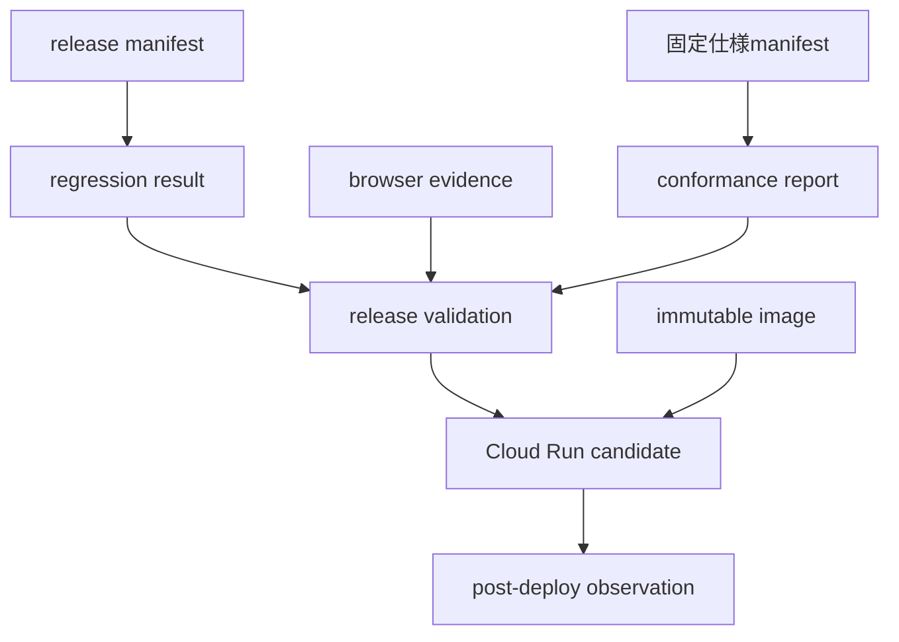

# 決済機能の検証ガイド

- 対象読者: リリース担当者、監査担当者、実装・セキュリティレビュアー
- 前提: [エージェント間決済の概要](README.md)、[要件定義](REQUIREMENTS.md)
- 次に読む文書: [運用ガイド](OPERATIONS.md)

## この文書の責務

この文書は、決済機能について何を主張できるか、どの機械可読artifactがその根拠か、どの検証を再実行するかを説明する。現在のtest count、image digest、revision、URLはMarkdownへ複製せず、JSON artifactを正本とする。

初回FAIL、修正過程、中間candidateの時系列は現行仕様ではないため、GitとPRの履歴を参照する。ここでは最新artifactの読み方だけを扱う。

## 主張の語彙

| 表記 | 意味 |
| --- | --- |
| `PASS` | 対象、入力artifact、判定規則を固定した検証が成功した |
| `PASS_SIMULATION` | project-local simulationとしての受入基準に成功した。公式x402や実資産決済の成功ではない |
| `PASS_SINGLE_HOST_DURABLE_TARGET` | 明示した永続volumeを持つ単一host・単一containerで成功した |
| `NOT RUN` | 実行していない。成功、互換、適合へ読み替えない |
| `NOT_RUN_CONDITIONAL` | 現在のprofileでは対象外だが、その機能をenableするreleaseでは必須になる |
| `BLOCKED` | 必須の構成要素がないため、そのclaimを有効にできない |
| `NOT CONFORMANT` | 公式profileへの適合を主張しない |

文書や画面で単に「x402対応」「AP2完全準拠」と表現しない。現在の安全な表現は、[概要](README.md#実装している範囲)に示すAP2 Human Present demoとA2A x402 wire-shape fixtureの組み合わせである。

## 機械可読な正本

| Artifact | 所有する情報 | 注意点 |
| --- | --- | --- |
| [`docs/ap2_x402_conformance_report.json`](../ap2_x402_conformance_report.json) | ACC状態、claim、profile、target、suite結果、release binding | build／release validatorが固定パスで参照するため移動しない |
| [`artifacts/ap2-x402-release-validation.json`](../../artifacts/ap2-x402-release-validation.json) | release gateの最終status、suite別判定、failure map | conformance、regression、browser、manifestとの一致を検証する |
| [`artifacts/regression-result.json`](../../artifacts/regression-result.json) | regression manifestに基づくsuite結果 | allowlist外のskipと収集数低下を拒否する |
| [`artifacts/browser-evidence.json`](../../artifacts/browser-evidence.json) | 固定imageでの実Browser操作 | ローカルcandidate上のUI証跡である |
| [`artifacts/cloud-run-candidate.json`](../../artifacts/cloud-run-candidate.json) | source、platform、image、embedded suite、artifactのbinding | build／push／deploy間で同一candidateを固定する |
| [`artifacts/cloud-run-deployment.json`](../../artifacts/cloud-run-deployment.json) | deploy後のrevision、traffic、remote browser、ephemeral境界 | post-deploy観測。release validatorの入力ではない |
| [`artifacts/cloud-run-deployment-81f3f41940c5.json`](../../artifacts/cloud-run-deployment-81f3f41940c5.json) | 現行公開revision、exact image、exact 7 env、Vertex probe、100% traffic、Cloud log、制約 | 現行deploymentのimmutable post-deploy観測 |
| [`artifacts/cloud-run-tag-e2e-81f3f41940c5.json`](../../artifacts/cloud-run-tag-e2e-81f3f41940c5.json) | 0% candidate tagでのreadiness、Vertex、paid／free browser、Cloud log | traffic切替前のcandidate-bound観測 |
| [`artifacts/cloud-run-public-paid-81f3f419.json`](../../artifacts/cloud-run-public-paid-81f3f419.json)／[`free`](../../artifacts/cloud-run-public-free-81f3f419.json) | 100%切替後の通常URLでのFirebase認証、paid／free、reload／logout、callback順序 | credential、任意prompt／model output、console、network、screenshotを保存しない最小証跡 |
| [`artifacts/cloud-run-deployment-399750d686a8.json`](../../artifacts/cloud-run-deployment-399750d686a8.json) | 直前revisionのdeployment観測 | 現行値ではなく履歴として保持 |

### リリース候補とデプロイを分ける理由

`ap2_x402_conformance_report.json`と`cloud-run-candidate.json`は、build時に固定したcandidateの証跡である。その後にCloud Runへ反映した事実は`cloud-run-deployment.json`が所有する。

したがって、candidate側のclaimに`PUSHED_NOT_DEPLOYED`または`PASS_NOT_DEPLOYED`が残り、deployment observationが`PASS`であっても、同じ時点の状態を表しているわけではない。前者を後から手編集するとartifact digestとrelease bindingが壊れるため、deploy後の事実で上書きしない。

## 証跡グラフ



release validatorは、status文字列だけでなく、指定されたartifactのexact byte digest、image、manifest、suite結果が一致することを確認する。古いconformance reportや別imageのbrowser resultを新candidateへ付け替えてはならない。

post-deploy observationは、ready revisionのfull immutable image URIがcandidateのregistry imageと一致することを記録する。ただし、この観測JSON自体は現在のvalidatorへ組み込まれていないため、release artifactの暗号学的bindingと同じ強さだと解釈しない。

Cloudブラウザ証跡では認証情報そのものを保存せず、認証結果、状態遷移、承認回数、固定catalogの表示検証、callbackの順序、reload／logout、非保存判定だけを記録する。公開デモ用にmanifestで固定したcanonical prompt以外の利用者入力、model output、browser console、network body、screenshotを後から証跡へ追加しない。

## 検証の層

### 1. 仕様とcontract

- 固定commitとspec hash
- AP2 schema、Mandate、Receipt、署名、参照
- A2A x402 v0.1のURI、activation、dotted metadata、Task相関
- official profileとsimulation profileの相互拒否

### 2. ワークフローとセキュリティ

- 二段階の完全一致承認
- 段階外routeとdirect invocationの拒否
- tenant、owner、capability、nonce、Task、Checkoutのbinding
- replay、並行実行、idempotency conflict
- secret、credential、proofの出力防止

### 3. 耐久性と補償

- 各非終端checkpointでのprocess death
- outbox leaseとevidence intentの回復
- settlement outcome unknownのreconciliation
- settlement後のfulfillment failureとrefund
- 新規volumeとmigrated volumeのrestart

### 4. UIとコンテナ

- `payment_user_agent`だけがroot appとして見えること
- 依頼、計画承認、決済承認、完了、reload後の復元
- public／internal route分離
- source mountを使わないclean image
- `linux/amd64` candidateと組込みtestの一致

### 5. 条件付きの公式profile

ACC-030は、公式A2A x402 profileをenableするreleaseだけの必須基準である。現在のsimulation-only releaseでは`NOT_RUN_CONDITIONAL`とし、次を実装したときだけ実行する。

- canonical URIの宣言とactivation
- 対応network、asset、payTo、wallet
- scheme-definedな`exact` payload
- facilitator verify／settle
- TLS、実transaction hash
- 同じsettlement attemptとAP2 Payment Receiptの相関

ACC-030が未実行の状態でofficial profileをenableしたり、A2A x402 compatible／conformantと表示したりしてはならない。

## 一括検証

起動済みの耐久ローカル環境では、container内の一括verifierを使う。

```bash
docker exec secure-platform /app/scripts/verify_payment_demo.sh
```

このverifierはreadiness、旧／内部routeの非公開、二承認の正常系、非完全一致承認の拒否、決済拒否、offline evidence graphを確認する。Firebaseを使う公開環境では、有効なsession cookieを明示してblack-box verifierを実行する。

個別の完了workflowのAP2証跡は次で検証する。

```bash
docker exec secure-platform /app/.venv/bin/python \
  /app/scripts/verify_ap2_x402_evidence.py <workflow-id>
```

release candidate全体の検証は、[運用ガイド](OPERATIONS.md#リリース候補の作成と配布)に示すbuild段階で実行する。手元の一部testだけを実行して既存artifactの`PASS`を書き換えない。

## オフライン証跡検証

offline verifierは保存済みのexact bytesとpublic trust snapshotだけを使い、次を再検証する。

1. 計画認可と呼出し先別capabilityの署名、audience、operation。
2. Merchant Checkoutの署名とworkflow、plan、Task、amount。
3. closed Checkout／Payment Mandateの署名、nonce、payee、Checkout参照。
4. simulation proofの`simulated=true`、`walletSigned=false`、Task binding。
5. project-local credentialとMandate、payload、requirementsのbinding。
6. AP2 Payment／Checkout Receiptのissuer、署名、参照。
7. 順序付きsimulation resultと、on-chain transaction形式が存在しないこと。
8. artifactとversioned public JWK snapshotのdigest、`kid`。

raw secretやprivate keyを証跡bundleへ含めない。

## Upstream AP2試験の解釈

固定したupstream AP2 suiteには、リポジトリ側の全体判定と別に説明付きの未達が記録される場合がある。`EXPLAINED_PARTIAL`を`PASS`へ昇格しない。リリースで実際に使う終端presentation経路について、誤ったaudience、nonce、署名、root issuerをリポジトリ側のnegative testで拒否することを確認し、範囲をconformance reportへ明記する。

upstreamの未達を隠して「AP2完全準拠」と表示してはならない。

## 文書変更時の確認

決済文書だけの変更でrelease source setが変わらない場合でも、次を確認する。

- `docs/ap2_x402_conformance_report.json`を移動または手編集していない。
- artifactのdigestや現在値をMarkdownへ複製していない。
- AP2 ReceiptとA2A payment result historyを混同していない。
- simulationを公式A2A x402または実決済と表現していない。
- `cloud-run-deployment.json`をcandidateの検証入力と誤記していない。
- 古い文書名へのlinkが残っていない。

最新の状態を更新する場合は、対象に応じてcandidate artifact一式またはpost-deploy observationを再生成し、Git diffで変更されたclaimと根拠を同時にレビューする。
