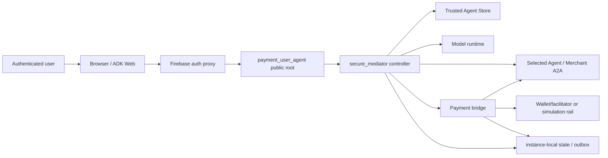
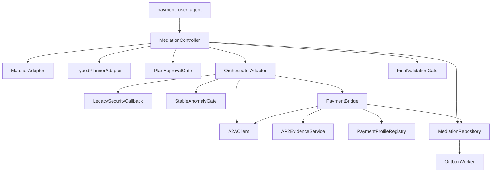

# 仲介エージェント決済統合：概要・アーキテクチャ

## 1. 文書の責務

本書はsystem context、論理component、責務境界、依存方向を定義する。対象は `target` architectureであり、現在の直接workflow版を実装済みと読み替えない。

## 2. 対象範囲と対象外

対象は唯一の公開rootから、内部仲介、選定AgentへのA2A、必要時だけの決済bridge、最終判定までである。domain fieldとstateは [02](02_DOMAIN_DATA_STATE.md#4-aggregateとownership境界)、制御順序は [03](03_MEDIATION_FLOW.md#3-入口から仲介開始まで)、protocol意味論は [04](04_PAYMENT_BRIDGE_AP2_X402.md#3-bridgeの入力出力責務)、security policyは [05](05_SECURITY_TRUST_BOUNDARIES.md#3-保護資産と脅威model)、wireは [06](06_API_A2A_CONTRACTS.md#3-contract共通規約とversioning)、物理配置は [09](09_DEPLOYMENT_PUBLIC_BOUNDARY.md#4-process-topologyとlisten-boundary) が所有する。

## 3. Architecture driversと制約

- 決済workflowは `secure_mediator` の代替rootではなく、検証済み支払要求を受けたstepだけの内部機能である。
- 入口で扱う公開appは `payment_user_agent` 一つで、認可判断は永続controllerが行う。
- matcher、planner、orchestrator、従来security callback、stable anomaly gate、final anomaly detectorを実際に呼び、そのeventを同一correlation chainへ記録する。
- 計画承認前のremote Task開始と、決済承認前のmandate／submit／settlementを禁止する。
- 支払要求がないstepにはpayment workflowを一切作らない。
- 外部DBを追加せず、同一instance内のSQLite／outbox回復とinstance置換時のstate lossを区別する。
- AP2認可とx402 transportを別層にし、simulationを公式適合と表示しない。

### Current final6 composition

`payment_user_agent -> HttpMediationAuthority -> workflow API -> MediationController` を唯一のpublic mutation authorityとし、controllerがtyped matcher、planner、shared A2A executor、payment bridge、final validatorを組み立てる。production callbackは従来のGemini-backed `a2a_security_callback` をbefore/afterで実行する `legacy`、`deterministic-local` は `APP_ENV=local` かつ `DEV_MODE=true` の明示test profileに限定する。local durableはSQLite v4、Cloud Run demoは明示したmemory storeであり、両者のdurability claimを混ぜない。

## 4. System contextとActor

**FIG-ARCH-01 System context**

Browserより右の内部componentは、明示したsame-origin mediation façadeを除き外部公開しない。外部Agent、Store data、model output、browser inputはすべてuntrusted inputとして境界で検証する。

## 5. 論理component topology

**FIG-ARCH-02 論理componentと依存方向**

`MediationController`だけがstageを進める。LLM adapter、PaymentBridge、workerは任意のnext stateを直接確定せず、typed resultとexpected versionをcontroller／repositoryへ返す。

## 6. Component責務と所有境界

**TBL-ARCH-01 Component ownership**

| Component | 責務 | 所有data／decision | 公開 | target file mapping |
| --- | --- | --- | --- | --- |
| `payment_user_agent` | authenticated input、view返却 | 承認対象を決めない | 唯一のADK root | `payment_user_agent/agent.py` |
| `MediationController` | stage、承認routing、branch、resume | mediation aggregateのcommand順序 | same-origin façade経由のみ | `secure_mediation_agent/agent.py` と新規controller層 |
| `MatcherAdapter` | registry検索とlive Card照合用snapshot | 候補結果。canonical policyはtyped validator | 内部 | `subagents/matching_agent.py` adapter |
| `TypedPlannerAdapter` | model出力からvalidated planを生成 | plan proposal。承認権限なし | 内部 | `subagents/planning_agent.py` adapter |
| `OrchestratorAdapter` | approved stepのA2A開始／継続 | remote call result。state正本ではない | 内部 | `subagents/orchestration_agent.py` adapter |
| `LegacySecurityCallback` | 従来の各A2A前後検査 | callback result | 内部 | existing callback wrapper |
| `StableAnomalyGate` | versioned inputへの強制判定 | policy decisionは05、scheduleは03 | 内部 | anomaly adapter＋deterministic policy |
| `PaymentBridge` | continuationへattachしAP2／profile／submitを統括 | payment artifact意味論 | 内部 | 現workflow controllerをbridgeへ分離 |
| `A2AClient` | Agent Card／Task／Message wire処理 | serialized DTO | loopback／allowlisted outbound | structured A2A client |
| `Repository／Outbox` | CAS、atomic event＋job、lease、recovery | physical rows | loopback only | workflow repositoryの拡張 |
| `FinalValidationGate` | 全step後のACCEPT／REJECT／REVIEW | final policy decision | 内部 | final detector wrapper |

### Production composition seam

Release-1の実経event chainは、表示labelではなく以下のsymbolをtyped adapter経由で呼び出したことで証明する。`payment_user_agent/agent.py:root_agent` は新設の `secure_mediation_agent/composition.py:create_production_agent` が返す `SecureMediationAdapter` だけを公開rootにする。現行の `PaymentWorkflowAdapter` 直接接続とworkflow-id直指定routingは置換対象である。

| target adapter / interface | 実呼出しする既存symbol | 扱い |
| --- | --- | --- |
| `integration/adapters.py:MatcherAdapter.search` | `subagents/matching_agent.py:search_agent_store`, `rank_agents_by_trust`, `calculate_matching_score` | 継続利用し、出力を `SelectedAgentSnapshot` にstrict変換 |
| `integration/adapters.py:TypedPlannerAdapter.create` | `subagents/planning_agent.py:create_structured_plan`, `planner_change_approval_gate` | subject bindingを含むplan DTOへ変換。text-only planは拒否 |
| `integration/adapters.py:OrchestratorAdapter.execute` | `subagents/orchestration_agent.py:execute_plan_step`, `invoke_a2a_agent`, `orchestrator_approval_gate` | approved snapshotだけを入力にし、任意URL連結は置換 |
| `integration/adapters.py:OrchestratorSecurityHook.before/after` | `subagents/orchestration_agent.py:a2a_security_callback` とorchestrator tool callback/hook | 全A2A前後の実enforcement、fail closed。realtime防御の主体 |
| `integration/adapters.py:SemanticAnomalyReviewer.review` | `subagents/anomaly_detector.py:compare_with_plan`, `detect_deviation_patterns`, `detect_suspicious_behavior`, `calculate_deviation_score`, `should_stop_execution` | 意味判断が必要な不確定・高riskの `REVIEW` escalation。各境界の必須呼出しではない |
| `integration/adapters.py:FinalValidationAdapter.check` | `subagents/final_anomaly_detector.py:verify_request_fulfillment`, `detect_prompt_injection`, `detect_hallucination_chain`, `calculate_overall_safety_score` | final resultのACCEPT／REJECT／REVIEWを固定 |

`secure_mediation_agent/mediation/controller.py:MediationController` が上記interfaceとPaymentBridgeを注入され、呼出しごとに `{componentId, layer=callback-hook|deterministic-validator|semantic-reviewer|final-validator, implementationSymbol, implementationRevision, operationId, inputDigest, outputDigest, callOrdinal, startedAt, completedAt, decision}` をappend-only eventに書く。callback実行とanomaly subagent判断は別eventとし、一方のlabelで他方を代用しない。`componentId`の置換、順序抜け、mockだけの通過は `PAID-HAPPY-01` と `FREE-HAPPY-01` で失敗させる。

## 7. 統合seamと依存方向

主なseamは4つである。

1. matcherからplannerへはimmutable `SelectedAgentSnapshot` を渡す。plannerがendpoint、skill、trustを再解釈しない。
2. plan approvalからorchestratorへはapproved `plan_id/version/digest` とstep snapshotを渡す。自然言語の「承認済み」フラグを使わない。
3. orchestratorからPaymentBridgeへは、初回A2A応答を保持した `MediationContinuation` と検証済み `PaymentRequirementSnapshot` をattachする。bridgeは新規Taskを作らない。
4. PaymentBridgeからorchestratorへは同じtask/context/order/quoteとresult digestを返す。相関一致後だけ同じstepを完了できる。

依存はdomain interfaceへ向け、UI、wire、persistenceの型を互いに直接流用しない。変換ownerは [06](06_API_A2A_CONTRACTS.md#3-contract共通規約とversioning) と [08](08_PERSISTENCE_RECOVERY.md#4-logical-modelからphysical-storeへのmapping) に限定する。

## 8. Cross-document invariant索引

| Invariant | Semantic owner |
| --- | --- |
| 承認routingはsubject／tenant／ADK session／mediation sessionでfilter後にpaymentを優先 | [03 §5.1](03_MEDIATION_FLOW.md#51-保留中承認の候補filterと排他的routing-decision-table) |
| domain snapshotのcanonical bytesとdigest | [02 §6](02_DOMAIN_DATA_STATE.md#6-snapshotとimmutable-reference) |
| anomaly gateの発火順序 | [03 §10](03_MEDIATION_FLOW.md#10-anomaly-gateと従来callbackの実行点) |
| anomaly gateの判定・timeout・parse failure | [05 §7](05_SECURITY_TRUST_BOUNDARIES.md#7-従来security-callbackとstable-anomaly-gate) |
| AP2 evidenceとpayment approval binding | [04 §5-7](04_PAYMENT_BRIDGE_AP2_X402.md#5-決済承認境界) |
| A2A wireとdomain-to-wire mapping | [06 §8-12](06_API_A2A_CONTRACTS.md#8-a2a-taskmessage-lifecycle-contract) |
| physical transaction／CAS／outbox | [08 §4-7](08_PERSISTENCE_RECOVERY.md#4-logical-modelからphysical-storeへのmapping) |
| public route allowlist／deny | [09 §5-6](09_DEPLOYMENT_PUBLIC_BOUNDARY.md#5-public-route-allowlist) |
| 139件coverageとRelease-1／future分離 | [11 §2-6](11_TRACEABILITY_RELEASE.md#2-coverage-manifest-schemaと生成方向) |

## 9. 適用要件

<!-- GENERATED: design-coverage v1; source=11_TRACEABILITY_RELEASE.md -->

| 要件ID | 要件へのリンク | primary design section | 検証先 |
| --- | --- | --- | --- |
| `FR-001` | [要件](../MEDIATOR_PAYMENT_INTEGRATION_REQUIREMENTS.md#fr-001-従来の仲介ルート) | [FR-001](#fr-001) | [TEST-006](10_TEST_STRATEGY.md#61-test-006-実仲介chain)、[AC-001](10_TEST_STRATEGY.md#131-ac-001-有料タスクの正常系) |

### FR-001

公開依頼のcorrelation chainには `payment_user_agent -> MediationController -> MatcherAdapter -> TypedPlannerAdapter -> PlanApprovalGate -> OrchestratorAdapter -> LegacySecurityCallback／stable gates -> FinalValidationGate` の実eventが必要である。有料時だけPaymentBridge eventを追加する。componentのimport、表示label、mock traceだけでは充足しない。

## 10. 関連文書と参照方向

| 参照先 | 理由 | 正本節 | 再掲しない内容 |
| --- | --- | --- | --- |
| [02](02_DOMAIN_DATA_STATE.md) | domain依存 | §4-10 | field、state、digest |
| [03](03_MEDIATION_FLOW.md) | 制御依存 | §3-12 | sequence、routing、gate schedule |
| [04](04_PAYMENT_BRIDGE_AP2_X402.md) | payment seam | §3-10 | AP2／profile意味論 |
| [05](05_SECURITY_TRUST_BOUNDARIES.md) | security制約 | §3-11 | threat、gate policy |
| [06](06_API_A2A_CONTRACTS.md) | wire依存 | §3-13 | payload、header、error |
| [09](09_DEPLOYMENT_PUBLIC_BOUNDARY.md) | deployment依存 | §3-13 | ports、routes、deploy guard |

## 11. Decision参照

[OQ-001](12_DECISIONS_OPEN_QUESTIONS.md#oq-001)、[OQ-006](12_DECISIONS_OPEN_QUESTIONS.md#oq-006)、[OQ-007](12_DECISIONS_OPEN_QUESTIONS.md#oq-007)、[OQ-009](12_DECISIONS_OPEN_QUESTIONS.md#oq-009)、[ADR-011](12_DECISIONS_OPEN_QUESTIONS.md#adr-011-production-composition-seam) をaccepted decision inputとして参照する。本書からのlinkはnon-authoritative backlinkであり、decision statusは12が所有する。
