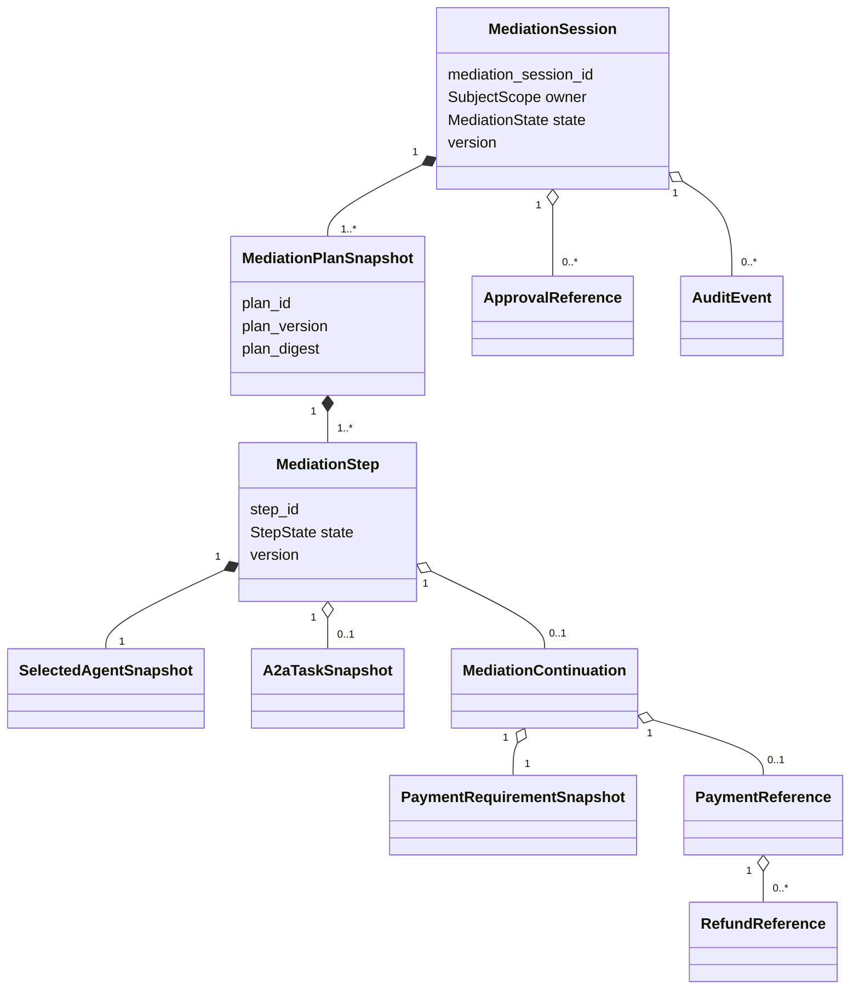
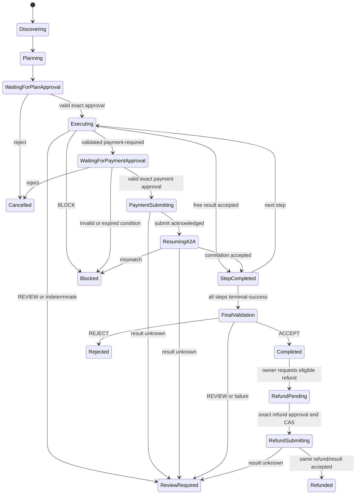
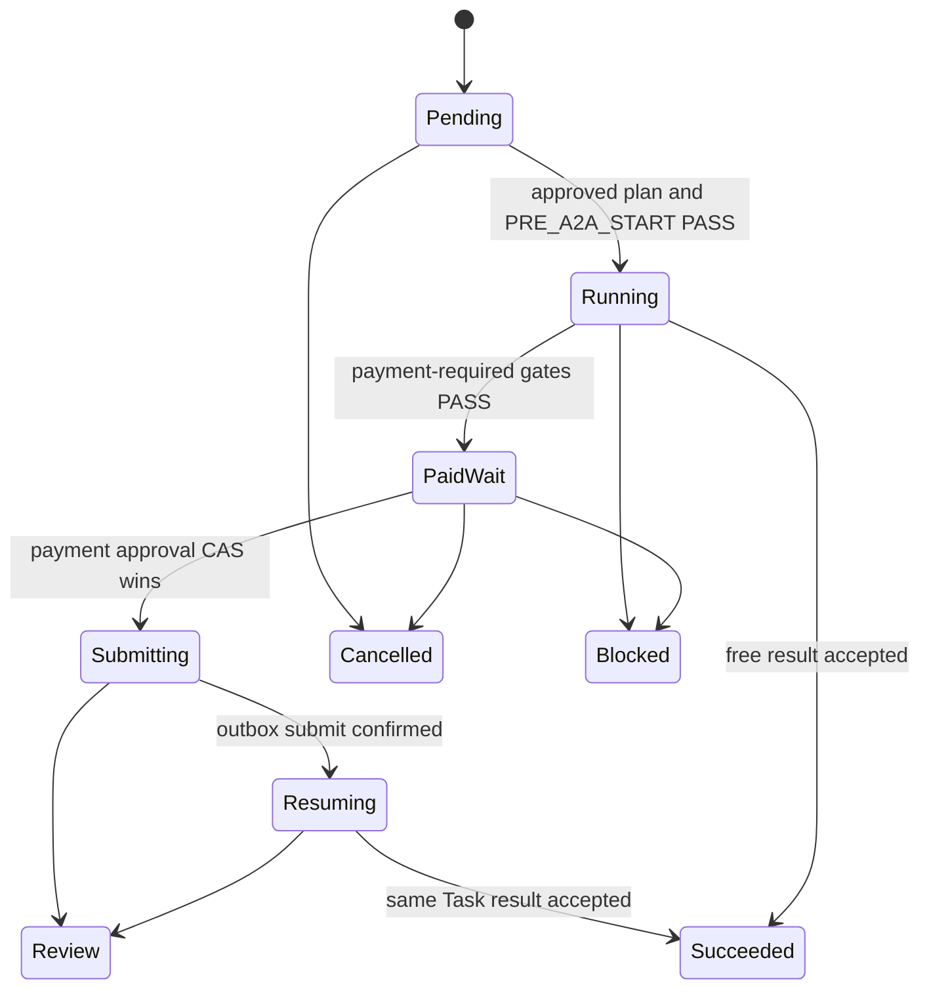

# 仲介エージェント決済統合：Domain・Data・State設計

## 1. 文書の責務

本書は `ART-DOMAIN-CONTEXT-01`、`ART-DOMAIN-DIGEST-01`、`ART-AUDIT-EVENT-01` のsemantic ownerとして、論理domain、identifier、immutable snapshot、相関、状態、遷移guard、domain errorを定義する。

### ART-DOMAIN-CONTEXT-01

Mediation session、plan、step、Agent／Task snapshot、continuationのcanonical意味とaggregate invariantを本書だけが所有する。

### ART-DOMAIN-DIGEST-01

Domain snapshotのcanonical bytesとdigest algorithmを本書だけが所有する。wire表現やAP2 artifactのcanonicalizationは別artifactである。

### ART-AUDIT-EVENT-01

Audit eventのcanonical意味、correlation、順序要件を本書だけが所有する。発生点、serialized DTO、保存mapping、UI projectionは各面ownerへ委譲する。

## 2. 対象範囲と対象外

DB table、index、transaction、outbox、recoveryは [08](08_PERSISTENCE_RECOVERY.md#4-logical-modelからphysical-storeへのmapping)、JSON／HTTP表現は [06](06_API_A2A_CONTRACTS.md#3-contract共通規約とversioning)、制御順序は [03](03_MEDIATION_FLOW.md#3-入口から仲介開始まで)、AP2 artifact semanticsは [04](04_PAYMENT_BRIDGE_AP2_X402.md#6-ap2-roleとevidence-topology) が所有する。

current final6では `MediationSession` とrequest reservation/resultをSQLite schema v4のstable stateとし、owner scope、request digest、mediation session ID、versionを一つのCAS/idempotency境界に含める。public viewは復号したauthoritative sessionから決定的に生成し、LLM出力やbrowser指定子をstate ownerにしない。

## 3. Domain用語とnamespace

- IDはUUIDv7文字列、digestは `sha256:<lowercase-hex>`、日時はUTC RFC 3339（秒以下6桁まで、`Z`）をcanonical domain formとする。
- `legacy_step_id` は要件との互換名であり、domain上は `step_id` のaliasではなく同じ値を保持する明示fieldとする。
- 金額は `amount_minor: int64 > 0` とISO 4217 uppercase `currency` の組で、floatを禁止する。
- canonical Agent identityはregistryのimmutable IDとし、display name、service slug、Agent Card name、registry skill、A2A skillは別namespaceである。
- `subject`、`tenant_id`、`adk_session_id`、`mediation_session_id` は異なるscopeで、互いの代用を禁止する。owner tupleは常に4項目すべてを含む。`subject`は検証済みFirebase session cookieからproxyが作る署名済みidentity assertionのみから得て、request body、model output、任意header、`/auth/internal/identity` のsubject指定で生成しない。

## 4. Aggregateとownership境界

**FIG-DOMAIN-01 Aggregate関係**

`MediationSession` がaggregate rootである。`PaymentWorkflow` は別aggregateだが、`MediationContinuation` が両aggregateの不変IDとbinding digestを参照する。双方の状態を一つの巨大なenumへ統合しない。

## 5. Identity・correlation key体系

**TBL-DATA-01 Identifier contract**

| ID | owner／生成点 | immutable条件 | 主な参照 |
| --- | --- | --- | --- |
| `mediation_session_id` | controller、依頼受付 | owner scope変更禁止 | 全aggregate／audit |
| `plan_id` | typed planner adapter | version更新でもID維持 | approval／step／Intent |
| `plan_version` | controller CAS | replanごとに+1 | approval guard |
| `plan_digest` | domain canonicalizer | snapshot bytesに一意 | approval／evidence |
| `step_id` | plan生成時 | plan version内一意 | Task／continuation |
| `agent_id` | registry | canonical IDはalias変換禁止 | capability／evidence |
| `context_id`／`task_id` | remote Agent | 初回応答後固定 | payment submit／resume |
| `client_request_correlation_id` | controller | 初回requestのみで発行 | Merchantへの初回A2A metadata |
| `order_id`／`quote_id` | Merchant | Merchantの初回応答で生成、Checkout変更時は新digest | approval／receipt／refund |
| `continuation_id` | attach transaction | stepあたりactiveは最大1 | approval routing |
| `payment_workflow_id` | PaymentBridge | continuationへ一度だけattach | AP2／outbox |
| approval ID／nonce | 各approval発行点 | 計画用と決済用を別namespace化 | evidence binding |
| AP2 object ID／nonce | AP2発行点 | object種別ごとに独立 | offline verifier |
| `correlation_id` | mediation受付 | 全eventで固定 | trace／evidence |
| `refund_id` | MerchantまたはPaymentBridge | 元paymentとidempotency keyに対し一意 | refund request/result |

## 6. Snapshotとimmutable reference

`SelectedAgentSnapshot` は `agent_id`、`registry_name`、`service_slug`、`a2a_agent_name`、`agent_card_url`、`rpc_endpoint`、`agent_card_digest`、`registry_skill_id`、`a2a_skill_id`、`trust_score`、`capability_ids[]`、`payment_profiles[]`、`selected_at` を必須とする。

`MediationPlanSnapshot` はowner scopeの4項目（`subject`、`tenant_id`、`adk_session_id`、`mediation_session_id`）、goalのdigest、plan ID/version、ordered steps、各stepのAgent snapshot、skill input、上限、生成model／schema versionを含む。`plan_digest` はこのowner tupleを必ずcanonical bytesに含める。承認後はimmutableで、再計画はin-place更新ではなくversionを増やした新snapshotとする。

`A2aTaskSnapshot` はtask/context/state、request/response message digest、structured parts digest、artifact digest、order/quote、received_atを保持する。生のuntrusted textを権限判定fieldへ昇格させない。

`PaymentRequirementSnapshot` はsource task/context、quote/order、item、amount_minor、currency、payee、network、asset、scheme、profile ID/version、expires_at、extension digest、checkout digestを含む。

`PaymentAuthorizationEnvelopeRef` は決済実行前に固定する `mediation-authorization-envelope/v1` のID／digestだけを参照する。receipt、payment result、観測完了時刻は含まない。`PaymentCompletionManifestRef` は実行後の `mediation-completion-manifest/v1` ID／digestとauthorization digestを参照する。pre-payment bytesからpost-result bytesへだけの一方向とし、digestの循環を作らない。wire schemaは [06 §12](06_API_A2A_CONTRACTS.md#12-resultartifacterror-contract) が所有する。

`RefundReference` は `refund_id`、owner tuple、original payment/workflow/task/context/order/quote、authorization-envelope digest、completion-manifest digest、receipt digest、refundable amount/currency、requested amount/reason、refund idempotency key、state/version、request/result digestを必須とする。original ownerとpaymentに紐付かないrefundは生成しない。

Domain canonical bytesはUTF-8 JSON、object keyのUnicode code point昇順、array順序維持、整数の10進最短表現、日時の上記UTC表現、`null`と欠落の区別、NFC文字列、空白なしとする。digest対象からdigest自身とUI表示値を除く。wire側のcanonicalizationは06、AP2 objectは04が所有し、domain algorithmを流用したと仮定しない。

## 7. Mediation sessionとplan／step model

`MediationSession` の必須fieldはowner scope、goal digest、active plan reference、state、version、created/updated/expires、final decision referenceである。

`MediationStep` の必須fieldは `step_id`、ordinal、intent、selected agent snapshot digest、input digest、max amount policy、state、attempt、remote task reference、continuation reference、result digest、versionである。stepのHTTP endpointはsnapshot参照からのみ解決する。

Plan approvalは `plan_id/version/digest` とowner scopeへbindingされる。承認後にstep、Agent、上限、endpointが変わればapprovalは一致しない。

## 8. Continuationとpayment参照model

`MediationContinuation` は次を必須とする。

| 分類 | field |
| --- | --- |
| owner | subject、tenant、ADK session、mediation session |
| plan | plan ID/version/digest、plan approval ID/nonce/issued-at、step ID |
| Agent | Agent snapshot digest、canonical Agent、skill、RPC endpoint |
| remote | task/context/order/quote、Task snapshot digest |
| requirement | payment requirement／Checkout ID・digest、expiry |
| payment | workflow ID、payment approval ID/nonce/issued-at、profile、idempotency key |
| control | continuation ID、resume state、version、retry count、last error、created/updated/expires |

active continuationは `(owner_scope, mediation_session_id, plan_id, plan_version, step_id)` につき最大1件とする。PaymentBridgeはremote IDsを生成し直さず、attach時に受けたsnapshotへbindingする。

## 9. 状態model

**FIG-STATE-01 Mediation state**

**FIG-STATE-02 Stepとpayment参照**

Refundの状態は `NONE -> REFUND_PENDING -> REFUND_SUBMITTING -> REFUNDED` とし、拒否は `REFUND_REJECTED`、結果不明は `REFUND_REVIEW_REQUIRED` とする。元paymentのsettlementは過去事実として変更せず、refund aggregateをappendする。

## 10. 遷移guardと禁止遷移

**TBL-STATE-01 State transition guard**

| from | event | mandatory guard | to | 禁止副作用 |
| --- | --- | --- | --- | --- |
| `WaitingForPlanApproval` | approve | exact single part、owner、expiry、plan version/digest、CAS | `Executing` | guard前remote call 0 |
| `Executing` | free result | callbacks、PRE/POST gate PASS、Task correlation | `StepCompleted` | payment records 0 |
| `Executing` | payment required | Card/profile/Task/Checkout検証、required gates PASS | `WaitingForPaymentApproval` | mandate／submit 0 |
| `WaitingForPaymentApproval` | approve | routing、exact input、Checkout unchanged、CAS | `PaymentSubmitting` | CAS loser side effect 0 |
| `PaymentSubmitting` | submitted | AP2/profile/capability/gate PASS、idempotency | `ResumingA2A` | new Task start 0 |
| `ResumingA2A` | result | same task/context/order/quote/step/workflow | `StepCompleted` | mismatch取込み 0 |
| `StepCompleted` | all done | every step terminal-success | `FinalValidation` | final result公開 0 |
| `FinalValidation` | decide | `ACCEPT` only | `Completed` | REJECT/REVIEW時成功表示 0 |
| `Completed` | refund request | same owner、refundable balance、exact original correlation | `RefundPending` | refund submit 0 |
| `RefundPending` | approve | subject/tenant/session owner、amount/reason/original receipt、nonce/expiry、CAS | `RefundSubmitting` | CAS loser refund 0 |
| `RefundSubmitting` | result | same refund/payment/order/amount/currency、idempotency | `Refunded` | duplicate refund 0 |

明示されない遷移は拒否する。`BLOCK`／`REVIEW`／detector error後の自動継続、free stepでのmandate生成、old approvalのreplan後流用、waiting中の無関係Task開始は禁止する。

## 11. Domain error分類

| Domain error | terminality | safe action |
| --- | --- | --- |
| `OWNER_SCOPE_MISMATCH` | request拒否 | 404相当、安全な一般文言 |
| `STALE_VERSION` | retryable | 最新view再取得、CAS再評価 |
| `APPROVAL_TARGET_AMBIGUOUS` | recoverable | explicit selection要求 |
| `APPROVAL_INVALID` | recoverable | pending維持または取消 |
| `PAYMENT_REQUIREMENT_INVALID` | blocked | 支払副作用なし |
| `CORRELATION_MISMATCH` | blocked | 自動retry禁止 |
| `RESULT_UNKNOWN` | review | reconciliationのみ |
| `STATE_LOST` | terminal for old flow | 新しい依頼の再実行案内 |
| `POLICY_BLOCKED` | blocked | reason code表示、秘密はredact |
| `POLICY_REVIEW_REQUIRED` | review | human review待ち |
| `REFUND_NOT_AUTHORIZED` | blocked | refund副作用0、ownerへ安全な一般文言 |
| `REFUND_RESULT_UNKNOWN` | review | 自動再refund禁止、同じrefund IDの照会のみ |

## 12. 適用要件

<!-- GENERATED: design-coverage v1; source=11_TRACEABILITY_RELEASE.md -->

| 要件ID | 要件へのリンク | primary design section | 検証先 |
| --- | --- | --- | --- |
| `NFR-002` | [要件](../MEDIATOR_PAYMENT_INTEGRATION_REQUIREMENTS.md#nfr-002-決定性と再現性) | [NFR-002](#nfr-002) | [TEST-003](10_TEST_STRATEGY.md#test-003)、[TEST-004](10_TEST_STRATEGY.md#test-004)、[TEST-006](10_TEST_STRATEGY.md#test-006)、[AC-003](10_TEST_STRATEGY.md#ac-003)、[AC-004](10_TEST_STRATEGY.md#ac-004)、[AC-005](10_TEST_STRATEGY.md#ac-005)、[AC-006](10_TEST_STRATEGY.md#ac-006)、[AC-007](10_TEST_STRATEGY.md#ac-007)、[AC-008](10_TEST_STRATEGY.md#ac-008)、[AC-009](10_TEST_STRATEGY.md#ac-009) |
| `DATA-001` | [要件](../MEDIATOR_PAYMENT_INTEGRATION_REQUIREMENTS.md#data-001-主体相関) | [DATA-001](#data-001) | [TEST-002](10_TEST_STRATEGY.md#test-002)、[TEST-003](10_TEST_STRATEGY.md#test-003)、[TEST-005](10_TEST_STRATEGY.md#test-005)、[AC-006](10_TEST_STRATEGY.md#ac-006) |
| `DATA-002` | [要件](../MEDIATOR_PAYMENT_INTEGRATION_REQUIREMENTS.md#data-002-仲介計画相関) | [DATA-002](#data-002) | [TEST-002](10_TEST_STRATEGY.md#test-002)、[AC-001](10_TEST_STRATEGY.md#ac-001) |
| `DATA-003` | [要件](../MEDIATOR_PAYMENT_INTEGRATION_REQUIREMENTS.md#data-003-選定agent-snapshot) | [DATA-003](#data-003) | [TEST-002](10_TEST_STRATEGY.md#test-002)、[TEST-008](10_TEST_STRATEGY.md#test-008)、[AC-001](10_TEST_STRATEGY.md#ac-001)、[AC-002](10_TEST_STRATEGY.md#ac-002) |
| `DATA-004` | [要件](../MEDIATOR_PAYMENT_INTEGRATION_REQUIREMENTS.md#data-004-remote-task相関) | [DATA-004](#data-004) | [TEST-002](10_TEST_STRATEGY.md#test-002)、[TEST-008](10_TEST_STRATEGY.md#test-008)、[AC-001](10_TEST_STRATEGY.md#ac-001) |
| `DATA-005` | [要件](../MEDIATOR_PAYMENT_INTEGRATION_REQUIREMENTS.md#data-005-決済相関) | [DATA-005](#data-005) | [TEST-002](10_TEST_STRATEGY.md#test-002)、[AC-001](10_TEST_STRATEGY.md#ac-001)、[AC-005](10_TEST_STRATEGY.md#ac-005) |
| `DATA-006` | [要件](../MEDIATOR_PAYMENT_INTEGRATION_REQUIREMENTS.md#data-006-継続制御) | [DATA-006](#data-006) | [TEST-003](10_TEST_STRATEGY.md#test-003)、[TEST-009](10_TEST_STRATEGY.md#test-009)、[TEST-013](10_TEST_STRATEGY.md#test-013)、[AC-006](10_TEST_STRATEGY.md#ac-006)、[AC-007](10_TEST_STRATEGY.md#ac-007)、[AC-011](10_TEST_STRATEGY.md#ac-011) |
| `DATA-007` | [要件](../MEDIATOR_PAYMENT_INTEGRATION_REQUIREMENTS.md#data-007-識別子の正規化) | [DATA-007](#data-007) | [TEST-002](10_TEST_STRATEGY.md#test-002)、[TEST-005](10_TEST_STRATEGY.md#test-005)、[AC-001](10_TEST_STRATEGY.md#ac-001)、[AC-008](10_TEST_STRATEGY.md#ac-008) |
| `DATA-008` | [要件](../MEDIATOR_PAYMENT_INTEGRATION_REQUIREMENTS.md#data-008-監査相関) | [DATA-008](#data-008) | [TEST-002](10_TEST_STRATEGY.md#test-002)、[TEST-006](10_TEST_STRATEGY.md#test-006)、[AC-001](10_TEST_STRATEGY.md#ac-001)、[AC-009](10_TEST_STRATEGY.md#ac-009) |
| `STATE-001` | [要件](../MEDIATOR_PAYMENT_INTEGRATION_REQUIREMENTS.md#state-001-計画承認前) | [STATE-001](#state-001) | [TEST-003](10_TEST_STRATEGY.md#test-003)、[TEST-007](10_TEST_STRATEGY.md#test-007)、[AC-003](10_TEST_STRATEGY.md#ac-003) |
| `STATE-002` | [要件](../MEDIATOR_PAYMENT_INTEGRATION_REQUIREMENTS.md#state-002-a2a実行分岐) | [STATE-002](#state-002) | [TEST-001](10_TEST_STRATEGY.md#test-001)、[TEST-006](10_TEST_STRATEGY.md#test-006)、[TEST-007](10_TEST_STRATEGY.md#test-007)、[AC-001](10_TEST_STRATEGY.md#ac-001)、[AC-002](10_TEST_STRATEGY.md#ac-002)、[AC-008](10_TEST_STRATEGY.md#ac-008) |
| `STATE-003` | [要件](../MEDIATOR_PAYMENT_INTEGRATION_REQUIREMENTS.md#state-003-決済承認待ち) | [STATE-003](#state-003) | [TEST-003](10_TEST_STRATEGY.md#test-003)、[TEST-007](10_TEST_STRATEGY.md#test-007)、[AC-004](10_TEST_STRATEGY.md#ac-004)、[AC-005](10_TEST_STRATEGY.md#ac-005)、[AC-006](10_TEST_STRATEGY.md#ac-006) |
| `STATE-004` | [要件](../MEDIATOR_PAYMENT_INTEGRATION_REQUIREMENTS.md#state-004-支払提出) | [STATE-004](#state-004) | [TEST-004](10_TEST_STRATEGY.md#test-004)、[TEST-006](10_TEST_STRATEGY.md#test-006)、[TEST-009](10_TEST_STRATEGY.md#test-009)、[AC-001](10_TEST_STRATEGY.md#ac-001)、[AC-007](10_TEST_STRATEGY.md#ac-007)、[AC-008](10_TEST_STRATEGY.md#ac-008) |
| `STATE-005` | [要件](../MEDIATOR_PAYMENT_INTEGRATION_REQUIREMENTS.md#state-005-同一task再開) | [STATE-005](#state-005) | [TEST-008](10_TEST_STRATEGY.md#test-008)、[TEST-009](10_TEST_STRATEGY.md#test-009)、[AC-001](10_TEST_STRATEGY.md#ac-001)、[AC-007](10_TEST_STRATEGY.md#ac-007) |
| `STATE-006` | [要件](../MEDIATOR_PAYMENT_INTEGRATION_REQUIREMENTS.md#state-006-複数step) | [STATE-006](#state-006) | [TEST-007](10_TEST_STRATEGY.md#test-007)、[AC-001](10_TEST_STRATEGY.md#ac-001)、[AC-002](10_TEST_STRATEGY.md#ac-002) |
| `STATE-007` | [要件](../MEDIATOR_PAYMENT_INTEGRATION_REQUIREMENTS.md#state-007-最終判定) | [STATE-007](#state-007) | [TEST-006](10_TEST_STRATEGY.md#test-006)、[TEST-007](10_TEST_STRATEGY.md#test-007)、[AC-009](10_TEST_STRATEGY.md#ac-009) |
| `STATE-008` | [要件](../MEDIATOR_PAYMENT_INTEGRATION_REQUIREMENTS.md#state-008-再計画) | [STATE-008](#state-008) | [TEST-003](10_TEST_STRATEGY.md#test-003)、[TEST-004](10_TEST_STRATEGY.md#test-004)、[AC-005](10_TEST_STRATEGY.md#ac-005) |
| `STATE-009` | [要件](../MEDIATOR_PAYMENT_INTEGRATION_REQUIREMENTS.md#state-009-非同期待機) | [STATE-009](#state-009) | [TEST-007](10_TEST_STRATEGY.md#test-007)、[TEST-013](10_TEST_STRATEGY.md#test-013)、[AC-006](10_TEST_STRATEGY.md#ac-006)、[AC-007](10_TEST_STRATEGY.md#ac-007)、[AC-011](10_TEST_STRATEGY.md#ac-011) |
| `STATE-010` | [要件](../MEDIATOR_PAYMENT_INTEGRATION_REQUIREMENTS.md#state-010-禁止遷移) | [STATE-010](#state-010) | [TEST-003](10_TEST_STRATEGY.md#test-003)、[TEST-009](10_TEST_STRATEGY.md#test-009)、[AC-003](10_TEST_STRATEGY.md#ac-003)、[AC-004](10_TEST_STRATEGY.md#ac-004)、[AC-008](10_TEST_STRATEGY.md#ac-008)、[AC-009](10_TEST_STRATEGY.md#ac-009) |

### NFR-002

Domain canonicalization、guard、approval binding、profile selection input、CAS expected versionをversioned deterministic functionとして扱い、LLM textを最終判定に用いない。

### DATA-001

全aggregate commandは4要素のowner scopeを必須にし、欠落や不一致をlookup前または同一query predicateで拒否する。

### DATA-002

plan／step／第一承認の全fieldをimmutable referenceで結び、plan digestだけでversionやapproval nonceを代用しない。

### DATA-003

Agent snapshotは選定時に固定し、live Card再取得結果が異なる場合は更新せず再選定／再計画へ戻す。

### DATA-004

remote Task snapshotのtask/context/order/quoteとdigestはsubmit前後に完全一致させる。

### DATA-005

payment approvalとAP2 objectのID、nonce、issued-at、expiryを種類別fieldに分離する。

### DATA-006

continuationはversion CAS、retry count、last error、expiryを持ち、active一意性を満たす。

### DATA-007

canonical IDと許可aliasはversioned typed mappingでのみ変換し、lowercase化や`_`／`-`置換による暗黙一致を禁止する。

### DATA-008
audit eventはcorrelation ID、sequence、actor、event type、input/output digest、decision、attempt、timestampを持つappend-onlyな論理eventである。

### DATA-009

Refundはoriginal payment、Task/context、order/quote、authorization/completion digest、receipt、owner tupleにimmutableに紐付ける。Merchantの `refund_id` とlocal idempotency keyの両方を保持する。

### STATE-001

計画承認待ちはvalid plan approvalのみExecutingへ進み、拒否はCancelledとする。

### STATE-002

Executingのpaid/free/security分岐は構造化Taskとgate結果だけで決定する。

### STATE-003

決済承認待ちはvalid payment approvalだけSubmittingへ進み、拒否・期限切れ・変更では支払わない。

### STATE-004

PaymentSubmittingはAP2、profile、correlation、idempotency、gate成功後だけResumingA2Aへ進む。

### STATE-005

ResumingA2Aは同一remote Taskと結果相関を満たす場合だけStepCompletedへ進む。

### STATE-006

未実行stepがあればExecuting、全stepが成功終端ならFinalValidationへ進む。

### STATE-007

FinalValidationはACCEPTのみCompleted、REJECTはRejected、その他はReviewRequiredとする。

### STATE-008

再計画はplan version/digestを更新し、旧plan approvalと旧Checkout/payment approvalを失効させる。

### STATE-009

待機は状態を保存してrequestを終了し、次turn／workerで再開する。

### STATE-010
TBL-STATE-01にない遷移と列挙した禁止副作用は、repositoryとcontroller双方で拒否する。

### STATE-011

Refundは `REFUND_PENDING -> REFUND_SUBMITTING -> REFUNDED`をCASで進め、拒否とresult unknownを別stateにする。元settlementは書き換えない。

## 13. 関連文書と参照方向

| 参照先 | 参照理由 | 正本節 | 本書で再掲しない内容 |
| --- | --- | --- | --- |
| [03](03_MEDIATION_FLOW.md) | stateの呼出し順 | §3-12 | orchestration sequence |
| [04](04_PAYMENT_BRIDGE_AP2_X402.md) | payment参照意味 | §4-10 | AP2 evidence semantics |
| [06](06_API_A2A_CONTRACTS.md) | transport | §4-12 | serialized field名 |
| [08](08_PERSISTENCE_RECOVERY.md) | persistence | §4-12 | table／index／transaction |
| [11](11_TRACEABILITY_RELEASE.md) | traceability backlink | §4-6 | coverage正本 |

## 14. Decision参照

[OQ-001](12_DECISIONS_OPEN_QUESTIONS.md#oq-001)、[OQ-002](12_DECISIONS_OPEN_QUESTIONS.md#oq-002)、[OQ-003](12_DECISIONS_OPEN_QUESTIONS.md#oq-003) をaccepted decision inputとして参照する。
