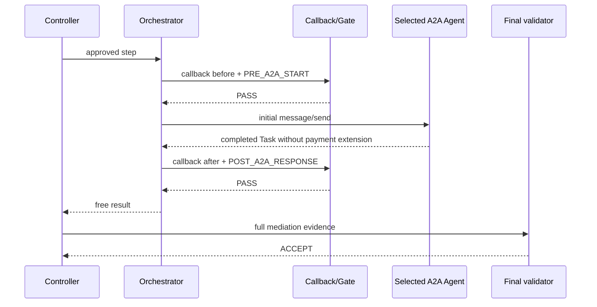
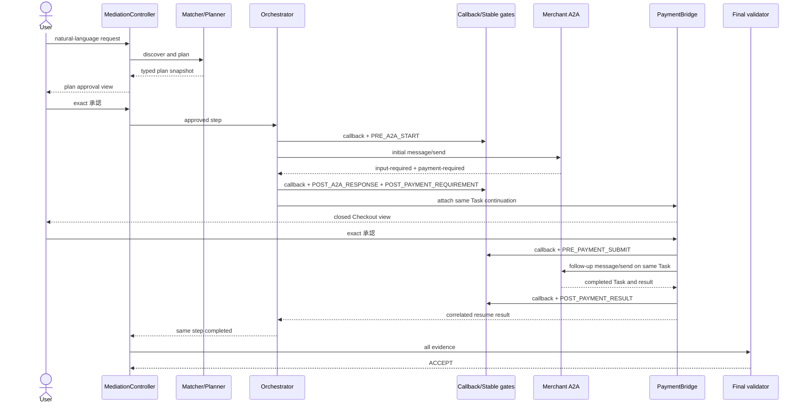

# 仲介エージェント決済統合：Mediation Flow設計

## 1. 文書の責務

本書は `ART-AUTH-ROUTING-01` と `ART-GATE-SCHEDULE-01` のsemantic／invocation owner、および `ART-PLAN-APPROVAL-01`、`ART-DOMAIN-CONTEXT-01`、`ART-PAYMENT-BRIDGE-01` のinvocation ownerとして、入口からfinal validationまでの制御順序を定義する。

### ART-AUTH-ROUTING-01

保留中承認のcandidate filter、優先順位、曖昧時の拒否、明示選択後の再検証を本書だけが意味・実行ともに所有する。

### ART-PLAN-APPROVAL-01

計画承認artifactの対象、完全一致入力、発行条件、失効条件とorchestrator開始前の検証を本書だけが所有する。serialized formと保存mappingは06／08へ委譲する。

### ART-GATE-SCHEDULE-01

Stable anomaly gateの発火点、順序、回数、各PASS後に許す次の副作用を本書だけが所有する。判定policyは05へ委譲する。

## 2. 対象範囲と対象外

本書はstateをいつ遷移させ、どのguard成功後にどの副作用を許すかを所有する。domain field／state名は [02](02_DOMAIN_DATA_STATE.md#9-状態model)、payment semanticsは [04](04_PAYMENT_BRIDGE_AP2_X402.md#3-bridgeの入力出力責務)、gate判定policyは [05](05_SECURITY_TRUST_BOUNDARIES.md#7-従来security-callbackとstable-anomaly-gate)、wire DTOは [06](06_API_A2A_CONTRACTS.md#3-contract共通規約とversioning)、transactionは [08](08_PERSISTENCE_RECOVERY.md#5-transaction-boundaryとcas) が所有する。

final6の実行系は正常paid、free、refundを一つのowner-scoped turn routerで扱う。paidは計画の完全一致 `承認` とclosed支払条件の完全一致 `承認` を別request/versionで消費し、検証済みAP2 Mandateから仲介保証を発行してsame Taskをresumeする。freeは計画承認後にpayment recordを作らず完了する。refundはsettled後の履行拒否を `RefundPending` へ映射し、追加の完全一致承認後だけ `Refunded` へ進む。

## 3. 入口から仲介開始まで

公開rootは検証済みidentity assertionを `SubjectScope` へ変換し、単一text partとsession contextを `MediationCommand` にする。command処理順は次で固定する。

公開のmutation入口はsame-origin `POST /mediation-api/v1/turns` 一つだけである。proxyが付与する署名済み `subject/tenant/adk_session` からcontrollerがauthoritativeなactive mediation sessionを解決する。bodyの `workflow_id`、`mediation_session_id`、`subject`、`tenant_id` をlookup selectorまたは認可根拠にしない。`POST /workflows/{workflow_id}/messages` を含むworkflow-id直指定mutationはpublic routeとして定義しない。

1. identity、CSRF／origin、request size、content typeを入口で検証する。
2. owner scopeでpending approval候補をqueryする。
3. 入力が単一text partの完全一致 `承認` または明示拒否なら§5.1でrouteする。それ以外、またはpending 0件なら通常依頼として新しいmediation sessionを作る。
4. 同じclient request IDの再送は既存command resultを返し、新sessionを重複作成しない。
5. commandはstage eventと次actionを保存してrequestを終了する。承認待ちを同期requestで保持しない。

`payment_user_agent` はroute候補を推測しない。backendが返す `routing_decision` を表示するだけである。本線は `payment_user_agent/agent.py:root_agent -> secure_mediation_agent/composition.py:create_production_agent -> mediation/controller.py:MediationController` とし、現行 `PaymentWorkflowAdapter`直接線を残さない。

## 4. Agent検索と計画作成

controllerはgoal digestとowner scopeを持つ `MATCH_REQUESTED` を保存し、MatcherAdapterへ依頼する。adapterはregistry recordとlive Agent Cardを取得・検証し、候補ごとに `SelectedAgentSnapshot` を返す。候補0、Card不一致、外部通信失敗では支払／Task副作用なしでBlockedまたはReviewRequiredとする。

TypedPlannerAdapterはgoalとvalidated snapshotsだけを受け、ordered typed stepsを返す。controllerはschema、全stepのAgent参照、上限、capability、重複IDを検証してplan ID/version/digestを生成する。LLMが返したendpointや「承認済み」表現は破棄する。plan作成と `WaitingForPlanApproval` への遷移は同一consistency unitで記録する。

Matcher／Planner／Orchestrator／callback／anomaly/final detectorは [01のproduction composition seam](01_OVERVIEW_ARCHITECTURE.md#production-composition-seam) に列挙した既存symbolをtyped adapterが実呼出しす。各開始／完了eventの `implementationSymbol`、`inputDigest`、`outputDigest`、`callOrdinal` を同じoperation chainに保存し、その欠落は成功としない。

## 5. 計画承認gate

計画承認対象は `plan_id/version/digest`、owner scope、expiryへbindingする。完全一致 `承認` を受けても、対象snapshot変更、expiry、owner mismatch、CAS競合があれば不成立である。承認artifact保存と `Executing` 遷移、初回Task用outbox追加は一つのtransactionだが、remote callはcommit後workerが行う。

### 5.1 保留中承認の候補filterと排他的routing decision table

backendは `(subject, tenant_id, adk_session_id, mediation_session_id)` 完全一致、未期限切れ、未完了のpendingだけを候補にする。別scopeや期限切れは件数にも含めない。

| payment pending | plan pending | routing decision | side effect |
| ---: | ---: | --- | --- |
| 1 | 任意 | 唯一のpayment approvalへroute | 他record 0件 |
| 2以上 | 任意 | `APPROVAL_TARGET_AMBIGUOUS`、同種を明示選択 | approval 0件 |
| 0 | 1 | 唯一のplan approvalへroute | 他record 0件 |
| 0 | 2以上 | `APPROVAL_TARGET_AMBIGUOUS`、同種を明示選択 | approval 0件 |
| 0 | 0 | 承認扱いせず通常依頼 | approval 0件 |

明示選択tokenは将来の別public schema versionでbackendが発行する短命・one-time・owner-bound tokenであり、raw workflow IDだけを選択子にしない。token利用後もcandidate filterとversion CASを再実行する。final6の `mediation-turn-request/1` では `selectionToken` は常にJSON `null` で、non-null selectorを拒否し、同種pending複数は選択せずfail closedにする。

## 6. Orchestratorと初回A2A実行

workerはapproved plan、step、Agent snapshot、expected versionをloadし、orchestratorの従来tool callback/security hook（before）とdeterministic `PRE_A2A_START` policyを実enforcementとして実行する。両方成功後だけsnapshotの `rpc_endpoint` へ初回 `message/send` を一度送る。anomaly_detector subagentは意味的な不確定さを `REVIEW` へescalateする場合に限り、各A2A境界の必須実enforcementとして起動しない。requestはoperation IDとstep-scoped idempotency keyを持つ。

response受領後は完全なstructured Taskを上限付きで保存し、従来security callback（after）、`POST_A2A_RESPONSE` の順に実行する。Task state、parts、extensionをtextへ縮退してから分岐してはならない。

Release-1の正常same-Task保護は、初回応答を受けた時点でTask/contextと全structured bytesをcommitしてからUIを表示すること、同一submitで同一idempotency keyを使うことである。初回 `message/send` の応答喪失でremote Task IDが不明な場合は自動で再送せず `ReviewRequired` で停止する。remoteからの完全回復は [12 future work](12_DECISIONS_OPEN_QUESTIONS.md#future-work-register) に送る。

デモ用live external A2A executorは、外部Agentごとに独立した `InMemoryTaskStore` を構成し、各Agentが返すstructured TaskをそのAgentのstoreで完了させる。store共有によるTask衝突やcross-agent参照を許さない。このstoreはlive A2A正常系を示すためのprocess-local実装であり、再起動耐久性の正本にはしない。

## 7. 無料応答の取込み

`POST_A2A_RESPONSE=PASS` かつTask stateが厳密に`completed`で、検証済みpayment requirementがなく、空でないtext partまたはfile artifactを一つ以上持つ場合だけfree結果をstepへ取り込む。textを持たず有効なfile artifactだけを返す外部Agentにはfile metadataから安全な表示用結果を構成できるが、空text、空file、未知part、`working`／`input-required`を成功へ昇格しない。この経路では `PaymentRequirementSnapshot`、continuation、payment workflow、Payment Mandate、settlementの作成call countをすべて0とする。

結果取込み後、次stepがあれば§6へ進む。全step終了なら§11へ進む。freeでも従来callbackとfinal validationを省略しない。このfree限定fallbackを有料Taskへ適用せず、有料では§8-9のpayment requirement、AP2、保証、same-Task相関を全て満たす。

**FIG-FLOW-02 無料正常系**

## 8. 支払要求での停止とbridge handoff

`POST_A2A_RESPONSE=PASS` 後、A2A parserが許容stateとpayment extensionを認識した場合だけ `POST_PAYMENT_REQUIREMENT` を追加で一回実行する。PASS後、controllerはTask snapshot、requirement snapshot、approved plan／step、owner scopeを一つのcontinuationへattachし、stepを `WaitingForPaymentApproval` にする。

continuation作成とpayment workflow attachはidempotent commandである。UIへ返す前に安全なpayment approval viewを生成するが、Credential、Mandate、submit outboxは作らない。unknown profileは `PAYMENT_PROFILE_UNAVAILABLE`、表明済みだが不正なprofileは `PAYMENT_PROFILE_INVALID` とし、silent fallbackしない。

## 9. 支払後の同一step再開

payment-required受領turnでは、controllerが`payment_bridge.attach`を直接呼び、continuationを`WaitingForPaymentApproval`として保存してcardを返す。この時点でpayment artifactは0件である。

次turnの単一text完全一致`承認`だけをdeterministic session routerがrouteし、controllerが`payment_bridge.approve`、続いて`execute_approved_payment`を呼ぶ。approveでTrusted SurfaceがPayment Mandateを生成し、executeでpre-payment authorization envelopeの保存、非法的・未settledのsigned simulation guarantee発行、guarantee submit、Merchant `working`、仲介railの同期simulation settlement、receipt付きcommit、Merchantの業務履行／同一Task完了を順に進める。orchestrator／LLMはattach、approve、execute、Mandate、guarantee、ledger、refundの主体ではない。

Merchant結果は保存後、従来callback（after）、`POST_PAYMENT_RESULT` を通す。PASSかつtask/context/order/quote/step/workflow一致の場合だけ `ResumingA2A -> StepCompleted` とする。timeoutやack喪失は新Task／新idempotency keyを作らずreconciliationへ渡し、解決不能はReviewRequiredとする。

支払完了後の正常refundは、同じsession routerがownerとoriginal receiptを解決し、RefundRequestの表示、明示承認、CAS、同じoriginal Task/context/order/paymentに対するrefund submit、RefundResult取込みの順とする。詳細semanticsは [04 §10](04_PAYMENT_BRIDGE_AP2_X402.md#10-支払提出と結果取込みの意味論)、wireは [06 §12](06_API_A2A_CONTRACTS.md#12-resultartifacterror-contract) が所有する。

**FIG-FLOW-01 有料正常系**

## 10. Anomaly gateと従来callbackの実行点

**FIG-FLOW-03 Gate scheduleと副作用許可点**

```mermaid
flowchart LR
  A["Plan approved"] --> C1["legacy callback before"]
  C1 --> G1["PRE_A2A_START"]
  G1 -->|PASS| S1["initial Task request"]
  S1 --> C2["legacy callback after"]
  C2 --> G2["POST_A2A_RESPONSE"]
  G2 -->|free PASS| I1["result intake"]
  G2 -->|paid candidate| G3["POST_PAYMENT_REQUIREMENT"]
  G3 -->|PASS| W["continuation + approval view"]
  W --> C3["legacy callback before"]
  C3 --> G4["PRE_PAYMENT_SUBMIT"]
  G4 -->|PASS| S2["payment follow-up"]
  S2 --> C4["legacy callback after"]
  C4 --> G5["POST_PAYMENT_RESULT"]
  G5 -->|PASS| I2["same-step intake"]
```

各deterministic gate/callbackは `(gate_id, operation_id, input_digest)` でexactly-once logical decisionを持つ。retryは保存済みdecisionを再利用するか同じattempt recordへ追記し、別layerを代用しない。paid単一stepでA2A callback before/afterと決済deterministic validatorが図の順で必須、free単一stepではA2A callback before/afterが必須である。anomaly subagentの呼出し回数は固定せず、`semantic-review-requested` の時だけ別eventで証明する。判定semanticsは05を参照する。

## 11. Final validation

全stepがsuccessful terminalになった後、controllerは元依頼、approved plan、全Task履歴digest、callback／gate decision、payment要約、artifact／receipt参照、candidate runtime versionをfinal validatorへ渡す。wrapperはschema validationとdeterministic critical-rule評価を行う。

`ACCEPT` の保存とCompleted遷移後にだけ最終成功viewを返せる。REJECTはRejected、REVIEW、timeout、parse/model error、evidence不足はReviewRequiredである。最終validatorをretryしても、元input digestを変更しない。

## 12. 複数step・再計画・停止

- paid stepだけを待機させる。独立stepの並列実行を将来許す場合も、approval routingとaggregate CASを満たすまで本baselineでは直列実行とする。
- step失敗、決済拒否、条件変更後の選択は `cancel`、`replan`、明示reviewとし、成功へ縮退しない。
- replanはplan version/digestを更新し、未使用stepを置換する。既実行副作用はeventとして残し、旧approvalは失効する。
- cancelはpending outboxをcancelledにし、すでに送信中／結果不明ならReviewRequiredとする。
- 独立step並列、複数pendingの高度な明示選択、複雑retry/reconciliationはRelease-1のblockingにせず [12 future work](12_DECISIONS_OPEN_QUESTIONS.md#future-work-register) に送る。Release-1は1 sessionにauthoritative active turnと一度に1つの実行副作用を許す。

**TBL-FLOW-01 Stage handoff**

| stage | input | output | state参照 | next owner |
| --- | --- | --- | --- | --- |
| discover | goal＋owner | Agent snapshots | Discovering | planner |
| plan | snapshots | plan snapshot | Planning | approval gate |
| plan approve | exact input＋plan ref | approval artifact | WaitingForPlanApproval | orchestrator |
| initial A2A | approved step | Task snapshot | Executing | free intake／payment parser |
| attach | Task＋requirement | continuation | WaitingForPaymentApproval | PaymentBridge |
| payment approve | exact input＋Checkout | approval／outbox | PaymentSubmitting | worker |
| resume | Merchant result | step result | ResumingA2A | next step／final |
| final | complete evidence | final decision | FinalValidation | UI projection |

## 13. 適用要件

<!-- GENERATED: design-coverage v1; source=11_TRACEABILITY_RELEASE.md -->

| 要件ID | 要件へのリンク | primary design section | 検証先 |
| --- | --- | --- | --- |
| `FR-003` | [要件](../MEDIATOR_PAYMENT_INTEGRATION_REQUIREMENTS.md#fr-003-動的なagent選定と計画) | [FR-003](#fr-003) | [TEST-002](10_TEST_STRATEGY.md#test-002)、[TEST-008](10_TEST_STRATEGY.md#test-008)、[AC-001](10_TEST_STRATEGY.md#ac-001)、[AC-002](10_TEST_STRATEGY.md#ac-002) |
| `FR-004` | [要件](../MEDIATOR_PAYMENT_INTEGRATION_REQUIREMENTS.md#fr-004-計画承認gate) | [FR-004](#fr-004) | [TEST-003](10_TEST_STRATEGY.md#test-003)、[TEST-007](10_TEST_STRATEGY.md#test-007)、[AC-003](10_TEST_STRATEGY.md#ac-003) |
| `FR-005` | [要件](../MEDIATOR_PAYMENT_INTEGRATION_REQUIREMENTS.md#fr-005-a2a応答による支払要否判定) | [FR-005](#fr-005) | [TEST-001](10_TEST_STRATEGY.md#test-001)、[TEST-004](10_TEST_STRATEGY.md#test-004)、[TEST-007](10_TEST_STRATEGY.md#test-007)、[AC-001](10_TEST_STRATEGY.md#ac-001)、[AC-002](10_TEST_STRATEGY.md#ac-002)、[AC-012](10_TEST_STRATEGY.md#ac-012) |
| `FR-006` | [要件](../MEDIATOR_PAYMENT_INTEGRATION_REQUIREMENTS.md#fr-006-仲介stepの停止と継続) | [FR-006](#fr-006) | [TEST-003](10_TEST_STRATEGY.md#test-003)、[TEST-007](10_TEST_STRATEGY.md#test-007)、[TEST-013](10_TEST_STRATEGY.md#test-013)、[AC-001](10_TEST_STRATEGY.md#ac-001)、[AC-006](10_TEST_STRATEGY.md#ac-006)、[AC-011](10_TEST_STRATEGY.md#ac-011) |
| `FR-010` | [要件](../MEDIATOR_PAYMENT_INTEGRATION_REQUIREMENTS.md#fr-010-強制的なsecurity-anomaly-gate) | [FR-010](#fr-010) | [TEST-006](10_TEST_STRATEGY.md#test-006)、[TEST-009](10_TEST_STRATEGY.md#test-009)、[AC-001](10_TEST_STRATEGY.md#ac-001)、[AC-002](10_TEST_STRATEGY.md#ac-002)、[AC-008](10_TEST_STRATEGY.md#ac-008) |
| `FR-011` | [要件](../MEDIATOR_PAYMENT_INTEGRATION_REQUIREMENTS.md#fr-011-最終異常検知) | [FR-011](#fr-011) | [TEST-006](10_TEST_STRATEGY.md#test-006)、[TEST-007](10_TEST_STRATEGY.md#test-007)、[AC-009](10_TEST_STRATEGY.md#ac-009) |
| `FR-012` | [要件](../MEDIATOR_PAYMENT_INTEGRATION_REQUIREMENTS.md#fr-012-無料経路) | [FR-012](#fr-012) | [TEST-007](10_TEST_STRATEGY.md#test-007)、[AC-002](10_TEST_STRATEGY.md#ac-002) |

### FR-003

matcher snapshotをtyped planへ固定し、orchestratorはそのRPC endpoint／Card digest／skill／capabilityを実送信へ使用する。

### FR-004

plan ID/version/digestへbindingされた完全一致承認とCAS成功後だけ初回A2A outboxを作る。

### FR-005

支払分岐はstructured Task state、Card capability、validated extensionの組だけで行い、text／request flagは参照しない。

### FR-006

paid stepをcontinuationとして保存し、requestを終了して、後続turnで同一owner／plan／step／Taskを再開する。

### FR-010

§10のcallbackと5 gateを独立実行し、BLOCK／REVIEW／失敗後の副作用を禁止する。

### FR-011

全step後に§11を必ず実行し、ACCEPT前の最終成功返却を禁止する。

### FR-012

§7のfree経路はpayment artifactを0件のまま完了し、callback、2 gate、final validationを維持する。

## 14. 関連文書と参照方向

| 参照先 | 理由 | 正本節 | 本書で再掲しない内容 |
| --- | --- | --- | --- |
| [02](02_DOMAIN_DATA_STATE.md) | domain state | §4-11 | field／state semantics |
| [04](04_PAYMENT_BRIDGE_AP2_X402.md) | bridge handoff | §3-10 | AP2／profile semantics |
| [05](05_SECURITY_TRUST_BOUNDARIES.md) | gate policy | §5-10 |判定mapping／timeout |
| [06](06_API_A2A_CONTRACTS.md) | invocation DTO | §5-12 | wire field／error |
| [07](07_UI_TRACE.md) | projection | §4-10 | 画面表示 |
| [08](08_PERSISTENCE_RECOVERY.md) | transaction | §5-9 | CAS／outbox／recovery |

## 15. Decision参照

[OQ-001](12_DECISIONS_OPEN_QUESTIONS.md#oq-001)、[OQ-005](12_DECISIONS_OPEN_QUESTIONS.md#oq-005)、[OQ-010](12_DECISIONS_OPEN_QUESTIONS.md#oq-010) をaccepted decision inputとして参照する。
