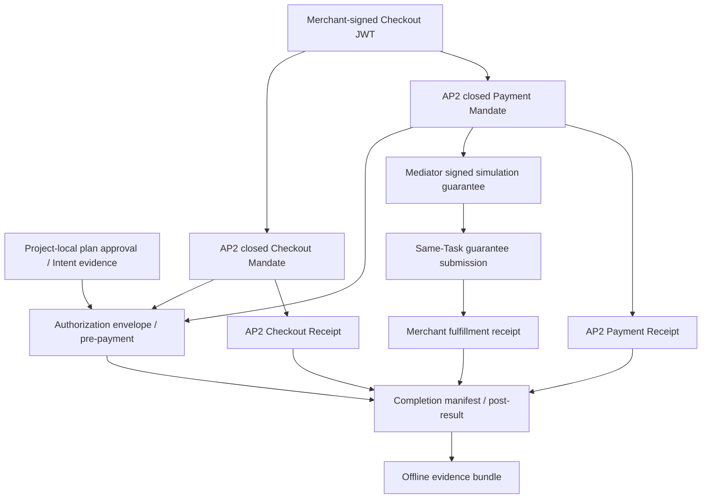
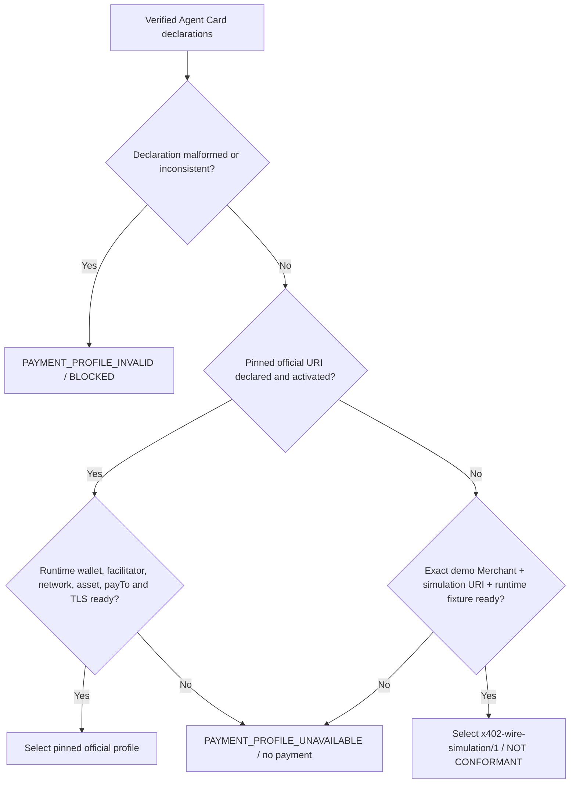
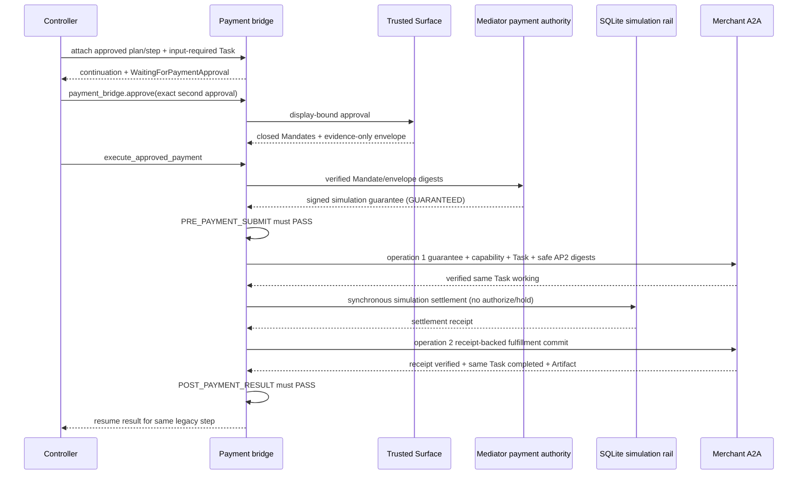

# 仲介エージェント決済統合：Payment Bridge・AP2・x402設計

- lifecycle: `target`
- status: 設計baseline
- primary owner: Payment protocol owner
- required reviewer: Security owner／Conformance reviewer
- 非主張: 本書は実装済み、candidate検証済み、公式x402準拠、実資産決済を意味しない

## 1. 文書の責務

本書は、承認済み仲介stepを決済workflowへattachし、Human Presentの決済承認、AP2 evidence、選択済みpayment profile、支払結果を同じstepへ返すまでの**意味論**の正本である。

本書がsemantic ownerを持つartifactは次の3件である。

- `ART-PAYMENT-BRIDGE-01`: attach／approval／submit／resumeの意味と不変条件
- `ART-PAYMENT-APPROVAL-01`: 決済承認artifactとAP2 artifactへのbinding
- `ART-AP2-EVIDENCE-01`: AP2 evidence object、canonical bytes、署名／digest、offline evidence graph

JSON field、HTTP header、A2A Message／Taskのserialized shapeは [06](06_API_A2A_CONTRACTS.md)、承認入力の候補filterとroutingは [03](03_MEDIATION_FLOW.md)、鍵・認可・fail-closed policyは [05](05_SECURITY_TRUST_BOUNDARIES.md) を正本とする。本書はそれらを再定義しない。

## 2. 対象範囲と対象外

対象範囲:

- 承認済みplan／stepと検証済みremote Taskをbridgeへattachする前提
- 計画承認と決済承認の意味上の分離
- AP2 Human Presentのrole、closed Mandate、Credential、Receiptのevidence topology
- 仲介固有correlationをAP2標準schemaを壊さず結合する方法
- 公式profileとproject-local simulationの排他的選択
- 支払提出、結果取込み、同一step再開の意味上の成功条件
- UI、証跡、PR、conformance reportで許されるclaim境界

final6 implementationは、payment-required受領turnでcontrollerが`payment_bridge.attach`を呼び、`WaitingForPaymentApproval`とcardを返す。この時点のpayment artifactは0件である。

次turnのexact approval後、controllerが`payment_bridge.approve`、続いて`execute_approved_payment`を呼び、Mandate／内部envelope／guarantee／settlement／commitを決定論的に進める。仲介railは実holdなしの同期SQLite simulation settlementだけを記録する。Merchantは保証、capability、Task相関、安全なAP2 digest要約、receiptの検証後だけ同一Taskの業務履行をcommitし、決済／settlementは実行しない。これは`x402-wire-simulation/1`でありofficial x402やon-chain適合を主張しない。

対象外:

- pending approvalのrouting順序、状態遷移、gate発火順序: [03](03_MEDIATION_FLOW.md)
- domain ID、snapshotのcanonical bytes、state名: [02](02_DOMAIN_DATA_STATE.md)
- payload、JWT claim、header、error envelopeのfield定義: [06](06_API_A2A_CONTRACTS.md)
- key custody、detector判定、secret redaction: [05](05_SECURITY_TRUST_BOUNDARIES.md)
- DB table、CAS、outbox、reconciliation: [08](08_PERSISTENCE_RECOVERY.md)
- UI文言とprojection: [07](07_UI_TRACE.md)
- 公式wallet、facilitator、実network／asset、on-chain settlement、Human Not Present

## 3. Bridgeの入力・出力責務

Payment bridgeは仲介全体のcontrollerではない。検証済みpayment-requiredを受領したcontrollerだけが`payment_bridge.attach`を呼び、continuationと`WaitingForPaymentApproval`を作る。次turnの完全一致承認後もcontrollerだけが`payment_bridge.approve`と`execute_approved_payment`を順に呼ぶ。orchestrator／LLMはattach、approve、executeの主体ではなく、承認、署名、Mandate、保証、台帳効果を生成しない。

attach入力は、次のimmutable referenceがすべて同じcorrelation chainを指す場合だけ受理する。

- `BoundSubjectContext`: Firebaseで検証したsubject、tenant、ADK session、mediation session
- `ApprovedPlanRef`: plan ID、version、digest、計画承認ID／nonce／issued-at／expiry
- `ApprovedStepSnapshot`: step ID、上限、通貨、選定Agent snapshot、skill、endpoint
- `RemoteTaskSnapshot`: `input-required`のcontext／task、order、quote、受信payload／Artifact digest
- `PaymentRequirementSnapshot`: closed Checkout、支払条件、profile宣言、expiry、requirements digest
- `SecurityDecisionRef`: `POST_A2A_RESPONSE` と `POST_PAYMENT_REQUIREMENT` の各 `PASS`

attachは次をatomicな論理結果として返す。ただし物理transactionとoutboxの境界は [08](08_PERSISTENCE_RECOVERY.md) が所有する。

- 一意なcontinuationとpayment workflowの参照
- immutableなCheckout／requirements snapshot
- `WaitingForPaymentApproval`へ遷移可能であるという結果
- 利用者へ投影できる安全な承認表示source
- `created` または同一入力に対する `already-attached` の冪等結果

次の場合、bridgeはrecordを作らず拒否する。

- plan承認がない、失効している、またはplan version／digestが異なる
- stepが実行中でない、または別step／別sessionである
- Remote Taskが許容stateでない、または構造化payment requirementがない
- subject、Agent、Card、endpoint、skill、task、context、order、quoteのいずれかが不一致
- profileが未選択、未知、不一致、またはruntimeで利用不能
- 必須gateが `PASS` でない

bridgeの公開操作は意味上 `attach`、`render-approval`、`authorize`、`submit`、`accept-result`、`status` とする。正確なserialized operationは [06のContinuation／payment bridge contract](06_API_A2A_CONTRACTS.md#6-continuationpayment-bridge-contract) が所有する。

## 4. 仲介計画へのattach

attachは計画承認を取り直さない。第一承認をproject-localなIntent evidenceとして取り込み、支払に必要なclosed Checkoutへつなぐ。第一承認が認可した上限や対象Agentを、第二承認が拡張することはない。

attach時のguardは次の順で評価する。

1. subject／tenant／ADK session／mediation sessionを一致させる。
2. plan ID／version／digestと計画承認を検証する。
3. step IDと選定Agent snapshotをplan内のimmutable stepへ一致させる。
4. Remote Taskのcontext／taskとproject-local order／quoteを初回A2A応答へ一致させる。
5. requirementsとMerchant-signed Checkoutを検証し、それぞれのdigestを再計算する。
6. planの上限、通貨、許可payment条件へclosed Checkoutが収まることを確認する。
7. [8章](#8-payment-profile選択)のprofile選択を完了する。
8. 必須security decisionを確認し、continuationを一度だけ作る。

同じattach idempotency keyと同じ入力digestの再送は同じcontinuationを返す。同じkeyで入力digestが異なる場合は `IDEMPOTENCY_CONFLICT` とし、既存continuationを変更しない。

free応答はattach対象ではない。free stepに対してbridge、Payment Mandate、payment workflow、settlement recordを作ることは禁止する。

## 5. 決済承認境界

決済承認は、Merchantが提示したclosed Checkoutに対するHuman Presentの第二承認である。計画承認とは別のtarget digest、nonce、承認ID、issued-at、expiryを持つ。

承認画面sourceは少なくとも次を含み、そのcanonical display digestを承認artifactへ結合する。

- 商品、数量、正の整数最小単位の金額、通貨
- payee、scheme、network、asset、profile
- quoteとCheckoutの期限
- plan／step／remote Taskの安全な参照
- simulationの場合の `simulation` と `NOT CONFORMANT`
- 第一承認とは別の行為であり、単一text partの完全一致 `承認` だけが有効であること

入力routingは [03の排他的routing decision](03_MEDIATION_FLOW.md#51-保留中承認の候補filterと排他的routing-decision-table) が完了した後にbridgeへ渡す。bridgeは選択済みpending recordについて、次を再検証してから承認artifactを発行する。

- authenticated subject tupleのbinding、および将来schemaで明示選択済みの場合だけowner-bound selection proof
- continuation ID、version、state、expiry
- Checkout／requirements／displayのdigest
- plan／step／Task／quote／profileのbinding
- concurrent updateがないこと

完全一致 `承認` は権限を新規作成する入力であり、それ自体を署名tokenとして保存しない。Trusted Surfaceは検証済み入力から署名済みpayment approval artifactを作り、raw UI messageとは別に監査する。

商品、数量、金額、通貨、payee、期限、scheme、network、asset、quote、Checkout、profile、Task、stepのいずれかが変われば承認を失効させる。失効後は新条件の表示と再承認、または安全な取消／再計画が必要である。旧承認からPayment Mandate、Credential、支払payloadを生成してはならない。

拒否は支払payload、Payment Mandate、settlementを生成しない。拒否をMerchantへ伝える必要がある場合も、同じTaskへの `payment-rejected` messageを一度だけ送り、業務成功へ読み替えない。

## 6. AP2 roleとevidence topology

本設計はAP2 v0.2のHuman Present（Direct）を対象とし、Trusted Surfaceを常に決定論的コンポーネントとして扱う。Shopping Agentはagenticでよいが、Mandateの組立、署名、verification、Credentialのscope、Receiptの検証をLLMへ委譲しない。

**FIG-PAY-01 仲介計画からAP2 artifact、支払結果までのevidence graph**

**TBL-PAY-01 AP2／project-local／x402 artifactの分類とowner**

| Artifact | 分類 | 発行／検証role | 意味 | 標準schemaへの扱い |
| --- | --- | --- | --- | --- |
| 計画承認／Intent evidence | project-local | mediation authority | 利用者が承認したplan／上限／Agent | AP2 Mandateと呼ばない |
| Merchant Checkout JWT | project-local commerce object | Merchant | closed Checkoutの署名済み正本 | AP2 Mandateがhash参照する |
| closed Checkout Mandate | AP2 | Trusted Surface | Checkout完了のHuman Present認可 | 仲介内部で検証しraw bytesをMerchantへ送らない |
| closed Payment Mandate | AP2 | Trusted Surface／CP／MPP | Checkoutに対する支払認可 | pinned AP2 `vct`へ完全一致 |
| signed simulation guarantee | project-local | mediator payment authority | 業務履行を許可する非法的・未settledのsimulation commitment | AP2 Credential/Receipt、実hold、後日精算契約とは主張しない |
| Payment／Checkout Receipt | AP2 | MPP／Merchant | accept／rejectと処理結果 | 対応Mandate digestを参照する |
| `x402.payment.receipts` | x402またはsimulation profile | Merchant | Task上のguarantee acceptance／fulfillment履歴 | settlement receiptやAP2 Receiptと同一視しない |
| authorization envelope | project-local | evidence authority | 仲介認可とpre-payment artifact digestの結合 | AP2 objectへ独自fieldを挿入しない |
| completion manifest | project-local | evidence authority | authorization digestに実行後のReceipt／result／observationを一方向結合 | pre-payment objectから逆参照させない |

AP2 artifactは各roleが、issuer、audience／subject、`vct`、nonce、issued-at、expiry、signature、Checkout hash、Mandate／Receipt referenceを検証する。roleが同一deployableに同居しても検証を省略しない。

## 7. 仲介correlationのevidence binding

仲介固有fieldをAP2標準Mandateへ直接追加しない。代わりに決済前の署名済み `mediation-authorization-envelope/v1` と、結果後の署名済み `mediation-completion-manifest/v1` の2層をproject-local evidenceとして作る。authorizationはreceipt／result／将来時刻を持たずimmutableである。completionはauthorization digestを参照するが、authorization bytesからcompletionを参照しない。この一方向設計は [OQ-008](12_DECISIONS_OPEN_QUESTIONS.md#oq-008) のaccepted decisionに従う。

**TBL-PAY-02 correlation対象とbinding先**

| Correlation対象 | Envelopeのbinding | AP2／wire側の参照 | Offline検証 |
| --- | --- | --- | --- |
| subject、tenant、ADK／mediation session | private subject binding | UI／LLMへ投影しない | envelope署名と完全一致を確認 |
| plan ID／version／digest、step ID | approved plan reference | plan approval evidence digest | plan snapshotを再digest |
| plan approval ID／nonce／issued-at | plan approval reference | project-local Intent evidence | 承認artifactの署名・expiryを検証 |
| canonical Agent、Card digest、skill、RPC endpoint | selected Agent reference | capabilityとA2A project metadata | pinned snapshotと一致確認 |
| context／task／order／quote | remote Task reference | A2A Message／Task、capability | start／submit／resultの連続性を確認 |
| 商品、金額、通貨、payee、期限、方式 | checkout terms digest | Checkout JWT、closed Mandates | canonical termsの全field比較 |
| payment approval ID／nonce／issued-at | payment approval reference | Trusted Surface発行artifact | target display／Checkout digestを確認 |
| 各AP2 objectのID／issuer／audience／nonce／iat／exp | artifact descriptorとdigest | 各AP2 object自身 | objectごとに独立して検証 |
| Credential、proof | authorization側のartifact descriptor | Merchant用の最小submission package | 署名、scope、使用期限を検証 |
| Receipt、x402 result、attempt observation | completion側のresult descriptor | final Task／offline bundle | authorization digest、署名、receipt historyを検証 |

authorization/completionのevidence rootは、artifact descriptorをkind、ID、digestの決定順に並べたcanonical bytesから作る。domain snapshotのcanonicalization algorithm自体は [02](02_DOMAIN_DATA_STATE.md)、両schemaのserialized field／required／unknown reject／generation orderは [06](06_API_A2A_CONTRACTS.md) が所有する。

offline verifierへ渡すbundleは、authorization envelope、completion manifest、全参照artifactのimmutable bytes、公開JWK snapshot、profile descriptor、verification policy versionを含む。外部DBの暗黙知なしに署名連鎖と全必須correlationを判定できなければならない。秘密鍵、raw wallet secret、Firebase tokenはbundleに含めない。Merchantへはbundle、raw authorization envelope、raw Mandate、credential、proofを送らず、signed simulation guarantee、scope限定capability、Task/context/order/quote/terms、safe AP2 digest要約、profileだけを送る。

## 8. Payment profile選択

profile選択はPayment Mandateの発行前に決定し、承認表示、Mandate、Credential、wire、Receiptの全てへ固定する。一つの支払試行で複数profileを混在させない。

**FIG-PAY-03 payment profile選択のdecision flow**

選択規則:

1. Agent Cardでcanonical extension URI、`required`、A2A capability declarationを検証する。project-local Card schemaを明示定義しない限り、scheme／network／asset／payToをCard fieldとして比較しない。
2. scheme／network／asset／payToはMerchantの署名済みpayment requirementとCheckout、runtime readiness、capability、submission payload、receipt間で比較する。pinned official profileはこれらとwallet／Signing Service、facilitator verify／settle、TLS、readinessがすべて検証できる場合だけ候補にする。
3. `x402-wire-simulation/1` はcanonical Agent `agent-005` のdemo Merchantがproject-local URIを単独宣言し、`exact-simulated`、`demo:local`、allowlisted asset／payeeを提示した場合だけ候補にする。
4. official declarationが存在するがruntimeが不足する場合、simulationへfallbackしない。`PAYMENT_PROFILE_UNAVAILABLE` として停止する。
5. 宣言済みprofileのURI、version、metadata、requirementsが破損または不一致なら `PAYMENT_PROFILE_INVALID` として `BLOCKED` にする。
6. 選択後のprofile変更はCheckout変更として旧決済承認を失効させる。

`PAYMENT_PROFILE_UNAVAILABLE` と `PAYMENT_PROFILE_INVALID` ではAP2 Payment Mandate、payment credential、支払payload、settlementを作らない。計画承認済みであることを、AP2-onlyや直接railへのfallback理由にしてはならない。

## 9. x402 wire simulationの意味境界

`x402-wire-simulation/1` は、pinned A2A x402 v0.1のTask correlationとmetadata lifecycleを試験するproject-local fixtureであり、公式profileではない。

固定する意味:

- extension URIはproject-local URIでありcanonical x402 URIではない。
- schemeは `exact-simulated`、networkは `demo:local` である。
- proofはsyntheticで、`simulated=true`、`walletSigned=false` を署名対象へ含める。
- transaction referenceは `sim:` namespaceであり、on-chain hashではない。
- local ledgerの成功は `settled on-chain` を意味しない。
- UI、evidence、Task metadata、conformance report、PRには `simulation` と `NOT CONFORMANT` を表示する。

simulationもTask、requirements、nonce、payload、receipt history、idempotencyを検証し、検証失敗を成功へ読み替えない。profileがproject-localであることは、signed capability、AP2 evidence、Human Present承認、Merchantの副作用前検証を省略する理由にならない。

## 10. 支払提出と結果取込みの意味論

**FIG-PAY-02 bridge attach、approval、submit、resumeのsequence**

支払提出を許可する必要十分条件は次の全てである。

- current continuationが同一subject tupleで `PaymentSubmitting` にある
- plan approvalとpayment approvalが有効で、対象digestが変化していない
- closed Checkout／Payment Mandateとauthorization envelopeのoffline相当検証が成功する
- signed simulation guaranteeのoffline相当検証が成功する
- selected profileのruntime readinessとwire生成が成功する
- `PRE_PAYMENT_SUBMIT=PASS`
- payment submit capabilityがplan／step／Agent／operation／task／context／expiryへ限定される
- 同じidempotency keyに別request digestが存在しない

Merchantはcapability、profile activation、Task相関、requirements、signed guaranteeのissuer/scope/amount/currency/payee/expiry、safe AP2 digest要約を**fulfillmentより前**に検証する。一つでも失敗すれば状態変更と業務副作用を0件のまま構造化errorを返す。MerchantはこのA2A operationでsimulation決済やsettlementを実行しない。

actor順の正本は、Human approval → Trusted SurfaceによるAP2 Mandate／内部envelope → mediator payment authorityによるguarantee → guarantee submission → Merchant検証／same-Task `working` → 仲介SQLite railの同期simulation → settlement receipt付きcommit → Merchantのreceipt検証／業務履行／same-Task completionである。real rail holdは未実装で、simulation guaranteeは法的保証でもsettled証明でもない。

結果取込みは次の全てを満たす場合だけ成功する。

- responseが同じcontext／task／order／quote、canonical Agent、profileを指す
- receipt historyがappend-onlyで、送信したattemptを一意に含む
- AP2 Payment ReceiptとCheckout Receiptが対応Mandateを参照し署名検証に成功する
- Taskが `completed` で業務Artifactが存在する、または同じTaskが `working` で後続照合が必要である
- `POST_PAYMENT_RESULT=PASS`

03 §7のtext／file artifact fallbackは、payment requirementを持たない無料の`completed` Taskだけに適用する。有料結果ではartifactが存在しても、Payment Receipt、Checkout Receipt、receipt history、profile、Task/context/order/quote相関のいずれも省略または緩和しない。

`working` は支払済みでもstep完了ではなく `ResumingA2A` のままとする。同じTaskの照合を続ける。相関不一致はdomain state `Blocked`、結果不明／timeoutは `ReviewRequired` とし、新しいTaskや新しい支払を作らない。Merchantが新しいpayment requirementを返した場合はCheckout変更として旧承認を失効させる。

### Refund正常系

Release-1は実際simulation settlement成功後に業務履行が失敗したpaymentに対する基本refundをblockingにする。RefundRequestはoriginal `payment_workflow_id/task_id/context_id/order_id/quote_id`、settlement receipt digest、fulfillment failure digest、authorization-envelope digest、completion-manifest digest、refund amount/currency/reason、owner-bound approval ID/nonce/expiry、refund idempotency keyを必須とする。original subject/tenant/session owner、successful settlement、failed fulfillment、refundable balance、通貨一致、正の金額、重複なしを副作用前に検証する。未精算の `GUARANTEED` はguarantee cancelでありrefundではない。

CASを勝った一つのoutboxだけがsettlement ownerへrefundを送る。RefundResultは `refund_id`、original payment/order、amount/currency、status、result/receipt digestを含み、全相関と署名が一致した場合だけ `REFUNDED` へ進む。同一key／同一digestの再送は同じ結果を返し、別digestは409、timeout／unknownは再refundせずreviewに停止する。partial／複数／並行refundの競合解決は [12 future work](12_DECISIONS_OPEN_QUESTIONS.md#future-work-register) である。

## 11. 適合・表示可能claimの境界

本設計を実装・検証する前に許されるのはtarget designの説明だけである。candidateのstatusはconformance reportとrelease artifactが所有する。

実装・検証後もsimulation利用時に許されるclaim:

- AP2 v0.2のpinned資料を基準にしたHuman Present demo
- A2A x402 v0.1のTask／Message wire shapeを参照したproject-local simulation
- 同じTaskへの支払提出、offline evidence verification、決定論的な二段階承認を試験したこと

禁止するclaim:

- 公式A2A x402 v0.1 conformant／compatible
- walletまたはfacilitatorによるverify／settle
- on-chain settlement、実資産決済、production-grade AP2
- target設計が存在するだけでimplemented／verifiedであるという主張

公式profileのclaimは、accepted target pin、runtime readiness、相互運用test、candidate ledgerが全て証跡付き `PASS` になったcandidateに限定する。

## 12. 適用要件

この節のH3はcoverage manifestが参照するstable primary design anchorである。

**TBL-PAY-REQ-01 Primary requirement owner view**

| 要件ID | 要件へのリンク | Primary design section | 検証先 |
| --- | --- | --- | --- |
| `FR-007` | [FR-007](../MEDIATOR_PAYMENT_INTEGRATION_REQUIREMENTS.md#fr-007-二段階承認の分離) | [FR-007](#fr-007) | `TEST-003`、`AC-004`、`AC-006` |
| `FR-008` | [FR-008](../MEDIATOR_PAYMENT_INTEGRATION_REQUIREMENTS.md#fr-008-ap2証跡と仲介計画の結合) | [FR-008](#fr-008) | `TEST-002`、`AC-001`、`REL-009` |
| `FR-016` | [FR-016](../MEDIATOR_PAYMENT_INTEGRATION_REQUIREMENTS.md#fr-016-返金正常系) | [FR-016](#fr-016) | `TEST-016`、`AC-014` |
| `SEC-004` | [SEC-004](../MEDIATOR_PAYMENT_INTEGRATION_REQUIREMENTS.md#sec-004-支払条件の正規化) | [SEC-004](#sec-004) | `TEST-001`、`TEST-004`、`AC-005`、`AC-012` |
| `SEC-005` | [SEC-005](../MEDIATOR_PAYMENT_INTEGRATION_REQUIREMENTS.md#sec-005-checkout変更) | [SEC-005](#sec-005) | `TEST-003`、`TEST-004`、`AC-005` |
| `SEC-012` | [SEC-012](../MEDIATOR_PAYMENT_INTEGRATION_REQUIREMENTS.md#sec-012-ap2-human-present) | [SEC-012](#sec-012) | `TEST-002`、`AC-001` |
| `SEC-013` | [SEC-013](../MEDIATOR_PAYMENT_INTEGRATION_REQUIREMENTS.md#sec-013-x402-profile選択とsilent-fallback禁止) | [SEC-013](#sec-013) | `TEST-004`、`TEST-009`、`AC-012` |
| `SEC-014` | [SEC-014](../MEDIATOR_PAYMENT_INTEGRATION_REQUIREMENTS.md#sec-014-simulation表示) | [SEC-014](#sec-014) | `TEST-004`、`TEST-011`、`AC-001`、`AC-012` |

### FR-007

- 要件: [FR-007](../MEDIATOR_PAYMENT_INTEGRATION_REQUIREMENTS.md#fr-007-二段階承認の分離)
- 設計実現: [5章](#5-決済承認境界)で第二承認のtarget、完全一致、失効、拒否、副作用禁止を定義する。backend routing自体は03を参照する。
- 検証先: `TEST-003`、`AC-004`、`AC-006`

### FR-008
- 要件: [FR-008](../MEDIATOR_PAYMENT_INTEGRATION_REQUIREMENTS.md#fr-008-ap2証跡と仲介計画の結合)
- 設計実現: [6章](#6-ap2-roleとevidence-topology)と[7章](#7-仲介correlationのevidence-binding)でAP2標準objectを変更しないpre-payment authorization envelopeとpost-result completion manifestの一方向offline bundleを定義する。
- 検証先: `TEST-002`、`AC-001`、`REL-009`

### FR-016

同じownerが元paymentとreceiptを選択し、明示refund承認後にCAS/idempotency付きで1回だけrefundし、相関済みRefundResultを表示する。

### SEC-004

- 要件: [SEC-004](../MEDIATOR_PAYMENT_INTEGRATION_REQUIREMENTS.md#sec-004-支払条件の正規化)
- 設計実現: [4章](#4-仲介計画へのattach)、[5章](#5-決済承認境界)、[8章](#8-payment-profile選択)で整数最小単位、通貨、payee、scheme、network、asset、quote、expiryを一つのclosed termsとして検証する。
- 検証先: `TEST-001`、`TEST-004`、`AC-005`、`AC-012`

### SEC-005

- 要件: [SEC-005](../MEDIATOR_PAYMENT_INTEGRATION_REQUIREMENTS.md#sec-005-checkout変更)
- 設計実現: [5章](#5-決済承認境界)と[10章](#10-支払提出と結果取込みの意味論)で認可対象fieldの変更時に旧承認を失効させ、旧条件の支払を禁止する。
- 検証先: `TEST-003`、`TEST-004`、`AC-005`

### SEC-012

- 要件: [SEC-012](../MEDIATOR_PAYMENT_INTEGRATION_REQUIREMENTS.md#sec-012-ap2-human-present)
- 設計実現: [6章](#6-ap2-roleとevidence-topology)と[7章](#7-仲介correlationのevidence-binding)でrole別verification、closed Mandate、Receipt、offline evidence chainを定義する。
- 検証先: `TEST-002`、`AC-001`

### SEC-013

- 要件: [SEC-013](../MEDIATOR_PAYMENT_INTEGRATION_REQUIREMENTS.md#sec-013-x402-profile選択とsilent-fallback禁止)
- 設計実現: [8章](#8-payment-profile選択)で公式profile、限定simulation、unavailable／invalidの排他的分岐とsilent fallback禁止を定義する。
- 検証先: `TEST-004`、`TEST-009`、`AC-012`

### SEC-014

- 要件: [SEC-014](../MEDIATOR_PAYMENT_INTEGRATION_REQUIREMENTS.md#sec-014-simulation表示)
- 設計実現: [9章](#9-x402-wire-simulationの意味境界)と[11章](#11-適合表示可能claimの境界)で `simulation`／`NOT CONFORMANT` の常時表示と禁止claimを固定する。
- 検証先: `TEST-004`、`TEST-011`、`AC-001`、`AC-012`

## 13. 関連文書と参照方向

- [HANDOFF](../MEDIATOR_PAYMENT_INTEGRATION_HANDOFF.md) と [統合要件](../MEDIATOR_PAYMENT_INTEGRATION_REQUIREMENTS.md) はnormative inputであり、本書から変更しない。
- [02 Domain・Data・State](02_DOMAIN_DATA_STATE.md) のID、snapshot、digest semanticsを入力として参照し、本書でfield型を再定義しない。
- [03 Mediation Flow](03_MEDIATION_FLOW.md) のapproval routing、bridge呼出し、gate scheduleを入力として参照し、本書はpayment側semanticだけを所有する。
- [05 Security](05_SECURITY_TRUST_BOUNDARIES.md) のcapability、key、gate policyを入力として参照する。
- [06 API・A2A Contract](06_API_A2A_CONTRACTS.md) は本書のsemanticをwireへ変換する下流ownerであり、本書のinvariantを変更しない。
- [08 Persistence](08_PERSISTENCE_RECOVERY.md) は本書artifactの物理mappingを所有する下流ownerである。
- [11 Traceability](11_TRACEABILITY_RELEASE.md) は本書のprimary anchorをaggregate inputとして参照する。
- [spec manifest](../../../secure_mediation_agent/spec_manifest.json)、[AP2説明](../AP2.md)、[A2A x402説明](../A2A_X402.md) はimplemented baselineであり、target設計の正本ではない。

## 14. Decision参照

本文はDecision Logの次のaccepted decisionを入力とする。

- [OQ-004](12_DECISIONS_OPEN_QUESTIONS.md#oq-004): A2A x402 targetはpinned v0.1 commit、wire runtimeはA2A SDK `0.3.19`を基準とし、demo profileはproject-local `x402-wire-simulation/1`を別URIで扱う。
- [OQ-008](12_DECISIONS_OPEN_QUESTIONS.md#oq-008): 仲介correlationは署名済み `mediation-authorization-envelope/v1` で結合し、AP2標準Mandateへ独自fieldを挿入しない。
- [OQ-009](12_DECISIONS_OPEN_QUESTIONS.md#oq-009): target pinはAP2 commit `e1ea56d...`／spec SHA-256 `32c3be...`、A2A x402 commit `125db55...`／spec SHA-256 `5cdc35...` とし、リリース前に再確認する。target pinとimplemented manifestの一致は実装済みを意味しない。

一次資料:

- [AP2 v0.2 specification](https://github.com/google-agentic-commerce/AP2/blob/e1ea56db72a6385bce3e5c1112b3a56ce60acb43/docs/ap2/specification.md)
- [A2A x402 Payments Extension v0.1](https://github.com/google-agentic-commerce/a2a-x402/blob/125db5526a965d2325459d1a9df2e274a7e42396/spec/v0.1/spec.md)
