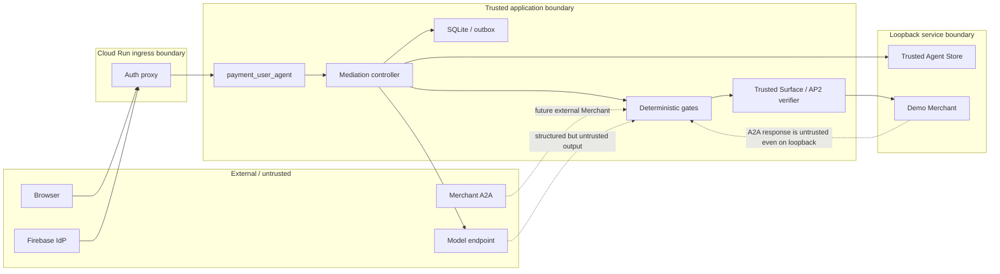
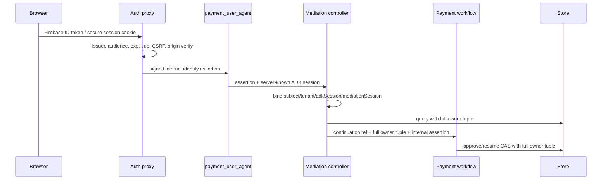

# 仲介エージェント決済統合：Security・Trust Boundary設計

- lifecycle: `target`
- status: 設計baseline
- primary owner: Security owner
- required reviewer: Architecture owner／QA owner
- policy ID: `mediation-security-policy/1`
- 非主張: 本書はproduction KMS／HSM、PCI／SCA、KYC／AML、外部永続監査を提供する設計ではない

## 1. 文書の責務

本書は、認証済み主体のend-to-end binding、認可とLLMの分離、従来security callbackとstable anomaly gateの判定contract、外部入力不信、secret最小開示、failure／timeout時のfail-closed policyの正本である。

本書がsemantic ownerを持つartifactは次の2件である。

- `ART-GATE-POLICY-01`: gate入力の意味、判定、timeout／parse failure、fail-closed mapping、従来callbackとの差
- `ART-CAPABILITY-01`: signed capabilityの認可意味、audience／operation／resource scope、使用・replay policy

gateの発火点、順序、回数、次に許可する副作用は [03](03_MEDIATION_FLOW.md)、serialized decision／capabilityは [06](06_API_A2A_CONTRACTS.md)、監査保存は [08](08_PERSISTENCE_RECOVERY.md) が所有する。本書はそれらを再定義しない。

## 2. 対象範囲と対象外

対象範囲:

- browser、Firebase認証proxy、公開root、内部controller、LLM sub-agent、Trusted Agent Store、Merchant、payment components間のtrust boundary
- verified Firebase subjectからplan、continuation、payment workflow、evidenceまでのbinding
- cross-subject／cross-sessionアクセスと外部identity header偽造の防止
- LLM、Agent Card、A2A response、model output、URLを不信入力として扱う規則
- 従来security callback、stable anomaly gate、決定論的validator、final anomalyの合成policy
- signed capabilityの最小権限、期限、replay防止
- secret、restricted evidence、安全なUI projectionの開示境界
- `BLOCKED`、`REVIEW`、`REJECTED`、結果不明、状態消失のpolicy

final6ではFirebase ID tokenをsame-origin session exchangeでserver-owned `__Host-payment-session` cookieへ移し、`Secure`/`HttpOnly`/`SameSite=Strict`/`Path=/` を強制する。mutationはexact Origin、double-submit `__Host-payment-csrf`、nginx auth subrequestが発行する短命署名identityをすべて必須とし、body/path/headerのsubject/session/workflow selectorを拒否する。SQLite mediation stateはHKDFで用途分離したAES-GCM key、HMAC owner scope、owner/request/session/version/schemaを結ぶAAD、復号可否sentinelでfail closedにする。remote resultはstrict allowlist projectionのみ保存し、token、proof、JWT、private materialをstable stateに残さない。

対象外:

- gate schedule、state transition、承認routing: [03](03_MEDIATION_FLOW.md)
- JWT claim、header、error DTO: [06](06_API_A2A_CONTRACTS.md)
- route exact／prefix allowlist、listen address、proxy設定: [09](09_DEPLOYMENT_PUBLIC_BOUNDARY.md)
- DB schema、nonce consumption、outbox lease: [08](08_PERSISTENCE_RECOVERY.md)
- AP2 artifactの意味とprofile選択: [04](04_PAYMENT_BRIDGE_AP2_X402.md)
- UIの具体文言とredacted projection: [07](07_UI_TRACE.md)
- production key ceremony、organization間PKI、法令・業界標準適合

## 3. 保護資産と脅威model

最優先で保護する資産は、支払そのものだけではない。利用者の意思、承認対象、Agent選定、Remote Task、相関、検査結果が別主体または別stepへ付け替えられないことを同じ重要度で守る。

保護資産:

- Firebase subjectとserver-side sessionのbinding
- 承認済みplan／step／Checkout／payment approval
- canonical Agent identity、Card digest、skill、RPC endpoint
- remote context／task／order／quoteとcontinuation
- AP2 evidence、payment credential、signed capability、nonce、idempotency key
- anomaly decision、audit order、side-effect count
- private key、service credential、Bearer token、raw proof

攻撃者modelには、未認証の外部利用者、別の正当なFirebase利用者、悪意または侵害されたMerchant Agent、汚染されたRegistry／Agent Card、prompt injectionを含むAgent出力、replay／並行request、応答喪失を起こすnetwork、誤動作するLLM／detector、内部routeへ到達を試みる認証済み利用者を含める。

**TBL-SEC-01 threat、asset、boundary、control owner、negative test**

| Threat | 主なasset／boundary | 必須control | Control owner | Negative test |
| --- | --- | --- | --- | --- |
| 外部identity header偽造 | ingress→proxy | 外部header除去、Firebase token検証、短命内部assertion | 05 policy／09配置／06 wire | 偽造headerだけでは401／403、内部routeは404 |
| 別subject／sessionのworkflow取得・承認 | controller／store | 4-tuple ownership filter、ID単独lookup禁止 | 05 semantic／08 query | 正当な別subjectでもread/write/approve/resumeが0件 |
| pending承認の取り違え | UI→controller | backend候補filter、final6は複数時fail closed、将来schemaだけowner-bound selection token、exact approval、CAS | 03 routing／05 subject制約 | selector注入および異種・同種pending混在で誤適用0件 |
| Registry／Card／endpoint差替え | Store→matcher→A2A | canonical ID、allowlisted alias、Card digest、URL型分離、SSRF policy | 02 identity／05 policy／06 wire | alias、skill、digest、hostの各不一致をTask開始前に拒否 |
| prompt injection／plan逸脱 | Agent／model→orchestrator | untrusted text分離、structured schema、callback、gate | 05 policy／03 schedule | 自由文支払指示、外部URL、plan外操作の副作用0件 |
| payment requirement改ざん | Merchant→bridge | Task state、extension、Checkout、plan上限、profile、digest検証 | 04 semantics／05 policy／06 wire | amount、payee、profile、quoteの各改ざんをBLOCK |
| capability escalation／replay | mediator→Merchant | signed least privilege、expiry、single-use＋same-digest replay | 05 semantics／06 token／08 use record | operation、audience、task、request digest差替えの副作用0件 |
| secret／evidence漏えい | key store／LLM／UI／log | data classification、projection allowlist、redaction failureをBLOCK | 05 policy／07 projection／09 secret配置 | DOM、network、prompt、logのsecret scan |
| timeout後の二重Task／二重支払 | network／worker | idempotency、same Task照合、結果不明はREVIEW | 05 failure／08 recovery | 応答喪失後もstart／submit／settle成功件数が増えない |
| detector迂回／誤形式 | workflow→model | stable input digest、strict enum、composite fail closed | 05 policy／03 schedule | timeout、invalid JSON、例外で自動継続0件 |

## 4. Trust boundaryとdata flow

**FIG-SEC-01 trust boundary data-flow**

trust判定はprocess同居やloopbackだけで引き上げない。demo Merchant、Store、modelが同じcontainerまたはprojectにあっても、入力schema、署名、scope、相関を各consumerが検証する。

境界ごとの原則:

- external→proxy: Firebase token／cookie以外のsubject主張を信用しない。
- proxy→application: proxy署名済み、短命、audience限定の内部identityだけを受理する。
- application→Store／Merchant: 保存済みendpointとoperation限定capabilityを使う。
- Merchant／model→application: 内容を常に不信入力とし、textから権限または支払分岐を作らない。
- workflow→LLM: redacted projectionだけを渡し、raw token／credential／Mandate／proofを渡さない。
- application→browser: allowlisted view modelだけを返す。内部recordを直接serializeしない。

## 5. 認証済み主体のend-to-end binding

**FIG-SEC-02 identityの発行、伝播、検証点**

認可主体は `subject`、`tenantId`、`adkSessionId`、`mediationSessionId` の4-tupleである。plan、continuation、payment workflow、approval、artifact、status、resumeの全read／writeは4-tupleをquery条件へ含める。workflow ID、continuation ID、query parameterの `userId`、表示名だけを認可根拠にしない。

内部identity assertionは次の性質を持つ。

- proxyだけが発行し、application固有audience、issuer、subject、tenant、issued-at、expiry、jtiを署名する。
- 外部から同名headerが届いた場合は必ず削除し、検証済み値で置換する。
- applicationは署名、issuer、audience、time windowを毎request検証する。
- ADK sessionとmediation sessionはserverが既存recordと照合し、clientが任意にsubjectへ結合できない。

現行ADK/Firebaseとの接続seamは、authentication proxyがFirebase session cookieをverifyして `sub`を得、server-side ADK session registryから `tenant_id/adk_session_id`を解決し、その4値とaudience/iat/exp/jtiを一つの署名済みassertionにする方式へ固定する。`secure_mediation_agent/agent.py:_adapter_identity(subject)` のようにbodyで任意subjectを送るmint endpointは廃止対象であり、別headerとBearerで同じidentityを二重に表明しない。

[OQ-003](12_DECISIONS_OPEN_QUESTIONS.md#oq-003)のaccepted decisionに従い、subjectを持たない既存demo recordは `legacy_unbound` のread-only quarantineとし、どのFirebase subjectにも自動移行・claimさせない。一般利用者の読取り、承認、再開、artifact参照を拒否し、ephemeral状態消失と同じ再実行案内を返す。migrationが明示的に検証できないrecordへdefault demo subjectを補完してはならない。

## 6. 認可とLLMの分離

LLMは候補説明、計画草案、異常の補助的分類、利用者向け要約を生成できる。ただし次を決定する権限を持たない。

- planが承認済みか
- `承認` がどのpending recordへ適用されるか
- Agent／endpoint／skillが実行可能か
- A2A応答がpayment-requiredか
- Checkoutが上限内か、profileが利用可能か
- AP2 evidence、capability、署名が有効か
- gateが `PASS` か、stepまたはworkflowが完了か

LLM outputはversion付きschemaでparseし、自然文、tool-call名、confidence scoreだけで副作用を許可しない。deterministic validatorが正規化した値だけを権限gateへ渡す。schema外field、未知enum、欠落fieldはparse failureであり、自動補正しない。

signed capabilityは認証済み主体の代替ではなく、内部service間で一つのoperationを実行する最小権限である。発行条件、意味、使用規則は次のとおりとする。

- 信頼されたmediation authorityだけが発行する。
- issuer、audience、subject service、jti、issued-at、not-before、expiry、operationを必須にする。
- plan、step、canonical Agent、endpoint digestを固定する。
- Task開始用grantと支払提出用grantを分ける。支払提出用はcontext／task／order／quote、workflow／continuation、requirements digest、profile、idempotency keyにも固定する。
- TTLは次の副作用を完了する最小時間とし、payment requirement／approvalのexpiryを超えない。
- Merchantは副作用前に署名、key、issuer、audience、operation、scope、time、request digest、use recordを検証する。
- 同一jti・同一request digestのnetwork retryは保存済みresponseを返せる。異なるdigestは `CAPABILITY_REPLAY`／`IDEMPOTENCY_CONFLICT` として拒否する。
- token raw valueをDBの一般event、UI、LLM、通常logへ保存しない。必要な監査はjtiとtoken digestに限定する。

正確なJWT header／claimとtransportは [06のSigned capability contract](06_API_A2A_CONTRACTS.md#11-signed-capabilityとprofile-metadata-contract) が所有する。

## 7. 従来security callbackとstable anomaly gate

従来security callback、決定論的policy、stable anomaly gateは別の防御層であり、一方の存在で他方を省略しない。scheduleは [03](03_MEDIATION_FLOW.md#10-anomaly-gateと従来callbackの実行点) を参照する。

**TBL-SEC-02 callback／gate／決定論的policyの責務差分**

| Layer | 入力の意味 | 出力 | 失敗mapping | 所有するもの／所有しないもの |
| --- | --- | --- | --- | --- |
| deterministic validator | typed plan、Agent、Task、Checkout、capability、profile、correlation | `PASS`／`BLOCK`＋stable reason | 欠落・不一致・例外は `BLOCK` | 機械的invariantを所有。model判断をしない |
| orchestrator tool callback/security hook | 各A2A operationのsanitized request／responseとtool context | `ALLOW`／`WARN`／`DENY` | 例外・timeoutは `DENY` | 既存のA2A前後realtime enforcement。毎回必須 |
| semantic anomaly reviewer subagent | redacted structured evidenceとinput digest | `NO_ESCALATION`／`REVIEW`／`BLOCK` | timeout・transport・parseは `REVIEW` | 意味判断が必要な不確定・高riskのみ。各境界の必須防御ではない |
| composite gate | 上記3結果とpolicy version | `PASS`／`REVIEW`／`BLOCK` | `BLOCK > REVIEW > PASS` | 次副作用の可否。serialized DTOは06 |
| final anomaly wrapper | 元依頼、承認済みplan、全履歴、決済要約、結果 | `ACCEPT`／`REVIEW`／`REJECT` | timeout・parseは `REVIEW`、criticalは `REJECT` | 最終成功可否。途中gateを代用しない |

各判定eventは `layer=callback-hook|deterministic-validator|semantic-reviewer|final-validator` を必須とし、gate ID、policy／detector version、input schema version、input digest、call ordinal、decision、stable reason codes、critical flag、started-at、completed-atを監査する。callback実行とsubagent判断を一つのeventへ潰さない。model prompt全文やsecretは保存しない。

composite mapping:

- deterministic validatorの違反は `BLOCK`。
- callback `DENY`／例外／timeoutは `BLOCK`、`WARN` は `REVIEW`。
- anomaly detectorをsemantic reviewに起動した場合、critical issueまたはscore 70〜100を `BLOCK`、score 30〜69を `REVIEW`、score 0〜29かつcriticalなしだけを `NO_ESCALATION` とする。timeout／transport／parse failureは `REVIEW`。起動なしはcallbackまたはdeterministic validatorの `PASS` を代用する意味ではない。
- 一つでも `BLOCK` があれば後続副作用を禁止する。一つでも `REVIEW` があれば自動継続を禁止する。
- `PASS` は当該境界の必須callback/deterministic layerが成功し、semantic reviewを起動したときは `NO_ESCALATION` だった場合だけ成立する。

[OQ-005](12_DECISIONS_OPEN_QUESTIONS.md#oq-005)のaccepted decisionに従い、detector input／decisionは `mediation-anomaly-input/v1`／`mediation-anomaly-decision/v1`、各call timeoutは30秒とする。例外、timeout、schema不正、parse failure、証跡不足は `REVIEW` で自動継続しない。final wrapperは同じscore境界を `REJECT`／`REVIEW`／`ACCEPT` へ写像し、critical issueをscoreにかかわらず `REJECT` とする。deterministic違反はmodel scoreにかかわらず `BLOCK`／`REJECT` である。

## 8. 外部A2A／model入力の取扱い

Agent Card、Registry record、A2A Task／Message／Artifact、Merchant Checkout、model outputは全て不信入力である。

外部A2A接続:

- Registryのcanonical Agent ID、許可alias、Agent Card URL、RPC endpointを別の型として保存する。
- `https`または明示されたloopback `http`だけを許可し、DNS／IP policy、redirect 0回、接続／読取timeout、response size、content typeを検証する。
- URLを文字列連結してAgent Card URLまたはRPC endpointを導出しない。
- live Cardのdigest、name、skill、extension、endpointをselected snapshotへ一致させる。
- redirect、private address、link-local、metadata service、unix socket等への到達はloopback demo allowlist以外拒否する。

Release-1の必須境界は、snapshotの完全一致destinationか固定loopback fixtureのみ、redirect 0、有限connect/read timeout、有限response bytes、allowlisted content type、URL再構成なしである。DNS rebind耐性、resolver pin、全IP family／proxy bypass matrixは [12 future work](12_DECISIONS_OPEN_QUESTIONS.md#future-work-register) で追加し、Release-1の正常paid/free/refundを妨げない。

A2A内容:

- 自由文に「支払」があってもpayment分岐しない。
- structured payment metadata、Task state、Card declaration、activation echoが揃わなければ支払わない。
- Agentが返したURLを自動取得せず、選定済みendpoint外のresourceをtoolへ渡さない。
- Artifactはmime type、size、digest、schemaを検証し、LLMへ渡す場合はsafe text projectionだけにする。

model入力:

- identifiersは必要最小限の短縮またはopaque referenceにする。
- secret、raw capability、credential、proof、Firebase token、完全なMandate、署名対象原文を含めない。
- Merchant textはdataとして明確に境界付け、system／tool instructionへ連結しない。
- model outputをtyped parserとdeterministic policyへ通し、parserの自動repairで権限判断を変えない。

## 9. Secret、credential、evidenceの最小開示

key／data classification:

- `secret`: private key、signing seed、Firebase service credential、Bearer token、wallet secret、raw payment proof。process memoryまたはsecret mountだけで扱い、UI／LLM／log／trace／一般artifactへ出さない。
- `restricted evidence`: raw Checkout JWT、Mandate、Credential、Receipt、authorization envelope、completion manifest。immutable evidence storeとoffline verifierだけが取得でき、UI／LLMにはdigest／安全な要約だけを出す。
- `internal`: 完全なsubject、session、plan／Task ID、endpoint、security reason。owner照合済み内部APIと監査だけで扱う。
- `public projection`: profile／claim label、商品／金額／通貨／payee、短縮ID、safe reason、順序／時刻。07のallowlistで生成する。

redactionは「見つけた値を隠す」denylistだけに依存せず、公開projectionのallowlistで行う。未知fieldは公開しない。serializationまたはsecret scanに失敗した場合、response／prompt／log出力を中止し `REDACTION_FAILED` として `BLOCKED` または安全なerrorにする。

ephemeral demo keyはinstance置換で失われてよいが、消失後に旧evidenceの署名を成功と推測しない。key IDとpublic JWK snapshotをevidence bundleへ残し、private keyをbundleへ含めない。

Merchantへ送れるのは最小guarantee submission allowlistだけである。具体的にopaque/HMAC correlation binding、canonical task/context/order/quote/terms、signed simulation guarantee、operation capability、安全なAP2 digest要約、profile payloadに限定する。raw Checkout／Payment Mandate、credential、proof、Firebase subject、tenant、session、internal endpoint、raw plan、raw authorization envelope、completion manifest、offline bundle、別Merchantのevidenceを渡さない。Merchantはopaque bindingをuser identityとして使用しない。

## 10. Failure・timeout・review policy

判定語の意味:

- `BLOCKED`: 構造不正、署名不正、主体／相関不一致、policy違反など確定した安全違反。後続副作用なし。自動retryなし。
- `REVIEW`: detector／外部結果が不明、timeout後のsettlement照合未確定など、成功とも失敗とも断定できない状態。自動継続・新規支払なし。
- `REJECTED`: final anomalyが結果を受理しない。利用者へ成功を返さない。
- `CANCELLED`: 利用者拒否または安全な取消。支払副作用なし。
- `STATE_LOST`: ephemeral state／keyが失われ、旧workflowを安全に再開できない。再実行案内だけを返す。

network timeout後に「失敗」と即断して新規Task／支払を作らない。同じidempotency key、capability jti、task／context、Merchant側statusを照合し、確定responseを再取得できる場合だけ回復する。照合不能は `REVIEW` である。

retryable errorは任意のclient再送許可を意味しない。retry owner、同じrequest digest、上限、backoffが定義されたworkerだけが再送できる。承認入力の再送はCASにより一つだけが成功する。

failure応答自体もsubject tupleを検証し、安全なcorrelation IDと次操作だけを返す。内部exception、endpoint、token、raw Merchant responseを利用者へ返さない。

## 11. Threat-control mapping

[TBL-SEC-01](#tbl-sec-01)をthreat-controlの正本とし、[10 Test Strategy](10_TEST_STRATEGY.md) は各negative testをfixture、observable、side-effect countへ展開する。release時は少なくとも次を証跡化する。

- 別subject／sessionのread／approve／resumeが0件
- Card／endpoint／skill／profile／Task改ざん時のTask開始または支払副作用が0件
- callback／detector timeout、例外、parse failure後の自動継続が0件
- capability欠落、scope／request digest不一致、replay時のMerchant副作用が0件
- UI DOM、network response、LLM input、通常logのsecret検出が0件
- timeout／reconciliation時にTask開始、支払提出、settlement成功件数が増えない

controlの実装pathとtest evidenceは [11](11_TRACEABILITY_RELEASE.md) でcandidateへ結合する。本書は現在のPASS／FAILを保持しない。

## 12. 適用要件

この節のH3はcoverage manifestが参照するstable primary design anchorである。

**TBL-SEC-REQ-01 Primary requirement owner view**

| 要件ID | 要件へのリンク | Primary design section | 検証先 |
| --- | --- | --- | --- |
| `NFR-004` | [NFR-004](../MEDIATOR_PAYMENT_INTEGRATION_REQUIREMENTS.md#nfr-004-境界付き外部通信) | [NFR-004](#nfr-004) | `TEST-005`、`TEST-009`、`AC-007`、`AC-008` |
| `SEC-001` | [SEC-001](../MEDIATOR_PAYMENT_INTEGRATION_REQUIREMENTS.md#sec-001-認証済み主体の終端間binding) | [SEC-001](#sec-001) | `TEST-002`、`TEST-005`、`AC-006`、`AC-010` |
| `SEC-002` | [SEC-002](../MEDIATOR_PAYMENT_INTEGRATION_REQUIREMENTS.md#sec-002-主体とsessionの分離) | [SEC-002](#sec-002) | `TEST-003`、`TEST-005`、`AC-006` |
| `SEC-003` | [SEC-003](../MEDIATOR_PAYMENT_INTEGRATION_REQUIREMENTS.md#sec-003-内部identity) | [SEC-003](#sec-003) | `TEST-005`、`TEST-012`、`AC-013` |
| `SEC-008` | [SEC-008](../MEDIATOR_PAYMENT_INTEGRATION_REQUIREMENTS.md#sec-008-外部a2a内容の不信) | [SEC-008](#sec-008) | `TEST-001`、`TEST-009`、`AC-008` |
| `SEC-009` | [SEC-009](../MEDIATOR_PAYMENT_INTEGRATION_REQUIREMENTS.md#sec-009-llmからの権限制御分離) | [SEC-009](#sec-009) | `TEST-003`、`TEST-006`、`AC-003`、`AC-004`、`AC-008` |
| `SEC-010` | [SEC-010](../MEDIATOR_PAYMENT_INTEGRATION_REQUIREMENTS.md#sec-010-秘密情報と最小開示) | [SEC-010](#sec-010) | `TEST-005`、`TEST-011`、`AC-010`、`AC-013` |
| `SEC-011` | [SEC-011](../MEDIATOR_PAYMENT_INTEGRATION_REQUIREMENTS.md#sec-011-障害時のfail-closed) | [SEC-011](#sec-011) | `TEST-006`、`TEST-009`、`AC-007`、`AC-008`、`AC-009` |
| `SEC-016` | [SEC-016](../MEDIATOR_PAYMENT_INTEGRATION_REQUIREMENTS.md#sec-016-従来security-callbackの維持) | [SEC-016](#sec-016) | `TEST-006`、`TEST-010`、`AC-001`、`AC-002` |
| `SEC-017` | [SEC-017](../MEDIATOR_PAYMENT_INTEGRATION_REQUIREMENTS.md#sec-017-返金認可) | [SEC-017](#sec-017) | `TEST-016`、`AC-014` |

### NFR-004

- 要件: [NFR-004](../MEDIATOR_PAYMENT_INTEGRATION_REQUIREMENTS.md#nfr-004-境界付き外部通信)
- 設計実現: [8章](#8-外部a2amodel入力の取扱い)と[10章](#10-failuretimeoutreview-policy)で接続先、redirect、timeout、size、retry owner、結果不明時の停止を定義する。
- 検証先: `TEST-005`、`TEST-009`、`AC-007`、`AC-008`

### SEC-001

- 要件: [SEC-001](../MEDIATOR_PAYMENT_INTEGRATION_REQUIREMENTS.md#sec-001-認証済み主体の終端間binding)
- 設計実現: [5章](#5-認証済み主体のend-to-end-binding)でverified subjectを4-tupleとして全record／operationへ伝播する。
- 検証先: `TEST-002`、`TEST-005`、`AC-006`、`AC-010`

### SEC-002

- 要件: [SEC-002](../MEDIATOR_PAYMENT_INTEGRATION_REQUIREMENTS.md#sec-002-主体とsessionの分離)
- 設計実現: [5章](#5-認証済み主体のend-to-end-binding)でID単独lookupを禁止し、別subject／sessionの正当利用者も拒否する。
- 検証先: `TEST-003`、`TEST-005`、`AC-006`

### SEC-003

- 要件: [SEC-003](../MEDIATOR_PAYMENT_INTEGRATION_REQUIREMENTS.md#sec-003-内部identity)
- 設計実現: [4章](#4-trust-boundaryとdata-flow)と[5章](#5-認証済み主体のend-to-end-binding)で外部header除去、proxy発行、内部検証を定義する。
- 検証先: `TEST-005`、`TEST-012`、`AC-013`

### SEC-008

- 要件: [SEC-008](../MEDIATOR_PAYMENT_INTEGRATION_REQUIREMENTS.md#sec-008-外部a2a内容の不信)
- 設計実現: [8章](#8-外部a2amodel入力の取扱い)で自由文、URL、Task、Artifact、profileを不信入力として分離する。
- 検証先: `TEST-001`、`TEST-009`、`AC-008`

### SEC-009

- 要件: [SEC-009](../MEDIATOR_PAYMENT_INTEGRATION_REQUIREMENTS.md#sec-009-llmからの権限制御分離)
- 設計実現: [6章](#6-認可とllmの分離)でLLMが保持しない権限とdeterministic gateを固定する。
- 検証先: `TEST-003`、`TEST-006`、`AC-003`、`AC-004`、`AC-008`

### SEC-010

- 要件: [SEC-010](../MEDIATOR_PAYMENT_INTEGRATION_REQUIREMENTS.md#sec-010-秘密情報と最小開示)
- 設計実現: [9章](#9-secretcredentialevidenceの最小開示)でdata classification、projection allowlist、redaction failureを定義する。
- 検証先: `TEST-005`、`TEST-011`、`AC-010`、`AC-013`

### SEC-011

- 要件: [SEC-011](../MEDIATOR_PAYMENT_INTEGRATION_REQUIREMENTS.md#sec-011-障害時のfail-closed)
- 設計実現: [7章](#7-従来security-callbackとstable-anomaly-gate)と[10章](#10-failuretimeoutreview-policy)でdetector／network／結果不明を自動許可しない。
- 検証先: `TEST-006`、`TEST-009`、`AC-007`、`AC-008`、`AC-009`

### SEC-016

- 要件: [SEC-016](../MEDIATOR_PAYMENT_INTEGRATION_REQUIREMENTS.md#sec-016-従来security-callbackの維持)
- 設計実現: [7章](#7-従来security-callbackとstable-anomaly-gate)でcallbackをstable gateと別layerとして維持し、例外／timeoutを拒否へ写像する。
- 検証先: `TEST-006`、`TEST-010`、`AC-001`、`AC-002`

### SEC-017

Refundはoriginal paymentの `subject/tenant/adk_session/mediation_session`、receipt、refundable balance、amount/currency、明示承認、nonce/expiry、CAS/idempotencyをMerchant副作用前に検証する。ID単独、LLM推定、別owner、超過額、重複は副作用0で拒否する。

## 13. 関連文書と参照方向

- [HANDOFF](../MEDIATOR_PAYMENT_INTEGRATION_HANDOFF.md) と [統合要件](../MEDIATOR_PAYMENT_INTEGRATION_REQUIREMENTS.md) はnormative inputである。
- [02](02_DOMAIN_DATA_STATE.md) のidentity、snapshot、audit event semanticsを入力として参照する。
- [03](03_MEDIATION_FLOW.md) はapproval routingとgate scheduleの正本であり、本書はpolicyだけを提供する。
- [04](04_PAYMENT_BRIDGE_AP2_X402.md) はPayment approval／AP2／profile semanticsの正本であり、本書は認可・開示制約だけを提供する。
- [06](06_API_A2A_CONTRACTS.md) はidentity assertion、SecurityDecision、capability、errorのserialized contractを所有する下流consumerである。
- [07](07_UI_TRACE.md) は本書のprojection／redaction policyを安全なviewへ反映する。
- [08](08_PERSISTENCE_RECOVERY.md) はnonce、capability use、decision auditの保存mappingを所有する。
- [09](09_DEPLOYMENT_PUBLIC_BOUNDARY.md) はroute、listen、proxy、secret mountの物理境界を所有する。
- [11](11_TRACEABILITY_RELEASE.md) は本書primary anchorとnegative evidenceをaggregateする。

## 14. Decision参照

本文はDecision Logの次のaccepted decisionを入力とする。

- [OQ-003](12_DECISIONS_OPEN_QUESTIONS.md#oq-003): subjectのないlegacy demo recordはunowned quarantineとし、default subjectを補完せず、read／approve／resumeを拒否して再実行を案内する。
- [OQ-005](12_DECISIONS_OPEN_QUESTIONS.md#oq-005): `mediation-anomaly-input/v1`／`mediation-anomaly-decision/v1`、30秒timeout、criticalまたは70〜100=`BLOCK`／`REJECT`、30〜69=`REVIEW`、0〜29かつcriticalなし=`PASS`／`ACCEPT`、例外／timeout／schema不正／parse failure／証跡不足=`REVIEW` とする。
- [OQ-002](12_DECISIONS_OPEN_QUESTIONS.md#oq-002): security上のcanonical Agent IDはRegistry不変IDとし、未登録alias、Card／skill／endpoint不一致を拒否する。具体mappingは02／06へ反映する。
