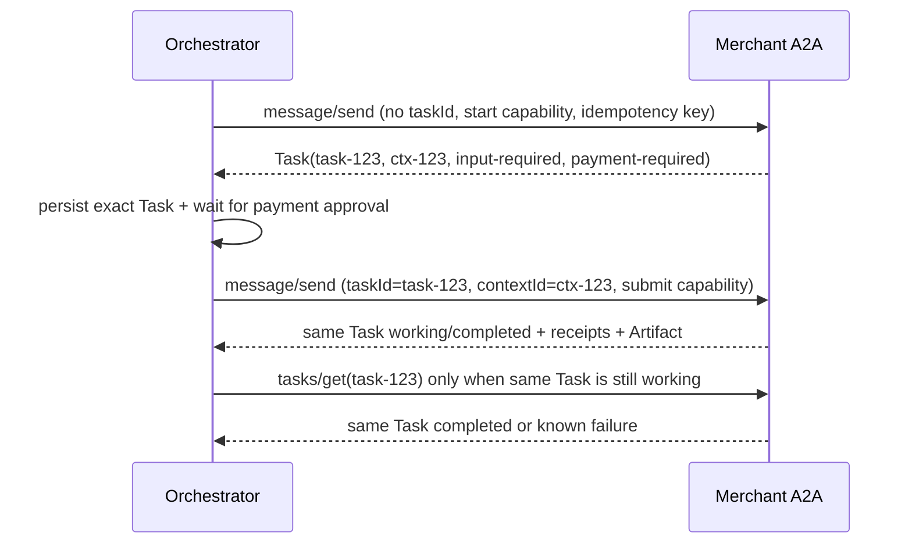
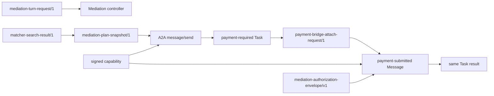

# 仲介エージェント決済統合：API・A2A Contract設計

- lifecycle: `target`
- status: 設計baseline
- primary owner: API／A2A contract owner
- required reviewer: Security owner／Consumer owner
- runtime baseline: `a2a-sdk==0.3.19`
- 非主張: 本書のtarget contractは現行codeへ実装済み、または公式x402へ適合済みであることを意味しない

## 1. 文書の責務

本書は、UI入口、matcher／planner／orchestrator、payment bridge、Agent Registry／Agent Card、A2A Task／Message、payment extension、signed capability、result／Artifact／errorの**serialized contract**と、domain／evidenceからwireへのmappingの正本である。

本書がsemanticまたはserialized ownerを持つartifactは次の4件である。

- `ART-A2A-WIRE-01`: Agent Card、Task、Message、payment extension DTOとwire canonicalization
- `ART-WIRE-MAPPING-01`: domain-to-wire／evidence-to-wire変換mapping
- `ART-CAPABILITY-01`のserialized面: JWT header／claimとtransport
- `ART-PAYMENT-BRIDGE-01`のserialized面: attach／approval／resume DTO

domain invariantは [02](02_DOMAIN_DATA_STATE.md)、flowと状態遷移は [03](03_MEDIATION_FLOW.md)、payment／AP2 semanticsは [04](04_PAYMENT_BRIDGE_AP2_X402.md)、security policyは [05](05_SECURITY_TRUST_BOUNDARIES.md)、persistence mappingは [08](08_PERSISTENCE_RECOVERY.md) が所有する。本書のfield定義でそれらの意味を変更しない。

## 2. 対象範囲と対象外

対象範囲:

- 同一origin UIからmediation controllerへ送るturnと返却viewのDTO
- matcher、planner、orchestrator間のtyped snapshot DTO
- continuationをpayment bridgeへattach／approve／resumeする内部DTO
- Registry recordとlive Agent Cardの別contract、明示identifier mapping
- A2A JSON-RPC `message/send`、同じTaskへの後続message、`tasks/get`
- `payment-required`／`payment-submitted`／result metadata、Checkout／AP2 submission part
- signed capability、extension activation、idempotencyのwire binding
- safe error envelope、HTTP／JSON-RPC表現、schema evolution

packaged final6のpublic mediation contractは `POST /mediation-api/v1/turns` と `GET /mediation-api/v1/view` だけをauthorityとし、turn bodyは `requestId`/`expectedVersion`/text parts以外のidentity・workflow selectorを受けない。request reservationはowner+request ID+canonical digestで一意で、同一digestは暗号化済みexact resultをreplayし、別digestはconflictとする。Merchant fault APIはpublic contractではなく、local DEV、loopback、32文字以上のsecret、exact one-shot targetを同時に満たすtest-only内部境界である。

対象外:

- APIの外部公開可否、route allowlist、nginx設定: [09](09_DEPLOYMENT_PUBLIC_BOUNDARY.md)
- approval routing、gate順序、state transition: [03](03_MEDIATION_FLOW.md)
- amount、profile、AP2 artifactが有効かという意味判定: [04](04_PAYMENT_BRIDGE_AP2_X402.md)
- capabilityを発行できる条件、detector failure policy: [05](05_SECURITY_TRUST_BOUNDARIES.md)
- table／column、outbox payload保存、reconciliation: [08](08_PERSISTENCE_RECOVERY.md)
- UIに何を表示するか: [07](07_UI_TRACE.md)

## 3. Contract共通規約とversioning

<a id="art-a2a-wire-01"></a>
<a id="art-wire-mapping-01"></a>

共通規約:

- encodingはUTF-8 JSON、media typeは `application/json` とする。
- project-local DTOは必ずrootに `schemaVersion` を持ち、objectの未知fieldを拒否する。
- wire fieldはlower camel case、JWT private claimもlower camel caseとする。A2A base objectはpinned SDKのaliasを使う。
- domain IDはUUIDv7、digestは `sha256:<64 lowercase hex>`、日時はUTC RFC 3339 `Z` とする。JWT time claimはNumericDate整数秒である。
- amountはdomain／project DTOでJSON integerの正の最小単位、x402 `maxAmountRequired`だけはcanonical decimal stringとする。浮動小数点、指数表記、符号、先頭0を拒否する。
- currencyはISO 4217 uppercase 3文字、`decimals`は0〜18整数とする。official token assetとの換算を暗黙に行わない。
- nullableと省略を区別する。schemaでnullableとしないfieldへ `null` を送らない。
- collectionは意味上順序がある場合だけarrayを使う。`accepts`とreceipt historyは受信順を保持する。
- UI／internal requestは64 KiB、Agent Cardは256 KiB、A2A Task／Message responseは1 MiB、単一data partは512 KiBを上限とする。超過はparse前に拒否する。

wire digest profile `wire-rfc8785-sha256/1` は、JSON互換値をRFC 8785でcanonicalizeしたUTF-8 bytesへSHA-256を適用し `sha256:` prefixで表す。digest field自身、HTTPのhop-by-hop header、Bearer token raw valueをdigest対象へ含めない。認可対象request digestは次のtupleをcanonicalizeする。

`{httpMethod, canonicalRpcEndpoint, contentType, extensionUri, idempotencyKey, capabilityId, body}`

`Authorization`はraw tokenの代わりにcapability IDを含める。domain snapshotのcanonicalizationは02、AP2 objectのcanonicalizationは04を使い、wire profileで再digestした値を同じdigestだと扱わない。

version規則:

- `/1`はmajor versionである。同じversionでrequired field、意味、canonicalization、enumを変更しない。
- additive fieldもstrict consumerに影響するため、新しいschema versionで導入する。
- producerは一つのversionだけを書き、migration期間にdual-readする場合もaccepted decision、期限、negative testを必要とする。
- 未知major、version欠落、別versionのURI／metadata混在は `CONTRACT_VERSION_UNSUPPORTED` としてfail closedにする。
- A2A base objectは`a2a-sdk==0.3.19`のmodel validation後にproject-local metadataを別schemaでstrict validationする。

## 4. UI／入口とmediation controllerのcontract

外部route名は09が所有するため、本書では論理operation IDで定義する。

### `mediation.turn.submit/1`

request:

```json
{
  "schemaVersion": "mediation-turn-request/1",
  "requestId": "018f2f7e-...",
  "expectedVersion": 7,
  "message": {
    "parts": [
      {"kind": "text", "text": "承認"}
    ]
  },
  "selectionToken": null
}
```

規則:

- public bodyのfieldは `schemaVersion`、`requestId`、省略可能な `expectedVersion`、`message.parts`、常にJSON `null` の `selectionToken` だけである。strict schemaは未知fieldを拒否する。bodyの `adkSessionId`、`mediationSessionId`、`workflowId`、`subject`、`tenantId` と、path／query／headerからの同等selectorは、controller／store access前に拒否する。
- serverはproxy検証済み `tenantId` と `subject` から内部 `adkSessionId = "public-" + SHA-256(tenantId + "\\0" + subject)[:32]` を決定論的に生成し、authoritative active mediation sessionを解決する。この内部値はpublic bodyへ出さず、browserは選択できない。`expectedVersion` は認可selectorではなく、server解決済みactive sessionに対する並行制御hintである。
- approvalは`parts`が1件のtext partで、text bytesがUTF-8の `承認` と完全一致する場合だけ候補になる。trim、Unicode正規化、同義語変換をしない。
- final6の `selectionToken` は互換予約fieldであり、値の型は `null` のみである。non-null値は未知selectorと同様に拒否し、同種pendingが複数なら `APPROVAL_TARGET_AMBIGUOUS` でfail closedにする。[OQ-010](12_DECISIONS_OPEN_QUESTIONS.md#oq-010) のone-time tokenは将来の別schema versionでのみ導入でき、`mediation-turn-request/1` の許可fieldを拡張しない。
- subject、tenant、role、approval targetをbodyから受理しない。認可主体はproxyが検証した内部identityとserver-side sessionから作る。
- `requestId`はturnのidempotency keyであり、同じIDと異なるmessage digestを拒否する。

response:

```json
{
  "schemaVersion": "mediation-turn-response/1",
  "requestId": "018f2f7e-...",
  "mediationSessionId": "018f2f7c-...",
  "state": "Completed",
  "version": 8,
  "pendingAction": {
    "kind": "none",
    "targetRef": null
  },
  "view": {
    "schemaVersion": "mediation-public-view/1",
    "state": "Completed",
    "version": 8,
    "message": "完了しました。",
    "agentLabel": "paid-booking-agent",
    "planRef": "018f2f70-...",
    "stepRef": "018f2f71-...",
    "taskRef": "task-123",
    "approvalTarget": null,
    "approvalTargetDigest": null,
    "pendingAction": {"kind": "none", "targetRef": null},
    "trace": [],
    "durabilityProfile": "local-durable",
    "simulation": true,
    "conformance": "NOT CONFORMANT"
  },
  "trace": [],
  "error": null
}
```

public wire fieldは次で固定する。Python内部のsnake case名はserializer実装上のalias sourceにすぎず、responseはlower camel caseだけを返す。`workflowState`、`viewVersion`、`targetId` はpublic aliasではなく、受信／生成しない。`expiresAt` はplan/paymentの `approvalTarget` 内には存在し得るが、`pendingAction` のfieldではない。

| Object | Exact public fields／variant |
| --- | --- |
| `mediation-turn-response/1` | `schemaVersion`, `requestId`, `mediationSessionId`, `state`, `version`, `pendingAction`, `view`, `trace`, `error=null` |
| `mediation-public-view/1` | `schemaVersion`, `state`, `version`, `message`, nullable `agentLabel`/`planRef`/`stepRef`/`taskRef`/`approvalTarget`/`approvalTargetDigest`, `pendingAction`, `trace`, `durabilityProfile`, `simulation=true`, `conformance="NOT CONFORMANT"` |
| `pendingAction` | exact fields `kind`, nullable `targetRef`; `kind` is `approve-plan`, `approve-payment`, `execute-approved-payment`, `request-refund`, `wait`, or `none` |
| `trace[]` | `sequence`, `stage`, `componentId`, `layer`, `operationId`, `decision`, nullable `safeRef`, `occurredAt` |

`view`と`trace`の表示意味とredactionは07が所有する。controllerは内部recordやraw evidenceをそのまま `view` に入れない。

## 5. Matcher／planner／orchestrator間contract

### `matcher.search.result/1`

```json
{
  "schemaVersion": "matcher-search-result/1",
  "queryId": "018f3000-...",
  "candidates": [
    {
      "schemaVersion": "selected-agent-snapshot/1",
      "canonicalAgentId": "agent-005",
      "registryName": "paid_booking_agent",
      "serviceSlug": "paid-booking-agent",
      "a2aAgentName": "paid-booking-agent",
      "agentCardUrl": "http://127.0.0.1:8005/.well-known/agent-card.json",
      "rpcEndpoint": "http://127.0.0.1:8005/a2a",
      "agentCardDigest": "sha256:0123456789abcdef0123456789abcdef0123456789abcdef0123456789abcdef",
      "registrySkillId": "paid_booking",
      "a2aSkillId": "paid-booking",
      "trustScore": 90,
      "capabilityIds": ["paid-booking"],
      "paymentProfiles": [
        {
          "profileId": "x402-wire-simulation/1",
          "extensionUri": "urn:secure-a2a:extensions:x402-wire-simulation:v1",
          "required": true
        }
      ],
      "mappingVersion": "paid-booking-identifiers/v1",
      "selectedAt": "2026-08-16T10:00:00Z"
    }
  ]
}
```

`agentCardUrl`と`rpcEndpoint`は別々のabsolute URLであり、一方から他方を文字列連結して作らない。`trustScore`は0〜100整数で、権限を単独では与えない。candidateはlive Card検証後のdigestを持つ。

### `planner.plan.result/1`

```json
{
  "schemaVersion": "mediation-plan-snapshot/1",
  "planId": "018f3010-...",
  "planVersion": 1,
  "planDigest": "sha256:...",
  "goalDigest": "sha256:...",
  "ownerRef": {
    "subject": "firebase-subject",
    "tenantId": "demo-tenant",
    "adkSessionId": "018f2f7d-...",
    "mediationSessionId": "018f2f7c-..."
  },
  "steps": [
    {
      "stepId": "018f3011-...",
      "ordinal": 1,
      "selectedAgent": {"snapshotDigest": "sha256:..."},
      "a2aSkillId": "paid-booking",
      "input": {"schemaVersion": "step-input/1", "goal": "..."},
      "inputDigest": "sha256:...",
      "paymentLimit": {"amountMinor": 5000, "currency": "JPY", "decimals": 0}
    }
  ],
  "createdAt": "2026-08-16T10:00:01Z",
  "expiresAt": "2026-08-16T10:10:01Z"
}
```

`selectedAgent` wireはsnapshot本体またはsnapshot digest参照を許すが、orchestratorは保存済みsnapshotをdigestでloadし、plannerが返したURLを実送信先にしない。`planDigest`は `subject`を含むownerRef全体を必ずcanonical inputに含め、そのdomain生成は02が所有する。

### `orchestrator.step.execute/1`

worker inputは `schemaVersion`、operation ID、owner ref、approved plan ref、step ID、expected step version、selected Agent snapshot digest、input digest、security decision refsを含む。出力は `free-result`、`payment-required`、`in-progress`、`blocked`、`review-required` のdiscriminated unionである。`payment-required` variantは [9章](#9-payment-required-contract)のTask snapshotとrequirement DTOを完全に保持し、text要約だけを返してはならない。

## 6. Continuation／payment bridge contract

### `payment.bridge.attach/1`

```json
{
  "schemaVersion": "payment-bridge-attach-request/1",
  "operationId": "018f3100-...",
  "idempotencyKey": "bridge:018f3011-...:sha256:...",
  "expectedContinuationVersion": 0,
  "ownerRef": {
    "subject": "firebase-subject",
    "tenantId": "demo-tenant",
    "adkSessionId": "018f2f7d-...",
    "mediationSessionId": "018f2f7c-..."
  },
  "approvedPlanRef": {
    "planId": "018f3010-...",
    "planVersion": 1,
    "planDigest": "sha256:...",
    "planApprovalId": "018f3020-...",
    "planApprovalNonce": "...",
    "planApprovalIssuedAt": "2026-08-16T10:01:00Z"
  },
  "stepRef": {"stepId": "018f3011-...", "stepSnapshotDigest": "sha256:..."},
  "remoteTask": {
    "contextId": "ctx-123",
    "taskId": "task-123",
    "orderId": "order-123",
    "quoteId": "quote-123",
    "taskDigest": "sha256:..."
  },
  "paymentRequirement": {"schemaVersion": "payment-requirement-snapshot/1", "digest": "sha256:..."},
  "securityDecisionRefs": [
    {"gateId": "POST_A2A_RESPONSE", "decisionId": "018f3030-...", "decision": "PASS"},
    {"gateId": "POST_PAYMENT_REQUIREMENT", "decisionId": "018f3031-...", "decision": "PASS"}
  ]
}
```

request transportは短命な `X-Internal-Identity` assertionを要求し、bodyの`ownerRef`と完全一致させる。responseは `payment-bridge-attach-response/1` で、`continuationId`、`paymentWorkflowId`、`state=WaitingForPaymentApproval`、`version`、`requirementsDigest`、`checkoutDigest`、`paymentApprovalExpiresAt`、`created|already-attached`を返す。

### `payment.bridge.approval/1`

inputはturn requestからserver-side routing済みの `continuationId`、`expectedVersion`、exact approval message digest、current Checkout／requirements／display digestを含む。final6にselection token jtiは存在せず、将来の別schemaで明示選択を導入した場合だけ検証済みowner-bound selection proofを内部入力へ追加できる。raw subjectはbodyで権限化せず内部identityへ一致させる。成功responseはpayment approval ID／nonce／issued-at／expiryとartifact digestを返す。signed artifact raw valueはUI responseへ返さない。

### `payment.bridge.resume/1`

inputはowner ref、continuation／workflow／expected version、plan／step、same remote task／context／order／quote、payment approval ref、AP2 evidence root、selected profile、`PRE_PAYMENT_SUBMIT` decision ref、submit idempotency keyを含む。resultは `submitted`、`same-task-working`、`same-task-completed`、`blocked`、`review-required` のunionであり、別Taskのresultを受理しない。

`MediationContinuation`はmediation aggregateが所有し、payment workflowとはID／digest参照で結ぶ。cross-DB atomicityを仮定せず、serialized intent／ackは08のoutbox mappingへ渡す。

## 7. Agent RegistryとAgent Card contract

### Registry record

Registryはsecurity主体のcanonical recordを返す。

```json
{
  "schemaVersion": "trusted-agent-record/1",
  "agentId": "agent-005",
  "name": "paid_booking_agent",
  "agentCardUrl": "http://127.0.0.1:8005/.well-known/agent-card.json",
  "rpcEndpoint": "http://127.0.0.1:8005/a2a",
  "skills": [{"id": "paid_booking"}],
  "aliases": {
    "mappingVersion": "paid-booking-identifiers/v1",
    "serviceSlug": "paid-booking-agent",
    "a2aAgentName": "paid-booking-agent",
    "a2aSkillId": "paid-booking"
  },
  "trust": {"score": 90, "keySetVersion": "demo-es256-v1"}
}
```

unknown alias、underscore／hyphenの自動変換、nameだけの一致を拒否する。商品ID `demo-paid-booking` はAgent／skill aliasではない。

Release-1のRegistry fixtureはpaidの `agent-005` / `paid_booking_agent` / `paid-booking` / `http://127.0.0.1:8005/a2a` と、freeの `agent-002` / `free_information_agent` / `free-information` / `http://127.0.0.1:8002/a2a` を含む。free Cardはpayment extensionを宣言せず、初回Taskを `completed` で返す。Registry、live Card、runtimeのID/name/skill/endpointはこの組で一致させる。

### Live Agent Card

demo Merchantのtarget CardはA2A base schemaに従い、少なくともname、RPC URL、capabilities、skills、payment extensionを宣言する。Card側のpayment判定対象はcanonical extension URI、`required`、A2A capabilityに限定する。scheme/network/asset/payToはCardの暗黙fieldとせず、署名済みrequirement、runtime readiness、capability、payload、guarantee/receipt間で比較する。

```json
{
  "name": "paid-booking-agent",
  "url": "http://127.0.0.1:8005/a2a",
  "version": "1.0.0",
  "capabilities": {
    "extensions": [
      {
        "uri": "urn:secure-a2a:extensions:x402-wire-simulation:v1",
        "description": "Project-local x402 wire simulation; NOT CONFORMANT",
        "required": true
      }
    ]
  },
  "skills": [
    {"id": "paid-booking", "name": "Paid booking demo", "tags": ["booking", "simulation"]}
  ]
}
```

official profileを宣言するCardはcanonical URI `https://github.com/google-a2a/a2a-x402/v0.1`を完全一致で使う。demo simulation URIとofficial URIを一つのprofileとして混在させない。Card取得responseをbase schemaでvalidationし、canonical bytesのdigestをRegistry snapshotへpinする。Cardの`url`はRegistry `rpcEndpoint`と完全一致させる。

## 8. A2A Task／Message lifecycle contract

<a id="fig-a2a-01"></a>

**FIG-A2A-01 初回Taskと同一Taskへの後続message**



### 初回 `message/send`

HTTP request:

- `POST` to selected snapshotのexact `rpcEndpoint`
- `Content-Type: application/json`
- payment extension候補をactivateする場合だけ `X-A2A-Extensions: <exact-one-uri>`
- `Authorization: Bearer <start capability>`
- `Idempotency-Key: <step-scoped-key>`
- redirect禁止、timeout／sizeは05のpolicyに従う

body:

```json
{
  "jsonrpc": "2.0",
  "id": "018f3200-...",
  "method": "message/send",
  "params": {
    "message": {
      "kind": "message",
      "messageId": "018f3201-...",
      "role": "user",
      "parts": [
        {
          "kind": "data",
          "data": {
            "schemaVersion": "mediation-service-request/1",
            "a2aSkillId": "paid-booking",
            "input": {},
            "inputDigest": "sha256:..."
          }
        }
      ],
      "metadata": {
        "io.github.taichihiromatsu.secure-mediation.v1": {
          "schemaVersion": "secure-mediation-a2a-context/1",
          "operation": "a2a.task.start",
          "mediationSessionId": "018f2f7c-...",
          "planId": "018f3010-...",
          "planVersion": 1,
          "planDigest": "sha256:...",
          "stepId": "018f3011-...",
          "canonicalAgentId": "agent-005",
          "agentCardDigest": "sha256:...",
          "clientRequestCorrelationId": "018f3202-...",
          "capabilityId": "018f3203-...",
          "idempotencyKey": "a2a-start:018f3011-...",
          "inputDigest": "sha256:..."
        }
      }
    }
  }
}
```

初回requestのMessageは`taskId`、`orderId`、`quoteId`を持たない。`clientRequestCorrelationId`は仲介側発行の不透明な依頼相関である。Merchantが一つのTask/contextとcanonical order/quoteを初回応答で発行し、同じidempotency keyの同一digest再送では保存済みの同じTaskを返す。別digestはconflictである。Task開始request countはstepごとに1でなければならない。

### free response

free responseは同じJSON-RPC IDへのA2A Taskで、`status.state=completed`、業務Artifactあり、`x402.payment.*` metadataなしとする。payment extensionをactivateしていても、free resultに空のpayment requirementを挿入しない。

### paid response

paid responseは [9章](#9-payment-required-contract)を満たす `input-required` Taskである。Task／status message／history／Artifactを構造化したまま保存する。

### 同じTaskの照会

payment resultが `working` の場合だけ、`tasks/get`を`taskId`、read capability、same endpointへ送り、同じcontext／taskを照合する。照会は新規Task開始ではない。payment payloadを再送する場合は、同じsubmit idempotency keyとrequest digestのresponse再取得に限る。

## 9. Payment-required contract

支払分岐は次の三条件が同時に成立する場合だけ認識する。

1. Task `status.state`がexact `input-required`。
2. `status.message.metadata["x402.payment.status"]`がexact `payment-required`。
3. `status.message.metadata["x402.payment.required"]`とproject metadata／Checkout artifactがstrict validation、Card declaration、activation echo、plan policyに合格する。

自由文partは条件に含めない。

```json
{
  "kind": "task",
  "id": "task-123",
  "contextId": "ctx-123",
  "status": {
    "state": "input-required",
    "message": {
      "kind": "message",
      "messageId": "msg-required-1",
      "taskId": "task-123",
      "contextId": "ctx-123",
      "role": "agent",
      "parts": [{"kind": "text", "text": "Payment approval is required."}],
      "metadata": {
        "x402.payment.status": "payment-required",
        "x402.payment.required": {
          "schemaVersion": "demo-payment-requirement/2",
          "x402Version": 1,
          "scenarioDigest": "sha256:...",
          "demoScenario": {
            "scenarioVersion": "demo-booking-scenario/1",
            "scenarioId": "tokyo-business-hotel-arrangement-20260912-v1",
            "productId": "demo-paid-booking",
            "service": "デモホテル予約手配サービス",
            "hotel": "デモ東京ベイホテル",
            "destination": "東京",
            "dates": {"checkIn": "2026-09-12", "checkOut": "2026-09-14"},
            "guests": 2,
            "arrangementFee": {"amountMinor": 1250, "currency": "USD", "decimals": 2, "lodgingExcluded": true, "payee": "demo-merchant"},
            "terms": {"simulationOnly": true, "realBooking": false, "realInventoryHold": false, "realCharge": false, "realTransfer": false, "legalGuarantee": false}
          },
          "accepts": [
            {
              "scheme": "exact-simulated",
              "network": "demo:local",
              "asset": "USD",
              "payTo": "merchant:demo-merchant",
              "maxAmountRequired": "1250"
            }
          ]
        },
        "io.github.taichihiromatsu.secure-mediation.v1": {
          "schemaVersion": "secure-mediation-payment-required-context/1",
          "canonicalAgentId": "agent-005",
          "planId": "018f3010-...",
          "planVersion": 1,
          "planDigest": "sha256:...",
          "stepId": "018f3011-...",
          "orderId": "018f3202-...",
          "quoteId": "quote-123",
          "profileId": "x402-wire-simulation/1",
          "scenarioDigest": "sha256:...",
          "currency": "USD",
          "decimals": 2,
          "expiresAt": "2026-08-16T10:20:00Z",
          "paymentRequirementDigest": "sha256:...",
          "checkoutArtifactId": "artifact-checkout-1",
          "checkoutDigest": "sha256:..."
        }
      }
    }
  },
  "artifacts": [
    {
      "artifactId": "artifact-checkout-1",
      "name": "merchant-checkout",
      "parts": [
        {
          "kind": "data",
          "data": {
            "schemaVersion": "merchant-checkout-envelope/1",
            "checkoutJwt": "<merchant-signed-jwt>",
            "checkoutDigest": "sha256:...",
            "quoteId": "quote-123"
          }
        }
      ]
    }
  ]
}
```

検証規則:

- `accepts`は1〜8件。各optionはx402Version 1のrequired fieldを持つ。
- `maxAmountRequired`は0より大きいcanonical decimal stringで、project metadataのcurrency／decimalsを使ってdomain `amountMinor`へlossless変換する。
- `maxTimeoutSeconds`は1〜900。`expiresAt`は受信時より未来で、Merchant Checkoutのexpiryを超えない。
- `quoteId`、`orderId`、checkout artifact ID／digestは必須。Checkout JWTの署名と内容を04のpolicyで検証する。
- selected optionのscheme／network／asset／payTo／amountはCard declaration、runtime readiness、plan上限へ一致する。
- `paymentRequirementDigest`はofficial required object、project commerce context、Checkout digest、Task／contextを含むwire mappingから再計算する。
- activation response headerはrequestのexact URIをechoする。欠落または複数URIはprofile invalidである。

unknown `x402.payment.*` key、duplicate metadata key、statusとrequiredの片方だけ、Task／Message ID不一致は `PAYMENT_REQUIRED_INVALID` とする。

## 10. Payment-submitted contract

payment submissionは初回Taskと同じendpointへの新しいA2A `message/send`であり、Messageに同じ`taskId`と`contextId`を必須とする。

HTTP header:

```text
Content-Type: application/json
Authorization: Bearer <payment-submit capability>
X-A2A-Extensions: <selected exact extension URI>
Idempotency-Key: payment-submit:<continuationId>:<attemptOrdinal>
```

body:

```json
{
  "kind": "message",
  "messageId": "message:payment-submit:<opaque-id>:1",
  "taskId": "task-123",
  "contextId": "ctx-123",
  "role": "user",
  "parts": [
    {"kind": "text", "text": "Payment authorization submitted."}
  ],
  "metadata": {
    "x402.payment.status": "payment-submitted",
    "x402.payment.payload": {
      "schemaVersion": "merchant-payment-guarantee-submission/1",
      "profileId": "x402-wire-simulation/1",
      "paymentGuarantee": "<signed-payment-guarantee>",
      "paymentGuaranteeDigest": "sha256:...",
      "ap2Evidence": {
        "checkoutMandateDigest": "sha256:...",
        "paymentMandateDigest": "sha256:...",
        "authorizationEnvelopeDigest": "sha256:..."
      }
    },
    "io.github.taichihiromatsu.secure-mediation.v1": {
      "canonicalAgentId": "agent-005",
      "orderId": "018f3202-...",
      "quoteId": "quote-123",
      "profileId": "x402-wire-simulation/1",
      "paymentGuaranteeDigest": "sha256:...",
      "simulated": true
    }
  }
}
```

これは`payment_bridge.py`のguarantee payload生成、`payment_profiles/a2a.py:payment_message`、`simulation_v1.py:build_guarantee_submission`が実際にserializeするMessageである。partsはTextPart一つだけで、内部continuation／workflow／payment approval／idempotency key、raw Checkout JWT／Mandate／Credential／envelopeを外wireへ出さない。

operation 2のreceipt-backed fulfillment commitは別Messageである。

```json
{
  "kind": "message",
  "messageId": "message:fulfillment-commit:<opaque-id>:1",
  "taskId": "task-123",
  "contextId": "ctx-123",
  "role": "user",
  "parts": [
    {"kind": "text", "text": "Payment authorization submitted."}
  ],
  "metadata": {
    "x402.payment.status": "payment-settled",
    "x402.payment.payload": {
      "schemaVersion": "merchant-fulfillment-commit/1",
      "guaranteeId": "payment-guarantee:<opaque-id>",
      "settlementId": "settlement:<opaque-id>",
      "settlementReceipt": {
        "success": true,
        "network": "demo:local",
        "transaction": "sim:settlement:<opaque-id>",
        "simulated": true
      },
      "settlementReceiptDigest": "sha256:..."
    },
    "io.github.taichihiromatsu.secure-mediation.v1": {
      "orderId": "018f3202-...",
      "quoteId": "quote-123",
      "simulated": true
    }
  }
}
```

operation 2も`payment_bridge.py`の`commit_message`と同じfieldだけを持つ。Merchantは受理済みguarantee、settlement receiptとdigest、Task／context／order／quoteを照合してから業務を履行し、同一Taskを`completed`で返す。

actor順は固定する。payment-required受領turnでcontrollerが`payment_bridge.attach`を呼び、`WaitingForPaymentApproval`とcardを返す。この時点のpayment artifactは0件である。

次turnの完全一致承認後だけcontrollerが`payment_bridge.approve`、続いて`execute_approved_payment`を呼ぶ。Mandate／envelope／guarantee／settlement／commitをこの系列で進める。orchestrator／LLMはattach、approve、executeやmutationの主体ではない。

Merchant検証は実装どおり二つのoperationを分ける。

operation 1（guarantee submission）:

1. MessageのTask／context、`status=payment-submitted`、payloadのclosed set `{schemaVersion, profileId, paymentGuarantee, paymentGuaranteeDigest, ap2Evidence}`を検証する。project metadataはdictであることを確認し、`orderId`を保存済みMerchant Taskへ一致させ、`quoteId`をguarantee claimsの期待値に使う。project全keyのclosed-set rejectionは行わない。
2. `schemaVersion=merchant-payment-guarantee-submission/1`、選択済み`profileId`、guarantee本体のSHA-256 digest、`ap2Evidence`のclosed set `{checkoutMandateDigest, paymentMandateDigest, authorizationEnvelopeDigest}`を検証する。
3. capabilityの署名／scopeと、保存済みTask／context／order／quoteへの相関を検証する。
4. guarantee署名とclaimsのissuer／audience／operation／Task／context／order／quote／amount／currency／payee／Payment Mandate digest／envelope digest／`guaranteeId=jti`／settlement commitment／nbf／expを検証する。
5. 成功時だけaccepted guaranteeを保存し、同一Taskを`working`で返す。fulfillmentとsettlementは行わない。

operation 2（receipt-backed fulfillment commit）:

1. MessageのTask／context、`status=payment-settled`、payloadのclosed set `{schemaVersion, guaranteeId, settlementId, settlementReceipt, settlementReceiptDigest}`を検証する。project metadataはdictとして扱い、必要な`orderId`／`quoteId`を保存済みaccepted guaranteeへ一致させる。project全keyのclosed-set rejectionは行わない。
2. `schemaVersion=merchant-fulfillment-commit/1`とreceiptの`success=true`、`simulated=true`、`network=demo:local`、canonical digestを検証する。project metadataの`simulated`はserializerが送る事実だが、Merchantの受理条件にはしない。
3. accepted guaranteeのID／Task／context／order／quoteを照合する。初回commitでは受信した`settlementId`とreceipt digestを履行結果とともに保存する。すでにfulfilledの同一Taskをreplayするときだけ、保存済み`settlementId`／receipt digestとの完全一致を要求する。
4. 成功時だけ業務を履行し、同一Taskを`completed`で返す。Merchant自身はsettlementを行わない。

欠落・改ざん・不一致ではA2A Task state、fulfillment、guarantee consumption、receipt appendを変更しない。Merchantにはsettlement機能自体を置かず、仲介railの結果をMerchant副作用として扱わない。

## 11. Signed capabilityとprofile metadata contract

### Capability JWT

JWT protected header:

```json
{"alg":"ES256","kid":"mediation-authority-1","typ":"JWT"}
```

payment submit capability claims:

```json
{
  "typ": "secure-downstream-capability+jwt",
  "ver": 1,
  "iss": "secure-mediation-plan-authority",
  "aud": "a2a-agent:agent-005",
  "sub": "secure-mediator",
  "jti": "018f3303-...",
  "iat": 1786855200,
  "nbf": 1786855200,
  "exp": 1786855500,
  "operation": "a2a.payment.submit",
  "mediationSessionId": "018f2f7c-...",
  "planId": "018f3010-...",
  "planVersion": 1,
  "planDigest": "sha256:...",
  "stepId": "018f3011-...",
  "canonicalAgentId": "agent-005",
  "rpcEndpointDigest": "sha256:...",
  "contextId": "ctx-123",
  "taskId": "task-123",
  "orderId": "018f3202-...",
  "quoteId": "quote-123",
  "continuationId": "018f3101-...",
  "paymentWorkflowId": "018f3102-...",
  "paymentRequirementDigest": "sha256:...",
  "profileId": "x402-wire-simulation/1",
  "idempotencyKey": "payment-submit:018f3101-...:1",
  "requestDigest": "sha256:..."
}
```

`a2a.task.start` capabilityはTask発行前なのでcontext／task／quote／continuation／payment workflow／requirementsを持たず、plan／step／Agent／endpoint／operation／input digest／idempotency keyへ限定する。`a2a.task.read`はsame context／taskとendpointへ限定する。operation間でtokenを再利用しない。

Merchantは`alg` allowlist、kidのtrusted public key、signature、typ／ver、iss／aud／sub、time、operation、全resource binding、request digest、jti use recordを検証する。JWT bodyだけdecodeして信用しない。5分を超えるclock skewを許可せず、`exp`はpayment requirementとapprovalの早い方を超えない。

### Profile activation／metadata

- official: `X-A2A-Extensions`はexact canonical URI、Cardも同一URI、`x402Version=1`、profileのofficial required fieldsだけを使う。
- simulation: project-local URI、`profileId=x402-wire-simulation/1`、scheme `exact-simulated`、network `demo:local`、proofに`simulated=true`／`walletSigned=false`を署名する。
- headerは単一URIとし、comma list、重複、official＋simulation混在を拒否する。
- Merchant responseは同じURIをexact echoする。echo欠落／差替えではresponseを利用しない。
- profile ID、URI、scheme、network、asset、payTo、requirements digestはCard、request header、Task metadata、capability、payload、receiptで一致させる。

## 12. Result、Artifact、error contract

### `mediation-authorization-envelope/v1`

決済実行前に生成するimmutableなproject-local JWS objectである。protected headerは `alg=ES256`、trusted `kid`、`typ=mediation-authorization-envelope+jws`、payloadは次のrequired fieldだけを持つ。

```json
{
  "schemaVersion": "mediation-authorization-envelope/v1",
  "envelopeId": "018f3400-...",
  "issuer": "secure-mediation-evidence-authority",
  "audience": "secure-mediation-offline-verifier",
  "ownerBindingDigest": "sha256:...",
  "plan": {"planId":"...","planVersion":1,"planDigest":"sha256:...","stepId":"..."},
  "agent": {"canonicalAgentId":"agent-005","snapshotDigest":"sha256:...","cardDigest":"sha256:..."},
  "remote": {"taskId":"task-123","contextId":"ctx-123","orderId":"...","quoteId":"..."},
  "approvals": {"planApprovalDigest":"sha256:...","paymentApprovalDigest":"sha256:..."},
  "artifacts": {"checkoutDigest":"sha256:...","checkoutMandateDigest":"sha256:...","paymentMandateDigest":"sha256:...","credentialDigest":"sha256:..."},
  "payment": {"amountMinor":3000,"currency":"JPY","payee":"demo-merchant","profileId":"x402-wire-simulation/1","capabilityDigest":"sha256:..."},
  "issuedAt": "2026-08-16T10:02:00Z",
  "expiresAt": "2026-08-16T10:07:00Z"
}
```

required field欠落、unknown field、`null`、未知enum、expiry不整合を拒否する。RFC 8785 JSON Canonicalization Schemeでpayload bytesを作り `sha256:<hex>` を計算してからJWS署名する。Receipt、result、attempt observation、completedAt、completion digestは許さない。検証順はsize／JSON／schema、protected header、key/issuer/audience/time、signature、canonical digest、owner/plan/Task/terms/artifact bindingの順である。

### `signed-payment-guarantee/1`

仲介payment authorityがPayment Mandateとdeterministic approvalの検証後に発行するJWSである。`guaranteeId`、issuer、Merchant audience、operation=`merchant.fulfillment.guarantee`、Task/context/order/quote、amountMinor/currency/payee、paymentMandateDigest、authorizationEnvelopeDigest、settlementCommitmentId、iat/nbf/exp、one-time jtiを必須とする。引当やdebitのclaimを持たず、Merchantはこの保証に基づき業務履行するが、実settlement済みとは表示しない。

### `mediation-completion-manifest/v1`

結果受領後に生成するpost-result JWS objectである。

```json
{
  "schemaVersion": "mediation-completion-manifest/v1",
  "manifestId": "018f3401-...",
  "issuer": "secure-mediation-evidence-authority",
  "authorizationEnvelopeDigest": "sha256:...",
  "paymentGuaranteeDigest": "sha256:...",
  "result": {"taskDigest":"sha256:...","artifactDigest":"sha256:...","merchantReceiptDigest":"sha256:..."},
  "observations": [{"attemptOrdinal":1,"requestDigest":"sha256:...","responseDigest":"sha256:...","observedAt":"2026-08-16T10:03:00Z"}],
  "finalGate": {"decision":"ACCEPT","decisionDigest":"sha256:..."},
  "createdAt": "2026-08-16T10:03:01Z"
}
```

required/unknown/nullの扱い、RFC 8785 canonicalization、SHA-256、JWS protected header/verification順はauthorization envelopeと同じである。`authorizationEnvelopeDigest` とguarantee/result/receipt/observationを実bytesから再計算し、順序付きattemptとfinal decisionを検証する。authorizationに対する参照だけで、先行objectを書き換えたり逆向digestを要求しない。

### Refund contract

`refund-request/1` は `refundRequestId`、original payment/workflow/task/context/order/quote、authorization/completion/payment guarantee/settlement receipt digests、amountMinor/currency/reason=`fulfillment-failed`、refundApprovalDigest、refundIdempotencyKeyを必須とする。実際simulation settlementが成功済みかつ業務履行失敗の場合だけrefundを許す。未精算の `GUARANTEED` は `guarantee-cancel/1` で取消しrefundと呼ばない。`refund-result/1` はMerchant発行 `refundId`、same original refs、amount/currency、`status=refunded|rejected|unknown`、result/receipt digest、processedAtを必須とする。owner tupleは内部transportのみで照合しMerchantへ生値を出さない。same key/same digestは同結果、same key/different digestはconflictである。

### Payment result Task

許容するpayment resultの組合せ:

- `working`＋`payment-verified`または`payment-completed`: 同じTaskを `ResumingA2A` として照合継続する。stepは未完了。
- `completed`＋`payment-completed`＋全receipt history＋業務Artifact: correlationと`POST_PAYMENT_RESULT=PASS`後にstepへ取り込める。
- `failed`＋`payment-failed`: known failureとして支払成功にしない。receipt／errorを保存し安全な停止へ渡す。
- `input-required`＋新しい`payment-required`: changed Checkoutとして旧payment approvalを失効させる。自動再支払しない。

最終Task metadata:

```json
{
  "x402.payment.status": "payment-completed",
  "x402.payment.receipts": [
    {
      "success": true,
      "network": "demo:local",
      "transaction": "sim:attempt-1",
      "simulated": true
    }
  ],
  "io.github.taichihiromatsu.secure-mediation.v1": {
    "schemaVersion": "secure-mediation-payment-result-context/1",
    "canonicalAgentId": "agent-005",
    "planDigest": "sha256:...",
    "stepId": "018f3011-...",
    "orderId": "018f3202-...",
    "quoteId": "quote-123",
    "continuationId": "018f3101-...",
    "paymentWorkflowId": "018f3102-...",
    "profileId": "x402-wire-simulation/1",
    "authorizationEnvelopeDigest": "sha256:...",
    "paymentGuaranteeDigest": "sha256:...",
    "completionManifestDigest": "sha256:...",
    "paymentReceiptDigest": "sha256:...",
    "checkoutReceiptDigest": "sha256:..."
  }
}
```

receipt historyはappend-onlyで、各retry／attemptの順序を維持する。simulation receiptの`transaction`は`sim:`だけを許可し、official transaction hashと誤認しない。AP2 ReceiptはA2A Artifactまたはrestricted submission／result bundleで参照し、`x402.payment.receipts`自体として扱わない。

業務Artifactは`artifactId`、name、parts、media type、digestを検証する。Task completedでもArtifactが欠落、digest不一致、plan外contentであればstepを完了しない。

### Safe error envelope

```json
{
  "schemaVersion": "mediation-error/1",
  "code": "PAYMENT_PROFILE_INVALID",
  "message": "The selected payment profile could not be validated.",
  "correlationId": "corr-7f3a",
  "retryable": false,
  "recoveryAction": "contact-support",
  "currentState": "Blocked",
  "details": {"reasonCode": "EXTENSION_ACTIVATION_MISMATCH"}
}
```

`message`と`details`はallowlisted safe text／codeだけを含む。token、subject、endpoint、raw exception、raw Merchant bodyを含めない。internal APIはHTTP status＋envelope、A2AはJSON-RPC `error.data`に同じenvelopeを置く。A2A domain errorのnumeric codeは `-32000`〜`-32099`、invalid request／paramsは標準`-32600`／`-32602`を使う。

<a id="tbl-err-01"></a>

**TBL-ERR-01 stable error code、発生境界、HTTP／A2A表現、UI参照**

| Stable code | 発生境界 | HTTP | JSON-RPC | Runtime status／UI action |
| --- | --- | ---: | ---: | --- |
| `CONTRACT_VERSION_UNSUPPORTED` | DTO／metadata parse | 400 | -32602 | Blocked／再試行不可 |
| `IDENTITY_BINDING_MISMATCH` | internal identity／owner tuple | 403 | -32001 | Blocked／対象非開示 |
| `APPROVAL_TARGET_AMBIGUOUS` | pending routing | 409 | -32005 | Waiting／明示選択 |
| `APPROVAL_EXACT_TOKEN_REQUIRED` | approval input | 409 | -32005 | Waiting／`承認`か`拒否` |
| `APPROVAL_EXPIRED` | plan／payment approval | 410 | -32005 | Cancelled／再計画・再承認 |
| `STATE_VERSION_CONFLICT` | CAS | 409 | -32005 | 最新status取得 |
| `AGENT_CARD_INVALID` | Card validation | 422 | -32003 | Blocked |
| `AGENT_BINDING_MISMATCH` | ID／skill／endpoint／digest | 409 | -32003 | Blocked |
| `A2A_TASK_CORRELATION_MISMATCH` | Task／context／order／quote | 409 | -32003 | Blocked |
| `PAYMENT_REQUIRED_INVALID` | state／extension／Checkout | 422 | -32004 | Blocked |
| `PAYMENT_PROFILE_UNAVAILABLE` | declaration／runtime readiness | 422 | -32004 | ReviewRequired／支払なし |
| `PAYMENT_PROFILE_INVALID` | declared profile破損／不一致 | 422 | -32004 | Blocked／支払なし |
| `CHECKOUT_CHANGED` | approval後のterms drift | 409 | -32004 | 再承認または再計画 |
| `CAPABILITY_MISSING` | Merchant ingress | 401 | -32002 | Blocked／副作用0 |
| `CAPABILITY_INVALID` | signature／issuer／expiry | 403 | -32002 | Blocked／副作用0 |
| `CAPABILITY_BINDING_MISMATCH` | audience／operation／resource | 403 | -32002 | Blocked／副作用0 |
| `CAPABILITY_REPLAY` | jti／request digest conflict | 409 | -32002 | Blocked／副作用0 |
| `AP2_EVIDENCE_INVALID` | Mandate／Credential／Receipt | 422 | -32004 | Blocked／支払なし |
| `SECURITY_BLOCKED` | callback／gate | 403 | -32006 | Blocked |
| `SECURITY_REVIEW_REQUIRED` | detector／result unknown | 409 | -32006 | ReviewRequired |
| `A2A_OUTCOME_UNKNOWN` | timeout／ack loss | 409 | -32007 | ReviewRequired／reconcile only |
| `STATE_LOST` | ephemeral replacement／key loss | 410 | -32007 | 再実行案内 |

`retryable=true`を許すのは、保存済み同一request digestのresponse取得またはownerが定義されたreconciliationだけである。UIによる新規支払再送を意味しない。

## 13. Compatibilityとschema evolution

target pin:

- A2A runtime model: `a2a-sdk==0.3.19`
- A2A x402: v0.1 commit `125db5526a965d2325459d1a9df2e274a7e42396`
- AP2: v0.2 commit `e1ea56db72a6385bce3e5c1112b3a56ce60acb43`
- demo profile: `x402-wire-simulation/1`、project-local URI、official status `NOT CONFORMANT`

compatibility rules:

- target pinの変更はOQ-009の新decision、spec hash更新、producer／consumer／fixture／conformance reviewを必要とする。
- Agent Card extension URI、`x402Version`、project metadata `schemaVersion`は別version軸であり、一方から他方を推測しない。
- unknown dotted key `x402.payment.*`、unknown project metadata version、official／simulation混在を拒否する。
- legacy custom `params.action` wrapperをtargetのA2A contractとしない。targetはstandard `message/send`の`params.message`を使用する。
- migration中も新規Taskはtarget versionだけを書き、legacy workflowを新subject／planへclaimさせない。
- producer／consumer contract testはJSON fixtureの正例と、required field欠落、未知field、型、enum、size、digest、versionの各negative caseを持つ。
- release前にofficial source、implemented `spec_manifest.json`、generated schema、wire captureのversion／hash一致を検証する。不一致時は実装済みまたは適合済みとしない。

## 14. 適用要件

この節のH3はcoverage manifestが参照するstable primary design anchorである。

<a id="tbl-api-req-01"></a>

**TBL-API-REQ-01 Primary requirement owner view**

| 要件ID | 要件へのリンク | Primary design section | 検証先 |
| --- | --- | --- | --- |
| `FR-009` | [FR-009](../MEDIATOR_PAYMENT_INTEGRATION_REQUIREMENTS.md#fr-009-同じremote-a2a-taskへの支払提出) | [FR-009](#fr-009) | `TEST-008`、`AC-001`、`REL-009` |
| `SEC-006` | [SEC-006](../MEDIATOR_PAYMENT_INTEGRATION_REQUIREMENTS.md#sec-006-agent接続の固定とssrf防御) | [SEC-006](#sec-006) | `TEST-005`、`TEST-008`、`AC-008` |
| `SEC-007` | [SEC-007](../MEDIATOR_PAYMENT_INTEGRATION_REQUIREMENTS.md#sec-007-agent-identityとcapabilityの固定) | [SEC-007](#sec-007) | `TEST-002`、`TEST-005`、`TEST-008`、`AC-001`、`AC-008` |
| `SEC-015` | [SEC-015](../MEDIATOR_PAYMENT_INTEGRATION_REQUIREMENTS.md#sec-015-merchantの支払認可検証) | [SEC-015](#sec-015) | `TEST-008`、`TEST-009`、`AC-001`、`AC-008` |

### FR-009

- 要件: [FR-009](../MEDIATOR_PAYMENT_INTEGRATION_REQUIREMENTS.md#fr-009-同じremote-a2a-taskへの支払提出)
- 設計実現: [8章](#8-a2a-taskmessage-lifecycle-contract)、[10章](#10-payment-submitted-contract)、[11章](#11-signed-capabilityとprofile-metadata-contract)、[12章](#12-resultartifacterror-contract)で初回Task一件、同じtask／contextへの後続message、scope済みcapability、結果相関をwire固定する。
- 検証先: `TEST-008`、`AC-001`、`REL-009`

### SEC-006

- 要件: [SEC-006](../MEDIATOR_PAYMENT_INTEGRATION_REQUIREMENTS.md#sec-006-agent接続の固定とssrf防御)
- 設計実現: [5章](#5-matcherplannerorchestrator間contract)、[7章](#7-agent-registryとagent-card-contract)、[8章](#8-a2a-taskmessage-lifecycle-contract)でCard URLとRPC endpointを分離し、snapshotのexact endpointだけを送信先にする。
- 検証先: `TEST-005`、`TEST-008`、`AC-008`

### SEC-007

- 要件: [SEC-007](../MEDIATOR_PAYMENT_INTEGRATION_REQUIREMENTS.md#sec-007-agent-identityとcapabilityの固定)
- 設計実現: [7章](#7-agent-registryとagent-card-contract)でversioned identifier mapping、[11章](#11-signed-capabilityとprofile-metadata-contract)でAgent／operation／Task限定JWTを定義する。
- 検証先: `TEST-002`、`TEST-005`、`TEST-008`、`AC-001`、`AC-008`

### SEC-015

- 要件: [SEC-015](../MEDIATOR_PAYMENT_INTEGRATION_REQUIREMENTS.md#sec-015-merchantの支払認可検証)
- 設計実現: [10章](#10-payment-submitted-contract)と[11章](#11-signed-capabilityとprofile-metadata-contract)でMerchantの副作用前verification順序と欠落／改ざん時の0副作用を定義する。
- 検証先: `TEST-008`、`TEST-009`、`AC-001`、`AC-008`

## 15. 関連文書と参照方向

- [HANDOFF](../MEDIATOR_PAYMENT_INTEGRATION_HANDOFF.md) と [統合要件](../MEDIATOR_PAYMENT_INTEGRATION_REQUIREMENTS.md) はnormative inputである。
- [02](02_DOMAIN_DATA_STATE.md) のID、snapshot、canonical domain semanticsを上流入力として参照する。
- [03](03_MEDIATION_FLOW.md) のoperation呼出し順序、approval routing、gate scheduleを上流入力として参照する。本書はDTOだけを所有する。
- [04](04_PAYMENT_BRIDGE_AP2_X402.md) のbridge、AP2、profile、result semanticsをwireへ変換する。semanticを変更しない。
- [05](05_SECURITY_TRUST_BOUNDARIES.md) のsubject binding、capability scope、fail-closed policyをwireへ変換する。
- [07](07_UI_TRACE.md) は`mediation-turn-response/1`のsafe view projectionを所有する。
- [08](08_PERSISTENCE_RECOVERY.md) は本書DTOからDB／outboxへのmappingを所有する。
- [09](09_DEPLOYMENT_PUBLIC_BOUNDARY.md) は本書operationのroute／listen／external exposureを所有する。
- [10](10_TEST_STRATEGY.md) はproducer／consumer、captured wire、negative fixtureを検証する。
- [11](11_TRACEABILITY_RELEASE.md) は本書primary anchorとwire evidenceをaggregateする。

## 16. Decision参照

本文はDecision Logの次のaccepted decisionを入力とする。

- [OQ-001](12_DECISIONS_OPEN_QUESTIONS.md#oq-001): continuationはmediation aggregateが所有し、payment workflowは参照、cross-DBはoutbox／ackのsagaとする。
- [OQ-002](12_DECISIONS_OPEN_QUESTIONS.md#oq-002): canonical Agent IDは `agent-005`、許可mappingは `paid-booking-identifiers/v1`、Card URLとRPC endpointは別完全URLとする。
- [OQ-003](12_DECISIONS_OPEN_QUESTIONS.md#oq-003): subjectなしlegacy recordは `legacy_unbound` で一般利用者から取得／承認／再開不可とする。
- [OQ-004](12_DECISIONS_OPEN_QUESTIONS.md#oq-004): payment-requiredは`input-required`＋dotted metadataの組だけ、targetはpinned A2A x402 v0.1、demoは別URIのsimulationとする。
- [OQ-008](12_DECISIONS_OPEN_QUESTIONS.md#oq-008): serialized envelope IDは `mediation-authorization-envelope/v1` とし、AP2 canonical objectへ独自fieldを追加しない。
- [OQ-009](12_DECISIONS_OPEN_QUESTIONS.md#oq-009): AP2／A2A x402のtarget commitを固定し、release前の一次資料／hash再確認を必須とする。

一次資料:

- [AP2 v0.2 specification](https://github.com/google-agentic-commerce/AP2/blob/e1ea56db72a6385bce3e5c1112b3a56ce60acb43/docs/ap2/specification.md)
- [A2A x402 Payments Extension v0.1](https://github.com/google-agentic-commerce/a2a-x402/blob/125db5526a965d2325459d1a9df2e274a7e42396/spec/v0.1/spec.md)

<a id="fig-api-01"></a>

**FIG-API-01 contract間の参照関係**



<a id="tbl-api-01"></a>

**TBL-API-01 operation、caller、callee、authentication、idempotency、schema owner**

| Operation | Caller → Callee | Authentication／authorization | Idempotency unit | Schema owner |
| --- | --- | --- | --- | --- |
| `mediation.turn.submit` | UI → controller | Firebase-derived internal identity、CSRF／origin | request ID＋message digest | 06／viewは07 |
| `matcher.search` | controller → matcher | internal process identity | query ID＋goal digest | 06 |
| `planner.plan` | controller → planner | validated snapshots only | plan input digest | 06／meaningは02／03 |
| `a2a.task.start` | orchestrator → Merchant | start capability、optional exact extension | step ID＋input digest | 06 |
| `payment.bridge.attach` | controller → bridge | internal identity、two PASS refs | step＋requirements digest | 06／meaningは04 |
| `payment.bridge.approval` | controller → bridge | internal identity、exact approval、CAS | approval target＋message digest | 06／routingは03 |
| `a2a.payment.submit` | bridge → Merchant | submit capability、exact extension | continuation＋attempt＋request digest | 06 |
| `a2a.task.read` | worker → Merchant | read capability | same context／task | 06 |
| `payment.bridge.resume` | bridge → controller | internal identity、result digest、PASS ref | continuation＋result digest | 06／stateは03 |
| `mediation.status.get` | UI → controller | owner tuple | read-only | 06／projectionは07 |

<a id="tbl-a2a-01"></a>

**TBL-A2A-01 Agent Card／Task／Message／extensionの必須fieldとvalidation owner**

| Wire object | 必須field／組合せ | Validation owner |
| --- | --- | --- |
| Registry record | canonical ID、Card URL、RPC endpoint、registry skill、alias mapping version、trust | matcher adapter＋05 policy |
| Agent Card | name、url、capabilities.extensions、skills、version | A2A base validator＋identifier/profile validator |
| initial Message | message ID、role、typed data part、project context、start capability ID | orchestrator producer／Merchant consumer |
| free Task | id、context ID、completed、Artifact、payment metadataなし | orchestrator parser＋POST_A2A_RESPONSE |
| paid Task | id、context ID、input-required、status message、required metadata、Checkout Artifact | orchestrator parser＋04 profile policy |
| `x402.payment.required` | x402Version、1〜8 accepts、scheme、network、asset、payTo、amount string | profile validator＋04 payment policy |
| payment submission Message | same task／context、submitted status／payload、restricted AP2 part、project context | Merchant before-side-effect validator |
| capability | protected header、signature、issuer／audience／operation／resource／time／request digest | Merchant capability verifier＋05 policy |
| result Task | same task／context、allowed Task＋payment status、append-only receipts、Artifact | orchestrator parser＋POST_PAYMENT_RESULT |
| error | JSON-RPC error＋safe `mediation-error/1` data | producer／consumer schema validator |
