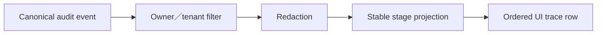
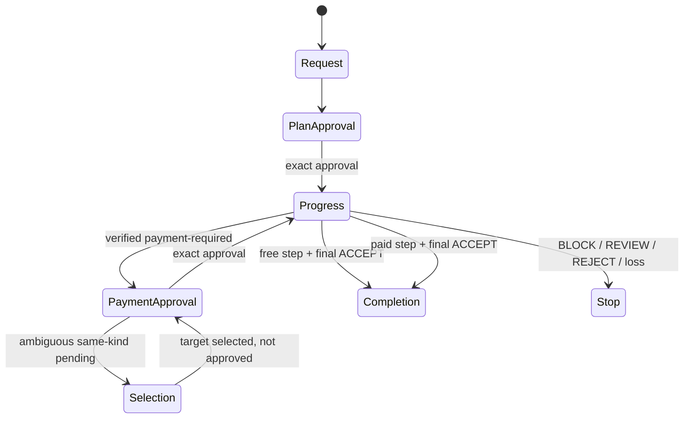

# 仲介エージェント決済統合：UI・Trace設計

- lifecycle: `target`
- primary owner: UI owner
- required reviewers: Security／Product／QA owner
- normative inputs: [HANDOFF](../MEDIATOR_PAYMENT_INTEGRATION_HANDOFF.md)、[統合要件](../MEDIATOR_PAYMENT_INTEGRATION_REQUIREMENTS.md)
- decision inputs: [OQ-003／007／010](12_DECISIONS_OPEN_QUESTIONS.md)

## 1. 文書の責務

本書は、認証後の入口、画面状態、計画承認と決済承認、backend routing結果に基づく明示選択、実trace projection、安全なerror、simulation表示のsemantic ownerである。backendの承認候補filterと排他的routingは [03 Mediation Flow](03_MEDIATION_FLOW.md)、domain stateとtrace eventのcanonical意味は [02 Domain／State](02_DOMAIN_DATA_STATE.md)、public response DTOは [06 API／A2A Contracts](06_API_A2A_CONTRACTS.md)、認証proxyとrouteは [09 Deployment](09_DEPLOYMENT_PUBLIC_BOUNDARY.md) を正本とする。

本書は `ART-UI-PROJECTION-01` のsemantic／projection ownerであり、`ART-AUTH-ROUTING-01`、`ART-AUDIT-EVENT-01`、`ART-PUBLIC-ROUTES-01` は参照専用である。

## 2. 対象範囲と対象外

対象:

- Firebase認証から `payment_user_agent` 選択済み画面への入口。
- 自然文依頼、進捗、二つの承認、明示選択、完了・停止・再実行案内。
- backendの順序付きaudit eventから安全なtrace rowへのprojection。
- refresh後の同一workflow view復元とephemeral state lossの区別。

対象外:

- 承認対象のbackend選択、状態遷移、署名、payment policy。
- raw AP2 artifact、credential、proof、private keyの表示。
- nginx、Firebase、ADK routeの設定値。

final6 browser evidenceはreal Chromium/CDPでpaid二承認とrefresh、free、`RefundPending -> Refunded`、privacyの4 caseを確認した。UIはplan targetとpayment targetを別card/digestで表示し、safe trace、`simulation`、`NOT CONFORMANT`、Cloud Runの `EPHEMERAL DEMO`/`durability=NOT PROVIDED` を一貫して表示する。cookie、CSRF、identity assertion、Mandate、capability、proof、JWT、private keyはDOM、console、network bodyに表示しない。

## 3. Information architectureと入口

認証後のlandingは `payment_user_agent` を選択済みにし、内部Agent選択UIを表示しない。画面は次の領域だけで構成する。

1. 依頼input。
2. 現在action card。計画承認、決済承認、明示選択、停止案内のいずれか一つ。
3. 実trace。順序番号でappend-only表示する。
4. 最終結果または安全な停止理由。

UIはlocal booleanや会話文から現在actionを推測せず、認証済みsame-origin APIが返す `version`、`state`、`pendingAction.kind`、nullableな `pendingAction.targetRef`、`approvalTarget`、`approvalTargetDigest` を使う。`viewVersion` と `workflowState` はpublic DTOのaliasではない。古いversionの操作は再読込を促し、自動再送しない。

## 4. 自然文依頼と進捗表示

新規依頼はpending actionが0件の場合だけ送信できる。送信後は人工的なsleepを入れず、backend eventが確定するたびに次を表示する。

- `request_received`
- `agent_discovery`
- `planning`
- `waiting_for_plan_approval`
- `a2a_executing`
- `payment_requirement_received`
- `waiting_for_payment_approval`
- `ap2_authorizing`
- `payment_submitting`
- `a2a_resuming`
- `final_validation`
- terminal state

処理中はrequestを長時間保持せず、pollまたは認証済みの許可WebSocketでsafe viewを再取得する。

## 5. 計画承認view

計画承認cardは、plannerが保存したimmutable plan snapshotだけから生成し、少なくともplan短縮ID、version、各step、選定Agent、skill、trust、商品／条件、金額上限、通貨、期限を表示する。「この承認ではMerchant Task、Checkout、支払は開始されない」と明示する。

承認inputは単一text partのUnicode code point列が完全に `承認` の場合だけ送る。UIはtrim、Unicode normalization、言換え、intent classificationを行わない。`はい`、`OK`、`承認します`、前後空白付き入力はそのままbackendへ渡し、不一致errorを表示する。

## 6. 決済承認view

決済承認cardは保存済みclosed Checkoutとpayment requirementから商品、数量、Merchant／payee、金額、通貨、fee、期限、profile、step／Task短縮IDを表示する。計画承認とは別の行為で、non-agentic Trusted Surfaceが明示同意とuser signatureを得る。Shopping Agent/orchestratorはその認可済みartifactを入力にdeterministic payment toolを進行できる。simulationはこの時点で `GUARANTEED`でありsettled/debitedではない。

`x402-wire-simulation/1` の場合はcard上部、処理中、完了、errorの全状態で `simulation` と `NOT CONFORMANT` を同時に表示し、実資産、wallet署名、facilitator、on-chain transactionがないことを隠さない。

## 7. Backend routing結果と将来の明示選択view

`ART-AUTH-ROUTING-01` の正本decisionをUIで変更しない。

| Backend result | UI action |
| --- | --- |
| payment pending 1件 | その決済承認cardだけを表示する。plan pendingの有無は選択肢にしない |
| payment pending 2件以上 | 承認inputを無効化し、同種対象の短縮ID、step、Merchant、期限を一覧する |
| payment 0件、plan pending 1件 | その計画承認cardだけを表示する |
| payment 0件、plan pending 2件以上 | 承認inputを無効化し、同種対象の短縮ID、plan version、期限を一覧する |
| pending 0件 | 通常依頼inputを表示する |

final6の `mediation-turn-request/1` はclient selectorを持たない。`selectionToken` は常にJSON `null` であり、同種pendingが複数なら承認inputを無効化して `APPROVAL_TARGET_AMBIGUOUS` を表示し、対象を自動選択しない。URL query、自由文、`targetRef`、`adkSessionId`、workflow／mediation session IDをmutation selectorとして送り返さない。

[OQ-010](12_DECISIONS_OPEN_QUESTIONS.md#oq-010) のone-time selection tokenは将来の別public schema versionに対するtarget設計である。導入時はsubject、tenant、server-derived ADK session、mediation session、target、expiryへ束縛し、選択と完全一致 `承認` を別操作にするが、この機能をfinal6実装済みとは扱わない。

## 8. 実traceのprojection

UI trace rowは `sequence`、`occurredAt`、`stage`、safe agent label、短縮plan／step／task ID、`layer=callback-hook|deterministic-validator|semantic-reviewer|final-validator`、gate ID、safe decision、safe reason codeだけを含む。callback実行とsubagent意味判断を別rowにする。raw prompt、raw Task、credential、Mandate、proof、signature、token、内部URLを表示しない。

同じevent IDの再取得は同じrowへ畳み、sequenceを並べ替えない。`PASS`、`BLOCK`、`REVIEW`、`ACCEPT`、`REJECT`を色だけで区別せずtext labelを併記する。

## 9. 完了・停止・再実行案内

`Completed` はfinal validationが `ACCEPT` の場合だけ表示する。完了viewは業務結果、safe evidence参照、simulation境界、最終安全性評価を示す。

`Cancelled`、`Blocked`、`Rejected`、`ReviewRequired` は成功と同じ見た目にしない。期限切れ／条件変更では再計画、利用者拒否では取消済み、結果不明では再送禁止と確認待ち、state lossでは「デモ状態が失われたため再実行が必要」を表示する。古いworkflow IDの再利用buttonは出さない。

refresh時は同じsubject／sessionでactive viewを取得する。404とstate loss markerの組合せだけをephemeral lossとして扱い、未知IDと他subject recordの存在を区別して漏らさない。

## 10. Error、redaction、simulation表記

| Error class | UI表示 | 許可action |
| --- | --- | --- |
| Input mismatch | 承認形式が一致しない | 同じcardで再入力 |
| Stale version／expired | 表示が古いまたは期限切れ | safe view再取得、必要なら再計画 |
| `PAYMENT_PROFILE_UNAVAILABLE` | 対応profileなし、支払未実行 | 中断または再計画 |
| `PAYMENT_PROFILE_INVALID`／`Blocked` | 検証不一致、支払未実行 | 自動再試行なし |
| `ReviewRequired` | 結果未確定、二重実行禁止 | 状態照合を待つ |
| Ephemeral state loss | デモ状態消失、過去成功を推測しない | 新規依頼 |

error detailはstable codeとsafe messageに限定し、tenant／subjectの存在差、stack trace、内部host、secretを返さない。

## 11. Screen-state-action matrix

| Domain state | Primary view | 許可input | 禁止input／副作用 |
| --- | --- | --- | --- |
| `WaitingForPlanApproval` | 計画card | 完全一致承認、拒否 | payment action |
| `Executing` | progress＋trace | なし | 新規依頼、承認 |
| `WaitingForPaymentApproval` | Checkout card | 完全一致承認、拒否 | plan承認、直接rail |
| `PaymentSubmitting`／`ResumingA2A` | progress＋trace | status取得 | 承認再送、新Task |
| `ReviewRequired` | 停止理由 | status取得 | 新支払 |
| `Completed` | 結果＋evidence参照 | 新規依頼 | 古い承認再利用 |

| Trace field | 表示 | Redaction |
| --- | --- | --- |
| event／sequence／stage／time | そのまま | なし |
| agent label、safe reason code | allowlist値 | 未知値は一般化 |
| plan／step／task／artifact ID | 短縮 | full IDはAPI内部保持 |
| digest | 必要時に短縮 | exact bytesは非表示 |
| token／credential／Mandate／proof／signature | 非表示 | field自体をpublic DTOへ含めない |

## 12. 適用要件

次のowner tableは [11 coverage manifest](11_TRACEABILITY_RELEASE.md) の生成viewであり、手編集しない。

| 要件ID | 要件へのリンク | primary design section | 検証先 |
| --- | --- | --- | --- |
| FR-014 | [要件](../MEDIATOR_PAYMENT_INTEGRATION_REQUIREMENTS.md#fr-014-実経路の可観測性) | [FR-014](#fr-014) | [TEST-006](10_TEST_STRATEGY.md#test-006)、[TEST-011](10_TEST_STRATEGY.md#test-011) |
| NFR-001 | [要件](../MEDIATOR_PAYMENT_INTEGRATION_REQUIREMENTS.md#nfr-001-応答性と実演性) | [NFR-001](#nfr-001) | [TEST-007](10_TEST_STRATEGY.md#test-007)、[TEST-011](10_TEST_STRATEGY.md#test-011) |
| UI-001 | [要件](../MEDIATOR_PAYMENT_INTEGRATION_REQUIREMENTS.md#ui-001-認証後の入口) | [UI-001](#ui-001) | [TEST-011](10_TEST_STRATEGY.md#test-011)、[TEST-012](10_TEST_STRATEGY.md#test-012) |
| UI-002 | [要件](../MEDIATOR_PAYMENT_INTEGRATION_REQUIREMENTS.md#ui-002-計画承認表示) | [UI-002](#ui-002) | [TEST-003](10_TEST_STRATEGY.md#test-003)、[TEST-011](10_TEST_STRATEGY.md#test-011) |
| UI-003 | [要件](../MEDIATOR_PAYMENT_INTEGRATION_REQUIREMENTS.md#ui-003-決済承認表示) | [UI-003](#ui-003) | [TEST-003](10_TEST_STRATEGY.md#test-003)、[TEST-011](10_TEST_STRATEGY.md#test-011) |
| UI-004 | [要件](../MEDIATOR_PAYMENT_INTEGRATION_REQUIREMENTS.md#ui-004-実trace) | [UI-004](#ui-004) | [TEST-006](10_TEST_STRATEGY.md#test-006)、[TEST-011](10_TEST_STRATEGY.md#test-011) |
| UI-005 | [要件](../MEDIATOR_PAYMENT_INTEGRATION_REQUIREMENTS.md#ui-005-安全なエラー) | [UI-005](#ui-005) | [TEST-009](10_TEST_STRATEGY.md#test-009)、[TEST-011](10_TEST_STRATEGY.md#test-011) |
| UI-006 | [要件](../MEDIATOR_PAYMENT_INTEGRATION_REQUIREMENTS.md#ui-006-simulation表記) | [UI-006](#ui-006) | [TEST-004](10_TEST_STRATEGY.md#test-004)、[TEST-011](10_TEST_STRATEGY.md#test-011) |
| UI-007 | [要件](../MEDIATOR_PAYMENT_INTEGRATION_REQUIREMENTS.md#ui-007-機密情報非表示) | [UI-007](#ui-007) | [TEST-005](10_TEST_STRATEGY.md#test-005)、[TEST-011](10_TEST_STRATEGY.md#test-011) |
| UI-008 | [要件](../MEDIATOR_PAYMENT_INTEGRATION_REQUIREMENTS.md#ui-008-デモ依頼) | [UI-008](#ui-008) | [TEST-011](10_TEST_STRATEGY.md#test-011) |

### FR-014

4章と8章の実event projectionにより、全仲介段階、agent、safe相関ID、順序、gate結果を表示する。固定文やsleepを実traceの代用にしない。

### NFR-001

承認待ちと外部処理待ちを保存済みstateとして返し、単一requestを保持しない。進捗はsafe viewの再取得で示す。

### UI-001

3章の認証後landingで `payment_user_agent` を選択済みにし、内部Agent選択を不要にする。

### UI-002

5章の計画cardに実plan、各step、Agent、上限、期限、完全一致承認条件を表示する。

### UI-003

6章の決済cardにclosed Checkoutの全承認対象、第一承認との差、完全一致承認条件を表示する。

### UI-004

8章のprojectionだけを実trace表示の正本とし、canonical eventとのcorrelationを保持する。

### UI-005

9章と10章で取消、期限切れ、不一致、state loss、`BLOCKED`、`REVIEW`を成功と分離し、安全な次actionだけを示す。

### UI-006

simulationを全支払関連viewで `NOT CONFORMANT` と併記する。

### UI-007

8章と10章のpublic DTO／redaction ruleで機密情報を表示・network responseから除外する。

### UI-008

4章の依頼inputは通常の仲介依頼を受け、正式promptと実演順序は実装後に `DEMO.md` へ反映する。

### UI-009

`RefundPending` では元支払に結びつく返金対象と明示承認待ちをsafe projectionで表示し、完了後は `Refunded` とdigest referenceだけを表示する。raw RefundRequest/Result、receipt、token、proofをbrowserへ返さない。

## 13. 関連文書と参照方向

| 参照先 | 参照理由 | 本書で再掲しない内容 |
| --- | --- | --- |
| [Domain／State](02_DOMAIN_DATA_STATE.md) | state、event意味 | canonical state／event schema |
| [Mediation Flow](03_MEDIATION_FLOW.md) | approval routing、gate schedule | backend decision table |
| [Payment Bridge](04_PAYMENT_BRIDGE_AP2_X402.md) | payment／AP2意味 | evidence、profile policy |
| [Security](05_SECURITY_TRUST_BOUNDARIES.md) | redaction、fail-closed | threat／policy本文 |
| [API／A2A](06_API_A2A_CONTRACTS.md) | public view DTO | wire field定義 |
| [Persistence](08_PERSISTENCE_RECOVERY.md) | refresh／loss | DB／recovery本文 |
| [Deployment](09_DEPLOYMENT_PUBLIC_BOUNDARY.md) | auth／route | nginx allowlist |
| [Test Strategy](10_TEST_STRATEGY.md) | browser／negative case | test手順 |

## 14. Decision参照

- [OQ-003 Subject migration](12_DECISIONS_OPEN_QUESTIONS.md#33-oq-003-subject-migration)
- [OQ-007 Public allowlist](12_DECISIONS_OPEN_QUESTIONS.md#37-oq-007-public-allowlist)
- [OQ-010 UX](12_DECISIONS_OPEN_QUESTIONS.md#310-oq-010-再計画取消明示選択ux)

