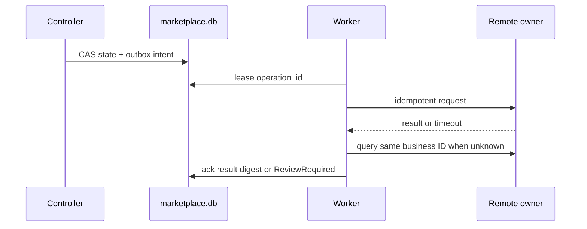
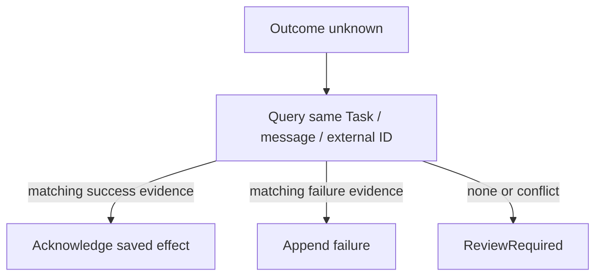

# 仲介エージェント決済統合：Persistence・Recovery設計

- lifecycle: `target`
- primary owner: Persistence owner
- required reviewers: Workflow／SRE／QA owner
- normative inputs: [HANDOFF](../MEDIATOR_PAYMENT_INTEGRATION_HANDOFF.md)、[統合要件](../MEDIATOR_PAYMENT_INTEGRATION_REQUIREMENTS.md)
- decision inputs: [OQ-001／003／008](12_DECISIONS_OPEN_QUESTIONS.md)

## 1. 文書の責務

本書は `ART-PERSISTENCE-MAPPING-01` のsemantic／physical ownerとして、logical aggregateからSQLite rowへのmapping、transaction境界、CAS、outbox、idempotency、restart recovery、reconciliation、ephemeral state loss、migrationを定義する。domain objectの意味は [02 Domain／State](02_DOMAIN_DATA_STATE.md)、flowは [03 Mediation Flow](03_MEDIATION_FLOW.md)、AP2 evidenceの意味は [04 Payment Bridge](04_PAYMENT_BRIDGE_AP2_X402.md)、wire schemaは [06 API／A2A Contracts](06_API_A2A_CONTRACTS.md) を正本とする。

## 2. 対象範囲と対象外

対象:

- 単一host／単一container内のSQLiteとworker。
- mediation、payment workflow、Merchant Task、evidenceの物理所有と変換。
- 同一instance内process restartの回復。
- Cloud Run instance置換／revision更新での明示的state loss。

対象外:

- Cloud SQL、共有DB、複数instanceの分散transaction。
- providerがない状態での実決済reconciliation。
- DB rowの直接編集による運用回復。

## 3. Durability scopeと前提

| Target | Storage | 保証 |
| --- | --- | --- |
| local durable | 明示したdata／evidence／key directory | 同一host・単一containerのrestart／recreate後に回復する |
| Cloud Run demo | mediationは明示的memory store。payment／Merchant／evidenceのSQLiteだけがinstance-local writable filesystemを使う | mediation sessionは子process restartでも消失し得る。payment／Merchant／evidence rowは同一instance内で回復し得るが、instance置換、scale down、revision更新ではすべて消失し得る |

Cloud Runでは `EPHEMERAL_CLOUD_RUN_DEMO=true` と `MEDIATION_STORE_MODE=memory` の完全一致を必須とし、Cloud SQLその他の外部永続DBを接続しない。localのSQLite v4 mediation restart証跡をCloud Runへ転用せず、min instance 1やconcurrency 1もdurabilityの証拠にしない。

## 4. Logical modelからphysical storeへのmapping

OQ-001に従い、所有を次の三DBに限定する。

| Store | Physical owner | 主なrecord |
| --- | --- | --- |
| `marketplace.db` | workflow repository | mediation session、plan snapshot、plan approval、step、continuation、payment workflow参照、payment approval、state event、gate decision、capability usage、outbox、idempotency、settlement／reconciliation／refund control |
| `paid-agent.db` | Merchant TaskStore | Agent Card snapshot参照、remote Task／context、Checkout、payment Message、receipt history、fulfillment |
| `evidence.db` | evidence repository | exact artifact bytes、digest、kind、issuer、correlation envelope、public JWK snapshot、access log |

`MediationContinuation` rowは少なくともsubject、tenant、ADK session、mediation session、plan ID／version／digest、step ID、Agent snapshot参照、task／context／order／quote、payment requirement digest、payment workflow ID、state、version、retry count、last error、created／updated／expiryを持つ。fieldのcanonical意味は `02`、serialized schemaは `06` を参照する。

AP2 objectへ仲介fieldを追加せず、OQ-008の `mediation-authorization-envelope/v1` と `mediation-completion-manifest/v1` exact bytesをevidence DBへ保存する。marketplace DBはartifact ID／digestと保存intent／ackだけを保持する。

final6のphysical minimumは `secure_mediation_agent/workflow/migrations.py` のschema v4と `secure_mediation_agent/mediation/persistence.py` で定義する。v3 payment/Merchant/evidence schemaを破壊的に変換せず、`mediation_sessions_v4` と `mediation_requests_v4` をadditiveに追加し、三DBの `schema_migrations` をv4へ進める。

| table | 必須key／check | 一意／index |
| --- | --- | --- |
| `mediation_sessions_v4` | `row_id INTEGER PRIMARY KEY AUTOINCREMENT`; `mediation_session_id`／`scope_key` NOT NULL; `state` CHECKは12状態だけ; `version INTEGER NOT NULL CHECK(version >= 0)`; `key_version CHECK(key_version > 0)`; session/view schema、nonce、ciphertext、digestはNOT NULL | `mediation_session_id` UNIQUE; active-state `scope_key` partial unique; `(scope_key,updated_at DESC,row_id DESC)` index |
| `mediation_requests_v4` | `(scope_key,request_id)` primary key; request digest NOT NULL; `status CHECK(status IN ('processing','completed','failed'))`; nullable `result_version CHECK(result_version IS NULL OR result_version >= 0)`; nullable `result_key_version CHECK(result_key_version IS NULL OR result_key_version > 0)` | primary keyがrequest idempotencyをowner scope内で一意化; `(scope_key,mediation_session_id)` index |
| `plans` / `steps` | FK session/plan, digest NOT NULL, ordinal>=1 | `(plan_id,plan_version)`, `(plan_id,plan_version,step_id)` |
| `continuations` | FK step, task/context/order/quote, state/version | partial unique active step |
| `approvals` | target/digest, nonce, owner tuple, expiry, consumed_at | unique `(kind,nonce)`, owner/pending index |
| `payment_attempts` | continuation, guarantee/settlement state, request digest | unique idempotency/guarantee/settlement IDs |
| `refunds` | original settled attempt, fulfillment failure, amount/currency, state | unique refund key/remote refund ID |
| `outbox` | operation, aggregate/version, request digest, status/lease | unique operation/idempotency, due index |
| `audit_events` | sequence, layer, component/symbol, digests, decision | unique `(correlation_id,sequence)` |
| `evidence_artifacts` | kind, exact bytes, digest | unique `(kind,digest)` |

semantic ownerは `(subject, tenantId, adkSessionId)` で照合し、physical lookupには `scope_key = hex(HMAC-SHA256(index_key, canonical_bytes({adkSessionId,subject,tenantId})))` だけを保存する。ここでfinal6の `canonical_bytes` はUTF-8、key sort、compact separator、`ensure_ascii=false` のproject実装であり、raw `subject`、`tenant_id`、`adk_session_id` columnは `mediation_sessions_v4` に存在しない。新規sessionはapplication invariantで `version == 0` を要求し、以後はexact 1ずつ増加させる。

final6のphysical CASは、準備済みrowが `new_version == expected_version + 1` の場合に限り、概念上 `UPDATE mediation_sessions_v4 SET state=?, version=?, ... WHERE scope_key=? AND mediation_session_id=? AND state=? AND version=?` を実行し、row countがexact 1の場合だけ成功とする。`state` predicateはtransaction内で読んだcurrent state、`version` predicateはcallerのexpected versionである。state updateと暗号化session/viewの置換は同じ `BEGIN IMMEDIATE` transactionでcommitし、request result completionも `(scope_key,request_id,request_digest,status='processing')` のCASでexact 1件だけ完了させる。より広いtargetのevent、outbox/idempotency insertも同一aggregate transactionにする。

SQL schemaのCHECKは上表のstate／version／key-version／request-statusだけである。session/view nonceはSQLではBLOB NOT NULLで、12-byte長とAES-GCM integrityはdecode時にapplicationがfail closedで検証する。active partial unique indexのstateは `WaitingForPlanApproval`、`Executing`、`WaitingForPaymentApproval`、`PaymentApproved`、`ResumingA2A`、`ReviewRequired`、`RefundPending`、`RefundSubmitting` である。

sessionとrequest resultは専用32-byte master keyからHKDFで分離したAES-GCM keyで暗号化する。ownerはHMAC scope keyにし、AADへowner/request/session/version/schemaを結ぶ。constructorとreadinessは固定key-check sentinelを実際に復号し、wrong key、ciphertext transplant、tamper、pre-sentinel v4をfail closedにする。pre-sentinelデータは自動信頼せず、明示resetまたはmigrationを必要とする。

## 5. Transaction boundaryとCAS

一つのaggregate更新は `marketplace.db` の一transactionで次を行う。

1. subject／tenant／session、expected state、expected versionを検証する。
2. state／continuation／approval／idempotency recordを更新する。
3. append-only state／audit eventを保存する。
4. 必要な外部operationを一意なoutbox rowとして追加する。
5. versionを1増やしてcommitする。

CAS不一致は副作用を作らずstable conflictを返す。同じ承認の並行処理では一transactionだけがnonceを消費し、他方は保存済みviewを返すかconflictにする。

複数DBを同一transactionとして扱わない。Merchant／evidence更新はoperation ID、request digest、idempotency key、ackを持つsagaとし、未完了をworkerが照合する。

| Consistency unit | Atomic write | Cross-boundary mechanism |
| --- | --- | --- |
| mediation state＋continuation＋outbox | `marketplace.db` transaction | なし |
| settlement attempt＋local ledger effect＋result | `marketplace.db` transaction | Merchant resultをdigestで参照 |
| Merchant Task＋Message＋fulfillment state | `paid-agent.db` transaction | outbox operation ID／Task ID |
| evidence bytes＋digest | `evidence.db` transaction | evidence intent／ack |

## 6. Outbox、worker、lease

Outbox rowは `operation_id`、operation type、aggregate ID、expected version、canonical request digest、idempotency key、attempt count、lease owner／expiry、next attempt、status、safe errorを持つ。operation IDは最初のstate transitionで一度だけ生成し、retryで変更しない。

workerは短いleaseをCAS取得し、成功時は保存済みresponse digestとackを記録する。process death後は期限切れleaseだけを回収する。最大attemptまたは非retryable errorでは自動成功へ進めず `Blocked`／`ReviewRequired` にする。

Operation typeごとに再実行前照会を行う。

- Task start: plan／stepに既存remote Taskがないか照会する。
- Payment submit:同じTaskとmessage IDの履歴を照会する。
- Settlement:同じattempt／external IDの結果を照会する。
- Evidence write:同じartifact digestを照合する。
- Fulfillment／refund:同じbusiness IDの完了記録を照合する。

## 7. Idempotency scopeとside-effect count

API idempotencyはsubject、tenant、operation、idempotency key、canonical request hashへ束縛する。同じkey＋同じhashは保存結果、同じkey＋異なるhashはconflictである。

| Effect | Stable key | 成功上限 |
| --- | --- | ---: |
| plan approval | plan ID／version／nonce | 1 |
| remote Task start | mediation session／step／Agent／operation | 1 |
| payment approval | continuation／Checkout digest／nonce | 1 |
| payment Message | task／context／quote／payment attempt | 1 |
| settlement | payment attempt／external ID | 1 |
| fulfillment commit | Task／order | 1 |
| Receipt／evidence artifact | artifact kind／canonical digest | 1 exact artifact |
| refund | original settlement／refund ID | 1 |

## 8. Checkpoint別restart recovery

| Checkpoint | 残存する正本 | Recovery | 禁止される推測／重複 |
| --- | --- | --- | --- |
| 計画承認待ち | plan、pending approval、state/version | 同じviewを復元 | Task start 0件のまま |
| Task start outbox lease中 | outbox、step、operation ID | TaskStore照会後に同じoperationを再開 | 新operation／新stepを作らない |
| 決済承認待ち | continuation、Task、requirement、Checkout digest | 同じpayment viewを復元 | payload／settlement 0件のまま |
| Payment submit lease中 | message ID、Task、attempt、outbox | Merchant履歴を照会してackまたは同じmessage再送 | 新Task／新attemptを作らない |
| Settlement結果不明 | attempt、external ID、request digest | 同じexternal IDをreconcile | 新charge、成功／失敗の推測 |
| Settle後、fulfillment未完了 | immutable payment evidence、fulfillment state | 同じcommitを照会し、不可能ならrefund_required | payment evidenceの上書き |
| Evidence intent未ack | artifact kind／digest／intent | evidence DB exact bytesを照合 | 異なるbytesで同じartifact IDを再利用しない |

## 9. Result unknownとreconciliation

Network timeoutをpayment failureに変換しない。authoritative remote ownerへ保存済みTask、message、attempt、external IDで照会し、次だけを許可する。

- 同じrequestの成功証拠: response digestを保存して次stateへ進む。
- 同じrequestの確定失敗証拠: failure eventをappendする。
- 証拠なし／矛盾: `ReviewRequired` を維持する。

Merchant成功後にmediation更新だけ失敗した場合も、同じTask履歴とresponse digestからcontinuationを進め、新しいTaskや支払を作らない。

## 10. Ephemeral state lossの扱い

Cloud Run instanceが置換され、workflow DB／TaskStore／evidence／generated keyの一部または全部が失われた場合、別revisionや外部artifactから成功を推測しない。古いworkflow／continuation IDは404相当のsafe responseと `EPHEMERAL_STATE_LOST` public reasonへ写像し、再実行を案内する。旧approval、nonce、selection tokenを新workflowへ移さない。

readinessとUIは `durability=NOT PROVIDED`、state reset warningを表示し、local durable acceptanceと区別する。

## 11. Migrationと互換性

Migrationはversion付きforward-onlyで、空DB、既存fixture、途中失敗、再適用を検証する。writerを停止しbackup／manifest／checksumを作ってから適用する。

- subjectなしrecordはOQ-003の `legacy_unbound` へ隔離する。
- legacy `plan_approved` booleanを署名済みapprovalへ昇格しない。
- 旧profile、Task、Receiptを新profileへ暗黙変換／resumeしない。
- unknown state／schema versionではreadinessをfail closedにする。

v2 write受入後にDBだけをpre-v2へ戻さない。compatible previous imageまたはforward fixを使い、evidenceとkeyを保全する。

## 12. Audit・recovery evidence

各recoveryはoperation ID、aggregate version、checkpoint、query target、observed result digest、decision、attempt、timeをappend-only eventへ保存する。secret、raw credential、proof、private keyを含めない。candidate testは初期record、restart対象process、期待record数、state、外部call数をartifactへ記録する。

## 13. 適用要件

次のowner tableは [11 coverage manifest](11_TRACEABILITY_RELEASE.md) の生成viewであり、手編集しない。

| 要件ID | 要件へのリンク | primary design section | 検証先 |
| --- | --- | --- | --- |
| FR-013 | [要件](../MEDIATOR_PAYMENT_INTEGRATION_REQUIREMENTS.md#fr-013-基本冪等性と二重支払防止) | [FR-013](#fr-013) | [TEST-003](10_TEST_STRATEGY.md#test-003)、[TEST-009](10_TEST_STRATEGY.md#test-009)、[TEST-013](10_TEST_STRATEGY.md#test-013) |
| FR-017 | [要件](../MEDIATOR_PAYMENT_INTEGRATION_REQUIREMENTS.md#fr-017-高度な競合再試行reconciliation) | [FR-017](#fr-017) | [TEST-013](10_TEST_STRATEGY.md#test-013)、[TEST-017](10_TEST_STRATEGY.md#test-017) |
| NFR-003 | [要件](../MEDIATOR_PAYMENT_INTEGRATION_REQUIREMENTS.md#nfr-003-監査可能性) | [NFR-003](#nfr-003) | [TEST-002](10_TEST_STRATEGY.md#test-002)、[TEST-006](10_TEST_STRATEGY.md#test-006)、[TEST-014](10_TEST_STRATEGY.md#test-014) |
| OPS-003 | [要件](../MEDIATOR_PAYMENT_INTEGRATION_REQUIREMENTS.md#ops-003-ephemeral仕様) | [OPS-003](#ops-003) | [TEST-013](10_TEST_STRATEGY.md#test-013) |
| OPS-004 | [要件](../MEDIATOR_PAYMENT_INTEGRATION_REQUIREMENTS.md#ops-004-同一instance内回復) | [OPS-004](#ops-004) | [TEST-013](10_TEST_STRATEGY.md#test-013) |
| OPS-005 | [要件](../MEDIATOR_PAYMENT_INTEGRATION_REQUIREMENTS.md#ops-005-状態消失時の扱い) | [OPS-005](#ops-005) | [TEST-013](10_TEST_STRATEGY.md#test-013) |

### FR-013

5〜9章のCAS、transactional outbox、一意operation、同一Task照会、idempotencyにより、再送、並行承認、process failureで二重Task／二重支払を作らない。

### FR-017

`future-work`。external effect直後のcrash、first-response loss、複雑retry/concurrency、外部provider reconciliationはRelease-1のnormal paid/free/refundとstable-state restartのclosureに混ぜず、別ADRとfault harnessで設計・検証する。

### NFR-003

12章の順序付きaudit／recovery eventをcandidate、test、evidenceへ相関できる形で保存する。

### OPS-003

3章と10章でCloud Runのinstance-local stateをephemeralと定義し、durableと主張しない。

### OPS-004

8章のcheckpointごとに同一instance内のSQLite、outbox、Task、idempotency keyから回復する。

### OPS-005

10章でstate lossを成功へ推測せず、古い承認／workflowを拒否して再実行を案内する。

## 14. 関連文書と参照方向

| 参照先 | 参照理由 | 本書で再掲しない内容 |
| --- | --- | --- |
| [Domain／State](02_DOMAIN_DATA_STATE.md) | logical object、state | semantic field／transition |
| [Mediation Flow](03_MEDIATION_FLOW.md) | operation発火点 | flow順序／approval routing |
| [Payment Bridge](04_PAYMENT_BRIDGE_AP2_X402.md) | evidence／payment意味 | AP2 object意味 |
| [API／A2A](06_API_A2A_CONTRACTS.md) | source wire schema | serialized field |
| [Deployment](09_DEPLOYMENT_PUBLIC_BOUNDARY.md) | target／process／readiness | public route／update手順 |
| [Test Strategy](10_TEST_STRATEGY.md) | restart／failure cases | test判定本文 |

## 15. Decision参照

- [OQ-001 Continuation ownership](12_DECISIONS_OPEN_QUESTIONS.md#31-oq-001-continuation-ownership)
- [OQ-003 Subject migration](12_DECISIONS_OPEN_QUESTIONS.md#33-oq-003-subject-migration)
- [OQ-008 Evidence envelope](12_DECISIONS_OPEN_QUESTIONS.md#38-oq-008-evidence-envelope)
