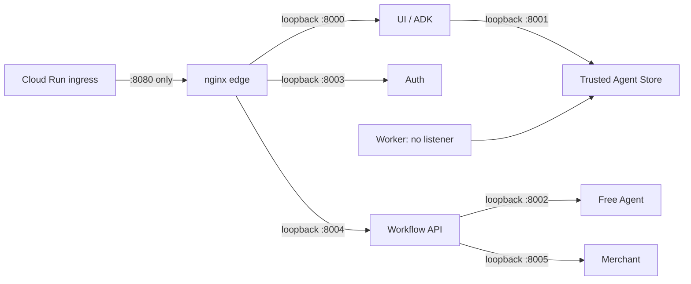
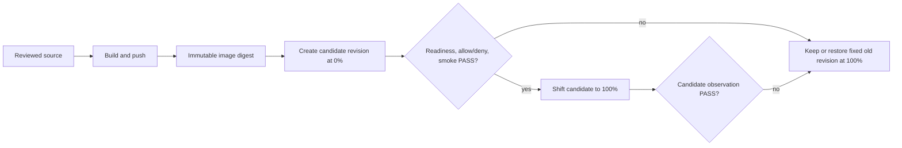

# 仲介エージェント決済統合：Deployment・Public Boundary設計

- lifecycle: `target`
- primary owner: SRE／Edge owner
- required reviewers: Security／Workflow／QA owner
- normative inputs: [HANDOFF](../MEDIATOR_PAYMENT_INTEGRATION_HANDOFF.md)、[統合要件](../MEDIATOR_PAYMENT_INTEGRATION_REQUIREMENTS.md)
- decision inputs: [OQ-006／007](12_DECISIONS_OPEN_QUESTIONS.md)

## 1. 文書の責務

本書は `ART-PUBLIC-ROUTES-01` のsemantic／configuration ownerとして、固定Cloud Run対象、単一公開port、loopback process topology、methodとpathを組にしたpublic allowlist、内部routeのdeny、readiness、更新とrollbackを定義する。認証・認可policyは [05 Security](05_SECURITY_TRUST_BOUNDARIES.md)、内部API schemaは [06 API／A2A Contracts](06_API_A2A_CONTRACTS.md)、UIの表示は [07 UI／Trace](07_UI_TRACE.md) を正本とする。

## 2. 対象範囲と対象外

対象は `gen-lang-client-0585901015`／`asia-northeast1`／`payment-user-agent-demo` の一service、一container内process、nginx境界、Vertex AI実行設定、candidate更新とrollbackである。新service、他service変更、Cloud SQL、共有永続store、一般用途reverse proxy、任意project／region／serviceを受け取るdeploy interfaceは対象外とする。

final6はlocal `linux/amd64` exact imageの証跡であり、Cloud Runのbuild/push/deploy/trafficは実行していない。Cloud Run profileを使う場合は `EPHEMERAL_CLOUD_RUN_DEMO=true` と `MEDIATION_STORE_MODE=memory` の完全一致を必須とし、`durability=NOT PROVIDED` とstate reset warningを表示する。local named-volume v4 SQLite restart PASSをCloud Run instance replacementの永続性証跡に転用しない。

## 3. Deployment targetと不変条件

更新処理は次の定数を埋込み、呼出し時引数や環境変数による置換を認めない。

| Key | Required value | Guard |
| --- | --- | --- |
| Project | `gen-lang-client-0585901015` | active projectと一致しなければ変更前に停止 |
| Region | `asia-northeast1` | region不一致なら停止 |
| Service | `payment-user-agent-demo` | service不一致なら停止 |
| Database | instance-local SQLite only | Cloud SQL binding／connectorがあれば停止 |
| Ingress | Cloud Run HTTPS → container `8080` | 他container portの公開を拒否 |
| Scale／durability | demo、ephemeral | durableという表示・claimを拒否 |

更新前にproject、region、service、現行revision、traffic、image digest、environment名だけを読取り、対象一致を確認する。他serviceを列挙して一括更新したり、名前のprefix一致で対象を広げたりしない。

## 4. Process topologyとlisten boundary

| Process | Bind | Edge exposure | Rule |
| --- | --- | --- | --- |
| nginx | `0.0.0.0:8080` | only public listener | allowlistとauth subrequestを強制 |
| UI／ADK | `127.0.0.1:8000` | allowlisted proxy only | generic catch-all禁止 |
| Trusted Agent Store | `127.0.0.1:8001` | none | browser／internetから到達不可 |
| Free Agent | `127.0.0.1:8002` | none | `agent-002` / `free-information`; payment extensionなし |
| auth | `127.0.0.1:8003` | exact auth routes only | internal verify／identityは非公開 |
| workflow API | `127.0.0.1:8004` | exact mediation routes only | subjectはauth結果から注入 |
| Merchant／paid Agent | `127.0.0.1:8005` | none | `/a2a`、`/v1`を公開しない |
| outbox worker | listenerなし | none | DB leaseで起動 |

各backendはloopbackへbindする。nginxは受信した `X-Authenticated-*`、`X-Internal-*`、capability、subject／tenant headerを必ず除去し、auth subrequestが返す内部identityだけを新規に設定する。

## 5. Public route allowlist

allowlistはmethod、正規化後exact pathまたは明示prefix、認証、CSRF、upstreamを一組として判定する。percent-decoding、重複slash、dot segment、encoded separator、未知methodはproxy前に拒否する。

| Method | Public path | Auth | CSRF／origin | Upstream／result |
| --- | --- | --- | --- | --- |
| `GET` | `/health` | 不要 | n/a | edge liveness only |
| `GET` | `/login`, `/login/` | 不要 | n/a | UI login asset |
| `GET` | `/auth/csrf` | 不要 | same-site response | auth `:8003` |
| `GET` | `/auth/firebase-config` | 不要 | no secret | auth `:8003` |
| `GET` | `/auth/deployment` | 不要 | safe deployment label only | auth `:8003` |
| `POST` | `/auth/session`, `/auth/logout` | 不要／既存session可 | exact Origin＋CSRF | auth `:8003` |
| `GET` | `/`, `/list-apps` | 必須 | same-origin | UI `:8000`; app listは `payment_user_agent` のみ |
| `GET` | `/static/…` | 必須 | same-origin | path traversal拒否、UI asset only |
| `GET`,`POST`,`DELETE` | `/apps/payment_user_agent/users/{user}/sessions[/…]` | 必須 | state-changing methodはCSRF | UI／ADK `:8000`; segment grammar固定 |
| `POST` | `/run`, `/run_sse` | 必須 | exact Origin＋CSRF | UI／ADK `:8000`; app名をserver固定 |
| `GET` | `/mediation-api/ready` | 必須 | same-origin | workflow `GET /ready` |
| `POST` | `/mediation-api/v1/turns` | 必須 | exact Origin＋CSRF | session router; verified ownerからactive sessionをserver解決 |
| `GET` | `/mediation-api/v1/view` | 必須 | same-origin | owner-scoped active safe view |

`{user}` は認証主体から導出するopaque ID、`{workflow_id}` は固定grammarのopaque IDであり、path値による主体指定を信用しない。`/list-apps` はbackend responseを透過せず、一要素の固定safe projectionを返す。

## 6. Internal route deny matrix

次をexact pathと末尾slashを含むprefixの双方で404にし、authの成否やresource存在を漏らさない: `/store`、`/store/`、`/store/sse`、`/store/health`、`/api`、`/api/`、`/ws`、`/ws/`、`/a2a`、`/a2a/`、`/v1`、`/v1/`、`/internal`、`/internal/`、`/auth/verify`、`/auth/identity`、`/payment`、`/payment/`、`/paid-agent`、`/paid-agent/`、Merchant control、workflow internal control。allowlistにないpath／methodも404とし、upstreamの404に委ねない。CORS wildcard、direct backend URL、WebSocket upgradeは許可しない。

## 7. Authentication proxyとsame-origin境界

Firebase session cookieのissuer、audience、expiry、revocationをauth processが検証し、内部subject／tenantを発行する。workflowとADKはbrowser supplied identityを使用しない。

edgeは `X-Internal-Identity`、`X-Verified-Identity`、`X-Authenticated-*`、`X-Subject`、`X-Tenant-*` とunderscore/mixed-case aliasを除去し、Firebase cookie検証済みの単一署名identity assertionだけを設定する。subject bodyを受けるidentity mint APIは採用しない。

session作成、logout、run、message／approvalはexact Origin、same-site cookie、CSRF tokenを全て要求する。preflight、redirect、cross-origin navigationでstate-changing requestを許可せず、nginxからauth verifyへのsubrequestだけが内部identity headerを生成する。

## 8. Configuration、secret、model実行環境

モデル実行はVertex AI ADC、project `gen-lang-client-0585901015`、location `global` を使う。OQ-006の固定mapどおり、matcher／planner／orchestrator／final anomaly detectorは `gemini-2.5-pro`、anomaly detectorとLegacy callbackのsecurity Judgeは `gemini-2.5-flash` だけを許可し、環境変数やrequestによるmodel差替えを拒否する。目標設計では専用service accountへモデルinvokeと必要なread権限だけを与え、静的credential JSONやAPI keyをimage／filesystem／environmentへ格納しない。

今回検証したephemeral demo revisionは既存のdefault Compute service accountを使用し、IAM／service account bindingを変更していない。Vertex ADCと許可modelの実呼出しPASSは認証経路と当該時点の権限を示すが、least-privilege実現を示さない。専用service accountへの移行と不要権限の除去は未完了のsecurity debtであり、production化または次の権限hardening releaseで別途設計・影響確認・rollbackを伴って実施する。

Cloud Run revisionのuser設定環境変数は、ephemeral profileの4項目 `EPHEMERAL_CLOUD_RUN_DEMO=true`、`MEDIATION_STORE_MODE=memory`、`APP_ENV=ephemeral-demo`、`DEV_MODE=false` と、Vertex ADCの3項目 `GOOGLE_GENAI_USE_VERTEXAI=true`、固定project、固定locationからなるexact 7項目だけを許可する。更新時はallowlist全体を置換し、余分なenv、secret env、`GOOGLE_API_KEY`、`GEMINI_API_KEY`を拒否する。

設定はversion付きallowlist schemaで検証し、unknown key、空の必須値、development bypass、wildcard host、debug secret出力を拒否する。secretはSecret Manager参照またはplatform identityから得て、build argument、image layer、log、readiness responseへ出さない。

## 9. Readinessとhealth

`/health` はnginx processのlivenessだけを返し、内部構成、revision、DB pathを公開しない。認証済み `/mediation-api/ready` は次を個別に確認し、全て成功時だけreadyとする。

- workflow／store／Merchant processへのloopback到達。
- DB schema version、writable transaction、required key material、worker heartbeat。
- public allowlist config hashと想定値、backendがloopback bindであること。
- Vertex AI ADC利用フラグと固定project／location、およびAPI key不在。IAM、ADC token取得、model availability、quotaはstartup readinessで推測せずpre-traffic probeへ分離する。
- `EPHEMERAL_CLOUD_RUN_DEMO=true` と `durability=NOT PROVIDED`。

startupはDB migration→backend→worker→auth→UI→nginxの順に進める。途中失敗ではnginxをreadyにせず、子process停止をsupervisorが検出してreadinessを落とす。

IAM、model availability、quotaはreadinessで推測せず、traffic切替前のcandidate gateで `gemini-2.5-pro` と `gemini-2.5-flash` に各1回の副作用のないprobeを送る。各probeは30秒で打ち切り、実model ID、結果、latency、service account、revision digestをevidenceへ記録し、一件でも失敗すればtrafficを切り替えない。

## 10. Build、push、update、rollback gate

| Phase | Precondition／guard | Required evidence | Stop condition |
| --- | --- | --- | --- |
| Preflight | fixed target、権限、現行revision／traffic／digestを読取 | target inventory、旧revision snapshot | 対象不一致、dirty input、Cloud SQL binding |
| Build | reviewed sourceとlockfile | SBOM、source revision、image digest | mutable tagしか得られない |
| Push | immutable digest指定 | registry digest照合 | digest照合不一致 |
| Update | 固定serviceへ新revisionを0 trafficで作成 | service diff、revision名 | 他service差分、guard失敗 |
| Validate | candidate revision指定 | readiness、auth、allow／deny、smoke report | 一件でもFAIL、証跡欠落 |
| Shift | revision名とdigest一致 | before／after traffic | 不一致、candidate未検証 |
| Observe | exact candidateへprobe | candidate-bound observation | claimと観測の不一致 |
| Rollback | 保存済み旧revision指定 | rollback traffic、old digest | 任意最新revisionへの曖昧rollback |

rollbackは旧revision名、digest、環境snapshotをpreflightで固定する。DB schemaがforward-onlyの場合はcompatible previous imageまたはforward fixを選び、DBを破壊的に戻さない。revision切替でinstance-local stateが失われ得るため、旧workflowの成功や継続を推測せずUIに再実行を案内する。

実装seamは新設 `deploy/update-payment-demo-cloudrun.sh` に固定する。固定既存serviceに `gcloud run services update ... --image <digest> --no-traffic`、candidate指定検査、明示traffic shift、保存済み旧revisionへのrollbackだけを行い、NEW-only script/service createは置換する。

## 11. Immutable artifactとprovenance

release candidateはsource revision、dependency lock digest、build invocation、SBOM、image digest、Cloud Run revision、configuration schema／allowlist hashを一つのcandidate IDへ束縛する。tag、最新revision、実行日時だけをidentityにせず、`TEST-014` とcandidate ledgerはcontent hashで参照する。再buildでdigestが変われば別candidateとして全gateをやり直す。

## 12. Ephemeral Cloud Run表示境界

Cloud Runは `durability=NOT PROVIDED`、`simulation`、state reset warningをlogin後、workflow view、readiness safe view、release claimへ一貫して表示する。min instances、concurrency、旧revision trafficを永続性の根拠にしない。instance置換後の古いworkflowは安全な404／`EPHEMERAL_STATE_LOST` とし、成功や支払結果を推測しない。

## 13. Black-box boundary判定表

| Probe class | Representative request | Expected public result | Upstream side effect |
| --- | --- | --- | --- |
| unauth allow | `GET /health`、login／auth bootstrap | allowlisted safe response | auth bootstrap only |
| authenticated allow | root、fixed app、workflow exact route | 2xx／documented safe 4xx | requested operation only |
| missing auth／CSRF | protected GET／state-changing POST | 401／403 | 0 |
| internal exact／prefix | Store、A2A、`/v1`、`/internal` | edge 404 | 0 |
| path canonicalization | encoded separator、dot、double slash | edge 404 | 0 |
| method mismatch | allowed path＋unknown method | edge 404 | 0 |
| identity spoof | external internal-identity header | safe rejectまたはauth値で置換 | spoofed subjectでは0 |
| unknown route | allowlist外 | edge 404 | 0 |

判定はdeployed URLから行い、response、nginx access decision、upstream call counterをcandidateへ結合する。statusだけでなくupstream非到達を必須oracleにする。

## 14. 適用要件

次のowner tableは [11 coverage manifest](11_TRACEABILITY_RELEASE.md) の生成viewであり、手編集しない。

| 要件ID | 要件へのリンク | primary design section | 検証先 |
| --- | --- | --- | --- |
| FR-002 | [要件](../MEDIATOR_PAYMENT_INTEGRATION_REQUIREMENTS.md#fr-002-単一の公開アプリ) | [FR-002](#fr-002) | [TEST-011](10_TEST_STRATEGY.md#test-011)、[TEST-012](10_TEST_STRATEGY.md#test-012) |
| FR-015 | [要件](../MEDIATOR_PAYMENT_INTEGRATION_REQUIREMENTS.md#fr-015-デモ運用境界) | [FR-015](#fr-015) | [TEST-012](10_TEST_STRATEGY.md#test-012)、[TEST-013](10_TEST_STRATEGY.md#test-013)、[TEST-014](10_TEST_STRATEGY.md#test-014) |
| HTTP-001 | [要件](../MEDIATOR_PAYMENT_INTEGRATION_REQUIREMENTS.md#http-001-公開app一覧) | [HTTP-001](#http-001) | [TEST-012](10_TEST_STRATEGY.md#test-012) |
| HTTP-002 | [要件](../MEDIATOR_PAYMENT_INTEGRATION_REQUIREMENTS.md#http-002-認証必須面) | [HTTP-002](#http-002) | [TEST-012](10_TEST_STRATEGY.md#test-012) |
| HTTP-003 | [要件](../MEDIATOR_PAYMENT_INTEGRATION_REQUIREMENTS.md#http-003-store非公開) | [HTTP-003](#http-003) | [TEST-012](10_TEST_STRATEGY.md#test-012) |
| HTTP-004 | [要件](../MEDIATOR_PAYMENT_INTEGRATION_REQUIREMENTS.md#http-004-a2aと内部apiの非公開) | [HTTP-004](#http-004) | [TEST-012](10_TEST_STRATEGY.md#test-012) |
| HTTP-005 | [要件](../MEDIATOR_PAYMENT_INTEGRATION_REQUIREMENTS.md#http-005-identity-header偽造防止) | [HTTP-005](#http-005) | [TEST-005](10_TEST_STRATEGY.md#test-005)、[TEST-012](10_TEST_STRATEGY.md#test-012) |
| HTTP-006 | [要件](../MEDIATOR_PAYMENT_INTEGRATION_REQUIREMENTS.md#http-006-許可routeの限定) | [HTTP-006](#http-006) | [TEST-012](10_TEST_STRATEGY.md#test-012) |
| HTTP-007 | [要件](../MEDIATOR_PAYMENT_INTEGRATION_REQUIREMENTS.md#http-007-返金経路の公開境界) | [HTTP-007](#http-007) | [TEST-012](10_TEST_STRATEGY.md#test-012)、[TEST-016](10_TEST_STRATEGY.md#test-016) |
| OPS-001 | [要件](../MEDIATOR_PAYMENT_INTEGRATION_REQUIREMENTS.md#ops-001-固定cloud-run対象) | [OPS-001](#ops-001) | [TEST-014](10_TEST_STRATEGY.md#test-014) |
| OPS-002 | [要件](../MEDIATOR_PAYMENT_INTEGRATION_REQUIREMENTS.md#ops-002-cloud-sql禁止) | [OPS-002](#ops-002) | [TEST-010](10_TEST_STRATEGY.md#test-010)、[TEST-014](10_TEST_STRATEGY.md#test-014) |
| OPS-006 | [要件](../MEDIATOR_PAYMENT_INTEGRATION_REQUIREMENTS.md#ops-006-loopback境界) | [OPS-006](#ops-006) | [TEST-008](10_TEST_STRATEGY.md#test-008)、[TEST-012](10_TEST_STRATEGY.md#test-012) |
| OPS-007 | [要件](../MEDIATOR_PAYMENT_INTEGRATION_REQUIREMENTS.md#ops-007-更新専用手順) | [OPS-007](#ops-007) | [TEST-014](10_TEST_STRATEGY.md#test-014) |
| OPS-008 | [要件](../MEDIATOR_PAYMENT_INTEGRATION_REQUIREMENTS.md#ops-008-デプロイfail-closed-guard) | [OPS-008](#ops-008) | [TEST-014](10_TEST_STRATEGY.md#test-014) |
| OPS-009 | [要件](../MEDIATOR_PAYMENT_INTEGRATION_REQUIREMENTS.md#ops-009-認証とmodel実行環境) | [OPS-009](#ops-009) | [TEST-006](10_TEST_STRATEGY.md#test-006)、[TEST-011](10_TEST_STRATEGY.md#test-011)、[TEST-014](10_TEST_STRATEGY.md#test-014) |

### FR-002

3〜6章で既存一serviceの単一nginx入口と `payment_user_agent` だけを公開する。

### FR-015

3、8、9章でdemo、ephemeral、固定対象、証跡付き更新／rollback境界を強制する。

### HTTP-001

`/list-apps` は認証済みで `payment_user_agent` のsafe固定projectionだけを返す。

### HTTP-002

業務、session、trace、workflow routeを認証必須とし、identityをauth結果へ束縛する。

### HTTP-003

Store routeはexact／prefix denyとloopback bindの二層で非公開にする。

### HTTP-004

Merchant A2A、内部API、WebSocket、旧routeを公開allowlistから除外する。

### HTTP-005

外部identity／capability headerを除去し、認証済み内部値だけをupstreamへ渡す。

### HTTP-006

5、6章のmethod＋path allowlistとdefault deny以外を公開しない。

### HTTP-007

refundは独立public endpointを追加せず、認証済みsame-origin `POST /mediation-api/v1/turns` のexact approvalだけから進行する。Merchant fault control、refund wire、settlement owner routeはloopback内部のみとし、nginx public allowlistで404にする。

### OPS-001

project、region、serviceを固定し、不一致時は変更前に停止する。

### OPS-002

Cloud SQL接続をguardで拒否し、instance-local SQLite以外を追加しない。

### OPS-006

nginx以外の全processをloopbackまたはlistenerなしに限定する。

### OPS-007

9章のimmutable digest、0 traffic検証、明示traffic shift、旧revision rollbackだけを更新手順とする。

### OPS-008

preflight、readiness、black-box、artifactのいずれかが不成立ならtrafficを切り替えない。

### OPS-009

Firebase sessionとVertex AI ADC／固定実行環境を検証し、credentialをimageへ含めない。

## 15. 関連文書と参照方向

| 参照先 | 参照理由 | 本書で再掲しない内容 |
| --- | --- | --- |
| [Security](05_SECURITY_TRUST_BOUNDARIES.md) | auth、CSRF、capability、redaction policy | policy意味 |
| [API／A2A](06_API_A2A_CONTRACTS.md) | loopback API schema | payload／error schema |
| [UI／Trace](07_UI_TRACE.md) | public screen expectation | view model |
| [Persistence](08_PERSISTENCE_RECOVERY.md) | ephemeral／restart | recovery algorithm |
| [Test Strategy](10_TEST_STRATEGY.md) | black-box／release test | scenario判定 |
| [Traceability／Release](11_TRACEABILITY_RELEASE.md) | candidate closure | release status |

## 16. Decision参照

- [OQ-006 Model実行環境](12_DECISIONS_OPEN_QUESTIONS.md#oq-006)
- [OQ-007 Public allowlist](12_DECISIONS_OPEN_QUESTIONS.md#oq-007)
