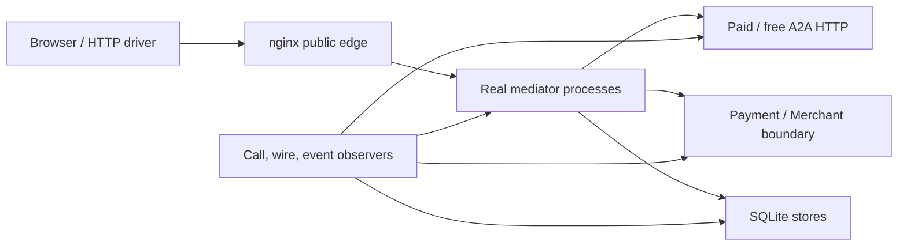

# 仲介エージェント決済統合：Test Strategy

- lifecycle: `target`
- primary owner: QA owner
- required reviewers: Workflow／Payment／Security／SRE owner
- normative inputs: [HANDOFF](../MEDIATOR_PAYMENT_INTEGRATION_HANDOFF.md)、[統合要件](../MEDIATOR_PAYMENT_INTEGRATION_REQUIREMENTS.md)
- decision inputs: [OQ-001〜010](12_DECISIONS_OPEN_QUESTIONS.md)

## 1. 文書の責務

本書は `TEST-001`〜`TEST-018` と `AC-001`〜`AC-015` のtest ownerとして、unit、integration、regression、実browser、公開境界、restart、release artifactのscenario、oracle、副作用count、失敗時判定、証跡contractを定義する。139件のcoverage集合とcandidate release判定は [11 Traceability／Release](11_TRACEABILITY_RELEASE.md) を正本とする。

## 2. 対象範囲と対象外

対象は設計contractを実装へ落とす試験、実process／loopback HTTPを通す統合試験、negative／failure injection、candidate-bound evidenceである。固定文trace、sleepだけの擬似進行、handlerを直接呼ぶだけのintegration、providerなしで実決済適合を主張すること、設計段階でPASSを主張することは対象外とする。

## 3. Test原則と合否単位

| Level | 実行境界 | 必須oracle | 主なartifact |
| --- | --- | --- | --- |
| Unit | domain／policy／canonicalization単位 | exact state、code、digest、call count | machine-readable result |
| Integration | nginxを除く実processまたはnginx含むloopback HTTP | DB row、A2A Task／Message、event順、side effect count | request／response digest、DB snapshot |
| Regression | 既存payments suite | baseline contractと全既存test | suite result |
| Browser | 実browser＋公開HTTPS／nginx | visible state、network、console、redaction | screenshot、HAR、安全化trace |
| Restart | checkpointで対象processをkill／restart | same operation／Task、duplicate 0、state recovery | checkpoint前後snapshot |
| Release | exact candidate digest／revision | suite、coverage ledger、deployment observation | signed manifest／report |

各caseは期待state、禁止state、外部callのexact count、保存record、wire digestを一つの合否単位として判定する。一項目でも未観測ならPASSにせず、retry後の成功で最初の失敗を上書きしない。

final6 exact-image baselineは `sha256:3e4e089643564e00bd6563d08a575fcf2aa2eff94ae60fd1ca518900022a89f0`。collect 315、canonicalはpayment 285、evaluation 17、jury 5 PASS/8 allowed skip、browser 4 PASS。raw fullの3 FAILはW&B API key未設定の既知evaluation-runner差分で、canonicalは `WANDB_DISABLED=true` でPASSする。validatorの11 markerはspike 11、unit 11、contract_ap2 17、contract_x402_simulation 2、integration 56、security 84、restart 41、migration 5、concurrency 4、container 16、browser 4で、いずれもfail/error/skip 0。

## 4. Fixture、test double、実componentの境界

fixtureはsubject、tenant、ADK session、mediation session、plan version、step、Agent snapshot、Task／context、quote／order、idempotency keyを明示する。時刻、nonce、UUID、model／Merchant responseはseedまたはrecorded contractで決定的にし、秘密値はartifactへ残さない。unitでは外部clock／transportをtest doubleにできるが、integrationでは実workflow、store、worker、Merchant、paid／free A2A HTTPを起動する。model／railのsimulationは境界を明示し、実適合と主張しない。

Stable gate scheduleは次のとおりである。

有料正常系は `PRE_A2A_START`、`POST_A2A_RESPONSE`、`POST_PAYMENT_REQUIREMENT`、`PRE_PAYMENT_SUBMIT`、`POST_PAYMENT_RESULT` をこの順で各1回とする。無料正常系は最初の2 gateだけ各1回、後半3 gateは0回とする。全scenarioでTask start、payment Message、settlement、fulfillment、refundをcounter化し、期待値を超えた時点でFAILにする。trace labelの存在だけをgate実行や副作用の証明にしない。

## 5. Unit test設計

### 5.1 TEST-001 支払要求

payment-required extensionの必須field、profile、quote／order／task／context binding、期限、金額、digestをtable-driven testで検証する。欠落、unknown profile、混在profile、非canonical値はfail closedとする。

### 5.2 TEST-002 相関と識別子

subject／tenant／session、plan／step、Agent snapshot、Task／context、payment workflow／attempt、artifact間の一致とOQ-002 mappingを検証する。別主体、別step、legacy alias、digest差は拒否する。

### 5.3 TEST-003 承認と状態

計画承認と決済承認の完全一致、nonce一回消費、CAS、期限、stale versionを検証する。final6ではnon-null `selectionToken` とbody/path/query/headerのsession／workflow selectorがcontroller／store access前に拒否され、同種複数pendingが承認0件でfail closedになることを負のoracleにする。one-time selection tokenのreplay／expiryと「選択だけで承認・副作用・state遷移0件」は、別public schema versionを導入する将来testであり、final6 PASSへ算入しない。

### 5.4 TEST-004 支払policy

closed Checkout、Human Present mandate、上限、通貨、Merchant、期限、x402 profile選択、simulation表示、silent fallback禁止、変更時再承認を検証する。

### 5.5 TEST-005 Security

capability scope／audience／nonce、SSRF allowlist、external content schema、redaction、gate timeout 30秒、parse failure、モデル失敗、identity header spoofを検証する。timeout／未知値／矛盾は成功ではなく `BLOCKED` または `REVIEW` とする。

## 6. Integration test設計

### 6.1 TEST-006 実仲介chain

認証済み公開依頼からmatcher、planner、計画承認、orchestrator、実A2A HTTP、final validationまでを実processで通す。保存eventとnetwork callを照合し、固定文や直接function callで段階を代替しない。

### 6.2 TEST-007 有料と無料

同じmediator入口から有料Agentと無料Agentを選び、4章のgate順／回数、Task／Message／settlement／fulfillment countを検証する。有料は同一remote Taskを継続し、無料はpayment artifactとrail callが0件であることを確認する。

### 6.3 TEST-008 HTTP相関

workflow→A2A→Merchant→payment bridgeをloopback HTTPで通し、request／responseのtask、context、quote、order、attempt、idempotency、digestを両端の保存recordと照合する。header、body、DBのどれか一つだけの一致を十分条件にしない。

### 6.4 TEST-009 異常と障害

悪意あるschema、Taskすり替え、金額変更、期限切れ、timeout、malformed detector output、Merchant 4xx／5xx／切断、settlement結果不明、evidence保存失敗を注入する。fail-closed state、禁止副作用0、reconcile target同一性をoracleにする。

## 7. Regression test設計

### 7.1 TEST-010 Regression

既存payments testを変更前baselineと同じscopeで全件実行し、新規suiteと合わせてreportする。既存failureを新統合の既知問題として免除せず、baseline差は原因、owner、release判断を記録する。

## 8. Browser test設計

### 8.1 TEST-011 実browser

login、`payment_user_agent` 入口、通常依頼、計画承認、有料Checkout、無料分岐、拒否、複数pendingのfail-closed表示、refresh、safe error、simulation表示を実browserで操作する。将来schemaでone-time tokenを導入した場合だけ明示選択操作を追加する。DOMだけでなくnetworkがallowlist外へ出ないこと、secret／Mandate／proof／内部URLがDOM、console、HARにないことを検査する。

## 9. Public boundary black-box設計

### 9.1 TEST-012 公開境界black-box

deployed URLの外側からmethod×path matrixを走査する。許可routeのauth／CSRF、未認証拒否、`/store`、`/api`、`/ws`、`/a2a`、`/v1`、`/internal`、旧payment／paid-agent route、encoded／slash variant、identity spoofがedgeで拒否されることを確認する。backend存在差をresponseへ漏らさない。

## 10. Restart／reconciliation test設計

### 10.1 TEST-013 Restart

[08 checkpoint表](08_PERSISTENCE_RECOVERY.md#tbl-rec-01) の各地点でworkflow、worker、Merchantを一つずつ停止・再起動する。operation ID、Task、Message、attemptを維持し、二重Task／支払／fulfillmentが0件であることを検証する。別instance置換は回復成功ではなく `EPHEMERAL_STATE_LOST` と再実行案内をoracleにする。

## 11. Release artifact test設計

### 11.1 TEST-014 Release artifact

exact source revision、image digest、Cloud Run revision、spec pin、test suite version、fixture digest、開始／終了時刻、結果、evidence path／hashを一candidate manifestへ束縛する。必須artifact欠落、digest不一致、別candidate混在、secret検出ではreport生成自体を失敗させる。release判定は [11](11_TRACEABILITY_RELEASE.md#8-release-closure) が行う。

### 11.2 TEST-015 要件coverage

[11のcanonical YAML](11_TRACEABILITY_RELEASE.md) と要件H3／19.3を機械比較し、139 IDがexactly once、Release-1必須126件とfuture-work 13件が排他的、各recordのscope・verification status・evidence・future triggerがschemaに従うことを検証する。final6ではdesign mapping自体をPASSさせる一方、candidateごとの126件PASS ledgerが未生成ならrelease closureを `PARTIAL` のままにする。

### TEST-016 Refund integration

実settlement済み／履行失敗fixtureでowner-bound refundが1回成功し、未精算 `GUARANTEED` はrefundせずguarantee cancelになることを検証する。

### TEST-017 Advanced concurrency/recovery

`future-work`。複雑並行／first-response-loss回復はRelease-1 blockingにしない。

### TEST-018 Expanded edge matrix

`future-work`。DNS rebindingと完全malicious/price-expiry matrixを追加する。

## 12. Cross-suite security・failure injection設計

| Injection | Expected state | Forbidden effect | Required evidence |
| --- | --- | --- | --- |
| plan拒否／期限切れ | Cancelled／Expired | Task start | approval event、call count 0 |
| Checkout変更 | WaitingForPaymentApproval | payment submit | old/new digest、再承認要求 |
| 並行承認／replay | one winner／stable conflict | duplicate operation | CAS version、nonce usage |
| Merchant timeout | ReviewRequired | new Task／new attempt | query same business ID |
| malicious A2A | Blocked | payment／fulfillment | schema／digest mismatch code |
| gate timeout／parse failure | ReviewRequired／Blocked | next external effect | gate ID、30秒timeout、safe reason |
| process crash | persisted checkpoint | duplicate effect | before／after DB snapshot |
| instance replacement | state lost | recovered-success claim | deployment observation |

## 13. 受入scenario catalog

| AC | Setup／action | Pass oracle |
| --- | --- | --- |
| AC-001 | 有料task、二段階承認 | 同一Task resume、gate 5種各1、支払／fulfillment各1 |
| AC-002 | 無料task | gate前半2種各1、payment系0、final ACCEPT |
| AC-003 | 計画拒否 | Task／payment 0、Cancelled |
| AC-004 | 決済拒否 | payment／fulfillment 0、Taskは保留／取消規則どおり |
| AC-005 | price／expiry変更 | old approval無効、再承認までsubmit 0 |
| AC-006 | replay／並行承認 | winner 1、重複副作用0 |
| AC-007 | Merchant障害 | retry／reconcileは同じID、結果不明を成功扱いしない |
| AC-008 | 悪意あるA2A | schema／identity／binding差を拒否、支払0 |
| AC-009 | final異常 | CompletedにせずBlock／Review／Reject |
| AC-010 | UI／auth | 二段階表示、safe trace、未認証拒否 |
| AC-011 | restart／loss | 同一instance回復、置換は明示loss |
| AC-012 | x402 profile | supportedのみ、silent fallbackなし |
| AC-013 | public HTTP | allowlistのみ到達、internal route非公開 |
| AC-014 | refund | settledと履行失敗に結び、明示承認後のみrefund 1 |
| AC-015 | 高度並行承認 | `future-work`。基本CASを超える競合matrixは別gate |

### 13.1 AC-001 有料タスクの正常系

実有料Agentを選定し、計画承認、closed Checkout再承認、同一Taskへの支払Message、settlement、fulfillment、final ACCEPT、evidence相関を検証する。

### 13.2 AC-002 無料タスク

無料応答ではpayment-required、Checkout、payment approval、rail、Receiptが0件のままfinal ACCEPTへ進むことを検証する。

### 13.3 AC-003 計画拒否

拒否後にTask start、payment、再計画が暗黙実行されず、安全な取消stateとなることを検証する。

### 13.4 AC-004 決済拒否

第二承認拒否後にpayment Message、settlement、fulfillmentが0件で、計画承認を決済承認として再利用しないことを検証する。

### 13.5 AC-005 価格変更・期限切れ

承認後のquote／amount／expiry変更で旧approvalを拒否し、変更後closed Checkoutの明示再承認まで副作用0とする。

### 13.6 AC-006 Replay・並行承認

同一nonce、idempotency key、expected versionへ並行要求し、CAS winnerだけが一副作用を作ることを検証する。

### 13.7 AC-007 Merchant障害

切断、timeout、5xx、結果不明を注入し、同一Task／message／attempt照会、二重charge禁止、ReviewRequiredを検証する。

### 13.8 AC-008 悪意あるA2A応答

schema逸脱、Agent／Task／context／quoteすり替え、未知extensionを拒否し、raw外部内容を権限判断へ使わないことを検証する。

### 13.9 AC-009 最終異常検知

最終gateがBLOCK／REVIEW／REJECTを返す場合に結果をCompleted表示せず、fulfillment後不整合を監査・補償対象へ送ることを検証する。

### 13.10 AC-010 UI階層と認証

認証後入口、計画／決済の別card、選択と承認の分離、safe trace、redactionを実browserで確認する。

### 13.11 AC-011 再起動とephemeral境界

同一instanceの各checkpoint回復とinstance置換時のloss表示を分け、durabilityを誤表示しないことを検証する。

### 13.12 AC-012 x402 profile分岐

固定supported profileだけを選び、unsupported／混在／invalidではrailを呼ばずstable errorにする。

### 13.13 AC-013 公開HTTP境界

許可method／pathだけを外部到達可能とし、internal route、spoofed identity、path variantをedgeで拒否する。

### 13.14 AC-014 Refund正常系

同じownerのsettlement receiptとfulfillment failureを前提に明示承認し、CAS/idempotencyでrefundがexactly 1、UI/DB/evidence相関が一致する。

### 13.15 AC-015 高度並行承認

`future-work`。Release-1は単一active sessionの基本CASまでをblockingとする。

| Oracle ID | 実component / wire | DB・trace / count |
| --- | --- | --- |
| `PAID-HAPPY-01` | typed adapters、callback hook、Trusted Surface、deterministic payment tool、demo guarantee、same Task | approval 2、Task 1、guarantee 1、fulfillment 1、final event 1 |
| `FREE-HAPPY-01` | `agent-002:8002`、callback hook、final validator | Task 1、payment/guarantee/refund 0 |
| `REFUND-01` | settled paid fixture + fulfillment failure + RefundRequest/Result | refund 1、same original refs、重複0；未精算はcancel |

## 14. Test dataとside-effect counter

| Test ID | Level | 対象境界 | 必須出力artifact |
| --- | --- | --- | --- |
| TEST-001 | unit | payment-required validator | unit report、request digest |
| TEST-002 | unit | identity／correlation／offline verifier | field照合report |
| TEST-003 | unit | approval routing／state／CAS | routing matrix、state report |
| TEST-004 | unit | Checkout／profile policy | policy report |
| TEST-005 | unit | trust boundary／gate policy | security report |
| TEST-006 | integration | 実mediator chain | ordered integration trace |
| TEST-007 | integration | paid／free分岐 | gate／side-effect counts |
| TEST-008 | integration | loopback HTTP相関 | captured wire、DB照合 |
| TEST-009 | integration | anomaly／failure | injection report |
| TEST-010 | regression | 既存payments全suite | baseline差分report |
| TEST-011 | browser | local／Cloud Run UI | screenshot、HAR |
| TEST-012 | black-box | public edge | method×path matrix |
| TEST-013 | restart | checkpoint別process restart | before／after snapshot |
| TEST-014 | release | exact candidate | candidate-bound manifest |
| TEST-015 | coverage | 139 normative ID／scope／status | exact-set report、candidate ledger |
| TEST-016 | integration | owner-bound refund正常系 | refund trace、Receipt、side-effect count |
| TEST-017 | future-work | 高度競合／first-response loss | design、known issue、trigger |
| TEST-018 | future-work | DNS rebinding／完全edge matrix | design、known issue、trigger |

test dataはopaque IDと秘密ではないsynthetic業務値を使う。side-effect counterはTask start、payment Message、settlement、fulfillment、refund、各stable gateをoperation ID別に記録し、4章と各ACのexact期待値に照合する。

## 15. Evidence出力contract

全caseは `case_id`、candidate ID、source／image／revision digest、fixture digest、開始／終了、期待／観測state、gate sequence、external call count、artifact hash、resultをJSONで記録する。screenshot／HAR／logはこのrecordからcontent hashで参照し、secret scanを通す。再実行は新run IDを持ち、過去FAILを上書きしない。

## 16. 適用要件

次のowner tableは [11 coverage manifest](11_TRACEABILITY_RELEASE.md) の生成viewであり、手編集しない。

| 要件ID | 要件へのリンク | primary design section | 検証先 |
| --- | --- | --- | --- |
| TEST-001 | [要件](../MEDIATOR_PAYMENT_INTEGRATION_REQUIREMENTS.md#test-001-unit-支払要求) | [5.1](#test-001) | self |
| TEST-002 | [要件](../MEDIATOR_PAYMENT_INTEGRATION_REQUIREMENTS.md#test-002-unit-相関と識別子) | [5.2](#test-002) | self |
| TEST-003 | [要件](../MEDIATOR_PAYMENT_INTEGRATION_REQUIREMENTS.md#test-003-unit-承認と状態) | [5.3](#test-003) | self |
| TEST-004 | [要件](../MEDIATOR_PAYMENT_INTEGRATION_REQUIREMENTS.md#test-004-unit-支払policy) | [5.4](#test-004) | self |
| TEST-005 | [要件](../MEDIATOR_PAYMENT_INTEGRATION_REQUIREMENTS.md#test-005-unit-security) | [5.5](#test-005) | self |
| TEST-006 | [要件](../MEDIATOR_PAYMENT_INTEGRATION_REQUIREMENTS.md#test-006-integration-実仲介chain) | [6.1](#test-006) | self |
| TEST-007 | [要件](../MEDIATOR_PAYMENT_INTEGRATION_REQUIREMENTS.md#test-007-integration-有料と無料) | [6.2](#test-007) | self |
| TEST-008 | [要件](../MEDIATOR_PAYMENT_INTEGRATION_REQUIREMENTS.md#test-008-integration-http相関) | [6.3](#test-008) | self |
| TEST-009 | [要件](../MEDIATOR_PAYMENT_INTEGRATION_REQUIREMENTS.md#test-009-integration-異常と障害) | [6.4](#test-009) | self |
| TEST-010 | [要件](../MEDIATOR_PAYMENT_INTEGRATION_REQUIREMENTS.md#test-010-regression) | [7.1](#test-010) | self |
| TEST-011 | [要件](../MEDIATOR_PAYMENT_INTEGRATION_REQUIREMENTS.md#test-011-実ブラウザ) | [8.1](#test-011) | self |
| TEST-012 | [要件](../MEDIATOR_PAYMENT_INTEGRATION_REQUIREMENTS.md#test-012-公開境界black-box) | [9.1](#test-012) | self |
| TEST-013 | [要件](../MEDIATOR_PAYMENT_INTEGRATION_REQUIREMENTS.md#test-013-restart) | [10.1](#test-013) | self |
| TEST-014 | [要件](../MEDIATOR_PAYMENT_INTEGRATION_REQUIREMENTS.md#test-014-release-artifact) | [11.1](#test-014) | self |
| TEST-015 | [要件](../MEDIATOR_PAYMENT_INTEGRATION_REQUIREMENTS.md#test-015-要件coverage) | [11.2](#test-015) | [11 Traceability／Release](11_TRACEABILITY_RELEASE.md#test-015) |
| TEST-016 | [要件](../MEDIATOR_PAYMENT_INTEGRATION_REQUIREMENTS.md#test-016-返金integration) | [TEST-016](#test-016) | self |
| TEST-017 | [要件](../MEDIATOR_PAYMENT_INTEGRATION_REQUIREMENTS.md#test-017-高度競合recovery) | [TEST-017](#test-017) | self（future-work） |
| TEST-018 | [要件](../MEDIATOR_PAYMENT_INTEGRATION_REQUIREMENTS.md#test-018-価格期限悪意入力の拡張matrix) | [TEST-018](#test-018) | self（future-work） |
| AC-001 | [要件](../MEDIATOR_PAYMENT_INTEGRATION_REQUIREMENTS.md#ac-001-有料タスクの正常系) | [13.1](#ac-001) | [TEST-002](#test-002)、[TEST-006](#test-006)〜[TEST-009](#test-009)、[TEST-011](#test-011) |
| AC-002 | [要件](../MEDIATOR_PAYMENT_INTEGRATION_REQUIREMENTS.md#ac-002-無料タスク) | [13.2](#ac-002) | [TEST-006](#test-006)、[TEST-007](#test-007)、[TEST-011](#test-011) |
| AC-003 | [要件](../MEDIATOR_PAYMENT_INTEGRATION_REQUIREMENTS.md#ac-003-計画拒否) | [13.3](#ac-003) | [TEST-003](#test-003)、[TEST-007](#test-007) |
| AC-004 | [要件](../MEDIATOR_PAYMENT_INTEGRATION_REQUIREMENTS.md#ac-004-決済拒否) | [13.4](#ac-004) | [TEST-003](#test-003)、[TEST-007](#test-007)、[TEST-009](#test-009) |
| AC-005 | [要件](../MEDIATOR_PAYMENT_INTEGRATION_REQUIREMENTS.md#ac-005-価格変更期限切れ) | [13.5](#ac-005) | [TEST-002](#test-002)〜[TEST-004](#test-004)、[TEST-009](#test-009) |
| AC-006 | [要件](../MEDIATOR_PAYMENT_INTEGRATION_REQUIREMENTS.md#ac-006-基本replayrouting) | [13.6](#ac-006) | [TEST-003](#test-003)、[TEST-005](#test-005)、[TEST-009](#test-009)、[TEST-013](#test-013) |
| AC-007 | [要件](../MEDIATOR_PAYMENT_INTEGRATION_REQUIREMENTS.md#ac-007-merchant障害) | [13.7](#ac-007) | [TEST-009](#test-009)、[TEST-013](#test-013) |
| AC-008 | [要件](../MEDIATOR_PAYMENT_INTEGRATION_REQUIREMENTS.md#ac-008-悪意あるa2a応答) | [13.8](#ac-008) | [TEST-001](#test-001)、[TEST-005](#test-005)、[TEST-009](#test-009) |
| AC-009 | [要件](../MEDIATOR_PAYMENT_INTEGRATION_REQUIREMENTS.md#ac-009-最終異常検知) | [13.9](#ac-009) | [TEST-006](#test-006)、[TEST-009](#test-009) |
| AC-010 | [要件](../MEDIATOR_PAYMENT_INTEGRATION_REQUIREMENTS.md#ac-010-ui階層と認証) | [13.10](#ac-010) | [TEST-011](#test-011)、[TEST-012](#test-012) |
| AC-011 | [要件](../MEDIATOR_PAYMENT_INTEGRATION_REQUIREMENTS.md#ac-011-再起動とephemeral境界) | [13.11](#ac-011) | [TEST-013](#test-013)、[TEST-014](#test-014) |
| AC-012 | [要件](../MEDIATOR_PAYMENT_INTEGRATION_REQUIREMENTS.md#ac-012-x402-profile分岐) | [13.12](#ac-012) | [TEST-004](#test-004)、[TEST-009](#test-009)、[TEST-011](#test-011) |
| AC-013 | [要件](../MEDIATOR_PAYMENT_INTEGRATION_REQUIREMENTS.md#ac-013-公開http境界) | [13.13](#ac-013) | [TEST-005](#test-005)、[TEST-012](#test-012) |
| AC-014 | [要件](../MEDIATOR_PAYMENT_INTEGRATION_REQUIREMENTS.md#ac-014-返金正常系) | [13.14](#ac-014) | [TEST-016](#test-016) |
| AC-015 | [要件](../MEDIATOR_PAYMENT_INTEGRATION_REQUIREMENTS.md#ac-015-高度な並行承認) | [13.15](#ac-015) | [TEST-017](#test-017)（future-work） |

## 17. 関連文書と参照方向

| 参照先 | 参照理由 | 本書で再掲しない内容 |
| --- | --- | --- |
| [Domain／State](02_DOMAIN_DATA_STATE.md) | state／identifier oracle | domain定義 |
| [Mediation Flow](03_MEDIATION_FLOW.md) | gate schedule／routing | flow本文 |
| [Payment Bridge](04_PAYMENT_BRIDGE_AP2_X402.md) | payment／evidence oracle | AP2意味 |
| [Security](05_SECURITY_TRUST_BOUNDARIES.md) | negative policy | threat／policy本文 |
| [API／A2A](06_API_A2A_CONTRACTS.md) | HTTP schema | wire field |
| [UI／Trace](07_UI_TRACE.md) | browser oracle | view mapping |
| [Persistence](08_PERSISTENCE_RECOVERY.md) | restart checkpoint | recovery algorithm |
| [Deployment](09_DEPLOYMENT_PUBLIC_BOUNDARY.md) | public route matrix | edge config |
| [Traceability／Release](11_TRACEABILITY_RELEASE.md) | coverage／release closure | candidate status |

## 18. Decision参照

- [Decision log](12_DECISIONS_OPEN_QUESTIONS.md#3-open-question-index)
