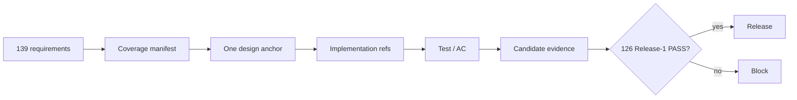

---
design_coverage_schema:
  id: "mediator-payment-integration-design-coverage/v1"
  schema_version: 1
  required_record_fields: ["requirement_id", "source_anchor", "primary_design_file", "primary_design_anchor", "artifact_owner_ids", "test_rule_refs", "acceptance_refs", "decision_refs", "implementation_refs", "evidence_kinds", "matrix_responsibility", "matrix_test_rule", "matrix_acceptance_rule", "matrix_status_rule", "release_scope", "verification_status", "verification_refs", "future_work", "future_trigger"]
  allowed_primary_design_files: ["01_OVERVIEW_ARCHITECTURE.md", "02_DOMAIN_DATA_STATE.md", "03_MEDIATION_FLOW.md", "04_PAYMENT_BRIDGE_AP2_X402.md", "05_SECURITY_TRUST_BOUNDARIES.md", "06_API_A2A_CONTRACTS.md", "07_UI_TRACE.md", "08_PERSISTENCE_RECOVERY.md", "09_DEPLOYMENT_PUBLIC_BOUNDARY.md", "10_TEST_STRATEGY.md", "11_TRACEABILITY_RELEASE.md"]
  allowed_candidate_statuses: ["PASS", "PARTIAL", "NOT RUN", "NOT CONFORMANT", "DESIGNED"]
  allowed_release_scopes: ["release-1-required", "future-work"]
  cardinality_rules:
    requirement_records: 139
    release_1_required_records: 126
    future_work_records: 13
    primary_owner_per_requirement: 1
    evidence_kinds_min_items: 1
    source_anchor_occurrences: 1
    primary_design_anchor_occurrences: 1
design_coverage_manifest:
  id: "mediator-payment-integration/requirements-design-map/v1"
  lifecycle: "target-design"
  requirements_source: "../MEDIATOR_PAYMENT_INTEGRATION_REQUIREMENTS.md"
  requirements_matrix_anchor: "#193-全規範idのforward-traceability-matrix"
  record_count: 139
  release_scope_counts: {release-1-required: 126, future-work: 13}
  generator_contract: "coverage-frontmatter-to-markdown/v1"
  generated_views: ["#tbl-rel-req-01", "#tbl-rel-design-01", "01_OVERVIEW_ARCHITECTURE.md〜11_TRACEABILITY_RELEASE.mdの適用要件owner-table"]
  candidate_snapshot:
    candidate_id: "final6"
    image_digest: "sha256:3e4e089643564e00bd6563d08a575fcf2aa2eff94ae60fd1ca518900022a89f0"
    verification_status: "PARTIAL"
    reason: "exact-image regression/browser/release validationはPASSしたが、126件を個別PASSへ結ぶcandidate ledgerと外部NOT RUN gateは未完了"
    artifacts:
      regression: "artifacts/regression-result-final6.json"
      browser: "artifacts/browser-evidence-final6.json"
      release_validation: "artifacts/ap2-x402-release-validation-final6.json"
  records:
    - requirement_id: "FR-001"
      source_anchor: "#fr-001-従来の仲介ルート"
      primary_design_file: "01_OVERVIEW_ARCHITECTURE.md"
      primary_design_anchor: "#fr-001"
      artifact_owner_ids: ["ART-DOMAIN-CONTEXT-01"]
      test_rule_refs: ["TEST-006"]
      acceptance_refs: ["AC-001", "AC-002"]
      decision_refs: []
      implementation_refs: []
      evidence_kinds: ["相関trace"]
      matrix_responsibility: "実仲介実行graph"
      matrix_test_rule: "TEST-006"
      matrix_acceptance_rule: "AC-001／002"
      matrix_status_rule: "4値・REL-012／013"
      release_scope: "release-1-required"
      verification_status: "PARTIAL"
      verification_refs: ["artifacts/regression-result-final6.json", "artifacts/browser-evidence-final6.json", "artifacts/ap2-x402-release-validation-final6.json"]
      future_work: false
      future_trigger: null
    - requirement_id: "FR-002"
      source_anchor: "#fr-002-単一の公開アプリ"
      primary_design_file: "09_DEPLOYMENT_PUBLIC_BOUNDARY.md"
      primary_design_anchor: "#fr-002"
      artifact_owner_ids: ["ART-PUBLIC-ROUTES-01"]
      test_rule_refs: ["TEST-011", "TEST-012"]
      acceptance_refs: ["AC-010", "AC-013"]
      decision_refs: ["OQ-007"]
      implementation_refs: []
      evidence_kinds: ["app一覧・browser記録"]
      matrix_responsibility: "単一公開root"
      matrix_test_rule: "TEST-011／012"
      matrix_acceptance_rule: "AC-010／013"
      matrix_status_rule: "4値・REL-012／013"
      release_scope: "release-1-required"
      verification_status: "PARTIAL"
      verification_refs: ["artifacts/regression-result-final6.json", "artifacts/browser-evidence-final6.json", "artifacts/ap2-x402-release-validation-final6.json"]
      future_work: false
      future_trigger: null
    - requirement_id: "FR-003"
      source_anchor: "#fr-003-動的なagent選定と計画"
      primary_design_file: "03_MEDIATION_FLOW.md"
      primary_design_anchor: "#fr-003"
      artifact_owner_ids: ["ART-GATE-SCHEDULE-01", "ART-AUTH-ROUTING-01", "ART-PLAN-APPROVAL-01"]
      test_rule_refs: ["TEST-002", "TEST-008"]
      acceptance_refs: ["AC-001", "AC-002"]
      decision_refs: ["OQ-002", "OQ-010"]
      implementation_refs: []
      evidence_kinds: ["plan・request照合"]
      matrix_responsibility: "Agent snapshotから実送信先へのbinding"
      matrix_test_rule: "TEST-002／008"
      matrix_acceptance_rule: "AC-001／002"
      matrix_status_rule: "4値・REL-012／013"
      release_scope: "release-1-required"
      verification_status: "PARTIAL"
      verification_refs: ["artifacts/regression-result-final6.json", "artifacts/browser-evidence-final6.json", "artifacts/ap2-x402-release-validation-final6.json"]
      future_work: false
      future_trigger: null
    - requirement_id: "FR-004"
      source_anchor: "#fr-004-計画承認gate"
      primary_design_file: "03_MEDIATION_FLOW.md"
      primary_design_anchor: "#fr-004"
      artifact_owner_ids: ["ART-GATE-SCHEDULE-01", "ART-AUTH-ROUTING-01"]
      test_rule_refs: ["TEST-003", "TEST-007"]
      acceptance_refs: ["AC-003"]
      decision_refs: ["OQ-010"]
      implementation_refs: []
      evidence_kinds: ["承認record・副作用件数"]
      matrix_responsibility: "計画承認gate"
      matrix_test_rule: "TEST-003／007"
      matrix_acceptance_rule: "AC-003"
      matrix_status_rule: "4値・REL-012／013"
      release_scope: "release-1-required"
      verification_status: "PARTIAL"
      verification_refs: ["artifacts/regression-result-final6.json", "artifacts/browser-evidence-final6.json", "artifacts/ap2-x402-release-validation-final6.json"]
      future_work: false
      future_trigger: null
    - requirement_id: "FR-005"
      source_anchor: "#fr-005-a2a応答による支払要否判定"
      primary_design_file: "03_MEDIATION_FLOW.md"
      primary_design_anchor: "#fr-005"
      artifact_owner_ids: ["ART-GATE-SCHEDULE-01", "ART-AUTH-ROUTING-01"]
      test_rule_refs: ["TEST-001", "TEST-004", "TEST-007"]
      acceptance_refs: ["AC-001", "AC-002", "AC-012"]
      decision_refs: ["OQ-004"]
      implementation_refs: []
      evidence_kinds: ["Task・extension検証記録"]
      matrix_responsibility: "構造化payment-required分岐"
      matrix_test_rule: "TEST-001／004／007"
      matrix_acceptance_rule: "AC-001／002／012"
      matrix_status_rule: "4値・REL-012／013"
      release_scope: "release-1-required"
      verification_status: "PARTIAL"
      verification_refs: ["artifacts/regression-result-final6.json", "artifacts/browser-evidence-final6.json", "artifacts/ap2-x402-release-validation-final6.json"]
      future_work: false
      future_trigger: null
    - requirement_id: "FR-006"
      source_anchor: "#fr-006-仲介stepの停止と継続"
      primary_design_file: "03_MEDIATION_FLOW.md"
      primary_design_anchor: "#fr-006"
      artifact_owner_ids: ["ART-GATE-SCHEDULE-01", "ART-AUTH-ROUTING-01", "ART-PAYMENT-BRIDGE-01"]
      test_rule_refs: ["TEST-003", "TEST-007", "TEST-013"]
      acceptance_refs: ["AC-001", "AC-006", "AC-011"]
      decision_refs: ["OQ-001"]
      implementation_refs: []
      evidence_kinds: ["continuation・state履歴"]
      matrix_responsibility: "step停止・continuation再開"
      matrix_test_rule: "TEST-003／007／013"
      matrix_acceptance_rule: "AC-001／006／011"
      matrix_status_rule: "4値・REL-012／013"
      release_scope: "release-1-required"
      verification_status: "PARTIAL"
      verification_refs: ["artifacts/regression-result-final6.json", "artifacts/browser-evidence-final6.json", "artifacts/ap2-x402-release-validation-final6.json"]
      future_work: false
      future_trigger: null
    - requirement_id: "FR-007"
      source_anchor: "#fr-007-二段階承認の分離"
      primary_design_file: "04_PAYMENT_BRIDGE_AP2_X402.md"
      primary_design_anchor: "#fr-007"
      artifact_owner_ids: ["ART-PAYMENT-APPROVAL-01", "ART-AP2-EVIDENCE-01"]
      test_rule_refs: ["TEST-003"]
      acceptance_refs: ["AC-004", "AC-006"]
      decision_refs: ["OQ-004", "OQ-010"]
      implementation_refs: []
      evidence_kinds: ["routing全case・承認record"]
      matrix_responsibility: "二承認と一意routing"
      matrix_test_rule: "TEST-003"
      matrix_acceptance_rule: "AC-004／006"
      matrix_status_rule: "4値・REL-012／013"
      release_scope: "release-1-required"
      verification_status: "PARTIAL"
      verification_refs: ["artifacts/regression-result-final6.json", "artifacts/browser-evidence-final6.json", "artifacts/ap2-x402-release-validation-final6.json"]
      future_work: false
      future_trigger: null
    - requirement_id: "FR-008"
      source_anchor: "#fr-008-ap2証跡と仲介計画の結合"
      primary_design_file: "04_PAYMENT_BRIDGE_AP2_X402.md"
      primary_design_anchor: "#fr-008"
      artifact_owner_ids: ["ART-PAYMENT-APPROVAL-01", "ART-AP2-EVIDENCE-01"]
      test_rule_refs: ["TEST-002"]
      acceptance_refs: ["AC-001"]
      decision_refs: ["OQ-004", "OQ-008"]
      implementation_refs: []
      evidence_kinds: ["offline verification結果"]
      matrix_responsibility: "AP2全field binding"
      matrix_test_rule: "TEST-002"
      matrix_acceptance_rule: "AC-001"
      matrix_status_rule: "4値・REL-012／013"
      release_scope: "release-1-required"
      verification_status: "PARTIAL"
      verification_refs: ["artifacts/regression-result-final6.json", "artifacts/browser-evidence-final6.json", "artifacts/ap2-x402-release-validation-final6.json"]
      future_work: false
      future_trigger: null
    - requirement_id: "FR-009"
      source_anchor: "#fr-009-同じremote-a2a-taskへの支払提出"
      primary_design_file: "06_API_A2A_CONTRACTS.md"
      primary_design_anchor: "#fr-009"
      artifact_owner_ids: ["ART-A2A-WIRE-01", "ART-WIRE-MAPPING-01"]
      test_rule_refs: ["TEST-008"]
      acceptance_refs: ["AC-001"]
      decision_refs: ["OQ-002", "OQ-004"]
      implementation_refs: []
      evidence_kinds: ["HTTP wire・Merchant検証"]
      matrix_responsibility: "同一Task・認可付き支払wire"
      matrix_test_rule: "TEST-008"
      matrix_acceptance_rule: "AC-001"
      matrix_status_rule: "4値・REL-012／013"
      release_scope: "release-1-required"
      verification_status: "PARTIAL"
      verification_refs: ["artifacts/regression-result-final6.json", "artifacts/browser-evidence-final6.json", "artifacts/ap2-x402-release-validation-final6.json"]
      future_work: false
      future_trigger: null
    - requirement_id: "FR-010"
      source_anchor: "#fr-010-強制的なsecurity-anomaly-gate"
      primary_design_file: "03_MEDIATION_FLOW.md"
      primary_design_anchor: "#fr-010"
      artifact_owner_ids: ["ART-GATE-SCHEDULE-01", "ART-AUTH-ROUTING-01"]
      test_rule_refs: ["TEST-006", "TEST-009"]
      acceptance_refs: ["AC-001", "AC-002", "AC-008"]
      decision_refs: ["OQ-005"]
      implementation_refs: []
      evidence_kinds: ["gate順序・回数・副作用"]
      matrix_responsibility: "stable anomaly gate"
      matrix_test_rule: "TEST-006／009"
      matrix_acceptance_rule: "AC-001／002／008"
      matrix_status_rule: "4値・REL-012／013"
      release_scope: "release-1-required"
      verification_status: "PARTIAL"
      verification_refs: ["artifacts/regression-result-final6.json", "artifacts/browser-evidence-final6.json", "artifacts/ap2-x402-release-validation-final6.json"]
      future_work: false
      future_trigger: null
    - requirement_id: "FR-011"
      source_anchor: "#fr-011-最終異常検知"
      primary_design_file: "03_MEDIATION_FLOW.md"
      primary_design_anchor: "#fr-011"
      artifact_owner_ids: ["ART-GATE-SCHEDULE-01", "ART-AUTH-ROUTING-01"]
      test_rule_refs: ["TEST-006", "TEST-007"]
      acceptance_refs: ["AC-009"]
      decision_refs: ["OQ-005"]
      implementation_refs: []
      evidence_kinds: ["final判定trace"]
      matrix_responsibility: "final validation強制"
      matrix_test_rule: "TEST-006／007"
      matrix_acceptance_rule: "AC-009"
      matrix_status_rule: "4値・REL-012／013"
      release_scope: "release-1-required"
      verification_status: "PARTIAL"
      verification_refs: ["artifacts/regression-result-final6.json", "artifacts/browser-evidence-final6.json", "artifacts/ap2-x402-release-validation-final6.json"]
      future_work: false
      future_trigger: null
    - requirement_id: "FR-012"
      source_anchor: "#fr-012-無料経路"
      primary_design_file: "03_MEDIATION_FLOW.md"
      primary_design_anchor: "#fr-012"
      artifact_owner_ids: ["ART-GATE-SCHEDULE-01", "ART-AUTH-ROUTING-01"]
      test_rule_refs: ["TEST-007"]
      acceptance_refs: ["AC-002"]
      decision_refs: []
      implementation_refs: []
      evidence_kinds: ["record件数・trace"]
      matrix_responsibility: "無料経路の決済非生成"
      matrix_test_rule: "TEST-007"
      matrix_acceptance_rule: "AC-002"
      matrix_status_rule: "4値・REL-012／013"
      release_scope: "release-1-required"
      verification_status: "PARTIAL"
      verification_refs: ["artifacts/regression-result-final6.json", "artifacts/browser-evidence-final6.json", "artifacts/ap2-x402-release-validation-final6.json"]
      future_work: false
      future_trigger: null
    - requirement_id: "FR-013"
      source_anchor: "#fr-013-基本冪等性と二重支払防止"
      primary_design_file: "08_PERSISTENCE_RECOVERY.md"
      primary_design_anchor: "#fr-013"
      artifact_owner_ids: ["ART-PERSISTENCE-MAPPING-01"]
      test_rule_refs: ["TEST-003", "TEST-009", "TEST-013"]
      acceptance_refs: ["AC-006", "AC-007", "AC-011"]
      decision_refs: ["OQ-001"]
      implementation_refs: []
      evidence_kinds: ["transaction・retry履歴"]
      matrix_responsibility: "CAS・outbox・冪等性"
      matrix_test_rule: "TEST-003／009／013"
      matrix_acceptance_rule: "AC-006／007／011"
      matrix_status_rule: "4値・REL-012／013"
      release_scope: "release-1-required"
      verification_status: "PARTIAL"
      verification_refs: ["artifacts/regression-result-final6.json", "artifacts/browser-evidence-final6.json", "artifacts/ap2-x402-release-validation-final6.json"]
      future_work: false
      future_trigger: null
    - requirement_id: "FR-014"
      source_anchor: "#fr-014-実経路の可観測性"
      primary_design_file: "07_UI_TRACE.md"
      primary_design_anchor: "#fr-014"
      artifact_owner_ids: ["ART-UI-PROJECTION-01"]
      test_rule_refs: ["TEST-006", "TEST-011"]
      acceptance_refs: ["AC-001", "AC-002"]
      decision_refs: []
      implementation_refs: []
      evidence_kinds: ["UI・監査trace"]
      matrix_responsibility: "実trace表示"
      matrix_test_rule: "TEST-006／011"
      matrix_acceptance_rule: "AC-001／002"
      matrix_status_rule: "4値・REL-012／013"
      release_scope: "release-1-required"
      verification_status: "PARTIAL"
      verification_refs: ["artifacts/regression-result-final6.json", "artifacts/browser-evidence-final6.json", "artifacts/ap2-x402-release-validation-final6.json"]
      future_work: false
      future_trigger: null
    - requirement_id: "FR-015"
      source_anchor: "#fr-015-デモ運用境界"
      primary_design_file: "09_DEPLOYMENT_PUBLIC_BOUNDARY.md"
      primary_design_anchor: "#fr-015"
      artifact_owner_ids: ["ART-PUBLIC-ROUTES-01"]
      test_rule_refs: ["TEST-012", "TEST-013", "TEST-014"]
      acceptance_refs: ["AC-010", "AC-011", "AC-013"]
      decision_refs: ["OQ-007"]
      implementation_refs: []
      evidence_kinds: ["route・deploy証跡"]
      matrix_responsibility: "デモ運用境界"
      matrix_test_rule: "TEST-012／013／014"
      matrix_acceptance_rule: "AC-010／011／013"
      matrix_status_rule: "4値・REL-012／013"
      release_scope: "release-1-required"
      verification_status: "PARTIAL"
      verification_refs: ["artifacts/regression-result-final6.json", "artifacts/browser-evidence-final6.json", "artifacts/ap2-x402-release-validation-final6.json"]
      future_work: false
      future_trigger: null
    - requirement_id: "NFR-001"
      source_anchor: "#nfr-001-応答性と実演性"
      primary_design_file: "07_UI_TRACE.md"
      primary_design_anchor: "#nfr-001"
      artifact_owner_ids: ["ART-UI-PROJECTION-01"]
      test_rule_refs: ["TEST-007", "TEST-011"]
      acceptance_refs: ["AC-001", "AC-002"]
      decision_refs: []
      implementation_refs: []
      evidence_kinds: ["timing・UI記録"]
      matrix_responsibility: "非block型進捗と人工遅延禁止"
      matrix_test_rule: "TEST-007／011"
      matrix_acceptance_rule: "AC-001／002"
      matrix_status_rule: "4値・REL-012／013"
      release_scope: "release-1-required"
      verification_status: "PARTIAL"
      verification_refs: ["artifacts/regression-result-final6.json", "artifacts/browser-evidence-final6.json", "artifacts/ap2-x402-release-validation-final6.json"]
      future_work: false
      future_trigger: null
    - requirement_id: "NFR-002"
      source_anchor: "#nfr-002-決定性と再現性"
      primary_design_file: "02_DOMAIN_DATA_STATE.md"
      primary_design_anchor: "#nfr-002"
      artifact_owner_ids: ["ART-DOMAIN-CONTEXT-01", "ART-DOMAIN-DIGEST-01"]
      test_rule_refs: ["TEST-003", "TEST-004", "TEST-006"]
      acceptance_refs: ["AC-003", "AC-004", "AC-005", "AC-006", "AC-007", "AC-008", "AC-009"]
      decision_refs: []
      implementation_refs: []
      evidence_kinds: ["再現試験結果"]
      matrix_responsibility: "決定的認可・遷移"
      matrix_test_rule: "TEST-003／004／006"
      matrix_acceptance_rule: "AC-003〜009"
      matrix_status_rule: "4値・REL-012／013"
      release_scope: "release-1-required"
      verification_status: "PARTIAL"
      verification_refs: ["artifacts/regression-result-final6.json", "artifacts/browser-evidence-final6.json", "artifacts/ap2-x402-release-validation-final6.json"]
      future_work: false
      future_trigger: null
    - requirement_id: "NFR-003"
      source_anchor: "#nfr-003-監査可能性"
      primary_design_file: "08_PERSISTENCE_RECOVERY.md"
      primary_design_anchor: "#nfr-003"
      artifact_owner_ids: ["ART-PERSISTENCE-MAPPING-01"]
      test_rule_refs: ["TEST-002", "TEST-006", "TEST-014"]
      acceptance_refs: ["AC-001", "AC-002", "AC-009"]
      decision_refs: ["OQ-001", "OQ-008"]
      implementation_refs: []
      evidence_kinds: ["candidate結合trace"]
      matrix_responsibility: "相関監査"
      matrix_test_rule: "TEST-002／006／014"
      matrix_acceptance_rule: "AC-001／002／009"
      matrix_status_rule: "4値・REL-012／013"
      release_scope: "release-1-required"
      verification_status: "PARTIAL"
      verification_refs: ["artifacts/regression-result-final6.json", "artifacts/browser-evidence-final6.json", "artifacts/ap2-x402-release-validation-final6.json"]
      future_work: false
      future_trigger: null
    - requirement_id: "NFR-004"
      source_anchor: "#nfr-004-境界付き外部通信"
      primary_design_file: "05_SECURITY_TRUST_BOUNDARIES.md"
      primary_design_anchor: "#nfr-004"
      artifact_owner_ids: ["ART-GATE-POLICY-01", "ART-CAPABILITY-01"]
      test_rule_refs: ["TEST-005", "TEST-009"]
      acceptance_refs: ["AC-007", "AC-008"]
      decision_refs: ["OQ-005"]
      implementation_refs: []
      evidence_kinds: ["timeout・size・redirect結果"]
      matrix_responsibility: "外部通信制限"
      matrix_test_rule: "TEST-005／009"
      matrix_acceptance_rule: "AC-007／008"
      matrix_status_rule: "4値・REL-012／013"
      release_scope: "release-1-required"
      verification_status: "PARTIAL"
      verification_refs: ["artifacts/regression-result-final6.json", "artifacts/browser-evidence-final6.json", "artifacts/ap2-x402-release-validation-final6.json"]
      future_work: false
      future_trigger: null
    - requirement_id: "SEC-001"
      source_anchor: "#sec-001-認証済み主体の終端間binding"
      primary_design_file: "05_SECURITY_TRUST_BOUNDARIES.md"
      primary_design_anchor: "#sec-001"
      artifact_owner_ids: ["ART-GATE-POLICY-01", "ART-CAPABILITY-01"]
      test_rule_refs: ["TEST-002", "TEST-005"]
      acceptance_refs: ["AC-006", "AC-010"]
      decision_refs: ["OQ-003"]
      implementation_refs: []
      evidence_kinds: ["identity相関証跡"]
      matrix_responsibility: "subject終端binding"
      matrix_test_rule: "TEST-002／005"
      matrix_acceptance_rule: "AC-006／010"
      matrix_status_rule: "4値・REL-012／013"
      release_scope: "release-1-required"
      verification_status: "PARTIAL"
      verification_refs: ["artifacts/regression-result-final6.json", "artifacts/browser-evidence-final6.json", "artifacts/ap2-x402-release-validation-final6.json"]
      future_work: false
      future_trigger: null
    - requirement_id: "SEC-002"
      source_anchor: "#sec-002-主体とsessionの分離"
      primary_design_file: "05_SECURITY_TRUST_BOUNDARIES.md"
      primary_design_anchor: "#sec-002"
      artifact_owner_ids: ["ART-GATE-POLICY-01", "ART-CAPABILITY-01"]
      test_rule_refs: ["TEST-003", "TEST-005"]
      acceptance_refs: ["AC-006"]
      decision_refs: ["OQ-003"]
      implementation_refs: []
      evidence_kinds: ["negative access結果"]
      matrix_responsibility: "主体・session分離"
      matrix_test_rule: "TEST-003／005"
      matrix_acceptance_rule: "AC-006"
      matrix_status_rule: "4値・REL-012／013"
      release_scope: "release-1-required"
      verification_status: "PARTIAL"
      verification_refs: ["artifacts/regression-result-final6.json", "artifacts/browser-evidence-final6.json", "artifacts/ap2-x402-release-validation-final6.json"]
      future_work: false
      future_trigger: null
    - requirement_id: "SEC-003"
      source_anchor: "#sec-003-内部identity"
      primary_design_file: "05_SECURITY_TRUST_BOUNDARIES.md"
      primary_design_anchor: "#sec-003"
      artifact_owner_ids: ["ART-GATE-POLICY-01", "ART-CAPABILITY-01"]
      test_rule_refs: ["TEST-005", "TEST-012"]
      acceptance_refs: ["AC-013"]
      decision_refs: ["OQ-003", "OQ-007"]
      implementation_refs: []
      evidence_kinds: ["header偽造試験"]
      matrix_responsibility: "内部identity検証"
      matrix_test_rule: "TEST-005／012"
      matrix_acceptance_rule: "AC-013"
      matrix_status_rule: "4値・REL-012／013"
      release_scope: "release-1-required"
      verification_status: "PARTIAL"
      verification_refs: ["artifacts/regression-result-final6.json", "artifacts/browser-evidence-final6.json", "artifacts/ap2-x402-release-validation-final6.json"]
      future_work: false
      future_trigger: null
    - requirement_id: "SEC-004"
      source_anchor: "#sec-004-支払条件の正規化"
      primary_design_file: "04_PAYMENT_BRIDGE_AP2_X402.md"
      primary_design_anchor: "#sec-004"
      artifact_owner_ids: ["ART-PAYMENT-APPROVAL-01", "ART-AP2-EVIDENCE-01"]
      test_rule_refs: ["TEST-001", "TEST-004"]
      acceptance_refs: ["AC-005", "AC-008", "AC-012"]
      decision_refs: []
      implementation_refs: []
      evidence_kinds: ["policy判定記録"]
      matrix_responsibility: "支払条件正規化"
      matrix_test_rule: "TEST-001／004"
      matrix_acceptance_rule: "AC-005／008／012"
      matrix_status_rule: "4値・REL-012／013"
      release_scope: "release-1-required"
      verification_status: "PARTIAL"
      verification_refs: ["artifacts/regression-result-final6.json", "artifacts/browser-evidence-final6.json", "artifacts/ap2-x402-release-validation-final6.json"]
      future_work: false
      future_trigger: null
    - requirement_id: "SEC-005"
      source_anchor: "#sec-005-checkout変更"
      primary_design_file: "04_PAYMENT_BRIDGE_AP2_X402.md"
      primary_design_anchor: "#sec-005"
      artifact_owner_ids: ["ART-PAYMENT-APPROVAL-01", "ART-AP2-EVIDENCE-01"]
      test_rule_refs: ["TEST-003", "TEST-004"]
      acceptance_refs: ["AC-005"]
      decision_refs: []
      implementation_refs: []
      evidence_kinds: ["旧承認拒否記録"]
      matrix_responsibility: "Checkout変更失効"
      matrix_test_rule: "TEST-003／004"
      matrix_acceptance_rule: "AC-005"
      matrix_status_rule: "4値・REL-012／013"
      release_scope: "release-1-required"
      verification_status: "PARTIAL"
      verification_refs: ["artifacts/regression-result-final6.json", "artifacts/browser-evidence-final6.json", "artifacts/ap2-x402-release-validation-final6.json"]
      future_work: false
      future_trigger: null
    - requirement_id: "SEC-006"
      source_anchor: "#sec-006-agent接続の固定とssrf防御"
      primary_design_file: "06_API_A2A_CONTRACTS.md"
      primary_design_anchor: "#sec-006"
      artifact_owner_ids: ["ART-A2A-WIRE-01", "ART-WIRE-MAPPING-01"]
      test_rule_refs: ["TEST-005", "TEST-008"]
      acceptance_refs: ["AC-008"]
      decision_refs: ["OQ-002"]
      implementation_refs: []
      evidence_kinds: ["接続先negative試験"]
      matrix_responsibility: "endpoint固定・SSRF防御"
      matrix_test_rule: "TEST-005／008"
      matrix_acceptance_rule: "AC-008"
      matrix_status_rule: "4値・REL-012／013"
      release_scope: "release-1-required"
      verification_status: "PARTIAL"
      verification_refs: ["artifacts/regression-result-final6.json", "artifacts/browser-evidence-final6.json", "artifacts/ap2-x402-release-validation-final6.json"]
      future_work: false
      future_trigger: null
    - requirement_id: "SEC-007"
      source_anchor: "#sec-007-agent-identityとcapabilityの固定"
      primary_design_file: "06_API_A2A_CONTRACTS.md"
      primary_design_anchor: "#sec-007"
      artifact_owner_ids: ["ART-A2A-WIRE-01", "ART-WIRE-MAPPING-01"]
      test_rule_refs: ["TEST-002", "TEST-005", "TEST-008"]
      acceptance_refs: ["AC-001", "AC-008"]
      decision_refs: ["OQ-002"]
      implementation_refs: []
      evidence_kinds: ["capability検証記録"]
      matrix_responsibility: "Agent・capability scope固定"
      matrix_test_rule: "TEST-002／005／008"
      matrix_acceptance_rule: "AC-001／008"
      matrix_status_rule: "4値・REL-012／013"
      release_scope: "release-1-required"
      verification_status: "PARTIAL"
      verification_refs: ["artifacts/regression-result-final6.json", "artifacts/browser-evidence-final6.json", "artifacts/ap2-x402-release-validation-final6.json"]
      future_work: false
      future_trigger: null
    - requirement_id: "SEC-008"
      source_anchor: "#sec-008-外部a2a内容の不信"
      primary_design_file: "05_SECURITY_TRUST_BOUNDARIES.md"
      primary_design_anchor: "#sec-008"
      artifact_owner_ids: ["ART-GATE-POLICY-01", "ART-CAPABILITY-01"]
      test_rule_refs: ["TEST-001", "TEST-009"]
      acceptance_refs: ["AC-008"]
      decision_refs: ["OQ-005"]
      implementation_refs: []
      evidence_kinds: ["悪意応答試験"]
      matrix_responsibility: "A2A入力不信"
      matrix_test_rule: "TEST-001／009"
      matrix_acceptance_rule: "AC-008"
      matrix_status_rule: "4値・REL-012／013"
      release_scope: "release-1-required"
      verification_status: "PARTIAL"
      verification_refs: ["artifacts/regression-result-final6.json", "artifacts/browser-evidence-final6.json", "artifacts/ap2-x402-release-validation-final6.json"]
      future_work: false
      future_trigger: null
    - requirement_id: "SEC-009"
      source_anchor: "#sec-009-llmからの権限制御分離"
      primary_design_file: "05_SECURITY_TRUST_BOUNDARIES.md"
      primary_design_anchor: "#sec-009"
      artifact_owner_ids: ["ART-GATE-POLICY-01", "ART-CAPABILITY-01"]
      test_rule_refs: ["TEST-003", "TEST-006"]
      acceptance_refs: ["AC-003", "AC-004", "AC-008"]
      decision_refs: ["OQ-005"]
      implementation_refs: []
      evidence_kinds: ["gate強制証跡"]
      matrix_responsibility: "LLMと権限の分離"
      matrix_test_rule: "TEST-003／006"
      matrix_acceptance_rule: "AC-003／004／008"
      matrix_status_rule: "4値・REL-012／013"
      release_scope: "release-1-required"
      verification_status: "PARTIAL"
      verification_refs: ["artifacts/regression-result-final6.json", "artifacts/browser-evidence-final6.json", "artifacts/ap2-x402-release-validation-final6.json"]
      future_work: false
      future_trigger: null
    - requirement_id: "SEC-010"
      source_anchor: "#sec-010-秘密情報と最小開示"
      primary_design_file: "05_SECURITY_TRUST_BOUNDARIES.md"
      primary_design_anchor: "#sec-010"
      artifact_owner_ids: ["ART-GATE-POLICY-01", "ART-CAPABILITY-01"]
      test_rule_refs: ["TEST-005", "TEST-011"]
      acceptance_refs: ["AC-010", "AC-013"]
      decision_refs: ["OQ-005", "OQ-007"]
      implementation_refs: []
      evidence_kinds: ["redaction・network記録"]
      matrix_responsibility: "secret最小開示"
      matrix_test_rule: "TEST-005／011"
      matrix_acceptance_rule: "AC-010／013"
      matrix_status_rule: "4値・REL-012／013"
      release_scope: "release-1-required"
      verification_status: "PARTIAL"
      verification_refs: ["artifacts/regression-result-final6.json", "artifacts/browser-evidence-final6.json", "artifacts/ap2-x402-release-validation-final6.json"]
      future_work: false
      future_trigger: null
    - requirement_id: "SEC-011"
      source_anchor: "#sec-011-障害時のfail-closed"
      primary_design_file: "05_SECURITY_TRUST_BOUNDARIES.md"
      primary_design_anchor: "#sec-011"
      artifact_owner_ids: ["ART-GATE-POLICY-01", "ART-CAPABILITY-01"]
      test_rule_refs: ["TEST-006", "TEST-009"]
      acceptance_refs: ["AC-007", "AC-008", "AC-009"]
      decision_refs: ["OQ-005"]
      implementation_refs: []
      evidence_kinds: ["failure state・副作用件数"]
      matrix_responsibility: "障害時fail closed"
      matrix_test_rule: "TEST-006／009"
      matrix_acceptance_rule: "AC-007／008／009"
      matrix_status_rule: "4値・REL-012／013"
      release_scope: "release-1-required"
      verification_status: "PARTIAL"
      verification_refs: ["artifacts/regression-result-final6.json", "artifacts/browser-evidence-final6.json", "artifacts/ap2-x402-release-validation-final6.json"]
      future_work: false
      future_trigger: null
    - requirement_id: "SEC-012"
      source_anchor: "#sec-012-ap2-human-present"
      primary_design_file: "04_PAYMENT_BRIDGE_AP2_X402.md"
      primary_design_anchor: "#sec-012"
      artifact_owner_ids: ["ART-PAYMENT-APPROVAL-01", "ART-AP2-EVIDENCE-01"]
      test_rule_refs: ["TEST-002"]
      acceptance_refs: ["AC-001"]
      decision_refs: ["OQ-004", "OQ-008", "OQ-009"]
      implementation_refs: []
      evidence_kinds: ["offline署名検証"]
      matrix_responsibility: "AP2 Human Present検証"
      matrix_test_rule: "TEST-002"
      matrix_acceptance_rule: "AC-001"
      matrix_status_rule: "4値・REL-012／013"
      release_scope: "release-1-required"
      verification_status: "PARTIAL"
      verification_refs: ["artifacts/regression-result-final6.json", "artifacts/browser-evidence-final6.json", "artifacts/ap2-x402-release-validation-final6.json"]
      future_work: false
      future_trigger: null
    - requirement_id: "SEC-013"
      source_anchor: "#sec-013-x402-profile選択とsilent-fallback禁止"
      primary_design_file: "04_PAYMENT_BRIDGE_AP2_X402.md"
      primary_design_anchor: "#sec-013"
      artifact_owner_ids: ["ART-PAYMENT-APPROVAL-01", "ART-AP2-EVIDENCE-01"]
      test_rule_refs: ["TEST-004", "TEST-009"]
      acceptance_refs: ["AC-012"]
      decision_refs: ["OQ-004", "OQ-009"]
      implementation_refs: []
      evidence_kinds: ["profile分岐記録"]
      matrix_responsibility: "profile選択・fallback禁止"
      matrix_test_rule: "TEST-004／009"
      matrix_acceptance_rule: "AC-012"
      matrix_status_rule: "4値・REL-012／013"
      release_scope: "release-1-required"
      verification_status: "PARTIAL"
      verification_refs: ["artifacts/regression-result-final6.json", "artifacts/browser-evidence-final6.json", "artifacts/ap2-x402-release-validation-final6.json"]
      future_work: false
      future_trigger: null
    - requirement_id: "SEC-014"
      source_anchor: "#sec-014-simulation表示"
      primary_design_file: "04_PAYMENT_BRIDGE_AP2_X402.md"
      primary_design_anchor: "#sec-014"
      artifact_owner_ids: ["ART-PAYMENT-APPROVAL-01", "ART-AP2-EVIDENCE-01"]
      test_rule_refs: ["TEST-004", "TEST-011"]
      acceptance_refs: ["AC-001", "AC-012"]
      decision_refs: ["OQ-004", "OQ-009"]
      implementation_refs: []
      evidence_kinds: ["UI・conformance証跡"]
      matrix_responsibility: "simulation表示"
      matrix_test_rule: "TEST-004／011"
      matrix_acceptance_rule: "AC-001／012"
      matrix_status_rule: "4値・REL-012／013"
      release_scope: "release-1-required"
      verification_status: "PARTIAL"
      verification_refs: ["artifacts/regression-result-final6.json", "artifacts/browser-evidence-final6.json", "artifacts/ap2-x402-release-validation-final6.json"]
      future_work: false
      future_trigger: null
    - requirement_id: "SEC-015"
      source_anchor: "#sec-015-merchantの支払認可検証"
      primary_design_file: "06_API_A2A_CONTRACTS.md"
      primary_design_anchor: "#sec-015"
      artifact_owner_ids: ["ART-A2A-WIRE-01", "ART-WIRE-MAPPING-01"]
      test_rule_refs: ["TEST-008", "TEST-009"]
      acceptance_refs: ["AC-001", "AC-008"]
      decision_refs: ["OQ-002", "OQ-004", "OQ-009"]
      implementation_refs: []
      evidence_kinds: ["wire改ざん・副作用0件"]
      matrix_responsibility: "Merchant認可検証"
      matrix_test_rule: "TEST-008／009"
      matrix_acceptance_rule: "AC-001／008"
      matrix_status_rule: "4値・REL-012／013"
      release_scope: "release-1-required"
      verification_status: "PARTIAL"
      verification_refs: ["artifacts/regression-result-final6.json", "artifacts/browser-evidence-final6.json", "artifacts/ap2-x402-release-validation-final6.json"]
      future_work: false
      future_trigger: null
    - requirement_id: "SEC-016"
      source_anchor: "#sec-016-従来security-callbackの維持"
      primary_design_file: "05_SECURITY_TRUST_BOUNDARIES.md"
      primary_design_anchor: "#sec-016"
      artifact_owner_ids: ["ART-GATE-POLICY-01", "ART-CAPABILITY-01"]
      test_rule_refs: ["TEST-006", "TEST-010"]
      acceptance_refs: ["AC-001", "AC-002"]
      decision_refs: ["OQ-005"]
      implementation_refs: []
      evidence_kinds: ["callback前後trace"]
      matrix_responsibility: "従来security callback維持"
      matrix_test_rule: "TEST-006／010"
      matrix_acceptance_rule: "AC-001／002"
      matrix_status_rule: "4値・REL-012／013"
      release_scope: "release-1-required"
      verification_status: "PARTIAL"
      verification_refs: ["artifacts/regression-result-final6.json", "artifacts/browser-evidence-final6.json", "artifacts/ap2-x402-release-validation-final6.json"]
      future_work: false
      future_trigger: null
    - requirement_id: "DATA-001"
      source_anchor: "#data-001-主体相関"
      primary_design_file: "02_DOMAIN_DATA_STATE.md"
      primary_design_anchor: "#data-001"
      artifact_owner_ids: ["ART-DOMAIN-CONTEXT-01", "ART-DOMAIN-DIGEST-01"]
      test_rule_refs: ["TEST-002", "TEST-003", "TEST-005"]
      acceptance_refs: ["AC-006"]
      decision_refs: ["OQ-003"]
      implementation_refs: []
      evidence_kinds: ["record・query照合"]
      matrix_responsibility: "主体相関schema"
      matrix_test_rule: "TEST-002／003／005"
      matrix_acceptance_rule: "AC-006"
      matrix_status_rule: "4値・REL-012／013"
      release_scope: "release-1-required"
      verification_status: "PARTIAL"
      verification_refs: ["artifacts/regression-result-final6.json", "artifacts/browser-evidence-final6.json", "artifacts/ap2-x402-release-validation-final6.json"]
      future_work: false
      future_trigger: null
    - requirement_id: "DATA-002"
      source_anchor: "#data-002-仲介計画相関"
      primary_design_file: "02_DOMAIN_DATA_STATE.md"
      primary_design_anchor: "#data-002"
      artifact_owner_ids: ["ART-DOMAIN-CONTEXT-01", "ART-DOMAIN-DIGEST-01"]
      test_rule_refs: ["TEST-002"]
      acceptance_refs: ["AC-001"]
      decision_refs: ["OQ-008"]
      implementation_refs: []
      evidence_kinds: ["evidence field照合"]
      matrix_responsibility: "plan・第一承認field"
      matrix_test_rule: "TEST-002"
      matrix_acceptance_rule: "AC-001"
      matrix_status_rule: "4値・REL-012／013"
      release_scope: "release-1-required"
      verification_status: "PARTIAL"
      verification_refs: ["artifacts/regression-result-final6.json", "artifacts/browser-evidence-final6.json", "artifacts/ap2-x402-release-validation-final6.json"]
      future_work: false
      future_trigger: null
    - requirement_id: "DATA-003"
      source_anchor: "#data-003-選定agent-snapshot"
      primary_design_file: "02_DOMAIN_DATA_STATE.md"
      primary_design_anchor: "#data-003"
      artifact_owner_ids: ["ART-DOMAIN-CONTEXT-01", "ART-DOMAIN-DIGEST-01"]
      test_rule_refs: ["TEST-002", "TEST-008"]
      acceptance_refs: ["AC-001", "AC-002"]
      decision_refs: ["OQ-002"]
      implementation_refs: []
      evidence_kinds: ["snapshot・wire照合"]
      matrix_responsibility: "Agent immutable snapshot"
      matrix_test_rule: "TEST-002／008"
      matrix_acceptance_rule: "AC-001／002"
      matrix_status_rule: "4値・REL-012／013"
      release_scope: "release-1-required"
      verification_status: "PARTIAL"
      verification_refs: ["artifacts/regression-result-final6.json", "artifacts/browser-evidence-final6.json", "artifacts/ap2-x402-release-validation-final6.json"]
      future_work: false
      future_trigger: null
    - requirement_id: "DATA-004"
      source_anchor: "#data-004-remote-task相関"
      primary_design_file: "02_DOMAIN_DATA_STATE.md"
      primary_design_anchor: "#data-004"
      artifact_owner_ids: ["ART-DOMAIN-CONTEXT-01", "ART-DOMAIN-DIGEST-01"]
      test_rule_refs: ["TEST-002", "TEST-008"]
      acceptance_refs: ["AC-001"]
      decision_refs: ["OQ-002"]
      implementation_refs: []
      evidence_kinds: ["Task ID・digest履歴"]
      matrix_responsibility: "remote Task相関"
      matrix_test_rule: "TEST-002／008"
      matrix_acceptance_rule: "AC-001"
      matrix_status_rule: "4値・REL-012／013"
      release_scope: "release-1-required"
      verification_status: "PARTIAL"
      verification_refs: ["artifacts/regression-result-final6.json", "artifacts/browser-evidence-final6.json", "artifacts/ap2-x402-release-validation-final6.json"]
      future_work: false
      future_trigger: null
    - requirement_id: "DATA-005"
      source_anchor: "#data-005-決済相関"
      primary_design_file: "02_DOMAIN_DATA_STATE.md"
      primary_design_anchor: "#data-005"
      artifact_owner_ids: ["ART-DOMAIN-CONTEXT-01", "ART-DOMAIN-DIGEST-01"]
      test_rule_refs: ["TEST-002"]
      acceptance_refs: ["AC-001", "AC-005"]
      decision_refs: ["OQ-008"]
      implementation_refs: []
      evidence_kinds: ["evidence field照合"]
      matrix_responsibility: "決済・第二承認field"
      matrix_test_rule: "TEST-002"
      matrix_acceptance_rule: "AC-001／005"
      matrix_status_rule: "4値・REL-012／013"
      release_scope: "release-1-required"
      verification_status: "PARTIAL"
      verification_refs: ["artifacts/regression-result-final6.json", "artifacts/browser-evidence-final6.json", "artifacts/ap2-x402-release-validation-final6.json"]
      future_work: false
      future_trigger: null
    - requirement_id: "DATA-006"
      source_anchor: "#data-006-継続制御"
      primary_design_file: "02_DOMAIN_DATA_STATE.md"
      primary_design_anchor: "#data-006"
      artifact_owner_ids: ["ART-DOMAIN-CONTEXT-01", "ART-DOMAIN-DIGEST-01"]
      test_rule_refs: ["TEST-003", "TEST-009", "TEST-013"]
      acceptance_refs: ["AC-006", "AC-007", "AC-011"]
      decision_refs: ["OQ-001"]
      implementation_refs: []
      evidence_kinds: ["version・競合記録"]
      matrix_responsibility: "continuation CAS"
      matrix_test_rule: "TEST-003／009／013"
      matrix_acceptance_rule: "AC-006／007／011"
      matrix_status_rule: "4値・REL-012／013"
      release_scope: "release-1-required"
      verification_status: "PARTIAL"
      verification_refs: ["artifacts/regression-result-final6.json", "artifacts/browser-evidence-final6.json", "artifacts/ap2-x402-release-validation-final6.json"]
      future_work: false
      future_trigger: null
    - requirement_id: "DATA-007"
      source_anchor: "#data-007-識別子の正規化"
      primary_design_file: "02_DOMAIN_DATA_STATE.md"
      primary_design_anchor: "#data-007"
      artifact_owner_ids: ["ART-DOMAIN-CONTEXT-01", "ART-DOMAIN-DIGEST-01"]
      test_rule_refs: ["TEST-002", "TEST-005"]
      acceptance_refs: ["AC-001", "AC-008"]
      decision_refs: ["OQ-002"]
      implementation_refs: []
      evidence_kinds: ["alias mapping試験"]
      matrix_responsibility: "identifier mapping"
      matrix_test_rule: "TEST-002／005"
      matrix_acceptance_rule: "AC-001／008"
      matrix_status_rule: "4値・REL-012／013"
      release_scope: "release-1-required"
      verification_status: "PARTIAL"
      verification_refs: ["artifacts/regression-result-final6.json", "artifacts/browser-evidence-final6.json", "artifacts/ap2-x402-release-validation-final6.json"]
      future_work: false
      future_trigger: null
    - requirement_id: "DATA-008"
      source_anchor: "#data-008-監査相関"
      primary_design_file: "02_DOMAIN_DATA_STATE.md"
      primary_design_anchor: "#data-008"
      artifact_owner_ids: ["ART-DOMAIN-CONTEXT-01", "ART-DOMAIN-DIGEST-01", "ART-AUDIT-EVENT-01"]
      test_rule_refs: ["TEST-002", "TEST-006"]
      acceptance_refs: ["AC-001", "AC-009"]
      decision_refs: ["OQ-008"]
      implementation_refs: []
      evidence_kinds: ["順序付き監査event"]
      matrix_responsibility: "監査相関chain"
      matrix_test_rule: "TEST-002／006"
      matrix_acceptance_rule: "AC-001／009"
      matrix_status_rule: "4値・REL-012／013"
      release_scope: "release-1-required"
      verification_status: "PARTIAL"
      verification_refs: ["artifacts/regression-result-final6.json", "artifacts/browser-evidence-final6.json", "artifacts/ap2-x402-release-validation-final6.json"]
      future_work: false
      future_trigger: null
    - requirement_id: "STATE-001"
      source_anchor: "#state-001-計画承認前"
      primary_design_file: "02_DOMAIN_DATA_STATE.md"
      primary_design_anchor: "#state-001"
      artifact_owner_ids: ["ART-DOMAIN-CONTEXT-01", "ART-DOMAIN-DIGEST-01"]
      test_rule_refs: ["TEST-003", "TEST-007"]
      acceptance_refs: ["AC-003"]
      decision_refs: ["OQ-010"]
      implementation_refs: []
      evidence_kinds: ["state transition履歴"]
      matrix_responsibility: "計画承認待ち遷移"
      matrix_test_rule: "TEST-003／007"
      matrix_acceptance_rule: "AC-003"
      matrix_status_rule: "4値・REL-012／013"
      release_scope: "release-1-required"
      verification_status: "PARTIAL"
      verification_refs: ["artifacts/regression-result-final6.json", "artifacts/browser-evidence-final6.json", "artifacts/ap2-x402-release-validation-final6.json"]
      future_work: false
      future_trigger: null
    - requirement_id: "STATE-002"
      source_anchor: "#state-002-a2a実行分岐"
      primary_design_file: "02_DOMAIN_DATA_STATE.md"
      primary_design_anchor: "#state-002"
      artifact_owner_ids: ["ART-DOMAIN-CONTEXT-01", "ART-DOMAIN-DIGEST-01"]
      test_rule_refs: ["TEST-001", "TEST-006", "TEST-007"]
      acceptance_refs: ["AC-001", "AC-002", "AC-008"]
      decision_refs: []
      implementation_refs: []
      evidence_kinds: ["分岐・gate記録"]
      matrix_responsibility: "A2A応答分岐"
      matrix_test_rule: "TEST-001／006／007"
      matrix_acceptance_rule: "AC-001／002／008"
      matrix_status_rule: "4値・REL-012／013"
      release_scope: "release-1-required"
      verification_status: "PARTIAL"
      verification_refs: ["artifacts/regression-result-final6.json", "artifacts/browser-evidence-final6.json", "artifacts/ap2-x402-release-validation-final6.json"]
      future_work: false
      future_trigger: null
    - requirement_id: "STATE-003"
      source_anchor: "#state-003-決済承認待ち"
      primary_design_file: "02_DOMAIN_DATA_STATE.md"
      primary_design_anchor: "#state-003"
      artifact_owner_ids: ["ART-DOMAIN-CONTEXT-01", "ART-DOMAIN-DIGEST-01"]
      test_rule_refs: ["TEST-003", "TEST-007"]
      acceptance_refs: ["AC-004", "AC-005", "AC-006"]
      decision_refs: ["OQ-010"]
      implementation_refs: []
      evidence_kinds: ["state・副作用件数"]
      matrix_responsibility: "決済承認待ち遷移"
      matrix_test_rule: "TEST-003／007"
      matrix_acceptance_rule: "AC-004／005／006"
      matrix_status_rule: "4値・REL-012／013"
      release_scope: "release-1-required"
      verification_status: "PARTIAL"
      verification_refs: ["artifacts/regression-result-final6.json", "artifacts/browser-evidence-final6.json", "artifacts/ap2-x402-release-validation-final6.json"]
      future_work: false
      future_trigger: null
    - requirement_id: "STATE-004"
      source_anchor: "#state-004-支払提出"
      primary_design_file: "02_DOMAIN_DATA_STATE.md"
      primary_design_anchor: "#state-004"
      artifact_owner_ids: ["ART-DOMAIN-CONTEXT-01", "ART-DOMAIN-DIGEST-01"]
      test_rule_refs: ["TEST-004", "TEST-006", "TEST-009"]
      acceptance_refs: ["AC-001", "AC-007", "AC-008"]
      decision_refs: []
      implementation_refs: []
      evidence_kinds: ["state・gate履歴"]
      matrix_responsibility: "支払提出遷移"
      matrix_test_rule: "TEST-004／006／009"
      matrix_acceptance_rule: "AC-001／007／008"
      matrix_status_rule: "4値・REL-012／013"
      release_scope: "release-1-required"
      verification_status: "PARTIAL"
      verification_refs: ["artifacts/regression-result-final6.json", "artifacts/browser-evidence-final6.json", "artifacts/ap2-x402-release-validation-final6.json"]
      future_work: false
      future_trigger: null
    - requirement_id: "STATE-005"
      source_anchor: "#state-005-同一task再開"
      primary_design_file: "02_DOMAIN_DATA_STATE.md"
      primary_design_anchor: "#state-005"
      artifact_owner_ids: ["ART-DOMAIN-CONTEXT-01", "ART-DOMAIN-DIGEST-01"]
      test_rule_refs: ["TEST-008", "TEST-009"]
      acceptance_refs: ["AC-001", "AC-007"]
      decision_refs: []
      implementation_refs: []
      evidence_kinds: ["Task相関・state履歴"]
      matrix_responsibility: "同一Task再開遷移"
      matrix_test_rule: "TEST-008／009"
      matrix_acceptance_rule: "AC-001／007"
      matrix_status_rule: "4値・REL-012／013"
      release_scope: "release-1-required"
      verification_status: "PARTIAL"
      verification_refs: ["artifacts/regression-result-final6.json", "artifacts/browser-evidence-final6.json", "artifacts/ap2-x402-release-validation-final6.json"]
      future_work: false
      future_trigger: null
    - requirement_id: "STATE-006"
      source_anchor: "#state-006-複数step"
      primary_design_file: "02_DOMAIN_DATA_STATE.md"
      primary_design_anchor: "#state-006"
      artifact_owner_ids: ["ART-DOMAIN-CONTEXT-01", "ART-DOMAIN-DIGEST-01"]
      test_rule_refs: ["TEST-007"]
      acceptance_refs: ["AC-001", "AC-002"]
      decision_refs: []
      implementation_refs: []
      evidence_kinds: ["step履歴"]
      matrix_responsibility: "複数step遷移"
      matrix_test_rule: "TEST-007"
      matrix_acceptance_rule: "AC-001／002"
      matrix_status_rule: "4値・REL-012／013"
      release_scope: "release-1-required"
      verification_status: "PARTIAL"
      verification_refs: ["artifacts/regression-result-final6.json", "artifacts/browser-evidence-final6.json", "artifacts/ap2-x402-release-validation-final6.json"]
      future_work: false
      future_trigger: null
    - requirement_id: "STATE-007"
      source_anchor: "#state-007-最終判定"
      primary_design_file: "02_DOMAIN_DATA_STATE.md"
      primary_design_anchor: "#state-007"
      artifact_owner_ids: ["ART-DOMAIN-CONTEXT-01", "ART-DOMAIN-DIGEST-01"]
      test_rule_refs: ["TEST-006", "TEST-007"]
      acceptance_refs: ["AC-009"]
      decision_refs: []
      implementation_refs: []
      evidence_kinds: ["ACCEPT・REJECT・REVIEW結果"]
      matrix_responsibility: "final判定遷移"
      matrix_test_rule: "TEST-006／007"
      matrix_acceptance_rule: "AC-009"
      matrix_status_rule: "4値・REL-012／013"
      release_scope: "release-1-required"
      verification_status: "PARTIAL"
      verification_refs: ["artifacts/regression-result-final6.json", "artifacts/browser-evidence-final6.json", "artifacts/ap2-x402-release-validation-final6.json"]
      future_work: false
      future_trigger: null
    - requirement_id: "STATE-008"
      source_anchor: "#state-008-再計画"
      primary_design_file: "02_DOMAIN_DATA_STATE.md"
      primary_design_anchor: "#state-008"
      artifact_owner_ids: ["ART-DOMAIN-CONTEXT-01", "ART-DOMAIN-DIGEST-01"]
      test_rule_refs: ["TEST-003", "TEST-004"]
      acceptance_refs: ["AC-005"]
      decision_refs: ["OQ-010"]
      implementation_refs: []
      evidence_kinds: ["version・digest変更記録"]
      matrix_responsibility: "再計画・承認失効"
      matrix_test_rule: "TEST-003／004"
      matrix_acceptance_rule: "AC-005"
      matrix_status_rule: "4値・REL-012／013"
      release_scope: "future-work"
      verification_status: "DESIGNED"
      verification_refs: ["12_DECISIONS_OPEN_QUESTIONS.md#future-work-register"]
      future_work: true
      future_trigger: "Release-1正常系完了後の別ADRと脅威／運用test基盤の準備"
    - requirement_id: "STATE-009"
      source_anchor: "#state-009-非同期待機"
      primary_design_file: "02_DOMAIN_DATA_STATE.md"
      primary_design_anchor: "#state-009"
      artifact_owner_ids: ["ART-DOMAIN-CONTEXT-01", "ART-DOMAIN-DIGEST-01"]
      test_rule_refs: ["TEST-007", "TEST-013"]
      acceptance_refs: ["AC-006", "AC-007", "AC-011"]
      decision_refs: ["OQ-001"]
      implementation_refs: []
      evidence_kinds: ["request終了・復元記録"]
      matrix_responsibility: "非同期待機"
      matrix_test_rule: "TEST-007／013"
      matrix_acceptance_rule: "AC-006／007／011"
      matrix_status_rule: "4値・REL-012／013"
      release_scope: "release-1-required"
      verification_status: "PARTIAL"
      verification_refs: ["artifacts/regression-result-final6.json", "artifacts/browser-evidence-final6.json", "artifacts/ap2-x402-release-validation-final6.json"]
      future_work: false
      future_trigger: null
    - requirement_id: "STATE-010"
      source_anchor: "#state-010-禁止遷移"
      primary_design_file: "02_DOMAIN_DATA_STATE.md"
      primary_design_anchor: "#state-010"
      artifact_owner_ids: ["ART-DOMAIN-CONTEXT-01", "ART-DOMAIN-DIGEST-01"]
      test_rule_refs: ["TEST-003", "TEST-009"]
      acceptance_refs: ["AC-003", "AC-004", "AC-008", "AC-009"]
      decision_refs: ["OQ-010"]
      implementation_refs: []
      evidence_kinds: ["negative transition結果"]
      matrix_responsibility: "禁止遷移"
      matrix_test_rule: "TEST-003／009"
      matrix_acceptance_rule: "AC-003／004／008／009"
      matrix_status_rule: "4値・REL-012／013"
      release_scope: "release-1-required"
      verification_status: "PARTIAL"
      verification_refs: ["artifacts/regression-result-final6.json", "artifacts/browser-evidence-final6.json", "artifacts/ap2-x402-release-validation-final6.json"]
      future_work: false
      future_trigger: null
    - requirement_id: "UI-001"
      source_anchor: "#ui-001-認証後の入口"
      primary_design_file: "07_UI_TRACE.md"
      primary_design_anchor: "#ui-001"
      artifact_owner_ids: ["ART-UI-PROJECTION-01"]
      test_rule_refs: ["TEST-011", "TEST-012"]
      acceptance_refs: ["AC-010"]
      decision_refs: ["OQ-003"]
      implementation_refs: []
      evidence_kinds: ["browser・redirect記録"]
      matrix_responsibility: "認証後入口"
      matrix_test_rule: "TEST-011／012"
      matrix_acceptance_rule: "AC-010"
      matrix_status_rule: "4値・REL-012／013"
      release_scope: "release-1-required"
      verification_status: "PARTIAL"
      verification_refs: ["artifacts/regression-result-final6.json", "artifacts/browser-evidence-final6.json", "artifacts/ap2-x402-release-validation-final6.json"]
      future_work: false
      future_trigger: null
    - requirement_id: "UI-002"
      source_anchor: "#ui-002-計画承認表示"
      primary_design_file: "07_UI_TRACE.md"
      primary_design_anchor: "#ui-002"
      artifact_owner_ids: ["ART-UI-PROJECTION-01"]
      test_rule_refs: ["TEST-003", "TEST-011"]
      acceptance_refs: ["AC-001", "AC-003"]
      decision_refs: ["OQ-010"]
      implementation_refs: []
      evidence_kinds: ["screenshot・表示payload"]
      matrix_responsibility: "計画承認表示"
      matrix_test_rule: "TEST-003／011"
      matrix_acceptance_rule: "AC-001／003"
      matrix_status_rule: "4値・REL-012／013"
      release_scope: "release-1-required"
      verification_status: "PARTIAL"
      verification_refs: ["artifacts/regression-result-final6.json", "artifacts/browser-evidence-final6.json", "artifacts/ap2-x402-release-validation-final6.json"]
      future_work: false
      future_trigger: null
    - requirement_id: "UI-003"
      source_anchor: "#ui-003-決済承認表示"
      primary_design_file: "07_UI_TRACE.md"
      primary_design_anchor: "#ui-003"
      artifact_owner_ids: ["ART-UI-PROJECTION-01"]
      test_rule_refs: ["TEST-003", "TEST-011"]
      acceptance_refs: ["AC-001", "AC-004", "AC-005"]
      decision_refs: ["OQ-010"]
      implementation_refs: []
      evidence_kinds: ["screenshot・表示payload"]
      matrix_responsibility: "決済承認表示"
      matrix_test_rule: "TEST-003／011"
      matrix_acceptance_rule: "AC-001／004／005"
      matrix_status_rule: "4値・REL-012／013"
      release_scope: "release-1-required"
      verification_status: "PARTIAL"
      verification_refs: ["artifacts/regression-result-final6.json", "artifacts/browser-evidence-final6.json", "artifacts/ap2-x402-release-validation-final6.json"]
      future_work: false
      future_trigger: null
    - requirement_id: "UI-004"
      source_anchor: "#ui-004-実trace"
      primary_design_file: "07_UI_TRACE.md"
      primary_design_anchor: "#ui-004"
      artifact_owner_ids: ["ART-UI-PROJECTION-01"]
      test_rule_refs: ["TEST-006", "TEST-011"]
      acceptance_refs: ["AC-001", "AC-002", "AC-009"]
      decision_refs: []
      implementation_refs: []
      evidence_kinds: ["screenshot・trace照合"]
      matrix_responsibility: "実trace表示"
      matrix_test_rule: "TEST-006／011"
      matrix_acceptance_rule: "AC-001／002／009"
      matrix_status_rule: "4値・REL-012／013"
      release_scope: "release-1-required"
      verification_status: "PARTIAL"
      verification_refs: ["artifacts/regression-result-final6.json", "artifacts/browser-evidence-final6.json", "artifacts/ap2-x402-release-validation-final6.json"]
      future_work: false
      future_trigger: null
    - requirement_id: "UI-005"
      source_anchor: "#ui-005-安全なエラー"
      primary_design_file: "07_UI_TRACE.md"
      primary_design_anchor: "#ui-005"
      artifact_owner_ids: ["ART-UI-PROJECTION-01"]
      test_rule_refs: ["TEST-009", "TEST-011"]
      acceptance_refs: ["AC-004", "AC-005", "AC-007", "AC-008", "AC-011", "AC-012"]
      decision_refs: ["OQ-010"]
      implementation_refs: []
      evidence_kinds: ["各error画面"]
      matrix_responsibility: "安全なerror表示"
      matrix_test_rule: "TEST-009／011"
      matrix_acceptance_rule: "AC-004／005／007／008／011／012"
      matrix_status_rule: "4値・REL-012／013"
      release_scope: "release-1-required"
      verification_status: "PARTIAL"
      verification_refs: ["artifacts/regression-result-final6.json", "artifacts/browser-evidence-final6.json", "artifacts/ap2-x402-release-validation-final6.json"]
      future_work: false
      future_trigger: null
    - requirement_id: "UI-006"
      source_anchor: "#ui-006-simulation表記"
      primary_design_file: "07_UI_TRACE.md"
      primary_design_anchor: "#ui-006"
      artifact_owner_ids: ["ART-UI-PROJECTION-01"]
      test_rule_refs: ["TEST-004", "TEST-011"]
      acceptance_refs: ["AC-001", "AC-012"]
      decision_refs: []
      implementation_refs: []
      evidence_kinds: ["screenshot・evidence"]
      matrix_responsibility: "simulation表記"
      matrix_test_rule: "TEST-004／011"
      matrix_acceptance_rule: "AC-001／012"
      matrix_status_rule: "4値・REL-012／013"
      release_scope: "release-1-required"
      verification_status: "PARTIAL"
      verification_refs: ["artifacts/regression-result-final6.json", "artifacts/browser-evidence-final6.json", "artifacts/ap2-x402-release-validation-final6.json"]
      future_work: false
      future_trigger: null
    - requirement_id: "UI-007"
      source_anchor: "#ui-007-機密情報非表示"
      primary_design_file: "07_UI_TRACE.md"
      primary_design_anchor: "#ui-007"
      artifact_owner_ids: ["ART-UI-PROJECTION-01"]
      test_rule_refs: ["TEST-005", "TEST-011"]
      acceptance_refs: ["AC-010", "AC-013"]
      decision_refs: []
      implementation_refs: []
      evidence_kinds: ["DOM・network検査"]
      matrix_responsibility: "機密非表示"
      matrix_test_rule: "TEST-005／011"
      matrix_acceptance_rule: "AC-010／013"
      matrix_status_rule: "4値・REL-012／013"
      release_scope: "release-1-required"
      verification_status: "PARTIAL"
      verification_refs: ["artifacts/regression-result-final6.json", "artifacts/browser-evidence-final6.json", "artifacts/ap2-x402-release-validation-final6.json"]
      future_work: false
      future_trigger: null
    - requirement_id: "UI-008"
      source_anchor: "#ui-008-デモ依頼"
      primary_design_file: "07_UI_TRACE.md"
      primary_design_anchor: "#ui-008"
      artifact_owner_ids: ["ART-UI-PROJECTION-01"]
      test_rule_refs: ["TEST-011"]
      acceptance_refs: ["AC-001", "AC-002"]
      decision_refs: []
      implementation_refs: []
      evidence_kinds: ["DEMO・browser記録"]
      matrix_responsibility: "通常仲介demo依頼"
      matrix_test_rule: "TEST-011"
      matrix_acceptance_rule: "AC-001／002"
      matrix_status_rule: "4値・REL-012／013"
      release_scope: "release-1-required"
      verification_status: "PARTIAL"
      verification_refs: ["artifacts/regression-result-final6.json", "artifacts/browser-evidence-final6.json", "artifacts/ap2-x402-release-validation-final6.json"]
      future_work: false
      future_trigger: null
    - requirement_id: "HTTP-001"
      source_anchor: "#http-001-公開app一覧"
      primary_design_file: "09_DEPLOYMENT_PUBLIC_BOUNDARY.md"
      primary_design_anchor: "#http-001"
      artifact_owner_ids: ["ART-PUBLIC-ROUTES-01"]
      test_rule_refs: ["TEST-012"]
      acceptance_refs: ["AC-010", "AC-013"]
      decision_refs: ["OQ-007"]
      implementation_refs: []
      evidence_kinds: ["list-apps応答"]
      matrix_responsibility: "app一覧限定"
      matrix_test_rule: "TEST-012"
      matrix_acceptance_rule: "AC-010／013"
      matrix_status_rule: "4値・REL-012／013"
      release_scope: "release-1-required"
      verification_status: "PARTIAL"
      verification_refs: ["artifacts/regression-result-final6.json", "artifacts/browser-evidence-final6.json", "artifacts/ap2-x402-release-validation-final6.json"]
      future_work: false
      future_trigger: null
    - requirement_id: "HTTP-002"
      source_anchor: "#http-002-認証必須面"
      primary_design_file: "09_DEPLOYMENT_PUBLIC_BOUNDARY.md"
      primary_design_anchor: "#http-002"
      artifact_owner_ids: ["ART-PUBLIC-ROUTES-01"]
      test_rule_refs: ["TEST-012"]
      acceptance_refs: ["AC-010", "AC-013"]
      decision_refs: ["OQ-007"]
      implementation_refs: []
      evidence_kinds: ["未認証status記録"]
      matrix_responsibility: "公開面認証"
      matrix_test_rule: "TEST-012"
      matrix_acceptance_rule: "AC-010／013"
      matrix_status_rule: "4値・REL-012／013"
      release_scope: "release-1-required"
      verification_status: "PARTIAL"
      verification_refs: ["artifacts/regression-result-final6.json", "artifacts/browser-evidence-final6.json", "artifacts/ap2-x402-release-validation-final6.json"]
      future_work: false
      future_trigger: null
    - requirement_id: "HTTP-003"
      source_anchor: "#http-003-store非公開"
      primary_design_file: "09_DEPLOYMENT_PUBLIC_BOUNDARY.md"
      primary_design_anchor: "#http-003"
      artifact_owner_ids: ["ART-PUBLIC-ROUTES-01"]
      test_rule_refs: ["TEST-012"]
      acceptance_refs: ["AC-013"]
      decision_refs: ["OQ-007"]
      implementation_refs: []
      evidence_kinds: ["exact・prefix matrix"]
      matrix_responsibility: "Store route 404"
      matrix_test_rule: "TEST-012"
      matrix_acceptance_rule: "AC-013"
      matrix_status_rule: "4値・REL-012／013"
      release_scope: "release-1-required"
      verification_status: "PARTIAL"
      verification_refs: ["artifacts/regression-result-final6.json", "artifacts/browser-evidence-final6.json", "artifacts/ap2-x402-release-validation-final6.json"]
      future_work: false
      future_trigger: null
    - requirement_id: "HTTP-004"
      source_anchor: "#http-004-a2aと内部apiの非公開"
      primary_design_file: "09_DEPLOYMENT_PUBLIC_BOUNDARY.md"
      primary_design_anchor: "#http-004"
      artifact_owner_ids: ["ART-PUBLIC-ROUTES-01"]
      test_rule_refs: ["TEST-012"]
      acceptance_refs: ["AC-013"]
      decision_refs: ["OQ-007"]
      implementation_refs: []
      evidence_kinds: ["exact・prefix matrix"]
      matrix_responsibility: "内部API route 404"
      matrix_test_rule: "TEST-012"
      matrix_acceptance_rule: "AC-013"
      matrix_status_rule: "4値・REL-012／013"
      release_scope: "release-1-required"
      verification_status: "PARTIAL"
      verification_refs: ["artifacts/regression-result-final6.json", "artifacts/browser-evidence-final6.json", "artifacts/ap2-x402-release-validation-final6.json"]
      future_work: false
      future_trigger: null
    - requirement_id: "HTTP-005"
      source_anchor: "#http-005-identity-header偽造防止"
      primary_design_file: "09_DEPLOYMENT_PUBLIC_BOUNDARY.md"
      primary_design_anchor: "#http-005"
      artifact_owner_ids: ["ART-PUBLIC-ROUTES-01"]
      test_rule_refs: ["TEST-005", "TEST-012"]
      acceptance_refs: ["AC-013"]
      decision_refs: ["OQ-007"]
      implementation_refs: []
      evidence_kinds: ["偽造header結果"]
      matrix_responsibility: "identity header防御"
      matrix_test_rule: "TEST-005／012"
      matrix_acceptance_rule: "AC-013"
      matrix_status_rule: "4値・REL-012／013"
      release_scope: "release-1-required"
      verification_status: "PARTIAL"
      verification_refs: ["artifacts/regression-result-final6.json", "artifacts/browser-evidence-final6.json", "artifacts/ap2-x402-release-validation-final6.json"]
      future_work: false
      future_trigger: null
    - requirement_id: "HTTP-006"
      source_anchor: "#http-006-許可routeの限定"
      primary_design_file: "09_DEPLOYMENT_PUBLIC_BOUNDARY.md"
      primary_design_anchor: "#http-006"
      artifact_owner_ids: ["ART-PUBLIC-ROUTES-01"]
      test_rule_refs: ["TEST-012"]
      acceptance_refs: ["AC-013"]
      decision_refs: ["OQ-007"]
      implementation_refs: []
      evidence_kinds: ["allowlist black-box結果"]
      matrix_responsibility: "公開allowlist"
      matrix_test_rule: "TEST-012"
      matrix_acceptance_rule: "AC-013"
      matrix_status_rule: "4値・REL-012／013"
      release_scope: "release-1-required"
      verification_status: "PARTIAL"
      verification_refs: ["artifacts/regression-result-final6.json", "artifacts/browser-evidence-final6.json", "artifacts/ap2-x402-release-validation-final6.json"]
      future_work: false
      future_trigger: null
    - requirement_id: "OPS-001"
      source_anchor: "#ops-001-固定cloud-run対象"
      primary_design_file: "09_DEPLOYMENT_PUBLIC_BOUNDARY.md"
      primary_design_anchor: "#ops-001"
      artifact_owner_ids: ["ART-PUBLIC-ROUTES-01"]
      test_rule_refs: ["TEST-014"]
      acceptance_refs: ["AC-011"]
      decision_refs: []
      implementation_refs: []
      evidence_kinds: ["project・region・service差分"]
      matrix_responsibility: "固定Cloud Run対象"
      matrix_test_rule: "TEST-014"
      matrix_acceptance_rule: "AC-011"
      matrix_status_rule: "4値・REL-012／013"
      release_scope: "release-1-required"
      verification_status: "PARTIAL"
      verification_refs: ["artifacts/regression-result-final6.json", "artifacts/browser-evidence-final6.json", "artifacts/ap2-x402-release-validation-final6.json"]
      future_work: false
      future_trigger: null
    - requirement_id: "OPS-002"
      source_anchor: "#ops-002-cloud-sql禁止"
      primary_design_file: "09_DEPLOYMENT_PUBLIC_BOUNDARY.md"
      primary_design_anchor: "#ops-002"
      artifact_owner_ids: ["ART-PUBLIC-ROUTES-01"]
      test_rule_refs: ["TEST-010", "TEST-014"]
      acceptance_refs: ["AC-011"]
      decision_refs: []
      implementation_refs: []
      evidence_kinds: ["resource・config inventory"]
      matrix_responsibility: "Cloud SQL禁止"
      matrix_test_rule: "TEST-010／014"
      matrix_acceptance_rule: "AC-011"
      matrix_status_rule: "4値・REL-012／013"
      release_scope: "release-1-required"
      verification_status: "PARTIAL"
      verification_refs: ["artifacts/regression-result-final6.json", "artifacts/browser-evidence-final6.json", "artifacts/ap2-x402-release-validation-final6.json"]
      future_work: false
      future_trigger: null
    - requirement_id: "OPS-003"
      source_anchor: "#ops-003-ephemeral仕様"
      primary_design_file: "08_PERSISTENCE_RECOVERY.md"
      primary_design_anchor: "#ops-003"
      artifact_owner_ids: ["ART-PERSISTENCE-MAPPING-01"]
      test_rule_refs: ["TEST-013"]
      acceptance_refs: ["AC-011"]
      decision_refs: ["OQ-001"]
      implementation_refs: []
      evidence_kinds: ["instance置換結果"]
      matrix_responsibility: "ephemeral仕様"
      matrix_test_rule: "TEST-013"
      matrix_acceptance_rule: "AC-011"
      matrix_status_rule: "4値・REL-012／013"
      release_scope: "release-1-required"
      verification_status: "PARTIAL"
      verification_refs: ["artifacts/regression-result-final6.json", "artifacts/browser-evidence-final6.json", "artifacts/ap2-x402-release-validation-final6.json"]
      future_work: false
      future_trigger: null
    - requirement_id: "OPS-004"
      source_anchor: "#ops-004-同一instance内回復"
      primary_design_file: "08_PERSISTENCE_RECOVERY.md"
      primary_design_anchor: "#ops-004"
      artifact_owner_ids: ["ART-PERSISTENCE-MAPPING-01"]
      test_rule_refs: ["TEST-013"]
      acceptance_refs: ["AC-011"]
      decision_refs: ["OQ-001"]
      implementation_refs: []
      evidence_kinds: ["checkpoint別restart結果"]
      matrix_responsibility: "同一instance回復"
      matrix_test_rule: "TEST-013"
      matrix_acceptance_rule: "AC-011"
      matrix_status_rule: "4値・REL-012／013"
      release_scope: "future-work"
      verification_status: "DESIGNED"
      verification_refs: ["12_DECISIONS_OPEN_QUESTIONS.md#future-work-register"]
      future_work: true
      future_trigger: "Release-1正常系完了後の別ADRと脅威／運用test基盤の準備"
    - requirement_id: "OPS-005"
      source_anchor: "#ops-005-状態消失時の扱い"
      primary_design_file: "08_PERSISTENCE_RECOVERY.md"
      primary_design_anchor: "#ops-005"
      artifact_owner_ids: ["ART-PERSISTENCE-MAPPING-01"]
      test_rule_refs: ["TEST-013"]
      acceptance_refs: ["AC-011"]
      decision_refs: ["OQ-001"]
      implementation_refs: []
      evidence_kinds: ["古いworkflow拒否記録"]
      matrix_responsibility: "状態消失案内"
      matrix_test_rule: "TEST-013"
      matrix_acceptance_rule: "AC-011"
      matrix_status_rule: "4値・REL-012／013"
      release_scope: "future-work"
      verification_status: "DESIGNED"
      verification_refs: ["12_DECISIONS_OPEN_QUESTIONS.md#future-work-register"]
      future_work: true
      future_trigger: "Release-1正常系完了後の別ADRと脅威／運用test基盤の準備"
    - requirement_id: "OPS-006"
      source_anchor: "#ops-006-loopback境界"
      primary_design_file: "09_DEPLOYMENT_PUBLIC_BOUNDARY.md"
      primary_design_anchor: "#ops-006"
      artifact_owner_ids: ["ART-PUBLIC-ROUTES-01"]
      test_rule_refs: ["TEST-008", "TEST-012"]
      acceptance_refs: ["AC-013"]
      decision_refs: ["OQ-007"]
      implementation_refs: []
      evidence_kinds: ["listen・route検査"]
      matrix_responsibility: "loopback境界"
      matrix_test_rule: "TEST-008／012"
      matrix_acceptance_rule: "AC-013"
      matrix_status_rule: "4値・REL-012／013"
      release_scope: "release-1-required"
      verification_status: "PARTIAL"
      verification_refs: ["artifacts/regression-result-final6.json", "artifacts/browser-evidence-final6.json", "artifacts/ap2-x402-release-validation-final6.json"]
      future_work: false
      future_trigger: null
    - requirement_id: "OPS-007"
      source_anchor: "#ops-007-更新専用手順"
      primary_design_file: "09_DEPLOYMENT_PUBLIC_BOUNDARY.md"
      primary_design_anchor: "#ops-007"
      artifact_owner_ids: ["ART-PUBLIC-ROUTES-01"]
      test_rule_refs: ["TEST-014"]
      acceptance_refs: ["AC-011"]
      decision_refs: []
      implementation_refs: []
      evidence_kinds: ["update guard実行記録"]
      matrix_responsibility: "更新専用手順"
      matrix_test_rule: "TEST-014"
      matrix_acceptance_rule: "AC-011"
      matrix_status_rule: "4値・REL-012／013"
      release_scope: "release-1-required"
      verification_status: "PARTIAL"
      verification_refs: ["artifacts/regression-result-final6.json", "artifacts/browser-evidence-final6.json", "artifacts/ap2-x402-release-validation-final6.json"]
      future_work: false
      future_trigger: null
    - requirement_id: "OPS-008"
      source_anchor: "#ops-008-デプロイfail-closed-guard"
      primary_design_file: "09_DEPLOYMENT_PUBLIC_BOUNDARY.md"
      primary_design_anchor: "#ops-008"
      artifact_owner_ids: ["ART-PUBLIC-ROUTES-01"]
      test_rule_refs: ["TEST-014"]
      acceptance_refs: ["AC-011"]
      decision_refs: []
      implementation_refs: []
      evidence_kinds: ["digest・traffic・rollback証跡"]
      matrix_responsibility: "deploy fail-closed guard"
      matrix_test_rule: "TEST-014"
      matrix_acceptance_rule: "AC-011"
      matrix_status_rule: "4値・REL-012／013"
      release_scope: "release-1-required"
      verification_status: "PARTIAL"
      verification_refs: ["artifacts/regression-result-final6.json", "artifacts/browser-evidence-final6.json", "artifacts/ap2-x402-release-validation-final6.json"]
      future_work: false
      future_trigger: null
    - requirement_id: "OPS-009"
      source_anchor: "#ops-009-認証とmodel実行環境"
      primary_design_file: "09_DEPLOYMENT_PUBLIC_BOUNDARY.md"
      primary_design_anchor: "#ops-009"
      artifact_owner_ids: ["ART-PUBLIC-ROUTES-01"]
      test_rule_refs: ["TEST-006", "TEST-011", "TEST-014"]
      acceptance_refs: ["AC-001", "AC-010"]
      decision_refs: ["OQ-003", "OQ-006"]
      implementation_refs: []
      evidence_kinds: ["readiness・IAM・quota記録"]
      matrix_responsibility: "認証・model環境"
      matrix_test_rule: "TEST-006／011／014"
      matrix_acceptance_rule: "AC-001／010"
      matrix_status_rule: "4値・REL-012／013"
      release_scope: "release-1-required"
      verification_status: "PARTIAL"
      verification_refs: ["artifacts/regression-result-final6.json", "artifacts/browser-evidence-final6.json", "artifacts/ap2-x402-release-validation-final6.json"]
      future_work: false
      future_trigger: null
    - requirement_id: "TEST-001"
      source_anchor: "#test-001-unit-支払要求"
      primary_design_file: "10_TEST_STRATEGY.md"
      primary_design_anchor: "#test-001"
      artifact_owner_ids: ["ART-COVERAGE-01"]
      test_rule_refs: ["TEST-001"]
      acceptance_refs: ["AC-001", "AC-002", "AC-008", "AC-012"]
      decision_refs: ["OQ-004"]
      implementation_refs: []
      evidence_kinds: ["unit report"]
      matrix_responsibility: "支払要求unit suite"
      matrix_test_rule: "当該TEST全case"
      matrix_acceptance_rule: "AC-001／002／008／012"
      matrix_status_rule: "4値・REL-012／013"
      release_scope: "release-1-required"
      verification_status: "PARTIAL"
      verification_refs: ["artifacts/regression-result-final6.json", "artifacts/browser-evidence-final6.json", "artifacts/ap2-x402-release-validation-final6.json"]
      future_work: false
      future_trigger: null
    - requirement_id: "TEST-002"
      source_anchor: "#test-002-unit-相関と識別子"
      primary_design_file: "10_TEST_STRATEGY.md"
      primary_design_anchor: "#test-002"
      artifact_owner_ids: ["ART-COVERAGE-01"]
      test_rule_refs: ["TEST-002"]
      acceptance_refs: ["AC-001", "AC-005", "AC-006"]
      decision_refs: ["OQ-002", "OQ-008"]
      implementation_refs: []
      evidence_kinds: ["unit・offline verifier report"]
      matrix_responsibility: "相関unit suite"
      matrix_test_rule: "当該TEST全case"
      matrix_acceptance_rule: "AC-001／005／006"
      matrix_status_rule: "4値・REL-012／013"
      release_scope: "release-1-required"
      verification_status: "PARTIAL"
      verification_refs: ["artifacts/regression-result-final6.json", "artifacts/browser-evidence-final6.json", "artifacts/ap2-x402-release-validation-final6.json"]
      future_work: false
      future_trigger: null
    - requirement_id: "TEST-003"
      source_anchor: "#test-003-unit-承認と状態"
      primary_design_file: "10_TEST_STRATEGY.md"
      primary_design_anchor: "#test-003"
      artifact_owner_ids: ["ART-COVERAGE-01"]
      test_rule_refs: ["TEST-003"]
      acceptance_refs: ["AC-003", "AC-004", "AC-005", "AC-006"]
      decision_refs: ["OQ-010"]
      implementation_refs: []
      evidence_kinds: ["routing・state report"]
      matrix_responsibility: "承認・状態unit suite"
      matrix_test_rule: "当該TEST全case"
      matrix_acceptance_rule: "AC-003〜006"
      matrix_status_rule: "4値・REL-012／013"
      release_scope: "release-1-required"
      verification_status: "PARTIAL"
      verification_refs: ["artifacts/regression-result-final6.json", "artifacts/browser-evidence-final6.json", "artifacts/ap2-x402-release-validation-final6.json"]
      future_work: false
      future_trigger: null
    - requirement_id: "TEST-004"
      source_anchor: "#test-004-unit-支払policy"
      primary_design_file: "10_TEST_STRATEGY.md"
      primary_design_anchor: "#test-004"
      artifact_owner_ids: ["ART-COVERAGE-01"]
      test_rule_refs: ["TEST-004"]
      acceptance_refs: ["AC-005", "AC-008", "AC-012"]
      decision_refs: ["OQ-004"]
      implementation_refs: []
      evidence_kinds: ["policy report"]
      matrix_responsibility: "支払policy unit suite"
      matrix_test_rule: "当該TEST全case"
      matrix_acceptance_rule: "AC-005／008／012"
      matrix_status_rule: "4値・REL-012／013"
      release_scope: "release-1-required"
      verification_status: "PARTIAL"
      verification_refs: ["artifacts/regression-result-final6.json", "artifacts/browser-evidence-final6.json", "artifacts/ap2-x402-release-validation-final6.json"]
      future_work: false
      future_trigger: null
    - requirement_id: "TEST-005"
      source_anchor: "#test-005-unit-security"
      primary_design_file: "10_TEST_STRATEGY.md"
      primary_design_anchor: "#test-005"
      artifact_owner_ids: ["ART-COVERAGE-01"]
      test_rule_refs: ["TEST-005"]
      acceptance_refs: ["AC-006", "AC-008", "AC-010", "AC-013"]
      decision_refs: ["OQ-005"]
      implementation_refs: []
      evidence_kinds: ["security report"]
      matrix_responsibility: "security unit suite"
      matrix_test_rule: "当該TEST全case"
      matrix_acceptance_rule: "AC-006／008／010／013"
      matrix_status_rule: "4値・REL-012／013"
      release_scope: "release-1-required"
      verification_status: "PARTIAL"
      verification_refs: ["artifacts/regression-result-final6.json", "artifacts/browser-evidence-final6.json", "artifacts/ap2-x402-release-validation-final6.json"]
      future_work: false
      future_trigger: null
    - requirement_id: "TEST-006"
      source_anchor: "#test-006-integration-実仲介chain"
      primary_design_file: "10_TEST_STRATEGY.md"
      primary_design_anchor: "#test-006"
      artifact_owner_ids: ["ART-COVERAGE-01"]
      test_rule_refs: ["TEST-006"]
      acceptance_refs: ["AC-001", "AC-002", "AC-009"]
      decision_refs: ["OQ-005", "OQ-006"]
      implementation_refs: []
      evidence_kinds: ["integration trace"]
      matrix_responsibility: "実仲介integration suite"
      matrix_test_rule: "当該TEST全case"
      matrix_acceptance_rule: "AC-001／002／009"
      matrix_status_rule: "4値・REL-012／013"
      release_scope: "release-1-required"
      verification_status: "PARTIAL"
      verification_refs: ["artifacts/regression-result-final6.json", "artifacts/browser-evidence-final6.json", "artifacts/ap2-x402-release-validation-final6.json"]
      future_work: false
      future_trigger: null
    - requirement_id: "TEST-007"
      source_anchor: "#test-007-integration-有料と無料"
      primary_design_file: "10_TEST_STRATEGY.md"
      primary_design_anchor: "#test-007"
      artifact_owner_ids: ["ART-COVERAGE-01"]
      test_rule_refs: ["TEST-007"]
      acceptance_refs: ["AC-001", "AC-002", "AC-003", "AC-004", "AC-005"]
      decision_refs: []
      implementation_refs: []
      evidence_kinds: ["integration report"]
      matrix_responsibility: "paid・free integration suite"
      matrix_test_rule: "当該TEST全case"
      matrix_acceptance_rule: "AC-001〜005"
      matrix_status_rule: "4値・REL-012／013"
      release_scope: "release-1-required"
      verification_status: "PARTIAL"
      verification_refs: ["artifacts/regression-result-final6.json", "artifacts/browser-evidence-final6.json", "artifacts/ap2-x402-release-validation-final6.json"]
      future_work: false
      future_trigger: null
    - requirement_id: "TEST-008"
      source_anchor: "#test-008-integration-http相関"
      primary_design_file: "10_TEST_STRATEGY.md"
      primary_design_anchor: "#test-008"
      artifact_owner_ids: ["ART-COVERAGE-01"]
      test_rule_refs: ["TEST-008"]
      acceptance_refs: ["AC-001", "AC-002", "AC-008"]
      decision_refs: ["OQ-002", "OQ-004"]
      implementation_refs: []
      evidence_kinds: ["captured wire・assert結果"]
      matrix_responsibility: "HTTP相関integration suite"
      matrix_test_rule: "当該TEST全case"
      matrix_acceptance_rule: "AC-001／002／008"
      matrix_status_rule: "4値・REL-012／013"
      release_scope: "release-1-required"
      verification_status: "PARTIAL"
      verification_refs: ["artifacts/regression-result-final6.json", "artifacts/browser-evidence-final6.json", "artifacts/ap2-x402-release-validation-final6.json"]
      future_work: false
      future_trigger: null
    - requirement_id: "TEST-009"
      source_anchor: "#test-009-integration-異常と障害"
      primary_design_file: "10_TEST_STRATEGY.md"
      primary_design_anchor: "#test-009"
      artifact_owner_ids: ["ART-COVERAGE-01"]
      test_rule_refs: ["TEST-009"]
      acceptance_refs: ["AC-004", "AC-005", "AC-006", "AC-007", "AC-008", "AC-009", "AC-012"]
      decision_refs: ["OQ-004", "OQ-005"]
      implementation_refs: []
      evidence_kinds: ["failure injection report"]
      matrix_responsibility: "異常・障害integration suite"
      matrix_test_rule: "当該TEST全case"
      matrix_acceptance_rule: "AC-004〜009／012"
      matrix_status_rule: "4値・REL-012／013"
      release_scope: "future-work"
      verification_status: "DESIGNED"
      verification_refs: ["12_DECISIONS_OPEN_QUESTIONS.md#future-work-register"]
      future_work: true
      future_trigger: "Release-1正常系完了後の別ADRと脅威／運用test基盤の準備"
    - requirement_id: "TEST-010"
      source_anchor: "#test-010-regression"
      primary_design_file: "10_TEST_STRATEGY.md"
      primary_design_anchor: "#test-010"
      artifact_owner_ids: ["ART-COVERAGE-01"]
      test_rule_refs: ["TEST-010"]
      acceptance_refs: ["RULE:全ACの回帰判定"]
      decision_refs: []
      implementation_refs: []
      evidence_kinds: ["regression report"]
      matrix_responsibility: "regression suite"
      matrix_test_rule: "当該TEST全case"
      matrix_acceptance_rule: "全ACの回帰判定"
      matrix_status_rule: "4値・REL-012／013"
      release_scope: "release-1-required"
      verification_status: "PARTIAL"
      verification_refs: ["artifacts/regression-result-final6.json", "artifacts/browser-evidence-final6.json", "artifacts/ap2-x402-release-validation-final6.json"]
      future_work: false
      future_trigger: null
    - requirement_id: "TEST-011"
      source_anchor: "#test-011-実ブラウザ"
      primary_design_file: "10_TEST_STRATEGY.md"
      primary_design_anchor: "#test-011"
      artifact_owner_ids: ["ART-COVERAGE-01"]
      test_rule_refs: ["TEST-011"]
      acceptance_refs: ["AC-001", "AC-002", "AC-010", "AC-011", "AC-012", "AC-013"]
      decision_refs: ["OQ-006"]
      implementation_refs: []
      evidence_kinds: ["local・Cloud Run evidence"]
      matrix_responsibility: "browser suite"
      matrix_test_rule: "当該TEST全case"
      matrix_acceptance_rule: "AC-001／002／010〜013"
      matrix_status_rule: "4値・REL-012／013"
      release_scope: "release-1-required"
      verification_status: "PARTIAL"
      verification_refs: ["artifacts/regression-result-final6.json", "artifacts/browser-evidence-final6.json", "artifacts/ap2-x402-release-validation-final6.json"]
      future_work: false
      future_trigger: null
    - requirement_id: "TEST-012"
      source_anchor: "#test-012-公開境界black-box"
      primary_design_file: "10_TEST_STRATEGY.md"
      primary_design_anchor: "#test-012"
      artifact_owner_ids: ["ART-COVERAGE-01"]
      test_rule_refs: ["TEST-012"]
      acceptance_refs: ["AC-010", "AC-013"]
      decision_refs: ["OQ-007"]
      implementation_refs: []
      evidence_kinds: ["black-box matrix"]
      matrix_responsibility: "public boundary suite"
      matrix_test_rule: "当該TEST全case"
      matrix_acceptance_rule: "AC-010／013"
      matrix_status_rule: "4値・REL-012／013"
      release_scope: "release-1-required"
      verification_status: "PARTIAL"
      verification_refs: ["artifacts/regression-result-final6.json", "artifacts/browser-evidence-final6.json", "artifacts/ap2-x402-release-validation-final6.json"]
      future_work: false
      future_trigger: null
    - requirement_id: "TEST-013"
      source_anchor: "#test-013-restart"
      primary_design_file: "10_TEST_STRATEGY.md"
      primary_design_anchor: "#test-013"
      artifact_owner_ids: ["ART-COVERAGE-01"]
      test_rule_refs: ["TEST-013"]
      acceptance_refs: ["AC-006", "AC-007", "AC-011"]
      decision_refs: ["OQ-001"]
      implementation_refs: []
      evidence_kinds: ["record・state・call count"]
      matrix_responsibility: "restart suite"
      matrix_test_rule: "当該TEST全checkpoint"
      matrix_acceptance_rule: "AC-006／007／011"
      matrix_status_rule: "4値・REL-012／013"
      release_scope: "future-work"
      verification_status: "DESIGNED"
      verification_refs: ["12_DECISIONS_OPEN_QUESTIONS.md#future-work-register"]
      future_work: true
      future_trigger: "Release-1正常系完了後の別ADRと脅威／運用test基盤の準備"
    - requirement_id: "TEST-014"
      source_anchor: "#test-014-release-artifact"
      primary_design_file: "10_TEST_STRATEGY.md"
      primary_design_anchor: "#test-014"
      artifact_owner_ids: ["ART-COVERAGE-01"]
      test_rule_refs: ["TEST-014"]
      acceptance_refs: ["RULE:REL-005／007／010"]
      decision_refs: ["OQ-006", "OQ-009"]
      implementation_refs: []
      evidence_kinds: ["digest結合report"]
      matrix_responsibility: "release artifact suite"
      matrix_test_rule: "当該TEST全case"
      matrix_acceptance_rule: "REL-005／007／010"
      matrix_status_rule: "4値・REL-012／013"
      release_scope: "release-1-required"
      verification_status: "PARTIAL"
      verification_refs: ["artifacts/regression-result-final6.json", "artifacts/browser-evidence-final6.json", "artifacts/ap2-x402-release-validation-final6.json"]
      future_work: false
      future_trigger: null
    - requirement_id: "TEST-015"
      source_anchor: "#test-015-要件coverage"
      primary_design_file: "11_TRACEABILITY_RELEASE.md"
      primary_design_anchor: "#test-015"
      artifact_owner_ids: ["ART-COVERAGE-01"]
      test_rule_refs: ["RULE:見出し・matrix・ledger集合一致"]
      acceptance_refs: ["RULE:REL-012／013"]
      decision_refs: []
      implementation_refs: []
      evidence_kinds: ["coverage machine report"]
      matrix_responsibility: "coverage suite"
      matrix_test_rule: "見出し・matrix・ledger集合一致"
      matrix_acceptance_rule: "REL-012／013"
      matrix_status_rule: "4値・REL-012／013"
      release_scope: "release-1-required"
      verification_status: "PARTIAL"
      verification_refs: ["artifacts/regression-result-final6.json", "artifacts/browser-evidence-final6.json", "artifacts/ap2-x402-release-validation-final6.json"]
      future_work: false
      future_trigger: null
    - requirement_id: "AC-001"
      source_anchor: "#ac-001-有料タスクの正常系"
      primary_design_file: "10_TEST_STRATEGY.md"
      primary_design_anchor: "#ac-001"
      artifact_owner_ids: ["ART-COVERAGE-01"]
      test_rule_refs: ["TEST-002", "TEST-006", "TEST-007", "TEST-008", "TEST-009", "TEST-011"]
      acceptance_refs: ["AC-001"]
      decision_refs: ["OQ-002", "OQ-004", "OQ-006"]
      implementation_refs: []
      evidence_kinds: ["paid trace・wire・browser証跡"]
      matrix_responsibility: "有料E2E scenario"
      matrix_test_rule: "TEST-002／006〜009／011"
      matrix_acceptance_rule: "当該AC全条件"
      matrix_status_rule: "4値・REL-012／013"
      release_scope: "release-1-required"
      verification_status: "PARTIAL"
      verification_refs: ["artifacts/regression-result-final6.json", "artifacts/browser-evidence-final6.json", "artifacts/ap2-x402-release-validation-final6.json"]
      future_work: false
      future_trigger: null
    - requirement_id: "AC-002"
      source_anchor: "#ac-002-無料タスク"
      primary_design_file: "10_TEST_STRATEGY.md"
      primary_design_anchor: "#ac-002"
      artifact_owner_ids: ["ART-COVERAGE-01"]
      test_rule_refs: ["TEST-006", "TEST-007", "TEST-011"]
      acceptance_refs: ["AC-002"]
      decision_refs: []
      implementation_refs: []
      evidence_kinds: ["free trace・record件数"]
      matrix_responsibility: "無料E2E scenario"
      matrix_test_rule: "TEST-006／007／011"
      matrix_acceptance_rule: "当該AC全条件"
      matrix_status_rule: "4値・REL-012／013"
      release_scope: "release-1-required"
      verification_status: "PARTIAL"
      verification_refs: ["artifacts/regression-result-final6.json", "artifacts/browser-evidence-final6.json", "artifacts/ap2-x402-release-validation-final6.json"]
      future_work: false
      future_trigger: null
    - requirement_id: "AC-003"
      source_anchor: "#ac-003-計画拒否"
      primary_design_file: "10_TEST_STRATEGY.md"
      primary_design_anchor: "#ac-003"
      artifact_owner_ids: ["ART-COVERAGE-01"]
      test_rule_refs: ["TEST-003", "TEST-007"]
      acceptance_refs: ["AC-003"]
      decision_refs: ["OQ-010"]
      implementation_refs: []
      evidence_kinds: ["副作用0件"]
      matrix_responsibility: "計画拒否scenario"
      matrix_test_rule: "TEST-003／007"
      matrix_acceptance_rule: "当該AC全条件"
      matrix_status_rule: "4値・REL-012／013"
      release_scope: "release-1-required"
      verification_status: "PARTIAL"
      verification_refs: ["artifacts/regression-result-final6.json", "artifacts/browser-evidence-final6.json", "artifacts/ap2-x402-release-validation-final6.json"]
      future_work: false
      future_trigger: null
    - requirement_id: "AC-004"
      source_anchor: "#ac-004-決済拒否"
      primary_design_file: "10_TEST_STRATEGY.md"
      primary_design_anchor: "#ac-004"
      artifact_owner_ids: ["ART-COVERAGE-01"]
      test_rule_refs: ["TEST-003", "TEST-007", "TEST-009"]
      acceptance_refs: ["AC-004"]
      decision_refs: ["OQ-010"]
      implementation_refs: []
      evidence_kinds: ["副作用0件・中断理由"]
      matrix_responsibility: "決済拒否scenario"
      matrix_test_rule: "TEST-003／007／009"
      matrix_acceptance_rule: "当該AC全条件"
      matrix_status_rule: "4値・REL-012／013"
      release_scope: "release-1-required"
      verification_status: "PARTIAL"
      verification_refs: ["artifacts/regression-result-final6.json", "artifacts/browser-evidence-final6.json", "artifacts/ap2-x402-release-validation-final6.json"]
      future_work: false
      future_trigger: null
    - requirement_id: "AC-005"
      source_anchor: "#ac-005-価格変更期限切れ"
      primary_design_file: "10_TEST_STRATEGY.md"
      primary_design_anchor: "#ac-005"
      artifact_owner_ids: ["ART-COVERAGE-01"]
      test_rule_refs: ["TEST-002", "TEST-003", "TEST-004", "TEST-009"]
      acceptance_refs: ["AC-005"]
      decision_refs: ["OQ-010"]
      implementation_refs: []
      evidence_kinds: ["旧承認拒否・再承認"]
      matrix_responsibility: "条件変更scenario"
      matrix_test_rule: "TEST-002〜004／009"
      matrix_acceptance_rule: "当該AC全条件"
      matrix_status_rule: "4値・REL-012／013"
      release_scope: "future-work"
      verification_status: "DESIGNED"
      verification_refs: ["12_DECISIONS_OPEN_QUESTIONS.md#future-work-register"]
      future_work: true
      future_trigger: "Release-1正常系完了後の別ADRと脅威／運用test基盤の準備"
    - requirement_id: "AC-006"
      source_anchor: "#ac-006-基本replayrouting"
      primary_design_file: "10_TEST_STRATEGY.md"
      primary_design_anchor: "#ac-006"
      artifact_owner_ids: ["ART-COVERAGE-01"]
      test_rule_refs: ["TEST-003", "TEST-005", "TEST-009", "TEST-013"]
      acceptance_refs: ["AC-006"]
      decision_refs: ["OQ-001", "OQ-003", "OQ-010"]
      implementation_refs: []
      evidence_kinds: ["routing matrix・件数"]
      matrix_responsibility: "replay・routing scenario"
      matrix_test_rule: "TEST-003／005／009／013"
      matrix_acceptance_rule: "当該AC全条件"
      matrix_status_rule: "4値・REL-012／013"
      release_scope: "release-1-required"
      verification_status: "PARTIAL"
      verification_refs: ["artifacts/regression-result-final6.json", "artifacts/browser-evidence-final6.json", "artifacts/ap2-x402-release-validation-final6.json"]
      future_work: false
      future_trigger: null
    - requirement_id: "AC-007"
      source_anchor: "#ac-007-merchant障害"
      primary_design_file: "10_TEST_STRATEGY.md"
      primary_design_anchor: "#ac-007"
      artifact_owner_ids: ["ART-COVERAGE-01"]
      test_rule_refs: ["TEST-009", "TEST-013"]
      acceptance_refs: ["AC-007"]
      decision_refs: ["OQ-001"]
      implementation_refs: []
      evidence_kinds: ["retry・REVIEW証跡"]
      matrix_responsibility: "Merchant障害scenario"
      matrix_test_rule: "TEST-009／013"
      matrix_acceptance_rule: "当該AC全条件"
      matrix_status_rule: "4値・REL-012／013"
      release_scope: "future-work"
      verification_status: "DESIGNED"
      verification_refs: ["12_DECISIONS_OPEN_QUESTIONS.md#future-work-register"]
      future_work: true
      future_trigger: "Release-1正常系完了後の別ADRと脅威／運用test基盤の準備"
    - requirement_id: "AC-008"
      source_anchor: "#ac-008-悪意あるa2a応答"
      primary_design_file: "10_TEST_STRATEGY.md"
      primary_design_anchor: "#ac-008"
      artifact_owner_ids: ["ART-COVERAGE-01"]
      test_rule_refs: ["TEST-001", "TEST-005", "TEST-009"]
      acceptance_refs: ["AC-008"]
      decision_refs: ["OQ-002", "OQ-004", "OQ-005"]
      implementation_refs: []
      evidence_kinds: ["BLOCKED・副作用0件"]
      matrix_responsibility: "悪意応答scenario"
      matrix_test_rule: "TEST-001／005／009"
      matrix_acceptance_rule: "当該AC全条件"
      matrix_status_rule: "4値・REL-012／013"
      release_scope: "future-work"
      verification_status: "DESIGNED"
      verification_refs: ["12_DECISIONS_OPEN_QUESTIONS.md#future-work-register"]
      future_work: true
      future_trigger: "Release-1正常系完了後の別ADRと脅威／運用test基盤の準備"
    - requirement_id: "AC-009"
      source_anchor: "#ac-009-最終異常検知"
      primary_design_file: "10_TEST_STRATEGY.md"
      primary_design_anchor: "#ac-009"
      artifact_owner_ids: ["ART-COVERAGE-01"]
      test_rule_refs: ["TEST-006", "TEST-009"]
      acceptance_refs: ["AC-009"]
      decision_refs: ["OQ-005"]
      implementation_refs: []
      evidence_kinds: ["最終成功阻止証跡"]
      matrix_responsibility: "final anomaly scenario"
      matrix_test_rule: "TEST-006／009"
      matrix_acceptance_rule: "当該AC全条件"
      matrix_status_rule: "4値・REL-012／013"
      release_scope: "release-1-required"
      verification_status: "PARTIAL"
      verification_refs: ["artifacts/regression-result-final6.json", "artifacts/browser-evidence-final6.json", "artifacts/ap2-x402-release-validation-final6.json"]
      future_work: false
      future_trigger: null
    - requirement_id: "AC-010"
      source_anchor: "#ac-010-ui階層と認証"
      primary_design_file: "10_TEST_STRATEGY.md"
      primary_design_anchor: "#ac-010"
      artifact_owner_ids: ["ART-COVERAGE-01"]
      test_rule_refs: ["TEST-011", "TEST-012"]
      acceptance_refs: ["AC-010"]
      decision_refs: ["OQ-003", "OQ-006", "OQ-007"]
      implementation_refs: []
      evidence_kinds: ["browser・app一覧"]
      matrix_responsibility: "UI階層・認証scenario"
      matrix_test_rule: "TEST-011／012"
      matrix_acceptance_rule: "当該AC全条件"
      matrix_status_rule: "4値・REL-012／013"
      release_scope: "release-1-required"
      verification_status: "PARTIAL"
      verification_refs: ["artifacts/regression-result-final6.json", "artifacts/browser-evidence-final6.json", "artifacts/ap2-x402-release-validation-final6.json"]
      future_work: false
      future_trigger: null
    - requirement_id: "AC-011"
      source_anchor: "#ac-011-再起動とephemeral境界"
      primary_design_file: "10_TEST_STRATEGY.md"
      primary_design_anchor: "#ac-011"
      artifact_owner_ids: ["ART-COVERAGE-01"]
      test_rule_refs: ["TEST-013", "TEST-014"]
      acceptance_refs: ["AC-011"]
      decision_refs: ["OQ-001"]
      implementation_refs: []
      evidence_kinds: ["checkpoint・resource証跡"]
      matrix_responsibility: "restart・ephemeral scenario"
      matrix_test_rule: "TEST-013／014"
      matrix_acceptance_rule: "当該AC全条件"
      matrix_status_rule: "4値・REL-012／013"
      release_scope: "future-work"
      verification_status: "DESIGNED"
      verification_refs: ["12_DECISIONS_OPEN_QUESTIONS.md#future-work-register"]
      future_work: true
      future_trigger: "Release-1正常系完了後の別ADRと脅威／運用test基盤の準備"
    - requirement_id: "AC-012"
      source_anchor: "#ac-012-x402-profile分岐"
      primary_design_file: "10_TEST_STRATEGY.md"
      primary_design_anchor: "#ac-012"
      artifact_owner_ids: ["ART-COVERAGE-01"]
      test_rule_refs: ["TEST-004", "TEST-009", "TEST-011"]
      acceptance_refs: ["AC-012"]
      decision_refs: ["OQ-004", "OQ-009"]
      implementation_refs: []
      evidence_kinds: ["profile・表示証跡"]
      matrix_responsibility: "x402 profile scenario"
      matrix_test_rule: "TEST-004／009／011"
      matrix_acceptance_rule: "当該AC全条件"
      matrix_status_rule: "4値・REL-012／013"
      release_scope: "release-1-required"
      verification_status: "PARTIAL"
      verification_refs: ["artifacts/regression-result-final6.json", "artifacts/browser-evidence-final6.json", "artifacts/ap2-x402-release-validation-final6.json"]
      future_work: false
      future_trigger: null
    - requirement_id: "AC-013"
      source_anchor: "#ac-013-公開http境界"
      primary_design_file: "10_TEST_STRATEGY.md"
      primary_design_anchor: "#ac-013"
      artifact_owner_ids: ["ART-COVERAGE-01"]
      test_rule_refs: ["TEST-005", "TEST-012"]
      acceptance_refs: ["AC-013"]
      decision_refs: ["OQ-007"]
      implementation_refs: []
      evidence_kinds: ["black-box・header結果"]
      matrix_responsibility: "HTTP boundary scenario"
      matrix_test_rule: "TEST-005／012"
      matrix_acceptance_rule: "当該AC全条件"
      matrix_status_rule: "4値・REL-012／013"
      release_scope: "release-1-required"
      verification_status: "PARTIAL"
      verification_refs: ["artifacts/regression-result-final6.json", "artifacts/browser-evidence-final6.json", "artifacts/ap2-x402-release-validation-final6.json"]
      future_work: false
      future_trigger: null
    - requirement_id: "PRC-001"
      source_anchor: "#prc-001-既存変更の保護"
      primary_design_file: "11_TRACEABILITY_RELEASE.md"
      primary_design_anchor: "#prc-001"
      artifact_owner_ids: ["ART-COVERAGE-01"]
      test_rule_refs: ["RULE:変更inventory判定"]
      acceptance_refs: ["RULE:REL-011"]
      decision_refs: []
      implementation_refs: []
      evidence_kinds: ["開始時status・差分"]
      matrix_responsibility: "worktree保護手順"
      matrix_test_rule: "変更inventory判定"
      matrix_acceptance_rule: "REL-011"
      matrix_status_rule: "4値・REL-012／013"
      release_scope: "release-1-required"
      verification_status: "PARTIAL"
      verification_refs: ["artifacts/regression-result-final6.json", "artifacts/browser-evidence-final6.json", "artifacts/ap2-x402-release-validation-final6.json"]
      future_work: false
      future_trigger: null
    - requirement_id: "PRC-002"
      source_anchor: "#prc-002-現行と置換前挙動の基準化"
      primary_design_file: "11_TRACEABILITY_RELEASE.md"
      primary_design_anchor: "#prc-002"
      artifact_owner_ids: ["ART-COVERAGE-01"]
      test_rule_refs: ["TEST-010"]
      acceptance_refs: ["AC-001", "AC-002"]
      decision_refs: []
      implementation_refs: []
      evidence_kinds: ["baseline比較・回帰report"]
      matrix_responsibility: "旧仲介・現決済baseline"
      matrix_test_rule: "TEST-010"
      matrix_acceptance_rule: "AC-001／002"
      matrix_status_rule: "4値・REL-012／013"
      release_scope: "release-1-required"
      verification_status: "PARTIAL"
      verification_refs: ["artifacts/regression-result-final6.json", "artifacts/browser-evidence-final6.json", "artifacts/ap2-x402-release-validation-final6.json"]
      future_work: false
      future_trigger: null
    - requirement_id: "PRC-003"
      source_anchor: "#prc-003-縦切りの順序"
      primary_design_file: "11_TRACEABILITY_RELEASE.md"
      primary_design_anchor: "#prc-003"
      artifact_owner_ids: ["ART-COVERAGE-01"]
      test_rule_refs: ["TEST-006", "TEST-007"]
      acceptance_refs: ["AC-001", "AC-002"]
      decision_refs: []
      implementation_refs: []
      evidence_kinds: ["milestone試験履歴"]
      matrix_responsibility: "縦切り順序gate"
      matrix_test_rule: "TEST-006／007"
      matrix_acceptance_rule: "AC-001／002"
      matrix_status_rule: "4値・REL-012／013"
      release_scope: "release-1-required"
      verification_status: "PARTIAL"
      verification_refs: ["artifacts/regression-result-final6.json", "artifacts/browser-evidence-final6.json", "artifacts/ap2-x402-release-validation-final6.json"]
      future_work: false
      future_trigger: null
    - requirement_id: "PRC-004"
      source_anchor: "#prc-004-中心経路の完成順"
      primary_design_file: "11_TRACEABILITY_RELEASE.md"
      primary_design_anchor: "#prc-004"
      artifact_owner_ids: ["ART-COVERAGE-01"]
      test_rule_refs: ["TEST-007", "TEST-008", "TEST-009"]
      acceptance_refs: ["AC-001", "AC-004", "AC-005", "AC-006", "AC-007", "AC-008"]
      decision_refs: []
      implementation_refs: []
      evidence_kinds: ["milestone試験履歴"]
      matrix_responsibility: "中心・負系完成順"
      matrix_test_rule: "TEST-007〜009"
      matrix_acceptance_rule: "AC-001／004〜008"
      matrix_status_rule: "4値・REL-012／013"
      release_scope: "release-1-required"
      verification_status: "PARTIAL"
      verification_refs: ["artifacts/regression-result-final6.json", "artifacts/browser-evidence-final6.json", "artifacts/ap2-x402-release-validation-final6.json"]
      future_work: false
      future_trigger: null
    - requirement_id: "PRC-005"
      source_anchor: "#prc-005-検証の順序"
      primary_design_file: "11_TRACEABILITY_RELEASE.md"
      primary_design_anchor: "#prc-005"
      artifact_owner_ids: ["ART-COVERAGE-01"]
      test_rule_refs: ["TEST-010", "TEST-011", "TEST-014", "TEST-015"]
      acceptance_refs: ["RULE:REL-002〜004"]
      decision_refs: []
      implementation_refs: []
      evidence_kinds: ["dated gate evidence"]
      matrix_responsibility: "自動試験・review・browser順"
      matrix_test_rule: "TEST-010／011／014／015"
      matrix_acceptance_rule: "REL-002〜004"
      matrix_status_rule: "4値・REL-012／013"
      release_scope: "release-1-required"
      verification_status: "PARTIAL"
      verification_refs: ["artifacts/regression-result-final6.json", "artifacts/browser-evidence-final6.json", "artifacts/ap2-x402-release-validation-final6.json"]
      future_work: false
      future_trigger: null
    - requirement_id: "PRC-006"
      source_anchor: "#prc-006-リリース更新の順序"
      primary_design_file: "11_TRACEABILITY_RELEASE.md"
      primary_design_anchor: "#prc-006"
      artifact_owner_ids: ["ART-COVERAGE-01"]
      test_rule_refs: ["TEST-011", "TEST-014"]
      acceptance_refs: ["AC-010", "AC-011", "AC-013"]
      decision_refs: []
      implementation_refs: []
      evidence_kinds: ["candidate・revision履歴"]
      matrix_responsibility: "candidate・deploy順"
      matrix_test_rule: "TEST-011／014"
      matrix_acceptance_rule: "AC-010／011／013"
      matrix_status_rule: "4値・REL-012／013"
      release_scope: "release-1-required"
      verification_status: "PARTIAL"
      verification_refs: ["artifacts/regression-result-final6.json", "artifacts/browser-evidence-final6.json", "artifacts/ap2-x402-release-validation-final6.json"]
      future_work: false
      future_trigger: null
    - requirement_id: "PRC-007"
      source_anchor: "#prc-007-文書とpr"
      primary_design_file: "11_TRACEABILITY_RELEASE.md"
      primary_design_anchor: "#prc-007"
      artifact_owner_ids: ["ART-COVERAGE-01"]
      test_rule_refs: ["TEST-014", "TEST-015"]
      acceptance_refs: ["RULE:REL-011"]
      decision_refs: []
      implementation_refs: []
      evidence_kinds: ["PR metadata・文書差分"]
      matrix_responsibility: "文書・通常PR"
      matrix_test_rule: "TEST-014／015"
      matrix_acceptance_rule: "REL-011"
      matrix_status_rule: "4値・REL-012／013"
      release_scope: "release-1-required"
      verification_status: "PARTIAL"
      verification_refs: ["artifacts/regression-result-final6.json", "artifacts/browser-evidence-final6.json", "artifacts/ap2-x402-release-validation-final6.json"]
      future_work: false
      future_trigger: null
    - requirement_id: "REL-001"
      source_anchor: "#rel-001-仲介統合"
      primary_design_file: "11_TRACEABILITY_RELEASE.md"
      primary_design_anchor: "#rel-001"
      artifact_owner_ids: ["ART-COVERAGE-01"]
      test_rule_refs: ["TEST-015"]
      acceptance_refs: ["RULE:全AC"]
      decision_refs: []
      implementation_refs: []
      evidence_kinds: ["ledger・OQ decision log"]
      matrix_responsibility: "全規範ID・OQ closure"
      matrix_test_rule: "TEST-015"
      matrix_acceptance_rule: "全AC"
      matrix_status_rule: "4値・REL-012／013"
      release_scope: "release-1-required"
      verification_status: "PARTIAL"
      verification_refs: ["artifacts/regression-result-final6.json", "artifacts/browser-evidence-final6.json", "artifacts/ap2-x402-release-validation-final6.json"]
      future_work: false
      future_trigger: null
    - requirement_id: "REL-002"
      source_anchor: "#rel-002-自動試験"
      primary_design_file: "11_TRACEABILITY_RELEASE.md"
      primary_design_anchor: "#rel-002"
      artifact_owner_ids: ["ART-COVERAGE-01"]
      test_rule_refs: ["TEST-015"]
      acceptance_refs: ["RULE:全AC"]
      decision_refs: []
      implementation_refs: []
      evidence_kinds: ["candidate test manifest"]
      matrix_responsibility: "全suite完了"
      matrix_test_rule: "TEST-015でmatrix参照"
      matrix_acceptance_rule: "全AC"
      matrix_status_rule: "4値・REL-012／013"
      release_scope: "release-1-required"
      verification_status: "PARTIAL"
      verification_refs: ["artifacts/regression-result-final6.json", "artifacts/browser-evidence-final6.json", "artifacts/ap2-x402-release-validation-final6.json"]
      future_work: false
      future_trigger: null
    - requirement_id: "REL-003"
      source_anchor: "#rel-003-独立レビュー"
      primary_design_file: "11_TRACEABILITY_RELEASE.md"
      primary_design_anchor: "#rel-003"
      artifact_owner_ids: ["ART-COVERAGE-01"]
      test_rule_refs: ["RULE:独立結果判定"]
      acceptance_refs: ["RULE:全AC"]
      decision_refs: []
      implementation_refs: []
      evidence_kinds: ["review・test report"]
      matrix_responsibility: "独立review・試験"
      matrix_test_rule: "独立結果判定"
      matrix_acceptance_rule: "全AC"
      matrix_status_rule: "4値・REL-012／013"
      release_scope: "release-1-required"
      verification_status: "PARTIAL"
      verification_refs: ["artifacts/regression-result-final6.json", "artifacts/browser-evidence-final6.json", "artifacts/ap2-x402-release-validation-final6.json"]
      future_work: false
      future_trigger: null
    - requirement_id: "REL-004"
      source_anchor: "#rel-004-実ブラウザ"
      primary_design_file: "11_TRACEABILITY_RELEASE.md"
      primary_design_anchor: "#rel-004"
      artifact_owner_ids: ["ART-COVERAGE-01"]
      test_rule_refs: ["TEST-011"]
      acceptance_refs: ["AC-001", "AC-002", "AC-010"]
      decision_refs: []
      implementation_refs: []
      evidence_kinds: ["browser evidence"]
      matrix_responsibility: "local・Cloud Run browser"
      matrix_test_rule: "TEST-011"
      matrix_acceptance_rule: "AC-001／002／010"
      matrix_status_rule: "4値・REL-012／013"
      release_scope: "release-1-required"
      verification_status: "PARTIAL"
      verification_refs: ["artifacts/regression-result-final6.json", "artifacts/browser-evidence-final6.json", "artifacts/ap2-x402-release-validation-final6.json"]
      future_work: false
      future_trigger: null
    - requirement_id: "REL-005"
      source_anchor: "#rel-005-deploy対象と永続性"
      primary_design_file: "11_TRACEABILITY_RELEASE.md"
      primary_design_anchor: "#rel-005"
      artifact_owner_ids: ["ART-COVERAGE-01"]
      test_rule_refs: ["TEST-013", "TEST-014"]
      acceptance_refs: ["AC-011"]
      decision_refs: []
      implementation_refs: []
      evidence_kinds: ["resource・deploy差分"]
      matrix_responsibility: "deploy対象・永続性"
      matrix_test_rule: "TEST-013／014"
      matrix_acceptance_rule: "AC-011"
      matrix_status_rule: "4値・REL-012／013"
      release_scope: "release-1-required"
      verification_status: "PARTIAL"
      verification_refs: ["artifacts/regression-result-final6.json", "artifacts/browser-evidence-final6.json", "artifacts/ap2-x402-release-validation-final6.json"]
      future_work: false
      future_trigger: null
    - requirement_id: "REL-006"
      source_anchor: "#rel-006-外部仕様の一次資料再確認"
      primary_design_file: "11_TRACEABILITY_RELEASE.md"
      primary_design_anchor: "#rel-006"
      artifact_owner_ids: ["ART-COVERAGE-01"]
      test_rule_refs: ["RULE:version review判定"]
      acceptance_refs: ["AC-012"]
      decision_refs: ["OQ-004", "OQ-009"]
      implementation_refs: []
      evidence_kinds: ["一次資料・互換差分"]
      matrix_responsibility: "一次仕様再確認"
      matrix_test_rule: "version review判定"
      matrix_acceptance_rule: "AC-012"
      matrix_status_rule: "4値・REL-012／013"
      release_scope: "release-1-required"
      verification_status: "PARTIAL"
      verification_refs: ["artifacts/regression-result-final6.json", "artifacts/browser-evidence-final6.json", "artifacts/ap2-x402-release-validation-final6.json"]
      future_work: false
      future_trigger: null
    - requirement_id: "REL-007"
      source_anchor: "#rel-007-適合文書"
      primary_design_file: "11_TRACEABILITY_RELEASE.md"
      primary_design_anchor: "#rel-007"
      artifact_owner_ids: ["ART-COVERAGE-01"]
      test_rule_refs: ["TEST-014", "TEST-015"]
      acceptance_refs: ["AC-012"]
      decision_refs: ["OQ-004", "OQ-009"]
      implementation_refs: []
      evidence_kinds: ["3適合文書・status"]
      matrix_responsibility: "適合文書更新"
      matrix_test_rule: "TEST-014／015"
      matrix_acceptance_rule: "AC-012"
      matrix_status_rule: "4値・REL-012／013"
      release_scope: "release-1-required"
      verification_status: "PARTIAL"
      verification_refs: ["artifacts/regression-result-final6.json", "artifacts/browser-evidence-final6.json", "artifacts/ap2-x402-release-validation-final6.json"]
      future_work: false
      future_trigger: null
    - requirement_id: "REL-008"
      source_anchor: "#rel-008-必須trace証跡"
      primary_design_file: "11_TRACEABILITY_RELEASE.md"
      primary_design_anchor: "#rel-008"
      artifact_owner_ids: ["ART-COVERAGE-01"]
      test_rule_refs: ["TEST-006", "TEST-007"]
      acceptance_refs: ["AC-001", "AC-002", "AC-009"]
      decision_refs: ["OQ-005"]
      implementation_refs: []
      evidence_kinds: ["gate・callback・final trace"]
      matrix_responsibility: "必須trace"
      matrix_test_rule: "TEST-006／007"
      matrix_acceptance_rule: "AC-001／002／009"
      matrix_status_rule: "4値・REL-012／013"
      release_scope: "release-1-required"
      verification_status: "PARTIAL"
      verification_refs: ["artifacts/regression-result-final6.json", "artifacts/browser-evidence-final6.json", "artifacts/ap2-x402-release-validation-final6.json"]
      future_work: false
      future_trigger: null
    - requirement_id: "REL-009"
      source_anchor: "#rel-009-必須副作用相関証跡"
      primary_design_file: "11_TRACEABILITY_RELEASE.md"
      primary_design_anchor: "#rel-009"
      artifact_owner_ids: ["ART-COVERAGE-01"]
      test_rule_refs: ["TEST-002", "TEST-008"]
      acceptance_refs: ["AC-001", "AC-003", "AC-004", "AC-006", "AC-007"]
      decision_refs: ["OQ-008"]
      implementation_refs: []
      evidence_kinds: ["wire・offline・件数証跡"]
      matrix_responsibility: "副作用・相関"
      matrix_test_rule: "TEST-002／008"
      matrix_acceptance_rule: "AC-001／003／004／006／007"
      matrix_status_rule: "4値・REL-012／013"
      release_scope: "release-1-required"
      verification_status: "PARTIAL"
      verification_refs: ["artifacts/regression-result-final6.json", "artifacts/browser-evidence-final6.json", "artifacts/ap2-x402-release-validation-final6.json"]
      future_work: false
      future_trigger: null
    - requirement_id: "REL-010"
      source_anchor: "#rel-010-cloud-run証跡"
      primary_design_file: "11_TRACEABILITY_RELEASE.md"
      primary_design_anchor: "#rel-010"
      artifact_owner_ids: ["ART-COVERAGE-01"]
      test_rule_refs: ["TEST-011", "TEST-012", "TEST-014"]
      acceptance_refs: ["AC-010", "AC-011", "AC-013"]
      decision_refs: []
      implementation_refs: []
      evidence_kinds: ["service・revision・digest"]
      matrix_responsibility: "Cloud Run証跡"
      matrix_test_rule: "TEST-011／012／014"
      matrix_acceptance_rule: "AC-010／011／013"
      matrix_status_rule: "4値・REL-012／013"
      release_scope: "release-1-required"
      verification_status: "PARTIAL"
      verification_refs: ["artifacts/regression-result-final6.json", "artifacts/browser-evidence-final6.json", "artifacts/ap2-x402-release-validation-final6.json"]
      future_work: false
      future_trigger: null
    - requirement_id: "REL-011"
      source_anchor: "#rel-011-文書と主張"
      primary_design_file: "11_TRACEABILITY_RELEASE.md"
      primary_design_anchor: "#rel-011"
      artifact_owner_ids: ["ART-COVERAGE-01"]
      test_rule_refs: ["TEST-014", "TEST-015"]
      acceptance_refs: ["RULE:CLAIM-001〜003判定"]
      decision_refs: []
      implementation_refs: []
      evidence_kinds: ["PR URL・SHA・draft・既知課題"]
      matrix_responsibility: "文書・PR証跡"
      matrix_test_rule: "TEST-014／015"
      matrix_acceptance_rule: "CLAIM-001〜003判定"
      matrix_status_rule: "4値・REL-012／013"
      release_scope: "release-1-required"
      verification_status: "PARTIAL"
      verification_refs: ["artifacts/regression-result-final6.json", "artifacts/browser-evidence-final6.json", "artifacts/ap2-x402-release-validation-final6.json"]
      future_work: false
      future_trigger: null
    - requirement_id: "REL-012"
      source_anchor: "#rel-012-リリース判定"
      primary_design_file: "11_TRACEABILITY_RELEASE.md"
      primary_design_anchor: "#rel-012"
      artifact_owner_ids: ["ART-COVERAGE-01"]
      test_rule_refs: ["TEST-015"]
      acceptance_refs: ["RULE:全規範IDがPASS"]
      decision_refs: []
      implementation_refs: []
      evidence_kinds: ["closure report"]
      matrix_responsibility: "release判定"
      matrix_test_rule: "TEST-015"
      matrix_acceptance_rule: "全規範IDがPASS"
      matrix_status_rule: "4値・REL-012／013"
      release_scope: "release-1-required"
      verification_status: "PARTIAL"
      verification_refs: ["artifacts/regression-result-final6.json", "artifacts/browser-evidence-final6.json", "artifacts/ap2-x402-release-validation-final6.json"]
      future_work: false
      future_trigger: null
    - requirement_id: "REL-013"
      source_anchor: "#rel-013-全規範idの適合ledger"
      primary_design_file: "11_TRACEABILITY_RELEASE.md"
      primary_design_anchor: "#rel-013"
      artifact_owner_ids: ["ART-COVERAGE-01"]
      test_rule_refs: ["TEST-015"]
      acceptance_refs: ["RULE:全規範IDが一回"]
      decision_refs: []
      implementation_refs: []
      evidence_kinds: ["139行ledger"]
      matrix_responsibility: "適合ledger"
      matrix_test_rule: "TEST-015"
      matrix_acceptance_rule: "全規範IDが一回"
      matrix_status_rule: "4値・REL-012／013"
      release_scope: "release-1-required"
      verification_status: "PARTIAL"
      verification_refs: ["artifacts/regression-result-final6.json", "artifacts/browser-evidence-final6.json", "artifacts/ap2-x402-release-validation-final6.json"]
      future_work: false
      future_trigger: null
    - requirement_id: "CLAIM-001"
      source_anchor: "#claim-001-現時点で許される主張"
      primary_design_file: "11_TRACEABILITY_RELEASE.md"
      primary_design_anchor: "#claim-001"
      artifact_owner_ids: ["ART-COVERAGE-01"]
      test_rule_refs: ["RULE:文書・PR claim監査"]
      acceptance_refs: ["RULE:REL-011"]
      decision_refs: []
      implementation_refs: []
      evidence_kinds: ["claim inventory"]
      matrix_responsibility: "現時点の許可主張"
      matrix_test_rule: "文書・PR claim監査"
      matrix_acceptance_rule: "REL-011"
      matrix_status_rule: "4値・REL-012／013"
      release_scope: "release-1-required"
      verification_status: "PARTIAL"
      verification_refs: ["artifacts/regression-result-final6.json", "artifacts/browser-evidence-final6.json", "artifacts/ap2-x402-release-validation-final6.json"]
      future_work: false
      future_trigger: null
    - requirement_id: "CLAIM-002"
      source_anchor: "#claim-002-現時点で禁止する主張"
      primary_design_file: "11_TRACEABILITY_RELEASE.md"
      primary_design_anchor: "#claim-002"
      artifact_owner_ids: ["ART-COVERAGE-01"]
      test_rule_refs: ["RULE:文書・PR claim監査"]
      acceptance_refs: ["RULE:REL-011"]
      decision_refs: []
      implementation_refs: []
      evidence_kinds: ["negative phrase監査"]
      matrix_responsibility: "禁止主張"
      matrix_test_rule: "文書・PR claim監査"
      matrix_acceptance_rule: "REL-011"
      matrix_status_rule: "4値・REL-012／013"
      release_scope: "release-1-required"
      verification_status: "PARTIAL"
      verification_refs: ["artifacts/regression-result-final6.json", "artifacts/browser-evidence-final6.json", "artifacts/ap2-x402-release-validation-final6.json"]
      future_work: false
      future_trigger: null
    - requirement_id: "CLAIM-003"
      source_anchor: "#claim-003-リリース後の限定"
      primary_design_file: "11_TRACEABILITY_RELEASE.md"
      primary_design_anchor: "#claim-003"
      artifact_owner_ids: ["ART-COVERAGE-01"]
      test_rule_refs: ["TEST-014", "TEST-015"]
      acceptance_refs: ["AC-012"]
      decision_refs: []
      implementation_refs: []
      evidence_kinds: ["simulation・範囲外表記"]
      matrix_responsibility: "release後の限定主張"
      matrix_test_rule: "TEST-014／015"
      matrix_acceptance_rule: "AC-012／REL-011"
      matrix_status_rule: "4値・REL-012／013"
      release_scope: "release-1-required"
      verification_status: "PARTIAL"
      verification_refs: ["artifacts/regression-result-final6.json", "artifacts/browser-evidence-final6.json", "artifacts/ap2-x402-release-validation-final6.json"]
      future_work: false
      future_trigger: null
    - requirement_id: "FR-016"
      source_anchor: "#fr-016-返金正常系"
      primary_design_file: "04_PAYMENT_BRIDGE_AP2_X402.md"
      primary_design_anchor: "#fr-016"
      artifact_owner_ids: ["ART-PAYMENT-BRIDGE-01", "ART-AP2-EVIDENCE-01"]
      test_rule_refs: ["TEST-016"]
      acceptance_refs: ["AC-014"]
      decision_refs: ["ADR-014"]
      implementation_refs: ["secure_mediation_agent/mediation/controller.py", "secure_mediation_agent/payment_bridge.py"]
      evidence_kinds: ["refund trace・Receipt・件数"]
      matrix_responsibility: "相関付き全額返金正常系"
      matrix_test_rule: "TEST-016"
      matrix_acceptance_rule: "AC-014"
      matrix_status_rule: "4値・REL-012／013"
      release_scope: "release-1-required"
      verification_status: "PARTIAL"
      verification_refs: ["artifacts/regression-result-final6.json", "artifacts/browser-evidence-final6.json", "artifacts/ap2-x402-release-validation-final6.json"]
      future_work: false
      future_trigger: null
    - requirement_id: "FR-017"
      source_anchor: "#fr-017-高度な競合再試行reconciliation"
      primary_design_file: "08_PERSISTENCE_RECOVERY.md"
      primary_design_anchor: "#fr-017"
      artifact_owner_ids: ["ART-PERSISTENCE-MAPPING-01"]
      test_rule_refs: ["TEST-013", "TEST-017"]
      acceptance_refs: ["AC-007", "AC-011", "AC-015"]
      decision_refs: ["ADR-012"]
      implementation_refs: []
      evidence_kinds: ["recovery設計・既知課題"]
      matrix_responsibility: "高度競合・retry・recovery"
      matrix_test_rule: "TEST-013／017"
      matrix_acceptance_rule: "AC-007／011／015"
      matrix_status_rule: "DESIGNED／PARTIAL／NOT RUN・non-blocking"
      release_scope: "future-work"
      verification_status: "DESIGNED"
      verification_refs: ["12_DECISIONS_OPEN_QUESTIONS.md#future-work-register"]
      future_work: true
      future_trigger: "Release-1正常系完了後の別ADRと脅威／運用test基盤の準備"
    - requirement_id: "DATA-009"
      source_anchor: "#data-009-返金相関"
      primary_design_file: "02_DOMAIN_DATA_STATE.md"
      primary_design_anchor: "#data-009"
      artifact_owner_ids: ["ART-DOMAIN-CONTEXT-01", "ART-DOMAIN-DIGEST-01"]
      test_rule_refs: ["TEST-016"]
      acceptance_refs: ["AC-014"]
      decision_refs: ["ADR-014"]
      implementation_refs: ["secure_mediation_agent/payment_bridge.py"]
      evidence_kinds: ["元支払・返金field照合"]
      matrix_responsibility: "返金相関record"
      matrix_test_rule: "TEST-016"
      matrix_acceptance_rule: "AC-014"
      matrix_status_rule: "4値・REL-012／013"
      release_scope: "release-1-required"
      verification_status: "PARTIAL"
      verification_refs: ["artifacts/regression-result-final6.json", "artifacts/browser-evidence-final6.json", "artifacts/ap2-x402-release-validation-final6.json"]
      future_work: false
      future_trigger: null
    - requirement_id: "STATE-011"
      source_anchor: "#state-011-返金状態"
      primary_design_file: "02_DOMAIN_DATA_STATE.md"
      primary_design_anchor: "#state-011"
      artifact_owner_ids: ["ART-DOMAIN-CONTEXT-01", "ART-AUDIT-EVENT-01"]
      test_rule_refs: ["TEST-016"]
      acceptance_refs: ["AC-014"]
      decision_refs: ["ADR-014"]
      implementation_refs: ["secure_mediation_agent/mediation/controller.py"]
      evidence_kinds: ["Refund state履歴"]
      matrix_responsibility: "返金状態遷移"
      matrix_test_rule: "TEST-016"
      matrix_acceptance_rule: "AC-014"
      matrix_status_rule: "4値・REL-012／013"
      release_scope: "release-1-required"
      verification_status: "PARTIAL"
      verification_refs: ["artifacts/regression-result-final6.json", "artifacts/browser-evidence-final6.json", "artifacts/ap2-x402-release-validation-final6.json"]
      future_work: false
      future_trigger: null
    - requirement_id: "SEC-017"
      source_anchor: "#sec-017-返金認可"
      primary_design_file: "05_SECURITY_TRUST_BOUNDARIES.md"
      primary_design_anchor: "#sec-017"
      artifact_owner_ids: ["ART-CAPABILITY-01", "ART-GATE-POLICY-01"]
      test_rule_refs: ["TEST-016"]
      acceptance_refs: ["AC-014"]
      decision_refs: ["ADR-014"]
      implementation_refs: ["secure_mediation_agent/mediation/controller.py", "secure_mediation_agent/payment_bridge.py"]
      evidence_kinds: ["refund認可・negative結果"]
      matrix_responsibility: "返金認可"
      matrix_test_rule: "TEST-016"
      matrix_acceptance_rule: "AC-014"
      matrix_status_rule: "4値・REL-012／013"
      release_scope: "release-1-required"
      verification_status: "PARTIAL"
      verification_refs: ["artifacts/regression-result-final6.json", "artifacts/browser-evidence-final6.json", "artifacts/ap2-x402-release-validation-final6.json"]
      future_work: false
      future_trigger: null
    - requirement_id: "UI-009"
      source_anchor: "#ui-009-返金表示"
      primary_design_file: "07_UI_TRACE.md"
      primary_design_anchor: "#ui-009"
      artifact_owner_ids: ["ART-UI-PROJECTION-01"]
      test_rule_refs: ["TEST-011", "TEST-016"]
      acceptance_refs: ["AC-014"]
      decision_refs: ["ADR-014"]
      implementation_refs: ["secure_mediation_agent/mediation/adk_adapter.py"]
      evidence_kinds: ["refund UI・機密検査"]
      matrix_responsibility: "返金状態表示"
      matrix_test_rule: "TEST-011／016"
      matrix_acceptance_rule: "AC-014"
      matrix_status_rule: "4値・REL-012／013"
      release_scope: "release-1-required"
      verification_status: "PARTIAL"
      verification_refs: ["artifacts/regression-result-final6.json", "artifacts/browser-evidence-final6.json", "artifacts/ap2-x402-release-validation-final6.json"]
      future_work: false
      future_trigger: null
    - requirement_id: "HTTP-007"
      source_anchor: "#http-007-返金経路の公開境界"
      primary_design_file: "09_DEPLOYMENT_PUBLIC_BOUNDARY.md"
      primary_design_anchor: "#http-007"
      artifact_owner_ids: ["ART-PUBLIC-ROUTES-01"]
      test_rule_refs: ["TEST-012", "TEST-016"]
      acceptance_refs: ["AC-013", "AC-014"]
      decision_refs: ["ADR-014"]
      implementation_refs: ["deploy/nginx.conf", "secure_mediation_agent/workflow/api.py"]
      evidence_kinds: ["route・identity negative結果"]
      matrix_responsibility: "返金same-origin境界"
      matrix_test_rule: "TEST-012／016"
      matrix_acceptance_rule: "AC-013／014"
      matrix_status_rule: "4値・REL-012／013"
      release_scope: "release-1-required"
      verification_status: "PARTIAL"
      verification_refs: ["artifacts/regression-result-final6.json", "artifacts/browser-evidence-final6.json", "artifacts/ap2-x402-release-validation-final6.json"]
      future_work: false
      future_trigger: null
    - requirement_id: "TEST-016"
      source_anchor: "#test-016-返金integration"
      primary_design_file: "10_TEST_STRATEGY.md"
      primary_design_anchor: "#test-016"
      artifact_owner_ids: ["ART-COVERAGE-01"]
      test_rule_refs: ["RULE:当該TEST全case"]
      acceptance_refs: ["AC-014"]
      decision_refs: ["ADR-014"]
      implementation_refs: ["tests/integration/test_mediation_public_api.py", "tests/browser/test_adk_web_browser.py"]
      evidence_kinds: ["refund trace・negative件数"]
      matrix_responsibility: "refund integration suite"
      matrix_test_rule: "当該TEST全case"
      matrix_acceptance_rule: "AC-014"
      matrix_status_rule: "4値・REL-012／013"
      release_scope: "release-1-required"
      verification_status: "PARTIAL"
      verification_refs: ["artifacts/regression-result-final6.json", "artifacts/browser-evidence-final6.json", "artifacts/ap2-x402-release-validation-final6.json"]
      future_work: false
      future_trigger: null
    - requirement_id: "TEST-017"
      source_anchor: "#test-017-高度競合recovery"
      primary_design_file: "10_TEST_STRATEGY.md"
      primary_design_anchor: "#test-017"
      artifact_owner_ids: ["ART-COVERAGE-01", "ART-PERSISTENCE-MAPPING-01"]
      test_rule_refs: ["RULE:当該TEST全case"]
      acceptance_refs: ["AC-007", "AC-011", "AC-015"]
      decision_refs: ["ADR-012"]
      implementation_refs: []
      evidence_kinds: ["recovery試験設計"]
      matrix_responsibility: "高度競合・recovery suite"
      matrix_test_rule: "当該TEST全case"
      matrix_acceptance_rule: "AC-007／011／015"
      matrix_status_rule: "DESIGNED／PARTIAL／NOT RUN・non-blocking"
      release_scope: "future-work"
      verification_status: "DESIGNED"
      verification_refs: ["12_DECISIONS_OPEN_QUESTIONS.md#future-work-register"]
      future_work: true
      future_trigger: "Release-1正常系完了後の別ADRと脅威／運用test基盤の準備"
    - requirement_id: "TEST-018"
      source_anchor: "#test-018-価格期限悪意入力の拡張matrix"
      primary_design_file: "10_TEST_STRATEGY.md"
      primary_design_anchor: "#test-018"
      artifact_owner_ids: ["ART-COVERAGE-01", "ART-GATE-POLICY-01"]
      test_rule_refs: ["RULE:当該TEST全case"]
      acceptance_refs: ["AC-005", "AC-008"]
      decision_refs: ["ADR-012"]
      implementation_refs: []
      evidence_kinds: ["edge matrix設計"]
      matrix_responsibility: "拡張edge matrix suite"
      matrix_test_rule: "当該TEST全case"
      matrix_acceptance_rule: "AC-005／008"
      matrix_status_rule: "DESIGNED／PARTIAL／NOT RUN・non-blocking"
      release_scope: "future-work"
      verification_status: "DESIGNED"
      verification_refs: ["12_DECISIONS_OPEN_QUESTIONS.md#future-work-register"]
      future_work: true
      future_trigger: "Release-1正常系完了後の別ADRと脅威／運用test基盤の準備"
    - requirement_id: "AC-014"
      source_anchor: "#ac-014-返金正常系"
      primary_design_file: "10_TEST_STRATEGY.md"
      primary_design_anchor: "#ac-014"
      artifact_owner_ids: ["ART-COVERAGE-01", "ART-PAYMENT-BRIDGE-01"]
      test_rule_refs: ["TEST-016"]
      acceptance_refs: ["RULE:当該AC全条件"]
      decision_refs: ["ADR-014"]
      implementation_refs: ["tests/browser/test_adk_web_browser.py", "scripts/verify_ap2_x402_runtime.py"]
      evidence_kinds: ["refund trace・Receipt・件数"]
      matrix_responsibility: "返金正常系scenario"
      matrix_test_rule: "TEST-016"
      matrix_acceptance_rule: "当該AC全条件"
      matrix_status_rule: "4値・REL-012／013"
      release_scope: "release-1-required"
      verification_status: "PARTIAL"
      verification_refs: ["artifacts/regression-result-final6.json", "artifacts/browser-evidence-final6.json", "artifacts/ap2-x402-release-validation-final6.json"]
      future_work: false
      future_trigger: null
    - requirement_id: "AC-015"
      source_anchor: "#ac-015-高度な並行承認"
      primary_design_file: "10_TEST_STRATEGY.md"
      primary_design_anchor: "#ac-015"
      artifact_owner_ids: ["ART-COVERAGE-01", "ART-PERSISTENCE-MAPPING-01"]
      test_rule_refs: ["TEST-017"]
      acceptance_refs: ["RULE:当該AC全条件"]
      decision_refs: ["ADR-012"]
      implementation_refs: []
      evidence_kinds: ["concurrency試験設計"]
      matrix_responsibility: "高度並行承認scenario"
      matrix_test_rule: "TEST-017"
      matrix_acceptance_rule: "当該AC全条件"
      matrix_status_rule: "DESIGNED／PARTIAL／NOT RUN・non-blocking"
      release_scope: "future-work"
      verification_status: "DESIGNED"
      verification_refs: ["12_DECISIONS_OPEN_QUESTIONS.md#future-work-register"]
      future_work: true
      future_trigger: "Release-1正常系完了後の別ADRと脅威／運用test基盤の準備"
---
# 仲介エージェント決済統合：Traceability・Release設計

- lifecycle: `target`
- primary owner: Release／QA owner
- required reviewers: Requirements／Security／Workflow／SRE owner
- normative inputs: [HANDOFF](../MEDIATOR_PAYMENT_INTEGRATION_HANDOFF.md)、[統合要件](../MEDIATOR_PAYMENT_INTEGRATION_REQUIREMENTS.md)
- decision input: [Decision log](12_DECISIONS_OPEN_QUESTIONS.md)

## 1. 文書の責務

本書は `ART-COVERAGE-01` の唯一のsemantic／serialized ownerである。先頭YAMLだけをdesign coverageの機械可読正本とし、139要件（Release-1必須126、future-work 13）、primary設計節、artifact、test、AC、decision、実装参照、証跡種別を結ぶ。各recordは `release_scope`、`verification_status`、`verification_refs`、`future_work`、`future_trigger` を必須とする。本文表と各領域owner tableは生成viewであり、candidate固有の詳細判定は `candidate_snapshot` と別candidate ledgerへ記録する。

## 2. Coverage manifest schemaと生成方向

`REQUIREMENTS` の規範H3集合と19.3が上流、front matterがdesign mapping正本、Markdown tableとcandidate ledgerが下流である。`implementation_refs` はdesign closureでは空を許すがimplementation closureで非空必須、`evidence_kinds` は全gateで非空とする。

## 3. 139件coverage ruleとvalidator責務

validatorは規範H3、19.3、manifestが各139件で集合一致すること、source／primary anchorが各一回実在すること、owner・artifact・test・AC・decision参照が実在すること、全evidenceが非空であることを検査する。Release-1必須126件とfuture-work 13件は排他的かつ合計139でなければならない。required recordの `future_work=false`／future recordの `future_work=true`、許可status、future trigger、verification参照も検証する。生成view差分、証拠なしPASS、期限到来済みblocker、別candidate混在、図表／artifact ID重複はfail closedとする。final6 snapshotはexact-image suiteをPASSしているが、126件を個別PASSへ結ぶcandidate ledgerと外部gateが未完了なため、required recordを保守的に `PARTIAL`、future-workを `DESIGNED` とする。

## 4. Requirement-to-design owner matrix

`TBL-REL-REQ-01` はfront matterからのgenerated viewであり、手編集しない。

| Requirement | Source | Primary design | Test／rule | AC／rule | Evidence kind |
| --- | --- | --- | --- | --- | --- |
| FR-001 | [source](../MEDIATOR_PAYMENT_INTEGRATION_REQUIREMENTS.md#fr-001-従来の仲介ルート) | [01_OVERVIEW_ARCHITECTURE.md](01_OVERVIEW_ARCHITECTURE.md#fr-001) | TEST-006 | AC-001／002 | 相関trace |
| FR-002 | [source](../MEDIATOR_PAYMENT_INTEGRATION_REQUIREMENTS.md#fr-002-単一の公開アプリ) | [09_DEPLOYMENT_PUBLIC_BOUNDARY.md](09_DEPLOYMENT_PUBLIC_BOUNDARY.md#fr-002) | TEST-011／012 | AC-010／013 | app一覧・browser記録 |
| FR-003 | [source](../MEDIATOR_PAYMENT_INTEGRATION_REQUIREMENTS.md#fr-003-動的なagent選定と計画) | [03_MEDIATION_FLOW.md](03_MEDIATION_FLOW.md#fr-003) | TEST-002／008 | AC-001／002 | plan・request照合 |
| FR-004 | [source](../MEDIATOR_PAYMENT_INTEGRATION_REQUIREMENTS.md#fr-004-計画承認gate) | [03_MEDIATION_FLOW.md](03_MEDIATION_FLOW.md#fr-004) | TEST-003／007 | AC-003 | 承認record・副作用件数 |
| FR-005 | [source](../MEDIATOR_PAYMENT_INTEGRATION_REQUIREMENTS.md#fr-005-a2a応答による支払要否判定) | [03_MEDIATION_FLOW.md](03_MEDIATION_FLOW.md#fr-005) | TEST-001／004／007 | AC-001／002／012 | Task・extension検証記録 |
| FR-006 | [source](../MEDIATOR_PAYMENT_INTEGRATION_REQUIREMENTS.md#fr-006-仲介stepの停止と継続) | [03_MEDIATION_FLOW.md](03_MEDIATION_FLOW.md#fr-006) | TEST-003／007／013 | AC-001／006／011 | continuation・state履歴 |
| FR-007 | [source](../MEDIATOR_PAYMENT_INTEGRATION_REQUIREMENTS.md#fr-007-二段階承認の分離) | [04_PAYMENT_BRIDGE_AP2_X402.md](04_PAYMENT_BRIDGE_AP2_X402.md#fr-007) | TEST-003 | AC-004／006 | routing全case・承認record |
| FR-008 | [source](../MEDIATOR_PAYMENT_INTEGRATION_REQUIREMENTS.md#fr-008-ap2証跡と仲介計画の結合) | [04_PAYMENT_BRIDGE_AP2_X402.md](04_PAYMENT_BRIDGE_AP2_X402.md#fr-008) | TEST-002 | AC-001 | offline verification結果 |
| FR-009 | [source](../MEDIATOR_PAYMENT_INTEGRATION_REQUIREMENTS.md#fr-009-同じremote-a2a-taskへの支払提出) | [06_API_A2A_CONTRACTS.md](06_API_A2A_CONTRACTS.md#fr-009) | TEST-008 | AC-001 | HTTP wire・Merchant検証 |
| FR-010 | [source](../MEDIATOR_PAYMENT_INTEGRATION_REQUIREMENTS.md#fr-010-強制的なsecurity-anomaly-gate) | [03_MEDIATION_FLOW.md](03_MEDIATION_FLOW.md#fr-010) | TEST-006／009 | AC-001／002／008 | gate順序・回数・副作用 |
| FR-011 | [source](../MEDIATOR_PAYMENT_INTEGRATION_REQUIREMENTS.md#fr-011-最終異常検知) | [03_MEDIATION_FLOW.md](03_MEDIATION_FLOW.md#fr-011) | TEST-006／007 | AC-009 | final判定trace |
| FR-012 | [source](../MEDIATOR_PAYMENT_INTEGRATION_REQUIREMENTS.md#fr-012-無料経路) | [03_MEDIATION_FLOW.md](03_MEDIATION_FLOW.md#fr-012) | TEST-007 | AC-002 | record件数・trace |
| FR-013 | [source](../MEDIATOR_PAYMENT_INTEGRATION_REQUIREMENTS.md#fr-013-基本冪等性と二重支払防止) | [08_PERSISTENCE_RECOVERY.md](08_PERSISTENCE_RECOVERY.md#fr-013) | TEST-003／009／013 | AC-006／007／011 | transaction・retry履歴 |
| FR-014 | [source](../MEDIATOR_PAYMENT_INTEGRATION_REQUIREMENTS.md#fr-014-実経路の可観測性) | [07_UI_TRACE.md](07_UI_TRACE.md#fr-014) | TEST-006／011 | AC-001／002 | UI・監査trace |
| FR-015 | [source](../MEDIATOR_PAYMENT_INTEGRATION_REQUIREMENTS.md#fr-015-デモ運用境界) | [09_DEPLOYMENT_PUBLIC_BOUNDARY.md](09_DEPLOYMENT_PUBLIC_BOUNDARY.md#fr-015) | TEST-012／013／014 | AC-010／011／013 | route・deploy証跡 |
| NFR-001 | [source](../MEDIATOR_PAYMENT_INTEGRATION_REQUIREMENTS.md#nfr-001-応答性と実演性) | [07_UI_TRACE.md](07_UI_TRACE.md#nfr-001) | TEST-007／011 | AC-001／002 | timing・UI記録 |
| NFR-002 | [source](../MEDIATOR_PAYMENT_INTEGRATION_REQUIREMENTS.md#nfr-002-決定性と再現性) | [02_DOMAIN_DATA_STATE.md](02_DOMAIN_DATA_STATE.md#nfr-002) | TEST-003／004／006 | AC-003〜009 | 再現試験結果 |
| NFR-003 | [source](../MEDIATOR_PAYMENT_INTEGRATION_REQUIREMENTS.md#nfr-003-監査可能性) | [08_PERSISTENCE_RECOVERY.md](08_PERSISTENCE_RECOVERY.md#nfr-003) | TEST-002／006／014 | AC-001／002／009 | candidate結合trace |
| NFR-004 | [source](../MEDIATOR_PAYMENT_INTEGRATION_REQUIREMENTS.md#nfr-004-境界付き外部通信) | [05_SECURITY_TRUST_BOUNDARIES.md](05_SECURITY_TRUST_BOUNDARIES.md#nfr-004) | TEST-005／009 | AC-007／008 | timeout・size・redirect結果 |
| SEC-001 | [source](../MEDIATOR_PAYMENT_INTEGRATION_REQUIREMENTS.md#sec-001-認証済み主体の終端間binding) | [05_SECURITY_TRUST_BOUNDARIES.md](05_SECURITY_TRUST_BOUNDARIES.md#sec-001) | TEST-002／005 | AC-006／010 | identity相関証跡 |
| SEC-002 | [source](../MEDIATOR_PAYMENT_INTEGRATION_REQUIREMENTS.md#sec-002-主体とsessionの分離) | [05_SECURITY_TRUST_BOUNDARIES.md](05_SECURITY_TRUST_BOUNDARIES.md#sec-002) | TEST-003／005 | AC-006 | negative access結果 |
| SEC-003 | [source](../MEDIATOR_PAYMENT_INTEGRATION_REQUIREMENTS.md#sec-003-内部identity) | [05_SECURITY_TRUST_BOUNDARIES.md](05_SECURITY_TRUST_BOUNDARIES.md#sec-003) | TEST-005／012 | AC-013 | header偽造試験 |
| SEC-004 | [source](../MEDIATOR_PAYMENT_INTEGRATION_REQUIREMENTS.md#sec-004-支払条件の正規化) | [04_PAYMENT_BRIDGE_AP2_X402.md](04_PAYMENT_BRIDGE_AP2_X402.md#sec-004) | TEST-001／004 | AC-005／008／012 | policy判定記録 |
| SEC-005 | [source](../MEDIATOR_PAYMENT_INTEGRATION_REQUIREMENTS.md#sec-005-checkout変更) | [04_PAYMENT_BRIDGE_AP2_X402.md](04_PAYMENT_BRIDGE_AP2_X402.md#sec-005) | TEST-003／004 | AC-005 | 旧承認拒否記録 |
| SEC-006 | [source](../MEDIATOR_PAYMENT_INTEGRATION_REQUIREMENTS.md#sec-006-agent接続の固定とssrf防御) | [06_API_A2A_CONTRACTS.md](06_API_A2A_CONTRACTS.md#sec-006) | TEST-005／008 | AC-008 | 接続先negative試験 |
| SEC-007 | [source](../MEDIATOR_PAYMENT_INTEGRATION_REQUIREMENTS.md#sec-007-agent-identityとcapabilityの固定) | [06_API_A2A_CONTRACTS.md](06_API_A2A_CONTRACTS.md#sec-007) | TEST-002／005／008 | AC-001／008 | capability検証記録 |
| SEC-008 | [source](../MEDIATOR_PAYMENT_INTEGRATION_REQUIREMENTS.md#sec-008-外部a2a内容の不信) | [05_SECURITY_TRUST_BOUNDARIES.md](05_SECURITY_TRUST_BOUNDARIES.md#sec-008) | TEST-001／009 | AC-008 | 悪意応答試験 |
| SEC-009 | [source](../MEDIATOR_PAYMENT_INTEGRATION_REQUIREMENTS.md#sec-009-llmからの権限制御分離) | [05_SECURITY_TRUST_BOUNDARIES.md](05_SECURITY_TRUST_BOUNDARIES.md#sec-009) | TEST-003／006 | AC-003／004／008 | gate強制証跡 |
| SEC-010 | [source](../MEDIATOR_PAYMENT_INTEGRATION_REQUIREMENTS.md#sec-010-秘密情報と最小開示) | [05_SECURITY_TRUST_BOUNDARIES.md](05_SECURITY_TRUST_BOUNDARIES.md#sec-010) | TEST-005／011 | AC-010／013 | redaction・network記録 |
| SEC-011 | [source](../MEDIATOR_PAYMENT_INTEGRATION_REQUIREMENTS.md#sec-011-障害時のfail-closed) | [05_SECURITY_TRUST_BOUNDARIES.md](05_SECURITY_TRUST_BOUNDARIES.md#sec-011) | TEST-006／009 | AC-007／008／009 | failure state・副作用件数 |
| SEC-012 | [source](../MEDIATOR_PAYMENT_INTEGRATION_REQUIREMENTS.md#sec-012-ap2-human-present) | [04_PAYMENT_BRIDGE_AP2_X402.md](04_PAYMENT_BRIDGE_AP2_X402.md#sec-012) | TEST-002 | AC-001 | offline署名検証 |
| SEC-013 | [source](../MEDIATOR_PAYMENT_INTEGRATION_REQUIREMENTS.md#sec-013-x402-profile選択とsilent-fallback禁止) | [04_PAYMENT_BRIDGE_AP2_X402.md](04_PAYMENT_BRIDGE_AP2_X402.md#sec-013) | TEST-004／009 | AC-012 | profile分岐記録 |
| SEC-014 | [source](../MEDIATOR_PAYMENT_INTEGRATION_REQUIREMENTS.md#sec-014-simulation表示) | [04_PAYMENT_BRIDGE_AP2_X402.md](04_PAYMENT_BRIDGE_AP2_X402.md#sec-014) | TEST-004／011 | AC-001／012 | UI・conformance証跡 |
| SEC-015 | [source](../MEDIATOR_PAYMENT_INTEGRATION_REQUIREMENTS.md#sec-015-merchantの支払認可検証) | [06_API_A2A_CONTRACTS.md](06_API_A2A_CONTRACTS.md#sec-015) | TEST-008／009 | AC-001／008 | wire改ざん・副作用0件 |
| SEC-016 | [source](../MEDIATOR_PAYMENT_INTEGRATION_REQUIREMENTS.md#sec-016-従来security-callbackの維持) | [05_SECURITY_TRUST_BOUNDARIES.md](05_SECURITY_TRUST_BOUNDARIES.md#sec-016) | TEST-006／010 | AC-001／002 | callback前後trace |
| DATA-001 | [source](../MEDIATOR_PAYMENT_INTEGRATION_REQUIREMENTS.md#data-001-主体相関) | [02_DOMAIN_DATA_STATE.md](02_DOMAIN_DATA_STATE.md#data-001) | TEST-002／003／005 | AC-006 | record・query照合 |
| DATA-002 | [source](../MEDIATOR_PAYMENT_INTEGRATION_REQUIREMENTS.md#data-002-仲介計画相関) | [02_DOMAIN_DATA_STATE.md](02_DOMAIN_DATA_STATE.md#data-002) | TEST-002 | AC-001 | evidence field照合 |
| DATA-003 | [source](../MEDIATOR_PAYMENT_INTEGRATION_REQUIREMENTS.md#data-003-選定agent-snapshot) | [02_DOMAIN_DATA_STATE.md](02_DOMAIN_DATA_STATE.md#data-003) | TEST-002／008 | AC-001／002 | snapshot・wire照合 |
| DATA-004 | [source](../MEDIATOR_PAYMENT_INTEGRATION_REQUIREMENTS.md#data-004-remote-task相関) | [02_DOMAIN_DATA_STATE.md](02_DOMAIN_DATA_STATE.md#data-004) | TEST-002／008 | AC-001 | Task ID・digest履歴 |
| DATA-005 | [source](../MEDIATOR_PAYMENT_INTEGRATION_REQUIREMENTS.md#data-005-決済相関) | [02_DOMAIN_DATA_STATE.md](02_DOMAIN_DATA_STATE.md#data-005) | TEST-002 | AC-001／005 | evidence field照合 |
| DATA-006 | [source](../MEDIATOR_PAYMENT_INTEGRATION_REQUIREMENTS.md#data-006-継続制御) | [02_DOMAIN_DATA_STATE.md](02_DOMAIN_DATA_STATE.md#data-006) | TEST-003／009／013 | AC-006／007／011 | version・競合記録 |
| DATA-007 | [source](../MEDIATOR_PAYMENT_INTEGRATION_REQUIREMENTS.md#data-007-識別子の正規化) | [02_DOMAIN_DATA_STATE.md](02_DOMAIN_DATA_STATE.md#data-007) | TEST-002／005 | AC-001／008 | alias mapping試験 |
| DATA-008 | [source](../MEDIATOR_PAYMENT_INTEGRATION_REQUIREMENTS.md#data-008-監査相関) | [02_DOMAIN_DATA_STATE.md](02_DOMAIN_DATA_STATE.md#data-008) | TEST-002／006 | AC-001／009 | 順序付き監査event |
| STATE-001 | [source](../MEDIATOR_PAYMENT_INTEGRATION_REQUIREMENTS.md#state-001-計画承認前) | [02_DOMAIN_DATA_STATE.md](02_DOMAIN_DATA_STATE.md#state-001) | TEST-003／007 | AC-003 | state transition履歴 |
| STATE-002 | [source](../MEDIATOR_PAYMENT_INTEGRATION_REQUIREMENTS.md#state-002-a2a実行分岐) | [02_DOMAIN_DATA_STATE.md](02_DOMAIN_DATA_STATE.md#state-002) | TEST-001／006／007 | AC-001／002／008 | 分岐・gate記録 |
| STATE-003 | [source](../MEDIATOR_PAYMENT_INTEGRATION_REQUIREMENTS.md#state-003-決済承認待ち) | [02_DOMAIN_DATA_STATE.md](02_DOMAIN_DATA_STATE.md#state-003) | TEST-003／007 | AC-004／005／006 | state・副作用件数 |
| STATE-004 | [source](../MEDIATOR_PAYMENT_INTEGRATION_REQUIREMENTS.md#state-004-支払提出) | [02_DOMAIN_DATA_STATE.md](02_DOMAIN_DATA_STATE.md#state-004) | TEST-004／006／009 | AC-001／007／008 | state・gate履歴 |
| STATE-005 | [source](../MEDIATOR_PAYMENT_INTEGRATION_REQUIREMENTS.md#state-005-同一task再開) | [02_DOMAIN_DATA_STATE.md](02_DOMAIN_DATA_STATE.md#state-005) | TEST-008／009 | AC-001／007 | Task相関・state履歴 |
| STATE-006 | [source](../MEDIATOR_PAYMENT_INTEGRATION_REQUIREMENTS.md#state-006-複数step) | [02_DOMAIN_DATA_STATE.md](02_DOMAIN_DATA_STATE.md#state-006) | TEST-007 | AC-001／002 | step履歴 |
| STATE-007 | [source](../MEDIATOR_PAYMENT_INTEGRATION_REQUIREMENTS.md#state-007-最終判定) | [02_DOMAIN_DATA_STATE.md](02_DOMAIN_DATA_STATE.md#state-007) | TEST-006／007 | AC-009 | ACCEPT・REJECT・REVIEW結果 |
| STATE-008 | [source](../MEDIATOR_PAYMENT_INTEGRATION_REQUIREMENTS.md#state-008-再計画) | [02_DOMAIN_DATA_STATE.md](02_DOMAIN_DATA_STATE.md#state-008) | TEST-003／004 | AC-005 | version・digest変更記録 |
| STATE-009 | [source](../MEDIATOR_PAYMENT_INTEGRATION_REQUIREMENTS.md#state-009-非同期待機) | [02_DOMAIN_DATA_STATE.md](02_DOMAIN_DATA_STATE.md#state-009) | TEST-007／013 | AC-006／007／011 | request終了・復元記録 |
| STATE-010 | [source](../MEDIATOR_PAYMENT_INTEGRATION_REQUIREMENTS.md#state-010-禁止遷移) | [02_DOMAIN_DATA_STATE.md](02_DOMAIN_DATA_STATE.md#state-010) | TEST-003／009 | AC-003／004／008／009 | negative transition結果 |
| UI-001 | [source](../MEDIATOR_PAYMENT_INTEGRATION_REQUIREMENTS.md#ui-001-認証後の入口) | [07_UI_TRACE.md](07_UI_TRACE.md#ui-001) | TEST-011／012 | AC-010 | browser・redirect記録 |
| UI-002 | [source](../MEDIATOR_PAYMENT_INTEGRATION_REQUIREMENTS.md#ui-002-計画承認表示) | [07_UI_TRACE.md](07_UI_TRACE.md#ui-002) | TEST-003／011 | AC-001／003 | screenshot・表示payload |
| UI-003 | [source](../MEDIATOR_PAYMENT_INTEGRATION_REQUIREMENTS.md#ui-003-決済承認表示) | [07_UI_TRACE.md](07_UI_TRACE.md#ui-003) | TEST-003／011 | AC-001／004／005 | screenshot・表示payload |
| UI-004 | [source](../MEDIATOR_PAYMENT_INTEGRATION_REQUIREMENTS.md#ui-004-実trace) | [07_UI_TRACE.md](07_UI_TRACE.md#ui-004) | TEST-006／011 | AC-001／002／009 | screenshot・trace照合 |
| UI-005 | [source](../MEDIATOR_PAYMENT_INTEGRATION_REQUIREMENTS.md#ui-005-安全なエラー) | [07_UI_TRACE.md](07_UI_TRACE.md#ui-005) | TEST-009／011 | AC-004／005／007／008／011／012 | 各error画面 |
| UI-006 | [source](../MEDIATOR_PAYMENT_INTEGRATION_REQUIREMENTS.md#ui-006-simulation表記) | [07_UI_TRACE.md](07_UI_TRACE.md#ui-006) | TEST-004／011 | AC-001／012 | screenshot・evidence |
| UI-007 | [source](../MEDIATOR_PAYMENT_INTEGRATION_REQUIREMENTS.md#ui-007-機密情報非表示) | [07_UI_TRACE.md](07_UI_TRACE.md#ui-007) | TEST-005／011 | AC-010／013 | DOM・network検査 |
| UI-008 | [source](../MEDIATOR_PAYMENT_INTEGRATION_REQUIREMENTS.md#ui-008-デモ依頼) | [07_UI_TRACE.md](07_UI_TRACE.md#ui-008) | TEST-011 | AC-001／002 | DEMO・browser記録 |
| HTTP-001 | [source](../MEDIATOR_PAYMENT_INTEGRATION_REQUIREMENTS.md#http-001-公開app一覧) | [09_DEPLOYMENT_PUBLIC_BOUNDARY.md](09_DEPLOYMENT_PUBLIC_BOUNDARY.md#http-001) | TEST-012 | AC-010／013 | list-apps応答 |
| HTTP-002 | [source](../MEDIATOR_PAYMENT_INTEGRATION_REQUIREMENTS.md#http-002-認証必須面) | [09_DEPLOYMENT_PUBLIC_BOUNDARY.md](09_DEPLOYMENT_PUBLIC_BOUNDARY.md#http-002) | TEST-012 | AC-010／013 | 未認証status記録 |
| HTTP-003 | [source](../MEDIATOR_PAYMENT_INTEGRATION_REQUIREMENTS.md#http-003-store非公開) | [09_DEPLOYMENT_PUBLIC_BOUNDARY.md](09_DEPLOYMENT_PUBLIC_BOUNDARY.md#http-003) | TEST-012 | AC-013 | exact・prefix matrix |
| HTTP-004 | [source](../MEDIATOR_PAYMENT_INTEGRATION_REQUIREMENTS.md#http-004-a2aと内部apiの非公開) | [09_DEPLOYMENT_PUBLIC_BOUNDARY.md](09_DEPLOYMENT_PUBLIC_BOUNDARY.md#http-004) | TEST-012 | AC-013 | exact・prefix matrix |
| HTTP-005 | [source](../MEDIATOR_PAYMENT_INTEGRATION_REQUIREMENTS.md#http-005-identity-header偽造防止) | [09_DEPLOYMENT_PUBLIC_BOUNDARY.md](09_DEPLOYMENT_PUBLIC_BOUNDARY.md#http-005) | TEST-005／012 | AC-013 | 偽造header結果 |
| HTTP-006 | [source](../MEDIATOR_PAYMENT_INTEGRATION_REQUIREMENTS.md#http-006-許可routeの限定) | [09_DEPLOYMENT_PUBLIC_BOUNDARY.md](09_DEPLOYMENT_PUBLIC_BOUNDARY.md#http-006) | TEST-012 | AC-013 | allowlist black-box結果 |
| OPS-001 | [source](../MEDIATOR_PAYMENT_INTEGRATION_REQUIREMENTS.md#ops-001-固定cloud-run対象) | [09_DEPLOYMENT_PUBLIC_BOUNDARY.md](09_DEPLOYMENT_PUBLIC_BOUNDARY.md#ops-001) | TEST-014 | AC-011 | project・region・service差分 |
| OPS-002 | [source](../MEDIATOR_PAYMENT_INTEGRATION_REQUIREMENTS.md#ops-002-cloud-sql禁止) | [09_DEPLOYMENT_PUBLIC_BOUNDARY.md](09_DEPLOYMENT_PUBLIC_BOUNDARY.md#ops-002) | TEST-010／014 | AC-011 | resource・config inventory |
| OPS-003 | [source](../MEDIATOR_PAYMENT_INTEGRATION_REQUIREMENTS.md#ops-003-ephemeral仕様) | [08_PERSISTENCE_RECOVERY.md](08_PERSISTENCE_RECOVERY.md#ops-003) | TEST-013 | AC-011 | instance置換結果 |
| OPS-004 | [source](../MEDIATOR_PAYMENT_INTEGRATION_REQUIREMENTS.md#ops-004-同一instance内回復) | [08_PERSISTENCE_RECOVERY.md](08_PERSISTENCE_RECOVERY.md#ops-004) | TEST-013 | AC-011 | checkpoint別restart結果 |
| OPS-005 | [source](../MEDIATOR_PAYMENT_INTEGRATION_REQUIREMENTS.md#ops-005-状態消失時の扱い) | [08_PERSISTENCE_RECOVERY.md](08_PERSISTENCE_RECOVERY.md#ops-005) | TEST-013 | AC-011 | 古いworkflow拒否記録 |
| OPS-006 | [source](../MEDIATOR_PAYMENT_INTEGRATION_REQUIREMENTS.md#ops-006-loopback境界) | [09_DEPLOYMENT_PUBLIC_BOUNDARY.md](09_DEPLOYMENT_PUBLIC_BOUNDARY.md#ops-006) | TEST-008／012 | AC-013 | listen・route検査 |
| OPS-007 | [source](../MEDIATOR_PAYMENT_INTEGRATION_REQUIREMENTS.md#ops-007-更新専用手順) | [09_DEPLOYMENT_PUBLIC_BOUNDARY.md](09_DEPLOYMENT_PUBLIC_BOUNDARY.md#ops-007) | TEST-014 | AC-011 | update guard実行記録 |
| OPS-008 | [source](../MEDIATOR_PAYMENT_INTEGRATION_REQUIREMENTS.md#ops-008-デプロイfail-closed-guard) | [09_DEPLOYMENT_PUBLIC_BOUNDARY.md](09_DEPLOYMENT_PUBLIC_BOUNDARY.md#ops-008) | TEST-014 | AC-011 | digest・traffic・rollback証跡 |
| OPS-009 | [source](../MEDIATOR_PAYMENT_INTEGRATION_REQUIREMENTS.md#ops-009-認証とmodel実行環境) | [09_DEPLOYMENT_PUBLIC_BOUNDARY.md](09_DEPLOYMENT_PUBLIC_BOUNDARY.md#ops-009) | TEST-006／011／014 | AC-001／010 | readiness・IAM・quota記録 |
| TEST-001 | [source](../MEDIATOR_PAYMENT_INTEGRATION_REQUIREMENTS.md#test-001-unit-支払要求) | [10_TEST_STRATEGY.md](10_TEST_STRATEGY.md#test-001) | 当該TEST全case | AC-001／002／008／012 | unit report |
| TEST-002 | [source](../MEDIATOR_PAYMENT_INTEGRATION_REQUIREMENTS.md#test-002-unit-相関と識別子) | [10_TEST_STRATEGY.md](10_TEST_STRATEGY.md#test-002) | 当該TEST全case | AC-001／005／006 | unit・offline verifier report |
| TEST-003 | [source](../MEDIATOR_PAYMENT_INTEGRATION_REQUIREMENTS.md#test-003-unit-承認と状態) | [10_TEST_STRATEGY.md](10_TEST_STRATEGY.md#test-003) | 当該TEST全case | AC-003〜006 | routing・state report |
| TEST-004 | [source](../MEDIATOR_PAYMENT_INTEGRATION_REQUIREMENTS.md#test-004-unit-支払policy) | [10_TEST_STRATEGY.md](10_TEST_STRATEGY.md#test-004) | 当該TEST全case | AC-005／008／012 | policy report |
| TEST-005 | [source](../MEDIATOR_PAYMENT_INTEGRATION_REQUIREMENTS.md#test-005-unit-security) | [10_TEST_STRATEGY.md](10_TEST_STRATEGY.md#test-005) | 当該TEST全case | AC-006／008／010／013 | security report |
| TEST-006 | [source](../MEDIATOR_PAYMENT_INTEGRATION_REQUIREMENTS.md#test-006-integration-実仲介chain) | [10_TEST_STRATEGY.md](10_TEST_STRATEGY.md#test-006) | 当該TEST全case | AC-001／002／009 | integration trace |
| TEST-007 | [source](../MEDIATOR_PAYMENT_INTEGRATION_REQUIREMENTS.md#test-007-integration-有料と無料) | [10_TEST_STRATEGY.md](10_TEST_STRATEGY.md#test-007) | 当該TEST全case | AC-001〜005 | integration report |
| TEST-008 | [source](../MEDIATOR_PAYMENT_INTEGRATION_REQUIREMENTS.md#test-008-integration-http相関) | [10_TEST_STRATEGY.md](10_TEST_STRATEGY.md#test-008) | 当該TEST全case | AC-001／002／008 | captured wire・assert結果 |
| TEST-009 | [source](../MEDIATOR_PAYMENT_INTEGRATION_REQUIREMENTS.md#test-009-integration-異常と障害) | [10_TEST_STRATEGY.md](10_TEST_STRATEGY.md#test-009) | 当該TEST全case | AC-004〜009／012 | failure injection report |
| TEST-010 | [source](../MEDIATOR_PAYMENT_INTEGRATION_REQUIREMENTS.md#test-010-regression) | [10_TEST_STRATEGY.md](10_TEST_STRATEGY.md#test-010) | 当該TEST全case | 全ACの回帰判定 | regression report |
| TEST-011 | [source](../MEDIATOR_PAYMENT_INTEGRATION_REQUIREMENTS.md#test-011-実ブラウザ) | [10_TEST_STRATEGY.md](10_TEST_STRATEGY.md#test-011) | 当該TEST全case | AC-001／002／010〜013 | local・Cloud Run evidence |
| TEST-012 | [source](../MEDIATOR_PAYMENT_INTEGRATION_REQUIREMENTS.md#test-012-公開境界black-box) | [10_TEST_STRATEGY.md](10_TEST_STRATEGY.md#test-012) | 当該TEST全case | AC-010／013 | black-box matrix |
| TEST-013 | [source](../MEDIATOR_PAYMENT_INTEGRATION_REQUIREMENTS.md#test-013-restart) | [10_TEST_STRATEGY.md](10_TEST_STRATEGY.md#test-013) | 当該TEST全checkpoint | AC-006／007／011 | record・state・call count |
| TEST-014 | [source](../MEDIATOR_PAYMENT_INTEGRATION_REQUIREMENTS.md#test-014-release-artifact) | [10_TEST_STRATEGY.md](10_TEST_STRATEGY.md#test-014) | 当該TEST全case | REL-005／007／010 | digest結合report |
| TEST-015 | [source](../MEDIATOR_PAYMENT_INTEGRATION_REQUIREMENTS.md#test-015-要件coverage) | [11_TRACEABILITY_RELEASE.md](11_TRACEABILITY_RELEASE.md#test-015) | 見出し・matrix・ledger集合一致 | REL-012／013 | coverage machine report |
| AC-001 | [source](../MEDIATOR_PAYMENT_INTEGRATION_REQUIREMENTS.md#ac-001-有料タスクの正常系) | [10_TEST_STRATEGY.md](10_TEST_STRATEGY.md#ac-001) | TEST-002／006〜009／011 | 当該AC全条件 | paid trace・wire・browser証跡 |
| AC-002 | [source](../MEDIATOR_PAYMENT_INTEGRATION_REQUIREMENTS.md#ac-002-無料タスク) | [10_TEST_STRATEGY.md](10_TEST_STRATEGY.md#ac-002) | TEST-006／007／011 | 当該AC全条件 | free trace・record件数 |
| AC-003 | [source](../MEDIATOR_PAYMENT_INTEGRATION_REQUIREMENTS.md#ac-003-計画拒否) | [10_TEST_STRATEGY.md](10_TEST_STRATEGY.md#ac-003) | TEST-003／007 | 当該AC全条件 | 副作用0件 |
| AC-004 | [source](../MEDIATOR_PAYMENT_INTEGRATION_REQUIREMENTS.md#ac-004-決済拒否) | [10_TEST_STRATEGY.md](10_TEST_STRATEGY.md#ac-004) | TEST-003／007／009 | 当該AC全条件 | 副作用0件・中断理由 |
| AC-005 | [source](../MEDIATOR_PAYMENT_INTEGRATION_REQUIREMENTS.md#ac-005-価格変更期限切れ) | [10_TEST_STRATEGY.md](10_TEST_STRATEGY.md#ac-005) | TEST-002〜004／009 | 当該AC全条件 | 旧承認拒否・再承認 |
| AC-006 | [source](../MEDIATOR_PAYMENT_INTEGRATION_REQUIREMENTS.md#ac-006-基本replayrouting) | [10_TEST_STRATEGY.md](10_TEST_STRATEGY.md#ac-006) | TEST-003／005／009／013 | 当該AC全条件 | routing matrix・件数 |
| AC-007 | [source](../MEDIATOR_PAYMENT_INTEGRATION_REQUIREMENTS.md#ac-007-merchant障害) | [10_TEST_STRATEGY.md](10_TEST_STRATEGY.md#ac-007) | TEST-009／013 | 当該AC全条件 | retry・REVIEW証跡 |
| AC-008 | [source](../MEDIATOR_PAYMENT_INTEGRATION_REQUIREMENTS.md#ac-008-悪意あるa2a応答) | [10_TEST_STRATEGY.md](10_TEST_STRATEGY.md#ac-008) | TEST-001／005／009 | 当該AC全条件 | BLOCKED・副作用0件 |
| AC-009 | [source](../MEDIATOR_PAYMENT_INTEGRATION_REQUIREMENTS.md#ac-009-最終異常検知) | [10_TEST_STRATEGY.md](10_TEST_STRATEGY.md#ac-009) | TEST-006／009 | 当該AC全条件 | 最終成功阻止証跡 |
| AC-010 | [source](../MEDIATOR_PAYMENT_INTEGRATION_REQUIREMENTS.md#ac-010-ui階層と認証) | [10_TEST_STRATEGY.md](10_TEST_STRATEGY.md#ac-010) | TEST-011／012 | 当該AC全条件 | browser・app一覧 |
| AC-011 | [source](../MEDIATOR_PAYMENT_INTEGRATION_REQUIREMENTS.md#ac-011-再起動とephemeral境界) | [10_TEST_STRATEGY.md](10_TEST_STRATEGY.md#ac-011) | TEST-013／014 | 当該AC全条件 | checkpoint・resource証跡 |
| AC-012 | [source](../MEDIATOR_PAYMENT_INTEGRATION_REQUIREMENTS.md#ac-012-x402-profile分岐) | [10_TEST_STRATEGY.md](10_TEST_STRATEGY.md#ac-012) | TEST-004／009／011 | 当該AC全条件 | profile・表示証跡 |
| AC-013 | [source](../MEDIATOR_PAYMENT_INTEGRATION_REQUIREMENTS.md#ac-013-公開http境界) | [10_TEST_STRATEGY.md](10_TEST_STRATEGY.md#ac-013) | TEST-005／012 | 当該AC全条件 | black-box・header結果 |
| PRC-001 | [source](../MEDIATOR_PAYMENT_INTEGRATION_REQUIREMENTS.md#prc-001-既存変更の保護) | [11_TRACEABILITY_RELEASE.md](11_TRACEABILITY_RELEASE.md#prc-001) | 変更inventory判定 | REL-011 | 開始時status・差分 |
| PRC-002 | [source](../MEDIATOR_PAYMENT_INTEGRATION_REQUIREMENTS.md#prc-002-現行と置換前挙動の基準化) | [11_TRACEABILITY_RELEASE.md](11_TRACEABILITY_RELEASE.md#prc-002) | TEST-010 | AC-001／002 | baseline比較・回帰report |
| PRC-003 | [source](../MEDIATOR_PAYMENT_INTEGRATION_REQUIREMENTS.md#prc-003-縦切りの順序) | [11_TRACEABILITY_RELEASE.md](11_TRACEABILITY_RELEASE.md#prc-003) | TEST-006／007 | AC-001／002 | milestone試験履歴 |
| PRC-004 | [source](../MEDIATOR_PAYMENT_INTEGRATION_REQUIREMENTS.md#prc-004-中心経路の完成順) | [11_TRACEABILITY_RELEASE.md](11_TRACEABILITY_RELEASE.md#prc-004) | TEST-007〜009 | AC-001／004〜008 | milestone試験履歴 |
| PRC-005 | [source](../MEDIATOR_PAYMENT_INTEGRATION_REQUIREMENTS.md#prc-005-検証の順序) | [11_TRACEABILITY_RELEASE.md](11_TRACEABILITY_RELEASE.md#prc-005) | TEST-010／011／014／015 | REL-002〜004 | dated gate evidence |
| PRC-006 | [source](../MEDIATOR_PAYMENT_INTEGRATION_REQUIREMENTS.md#prc-006-リリース更新の順序) | [11_TRACEABILITY_RELEASE.md](11_TRACEABILITY_RELEASE.md#prc-006) | TEST-011／014 | AC-010／011／013 | candidate・revision履歴 |
| PRC-007 | [source](../MEDIATOR_PAYMENT_INTEGRATION_REQUIREMENTS.md#prc-007-文書とpr) | [11_TRACEABILITY_RELEASE.md](11_TRACEABILITY_RELEASE.md#prc-007) | TEST-014／015 | REL-011 | PR metadata・文書差分 |
| REL-001 | [source](../MEDIATOR_PAYMENT_INTEGRATION_REQUIREMENTS.md#rel-001-仲介統合) | [11_TRACEABILITY_RELEASE.md](11_TRACEABILITY_RELEASE.md#rel-001) | TEST-015 | 全AC | ledger・OQ decision log |
| REL-002 | [source](../MEDIATOR_PAYMENT_INTEGRATION_REQUIREMENTS.md#rel-002-自動試験) | [11_TRACEABILITY_RELEASE.md](11_TRACEABILITY_RELEASE.md#rel-002) | TEST-015でmatrix参照 | 全AC | candidate test manifest |
| REL-003 | [source](../MEDIATOR_PAYMENT_INTEGRATION_REQUIREMENTS.md#rel-003-独立レビュー) | [11_TRACEABILITY_RELEASE.md](11_TRACEABILITY_RELEASE.md#rel-003) | 独立結果判定 | 全AC | review・test report |
| REL-004 | [source](../MEDIATOR_PAYMENT_INTEGRATION_REQUIREMENTS.md#rel-004-実ブラウザ) | [11_TRACEABILITY_RELEASE.md](11_TRACEABILITY_RELEASE.md#rel-004) | TEST-011 | AC-001／002／010 | browser evidence |
| REL-005 | [source](../MEDIATOR_PAYMENT_INTEGRATION_REQUIREMENTS.md#rel-005-deploy対象と永続性) | [11_TRACEABILITY_RELEASE.md](11_TRACEABILITY_RELEASE.md#rel-005) | TEST-013／014 | AC-011 | resource・deploy差分 |
| REL-006 | [source](../MEDIATOR_PAYMENT_INTEGRATION_REQUIREMENTS.md#rel-006-外部仕様の一次資料再確認) | [11_TRACEABILITY_RELEASE.md](11_TRACEABILITY_RELEASE.md#rel-006) | version review判定 | AC-012 | 一次資料・互換差分 |
| REL-007 | [source](../MEDIATOR_PAYMENT_INTEGRATION_REQUIREMENTS.md#rel-007-適合文書) | [11_TRACEABILITY_RELEASE.md](11_TRACEABILITY_RELEASE.md#rel-007) | TEST-014／015 | AC-012 | 3適合文書・status |
| REL-008 | [source](../MEDIATOR_PAYMENT_INTEGRATION_REQUIREMENTS.md#rel-008-必須trace証跡) | [11_TRACEABILITY_RELEASE.md](11_TRACEABILITY_RELEASE.md#rel-008) | TEST-006／007 | AC-001／002／009 | gate・callback・final trace |
| REL-009 | [source](../MEDIATOR_PAYMENT_INTEGRATION_REQUIREMENTS.md#rel-009-必須副作用相関証跡) | [11_TRACEABILITY_RELEASE.md](11_TRACEABILITY_RELEASE.md#rel-009) | TEST-002／008 | AC-001／003／004／006／007 | wire・offline・件数証跡 |
| REL-010 | [source](../MEDIATOR_PAYMENT_INTEGRATION_REQUIREMENTS.md#rel-010-cloud-run証跡) | [11_TRACEABILITY_RELEASE.md](11_TRACEABILITY_RELEASE.md#rel-010) | TEST-011／012／014 | AC-010／011／013 | service・revision・digest |
| REL-011 | [source](../MEDIATOR_PAYMENT_INTEGRATION_REQUIREMENTS.md#rel-011-文書と主張) | [11_TRACEABILITY_RELEASE.md](11_TRACEABILITY_RELEASE.md#rel-011) | TEST-014／015 | CLAIM-001〜003判定 | PR URL・SHA・draft・既知課題 |
| REL-012 | [source](../MEDIATOR_PAYMENT_INTEGRATION_REQUIREMENTS.md#rel-012-リリース判定) | [11_TRACEABILITY_RELEASE.md](11_TRACEABILITY_RELEASE.md#rel-012) | TEST-015 | 全規範IDがPASS | closure report |
| REL-013 | [source](../MEDIATOR_PAYMENT_INTEGRATION_REQUIREMENTS.md#rel-013-全規範idの適合ledger) | [11_TRACEABILITY_RELEASE.md](11_TRACEABILITY_RELEASE.md#rel-013) | TEST-015 | 全規範IDが一回 | 139行ledger |
| CLAIM-001 | [source](../MEDIATOR_PAYMENT_INTEGRATION_REQUIREMENTS.md#claim-001-現時点で許される主張) | [11_TRACEABILITY_RELEASE.md](11_TRACEABILITY_RELEASE.md#claim-001) | 文書・PR claim監査 | REL-011 | claim inventory |
| CLAIM-002 | [source](../MEDIATOR_PAYMENT_INTEGRATION_REQUIREMENTS.md#claim-002-現時点で禁止する主張) | [11_TRACEABILITY_RELEASE.md](11_TRACEABILITY_RELEASE.md#claim-002) | 文書・PR claim監査 | REL-011 | negative phrase監査 |
| CLAIM-003 | [source](../MEDIATOR_PAYMENT_INTEGRATION_REQUIREMENTS.md#claim-003-リリース後の限定) | [11_TRACEABILITY_RELEASE.md](11_TRACEABILITY_RELEASE.md#claim-003) | TEST-014／015 | AC-012／REL-011 | simulation・範囲外表記 |

## 5. Design-to-code／test／evidence matrix

`TBL-REL-DESIGN-01` はowner別generated viewである。実装後はfront matterのexact file／symbol参照から再生成する。

| Primary design file | Count | Requirement anchors | Artifact owner IDs |
| --- | ---: | --- | --- |
| [01_OVERVIEW_ARCHITECTURE.md](01_OVERVIEW_ARCHITECTURE.md) | 1 | FR-001 | ART-DOMAIN-CONTEXT-01 |
| [09_DEPLOYMENT_PUBLIC_BOUNDARY.md](09_DEPLOYMENT_PUBLIC_BOUNDARY.md) | 15 | FR-002、FR-015、HTTP-001、HTTP-002、HTTP-003、HTTP-004、HTTP-005、HTTP-006、HTTP-007、OPS-001、OPS-002、OPS-006、OPS-007、OPS-008、OPS-009 | ART-PUBLIC-ROUTES-01 |
| [03_MEDIATION_FLOW.md](03_MEDIATION_FLOW.md) | 7 | FR-003、FR-004、FR-005、FR-006、FR-010、FR-011、FR-012 | ART-GATE-SCHEDULE-01、ART-AUTH-ROUTING-01、ART-PLAN-APPROVAL-01、ART-PAYMENT-BRIDGE-01 |
| [04_PAYMENT_BRIDGE_AP2_X402.md](04_PAYMENT_BRIDGE_AP2_X402.md) | 8 | FR-007、FR-008、FR-016、SEC-004、SEC-005、SEC-012、SEC-013、SEC-014 | ART-PAYMENT-APPROVAL-01、ART-AP2-EVIDENCE-01 |
| [06_API_A2A_CONTRACTS.md](06_API_A2A_CONTRACTS.md) | 4 | FR-009、SEC-006、SEC-007、SEC-015 | ART-A2A-WIRE-01、ART-WIRE-MAPPING-01 |
| [08_PERSISTENCE_RECOVERY.md](08_PERSISTENCE_RECOVERY.md) | 6 | FR-013、FR-017、NFR-003、OPS-003、OPS-004、OPS-005 | ART-PERSISTENCE-MAPPING-01 |
| [07_UI_TRACE.md](07_UI_TRACE.md) | 11 | FR-014、NFR-001、UI-001、UI-002、UI-003、UI-004、UI-005、UI-006、UI-007、UI-008、UI-009 | ART-UI-PROJECTION-01 |
| [02_DOMAIN_DATA_STATE.md](02_DOMAIN_DATA_STATE.md) | 21 | NFR-002、DATA-001、DATA-002、DATA-003、DATA-004、DATA-005、DATA-006、DATA-007、DATA-008、DATA-009、STATE-001、STATE-002、STATE-003、STATE-004、STATE-005、STATE-006、STATE-007、STATE-008、STATE-009、STATE-010、STATE-011 | ART-DOMAIN-CONTEXT-01、ART-DOMAIN-DIGEST-01、ART-AUDIT-EVENT-01 |
| [05_SECURITY_TRUST_BOUNDARIES.md](05_SECURITY_TRUST_BOUNDARIES.md) | 10 | NFR-004、SEC-001、SEC-002、SEC-003、SEC-008、SEC-009、SEC-010、SEC-011、SEC-016、SEC-017 | ART-GATE-POLICY-01、ART-CAPABILITY-01 |
| [10_TEST_STRATEGY.md](10_TEST_STRATEGY.md) | 32 | TEST-001、TEST-002、TEST-003、TEST-004、TEST-005、TEST-006、TEST-007、TEST-008、TEST-009、TEST-010、TEST-011、TEST-012、TEST-013、TEST-014、TEST-016、TEST-017、TEST-018、AC-001、AC-002、AC-003、AC-004、AC-005、AC-006、AC-007、AC-008、AC-009、AC-010、AC-011、AC-012、AC-013、AC-014、AC-015 | ART-COVERAGE-01 |
| [11_TRACEABILITY_RELEASE.md](11_TRACEABILITY_RELEASE.md) | 24 | TEST-015、PRC-001、PRC-002、PRC-003、PRC-004、PRC-005、PRC-006、PRC-007、REL-001、REL-002、REL-003、REL-004、REL-005、REL-006、REL-007、REL-008、REL-009、REL-010、REL-011、REL-012、REL-013、CLAIM-001、CLAIM-002、CLAIM-003 | ART-COVERAGE-01 |

## 6. Coverage自動検査

parse、集合比較、anchor解決、参照解決、generated view比較、candidate ledger照合の順に実行する。最初の不一致で非0終了しつつ、全errorをmachine reportへ列挙する。目視や行数だけでclosureしない。

## 7. Delivery stage gate

| Gate | Entry | Exit | Approver | Evidence |
| --- | --- | --- | --- | --- |
| Baseline | protected change inventory | current baseline固定 | Workflow／QA | status、diff、regression baseline |
| Vertical slice | accepted design／OQ | paid／free実chainと負系 | Workflow／Payment／Security | integration trace、count |
| Implementation closure | 139 design mapping | implementation refs非空、suite実装 | Code owners／QA | code-symbol map |
| Candidate | immutable digest | automation、review、browser、boundary、restart完了 | QA／Security／SRE | candidate manifest |
| Deploy | fixed target guard | exact revision 100%、observation保存 | SRE | service／revision／digest |
| Release | complete ledger | Release-1 126証跡付きPASS、future 13許可status、blocker 0 | Release owner | closure report |

## 8. Release closure

同一candidateのRelease-1必須126 recordが証跡付き `PASS`、future-work 13 recordが許可statusとtrigger/既知課題付きであり、必須suite／AC、独立review、要求されたbrowser証跡、一次仕様pin再確認、期限到来済みOQ 0を満たす場合だけ成立する。Cloud Runを未実行のまま実行済みと扱わない。missing evidence、digest不一致が一件でもあればreleaseしない。

## 9. Claim管理

| Claim | 許可条件 | 禁止条件 | 根拠artifact |
| --- | --- | --- | --- |
| target設計確定 | design review、設計前OQ closure | 実装／試験済みの含意 | approval、decision log |
| candidate検証済み | exact digestのRelease-1 126 PASS＋future 13許可status | 別revision、未実行 | ledger、test manifest |
| Cloud Run demo稼働 | fixed revision観測 | durable／production-ready | deploy／browser evidence |
| AP2／A2A x402適合 | pinned specのconformance PASS | simulationを実決済適合と表現 | spec／conformance artifact |

## 10. Candidate ledger schema

ledgerはcandidate ID、source／image／Cloud Run revision digest、spec pins、manifest digest、requirement ID、四値status、implementation refs、test run IDs、evidence URI／hash、judge、time、reasonを持つ。PASSには参照可能な証跡を必須にする。

## 11. 実装後の文書反映gate

実装後はcode、schema、configuration、testを確認し、README、ARCHITECTURE、AP2、A2A_X402、VERIFICATION、OPERATIONS、DEMO、三適合文書をcandidate事実に合わせる。target設計へPASSを逆流させず、PR URL、SHA、draft状態、既知課題をartifactへ含める。

## 12. 適用要件

次のowner tableはfront matterのgenerated viewであり、手編集しない。

| 要件ID | 要件へのリンク | primary design section | 検証先 |
| --- | --- | --- | --- |
| TEST-015 | [要件](../MEDIATOR_PAYMENT_INTEGRATION_REQUIREMENTS.md#test-015-要件coverage) | [TEST-015](#test-015) | RULE:見出し・matrix・ledger集合一致 |
| PRC-001 | [要件](../MEDIATOR_PAYMENT_INTEGRATION_REQUIREMENTS.md#prc-001-既存変更の保護) | [PRC-001](#prc-001) | RULE:変更inventory判定 |
| PRC-002 | [要件](../MEDIATOR_PAYMENT_INTEGRATION_REQUIREMENTS.md#prc-002-現行と置換前挙動の基準化) | [PRC-002](#prc-002) | [TEST-010](10_TEST_STRATEGY.md#test-010) |
| PRC-003 | [要件](../MEDIATOR_PAYMENT_INTEGRATION_REQUIREMENTS.md#prc-003-縦切りの順序) | [PRC-003](#prc-003) | [TEST-006](10_TEST_STRATEGY.md#test-006)、[TEST-007](10_TEST_STRATEGY.md#test-007) |
| PRC-004 | [要件](../MEDIATOR_PAYMENT_INTEGRATION_REQUIREMENTS.md#prc-004-中心経路の完成順) | [PRC-004](#prc-004) | [TEST-007](10_TEST_STRATEGY.md#test-007)、[TEST-008](10_TEST_STRATEGY.md#test-008)、[TEST-009](10_TEST_STRATEGY.md#test-009) |
| PRC-005 | [要件](../MEDIATOR_PAYMENT_INTEGRATION_REQUIREMENTS.md#prc-005-検証の順序) | [PRC-005](#prc-005) | [TEST-010](10_TEST_STRATEGY.md#test-010)、[TEST-011](10_TEST_STRATEGY.md#test-011)、[TEST-014](10_TEST_STRATEGY.md#test-014)、[TEST-015](#test-015) |
| PRC-006 | [要件](../MEDIATOR_PAYMENT_INTEGRATION_REQUIREMENTS.md#prc-006-リリース更新の順序) | [PRC-006](#prc-006) | [TEST-011](10_TEST_STRATEGY.md#test-011)、[TEST-014](10_TEST_STRATEGY.md#test-014) |
| PRC-007 | [要件](../MEDIATOR_PAYMENT_INTEGRATION_REQUIREMENTS.md#prc-007-文書とpr) | [PRC-007](#prc-007) | [TEST-014](10_TEST_STRATEGY.md#test-014)、[TEST-015](#test-015) |
| REL-001 | [要件](../MEDIATOR_PAYMENT_INTEGRATION_REQUIREMENTS.md#rel-001-仲介統合) | [REL-001](#rel-001) | [TEST-015](#test-015) |
| REL-002 | [要件](../MEDIATOR_PAYMENT_INTEGRATION_REQUIREMENTS.md#rel-002-自動試験) | [REL-002](#rel-002) | [TEST-015](#test-015) |
| REL-003 | [要件](../MEDIATOR_PAYMENT_INTEGRATION_REQUIREMENTS.md#rel-003-独立レビュー) | [REL-003](#rel-003) | RULE:独立結果判定 |
| REL-004 | [要件](../MEDIATOR_PAYMENT_INTEGRATION_REQUIREMENTS.md#rel-004-実ブラウザ) | [REL-004](#rel-004) | [TEST-011](10_TEST_STRATEGY.md#test-011) |
| REL-005 | [要件](../MEDIATOR_PAYMENT_INTEGRATION_REQUIREMENTS.md#rel-005-deploy対象と永続性) | [REL-005](#rel-005) | [TEST-013](10_TEST_STRATEGY.md#test-013)、[TEST-014](10_TEST_STRATEGY.md#test-014) |
| REL-006 | [要件](../MEDIATOR_PAYMENT_INTEGRATION_REQUIREMENTS.md#rel-006-外部仕様の一次資料再確認) | [REL-006](#rel-006) | RULE:version review判定 |
| REL-007 | [要件](../MEDIATOR_PAYMENT_INTEGRATION_REQUIREMENTS.md#rel-007-適合文書) | [REL-007](#rel-007) | [TEST-014](10_TEST_STRATEGY.md#test-014)、[TEST-015](#test-015) |
| REL-008 | [要件](../MEDIATOR_PAYMENT_INTEGRATION_REQUIREMENTS.md#rel-008-必須trace証跡) | [REL-008](#rel-008) | [TEST-006](10_TEST_STRATEGY.md#test-006)、[TEST-007](10_TEST_STRATEGY.md#test-007) |
| REL-009 | [要件](../MEDIATOR_PAYMENT_INTEGRATION_REQUIREMENTS.md#rel-009-必須副作用相関証跡) | [REL-009](#rel-009) | [TEST-002](10_TEST_STRATEGY.md#test-002)、[TEST-008](10_TEST_STRATEGY.md#test-008) |
| REL-010 | [要件](../MEDIATOR_PAYMENT_INTEGRATION_REQUIREMENTS.md#rel-010-cloud-run証跡) | [REL-010](#rel-010) | [TEST-011](10_TEST_STRATEGY.md#test-011)、[TEST-012](10_TEST_STRATEGY.md#test-012)、[TEST-014](10_TEST_STRATEGY.md#test-014) |
| REL-011 | [要件](../MEDIATOR_PAYMENT_INTEGRATION_REQUIREMENTS.md#rel-011-文書と主張) | [REL-011](#rel-011) | [TEST-014](10_TEST_STRATEGY.md#test-014)、[TEST-015](#test-015) |
| REL-012 | [要件](../MEDIATOR_PAYMENT_INTEGRATION_REQUIREMENTS.md#rel-012-リリース判定) | [REL-012](#rel-012) | [TEST-015](#test-015) |
| REL-013 | [要件](../MEDIATOR_PAYMENT_INTEGRATION_REQUIREMENTS.md#rel-013-全規範idの適合ledger) | [REL-013](#rel-013) | [TEST-015](#test-015) |
| CLAIM-001 | [要件](../MEDIATOR_PAYMENT_INTEGRATION_REQUIREMENTS.md#claim-001-現時点で許される主張) | [CLAIM-001](#claim-001) | RULE:文書・PR claim監査 |
| CLAIM-002 | [要件](../MEDIATOR_PAYMENT_INTEGRATION_REQUIREMENTS.md#claim-002-現時点で禁止する主張) | [CLAIM-002](#claim-002) | RULE:文書・PR claim監査 |
| CLAIM-003 | [要件](../MEDIATOR_PAYMENT_INTEGRATION_REQUIREMENTS.md#claim-003-リリース後の限定) | [CLAIM-003](#claim-003) | [TEST-014](10_TEST_STRATEGY.md#test-014)、[TEST-015](#test-015) |

### TEST-015

19.3の責務「coverage suite」を、見出し・matrix・ledger集合一致、REL-012／013、証跡「coverage machine report」へ結び、設計だけではPASSにしない。
### PRC-001

19.3の責務「worktree保護手順」を、変更inventory判定、REL-011、証跡「開始時status・差分」へ結び、設計だけではPASSにしない。
### PRC-002

19.3の責務「旧仲介・現決済baseline」を、TEST-010、AC-001／002、証跡「baseline比較・回帰report」へ結び、設計だけではPASSにしない。
### PRC-003

19.3の責務「縦切り順序gate」を、TEST-006／007、AC-001／002、証跡「milestone試験履歴」へ結び、設計だけではPASSにしない。
### PRC-004

19.3の責務「中心・負系完成順」を、TEST-007〜009、AC-001／004〜008、証跡「milestone試験履歴」へ結び、設計だけではPASSにしない。
### PRC-005

19.3の責務「自動試験・review・browser順」を、TEST-010／011／014／015、REL-002〜004、証跡「dated gate evidence」へ結び、設計だけではPASSにしない。
### PRC-006

19.3の責務「candidate・deploy順」を、TEST-011／014、AC-010／011／013、証跡「candidate・revision履歴」へ結び、設計だけではPASSにしない。
### PRC-007

19.3の責務「文書・通常PR」を、TEST-014／015、REL-011、証跡「PR metadata・文書差分」へ結び、設計だけではPASSにしない。
### REL-001

19.3の責務「全規範ID・OQ closure」を、TEST-015、全AC、証跡「ledger・OQ decision log」へ結び、設計だけではPASSにしない。
### REL-002

19.3の責務「全suite完了」を、TEST-015でmatrix参照、全AC、証跡「candidate test manifest」へ結び、設計だけではPASSにしない。
### REL-003

19.3の責務「独立review・試験」を、独立結果判定、全AC、証跡「review・test report」へ結び、設計だけではPASSにしない。
### REL-004

19.3の責務「local・Cloud Run browser」を、TEST-011、AC-001／002／010、証跡「browser evidence」へ結び、設計だけではPASSにしない。
### REL-005

19.3の責務「deploy対象・永続性」を、TEST-013／014、AC-011、証跡「resource・deploy差分」へ結び、設計だけではPASSにしない。
### REL-006

19.3の責務「一次仕様再確認」を、version review判定、AC-012、証跡「一次資料・互換差分」へ結び、設計だけではPASSにしない。
### REL-007

19.3の責務「適合文書更新」を、TEST-014／015、AC-012、証跡「3適合文書・status」へ結び、設計だけではPASSにしない。
### REL-008

19.3の責務「必須trace」を、TEST-006／007、AC-001／002／009、証跡「gate・callback・final trace」へ結び、設計だけではPASSにしない。
### REL-009

19.3の責務「副作用・相関」を、TEST-002／008、AC-001／003／004／006／007、証跡「wire・offline・件数証跡」へ結び、設計だけではPASSにしない。
### REL-010

19.3の責務「Cloud Run証跡」を、TEST-011／012／014、AC-010／011／013、証跡「service・revision・digest」へ結び、設計だけではPASSにしない。
### REL-011

19.3の責務「文書・PR証跡」を、TEST-014／015、CLAIM-001〜003判定、証跡「PR URL・SHA・draft・既知課題」へ結び、設計だけではPASSにしない。
### REL-012

19.3の責務「release判定」を、TEST-015、全規範IDがPASS、証跡「closure report」へ結び、設計だけではPASSにしない。
### REL-013

19.3の責務「適合ledger」を、TEST-015、全規範IDが一回、証跡「139行ledger」へ結び、設計だけではPASSにしない。
### CLAIM-001

19.3の責務「現時点の許可主張」を、文書・PR claim監査、REL-011、証跡「claim inventory」へ結び、設計だけではPASSにしない。
### CLAIM-002

19.3の責務「禁止主張」を、文書・PR claim監査、REL-011、証跡「negative phrase監査」へ結び、設計だけではPASSにしない。
### CLAIM-003

19.3の責務「release後の限定主張」を、TEST-014／015、AC-012／REL-011、証跡「simulation・範囲外表記」へ結び、設計だけではPASSにしない。

## 13. 関連文書と参照方向

| 参照先 | 参照理由 | 本書で再掲しない内容 |
| --- | --- | --- |
| [Requirements](../MEDIATOR_PAYMENT_INTEGRATION_REQUIREMENTS.md#193-全規範idのforward-traceability-matrix) | 139集合と19.3 | 要件本文 |
| [Design index](README.md#4-文書責務一覧) | 01〜09 primary設計 | 領域本文 |
| [Test Strategy](10_TEST_STRATEGY.md) | TEST／AC手順 | scenario本文 |
| [Decision log](12_DECISIONS_OPEN_QUESTIONS.md#3-open-question-index) | decision／revalidation | decision本文 |

## 14. Decision参照

- [OQ-009](12_DECISIONS_OPEN_QUESTIONS.md#oq-009)
- 各要件のdecision参照はmanifest recordの `decision_refs` を正本とする。
