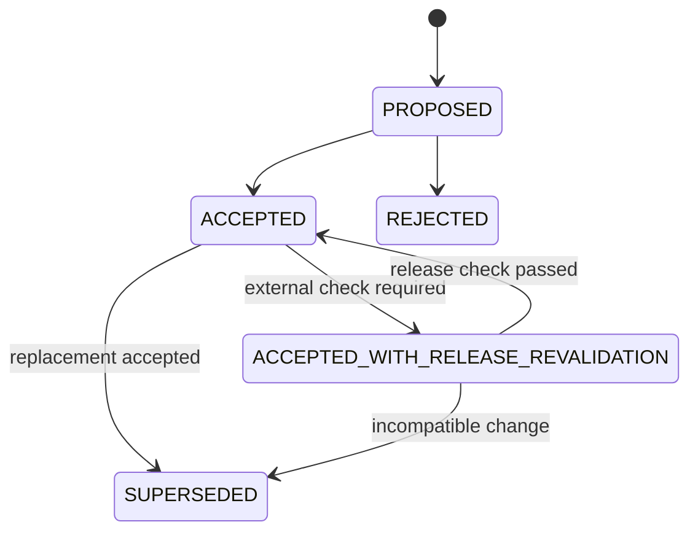

# 仲介エージェント決済統合：Decision Log・Open Questions

- lifecycle: `target`
- status: `ACCEPTED_WITH_RELEASE_REVALIDATION`
- requirements source: [統合要件](../MEDIATOR_PAYMENT_INTEGRATION_REQUIREMENTS.md)
- structure source: [設計書構成](../MEDIATOR_PAYMENT_INTEGRATION_DESIGN_STRUCTURE.md)
- decision owner: Design lead
- rule: 本書のdecisionは要件を弱めず、詳細は各semantic owner文書へ反映する

## 1. 文書の責務

本書は `OQ-001`〜`OQ-010` の選択肢、決定、根拠、影響先、検証影響、再確認actionを管理する正本である。要件本文、領域設計、candidate statusは所有しない。各decisionの意味はaffected design sectionへ反映し、当該節から本書へbacklinkする。

## 2. Decision statusと変更規則

| Status | 意味 |
| --- | --- |
| `PROPOSED` | 選択肢を比較中。target設計の根拠には使わない |
| `ACCEPTED` | 設計判断が確定し、affected sectionへの反映が必須 |
| `ACCEPTED_WITH_RELEASE_REVALIDATION` | target判断は確定。外部仕様または環境のrelease前再確認だけ未完了 |
| `REJECTED` | 採用しない。理由を保持する |
| `SUPERSEDED` | 後続decisionへ置換済み。元decisionを削除しない |

Decision変更は、affected requirement IDを満たす比較証跡、affected owner全員のreview、coverage manifestの `decision_refs` 更新を必要とする。実装都合、既存code、過去artifactだけを理由に規範要件を弱めない。

## 3. Open Question index

| ID | Status | Due gate | Primary owner | Release blocking action |
| --- | --- | --- | --- | --- |
| `OQ-001` | `ACCEPTED` | 設計確定前 | Domain／Persistence | なし |
| `OQ-002` | `ACCEPTED` | 設計確定前 | Domain／API | なし |
| `OQ-003` | `ACCEPTED` | 設計確定前 | Security／Persistence | migration negative test |
| `OQ-004` | `ACCEPTED_WITH_RELEASE_REVALIDATION` | 設計確定前、release前 | Payment／API | pinned spec再確認 |
| `OQ-005` | `ACCEPTED` | 設計確定前 | Security／Mediation | policy version test |
| `OQ-006` | `ACCEPTED_WITH_RELEASE_REVALIDATION` | Cloud Run受入前 | Platform／Security | IAM、quota、model readiness |
| `OQ-007` | `ACCEPTED` | 公開境界設計前 | Platform／Security | route black-box test |
| `OQ-008` | `ACCEPTED` | 設計確定前 | Payment／Security | offline evidence negative test |
| `OQ-009` | `ACCEPTED_WITH_RELEASE_REVALIDATION` | 設計確定前、release前 | Conformance | 一次資料とhash再確認 |
| `OQ-010` | `ACCEPTED` | UI設計前 | UI／Mediation | routing／browser test |

### 3.1 OQ-001 Continuation ownership

- status: `ACCEPTED`
- due gate: 設計確定前
- owner: Domain／Persistence owner
- reviewer: Mediation／Payment／Security owner
- options: 仲介DB所有、決済DB所有、二重所有
- decision: `MediationContinuation` は mediation aggregate の一部として `marketplace.db` のworkflow repositoryが所有する。payment workflowは同DB内の独立aggregateとし、continuationは `payment_workflow_id` とimmutable digestで参照する。Merchant Taskは `paid-agent.db`、evidence bytesは `evidence.db` が所有する。DBをまたぐ更新は単一transactionと見なさず、outbox／evidence intent／ackによるsagaで結ぶ。
- rationale: 仲介stepの停止・再開を決済aggregateへ従属させず、同じCASとoutbox transactionでstep stateとbridge intentを確定できる。異種DB間の偽のatomicityを避けられる。
- affected requirement IDs: `FR-006`、`FR-009`、`FR-013`、`DATA-001`〜`DATA-006`、`STATE-002`〜`STATE-005`
- affected design sections: `02` domain aggregate、`03` mediation flow、[08 Persistence](08_PERSISTENCE_RECOVERY.md#4-logical-modelからphysical-storeへのmapping)
- verification impact: continuation CAS、同一Task、cross-DB intent、checkpoint recoveryをintegration／restart testで検証する。
- decided at: 2026-08-16

### 3.2 OQ-002 Identifier normalization

- status: `ACCEPTED`
- due gate: 設計確定前
- owner: Domain／API owner
- reviewer: Security／Payment owner
- options: 全値統一、暗黙alias、明示mapping
- decision: security主体のcanonical Agent IDはTrusted Registryの不変ID `agent-005` とする。Registry名 `paid_booking_agent`、service／Agent Card名 `paid-booking-agent`、registry skill `paid_booking`、A2A skill `paid-booking` はversion付きallowlist `paid-booking-identifiers/v1` でのみ対応付ける。商品IDは `demo-paid-booking` とし、Agent ID／skill IDのaliasとして扱わない。Agent Card URLとRPC endpointは別の完全URLとして保持する。
- rationale: 既存fixtureとの互換を保ちつつ、未登録alias、endpoint差替え、文字列推測を拒否できる。
- affected requirement IDs: `FR-003`、`FR-008`、`FR-009`、`SEC-006`、`SEC-007`、`DATA-003`、`DATA-007`
- affected design sections: `02` identifier catalog、`06` Agent Registry／Card contract
- verification impact: allowlist内全mappingと、未登録alias／skill／endpoint差替えのnegative testを追加する。
- decided at: 2026-08-16

### 3.3 OQ-003 Subject migration

- status: `ACCEPTED`
- due gate: 設計確定前
- owner: Security／Persistence owner
- reviewer: Domain／QA owner
- options: demo subjectへ自動帰属、初回accessでclaim、legacy quarantine
- decision: 新規recordは検証済みFirebase `subject` を必須にする。既存のsubjectなしrecordは `legacy_unbound` としてread-only quarantineし、一般利用者による取得、承認、再開、artifact参照を拒否する。共通demo subjectへの自動帰属、workflow IDを知る利用者による初回claim、旧boolean承認の昇格は行わない。必要なfixtureは新schemaへ再生成する。
- rationale: 移行時の便宜による別subject間の越権を防ぐ。Cloud Runはephemeralであるため、旧状態を安全でないdefaultで延命する必要がない。
- affected requirement IDs: `SEC-001`、`SEC-002`、`DATA-001`、`FR-007`、`OPS-005`
- affected design sections: `02` subject binding、`05` authorization、[08 Migration](08_PERSISTENCE_RECOVERY.md#11-migrationと互換性)
- verification impact: legacy_unboundの全read／write／approve／resume拒否と異なる有効subjectのnegative testを必須にする。
- decided at: 2026-08-16

### 3.4 OQ-004 A2A payment contract version

- status: `ACCEPTED_WITH_RELEASE_REVALIDATION`
- due gate: 設計確定前およびrelease前
- owner: Payment／API owner
- reviewer: Conformance／Security owner
- options: 自由文互換、公式profileのみ、pinned v0.1＋明示simulation
- decision: approved target pinはA2A x402 Payments Extension v0.1、commit `125db5526a965d2325459d1a9df2e274a7e42396` とする。支払要求はA2A Task `input-required` とdotted metadata `x402.payment.status=payment-required`／`x402.payment.required` の組でのみ成立する。デモはproject-local URI、profile `x402-wire-simulation/1`、scheme `exact-simulated`、network `demo:local` を使う。公式URIとの混在、自由文判定、AP2-only／rail直接fallbackは禁止する。
- rationale: 現行pinと要件のwire shapeを維持しながら、simulationを公式profileから機械的に分離できる。
- affected requirement IDs: `FR-005`、`FR-009`、`SEC-004`、`SEC-013`、`SEC-015`、`DATA-004`
- affected design sections: `04` profile selection、`06` A2A payment contracts
- verification impact: spec hash、Task state、dotted metadata、profile混在、欠落／改ざんのfixtureをrelease前に再確認する。
- decided at: 2026-08-16

### 3.5 OQ-005 Detector policy

- status: `ACCEPTED`
- due gate: 設計確定前
- owner: Security／Mediation owner
- reviewer: QA／Domain owner
- options: 自然文recommendation、scoreのみ、version付きdeterministic wrapper
- decision: detector入出力は `mediation-anomaly-input/v1`／`mediation-anomaly-decision/v1` のstrict schemaとし、各callのtimeoutは30秒とする。critical issueまたはscore 70〜100はgateで `BLOCK`、score 30〜69は `REVIEW`、score 0〜29かつcriticalなしだけ `PASS` とする。final detectorでは同じ区分を `REJECT`／`REVIEW`／`ACCEPT` へ写像する。例外、timeout、schema不正、parse failure、証跡不足は `REVIEW` とし自動継続しない。決定論的な署名／相関／allowlist違反はmodel結果にかかわらず `BLOCK`／`REJECT` とする。
- rationale: modelの自然文や低confidenceのcritical issueを権限判断へ昇格せず、同じversionと入力digestで再現可能な停止規則を持てる。
- affected requirement IDs: `FR-010`、`FR-011`、`SEC-008`、`SEC-009`、`SEC-011`、`SEC-016`、`DATA-008`、`STATE-007`
- affected design sections: `03` gate schedule、`05` gate policy、`10` failure tests
- verification impact: threshold境界、critical、timeout、parse failure、callback例外を全gateとfinalで検証する。
- decided at: 2026-08-16

### 3.6 OQ-006 Model実行環境

- status: `ACCEPTED_WITH_RELEASE_REVALIDATION`
- due gate: Cloud Run受入前
- owner: Platform／Security owner
- reviewer: Mediation／Release owner
- options: Developer API key、Vertex AI、環境別混在
- decision: Cloud RunではVertex AIをApplication Default Credentialsで利用し、project `gen-lang-client-0585901015`、location `global` に固定する。component別model allowlistは、matcher／planner／orchestrator／final anomaly detector=`gemini-2.5-pro`、anomaly detector／Legacy callback security Judge=`gemini-2.5-flash` とし、設定値による別modelへの置換を拒否する。Cloud revisionはephemeral 4項目とVertex ADC 3項目のexact 7 non-secret envだけを許可する。目標構成では専用Cloud Run service accountへ最小のVertex AI呼出し権限だけを付与し、API keyを使わない。今回のephemeral demoは既存default Compute service accountを維持してIAMを変更せず、Vertex probe PASSをleast-privilege完了とは扱わない。専用service accountへの移行と不要権限除去は未完了security debtとしてreleaseを分ける。localは明示的なtest doubleまたはADCを使い、本番credentialを `.env` に置かない。認証済みreadinessは固定設定とAPI key不在を検証し、IAM、ADC token取得、model availability、quotaはCloud Run受入前のpre-traffic smokeで各modelへ副作用のない1回のprobeを送って確認する。
- rationale: Cloud Runの既存GCP identity境界を利用し、repository、image、command outputへのcredential露出を避ける。認証方式の安全化とIAM最小化は別の軸であり、ADC利用だけでdefault service accountの広い権限を正当化しない。
- affected requirement IDs: `NFR-004`、`OPS-009`、`SEC-010`、`TEST-006`、`TEST-011`、`TEST-014`
- affected design sections: [09 Configuration](09_DEPLOYMENT_PUBLIC_BOUNDARY.md#8-configurationsecretmodel実行環境)、`03` model call points
- verification impact: release前に固定model map、service account、IAM、quota、model availability、30秒timeoutを実環境で再確認し、pre-traffic smokeのmodel ID、結果、latency、revision digestを保存する。
- decided at: 2026-08-16

### 3.7 OQ-007 Public allowlist

- status: `ACCEPTED`
- due gate: 公開境界設計前
- owner: Platform／Security owner
- reviewer: UI／QA owner
- options: catch-all UI proxy、denylist追加、明示allowlist
- decision: nginxはmethod＋exact path／anchored prefixの明示allowlistを先に評価し、それ以外を404にする。unauthenticated allowlistはliveness、login、Firebase session exchangeの限定routeだけ、authenticated allowlistは `payment_user_agent` UIに必要なADK routeと `/mediation-api/` の限定routeだけとする。Store、汎用 `/api`、旧 `/ws`、Merchant `/a2a`、`/v1`、`/internal`、旧payment routeはexact／prefixとも常に404とする。
- rationale: upstreamの偶発的404や認証redirectではなく、proxy境界で外部到達不能を保証する。
- affected requirement IDs: `FR-002`、`FR-015`、`HTTP-001`〜`HTTP-006`、`OPS-006`
- affected design sections: [09 Public allowlist](09_DEPLOYMENT_PUBLIC_BOUNDARY.md#5-public-route-allowlist)
- verification impact: 未認証／認証済み、method、exact／prefix、WebSocket、偽造identity headerのblack-box matrixを固定する。
- decided at: 2026-08-16

### 3.8 OQ-008 Evidence envelope

- status: `ACCEPTED`
- due gate: 設計確定前
- owner: Payment／Security owner
- reviewer: Domain／Conformance／QA owner
- options: AP2 objectへ独自field追加、外部DB暗黙結合、署名付きproject-local envelope
- decision: AP2 canonical schemaへ仲介独自fieldを追加しない。pre-payment `mediation-authorization-envelope/v1` は二承認、Mandate、Task/termsまでをimmutableに署名し、receipt/resultを含まない。post-result `mediation-completion-manifest/v1` はauthorization digestからreceipt/result/observationへ一方向に参照する。相互digestと将来値のplaceholderを禁止する。
- rationale: AP2 schemaを壊さず、外部DBの暗黙知なしに全相関fieldと署名連鎖を検証できる。
- affected requirement IDs: `FR-008`、`SEC-012`、`DATA-002`、`DATA-005`、`TEST-002`、`REL-009`
- affected design sections: `04` evidence binding、`06` envelope wire、`08` evidence intent
- verification impact: 全必須fieldの一致と一fieldずつの改ざんnegative、外部DBなしのoffline verificationを必須にする。
- decided at: 2026-08-16

### 3.9 OQ-009 仕様version再確認

- status: `ACCEPTED_WITH_RELEASE_REVALIDATION`
- due gate: 設計確定前およびrelease前
- owner: Conformance owner
- reviewer: Payment／Security／Release owner
- options: 暗黙latest、現行pin維持、設計中にpin更新
- decision: target designはAP2 v0.2 commit `e1ea56db72a6385bce3e5c1112b3a56ce60acb43` とA2A x402 v0.1 commit `125db5526a965d2325459d1a9df2e274a7e42396` を維持する。`spec_manifest.json` のrepository、commit、path、SHA-256をimplemented pinとし、設計中にlatestへ追従しない。release前に公式一次資料とhashを再取得し、差分があれば暗黙更新せず新decisionと互換性reviewを行う。
- rationale: target、implemented pin、candidate適合のversion軸を分離し、文書上のversion driftを防ぐ。
- affected requirement IDs: `REL-006`、`REL-007`、`SEC-012`〜`SEC-015`、`CLAIM-003`
- affected design sections: `04` protocol meaning、`06` wire versioning、[09 Readiness](09_DEPLOYMENT_PUBLIC_BOUNDARY.md#9-readinessとhealth)、`11` release closure
- verification impact: release candidate buildでmanifest hashと一次資料差分を検査し、未確認ならclosureを失敗させる。
- decided at: 2026-08-16

### 3.10 OQ-010 再計画・取消・明示選択UX

- status: `ACCEPTED`
- due gate: UI設計前
- owner: UI／Mediation owner
- reviewer: Security／Product／QA owner
- options: 曖昧な自然文選択、最古pending自動選択、backend tokenによる明示選択
- decision: backendの排他的routing decisionを唯一の認可正本とする。優先種別が1件ならその対象を表示する。同種pendingが複数なら承認せず、安全な短縮IDと内容要約を一覧し、認証主体・session・mediation session・期限へ束縛したone-time selection tokenをUI controlで送る。選択は承認ではなく、選択後に単一text part完全一致 `承認` を別操作として要求する。拒否は対象stepを `Cancelled`、期限切れ・Checkout変更・上限超過は支払わずreplan可能な停止状態へ進め、新plan／Checkoutには新承認を要求する。
- implementation boundary: one-time tokenは将来の別public schema versionに対するaccepted targetである。final6 `mediation-turn-request/1` の `selectionToken` はJSON `null` だけを許し、non-null selectorを拒否し、同種pending複数は自動選択せずfail closedにする。
- rationale: `承認` の意味をUI都合で拡張せず、複数pendingでも対象取り違えを防げる。
- affected requirement IDs: `FR-007`、`UI-002`、`UI-003`、`UI-005`、`TEST-003`、`AC-003`〜`AC-006`
- affected design sections: `03` approval routing、[07 Backend routing結果](07_UI_TRACE.md#7-backend-routing結果と将来の明示選択view)
- verification impact: routing decision table全case、selection token replay／expiry、選択と承認の分離をunit／browser testで検証する。
- decided at: 2026-08-16

## 4. Decision record template

新規decisionは `status`、`due gate`、`owner`、`reviewer`、`options`、`decision`、`rationale`、`affected requirement IDs`、`affected design sections`、`verification impact`、`decided at` を必須とする。`PROPOSED` のdecisionは空欄にし、target設計へ取り込まない。

## 5. Assumption register

### ADR-011 Production composition seam

`ACCEPTED`。`payment_user_agent/agent.py:root_agent` からproduction factory/controller、typed adapterを経由し、既存matcher/planner/orchestrator/callback/detector symbolの実呼出しeventを残す。workflow-id直指定public mutationは廃止する。

### ADR-012 Release scope partition

`ACCEPTED`。Release-1 blockingは正常paid/free、基本refund、identity/public/Merchant最小開示境界の126件とし、下記13件はfuture-workにする。

### ADR-013 AP2 actor and demo guarantee

`ACCEPTED`。AP2 v0.2はShopping Agentをagenticと想定しpayment tool進行を禁じない。Human Presentのinformed consent/user signatureはMUST non-agentic Trusted Surface、roleのvalidation/processingはdeterministic codeで行う。LLM出力を承認／署名としないのは本projectの安全設計である。pre-payment authorization envelopeは仲介内部の証跡で、資金のauthorizeやholdを起こさない。`signed simulation guarantee`はAP2標準artifactでなく、法的保証やsettled証明ではない。現行railは実holdなしの同期simulation settlementだけを記録する。後段の後日精算モデルは本書のPROPOSED節へ隔離する。

### ADR-014 Refund normal path

`ACCEPTED`。refundは実settlement済みかつfulfillment失敗時の基本一回だけ。未精算 `GUARANTEED` はguarantee cancelとし、refundと呼ばない。

### ADR-015 Durable mediation stable state

`ACCEPTED`。local single-hostのauthoritative mediation stateはSQLite schema v4の `mediation_sessions_v4`/`mediation_requests_v4` を使い、AES-GCM、HMAC owner scope、CAS、request reservation、decryptable key sentinelを必須とする。Cloud Runはこの永続性を主張せず、明示した `EPHEMERAL DEMO` memory profileのみとする。pre-sentinel v4は自動信頼せず、明示reset/migrationを要求する。

### Future work register

`FR-017`, `STATE-008`, `OPS-004`, `OPS-005`, `TEST-009`, `TEST-013`, `TEST-017`, `TEST-018`, `AC-005`, `AC-007`, `AC-008`, `AC-011`, `AC-015` の13件は `future-work`。高度restart/first-response-loss完全回復、external effect直後のcrashと複雑retry/concurrency、DNS rebinding、全malicious/price-expiry matrix、Cloud SQL/複数instance共有状態を含む。トリガはRelease-1正常系完了後の別ADRと脅威／運用test基盤の準備である。

### Proposed: 仲介をpayeeとする後日精算モデル

- status: `PROPOSED`／`NOT IMPLEMENTED`
- 現行仕様では仲介はworkflow／payment authority ownerであってpayeeではない。payeeは`demo-merchant`で、SQLite simulation ledgerが`demo-customer`から`demo-merchant`への効果を同一同期フローで記録する。
- 仲介をpayeeにして外部Agentへ後日精算する二段階債務モデルは、法的保証、債権、資金保全、reconciliation、failure ownershipを別途設計・承認するまで、現行本文・UI・証跡の説明に使用しない。
- trigger: 実決済レール、契約主体、会計／法務要件を含む別ADRの承認。

| ID | Assumption | 検証gate | 失敗時 |
| --- | --- | --- | --- |
| `ASM-001` | 対象demoは一利用者・一tenant・一Merchant・一商品・一数量・一通貨 | requirements／browser review | scope変更decisionへ戻す |
| `ASM-002` | Cloud Runは一時demoで、instance置換を越えるdurabilityを提供しない | deployment／UI review | durable claimを拒否する |
| `ASM-003` | Official x402のwallet／facilitatorは未実装 | conformance review | official profileをfail closedにする |

## 6. Superseded decision index

現時点でsuperseded decisionはない。将来は元ID、後継ID、理由、変更された要件／設計／testをappend-onlyで記録する。

## 7. 期限到来済みblocker

設計確定前OQはすべて `ACCEPTED` または `ACCEPTED_WITH_RELEASE_REVALIDATION` である。未完了なのは次のrelease時外部確認だけであり、target設計を未確定にはしないが、未確認のcandidateをreleaseできない。

- `OQ-004`／`OQ-009`: AP2／A2A x402一次資料、commit、path、hash、互換性差分。
- `OQ-006`: Vertex AI model availability、service account、IAM、quota、timeout。

## 8. 関連文書と反映確認

| 参照先 | 方向 | 再掲しない内容 |
| --- | --- | --- |
| [Domain／State](02_DOMAIN_DATA_STATE.md) | accepted decision input／backlink | aggregate・state本文 |
| [Mediation Flow](03_MEDIATION_FLOW.md) | accepted decision input／backlink | approval routing・gate順序 |
| [Payment Bridge](04_PAYMENT_BRIDGE_AP2_X402.md) | accepted decision input／backlink | AP2／profile本文 |
| [Security](05_SECURITY_TRUST_BOUNDARIES.md) | accepted decision input／backlink | policy本文 |
| [API／A2A](06_API_A2A_CONTRACTS.md) | accepted decision input／backlink | wire schema |
| [UI／Trace](07_UI_TRACE.md) | accepted decision input／backlink | view model |
| [Persistence／Recovery](08_PERSISTENCE_RECOVERY.md) | accepted decision input／backlink | DB mapping／recovery本文 |
| [Deployment](09_DEPLOYMENT_PUBLIC_BOUNDARY.md) | accepted decision input／backlink | route／deploy本文 |
| [Test Strategy](10_TEST_STRATEGY.md) | accepted decision input／backlink | test case本文 |
| [Traceability／Release](11_TRACEABILITY_RELEASE.md) | decision dependency／backlink | coverage／release status |

## 9. final6 candidate addendum（2026-08-17）

final6 exact image `sha256:3e4e089643564e00bd6563d08a575fcf2aa2eff94ae60fd1ca518900022a89f0` は、local single-host simulationとしてADR-011〜015の実装境界を確認した。SQLite schema v4のauthoritative mediation sessionは `WaitingForPaymentApproval` v2でcontainer restartを越えて完全一致し、承認後の `Completed` v5、同一request replay、二回目restart後のterminal viewも一致した。三DBは `quick_check=ok`、business count不変、wrong-owner viewは `null` である。

この結果は次だけをcandidate事実として確定する。

- local named-volume profileではmediation／payment／Merchant／evidenceの整合したrestart recoveryを確認済み。
- Cloud Run profileは `MEDIATION_STORE_MODE=memory` の `EPHEMERAL DEMO` であり、local v4のdurabilityを継承しない。
- `x402-wire-simulation/1` とデモ独自guaranteeだけが実行済みで、official x402、wallet、facilitator、on-chain適合を意味しない。
- exact-image canonical regression、real-browser 4 case、11-marker release validatorはPASSしたが、126件を個別PASSへ結ぶcandidate ledgerは未完了である。

次はすべて **NOT RUN** のままであり、OQ statusを `ACCEPTED` へ進めない。

| Gate | Status | Decision impact |
| --- | --- | --- |
| 実Firebase credential／ID token exchange | `NOT RUN` | local session fixtureを本番認証証跡へ転用しない |
| Vertex ADC／IAM／quota／model availability | `NOT RUN` | OQ-006を維持する |
| official AP2／x402 wallet・facilitator・on-chain | `NOT RUN` | OQ-004／009と`NOT CONFORMANT`表示を維持する |
| Cloud Run build／push／revision／tag／traffic | `NOT RUN` | deployed、durable、production-readyを主張しない |
| external-effect直後crash、first-response-loss、複雑競合 | `NOT RUN`／future-work | 13件のfuture registerとtriggerを維持する |

したがってtarget decisionは確定しているが、final6の判定は「local simulation candidate verified／external release gates not run」である。Cloud Run受入、公式適合、製品releaseの承認ではない。

この表はfinal6時点の履歴snapshotである。後続Cloud Run正常系hotfixのFirebase／Vertex／deploy受入結果は [Test Report](../MEDIATOR_PAYMENT_INTEGRATION_TEST_REPORT.md#13-cloud-run-acceptance-addendum2026-08-30-jst) が所有する。後続結果もephemeral simulation、official x402／on-chain `NOT RUN`、Cloud refund未再実行という境界を変更しない。
