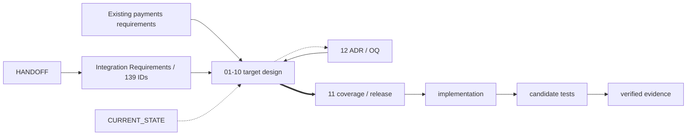

# 仲介エージェント決済統合：設計書索引

- lifecycle: `target`
- status: 設計baseline
- 対象: `payment_user_agent` から内部 `secure_mediator` を経由し、必要なstepだけをAP2／x402決済へ接続する設計
- 非主張: 本書群の存在は実装済み、candidate検証済み、公式x402準拠を意味しない

## 1. 設計対象と文書status

本ディレクトリは、従来仲介経路を決済workflowで置換せず、検証済みの `payment-required` を受けたstepだけを停止・支払・再開する目標設計の正本である。全13ファイルは `target` lifecycleに属し、実装とrelease証跡は別ownerが閉じる。

状態語は `target`、`implemented`、`verified` を混同しない。本設計の適用後も、code差分がなければ `implemented` ではなく、candidate ledgerが閉じなければ `verified` ではない。

2026-08-17のcurrent implementationはfinal6 image `sha256:3e4e089643564e00bd6563d08a575fcf2aa2eff94ae60fd1ca518900022a89f0` に対応する。paid/free/refund、Trusted Surfaceの二承認、AP2 Mandate検証、仲介保証、same Task resume、single authority、v4 SQLite mediation storeは実装済み。Cloud Runは `EPHEMERAL DEMO` でdurabilityを提供せず、official x402、wallet/facilitator、on-chain、Cloud SQL、external-effect crash完全回復は将来課題である。candidate証跡は [Test Report](../MEDIATOR_PAYMENT_INTEGRATION_TEST_REPORT.md) を正本とする。

その後のCloud Run正常系hotfixでは、Vertex ADCのexact 7 env、stable security Judge、live external A2Aのagent別TaskStore、無料限定のstrict `completed`＋nonempty text/file artifact検証を実装し、Firebase認証後のpaid／free／reload／logoutを確認した。可変revision、image digest、検証時刻と制約は引き続き [Test Report](../MEDIATOR_PAYMENT_INTEGRATION_TEST_REPORT.md) と機械可読なdeployment evidenceだけが所有する。

## 2. 規範入力と正本階層

優先する規範入力は [HANDOFF](../MEDIATOR_PAYMENT_INTEGRATION_HANDOFF.md) と [139件の統合要件](../MEDIATOR_PAYMENT_INTEGRATION_REQUIREMENTS.md) である。両者に解釈差があれば、後からscope overrideされた統合要件の `release_scope` を優先し、それ以外はHANDOFFをrequirements ownerへ戻す。既存paymentsの非変更領域は [既存REQUIREMENTS](../REQUIREMENTS.md) を維持し、設計だけで上書きしない。

protocolのtarget pinは [Decision LogのOQ-009](12_DECISIONS_OPEN_QUESTIONS.md#oq-009) とそれが指す一次資料、対象revisionのimplemented pinは `secure_mediation_agent/spec_manifest.json`、candidateの適合結果は `docs/ap2_x402_conformance_report.json` がそれぞれ所有する。

設計前の [CURRENT_STATE](../MEDIATOR_PAYMENT_INTEGRATION_CURRENT_STATE.md) と [要件レビュー](../MEDIATOR_PAYMENT_INTEGRATION_REQUIREMENTS_REVIEW.md) は履歴入力であり、目標設計を変更しない。

## 3. 推奨する読み順

1. [01 概要・アーキテクチャ](01_OVERVIEW_ARCHITECTURE.md)
2. [02 Domain・Data・State](02_DOMAIN_DATA_STATE.md)
3. [03 Mediation Flow](03_MEDIATION_FLOW.md)
4. [05 Security・Trust Boundary](05_SECURITY_TRUST_BOUNDARIES.md)
5. [04 Payment Bridge・AP2・x402](04_PAYMENT_BRIDGE_AP2_X402.md)
6. [06 API・A2A Contract](06_API_A2A_CONTRACTS.md)
7. [07 UI・Trace](07_UI_TRACE.md)
8. [08 Persistence・Recovery](08_PERSISTENCE_RECOVERY.md)
9. [09 Deployment・Public Boundary](09_DEPLOYMENT_PUBLIC_BOUNDARY.md)
10. [10 Test Strategy](10_TEST_STRATEGY.md)
11. [11 Traceability・Release](11_TRACEABILITY_RELEASE.md)
12. [12 Decision Log・Open Questions](12_DECISIONS_OPEN_QUESTIONS.md)

## 4. 文書責務一覧

**TBL-INDEX-01 文書ownerとrequired reviewer**

| 文書 | Primary owner | Required reviewer | 正本とする内容 |
| --- | --- | --- | --- |
| `README` | 設計lead | 各領域owner | 読み順、正本入口、依存関係 |
| `01` | Architecture owner | Security／Platform | context、component、依存方向 |
| `02` | Domain／data owner | Workflow／Persistence | domain、ID、snapshot、state、canonical digest |
| `03` | Mediation workflow owner | Security／Payment | 制御順序、承認routing、gate schedule |
| `04` | Payment protocol owner | Security／Conformance | bridge意味論、AP2 evidence、profile選択 |
| `05` | Security owner | Architecture／QA | trust boundary、gate policy、fail closed |
| `06` | API／A2A owner | Security／Consumer | DTO、wire、version、error |
| `07` | UI owner | Security／Product／QA | UI projection、trace表示 |
| `08` | Persistence owner | Workflow／SRE／QA | physical mapping、CAS、outbox、recovery |
| `09` | Platform／SRE owner | Security／Release | process、route、fixed deploy target |
| `10` | QA owner | 各領域owner | test設計、AC scenario |
| `11` | Release／QA owner | Requirements／Security | 139件coverage、release scope、release closure、claim |
| `12` | 設計lead | affected owner | ADR／OQの状態、期限、反映確認 |

## 5. 要件coverage要約

機械可読な唯一のdesign coverage正本は [11のYAML front matter](11_TRACEABILITY_RELEASE.md) である。要件集合は139件、`release-1-required: 126`、`future-work: 13` である。primary owner割当ては `01:1`、`02:21`、`03:7`、`04:8`、`05:10`、`06:4`、`07:11`、`08:6`、`09:15`、`10:32`、`11:24` とする。本文のowner tableはその生成viewであり、手編集を正本にしない。

## 6. 文書間依存

**FIG-INDEX-01 正本・設計・検証の依存graph**

実線は規範・accepted decision入力、太線はcoverage集約、破線は非規範参照またはbacklinkである。

## 7. 変更・レビュー規則

- 要件ID、artifact semantics、wire schema、永続mapping、UI projectionを別ownerへ越境して再定義しない。
- `ART-*`、図表IDは全設計書で一意とする。
- security、支払認可、公開route、claimの変更はSecurity reviewerを必須とする。
- accepted ADRは領域文書へ反映して双方向linkを付ける。未決OQを仮決定として実装しない。
- coverage YAMLから生成したowner tableとmatrixは、generator marker・version・digestを伴い、差分があれば生成を停止する。

## 8. 実装後の反映先

targetがcode／schema／configuration／testへ反映された後に、対象revisionの説明として `ARCHITECTURE.md`、`AP2.md`、`A2A_X402.md` を更新する。candidateを検証してから `VERIFICATION.md`、`OPERATIONS.md`、`DEMO.md`、conformance report、PR説明へ反映する。設計書だけを先に「実装済み」「適合済み」と表現しない。
